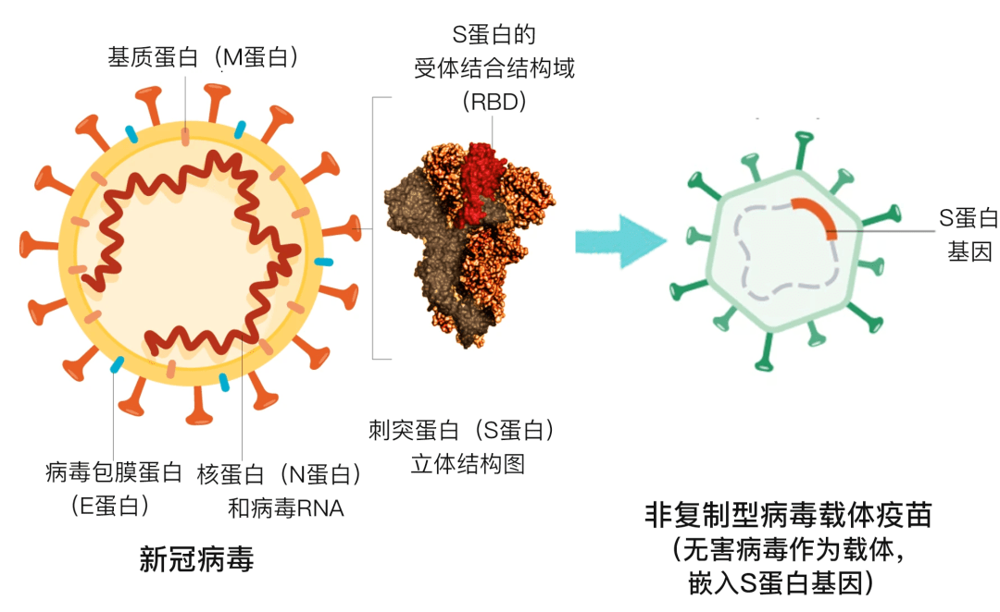
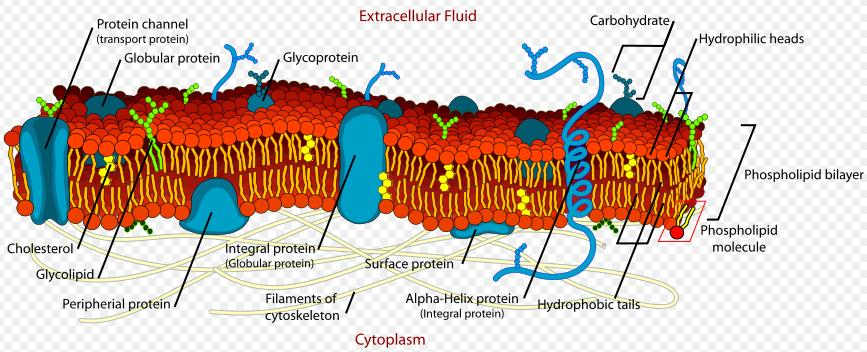

#### 1\. 细胞

#### 2\. 非细胞形态生命体\[\[Chapter3 病毒Virus]]

* 按照结构分类

  * 真病毒：至少含有核酸和蛋白质两种组分的病毒
  * 亚病毒

    * 类病毒(viroid) :目前已知最小的可传染的致病因子,只含具有独立侵染性的RNA组分,如柑桔裂皮病类病毒
    * 拟病毒：只含不具有独立侵染性的DNA或RNA组分
    * 朊病毒：只含单一蛋白质组分，如风牛病病原
* Virus Variants病毒的变异

  * 病毒容易发生变异，可以随着外界因素刺激加快变异
* Invasion mechanism of 2019-nCoV

  * !\[\[Pasted image 20250619153412.png|300]]
  * 病毒依靠表面的S蛋白与人体细胞表面的血管紧张素转换酶2(ACE2)受体结合，才能够吸附到细胞上并侵入细胞
  * 而人体对S蛋白发生免疫反应产生的抗体，可以与S蛋白结合，使病毒失去吸附人体细胞的能力，就能阻止感染

#### 2\. 以2019-nCOV为例的病毒疫苗种类

* **灭活病毒疫苗**

  * 灭活疫苗主要有效成分为灭活的病毒颗粒， ==包含所有的病毒结构组分== ，接近或等于天然病毒颗粒，是最易于研制的疫苗种类

* 特点：使用时间长e.g.脊灰灭活疫苗、甲肝灭活疫苗、手足口疫苗，全人群常用的疫苗有狂犬病疫苗，新冠疫苗
* 缺点：

  * 不能模拟病毒的感染过程，对免疫系统的刺激比较弱，通常只产生以抗体为主的体液免疫；
  * 需要先培养活病原体，再灭活做成疫苗，对生产车间的生物安全等级要求高，产量也受到一定的限制
  * 在病毒培养和疫苗制备过程中，可能易残留宿主蛋白或其他杂质成分，除了可能影响免疫效果外，同时增加了不良反应的可能性
* **2019-nCOV重组蛋白疫苗**

  * 这种疫苗的本质是 将有效的**抗原成分**经过基因工程改造，在其他细胞内完成蛋白表达，然后  ==分离目标蛋白==  、添加保护剂等，最终封装为市面上出售的疫苗
  * 重组蛋白疫苗目标非常精确，就是病原体的关键蛋白成分，所以它的效果和安全性很可能优于灭活疫苗。其生产过程也不会产生活病原体，对生物安全的要求低
  * 由于表达宿主的限制，复制出的蛋白与天然蛋白常常不同，可能影响免疫原性。后期需要进行纯化分离与封装，也面临杂质的影响问题
* 2019-nCOV病毒载体疫苗
 
  * 特点：产能最高，但不良反应多，安全性有待观察
  * 原理：把编码病毒S蛋白的基因转到人体细胞中，让人体细胞自己来生产S蛋白
* 核酸疫苗

  * DNA疫苗则有可能整合到人体基因里，其安全性还有待观察，所以进展缓慢
  * 从新冠mRNA疫苗来看，有效性已经得到了公认，但安全性方面，其常见的不良反应率明显高于灭活疫苗。一般认为，mRNA疫苗可以刺激人体的抗体免疫和细胞免疫

## 三、细胞的进化演变

#### 1\. 古细菌archaebacteria\[\[Chapter1 细菌Bacterium]]

* 定义：常生活于热泉水、缺氧湖底、盐水湖等极端环境中的原核生物

  * 细胞产能、细胞分裂、新陈代谢等生活方式与原核细胞相似，而复制、转录和翻译则更接近真核生物
  * 翻译时以甲硫氨酸为蛋白质合成的起始氨基酸，细胞壁中无肽聚糖，不同于细菌，核糖体蛋白与真核细胞的类似

#### 2\. 原核细胞Prokaryoter

* 主要特征：

  * 没有以核膜为界的细胞核， 也没有核仁， 只有拟核
  * 进化地位较低。细胞器只有核糖体，有细胞膜，成分与真核细胞不同。细胞较小，没有成型的细胞核，没有染色体，DNA不与蛋白质结合
  * 包括支原体、细菌和蓝藻等，属单细胞生物
* CRISPR/Cas\[\[Chapter1 基因组编辑的发现及应用]]

#### 3\. 真核生物eukaryotes

## 四、质膜与细胞表面

#### 1\. 概念：

* 质膜(plasma membrane)是每个细胞把自己的内容物包围起来的一层界膜，又称细胞膜(cell membrane)，一般厚度在5～10 nm\[\[Chapter4 细胞基质与内膜系统]]

  * 质膜与细胞内膜(即各种细胞器的膜)具有共同的结构和相近的功能，统称为**生物膜**，也常统一简称为膜(membrane)
  * 质膜使细胞与外界环境有所分隔，而又保持种种联系
* **单位膜模型unit membrane model**：Robertson于1959年用超薄切片技术获得了清晰的细胞膜照片，显示暗-明-暗三层结构,厚约7.5nm

  * 它由厚约3.5nm的双层脂分子和内外表面各厚约2nm的蛋白质构成
  * 贡献以及对膜属性的解释：脂质双分子层、膜对于脂溶性差的小离子通透性差
* **流动镶嵌模型(Fluid mosaic model)**

  * 内容：

    * 双层磷脂分子亲水端向外、疏水端向内排列；
    * 蛋白质以不同形式镶嵌在膜中间或结合在膜表面；
    * 细胞膜与膜蛋白、膜蛋白与其它分子之间的相互作用是复杂有序的，导致膜只具有相对的流动性
 
  * 结构：

    * 膜脂：

      * 磷脂(Phospholipid):含有磷酸的脂类,质膜的主要成分(>50%)。一端为亲水的含氮或磷的尾，另一端为疏水(亲油)的长烃基链；脂肪酸(主要为饱和脂肪酸)碳链为16、18或20;
      * 糖脂(Glycolipid):含有糖基配体的脂类化合物,总脂质的5％；
      * 胆固醇(Cholesterol):又称胆甾醇，是一种环戊烷多氢菲的衍生物，平均约占膜20%

        * 形成胆酸
        * 构成细胞膜
        * 作为前体物质合成激素e.g.皮质醇、醛固酮、睾丸酮、雌二醇以及维生素D等类固醇激素
    * 膜蛋白：

      * **膜内在蛋白(integral proteins)**：多为跨膜蛋白(transmembrane proteins)

        * 与膜结合的方式：其疏水核心与疏水的膜相互作用 (最常见，最稳定);带电荷的残基与磷脂结合；通过硫脂键或糖脂键结合
      * **膜周边蛋白/外在蛋白(peripheral/extrinsic proteins)**：水溶性蛋白，主要靠微弱的离子键维持在膜表面。非常容易被洗脱
      * 脂锚定蛋白(Lipid-anchored proteins):通过共价健的方式同脂分子结合，位于脂双层的外侧。同脂的结合有两种方式，一 种是蛋白质直接结合于脂双分子层，另一种方式是蛋白并不直接同脂结合，而是通过一个糖分子间接同脂结合

以下是本章的pdf版笔记，可直接阅读：

* [测试下载 PDF](../../assets/pdf/2025Spring/Cell_Biology/Chapter1_细胞.pdf)

{ type=application/pdf style="min-height: 60vh; width: 100%" }
