## 一、相关研究
#### 1. 植物感受低温的机制 #待解决 
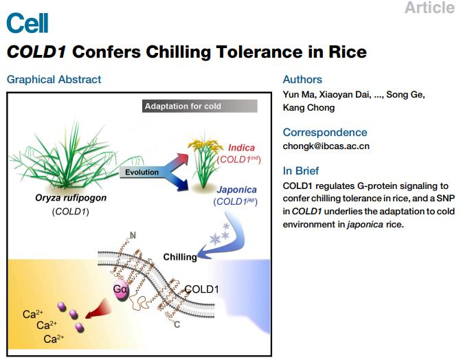
- 植物感受低温的机制（COLD1 基因、泛醌 / 萜醌代谢网络）

#### 2. 嗅觉机制
- 人类鼻腔内的嗅觉上皮分布着大量的嗅觉受体细胞，这些细胞表面的嗅觉受体属于 ==G蛋白偶联受体超家族== 。 ^bd0a2f
1. 气味分子进入鼻腔后，会与相应的嗅觉受体进行特异性结合，激活受体细胞。
	1. 胶质细胞在感受到外界刺激后，会释放出具有抑制作用的GABA→控制神经元使其对气味的敏锐度降低
		- GABA：4-氨基丁酸，作为一种氨基酸在脊椎动物、植物和微生物中广泛存在
2. 信号转导：嗅觉受体与气味分子结合后，通过G蛋白偶联的信号转导通路，引发细胞内的一系列生化反应。如激活腺苷酸环化酶，使细胞内的cAMP水平升高，进而导致钠离子和钙离子通道的开放，使嗅觉受体细胞产生兴奋性突触后电位。
3. 神经信号传递：兴奋的嗅觉受体细胞将电信号传递至嗅球，嗅球对来自不同嗅觉受体的信号进行整合和初步处理。然后，嗅球将信号进一步传递到大脑的其他区域，如嗅觉皮层、边缘系统等，最终在大脑中形成对气味的感知和识别，并可能引发相应的情绪和记忆反应。

#### 3. 温度和压力感受器
- 诺奖相关
	- 1944年，Joseph Erlnger和Herbert Gasser因发现不同类型的感觉神经纤维而获得诺贝尔生理学或医学奖。
	- 1967年，George Wald通过生物化学手段揭示视网膜紫质感光的生化反应，成为诺贝尔生理学奖的获奖者之一。
	- 在嗅觉领域，2004年，Richard Axel和Linda B. Buck由于在人体气味受体和嗅觉系统组织方式研究中的贡献，获得了诺贝尔生理学或医学奖。
- 压力感受器的发现
	- 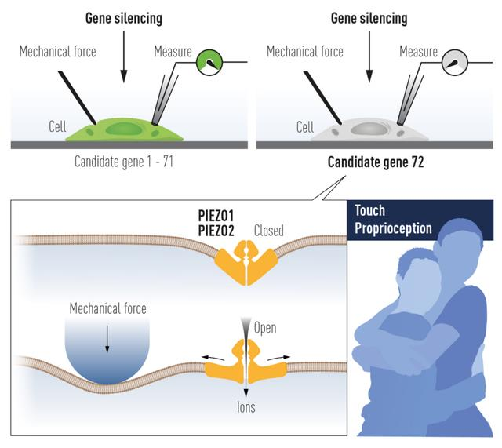
	- Piezo 1是一种细胞膜“离子通道”蛋白。当它感知道机械力时，通道打开，离子进入细胞，向大脑发送信号，即Piezo蛋白能控制触觉。
	- 用黑色针头戳细胞膜（施加机械力刺激），在另一侧用玻璃电极记录细胞膜上的电流变化。细胞膜受力后，Piezo通道打开，阳离子流入细胞，玻璃电极即记录到内流电流
		- Piezo1蛋白在膀胱细胞中工作，例如检测膀胱何时充满，检测并帮助调节血压的变化
		- Piezo2蛋白在皮肤和关节的感觉神经末梢起作用，帮助调节触觉、痛觉和本体感觉。
#### 4. 水通道蛋白Aquaporin
- 水通道蛋白是一种位于细胞膜上的蛋白质（内在膜蛋白），在细胞膜上组成“孔道”，可控制水在细胞的进出
	- 主要大量存在于哺乳动物的肾脏，也存在于植物种
- 1988年Agre在分离纯化红血球细胞膜上的Rh血型抗原时，发现了一个 ==疏水性跨膜蛋白== ，称为CHIP28
- 1991年，Agre将CHIP28的mRNA注入非洲爪蟾卵中
	- 在低张溶液中，卵迅速膨胀，并于5 分钟内破裂
	- 纯化CHIP28置入脂质体，也得到同样结果
	- 细胞这种吸水膨胀现象会被Hg2+抑制，而这是已知的抑制水通透处理措施。
	- 这一发现揭示细胞膜上确实存在水通道
#### 5. 病毒进入人体的机制
- 埃博拉病毒
	- 属于一种囊膜病毒
	- 过程：黏附到宿主细胞膜表面→胞吞作用形成内吞体→在内吞体内病毒发生膜融合，释放自身的遗传物质
- HIV病毒→缺乏最理想的动物模型
	- 假说一：
		- 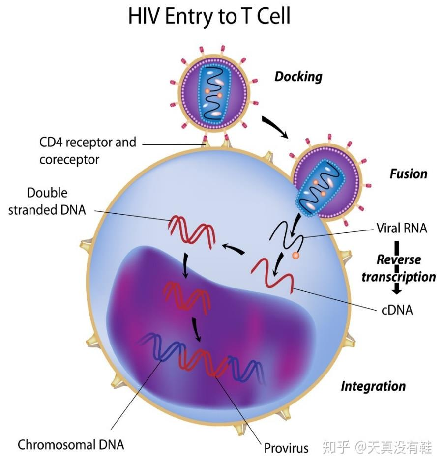
		1. 当HIV进入体内跟T细胞相遇，病毒“钩子”中的gp120蛋白和细胞表面的CD4蛋白结合形成gp120和CD4的复合物
			- HIV除了感染T细胞也感染其他表达CD4的细胞，如巨噬细胞、抗原呈递细胞等
		2. 包膜融合后它的包膜蛋白留在外边。HIV侵染T细胞不符合胞吞的定义，包膜融合之后只有酶和核酸进入了细胞，而不是胞吞的一整个囊泡进入胞内。
	- 假说二
		- 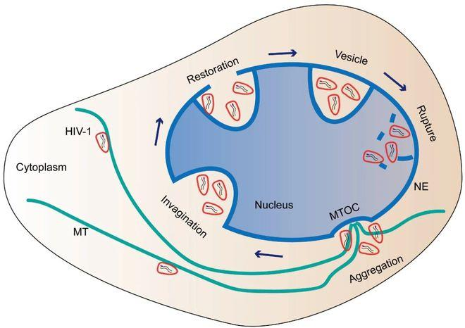
		- 经典理论：HIV进入细胞后，在细胞质发生反转录和脱壳，释放的基因组通过核孔入核，再发生染色体整合
		- 然而，近年研究发现细胞核中也存在病毒衣壳，且发挥整合位点选择、免疫逃逸等功能。由于携带衣壳的病毒核心尺寸远比细胞核孔大，其穿越核膜的方式成为质疑要点
			- HIV-1进入宿主细胞核的过程类似于细胞内吞，故称为似核内吞途径
## 二、细胞信号转导
#### 1. 信号分子与信号转导
- 信号分子
	- 化学信号
		- 亲脂性信号(甾类激素和甲状腺素)
			- 小，疏水性强，可穿过细胞膜  ==进入细胞==  ，与细胞质或细胞核中受体结合，  ==形成复合物==  ，调节基因表达
			- 植物中的油菜素内酯
		- 亲水性信号(神经递质、生长因子、多数激素):
			- 是第一信使，不能穿过靶细胞质膜，而是通过  ==与细胞表面受体结合==  ，再经信号转换机制，在细胞内产生第二信使或激活蛋白激酶或磷酸酶
			- 植物中的糖、ROS(reactive oxygen species)、Ca2+、JA、SA等
	- 物理信号
	- 气体信号:自由扩散、激活腺苷酸环化酶、产生第二信使能进入细胞，直接激活效应酶，参与许多生理、病理过程
- 信号细胞：通过外排分泌和穿膜扩散释放信号分子。可远距离作用、作用临近细胞、或信号细胞本身
	- 细胞分泌化学信号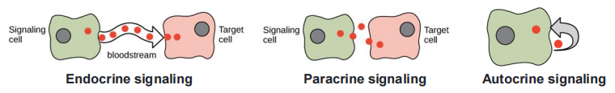
		- 内分泌：由内分泌细胞分泌信号激（素）到血液中  ==血液循环==  作用于靶细胞。特点：低浓度、全身性、长时效
			- 对于植物来说，长距离依靠的是
		- 旁分泌：细胞分泌局部化学介质到 ==细胞外液== 中，经局部扩散并作用于靶细胞
		- 自分泌：细胞对自身产生的分泌物质产生反应，常见于癌变细胞
	- 突触信号：细神经递质由突触前膜释放，经突触间隙扩散到突触后膜，作用于靶细胞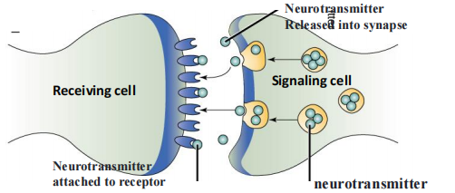
	- 细胞间接触性依赖：细胞间直接接触而无信号分子的释放,通过与质膜上的信号分子与靶细胞膜上受体分子作用来介导通讯
		- 动物相邻细胞形成间隙连接，植物细胞间通过胞间连丝
- 靶细胞：信号分子作用的效应细胞
	- 专一识别信号
		- 细胞按发育编程在不同分化阶段，分别与专一的信号分子结合，对诸如分化信号、增殖信号或其他功能信号发生反应。
	- 反应差异。细胞环境中有数百种信号分子，通常以 ==组合== 的方式起作用；数百种分子可形成几百万种组合，细胞仅利用有限的几种分子来调控其行为
	- 靶细胞受体
		- 一种能够识别和选择性结合某种配体（信号分子）的大分子，当与配体结合后→通过信号转导(signal transduction)作用将胞外信号转换为胞内化学或物理的信号，启动一系列分子生理生化过程，最终表现为生物学效应。
		- 根据受体在靶细胞中的存在部位：表面受体和胞内受体
			- 表面受体类型：离子通道偶联受体; G-蛋白偶联受体[[#^a3585c]]; 酶偶联受体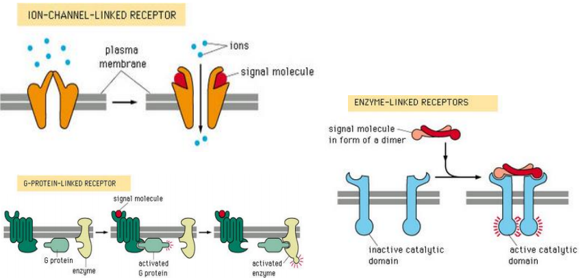
#### 2. 信号转导Signal transduction
- 受体与配体的结合：通过信号转导途径，将胞外信号转换成胞内化学、物理的信号，引发主要的细胞反应
	- 细胞内预存蛋白的活性/功能改变
	- 影响细胞内特殊蛋白的表达量
- 类型
	- 受体的激活→级联反应
	- 受体失敏关闭反应
	- 减量调节降低反应
- 调控
	- 分子开关
		- 机理
			- classⅡ：phosphorylation and dephosphorylation![Pasted image 20250429140745.png|300]]
				- 通过蛋白激酶(protein kinase)→靶蛋白磷酸化，通过蛋白磷酸水解酶→靶蛋白去磷酸化，从而调节靶蛋白的活性
				- 在蛋白激酶的催化作用下，磷酸基团由供体分子转移到蛋白质 ==含有羟基的氨基酸侧链== 上，具有可逆性。
					- Tyr/Thr/Ser
			- GTP和GDP的交替结合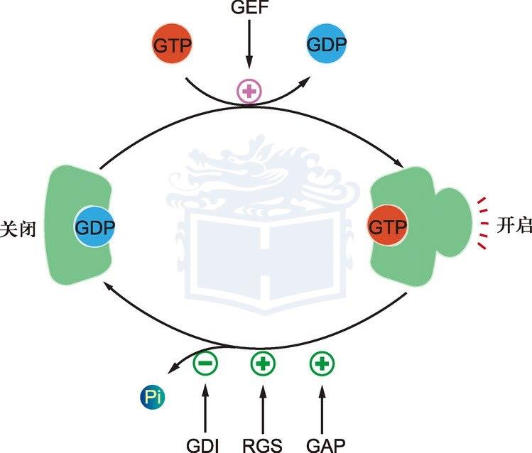
## 三、 Signaling messenger #学科链接 生物化学
#### 1. Signaling messengers
- 第一信使：指细胞外信号分子（配体,如激素、生长因子等），可与膜上受体特异结合
- 第二信使：第一信使与受体作用后在细胞内最早产生的信号分子
	- 类型
		- 疏水性分子DAG(diacylglycerol), PI(phosphatidylionsitos)
		- 亲水性分子：cAMP, cGMP, IP3, Ca2+, H2O2
		- 气体分子：NO, CO, H2S
	- 功能：启动和协助细胞内信号的逐级放大
#### 2. 相关受体
- G蛋白偶联受体（鸟嘌呤核苷酸结合蛋白偶联受体）,是一大类膜蛋白受体的统称。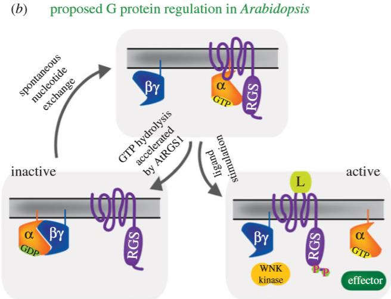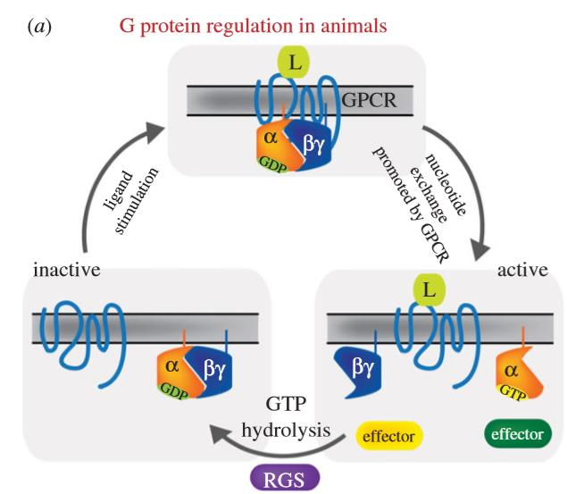 ^a3585c
	- 特点：其立体结构中都有七个跨膜α螺旋，且其肽链的C端和连接第5和第6个跨膜螺旋的胞内环上都有G蛋白（鸟苷酸结合蛋白）的结合位点。
	- 主要功能 
		- 通过与G蛋白相互作用将细胞外的信息传递到细胞内
		- G蛋白偶联受体识别各种配体和刺激物，包括激素和神经递质、趋化因子、前列腺素、蛋白酶、生物胺、核苷、脂类、生长因子、气味分子和光线。 ^a3b0db
		- G蛋白偶联受体介导的多种信号通路受激素控制，这些通路之间都是动态调节
	- 在受体水平可通过抑制G蛋白偶联受体与G蛋白偶联、细胞表面受体的再分配以及受体的降解等方式进行调节
		- 两种蛋白家族-GRKs（G蛋白偶联受体激酶）和抑制蛋白发挥关键作用
			- GRKs是一簇与G蛋白偶联受体( GPCRs) 快速失敏相关的激酶，许多GPCRs 如阿片受体、血栓素受体、5-羟色胺受体、肾上腺素能受体等在激动剂持续刺激时易发生转导信号的快速衰减,这种调节机制主要与GRKs有关。
			- GPCR是药理学上重要的蛋白家族。涉及这些受体途径的药物数以百计，包括抗组胺剂，安定药，抗抑郁药以及抗高血压的药物。
#### 2. Pathways
1. cAMP-PKA途径
	- PKA系统(protein kinase A system) ： cAMP作为第二信使主要是通过激活蛋白质激酶A进行信号放大
		- Sutherland 因阐明cAMP功能并提出第二信号学说而获诺贝尔生理学和医学奖(1971年)
		- 组成: 胞外信息分子（第一信使）, 膜受体，G蛋白，腺苷酸环化酶(adenylate cyclase，AC)，第二信使（cAMP），蛋白激酶A (protein kinase A，PKA)
2. cGMP-蛋白激酶G途径
	- 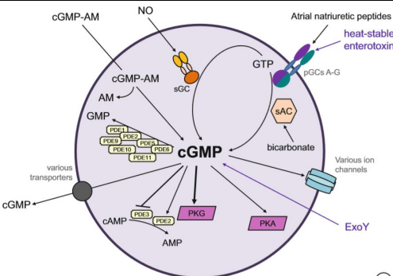
	1. 鸟苷酸环化酶（guanylate cyclase, GC）可将三磷酸鸟苷（guanosine triphosphate,GTP）催化为cGMP。
		1. 与膜受体结合的鸟苷酸环化酶和可以在膜受体与肽类激素（如心房钠尿肽）结合后被激活。而胞质中的游离鸟苷酸环化酶可被NO激活进而合成cGMP。
3. IP3(inositol triphosphate)-DAG(diacylglycerol) 信号途径
	1. 
	2. IP3和DAG双信号: 是通过Gq蛋白偶联的受体介导的另一条信号通路。胞外信号分子与细胞表面Gq蛋白偶联受体结合，通过Gq蛋白激活质膜上的磷脂酶C（PLC），使质膜上4，5-二磷酸磷脂酰肌醇（PIP2）水解成1，4，5-三磷酸磷脂酰肌醇（IP3）和二酰基甘油（DAG）两个第二信使，使胞外信号转换为胞内信号
	3. 与PKA系统之间的共同点：都需要G蛋白
4. Ca2+－钙调蛋白(calmodulin, CaM)依赖性蛋白激酶途径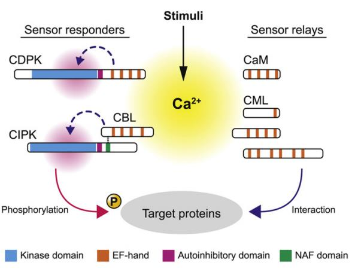
#### 3. NO信号机制与心血管病
- 1998年诺贝尔生理或医学奖：一氧化氮作为心血管系统的信号分子
- NO的性质:
	- 可以由多种类型的细胞产生,透过生物膜,发挥广泛的生物作用→凡是有血管的地方就有NO存在
	- 它由动脉内皮细胞产生,扩散至血管平滑肌,引起动脉舒张,以此来调节血流分配和血压。
	- 除此之外,NO 也参与神经细胞间的信号转导、免疫系统的炎症反应等等
	- 性质活泼,10秒之内即可转变为硝酸盐或亚硝酸盐类物质而失活
- 作用机制
	- **硝酸甘油**在平滑肌细胞内经谷胱甘肽转移酶催化与巯基结合形成NO，最终形成S-亚硝基硫醇，激活鸟苷酸环化酶和环鸟苷酸依赖的蛋白激酶，增加环鸟苷酸（cGMP）含量，减少细胞内Ca2+释放和细胞外Ca2+内流，松弛平滑肌（对血管平滑肌作用最显著）
	- 
- 饮食越健康，身体产生的一氧化氮就越多
	- 食用富含抗氧化剂的食品是非常重要的, 那些食用蔬菜和水果的人，患心脏病和中风的危险性就会降低。
- 经常运动是身体产生一氧化氮的最有效的办法。
#### 4. CAR-T
- Chimeric antigen receptor T cell，嵌合抗原受体T细胞
- CAR-T疗法就是嵌合抗原受体T细胞免疫疗法，英文全称Chimeric Antigen Receptor T-Cell Immunotherapy，是一种治疗肿瘤的新型精准靶向疗法
- 基本原理：利用患者自身的免疫细胞来清除癌细胞
- 作用机制：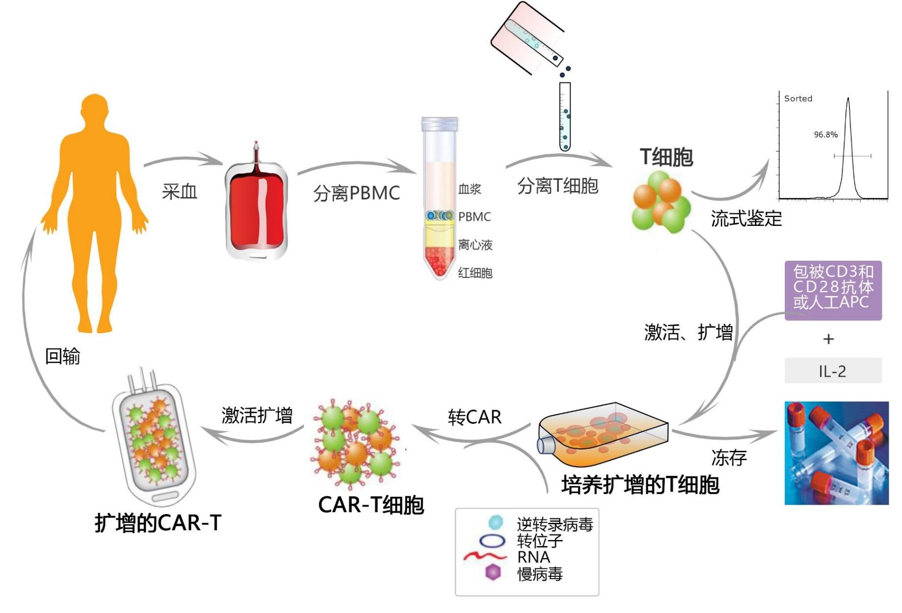
	1.**T淋巴细胞(T-lymphocyte)** 是人体白细胞的一种，来源于骨髓的多能干细胞（胚胎期则来源于卵黄囊和肝）
	1. 在人体胚胎期和初生期，骨髓中的一部分多能干细胞或前T细胞迁移到胸腺内，在胸腺激素的诱导下分化成熟，然后移居到人体血液、淋巴和周围组织器官，成为具有免疫活性的T细胞。
	2. 通过基因工程将患者的T细胞进行改造，使其表面表达嵌合抗原受体→CAR-T细胞
	3. 利用其“定位导航装置”CAR，专门识别体内肿瘤细胞
		1. 它们可以释放穿孔素和颗粒酶等 ==细胞毒性物质== ，直接导致癌细胞的溶解和死亡；
		2. CAR-T细胞还可以通过表达死亡受体配体，如Fas配体等， ==与癌细胞表面的死亡受体结合== ，诱导癌细胞发生凋亡
--------------
- References：
	- [细胞生物学复习——细胞信号转导（1） - 知乎](https://zhuanlan.zhihu.com/p/339337150)
	- [细胞生物学 细胞信号转导的一般机制 - 知乎](https://zhuanlan.zhihu.com/p/18862560642)