## 一、细胞基质
#### 1. 细胞质
- 概念：细胞中细胞核以外、膜以内的部分
#### 2. 细胞基质
- 主要成分：与代谢有关的酶、细胞质骨架结构(微管、维丝)
- 功能：
	- 完成各种代谢过程e.g.糖酵解过程、磷酸戊糖途径、糖醛酸途径等
	- 保持细胞内环境的稳定
	- 维持细胞内信号转导通路
	- 蛋白质的合成与修饰。细胞质溶质蛋白、细胞骨架蛋白和核蛋白在游离核糖体上合成；以及蛋白修饰（糖基化、磷酸化等）
	- 胞内物质运输e.g.膜泡运输（沿细胞骨架转运）。
	- 降解废弃的蛋白质。如在内质网中折叠错误的膜蛋白或分泌蛋白，可通过转移体由内质网到细胞溶质中，再经泛素化途径降解
#### 3.  蛋白质降解途径
- **溶酶体途径**： 降解经胞吞进入细胞的胞外蛋白及胞内蛋白
	1. 细胞在饥饿、应激等条件下， ==内质网或高尔基体膜包裹待降解物质（如受损线粒体）== ，形成双层膜结构的**自噬体**。
	2. 自噬体与溶酶体融合，形成**自噬溶酶体**，内部物质被溶酶体中的酸性水解酶（如蛋白酶、脂酶）降解
	3. 其他降解方式：
	    - **内吞作用**：细胞通过胞吞摄取外源物质（如病原体），形成内体后与溶酶体融合降解。
	    - **分子伴侣介导的自噬（CMA）**：特定蛋白质被分子伴侣识别并转运至溶酶体降解（如错误折叠蛋白）。
- **泛素化途径**：经泛素-蛋白酶体降解细胞周期蛋白Cyclin、纺锤体相关蛋白、细胞表面受体、转录因子、肿瘤抑制因子如P53、癌基因产物等
	- 大部分蛋白降解，并且这些蛋白的 ==半衰期较短== (一天以内[[Chapter6 Plant hormones]])
	- 泛素-蛋白酶体系统(ubiquitin-proteasome system,UPS
	- 泛素：含有76个氨基酸残基，具有7个赖氨酸残基(K6，K11，K27，K29，K33，K48，K63)和一个甲硫氨酸残基(M1)
	- 过程：
		- 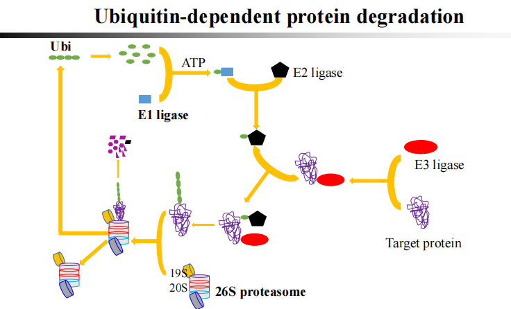
		1. 泛素(Ubiquitin, Ub)通过 **E1 激活酶**(泛素激活酶)与 ATP 结合，形成高能硫酯键。
		2. 泛素活化酶E1：通过半胱氨酸残基与泛素C端活化的甘氨酸残基形成硫酯键，E1-泛素中间体中的泛素可以转移给数个E2, ==形成 E2-Ub 复合物== 。
		3. E3 连接酶（泛素连接酶）识别靶蛋白，将泛素从 E2 转移至靶蛋白的赖氨酸残基上，形 ==成多泛素链== （如 K48、K63 连接
		4. 多泛素化的靶蛋白 ==被 26S 蛋白酶体识别== ，解折叠后被降解为短肽，泛素分子可被回收利用
- **胱天蛋白酶(caspase)途径**：细胞凋亡的蛋白质降解途径[[Chapter9 细胞衰老与细胞死亡]]
	1. **外源性途径（死亡受体通路）**：
	    - 死亡配体与细胞表面死亡受体结合，招募接头蛋白（如 FADD），形成死亡诱导信号复合体（DISC
	    - 激活起始 Caspase（如 Caspase-8），进而激活执行 Caspase（如 Caspase-3），启动凋亡
	2. **内源性途径（线粒体通路）**：
	    - 细胞应激（如 DNA 损伤、氧化应激）导致线粒体膜通透性改变，释放细胞色素 c 至细胞质
	    - 细胞色素 c 与凋亡蛋白酶激活因子 1（APAF-1）结合，形成 apoptosome，激活起始 Caspase-9，进而激活执行 Caspase-3
	3. **执行阶段**：执行 Caspase 降解细胞骨架蛋白（如肌动蛋白）、核纤层蛋白等，导致细胞皱缩、核碎裂，最终形成凋亡小体被吞噬
#### 4. 自噬Autophagy/self-eating
- 概念：通过溶酶体降解大分子/细胞器
	- 该过程中一些损坏的蛋白或细胞器被双层膜结构的**自噬小泡**包裹后，送入 ==溶酶体（动物）或液泡（酵母和植物）== 中进行降解并得以循环利用
		- 自噬体的来源：内质网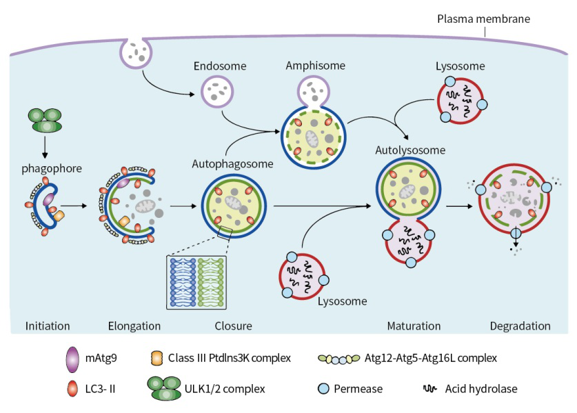
- 分类
	- **巨自噬Macroautophagy**:
		- 双层膜结构包裹待降解物质，与溶酶体融合形成自噬溶酶体，内容物被水解酶降解。
		- 功能：清除长寿命蛋白、受损细胞器（如线粒体自噬
	- **分子伴侣介导的自噬(Chaperone-Mediated Autophagy, CMA)**：分子伴侣（如Hsc70）识别含特定序列（KFERQ）的蛋白质，直接转运至溶酶体降解
		- 功能：选择性降解可溶性蛋白，参与代谢调节
	- **微自噬（Microautophagy）**
		- 溶酶体膜内陷直接吞噬胞质成分。
		- 功能：基础状态下维持细胞稳态
- 蛋白质的C末端的作用
	- 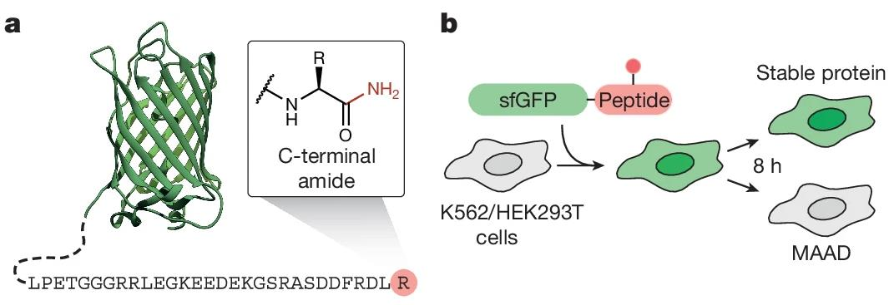
	- C末端带有酰胺(CONH2)修饰的蛋白质能够通过UPS系统被迅速识别和降解
- 意义：
	- 无论是消除/加速自噬都会引起生物体快速衰老→突变体产生衰老现象
-----------
## 二、细胞内膜系统
#### 1. 内膜系统
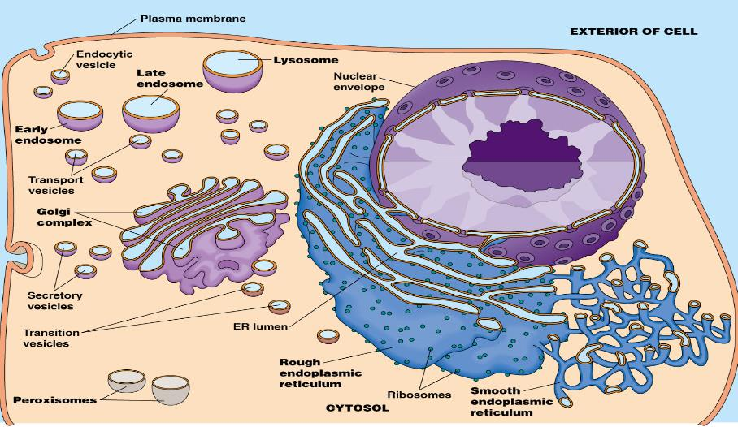
- 概念：位于细胞质内，在结构、功能乃至发生上有一定联系的**膜性结构**的总称‘
	- 包括内质网、高尔基体和溶酶体
- 功能：
	-  ==扩大膜的总面积== ，为酶提供附着的支架
	- 将细胞内部区分为不同的功能区域，保证各种生化反应所需的独特环境
#### 2. 内质网

^5005bb

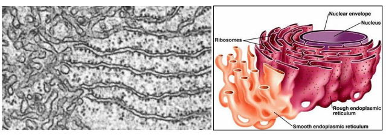
- 概念：由一层单位膜围成的形状大小不同的小管、小泡、扁囊状结构，相互连接形成一个连续的网状膜系统
- 类型：
	- **粗面内质网(rough endoplasmic reticulum, rER)** ：多为扁囊状，在ER膜的外表面 ==附有大量的核糖体== ，普遍存在于分泌**蛋白质**的细胞中,细胞核附近
		- 功能：
			- 合成蛋白质
				- 胞外蛋白e.g.抗体；膜蛋白
				- 需要与其它组分严格分开的酶e.g.溶酶体水解酶
				- 需要修饰的蛋白e.g.糖蛋白
			- 对合成蛋白质进行修饰加工；
			- 不断进行自身装配和生成，构成膜的组分 ==(脂质来源于sER；而蛋白质则来源于rER== )；
			- 物质运输
	- **光面内质网(smooth endoplasmic reticulum, sER)** ：膜上无颗粒(核糖体),ER的成分不是扁囊，而常为小管小囊，它们连接成网，广泛存在于能合成**类固醇**的细胞中
		- 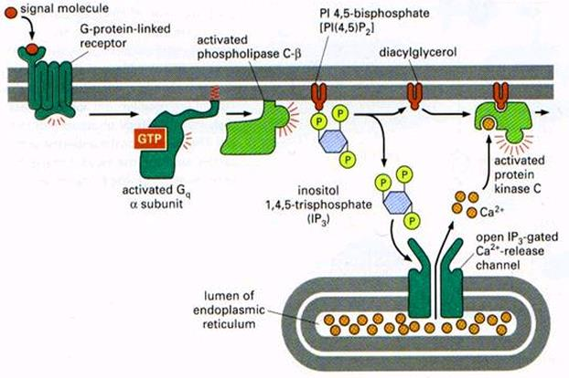
		- 合成脂质
		- 解毒作用👉膜上有很多P450蛋白
		- 糖原代谢
		- 贮藏钙离子 #一些疑问 如何理解？
- 主要酶：
	- 与氧化反应电子传递相关的酶系：NADPH-细胞色素c还原酶、Ctyb5、细胞色素P450 #一些疑问 为什么会在这里？线粒体呢？
	- 与脂类物质代谢功能反应相关的酶类：脂肪酸CoA连接酶
	- 与碳水化合物代谢功能反应相关的酶类：葡萄糖-6-磷酸酶
	- 参与蛋白质加工转运的多种酶类
- 蛋白质合成过程
	1. 核糖体：
		1. 游离核糖体:在胞质溶胶中，主要 ==合成胞内蛋白== , 如某些特殊蛋白质（红细胞的血红蛋白）
			- 蛋白质都是在核糖体上形成的，都 ==起始于游离核糖体== 
		2. 膜结合核糖体:存在于rER， ==合成胞外蛋白== 
	2. 修饰与加工：最主要的是糖基化，几乎所有内质网上合成的蛋白质最终被糖基化
		- 糖基化的作用：
			- 使蛋白质能够抵抗消化酶的作用；
			- 赋予蛋白质传导信号的功能；
			- 某些蛋白只有糖基化后才能正确折叠
		- 糖基分为2类：
			- **N-连接的糖基化**：与天冬酰胺残基的NH2连接，糖为N-乙酰葡糖胺，始于内质网腔，终于高尔基体。
			- **O-连接的糖基化**：与丝氨酸、苏氨酸或羟脯氨酸残基连接，连接的糖为半乳糖或N-乙酰半乳糖胺， ==在高尔基体上进行== 
	3. 新生肽的折叠、组装与运输：
		- 不同的蛋白质在内质网腔中停留的时间不同
		- 大约90%的新合成的T细胞受体亚单位和乙酰胆碱受体都被降解掉
#### 3. 溶酶体
- 功能
	- 细胞内消化
	- 自体吞噬：降解衰老死亡的细胞和无用的生物大分子
	- 防御作用
	- 参与分泌过程的调节：将甲状腺球蛋白降解成有活性的甲状腺素
- 残体residual body：溶酶体

- 蛋白质进出核信号
	- NLS #学科链接 植物基因组学
		- 赖氨酸与精氨酸的反复出现→可能是可以进入核的蛋白
	- 出核序列：有许多L
#### 4. 高尔基体Golgi apparatus
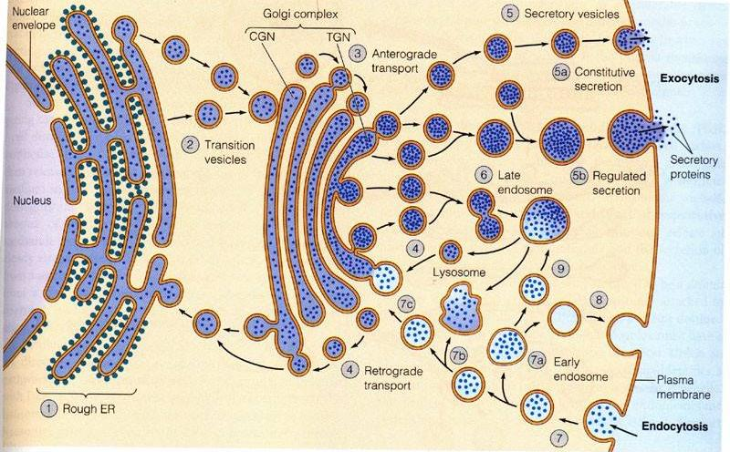
- 其中含有的酶
- 主要功能：将内质网合成的蛋白质进行加工、分类、与包装，然后分门别类地送到细胞特定的部位或分泌到细胞外
	- 参与细胞分泌活动
	- 蛋白质和脂质的糖基化
	- 进行膜的转化功能
	- 蛋白质加工与分拣
	- 参与形成溶酶体和微体
	- 参与 ==植物细胞壁== 的形成
- 结构特征：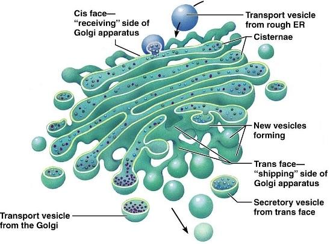
	- 具有极性：
		- 顺面Cis face：对着内置网，凸面为生成面
		- 反面trans face：对着质膜，凹面为分泌面
	- **膜囊Golgi**
		- 顺面膜囊：
			- 接受内质网新合成的物质，分类后转入中间膜，小部分返回（驻留蛋白）
			- 丝氨酸O-连接的糖基化，跨膜蛋白胞质侧的酰基化，入口区;
		- **中间膜囊**：多数糖基化修饰，膜质形成，多糖合成
		- **反面膜囊**：
			- 管网状，连接囊泡
			- 参与蛋白质的分类与包装，最后输出，囊泡运输，出口区
#### 5.溶酶体lysosome
- 几乎存在于所有的动物细胞中，单层膜，含有多种酸性水解酶
	- 高等的植物细胞中没有溶酶体 #一些疑问 
- 由高尔基体分泌形成，是细胞中的“消化系统”
- 功能
	- 细胞内消化：如高等动物内吞低密脂蛋白获得胆固醇，单细胞真核生物利用溶酶体的消化食物
	- 自体吞噬：清除无用的生物大分子，衰老细胞、细胞器、个体发育中多余的细胞。许多生物大分子的半衰期只有几小时至几天，肝细胞中线粒体的平均寿命约10天左右
	- 防御作用：如巨噬细胞杀死病原体
	- 参与分泌过程的调节：如将甲状腺球蛋白降解成有活性的甲状腺素
- 形成过程
	1. 初级溶酶体primary lysosome:具有 ==均质基质的颗粒状溶酶体== 称为初级溶酶体
		- 呈球形，直径约0.2～0.5um，此类溶酶体是刚刚从反面高尔基体形成的小囊泡
		- 仅含有水解酶类，但无作用底物，外面只有一层单位膜，其中的酶处于 ==非活性状态== 
	2. 次级溶酶体secondary lysosome: 由初级溶酶体与细胞吞噬作用所产生的吞噬体相互融合而成的溶酶体
		- 含水解酶和相应的底物，是一种将要或正在进行消化作用的溶酶体。根据所消化的物质来源不同，分为自噬性溶酶体、异噬性溶酶体
	- **自噬性溶酶体autolysosome** : 指包围了部分**被损伤或衰老细胞器**（线粒体、内质网碎片等）的自体吞噬体（autophagosome）与初级溶酶体（或内溶酶体）融合后形成的次级溶酶体
		- 作用底物是 ==内源性== 
		- 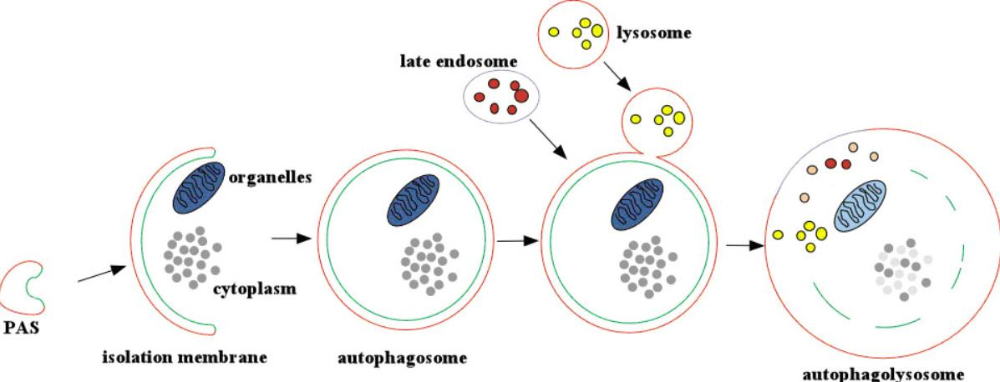
		- 发生条件：细胞内结构衰老; 机体发生饥饿；细胞本身发生病变; 有分泌功能的细胞调节
- **残体residual body**：已失去酶活性，仅留未消化的残渣故名，残体可通过外排作用排出细胞，也可能留在细胞内逐年增多，如肝细胞中的脂褐质，老年斑
	- 次级溶酶体在完成对绝大部分底物的消化分解作用之后，尚有一些不能消化分解的物质残留于其中，成为残体，有些残体可以以胞吐的方式被清除，有些则沉积在细胞内
	- **痛风gout**：
		- 痛风患者体液中有高水平的**尿酸**，沉积在滑液腔及其他结缔组织间隙中形成了结晶→被中性粒细胞吞噬→次级溶酶体从而破坏溶酶体膜的稳定性→溶酶体膜破裂→水解酶释放 →中性粒细胞死亡→ 刺激成纤维细胞释放胶原酶→ 腐蚀关节软骨组织→ 炎症
#### 6. 过氧化物酶体peroxisome
- 概念：又称微体(microbody)或过氧小体、过氧化氢体等，是由单层膜围绕的内含一种或几种氧化酶类和过氧化氢酶(约占过氧化物酶体总酶量的40%)的异质性细胞器
- 与溶酶体的区别:过氧化物酶体 ==和初级溶酶体的形态与大小类似== ，但过氧化物酶体中的尿酸氧化酶等常形成晶格状结构，可作为电镜下识别的主要特征
- 功能:
	- 动物中：
		- 使毒性物质失活e.g.使得乙醇转化为乙醛
		- 对氧浓度的调节
		- 脂肪酸的氧化
		- 含氮物质的代谢：氧化尿酸(核苷酸和某些蛋白质降解代谢的产物)
	- 植物中：
		- 参与**光呼吸作用**，将光合作用的副产物乙醇酸氧化为乙醛酸和过氧化氢
		- 在萌发的种子中，进行**脂肪的β-氧化**，产生乙酰辅酶A，经乙醛酸循环，由异柠檬酸裂解为乙醛酸和琥珀酸，后者离开过氧化物酶体进一步 ==转变成葡萄糖== ，这一过程称为乙醛酸循环，因此植物细胞的过氧化物酶体又称**乙醛酸循环体**
#### 7.线粒体mitochondrion[[Chapter5 细胞的能量转换器]]
#### 8. 叶绿体[[Chapter5 细胞的能量转换器]]

----------------------
## 三、细胞内蛋白质的分选与膜泡运输
#### 1. Sorting signals：
- **信号肽(signal peptides)**：存在于蛋白质 ==一级结构上== 的特定连续线性序列，通常15-60个氨基酸残基，有些信号序列在完成蛋白质的定向转移后被信号肽酶（signal peptidase）切除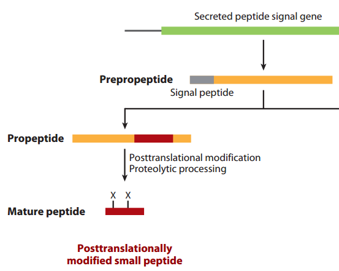
	- 膜蛋白、分泌蛋白和溶酶体蛋白的定位标签
	- 没有保守的氨基酸序列但是有保守的结构特征
	- 识别机制：核糖核蛋白复合物，称为信号识别颗粒（signal recognition particle，SRP）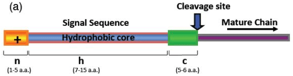
		1. 通过ER膜后，信号肽被信号肽酶（signal peptides）切除。人ER的信号肽酶是一种多蛋白复合物，称为信号肽酶复合物（SPC）
		2. 切除信号肽后，翻译继续进行，同时进行折叠和修饰。所以信号肽介导的是一种与翻译过程相伴随的靶向运输，称为共翻译蛋白靶向（co-translational protein targeting）
- **信号斑(signal patch)**：存在于 ==完成折叠== 的蛋白质中，构成信号斑的信号序列之间可以不相邻，折叠在一起构成蛋白质分选的信号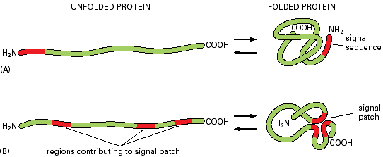
- **转运肽(transit peptide)**:是游离核糖体上合成的蛋白质的N-端一段大约20～80个氨基酸的肽链, 通常 ==带正电荷== 的碱性氨基酸(精氨酸、赖氨酸、苏氨酸和丝氨酸)含量较为丰富, 如果它们被不带电荷的氨基酸取代则不起引导作用 #待解决 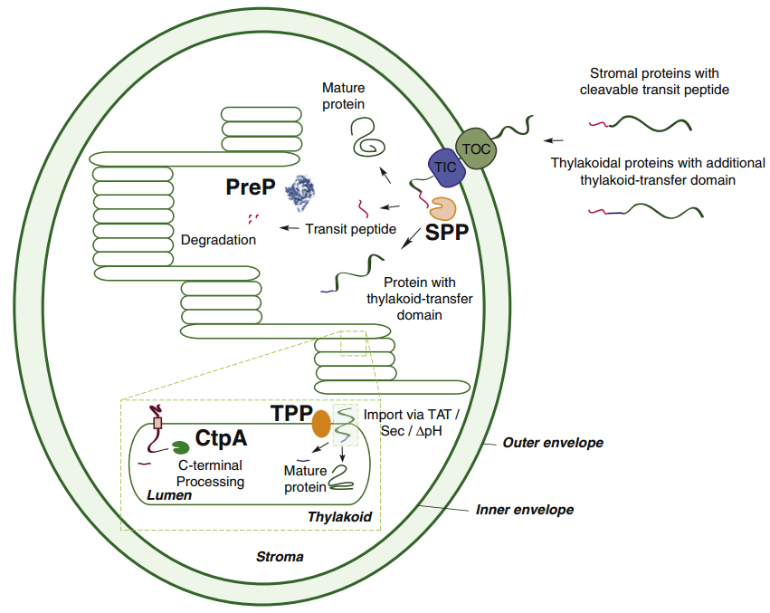 
	- 需要受体和分子伴侣
		- **分子伴侣 (molecular chaperone )**: 存在于原核生物和真核生物细胞质以及细胞器中可 ==协助新生肽链正确折叠== 的一类蛋白质。
	- 需要电化学梯度驱动，消耗ATP
	- 需要信号肽酶切除信号肽
	- 通过接触点进入
	- 非折叠形式运输
- 蛋白质进/出核信号
	- **NLS(nuclear localization signal)**: 蛋白质的一个结构，通常为一短的氨基酸序列，它能与入核载体相互作用，使蛋白能被运进细胞核
	- **NES(nuclear export signal)**:是蛋白上一段 ==包含着4个疏水基团== 的氨基酸序列，负责蛋白穿过核孔从细胞核运送到细胞质的过程。NES的疏水区域最常见序列为LXXXLXXLXL，其中L是疏水残基（通常为亮氨酸），X是其他的氨基酸
#### 2. 蛋白质分选
- Concepts:绝大多数的蛋白质均在细胞质基质中开始合成，随后或在细胞质基质或在糙面内质网上继续合成。少量蛋白质在线粒体和植物叶绿体中合成。然后通过不同的途径转动到细胞的特定部位。
- 途径
	- **翻译后转运途径**：核基因编码的mRNA在细胞质基质游离核糖体上完成多肽链的合成，然后转运至膜围绕的细胞器，如线粒体(或叶绿体)、过氧化物酶体、细胞核，或者成为细胞质基质的可溶性驻留蛋白和支架蛋白。
		- 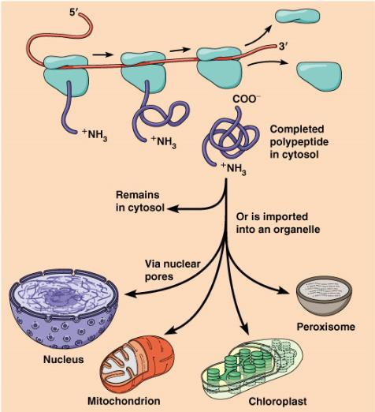
	- **共翻译转运途径**：蛋白质合成在游离核糖体上起始之后由信号肽引导转移至在糙面内质网上合成，经高尔基体加工包装转运至溶酶体、细胞质膜或分泌到细胞外。内质网与高尔基体本身的蛋白质分选也是通过这一途径完成。
		- 
- 类型：
	- 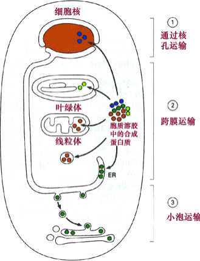
	- **门控运输(gated transport)**：如核孔可以选择性的主动运输大分子物质和RNP复合体，并且允许小分子物质自由进出细胞核。
	- **跨膜运输(transmembrane transport)**：蛋白质通过跨膜通道进入目的地。
	- **膜泡运输(vesicular transport)**：蛋白质被选择性地包装成运输小泡，定向转运到靶细胞器。如内质网向高尔基体的物质运输、高尔基体分泌形成溶酶体、细胞摄入某些营养物质或激素，都属于这种运输方式。
	- 细胞质基质中蛋白的转运:与细胞骨架密切相关
	- **膜泡运输(vesicular transport)**：蛋白质被选择性地包装成运小泡，定向转运到靶细胞器
		- 定向机制：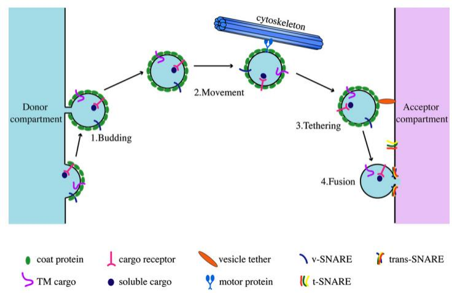
## 三、相关知识
#### 1. 糖尿病diabetes
- 概念：一种由于 ==胰岛素(insulin)分泌不足== 或 ==外周组织对胰岛素不敏感== 引起的代谢性疾病，以持续的高血糖状态为特征，并可能引起各种组织、脏器（如眼、肾、心脏、血管、神经等）的长期损害、功能不全或衰竭
- 分类：
	- **Ⅰ型糖尿病** (5%)：基因缺陷，无法自主产生足够的胰岛素
	- **Ⅱ型糖尿病(90%)**：后天出现抵抗作用，胰岛素分泌正常但是胰岛素受体无法正常工作
	- 妊娠糖尿病（4%）
	- 其他类型糖尿病（1%）
- **胰岛素insulin**：由胰脏内的胰岛β细胞受内源性或外源性物质如葡萄糖、乳糖、核糖、精氨酸、胰高血糖素等的刺激而分泌的一种**蛋白质激素**
- 生物学机制：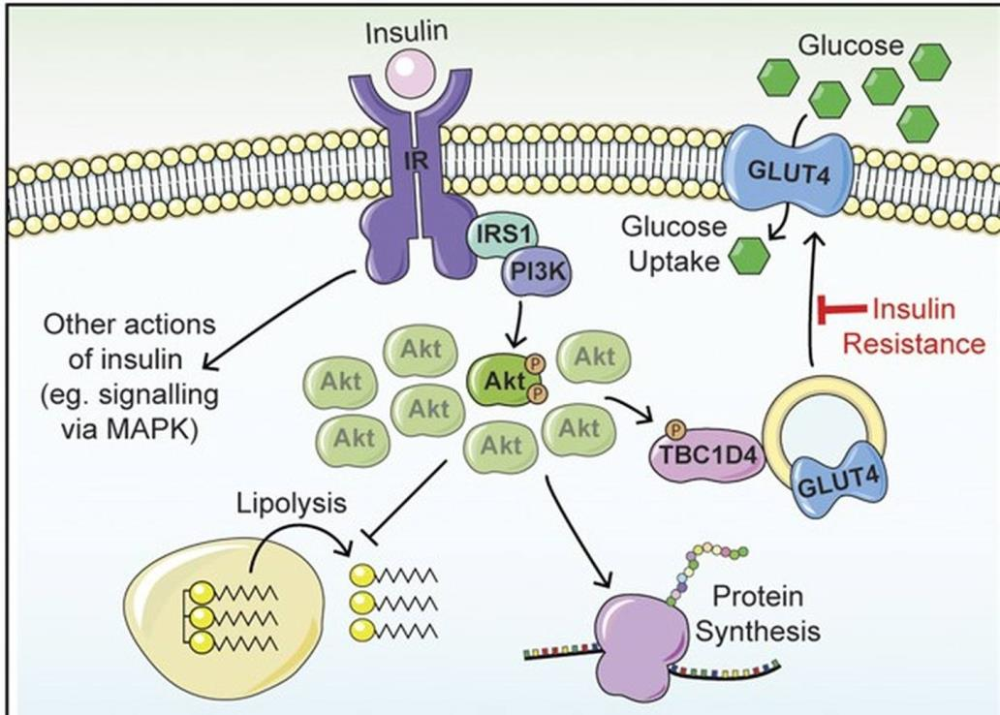
- 发现：
#### 2. 过量饮酒[[#^5005bb]]
- 酒精在体内的代谢途径：
	- 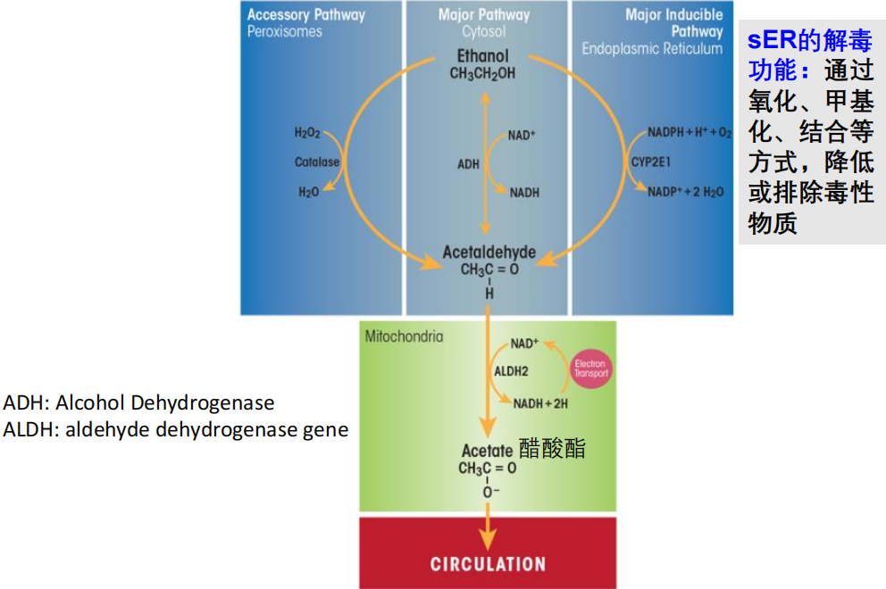
	- 大部分酒精(乙醇脱氢酶ADH作用)→乙醛(乙醛脱氢酶ALDH作用)→醋酸酯→二氧化碳和水→排出体
	- 部分酒精通过内质网的细胞色素P450酶系进行代谢
		- sER的解毒功能：通过氧化、甲基化、结合等方式降低或排除毒性物质
- 危害：
	- 当人体无法顺利清除乙醛aldehyde时，会导致喝酒会脸红的情况→容易导致 ==DNA损伤，导致血液疾病甚至是癌症== 
	- 造成干细胞DNA永久性损伤，诱发癌症风险
	- 会导致肠道微生物的重组，破坏菌群平衡，引发肠道屏障功能障碍
		- 引起肠道通透性增加，有毒物质进入肝脏，引起肝脏功能损伤
		- 肠道有毒物质进入血液循环，诱发炎症反应
	- 导致心肌收缩力下降、心输出量减少等心血管功能障碍
#### 2. 阿尔兹海默症与帕金森病
^55ea75
- Alzheimer's disease(AD):与线粒体有关的神经系统退行性疾病
	- 可导致 ==胞内活性氧物质（ROS）积聚== 造成氧化应激，这是AD早期主要特征之一并促进病程发展
	- **β淀粉样蛋白**（Aβ）沉积可导致线粒体功能障碍，进一步促进活性氧物质积聚而损伤线粒体功能、造成胞内Ca2+超载等导致神经元凋亡→认知功能障碍	
	- **tau蛋白**对海马体神经元之间的正常交流具有破坏作用→造成阿尔茨海默症患者早期健忘、认知能力下降→找到了更早的干预靶点→可以开发靶向药物
- 帕金森病（Parkinson’s disease，PD）是一种常见的神经系统变性疾病
	- 老年人多见，平均发病年龄为60岁左右
	- 帕金森病最主要的病理改变是 ==中脑黑质多巴胺（dopamine, DA）能神经元的变性死亡== ，由此而引起纹状体DA含量显著性减少而致病。
		- 遗传因素、环境因素、年龄老化、氧化应激等均可能参与PD多巴胺能神经元的变性死亡过程。
		- 线粒体呼吸链缺陷，线粒体DNA异常和线粒体相关基因突变可能直接或间接地参与了PD发生和发展
	- 特点：运动过缓、肌强直、静止性震颤、姿势步态异常，认知/精神异常、睡眠障碍、自主神经功能障碍、感觉障碍
	- 治疗方法：
		- 加强锻炼可以减缓帕金森病的病程：释放神经递质多巴胺
		- 全新治疗靶点fam171a2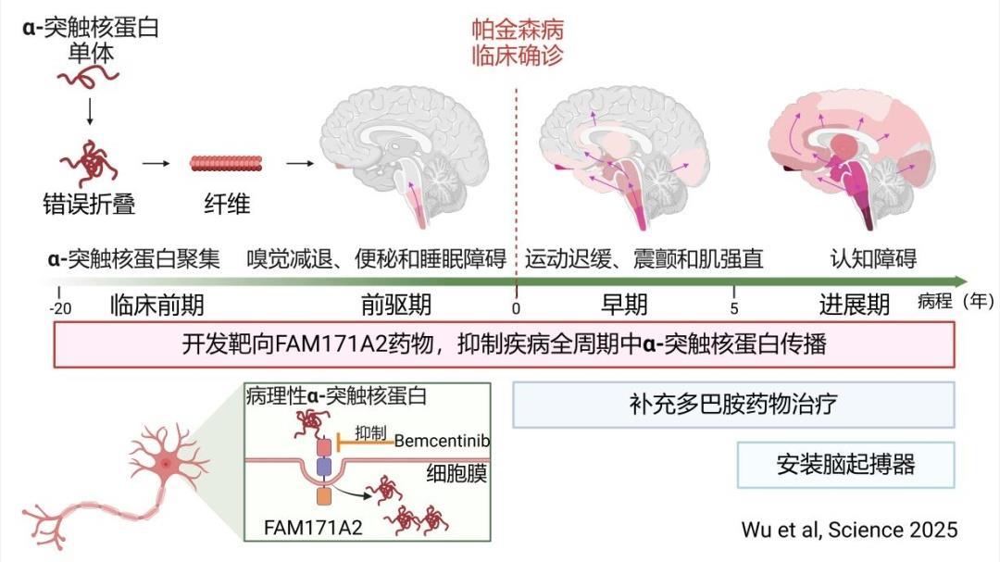

- References：
	- [中医视角下帕金森病的发病机制及治疗机制 - ScienceDirect](https://www.sciencedirect.com/science/article/pii/S0944711322001222)
	- [阿尔茨海默病：过去、现在和未来 - PMC](https://pmc.ncbi.nlm.nih.gov/articles/PMC5830188/)
	- [Enhanced production of mesencephalic dopaminergic neurons from lineage-restricted human undifferentiated stem cells | Nature Communications](https://www.nature.com/articles/s41467-023-43471-0)
	- [Intensive exercise ameliorates motor and cognitive symptoms in experimental Parkinson's disease restoring striatal synaptic plasticity - PubMed](https://pubmed.ncbi.nlm.nih.gov/37450585/)
	- [Neuronal FAM171A2 mediates α-synuclein fibril uptake and drives Parkinson’s disease | Science](https://www.science.org/doi/10.1126/science.adp3645)
	- 
#### 3. 细胞质雄性不育CMS
- 概念：广泛存在于高等植物中的一种自然现象，表现为母体正常、花粉败育和雌蕊正常
	- 在叶绿体基因组中的突变会导致其不育→造成 ==ROS的增加== 
	- 在玉米花药中，ZmDREB1.7与orf355(积累增强线粒体逆向信号)构成正反馈，导致orf蛋白的败育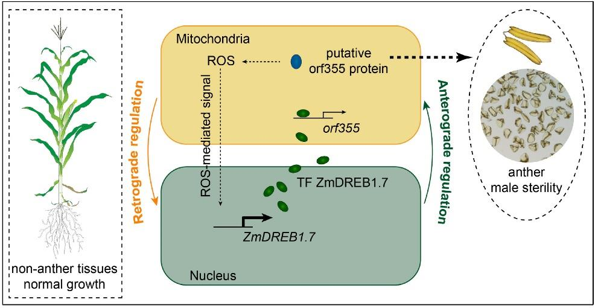
- 杂种优势heterosis：是指杂种第一代在体型、生长率繁殖力及行为特征方面均比亲本优越的现象
- 三系法：
	- 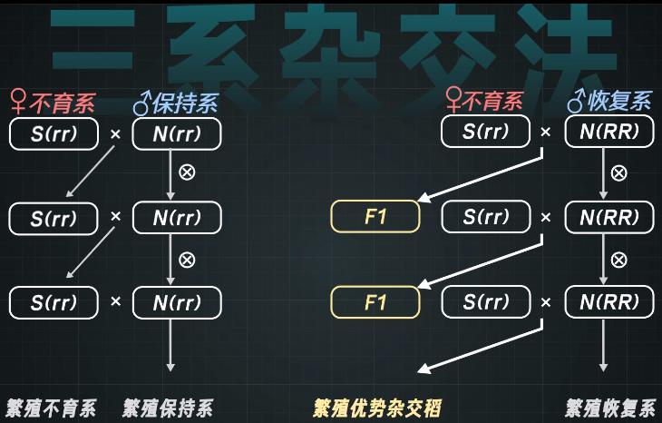
	- 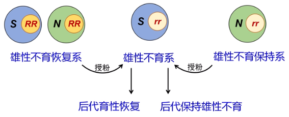
- 两系法：
	- 优点：
		- 操作更简便，种子繁育程序简单且成本低
		- 三系法中只有0.1%可以转育成不育系或保持系，只有5%可用作恢复系，资源利用率低
		- 两系法中，光温敏核不育系只根据日照和温度条件来决定是否可育，冲破了不育系和恢复系种质资源的束缚，选到优良组合的几率大大提高
- 三系法