## 一、概述
- 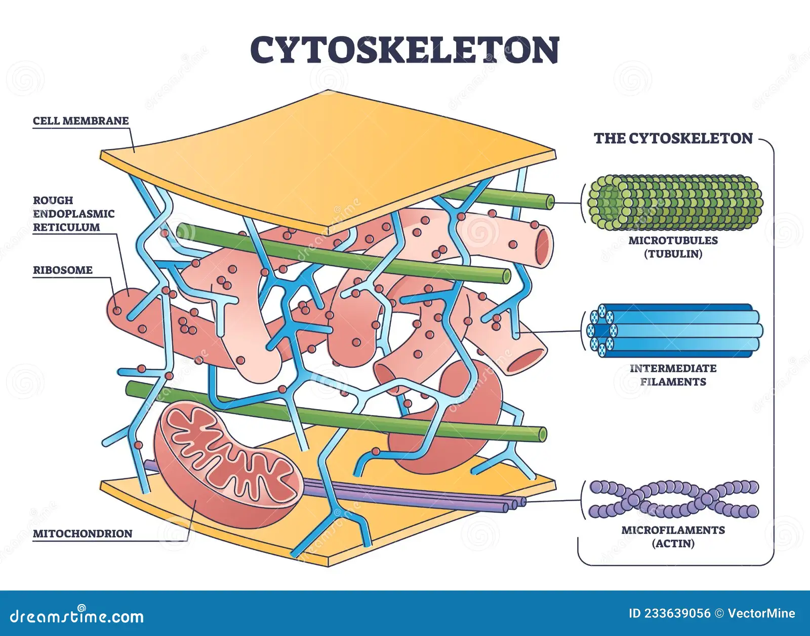
#### 1. 细胞骨架概念
- 存在于真核细胞质中的蛋白质网状体系
- 组成：维丝、维管和中间丝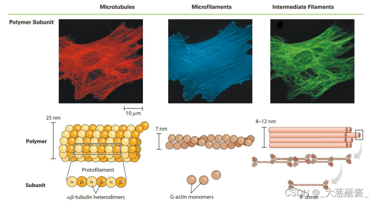
- 研究方法：荧光显微镜、电子显微技术、冷冻电镜
#### 2. 分布
- 维丝：
- 维管：分布在核周围，并称放射状向胞质四周扩散
- 中间丝(中间纤维)：分布在整个细胞中
	- 最早在平滑肌细胞中发现，介于肌肉细胞粗肌丝和细肌丝
	-  ==没有极性== ，组装不需要消耗能量👉区别于维丝和维管
	- 植物细胞中暂未发现
## 二、微丝Microfilament,MF
#### 1. 分子组成
- 结构单元：**肌动蛋白(actin)** →中间有ATP结合位点
	- 单体：球形分子， ==具有极性== 
	- 多聚体：纤维型肌动蛋白→形成需要能量
		- 影响单体-多聚体平衡的特异性药物：
			- 细胞松弛素
- 可以用考马斯亮蓝P250进行染色
#### 2. 组装
- 肌动蛋白首尾相接，因此 ==具有极性== ，在正极上组装速度较快👉可以联系它不断往前伸从而形成伪足
	- 动态过程：**“踏车行为treadmilling”** →就像一个跑步机，不断装配但是长度没有变化hhh 
		- 达到动态稳定时，微丝的长度达到稳定
	- 影响单体-多聚体平衡的特异性药物：
		- 细胞松弛素
		- 鬼笔环肽：能够阻止微丝的解聚，使其保持稳定，可以用来进行荧光标记
- **肌球蛋白/马达蛋白**：利用ATP水解所产生的化学能量驱动自身沿微管或微丝定向运动的蛋白
	- 分类
		- 微管马达蛋白
		- 微丝马达蛋白
	- 结构：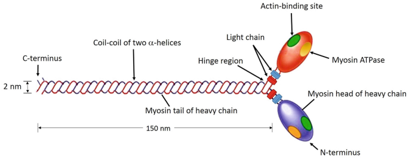
		- 头部的马达结构域：利用ATP，使肌球蛋白能够移动
		- 颈部的调控结构域：杠杆作用
		- 尾部：携带运送的货物
- 微丝结合蛋白突变的后果：
	- 在水稻中可能会导致根的弯曲→影响极性运输和生长发育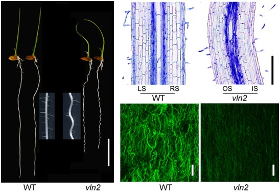
#### 3. 功能
1. 维持细胞形态，赋予质膜机械强度
	- 大部分都集中在紧贴细胞质膜的细胞质区域
2. 形成**应力纤维(stress fiber)**：非肌细胞中的应力纤维与肌原纤维有很多类似之处：都包含myosin II、原肌球蛋白、filamin和α-actinin。
	- 培养的成纤维细胞中具有丰富的应力纤维，并通过粘着斑固定在基质上
	- 在体内应力纤维使细胞具有 ==抗剪切力== 
3. 细胞伪足的形成与细胞迁移
	-  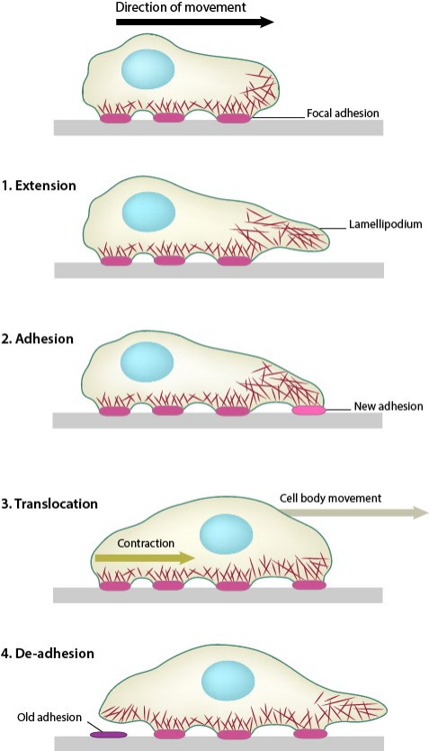
	- 就像往前试探了一下，然后固定上去😂，将细胞膜顶出去
	- 分为片状伪足和丝状伪足
4. 植物表皮毛trichome的形态建成
	- 抵抗病虫害、减少蒸腾作用、抵御紫外线
5. 植物根毛的形成
6. 调控气孔运动：通过关闭气孔防止病原菌的入侵→”**气孔免疫**“
	1. 平时微丝的解聚较多，散布在细胞中使气孔打开
	2. 遇到侵害时微丝聚合，呈束状使保卫细胞关闭
7. 参与细胞分裂→”胞质分裂环“→微丝+肌球蛋白Ⅱ
	- 在细胞松驰素存在的情况下，不能形成胞质分裂环，因此形成双核细胞
## 二、微管Microtube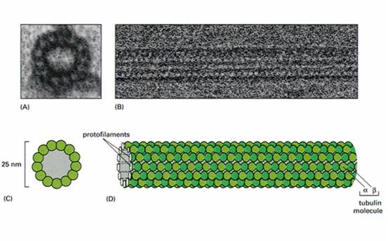
#### 1. 组成
- 呈中空管状，能与其它蛋白共同组装成为纺锤体、鞭毛和纤毛、中心粒等结构
- 由**微管蛋白tubulin**装配而成→微管蛋白由α和β两个亚单位组成异二聚体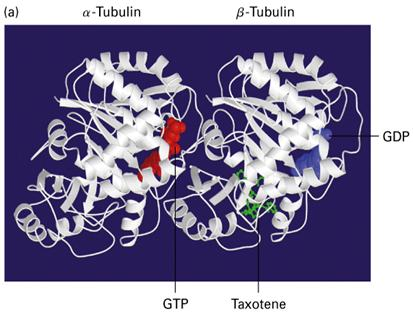
	- 两种亚基均可结合GTP，α球蛋白结合的GTP从不发生水解或交换，是α球蛋白的固有组成部分
	- β球蛋白结合的GTP可发生水解→”E位点“， ==结合的GDP可交换为GTP== ，可见β亚基也是一种 G蛋白
- 微管 ==具有极性== ，+极(plus end)生长速度快，-极(minus end)生长速度慢
	- 也就是说微管蛋白在+极的组装速度高于-极
	- +极的最外端是β球蛋白，-极的最外端是α球蛋白
- 微管类型
	- 单管(不稳定)：
	- 二联管：纤毛或鞭毛中的微管
	- 三联管：中心体/基粒的微管
#### 2. 组装和去组装
- 微管和微丝一样具有踏车行为
- 阶段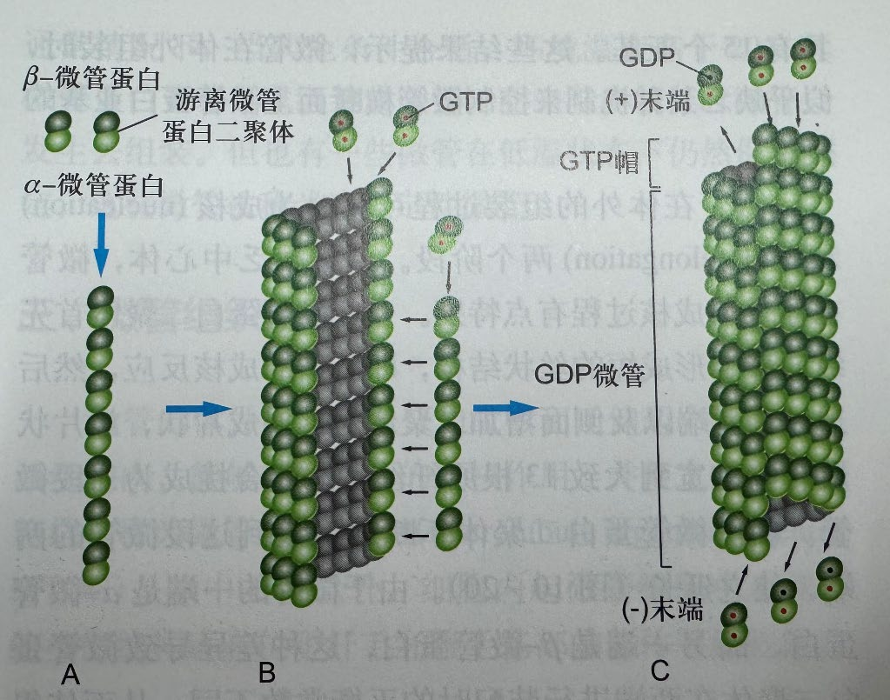
	1. 成核nucleation：先从单体聚合变成二聚体
	2. 延伸elongation
- 无秋水仙素时趋向于聚合，有时趋向于解聚
#### 3. 微管特异性药物
- 秋水仙素(colchicine)：
	- 作用机制：与微管蛋白的 β 亚基结合，抑制微管蛋白聚合， ==阻止纺锤体形成== 。导致细胞分裂停滞于中期，染色体数目加倍。结合的微管蛋白可加合到微管上，但阻止其他微管蛋白单体继续添加， ==从而破坏纺锤体结构== 
	- 应用：抑制有丝分裂，使染色体加倍→园艺育种应用，如蓝莓等
	- 但是有可能会致癌
- 长春花碱具有类似的功能
- 紫杉酚(taxol)
	- 作用机制：与微管蛋白结合， ==稳定微管结构，抑制其解聚== ，导致微管过度聚合且无法动态组装。在细胞分裂中，使染色体无法正常分离，阻滞细胞于有丝分裂中期，诱导细胞凋亡
	- 应用：化疗药物， ==用于治疗癌症== ，通过抑制肿瘤细胞分裂发挥作用👉区别于秋水仙素
		- 应用的限制：
			- 红豆杉比较稀有；化学合成路线复杂且效率低；生物合成途径尚不明确；递送困难，如无法完全溶于水
	- 但这种稳定性会破坏微管的正常功能
#### 4. 微管组织中心MTOC
- Concepts:是指在活细胞内，能够起始微管的成核作用，并使之延伸的细胞结构，主要包括中心体和纤毛基部、鞭毛基部的基体等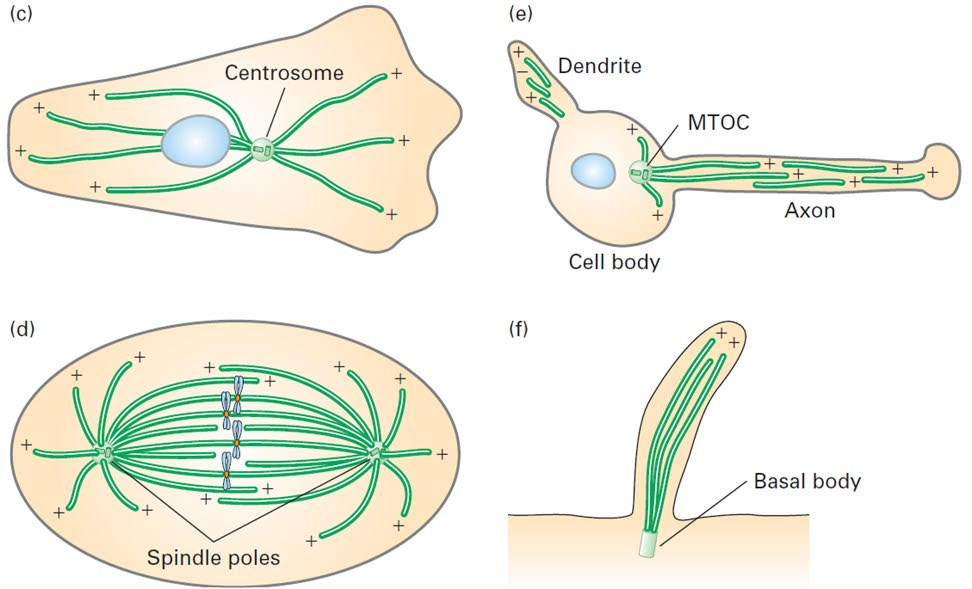
- 微管结合蛋白MAP分子：至少包含一个结合微管的结构域和一个向外突出的结构域
	- 突出部位伸到微管外与其它细胞组分（如微管束、中间纤维、质膜）结合。
	- 主要功能：
		- 促进微管聚集成束；
		- 增加微管稳定性或强度；
		- 促进微管组装。包括I 型和II型两大类，
			- I 型对热敏感，如MAP1a、 MAP1b，主要存在于神经细胞 
			- II型热稳定性高，包括 MAP2a、b、c，MAP4和tau蛋白
				- 其中 MAP2只存在于神经细胞,，MAP2a的含量减少影响树突的生长
- Tau蛋白与阿尔茨海默症[[Chapter3 物质的跨膜运输与信号传递|阿尔茨海默症]]
	- 
#### 3. 功能 #重点  #考过 
- 与细胞器分布、细胞形态发生和维持有关
- 与物质运输密切相关
	- 物质沿着微管定向移动→物质运输，生物大分子
	- 微管马达蛋白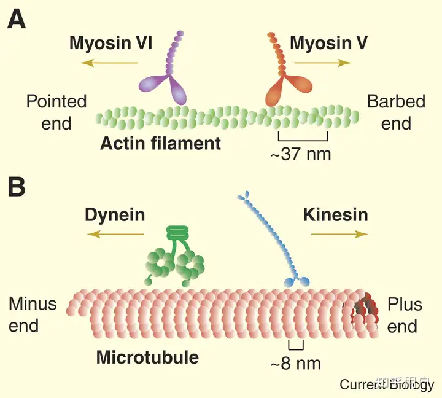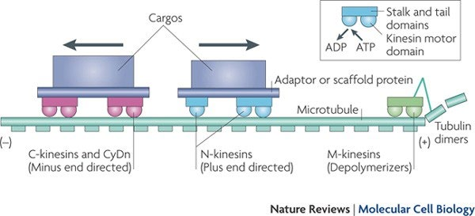
		- dynein负责将细胞边缘的货物运回细胞中心，而kinesin负责将细胞中心的货物运到细胞边缘
		- Case:敲除相关基因后，改变植物的向重力性
-  ==形成纺锤体== 
- 纤毛与鞭毛的运动→依靠动力蛋白denein水解ATP，使相邻的二联微管相互滑动
----
- References：
	- [【高中生物】什么是细胞骨架，它的微观结构以及与之对应的功能是怎样的？ - 知乎](https://zhuanlan.zhihu.com/p/584200960)
	- [细胞生物学8-第八章-细胞骨架-CSDN博客](https://blog.csdn.net/m0_49453932/article/details/124351832)这个要收费💴，我请问呢
	- [细胞生物学—细胞骨架（最后一篇） - 知乎](https://zhuanlan.zhihu.com/p/338539052)
	- [关于细胞骨架的二三事（一） - 知乎](https://zhuanlan.zhihu.com/p/451597438)
	- [微丝 Microfilament 蓝色动物学（中国动物学科普）](https://blueanimalbio-mirror.github.io/cell/ws.htm)
	- [细 胞 生 物 学 教 程](http://www.cella.cn/book/09/01.htm)