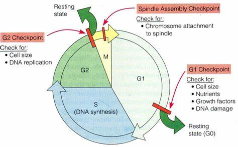
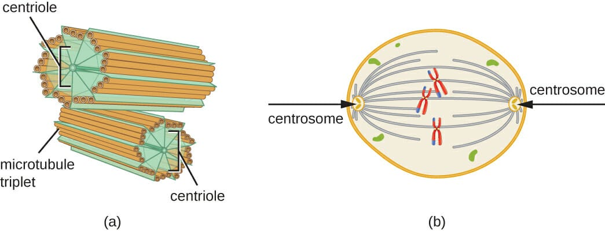
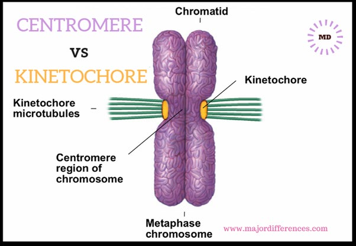
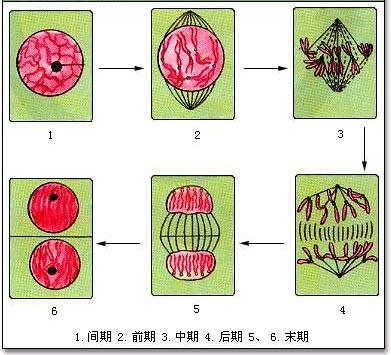
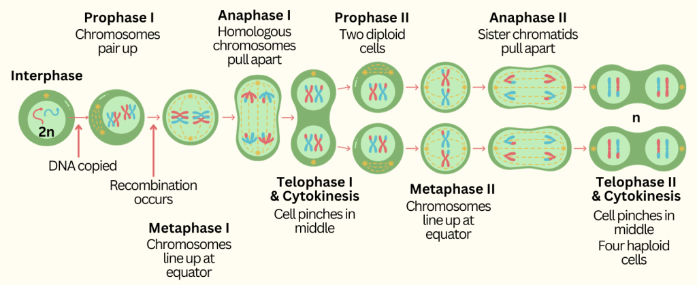
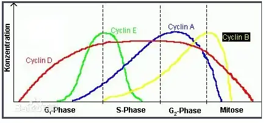

## 一、细胞增殖
#### 1. 意义：

#### 2. 细胞周期
- 概念：一次细胞分裂结束开始，经过物质准备，直到下一次细胞分裂结束为止，称为一个细胞周期
- 分类
	- 间期interphase：用于物质准备
		- G1期：细胞生长期，开始合成细胞生长所需的各类蛋白质、糖类、脂质
			- 决定了细胞周期的长短
		- S期：细胞开始合成DNA和组蛋白
		- G2期：细胞是否能够进入M期的G2期检验点
	- 分裂期Mitosis phase
		- 
- 测定时长的方法：
	- 流式细胞仪
- 细胞周期同步化[[Chapter7 微生物的生长]]
- 特殊的细胞周期类型
	- 早期胚胎细胞周期：G1和G2期非常短
		- 存在于两栖类、海洋无脊椎动物
	2. 酵母细胞周期：持续时间短，大约90mins
		1. 细胞分裂过程属于封闭式，为核内有丝分裂
		2. 芽殖酵母和裂殖酵母
			1. 芽殖酵母：
			2. 裂殖酵母：胞质分裂均等，细胞生长仅细胞长度增加
	3. 植物细胞的细胞周期
		1. 无中心体
	4. 细菌的细胞周期[[Chapter3 DNA的复制Replication of DNA]]
## 二、细胞分裂
#### 1. 类型
- 无丝分裂/直接分裂：
- 有丝分裂
	- 有纺锤体、染色体出现
	- 有关亚细胞结构
		- 中心体
			- 含有两个互相垂直的中心粒
			- 在间期，微管围绕中心体装配
		- 着丝粒与动粒/着丝点🤯
			- **着丝粒centromere**：由高度重复的异染色质组成，本质是特化的 ==DNA序列== 
			- 动粒/着丝点kinetochrone：附着在着丝粒上的 ==蛋白复合体== ，外部附着着纺锤体微管
				-  ==负责染色体分离== 的一种高度复杂的蛋白质结构
		- 纺锤体spindle：由微管和微管结合蛋白组成的一种与染色体分离直接相关的细胞器
- 减数分裂
#### 2. 有丝分裂的过程
1. 前期(prophase）染色质丝高度螺旋化，逐渐形成染色体（chromosome）
	1. 染色体短而粗，强嗜碱性。
	2. 两个中心体向相反方向移动，在细胞中形成两极；而后以中心粒随体为起始点开始合成微管，形成纺锤体。
	3. 随着核仁相随染色质的螺旋化，核仁逐渐消失。核被膜开始瓦解为离散的囊泡状内质网。
2. 中期（metaphase）：细胞变为球形，核仁与核被膜已完全消失。
	1. 染色体均移到细胞的赤道平面，从纺锤体两极发出的微管附着于每一个染色体的着丝点上
	2. 姐妹染色单体分向细胞两极👉分别连接来自不同级的微管(连错了数量会变异噢)
3. 后期（anaphase）：由于纺锤体微管的活动，着丝点纵裂，每一染色体的两个染色单体分开，并向相反方向移动，接近各自的中心体，染色单体遂分为两组
	- 细胞被拉长，并由于赤道部细胞膜下方环行微丝束的活动，该部缩窄，细胞遂呈哑 铃形。
	- 胞质分裂cytokinesis开始：赤道板周围细胞质膜内陷形成环形缢缩，称为分裂沟furrow
		- 大量肌动蛋白在分裂沟内侧聚集组装成微丝；极性相反的微丝平行排列成束并环绕形成收缩环contractile ring
		- 微丝马达蛋白－肌球蛋白在极性相反的微丝间搭桥并沿微丝滑动为环收缩提供动力
			- 极性相反的微丝间相对滑动导致收缩环收缩
			- 随着细胞分裂由后期向末期转化，分裂沟逐渐加深，最终收缩环处的细胞质膜融合而使两个子细胞分离
		- 胞质分裂完成后，形成收缩环的微丝解聚消失。
4. 末期telophase：
	1. 染色单体逐渐解螺旋，重新出现染色质丝与核仁；
	2. 内质网囊泡组合为核被膜；组胞赤道部缩窄加深，最后完全分裂为两个2倍体的子细胞。
#### 3. 减数分裂概述
- Concepts：减数分裂是一种特殊形式的有丝分裂；细胞仅进行一次DNA复制，随后进行两次细胞分裂，导致两性生殖细胞各自的染色体数减半
- 意义
	- 染色体数减半的两性生殖细胞经受精形成合子，染色体数恢复到体细胞的染色体数。这样子代有效地获得了父母双方的遗传物质，保持了遗传稳定性。
	- 减数分裂是生物有性生殖的基础，是生物遗传、生物进化和生物多样性的重要基础保证
- 过程 
	- 前期同源染色体会联会并发生交换
	- 减数分裂Ⅰ和Ⅱ之间很短，不进行DNA的合成，有些生物没有间期
	- 子细胞染色体数目减半
## 三、细胞增殖调控
#### 1. 成熟促进因子MPF
- Concepts：促进细胞进入分裂期
- 结构：
	- 催化亚基Cdk1
		- **周期蛋白依赖性蛋白激酶（CDK）**
			- 该蛋白家族也涉及转录调控、mRNA加工和神经细胞的分化
			- 在植物中：植物拥有更多CDK基因，反映了植物在响应环境刺激、协调生长等方面的需求
				- Case1：番茄果实生长与细胞分裂有关→番茄中CDKB基因过表达会导致果皮中细胞层数量减少和果实脱水
				- Case2:CDK突变提高了植物生长和耐旱能力→原因：分裂减少，气孔密度下降
				- Case3:抑制CDK基因表达会导致细胞变大→原因：抑制了细胞周期G2期到M期的改变，并促进了核内复制，没有有丝分裂
	- 调节亚基CyclinB
		- **Cyclin**：含有”周期蛋白框“或同源序列的一类蛋白，在细胞中的合成和降解呈周期性变化
			- 在哺乳动物中**CyclinA** 在G1期的早期即开始表达和逐渐积累，到达G1/S交界处，含量达到最大值并一直维持到G2/M期
			- **CyclinB** 则从G1期晚期开始表达并逐渐积累，到G2期后期阶段达到最大值并一直维持到M期的中期阶段，然后迅速降解
		- 发现：受精海胆卵中
		- 不同的Cyclin在细胞周期中的表达时期不同，且与不同CDK结合
			- G1期周期蛋白在细胞周期中存在的时间相对较短，而M期周期蛋白在细胞周期中相对稳定
- 调控作用
	- Cyclin与Cdk结合形成MPF，当数量足够时， ==促使细胞从G2期进入M期== 
	- 高活性的cyclin-B1/CDK1在早期有丝分裂中引发不可逆的细胞变化，包括中心体分离、核膜破裂和纺锤体组装
	- 与核纤层的关系：核纤层蛋白是MPF的另一催化底物，核纤层蛋白在有丝分裂时处于高度磷酸化状态，到有丝分裂结束则发生去磷酸化，均与MPF的特异性的催化作用有关，而这一过程被认为是引起核纤层结构解体、核膜破裂的直接原因。
	- 2001年发现获得Nobel奖
#### 2. 癌症与细胞迁移
---
- References
	- [盘点：科研实验中常见7种细胞增殖检测方法 - 知乎](https://zhuanlan.zhihu.com/p/660858416)
	- [【实验技术笔记】细胞表型检测之细胞增殖（CCK-8法 + BrdU掺入法 + 平板克隆）_cck8检测细胞增殖怎么计算-CSDN博客](https://blog.csdn.net/zea408497299/article/details/125392761)
	- [什么是细胞周期？细胞周期时间如何确定？ - 知乎](https://www.zhihu.com/question/379347919)
	- [在减数分裂中MPF的作用有哪些？ - 简书](https://www.jianshu.com/p/bca75479573e)