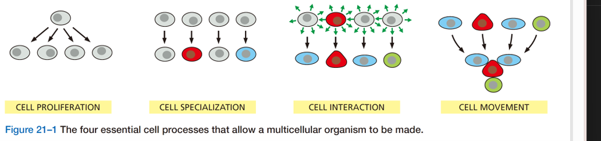
## 一、细胞分化
#### 1. Concepts
- 细胞分化cell differentiation：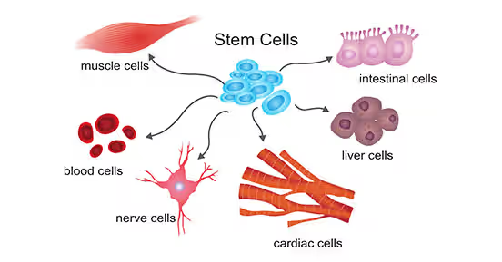
	- 关键：特异蛋白质的合成→本质:基因的选择性表达
- 管家基因和组织特异性基因
	- house-keeping genes：在所有细胞中均要稳定表达的一类基因，其产物是对维持细胞基本生命活动所必需的
		- PCR测定 #课后拓展 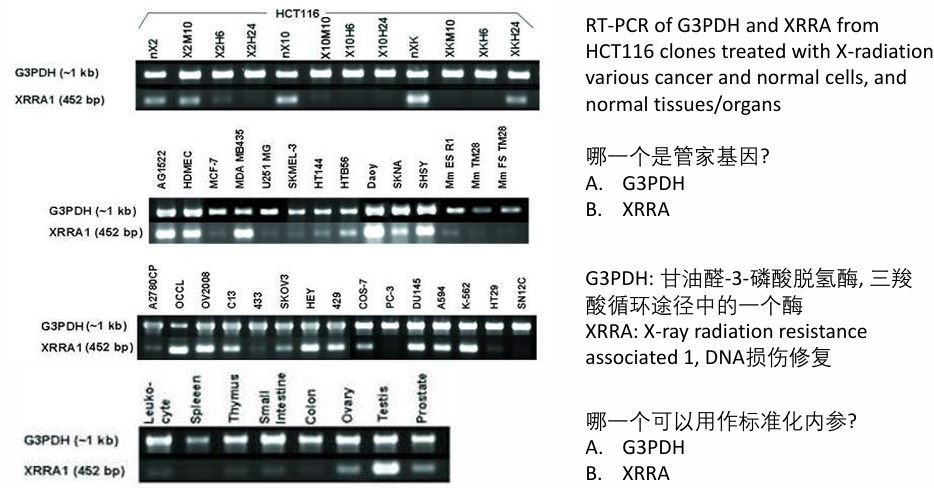
	- tissue-specific genes:不同细胞类型特异性表达的基因，其产物赋予各类型细胞特异的形态结构特征与特异生理功能
		- e.g.胰岛素基因、血红蛋白基因
		- 涉及转录水平、转录后水平以及 ==表观遗传修饰== ；占基因总数的大多数
		- e.g.乳糖不耐受
	- 组合调控：由少量的调控蛋白启动为数众多的特异细胞类型分化的调控机制👉组织特异性表达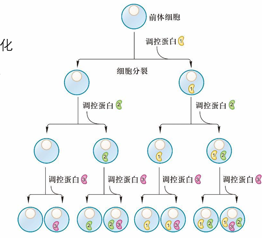
		- 调控蛋白可以调控下游的一系列基因，并进行组合调控→可以类比“ABC基因”，但是本质不一样[[Chapter8 Floral and reproductive physiology in plant]]
		- 编码具有决定性作用的调控蛋白的基因叫做主导基因，主导基因的表达可以启动整个分化过程
			- e.g.	MyoD调控肌细胞的分化:转入成纤维细胞(皮肤结缔组织)中表达，使成纤维细胞表现出骨骼肌细胞的特征
			- Ey(果蝇中)可以诱导整个器官的形成，把这个基因在腿中表达可以形成眼镜w(ﾟДﾟ)w
- 单细胞生物的细胞分化：用来适应不同的生活环境
	- e.g.黏菌的繁殖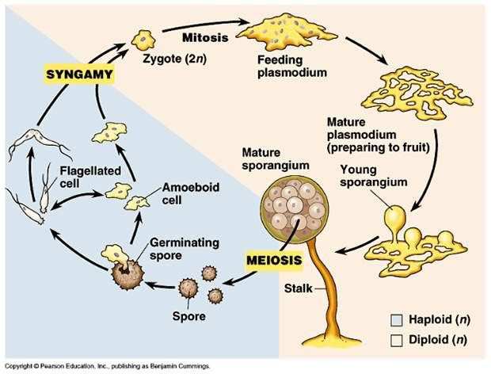
#### 2. 转分化和再生
- **转分化(transdifferentiation)**: 一种类型的分化细胞转变成另一种类型的分化细胞的现象
	- 分类
		- 去分化(dedifferentiation): 又称脱分化，是指分化细胞失去其特有的结构与功能变成 ==具有未分化细胞== 特征的过程→就好比人辞职了
			- 重编程(reprogramming):涉及DNA与组蛋白修饰的改变
		- 再分化：未分化的细胞重新特化→再找工作
	- 应用：提取AD病人的成纤维细胞来研究甲基化现象
- **再生(regeneration)**: 生物体缺失部分后重建的过程
	- 不同的有机体，其再生能力有明显的差别→一般植物比动物强，低等动物比高等动物强
	- e.g.小壁虎的尾巴吗🤔
#### 3. 影响细胞分化的因素 
1. 受精卵 ==细胞质的不均一性== 
	- 卵裂过程中，不同的细胞质被分配到不同子细胞中，从而对子细胞分化命运产生影响
	- 受精后，区域性分布的母体基因产物通过级联反应，激活或抑制相应的合子基因表达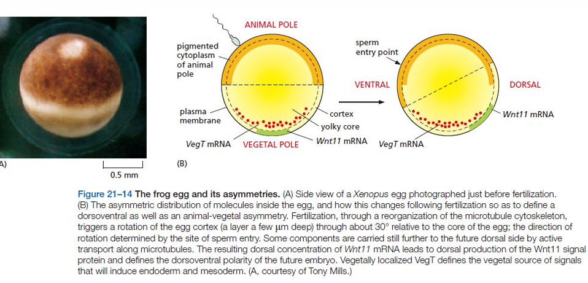
2. 信号分子及细胞的位置信息
	1. 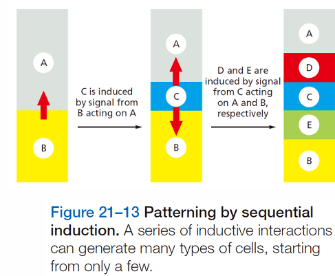
	- 近端组织相互作用(proximate tissue interaction)，也称近端诱导 (proximate interaction)或胚胎诱导(embryonic induction)：在胚胎发育过程中，一部分细胞影响周围的细胞，使其向一定方向分化的作用
		- 主要是通过 ==信号细胞分泌产生的信号分子改变周围细胞（靶细胞）的 分化方向== 来实现
	- 远程作用：激素
3. 细胞记忆与决定
	- 决定：指一个细胞接受了某种指令，在发育中这一细胞及其子代细胞将区别于其他细胞而分化成某种特定的细胞类型，或者说在形态、结构与功能等分化特征尚未显现之前就已确定了细胞的分化命运
		- e.g.果蝇的成虫盘imaginal disc
	- 细胞可将信号分子短暂的有效作用储存起来形成长时间的记忆，逐渐向特定方向分化 
		1. 正反馈途径（positive feedback loop），即细胞接受信号刺激后，激活转录调节因子，该因子不仅诱导自身基因的表达，还诱导其他组 织特异性基因的表达 
		2. 染色体结构变化（DNA 与蛋白质相互作用及其修饰）的信息传到子代细胞
4. 染色质变化与基因重排
	- 染色体丢失：
		- e.g.马蛔虫发育过程中，只有生殖细胞得到了完整染色体，而体细胞中的染色体只是部分染色体片段
		- e.g.纤毛虫中的小核是生殖核，含有全部的染色体
	- **基因重排**：在B淋巴细胞分化过程中，DNA 通过体细胞重组, 使DNA序列中不同部位的部分基因片段连接在一起，组成产生抗体mRNA的DNA序列
5. 环境的影响
	1. 温度依赖性性别决定：斑马鱼等

## 二、干细胞
#### 1. 细胞全能性
- 细胞全能性
- 细胞多能性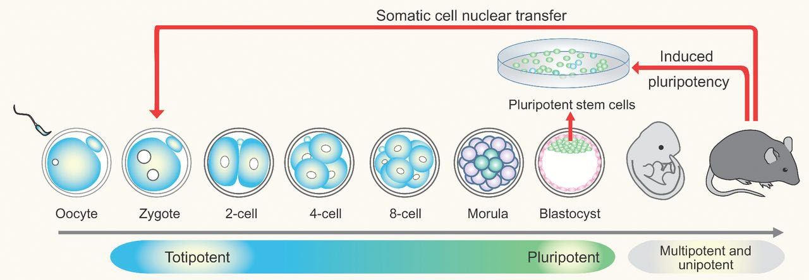
	- 比全能性要差一些，比如从全才变成了多才
- 克隆技术
	- 应用：
		- 大量繁殖性状优良的家禽家畜；
		- 繁殖保护濒危物种；
		- 生产人胚胎干细胞用于细胞和组织替代疗法；
		- 易被人体接受的移植器官；
		- 生产转基因动物，可作为医用器官移植的供体、作为生物反应器。
	- 主要难题:体细胞核的重编程以及伦理问题
#### 2. 干细胞的相关概念
- Concepts：机体中能 ==进行自我更新== （产生与自身相同的子代细胞）并具有 ==多向分化潜能== （分化形成不同细胞类型）的一类细胞 
	- 在细胞分化，个体发育和成体维持等生命过程中，起着关键和决定性的作用
	- 终末分化：干细胞最终形成的特化类型
	- 特点：
		- 本身不是终末分化细胞
		- 可以 ==无限分裂== 
		- 干细胞的两个选择：保持干细胞形态/不可逆地走向终末分化
- 分类：
	- 分化潜能不同
		- **全能干细胞(totipotent stem cell)**: 具有分化形成完整生命体的潜能或特性
		- **多潜能干细胞(pluripotent stem cell)**: 在一定条件下，能分化产生三个 胚层中各种类型的细胞并形成器官
		- **多能干细胞(multipotent stem cell)**: 具有分化形成多种细胞类型的能力
		- 单能干细胞(unipotentstem cell): 只能向一种或密切相关的几种终末细胞类型分化
	- 来源不同：
		- 胚胎干细胞(embryonic stem cell, ESC): 多潜能干细胞[[#^327a89]]
		- 成体干细胞(adult stem cell): 多能干细胞和单能干细胞[[#^3cd3cf]]
- 增殖方式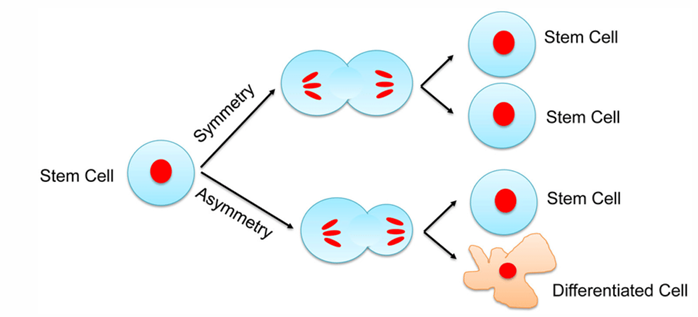
	- 对称性分裂：自身数目的扩增
	- 不对称性分裂：除了产生干细胞外还产生了分化的细胞

#### 3. 胚胎干细胞(embryonic stem cell, ESC)
^327a89
- Concepts： ==从原始生殖细胞或着床前的内细胞团== 获得的一种具有多潜能性、可发育成为各种细胞、同时可保持不分化状态而持续生长的克隆细胞系
	- 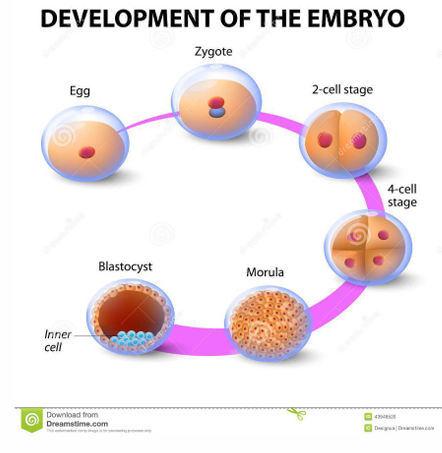
	- 可以进行细胞培养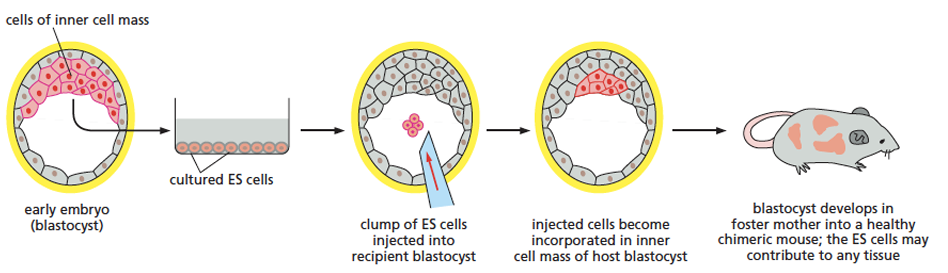
- 应用价值
	- 用来研究发育的过程如胚胎等
	- 新药筛选和药理研究的体外模型
	- 克隆治疗的载体
	- **再生医学(regenerative medicine)**：可以实现无免疫排斥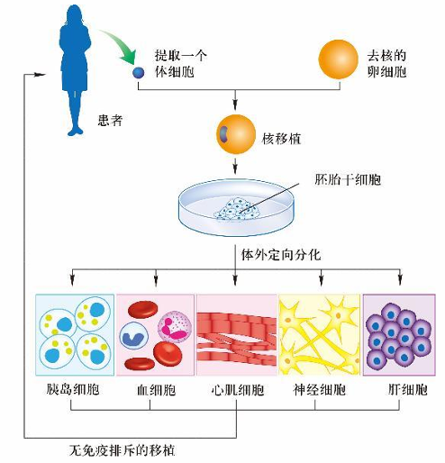
- **诱导多能干细胞(induced pluripotent stem cell, iPS cell)** :向动物体细胞导入 ==特定的转录因子== 使其发育状态 ==重编程== 而转变成的具有 ==多能性== 的类胚胎干细胞
	- 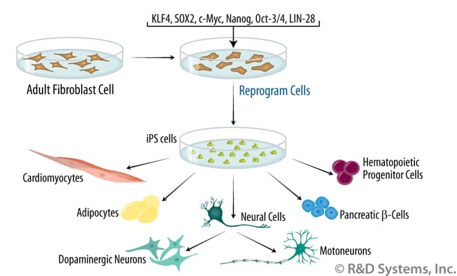
	- 可以避免伦理问题
	- 可以避免免疫排斥
	- e.g.我国科学家周琪通过iPS得到了小鼠个体:O!；2012山中获得诺贝尔奖：将小鼠的成纤维细胞诱导成iPS细胞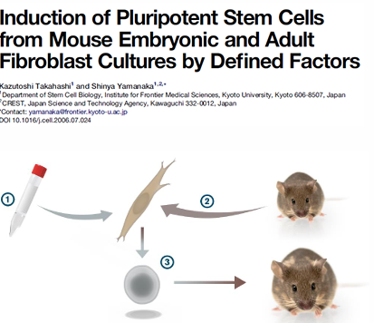
		- Q:为什么使用成纤维细胞？→比较好养，分化程度较低
#### 4. 成体干细胞
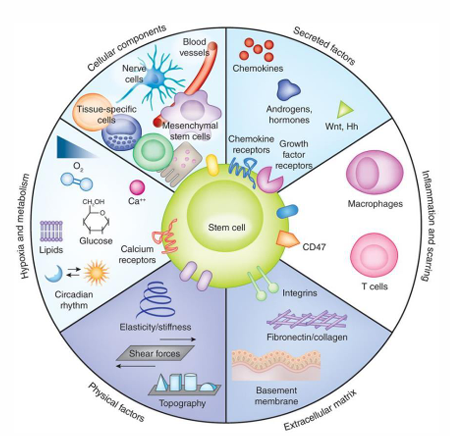
^3cd3cf
- 概念：(Adult stem cells/somatic stem cells/tissue stem cells)
	- 基本功能是分化产生某些类型的终末分化细胞
	- 广泛地存在于多种组织，如造血系统、皮肤、肠、卵巢、睾丸和肌肉中，甚至成年脑的某部位
	- 某些组织中已分化的细胞仍具有很强再生能力，其中是否存在成体干细胞，仍未有定论（如肝脏和胰岛）
- 特征：
	- 成体干细胞需要特定的微环境来维持它们的特性，这种提供特定胞外信号的微环境称为**干细胞巢Stem cell niche** 
	- 细胞分裂很慢，有些是受到外界信号刺激才会分裂
	- 可以 ==均等分裂== 成两个子代干细胞，也可通过不均等分裂行成一个干细胞和一个祖细胞
- 基本功能：分化产生某些类型或某些种类的终末分化细胞
- 类型
	- **造血干细胞(hematopoietic stem cells, hsc)**
		- 成体哺乳动物的造血干细胞大部分存在 于骨髓中，多数造血干细胞处于相对静 止的状态，即G0期
		- 长效造血干细胞（long-term hematopoietic stem cell，LT-HSC）
		- 短效造血干细胞（ST-HSC）
	- 胚胎神经干细胞(embryonic neural stem cells):将发育成整个中枢神经系统 
		- 胚胎神经干细胞可通过对称分裂方式形成两个子代干细胞，也可以不对称分裂形成一个干细胞和另一个向外迁移的细胞，称之为短暂增殖细胞(transient amplifying cells)
			- 短暂增殖细胞可以形成神经祖细胞， 向外迁移形成连续的神经层
		- 成年哺乳动物的脑中也存在神经干细胞
	- 肠干细胞:存在于长臂深处的隐窝crypts中，可以连续不断地产生肠上皮细胞
		- **潘氏细胞(Paneth cells)**：由肠干细胞分化而来的一群细胞，其分布在干细胞周围并形成干细胞巢来维持肠干细胞
## 三、癌细胞
#### 1. 基本特征
- 肿瘤细胞
	- 良性肿瘤
	- 恶性肿瘤
- 基本特征：
	1. 细胞生长与分裂失去控制： ==核质比增大== ，细胞分裂加快，破坏了正常组织的结构和功能
		- 高分化癌：肿瘤组织与正常组织相似，恶性程度低，预后好
		- 低分化癌与未分化癌
	2. 具有浸润性和扩散性：容易浸润周围的健康组织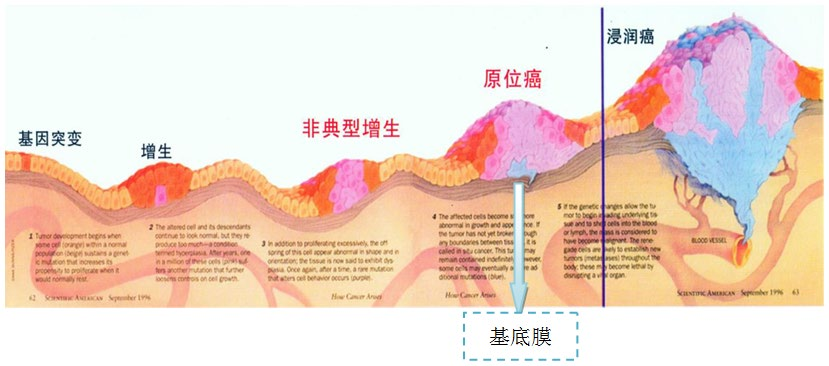
		- **转移灶**:由原位癌转移并在身体其它部分增殖产生的次级肿瘤
		- **原位癌**：癌症发展的早期阶段，仅限于上皮组织中的最内侧，一般难以发现
	3. 细胞间相互作用改变→[[Chapter3 物质的跨膜运输与信号传递]]
		- 癌细胞表面的受体蛋白发生改变，粘附性改变
			- 下调肿瘤特异性抗原的表达，可以逃避免疫系统的监视
	4. 表达谱改变和蛋白活性改变
		1. 表达谱主要特征：
			1. 出现胚胎细胞中所表达的蛋白
			2. 端粒酶活性增高👉无限分裂增殖
			3. 异常表达与癌的发生发展相关的蛋白
		2. 异质性特征：同一种癌，癌细胞在不同人/不同部位间也会不一样
#### 2. 原癌基因与抑癌基因
- 原癌基因：细胞的正常基因，编码细胞周期、细胞增殖的各种活性蛋白，是细胞正常生活所必需的
	- 突变👉”癌基因“
		- 病毒癌基因→”病毒致癌论“：病毒携带致癌基因导致癌症×
			- 作用机制：受到外界条件刺激后诱导肿瘤的发生→影响基因的表达、基因组稳定及表观遗传
		- 细胞癌基因
- 抑癌基因(tumor-suppressor genes):存在于正常细胞中可以抑制细胞生长并具有潜在的抑癌作用的基因
	- 是增值过程中的负调控因子/促进细胞凋亡
	- 突变会导致细胞周期失控
		- 抑癌基因的突变性质是隐性的( ==两个等位基因失活才会导致癌症== )→就像教练座位的刹车没用了😂
		- 发现：Rb基因突变导致视网膜母细胞瘤形成→遗传性肿瘤在家族中传递时，已经携带了一个突变的基因，这时候再突变一次就会导致肿瘤
	- e.g.肿瘤抑制基因*p53*：在正常细胞中起着减慢/监视的作用
#### 3. 肿瘤的发生
- 基因突变的累积
- 肿瘤标志物：在早筛过程中非常重要

---
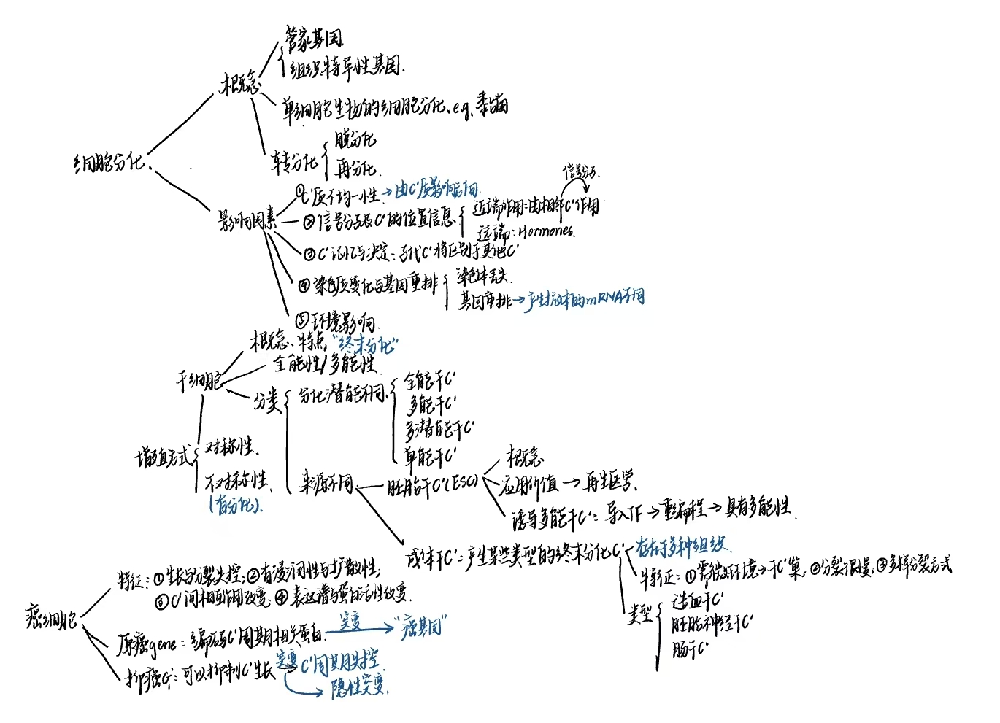

---
- 浅谈你认为癌症治疗的发展方向是什么？就一个方向展开说明
- 诱导多能干细胞有何应用价值？比起胚胎干细胞有何优势？
- 什么是癌基因、原癌基因和抑癌基因？可能导致癌变的因素有哪些？

----
- References：
	- [第十二章 细胞分化与凋亡](http://www.cella.cn/jxck/14.pdf)
	- [一文弄懂细胞可塑性、细胞分化轨迹、细胞谱系和RNA速率 - 知乎](https://zhuanlan.zhihu.com/p/680992007)
	- [细胞分化 - A+医学百科](http://www.a-hospital.com/w/%e7%bb%86%e8%83%9e%e5%88%86%e5%8c%96)
	- [让人惊惧的癌细胞，到底长什么样？14张图带你近距离了解|癌细胞|乳腺癌|肿瘤|胶质|基因|肺癌|-健康界](https://www.cn-healthcare.com/articlewm/20210616/content-1232534.html)
	- [凶残而狡猾的癌细胞是如何发生、生长、扩散、潜伏和复发的？ - 知乎](https://zhuanlan.zhihu.com/p/37171198)
	- [Cell丨解读乳腺癌症：从生物学到临床 - 知乎](https://zhuanlan.zhihu.com/p/617034999)