## Section1 有关文献
#### 1. 农学院论文

----
## 二、细胞衰老
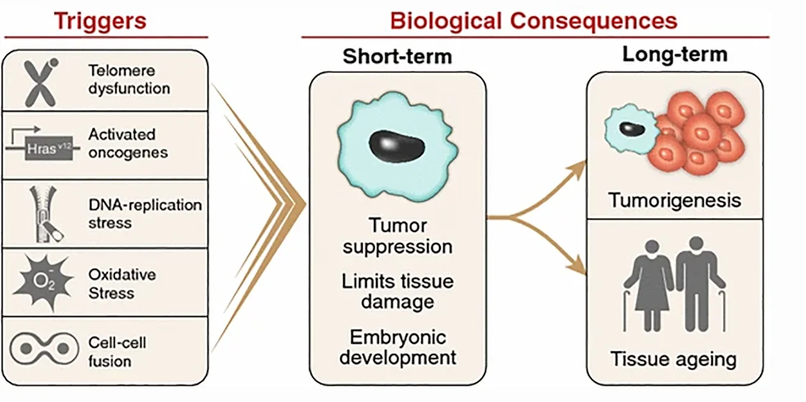
#### 1. 衰老概念
- Concepts:衰老又称老化，通常指生物发育成熟后，在正常情况下随着年龄的增加，机能减退，内环境稳定性下降，结构中心组分退行性变化，趋向死亡的 ==不可逆的现象== 
	- 与G0期的静止细胞状态不同→类比衰老细胞是直接退赛了😂
- **Hayflick界限**：大部分正常细胞在体外培养时，不能无限分裂，只能在 ==分裂一定次数== 后处于静止状态
	- Methods:让成纤维细胞在培养皿中培养，直到铺满培养皿→发现50代后不论环境多好都会停止分裂
	- 他还比较了不同细胞传代次数与个体寿命的关系，发现大致呈正比
#### 2. 人体细胞的动态分类
1. **更新组织**：执行某种功能的特化细胞，经过一定时间后衰老死亡， ==由新细胞分化成熟补充== 
	- 干细胞→能进行增殖又能进入分化过程[[Chapter8 细胞分化与干细胞]]
	- 过渡细胞→来自干细胞，是能伴随细胞分裂趋向成熟的中间细胞
	- 成熟细胞，不再分裂，经过一段时间后衰老和死亡
2. **稳定组织细胞**：是分化程度较高的组织细胞，功能专一，正常情况下没有明显的衰老现象，细胞分裂少见，但在某些细胞受到破坏丧失时，其余细胞也能进行分裂，以补充失去的细胞，如肝、肾细胞
3. 恒久组织细胞，属高度分化的细胞，个体一生中没有细胞更替，破坏或丧失后不能由这类细胞分裂来补充。如神经细胞，骨骼细胞和心肌细胞。
4. 可耗尽组织细胞，如人类的卵巢实质细胞，在一生中逐渐消耗，而不能得到补充，最后消耗殆尽。
#### 3. 细胞衰老的特征
- 形态变化：
	- 细胞皱缩，膜通透性、脆性增加
	- 核膜内折，核增大，染色深，核内有包含物
	- 细胞器数量特别是 ==线粒体数量减少,体积增大，mtDNA突变/丢失)== 
	- 细胞骨架：特别是微丝→与细胞增殖、分化的调节直接相关[[Chapter6 细胞骨架]]
	- 细胞质：色素积聚、空泡形成
- 分子特征[[Chapter8 种子寿命]]
	- 细胞内水分(自由水)的减少
	- 出现色素堆积→主要是脂褐素沉积👉“老年斑”:O!
	- DNA的复制与转录受到抑制，但也有个别基因会异常激活
		- 端粒DNA丢失，甲基化程度降低
	- RNA：mRNA和tRNA含量降低
	- 蛋白质：含成下降，细胞内蛋白质发生糖基化、氨甲酰化、脱氨基等修饰反应，导致蛋白质稳定性、抗原性，可消化性下降
		- 自由基使蛋白质肽断裂，交联而变性
		- 氨基酸由左旋变为右旋
	- 酶分子：活性中心被氧化，金属离子Ca2+、Zn2+、Mg2+、Fe2+等丢失，酶分子的二级结构/溶解度/等电点发生改变→酶失活
	- 脂类：不饱和脂肪酸被氧化，引起膜脂之间或与脂蛋白之间交联，膜的流动性降低
#### 4. 细胞衰老的假说
1. 差错学派：细胞衰老是各种细胞成分在受到内外环境的损伤作用后，因缺乏完善的修复，使“差错”积累，导致细胞衰老
	1. 代谢废物积累：细胞代谢产物积累至一定量后会危害细胞，引起衰老
		- e.g.哺乳动物脂褐质的沉积→脂褐质是一些长寿命的蛋白质和DNA、脂类共价缩合形成的 ==巨交联物== 
		- 次级溶酶体是形成脂褐质的场所，由于脂褐质结构致密， ==不能被彻底水解== ，又不能排出细胞，结果在细胞内沉积增多，阻碍细胞的物质交流和信号传递，最后导致细胞衰老，如老年性痴呆（AD）就是由β-淀粉样蛋白沉积引起的，因此β-AP可做为AD的鉴定指标
	2. **自由基学说free radical theories**：自由基是一类瞬时形成的 ==含不成对电子== 的原子或功能基团，普遍存在于生物系统
		- 分类：
			- **氧自由基**（如羟自由基·OH）其中·OH的化学性质最活泼，统称为**活性氧ROS**
			- 非氧自由基:氢自由基（·H)、碳自由基、脂自由基等，其中·OH的化学性质最活泼
		- 人体内自由基的产生：
			- 环境中的高温、辐射、光解、化学物质等引起的外源性自由基；
			- 体内各种代谢反应产生的内源性自由基，是人体自由基的主要来源
				1. 由线粒体呼吸链电子泄漏产生
				2. 由经过氧化物酶体的多功能氧化酶（MFO）等催化底物羟化产生
				3. 机体血红蛋白、肌红蛋白中还可通过非酶促反应产生自由基
		- 危害：自由基含有未配对电子，具有高度反应活性，可 ==引发链式自由基反应== ，引起DNA、蛋白质和脂类，尤其是多不饱和脂肪酸PUFA等大分子物质变性和交联👉损伤DNA、生物膜、重要的结构蛋白和功能蛋白，从而引起衰老各种现象的发生
			- 对脂肪作用时，会击中血液中漂浮的胆固醇微滴→导致动脉堵塞
			- 实验表明DNA中OH8dG随着年龄的增加而增加。OH8dG完全失去碱基配对特异性，不仅OH8dG被错读，与之相邻的胞嘧啶也被错误复制
		- 正常细胞内存在清除自由基的防御系统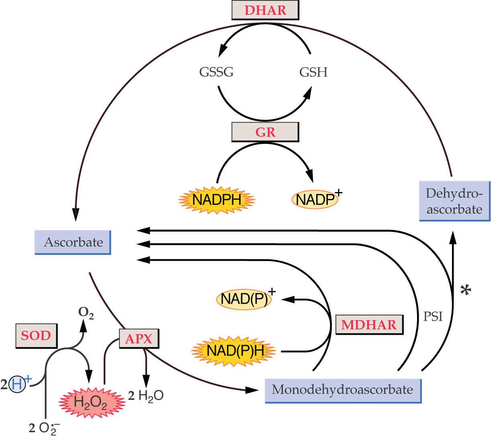
			- 酶系统Protective enzyme system： ==SOD(超氧自由基歧化酶)== 、AAO、谷胱甘肽还原酶、过氧化氢酶、谷胱甘肽过氧化酶等
				- Orr WC和Sohal RS（1994），将铜锌超氧化物岐化酶（copper-zinc superoxide dismutase）基因导入果蝇，使转基因株具有3个拷贝的SOD基因，其寿命比野生型延长1/3。这个实验为衰老的自由基学说提供了有力的证据
				-  ==SOD(超氧自由基歧化酶)== 、AAO、谷胱甘肽还原酶、过氧化氢酶、谷胱甘肽过氧化酶等
					- SOD types:
						- Cu and Zn SOD:需要铜离子和锌离子的参与，一般存在于高等植物的叶绿体以及细胞质
						- Mn—SOD mainly distributes in prokaryotic bacteria as well in eukaryotic mitochondria.大多数存在于原核生物中
						- Fe—SOD is a basic type，mainly locates in green alga and chloroplast.
				- 谷胱甘肽循环能够很好地消除超氧自由基
			- Non-protective enzyme system非酶保护系统：有维生素E、醌类物质等电子受体、细胞色素f、抗坏血酸、和类胡萝卜素等
				- 常常添加进食品中以延长保存时间 #课后拓展 原理？
			- 自由基清除剂:大多为 ==抗氧化剂== 
	3. 端粒学说：
		- 端粒[[Chapter3 DNA的复制Replication of DNA]]
		- 正常细胞冻存后依旧记得之前复制了多少次
		- 端粒与衰老的因果关系：
			- 端粒长度是衰老改变人体表达的载体
2. 遗传学派： #课后拓展 认为衰老是遗传决定的自然演进过程，一切细胞均有内在的预定程序决定其寿命，而细胞寿命又决定种属寿命的差异，外部因素只能使细胞寿命在限定范围内变动
	1. 程序性衰老（programmed senescence）：生物的生长、发育、衰老和死亡都由基因程序控制的，衰老实际上是某些基因依次开启或关闭的结果[[#^fe7b17]]
		- e.g.小鼠肝中，胚胎早期表达的胞质丙氨酸转氨酶(cytosolic alanine aminotransferase，cAAT)为A型，随后停止表达，但是在衰老时则表达B型cAAT
		- 此外程序性学派还认为衰老还与神经内分泌系统退行性变化以及免疫系统的程序性衰老有关
	2. 复制性衰老(replicative senescence)→Hayflick界限与端粒
	3. 长寿基因(longevity genes):统计学资料表明，子女的寿命与双亲的寿命有关，各种动物都有相当恒定的平均寿命和最高寿命
		- 成人早衰症病人平均39岁时出现衰老，47岁左右生命结束
		- 患婴幼儿早衰症的小孩在1岁时出现明显的衰老，12-18岁即过早夭折
		- 由此来看物种的寿命主要取决于遗传物质，DNA链上可能存在一些“长寿基因”或“衰老基因”来决定个体的寿限
--------------
## 三、细胞死亡 
#### 1. 概念
- Concepts
- 细胞坏死cell necrosis：细胞的 ==被动死亡== 
	- 特点：细胞质膜和核被膜破裂，细胞骨架和核纤层解体，细胞质溢出→ ==引起炎症反应== 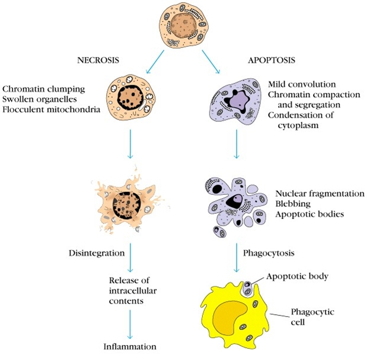
- **细胞凋亡Cell apoptosis**:指细胞按照自身的程序结束其生存→自杀/程序性细胞死亡PCD
	-  ==细胞质膜保持完整== ，内含物不发生外露，不引发炎症反应
	- 细胞的有序性死亡，能够更好地适应环境
- 凋亡与坏死的区别
	- 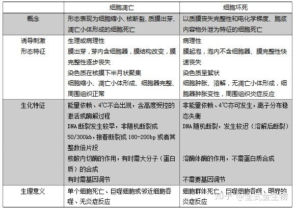
#### 2. 细胞凋亡
^fe7b17
- 形态特征：
	- 细胞膜保持完整，仍有通透性
	- 染色质固缩，沿着核膜分布， ==DNA有序断裂== 👉可以用形态学观察
	- 形成凋亡小体
-  检测：
	- 形态学检测
		- 染色法：用Giemasa染色质使染色质着色或是荧光染料DAPI
			- 采用透镜/冷冻电镜
		- DNA电泳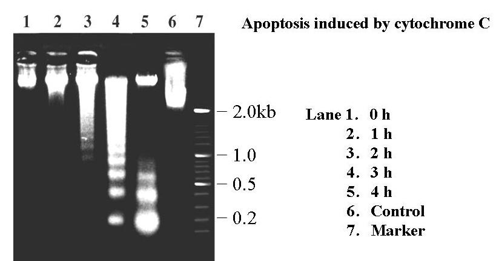
			- DNA ==降解成180-200bp或其整数倍片段== 👉缠绕在核小体上一般是150-200bp:O! ^83e551
		- DNA断裂的原位末端标记法：TUNEL能够对DNA分子断裂缺口中的3-OH'
		- 彗星电泳法comet assay：凋亡细胞中DNA断裂片段的电泳速度很快→会使细胞核呈现彗星式拖尾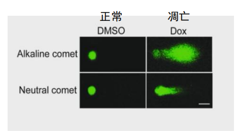
		- 流式细胞分析：可以判断细胞中DNA的相对含量→细胞凋亡后可能是亚二倍体状态
- 意义:
	- 降低细胞数量，能够控制细胞族群大小
		- 可以清除发生过程以及成熟个体中多余细胞及老化细胞
	- 结构及形态形成→胚胎小登的手指/植物的通气组织
	- 清除结构：清除掉不再需要的过度结构e.g.两栖动物中的功能性肾脏会在哺乳动物中被清除(我能不能联想一下人类的尾巴和蝌蚪的尾巴🤔)
	- 消除潜在的危险细胞→参与免疫耐受的形成e.g.T细胞克隆凋亡异常会引起免疫疾病
		- 凋亡不足会引起肿瘤/自身免疫性疾病如系统性红斑狼疮
		- 调往过度会引起免疫功能的丧失与炎症e.g.心血管疾病，神经元退行性疾病
#### 3. 细胞凋亡的原因
- 分子机理
	1. Caspase家族
		- Caspase属于 ==半胱氨酸蛋白酶== ，相当于线虫中的ced-3，这些蛋白酶是引起细胞凋亡的关键酶，一旦被信号途径激活，能 ==将细胞内的蛋白质降解== ，使细胞不可逆的走向死亡 ^aaf74d
		- 特点： #课后拓展 
			- 酶活性依赖于半胱氨酸残基的亲核性；
			- 总是在天冬氨酸之后切断底物，所以命名为caspase（cysteine aspartate-specific protease），方便起见本文称之为凋亡酶；
			- 都是由两大、两小亚基组成的异四聚体，大、小亚基由同一基因编码，前体被切割后产生两个活性亚基
		- 功能：
			- ICE家族成员 A：3类caspase(蓝色参与炎症反应，红色为执行者，绿色为启动者)；B：caspase-3的结构模型；其中 ==图C为活化过程== 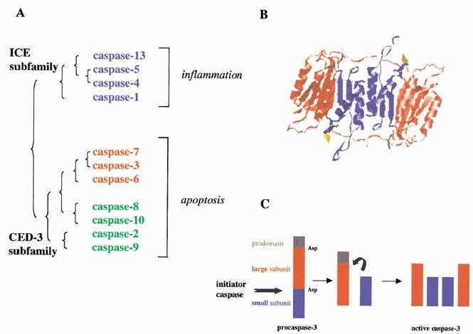
			- 凋亡起始者：对执行者的前体进行切割，从而产生有活性的执行者(为什么那么中二...)
			- 凋亡执行者：负责切割细胞核内和细胞质中的调节蛋白/结构蛋白
				- 切割底物产生凋亡效应，分为活化、失活两大类
					- 被活化的代表分子是caspase激活的核酸酶CAD(Caspase activated DNase)一般与其抑制因子ICAD（inhibitor of CAD）结合而处于失活状态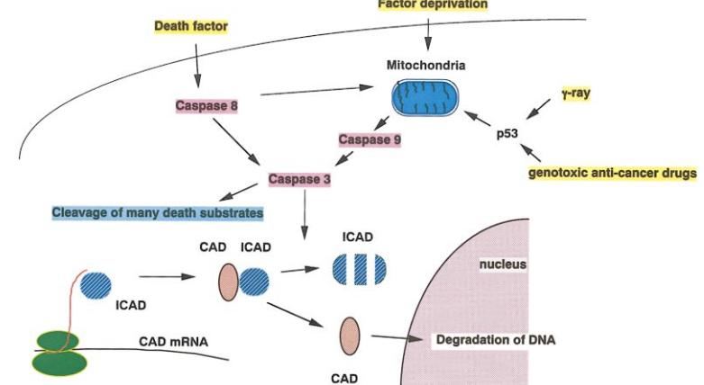
						1. 活化了的执行Caspase（Caspase-3） ==降解ICAD而释放CAD== 
						2. CAD活化后在核小体间切割DNA，产生DNA片段
						3. DNA片段在琼脂糖凝胶电泳时产生标志凋亡的DNA ladder(联系上文的电泳图谱) 
				- 被失活的分子在维护细胞的正常状态中发生关键作用e.g.PARP这类DNA修复酶，即失活了一些修复用的蛋白，不让他们再修复啦
				- 凋亡途径在不同的物种中较为保守
		- 活化：通常以无活性的酶原形式存在于细胞质中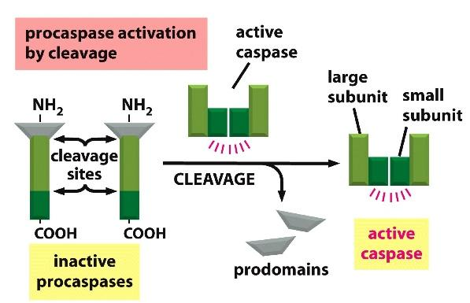
			1. 起始caspase：接受凋亡信号刺激后，酶原分子在特异的天冬氨酸位点被切割，产生的两段多肽形成大小两个亚基，再聚合成异源二聚体(同源活化)
			2. 执行caspase：已活化的起始caspase招募执行caspase酶原分子后，对其进行切割，产生活性的执行caspase(异源活化)
			3. 级联分子网络
		- 与疾病治疗：Caspase抑制剂可以减弱由于细胞凋亡过度产生的疾病
			- 参与神经退行性疾病的调控
	2. Apaf-1👉凋亡酶激活因子-1（apoptotic protease activating factor-1）
		- 在线虫中的同源物为ced-4，在线粒体参与的凋亡途径中具有重要作用，该基因敲除后，小鼠神经细胞过多，脑畸形发育
		- Apaf-1含有3个不同的结构域：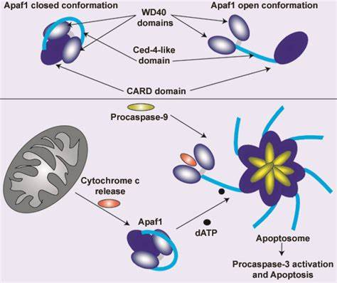
			- CARD（caspase recruitment domain）结构域，能召集caspase-9；
			- ced-4 同源结构域，能结合ATP/dATP；
			- C端结构域，含有色氨酸/天冬氨酸重复序列，当细胞色素c结合到这一区域后，能引起Apaf-1多聚化而激活
		- Apaf-1具有 ==激活Caspase-3== 的作用，而这一过程又需要细胞色素c和caspase-9(Apaf-3)参与。Apaf-1/细胞色素c复合体与ATP/dATP结合后，Apaf-1就可以通过其CARD结构域召集caspase-9，形成凋亡体（apoptosome），激活caspase-3，启动caspase级联反应
	3. Bcl-2家族
		- *Bcl-2*为**凋亡抑制基因**，是膜的整合蛋白，其功能相当于线虫中的ced-9，能 ==控制线粒体中细胞色素c等凋亡因子的释放== 👉是多细胞动物中普遍存在的 ==“长寿基因”== 
		- Bcl-2家族成员都含有1-4个Bcl-2同源结构域BH1-4，并且通常有一个羧端跨膜结构域(transmembrane region ,TM)
			- 其中BH4是抗凋亡蛋白所特有的结构域，BH3是与促进凋亡有关的结构域
			- 根据功能和结构可将Bcl-2基因家族分为两类（图15-7），一类是抗凋亡的（anti-apoptotic），如：Bcl-2、Bcl-xl、Bcl-w、Mcl-1；一类是促进凋亡的（pro-apoptotic），如：Bax、Bak、Bad、Bid、Bim，在促凋亡蛋白中还有一类仅含BH3结构，如Bid、Bad。
		- Bcl-2蛋白存在于线粒体膜、内质网膜以及外核膜上，主要定位于线粒体外膜
		- 它拮抗促凋亡蛋白的功能。而大多数促凋亡蛋白则主要定位于细胞质，一旦细胞受到凋亡因子的诱导，它们可以向线粒体转位，通过寡聚化在线粒体外膜形成跨膜通道 ，或者开启线粒体的PT孔，从而导致线粒体中的凋亡因子释放，激活caspase，导致细胞凋亡
		- 胞质中的促凋亡蛋白可通过不同的方式被激活，包括去磷酸化，如Bad；被caspase加工为活性分子，如Bid；从结合蛋白上释放出来，如Bim是与微管蛋白结合在一起的。
- 诱导因子
	- 物理性因子
	- 化学因子
	- 生物因子
		- 线虫*C.elegans*:是理想的模式生物
			- 成虫体长1-2mm，身体半透明，靠捕食微生物为生
			- 有雌雄同体(可以自体受精繁育)/雄虫(占0.05%)两种性别→可用热休克的办法提高雄虫的比例
			- 世代周期为3-4天
			- 生命力强劲，可以像细菌一样在-80℃条件下长期冻存
		- 共有14 个基因在*C. elegans*细胞凋亡中起作用，其中在细胞凋亡的实施阶段起作用的主要有3个：
			- Ced-3、Ced-4和Ced-9，其中 ==Ced-3和 Ced-4的作用是诱发凋亡== ，在缺乏Ced-3、Ced-4的突变体中不发生凋亡，有多余细胞存在→联系Caspase家族、Bcl-2家族
			- 凋亡通路关键因子结构解析：施一公/颜宁
#### 4. 细胞凋亡的途径
- 途径
	- 依赖Caspase的通路：[[#^aaf74d]]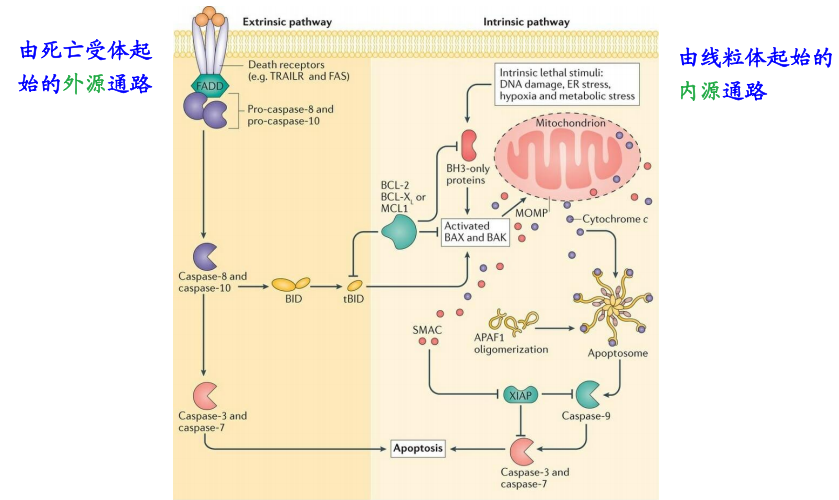
		1. 由死亡受体起始的依赖Caspase的外源凋亡通路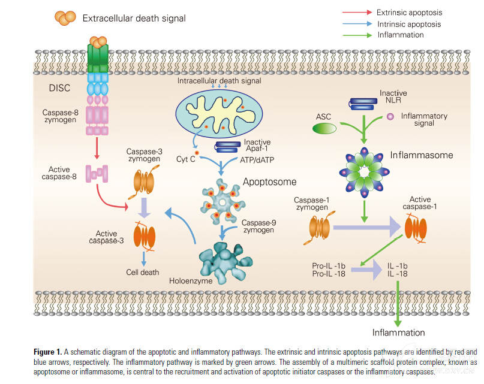
			- 死亡受体→含有死亡结构域DD，可以招募凋亡通路中的信号分子/死亡配体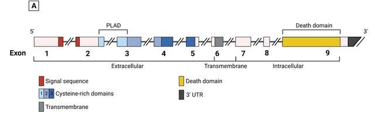
				1. 活化的Caspase-8还能切割Bcl-2家族成员Bid，将凋亡信号传递到线粒体，从而激活线粒体起始的内源凋亡通路，使凋亡信号进一步扩大👇
		2. 线粒体介导的**内源性凋亡通路**:收到凋亡信号后，外膜通透性改变后，向细胞质中释放细胞色素c， ==活化Caspase== →主要受到Bid的调控
			- 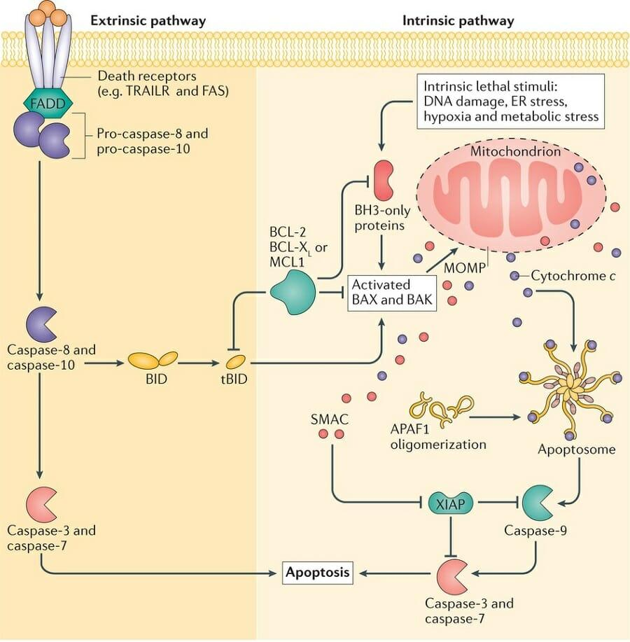
		3. 内质网介导的凋亡通路
	- 不依赖Caspase的途径：主要与线粒体有关，可以向细胞质内释放其它凋亡相关因子
		- 凋亡诱导因子AIF(apoptosis inducing factor)
			- 位置：位于线粒体膜间隙
			- 功能：在凋亡过程中，AIF从线粒体转移到细胞质内，然后进入细胞核 ==引起核内DNA凝集并断裂形成50kb的DNA片段== 
		- 限制性内切核酸酶G(endonucleaseG，Endo)
			- 位于线粒体中
			- 主要功能是负责线粒体DNA的修复和复制受到凋亡信号刺激后，Endo G从线粒体中释放出来进入细胞核对核DNA进行切割， ==产生典型的以核小体为单位间隔的DNA片段== [[#^83e551]]👆区别AIF
- 调控
	- 存活信号
		- Caspase抑制因子：
			- 线虫中的Ced9与哺乳动物中的Bcl-2，可以直接结合活化的Caspase，阻止其对底物的切割。凋亡程序启动后，其抗凋亡作用能被特异的促凋亡因子解除Smac
		- **转录因子NF-kB**：通常以非活性形式在细胞质中与抑制因子IκB(inhibitor κB)结合，起始凋亡抑制因子的转录→在肿瘤细胞中始终处于激活状态
			- 敲除该转录因子后小鼠胚胎迅速死亡，原因是干细胞大量死亡
			- 当细胞接受胞外存活因子刺激后， IκB被IKK（ IκB kinase）磷酸化而和NF-κB解离；解离活化后的NF-κB进入细胞核内，再 ==和靶DNA序列结合起始凋亡抑制因子(包括c-IAP和Bcl-2家族成员)的转录== ，进而抑制细胞凋亡。
	- 死亡信号
		- **转录因子p53**：*p53*是一种抑癌基因，其生物学功能是 ==在G期监视DNA的完整性== 
			- 如有损伤，则 ==抑制细胞增殖== ，直到DNA修复完成
			- 如果DNA不能被修复，则 ==诱导其调亡== 
				- 研究发现丧失p53功能的小鼠胸腺细胞对糖皮质激素诱导的调亡反应和正常细胞相同，而对辐射诱导的调亡不敏感
			- 所以p53突变后很容易得癌症:Q!
---
- References：
	- [国自然热点洞察：细胞衰老 - 知乎](https://zhuanlan.zhihu.com/p/468011810)
	- [细胞衰老和老化概述 | Cell Signaling Technology](https://www.cellsignal.cn/science-resources/overview-of-cellular-senescence)
	- [深度探究细胞衰老 | 分类、信号通路、干预、检测方法、文献解析 - 知乎](https://zhuanlan.zhihu.com/p/692157537)
	- [【细胞凋亡原创系列一】细胞凋亡概述 - 知乎](https://zhuanlan.zhihu.com/p/51449753)
	- [细胞凋亡通路系列之二：Caspase级联反应](https://www.dxy.cn/bbs/newweb/pc/post/43089058)
	- https://www.bilibili.com/video/BV1XR4y1Z7nU/
	- [细胞凋亡：从程序性死亡机制到疾病治疗的关键 - 知乎](https://zhuanlan.zhihu.com/p/12960399648)