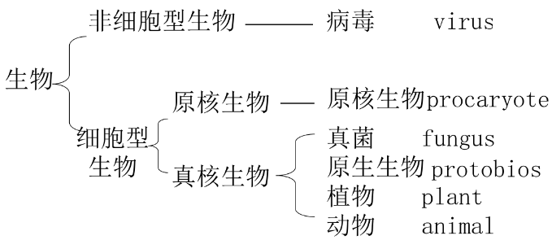
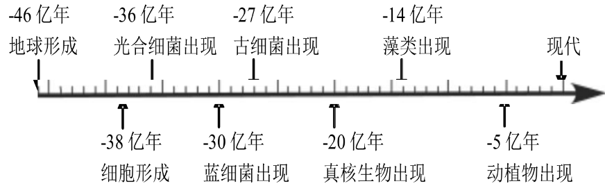
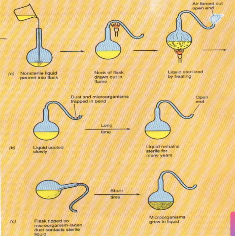

## 一、微生物及微生物学
#### 1. 微生物
- 概念：自然界中所有形体微小、结构简单的低等生物统称微生物
	- 不是分类学上的概念，而是低等生物的总称
	- 在分类系统中占了六界
- 特点：
	- 形体微小，比表面积大：难以被肉眼看到
	- 结构简单：单细胞/简单的多细胞/无细胞结构
	- 低等、进化地位低：许多是原核生物
	- 吸收多，转化快
	- 生长旺盛，繁殖快速
	- 适应性强，容易变异
	- 分布广，种群多
#### 2. 微生物学
- Concepts:微生物学就是研究微生物的基本特征及其应用规律的学科
- 发展简史
	1. 我国古代对微生物的利用
		- 工业上制备曲酿酒，医学上用人痘来预防天花
		- 只知其然而不知其所以然
	2. 微生物的发现期（1676~1861）
		- 1676年Leeuwenhock研制了能放大200倍的显微镜，第一次看到了细菌
		- 列文虎克：利用单式显微镜观察了许多微小物体和生物
	3. 微生物学的创立期（1861~1897）
		- 巴斯德的主要贡献： #重点 
			1. 1861年用鹅颈瓶实验否定了“**自然发生学说**” #考过 
			2. 建立了**胚种说**，创立了消毒灭菌方法；
			3. 微生物学研究从形态 — 生理转变
			4. 奠定了传染病微生物病原说的基础(1865,蚕微粒子病；1879,鸡霍乱；1881,牛羊炭疽病；1885,狂犬病)
			5. 同时发明了制造疫苗和预防接种的方法（用减毒菌苗预防鸡霍乱和牛羊炭疽病，用狂犬兔化疫苗防治人类狂犬病），使 ==免疫学== 发展成一门独立的学科
		- **科赫的主要贡献**： #考过  #重点 
			1. 创建了许多研究微生物的方法——纯种分离，固体平板，鞭毛染色，悬滴培养，显微摄影
			2. 发明了 ==染色观察== 微生物的方法
			3. 分离和纯化了许多传染病病原菌，提出了**科赫法则**，为疾病的病原说奠定了牢固的基础。
		- 创立期的特点:建立了一系列研究微生物的方法；从形态描述向生理学研究过渡；各应用性的分支学科开始形成。
	4. 微生物学的发展期（1897~）
		1. 生化水平：1897年Buchner发现酒化酶
		2. 亚细胞水平：1930年代电子显微镜诞生
		3. 遗传水平：遗传物质基础的证明1944，DNA双螺旋结构1953，遗传密码子1961，操纵子学说1961
		4. 分子水平：1980年以后，PCR建立，基因组，后基因组时代 —— 分子水平
		- 特点：进入了微生物生化水平的研究、遗传水平的研究，向分子水平发展。
	5. 微生物学的发展方向
#### 3. 学习微生物学的意义：
- 我们与微生物的关系最密切
- 微生物学与人类的医疗保健息息相关
- 微生物工业产品提高了人类生活水平
- 微生物学的发展促进了农业的进步
- 微生物学的发展促进了生态与环境的保护
- 微生物学的发展促进了生物学基础理论研究的深入
### 生物研究历程
- Mendel
- Thomas Hunt Morgan:基因、染色体、连锁遗传
- Barbara McClintock芭芭拉发现玉米转座子
- Frederick Griffith肺炎双球菌转化实验
- 21Hershey and Chase：DNA是遗传物质

### 微生物学
----
- https://www.icourse163.org/learn/ZJU-1206447846?tid=1472223442#/learn/testlist
- 密码：2025-sun-4
- 做慕课中第三章生命的脆弱、第五章生命的呵护之单元测验，取整数分(小数点后面舍去)
	- References：[【MOOC】生命的教育-浙江大学 中国大学慕课MOOC答案.docx - 人人文库](https://www.renrendoc.com/paper/368381473.html)