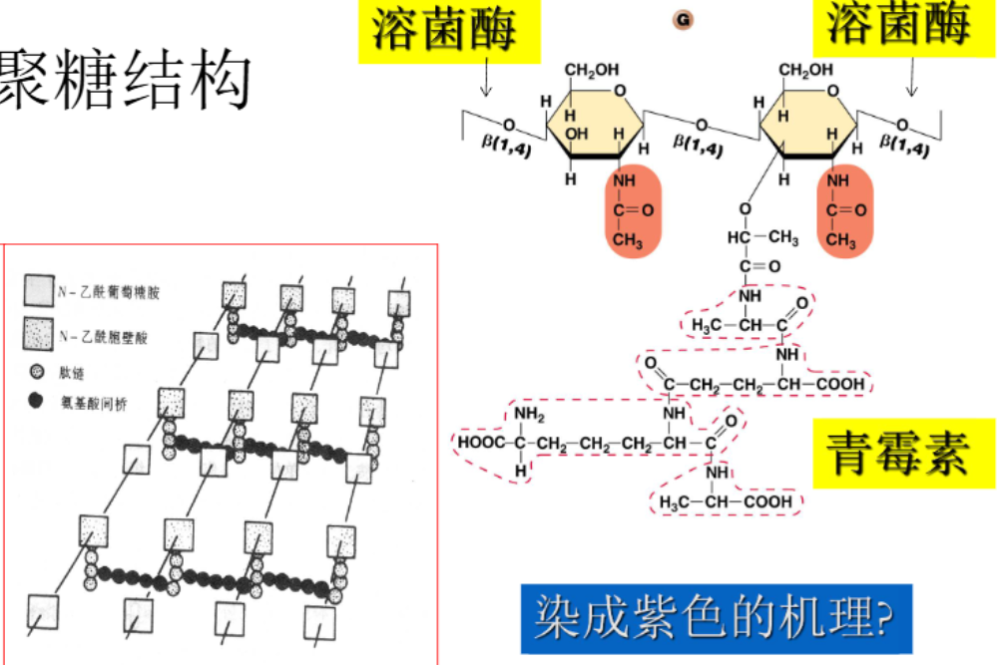
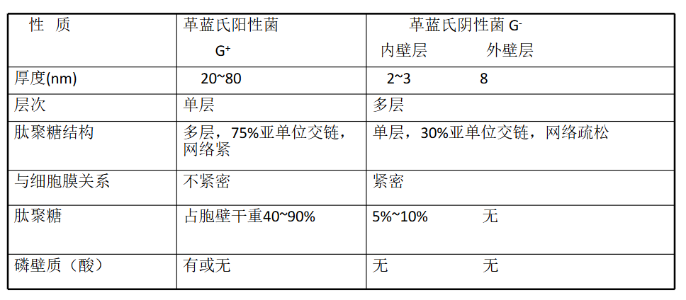
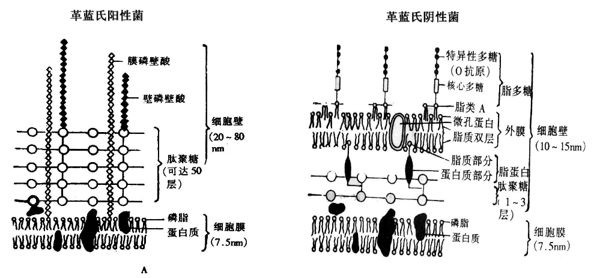
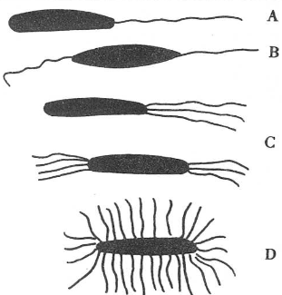
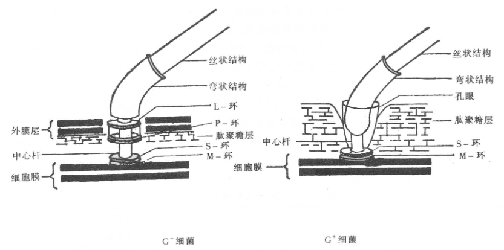
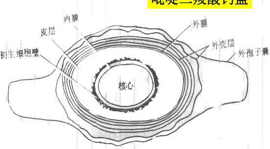
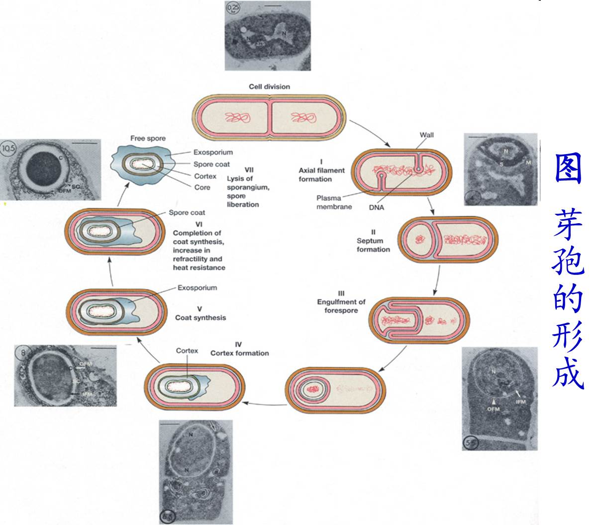
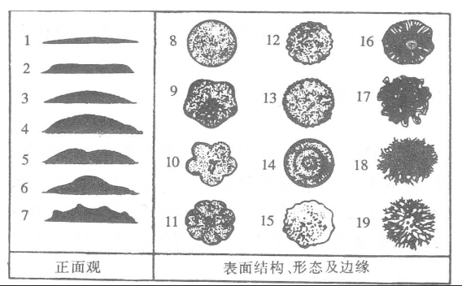
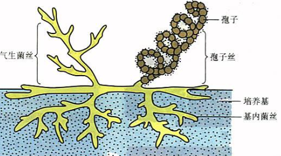
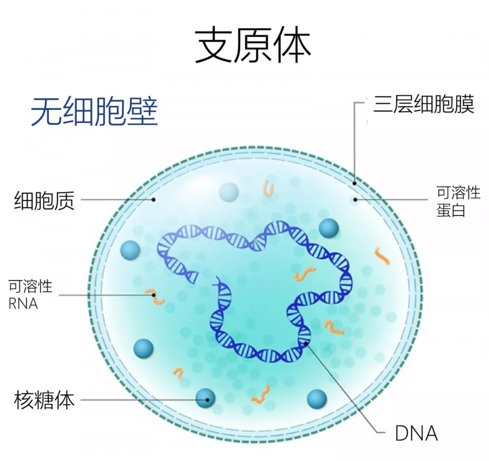

## 一、原核生物概述
#### 1. 特征
- 拟核，只有染色质体
- 没有完整的细胞器，核糖体分布于细胞质中(70S)
- 包括细菌域和古菌域Archaebacteria
	- 细菌域包括细菌、放线菌、立克次氏体、支原体、衣原体
#### 2. 作用
- 有害方面：致病(黑死病等)
- 有益方面：发酵制品；生物制品；微生态制剂；环保制品
----
## 二、 细菌Bacterium
#### 1. 概述
- 概述
	- 细胞细而短，结构简单；细胞壁坚韧并且 ==含有肽聚糖，16SrRNA基因特异== ；以二等分裂繁殖
	- 在自然界中分布最广，数量最多
- 形态
	- **球状Coccus**：单球菌、双球菌、四链球菌、八叠球菌、链球菌、葡萄球菌
	- **杆状Bacillus**：短杆菌、长杆菌
	- **螺旋状Spirillum**：
		- 弧菌：弯曲＜1周
		- 螺旋菌：弯曲1~6周
		- 螺旋体：弯曲＞6周
	- **丝状**：放线菌
- 大小
	- 菌体大小：宽×长，常用单位：μm
	- 球菌
#### 2. 细菌细胞结构 #重点 
1. **细胞壁Cell wall**：坚韧而略有弹性，可以保护细胞和维持外形
	- **革兰氏染色Gram staining**: 菌体涂片→固定→**结晶紫**初染→**碘液媒染**→乙醇脱色→**番红**复染
		- 革兰氏阳性菌：菌体呈紫色(G+)
			- 骨架：肽聚糖；基质：磷壁酸
			- 连续层，40层左右网状分子，交联度75%
				- 溶菌酶机理：切断β-1,4糖苷键
				- 青霉素机理：青霉素是一条短肽，可以取代活性中心阻止形成肽桥→杀死的是 ==正在繁殖的细菌== 
			- D-氨基酸；和二氨基庚二酸
		- 革兰氏阴性菌：菌体呈红色(G-)
			- 内层为**肽聚糖**，交联度30%，只有1-2层
			- 外层为**脂蛋白、磷脂、脂多糖**
	- 染色原理：首先两者都会形成结晶紫-碘复合物，但乙醇脱色时，由于 ==G+细胞壁失水导致肽聚网网孔缩小，且不含多脂而不会被溶解== ，可以使复合物留在细胞壁内；而G-反之
	- 细胞壁缺陷型细菌
		- **原生质体Protoplast**：在 ==革兰氏阳性菌== 培养物中加入**溶菌酶/青霉素**阻止其细胞壁的正常合成
			- 呈球形，对环境敏感，需要高渗
			- 保留鞭毛但不能运动
			- 适合条件下细胞壁可以再生
		- **原生质球/球形体Spheroplast**：在 ==革兰氏阴性菌== 培养物中加入溶菌酶/青霉素，细胞壁 ==没有全部去除== 
			- 肽聚糖已被除去，但外壁层的脂多糖等依旧保留，对外界环境有一定的抗性，能够在普通培养基中缓慢生长
		- **L型细菌Bacterial L-form**
			-  ==变异== 而得到的无完整而坚韧的细胞壁
			- 低渗下生长缓慢，形成油煎蛋状小菌落
				- 古菌类为疵壁菌：细胞壁由蛋白质或糖蛋白构成
				- 支原体无细胞壁
	- 功能
		- 维持细胞外形
		- 协助鞭毛运动
		- 保护细胞免受外力损伤，阻拦有害物质进入
		- 与细胞分裂有关
2. **细胞膜Membrane**：紧贴细胞壁，内侧包围原生质的一层柔软而富有弹性的半透性薄膜
	- 组成
	- 结构
	- 功能(比真核多一些)：
	- 内膜系统
		- **间体Mesosome**：细胞膜内褶形成的一种管状、层状或囊状结构 #考过 
			- 一般G+较发达，G-菌中很不明显
			- 
		- 载色体
		- 羧酶体
3. **拟核**：无核膜、无核仁，无固定形态，由 ==单条环状双链DNA高度折叠== 而成
	- 染色质体Chromatinic body：没有组蛋白。每一个细菌只有一个染色质体，为环形结构
	- 质粒Plasimid：存在于细菌染色体外或附加于染色体上的一种能自我复制的遗传物质(cccDNA)
		- 存在于染色体外，体积较小
		- 每一个细菌可以含有1到多个质粒
		- 不同质粒之间可以重组，质粒与染色体也可以重组
		- 对于菌体生存不是必需的
4. **核糖体Ribosome**：
	- 蛋白质合成的场所
	- 游离在细胞质中，是某些抗生素的作用部位e.g. ==链霉素== →但是也有可能对人体线粒体造成影响(核糖体为70S)
	- 组成70S：30S(16SrRNA and 21proteins)+50S(23SrRNA and 35 proteins)
	- 多聚核糖体
5. **细胞质及内含物**
	 - 内含物
6. **荚膜和黏液层Capsule**
	- 是**某些细菌**在一定营养条件下向细胞表面分泌的一层松散透明的 ==粘液性物质== ，如果没有明显边缘则称为黏液层
		- 营养条件：需要不同的碳源物质才能形成荚膜
		- 成分：主要是**多糖**，也有多肽、蛋白质、脂及复合物
		- 荚膜(>200nm,结合松);微荚膜(<200nm,结合紧)
	- 作用：
		- 防止细菌变干；
		- 作为细胞外的碳源和 ==能源贮藏物== ；
		- 防止真核细胞的吞噬消化和噬菌体的侵袭，防止原生动物吞噬；
		- 特异性吸附
	- 危害：污染食品产生粘液状物质；引起龋齿
7. **鞭毛Flagella与伞毛**：运动性细菌从细胞表面长出的细长弯曲的丝状物，是细菌的“运动器官”；主要功能是 ==运动== ，运动的能量一般来自于细胞膜(一般球状细菌没有鞭毛，弧菌具有)
	- 着生方式：端生/侧生/周生→必须用电镜/特殊染色后用光镜观察
	- 生长方式：
		- 
	- 主要成分： ==蛋白质== ，含有少量的多糖或者脂类。鞭毛蛋白是一种抗原(H抗原)→侵入人体会产生抗体，能够通过血清学反应进行分类鉴定
	- 伞毛、菌毛fimbrium：细胞表面比鞭毛更细更短的丝状体，由**菌毛蛋白pillin**组成，源于细胞膜内侧基粒上，没有运动性，主要起**吸附粘连作用**
	- 性纤毛(Sex pili)：细菌传递遗传物质的通道(性导？)
8. **芽孢和伴胞晶体**
	- **芽孢Spore**：某些细菌在生长发育的一定时期在**细胞内特定部位**形成的一个圆形/椭圆形的 ==抗逆性休眠体== ，也称内生孢子
		- 含有芽孢的细菌称为孢子囊Sporangium
		- 细菌：主要是芽孢杆菌属、梭状芽孢杆菌属
		- 形成时期：一般是后期形成(营养物质比较匮乏)，用来抵抗不良环境
		- 部位：中间生/端生，有的膨大。核心部分是**吡啶二羧酸钙盐**→渗透压高→皮层会膨胀导致核心失水，具有**束缚水**→化学物质无法进入。一般只形成一个→是 ==繁殖器官== 
		- 形成过程：
	- 伴胞晶体Parasporal crystal：
		- 芽孢杆菌的某些种**在形成芽孢的同时**在细胞内产生一种 ==晶体状多肽类化合物== ，一个细菌一般只产生一个伴胞晶体。
			- e.g.苏云金芽孢杆菌*B.thuringiensis(B.T)* →可以抗虫，当它进入鳞翅目昆虫消化道后可以引起肠穿孔，可以作为微生物杀虫剂
	- 孢囊Cyst：
		- 固氮菌的某些种在营养缺乏时 ==由营养细胞特化而成的休眠体== 
		- 一个细胞产生一个孢囊，一个孢囊产生许多幼年细胞
----
## 三、 细菌的繁殖
#### 1. 繁殖方式
- 裂殖
- 有性接合
- 出芽生殖
#### 2. 菌落形态
- 菌落Colony：将单个微生物细胞或一小队同种细胞接种在**固体培养基表面**，在适合条件下迅速繁殖成一对以母细胞为中心的，有一定形态构造的子细胞集团
	- 细菌：小而凸起或大而平整，湿润，光滑，透明，易挑起，菌落正反颜色相同，通常有臭味
	- 鞭毛菌：像18、19那种(有鞭毛的原因)，大而扁平，形状不规则
	- 荚膜菌：像8那种，较大光滑 ==透明== 
	- 芽孢菌：12、13、15等，看起来很粗糙(水分少)

---
## 四、 细菌域的分类(系统发育分类法)
#### 1. 放线菌门Actinomycetes
- ** ==丝状的== 革兰氏阳性细菌**，可以通过 ==无性孢子== 繁殖，菌落呈放射状
	- 菌丝直径与细菌相似
		- 基内菌丝(营养菌丝)：无隔膜，多核，长度很长，不产/产色素
		- 气生菌丝：直径大于营养菌丝，有的会产生色素
		- 孢子丝(繁殖菌丝)：气生菌丝分化而成，可产生孢子
	- 对溶菌酶及抗细菌剂敏感
-  ==中性偏碱== 、有机质丰富的泥土中最多(泥土的清香o((>ω< ))o)[[Chapter9 微生物的生态]]，可以把土壤中的有机质分解，变成植物可以吸收的物质
- 繁殖：
	- 菌体断片
	- 无性繁殖产生分生孢子：凝聚/横隔
	- 少部分产生孢囊孢子(内生孢子)
- 菌落特征：介于细菌和霉菌之间→小，圆形，不易被挑起，biomedical常呈绒状，干燥多皱
- 代表属
	- **链霉菌属Streptomyces**
		- 大多数 ==抗生素== 的来源(可以抵抗自身产生的抗菌素)e.g.抗肿瘤、卡那霉素、制霉菌素
	- **小单胞菌属Micromonospora**
		- **不产生气生菌丝**，顶端着生一个分生孢子，菌落较小，也可以产生抗生素
#### 2. 其它
1. **变形菌门Proteobacteria**
	- **立克次氏体Richettsia**
		- 许多是致病菌，如斑疹伤寒立克次氏体
		- 比细菌小，二分裂繁殖
		-  ==专性寄生== ：能量代谢独特→只能氧化谷氨酸；不能合成NAD、CoA等分子，必须从宿主获得→细胞膜疏松，胞内物质易流出
		- 寄生于植物的称为类立克次氏体
2. **柔壁菌门**
	- **支原体Mycoplasma**/类菌质体
		-  ==是已知的能独立生长和生活的最简单的生命形式== 
		- **没有细胞壁**的革兰氏阴性菌→在医院鉴定时无法染色，是鉴别支原体最常见的方法，可以在低渗环境中缓慢生活
		- 膜中具有甾醇，细胞柔软可以变形， ==可以通过细菌过滤器== 
	- 繁殖方式多样：裂殖/芽殖
	- 大多数腐生无害，少部分可以致病→能导致胸膜炎/肺炎等
	- 
3. 拟杆菌门Bacteroidetes
4. **衣原体门Chlamydia**→革兰氏阴性菌
	- 有细胞结构，可以通过细菌滤器， ==专性活细胞内寄生== 的一类原核微生物→沙眼
	- 生物合成能力差，蛋白质中缺少精氨酸和组氨酸；缺乏产能系统，必须从寄主细胞中获得ATP，是 ==能量寄生物== 
	- 存在原体/始体两种形态，可以形成包涵体
---

## 五、 古菌域
- 特点：在结构和代谢上接近细菌，属于原核生物；在基因转录和翻译方面接近真核生物

| 与细菌相同                                         | 与真核生物相同                                                          | 古菌独有                                                             |
| --------------------------------------------- | ---------------------------------------------------------------- | ---------------------------------------------------------------- |
| 拟核，没有细胞器；环状基因组；基因组成操纵子；没有转录后修饰；多顺反子mRNA；细胞较小。 | 没有肽聚糖；翻译从甲硫氨酸起始；相似的RNA聚合酶、启动子以及其它转录机制；相似的DNA复制与修复；相似的ATP酶；80S核糖体 | 独特的细胞壁结构；细胞膜由醚键构成；鞭毛蛋白结构特别；核糖体16S rDNA序列独特；tRNA的序列和代谢特别；没有脂肪酸合酶。 |

----
- 革兰氏染色及其原理原生质体、球形体与L-型细菌鞭毛及结构
- 荚膜与粘液层
- 芽孢与伴胞晶体
- 放线菌形态
- 比较细菌和放线菌的异同；比较细菌和古菌的异同