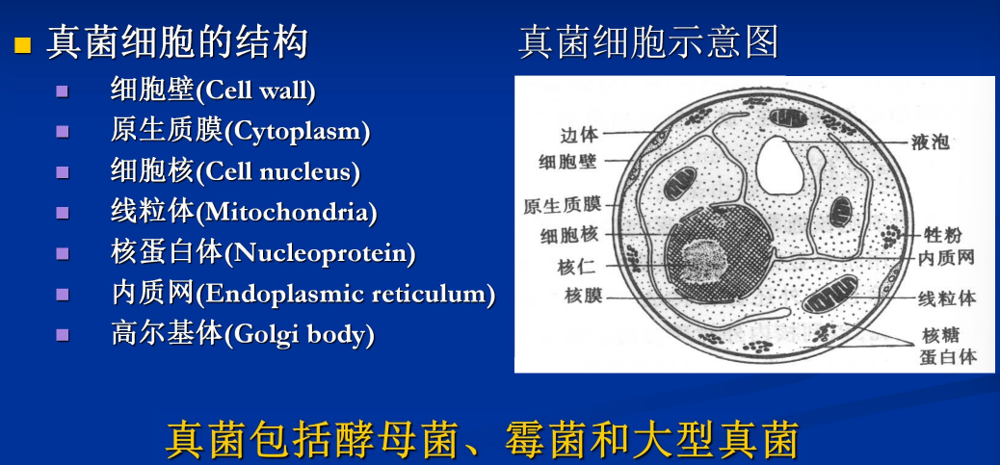
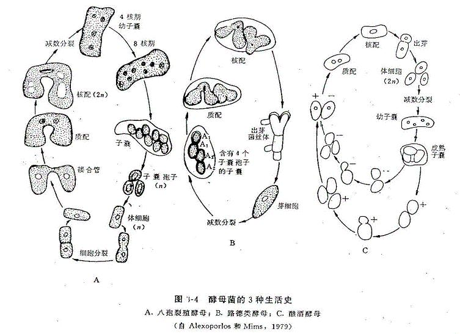
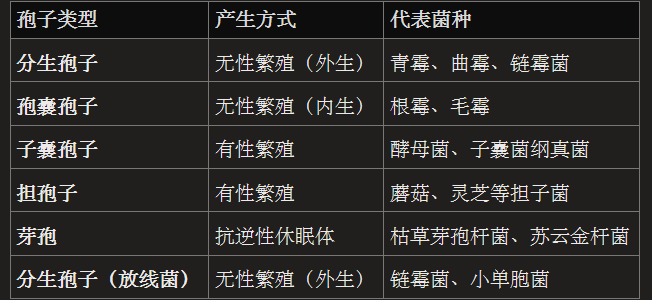
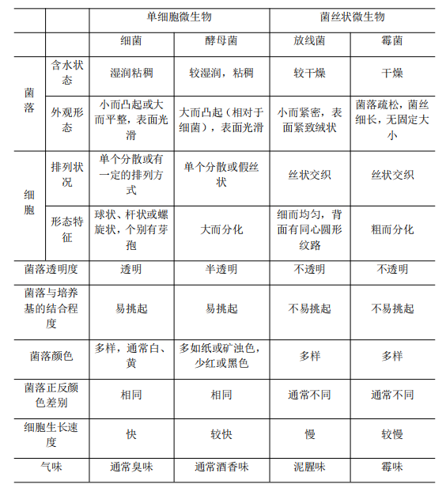

## 一、真核微生物
#### 1. 特点
- 真核：具有核膜、核仁，染色体与组蛋白结合；有丝分裂
- 具有细胞器：线粒体、高尔基体、内质网，核糖体80S
#### 2. 分类
- 包括：真菌、显微藻类(有叶绿素)、原生动物
	- 真菌：具有细胞壁，无根茎叶分化，不含有叶绿素； ==寄生或腐生生活== 的一类真核微生物。包括酵母菌、霉菌和大型真菌
		- 结构：
- 分类系统
	1. 壶菌纲
	2. 结合菌纲
	3. 球囊菌纲
		1. 专性内共生菌根菌、无性繁殖产生分生孢子
	4. 子囊菌纲
	5. 担子菌纲
#### 3. 真核生物的由来
- 内共生假说：真核生物吞噬营呼吸和营光合的细菌
- 次生内共生假说：红藻和绿藻内共生，其余植物和藻类均为吞噬绿藻和红藻而获得叶绿体和线粒体
----
## 二、 酵母菌Yeast
#### 1. 基本概念
- 概念：一类单细胞的真菌
- 利害性：
	- 有利方面
		- 菌体应用广泛，可以水解后提取核苷酸、做食品添加剂、 ==细胞膜上含有麦角甾醇== →UV照射后生成VD2
		- 获取代谢产物→酒类、面包、甘油
		- 遗传工程中作为受体菌→干扰素(一种糖蛋白)
	- 害：引起疾病如白色念珠菌(白假丝酵母)，发酵污染
- 分布：分布在含糖量丰富、 ==偏酸性== 的环境中→生化实验中从酵母里面提取蔗糖酶
	- 大多为腐生型，少数为寄生型
#### 2. 形态结构
- 形状与大小：形状因种而异，球形、圆柱形和卵圆形；有时候出芽繁殖太快了会形成**假菌丝**→假丝酵母
- 细胞结构：
	1. 细胞壁：   ==甘露聚糖+葡聚糖== +蛋白质+类脂质+几丁质→用 ==蜗牛酶== 处理后成为原生质体
	2. 细胞膜：含有**甾醇**，增强膜的强度
	3. 细胞核：真核，具有 ==多条染色体== ，数目因种而异
	4. 细胞器：
		1. 线粒体：1-20个，只有需氧代谢才要线粒体
		2. 内质网：
		3. 微体：含有**过氧化物酶**，参与甲醇和烷烃的氧化
		4. 液泡
	5. 细胞质：含有质粒
#### 3. 繁殖方式
- 无性繁殖：
	- 芽殖→**啤酒酵母**
	- 裂殖→八孢裂殖酵母(n;2n不能独立生活)
	- 节孢
- 有性繁殖：形成**子囊孢子**→路德类酵母(只能以2n形式存在)
- 菌落特征：类似于细菌，表面湿润粘稠，容易挑起，大多是乳白色，少部分是红色(玫瑰酵母)
-----
## 三、 霉菌Mold
#### 1. 基本概念
- 概念：丝状真菌的统称，绒毛状、棉絮状或蛛网状而不产生大型子实体的真菌。
- 利害性：
	- 用途
		- 生产发酵食品及其它工业制品
		- 自然界物质循环，如分解纤维素、木质素
		- 红色面包霉建立生化遗传学说
	- 不利方面：物品霉变、动植物疾病→小麦黑穗病、黄曲霉毒素
- 分布：主要分布在中性偏酸的环境中，多数为腐生型
#### 2. 形态结构
- 菌体由**菌丝hypha**构成：营养菌丝+气生菌丝+孢子丝→菌丝体👉联系[[Chapter1 细菌Bacterium|放线菌]]
	-  ==多核单细胞== 
	- 多细胞：有隔膜，每个细胞内含有一个/多个细胞核，隔中央有小孔
- 细胞壁：主要由 ==几丁质== 组成，经蜗牛酶处理得到原生质体→可以 ==用含有几丁质酶的微生物作农药== 
	- 水中的霉菌可能是由纤维素构成
#### 3. 繁殖方式
- 无性繁殖
	- 菌丝断片
	- **分生孢子Conidium**:是一种外生孢子→青霉的像扫把，曲霉像糖葫芦架哈哈哈哈
	- **孢囊孢子Sporangiospore**：内生孢子， 形成于一个特殊的囊状结构
- 有性繁殖( ==仅发生于特定条件下== )：由两性细胞结合而成，经过质配→核配→有丝分裂三个阶段
	- 卵孢子2n:一般是水生
	- 接合孢子2n：
	- 子囊孢子n
	- 担孢子n
- 菌落特征：菌落疏松、绒毛状owo，菌落较大，可能呈一定颜色。中间的菌丝较老
- 代表种属：

| 种属  | 特征        | 繁殖方式                       |
| --- | --------- | -------------------------- |
| 毛霉  | 菌丝无隔      | 有性繁殖形成接合孢子                 |
| 根霉  | 菌丝无隔，具有假根 | 无性繁殖形成孢囊孢子；有性繁殖形成接合孢子      |
| 曲霉  | 菌丝有隔      | 无性繁殖形成分生孢子，没有有性生殖而有准性生殖(?) |
| 青霉  | 菌丝有隔      | 无性繁殖形成分生孢子，没有有性生殖而有准性生殖(?) |
## 四、担子菌(大型真菌)
#### 1. 基本概念
- 菌丝体发达，菌丝分枝有隔，无性孢子少见，有性产担孢子。
#### 2. 生活史中三种菌丝
- 初生菌丝：由担孢子萌发，初无隔多核，后产生横隔而成单核菌丝。
- 次生菌丝：由 2 个性别不同的初生菌丝质配形成双核菌丝，锁状联合以增加细胞个体。
- 三生菌丝：次生菌丝特化而成，特化后形成子实体。
	- 担孢子形成：双核菌丝顶端细胞膨大，两核融合形成一个二倍体核，该核减数分裂成 4 个单倍体子核，顶端膨大成担子，担子上生出 4 个小梗，小梗顶端稍微膨大，4 个核分别进入 4 个小梗，每个核发育成一个担孢子
#### 3. 孢子类型判断

-------------------------------------
- Reference:
- 
