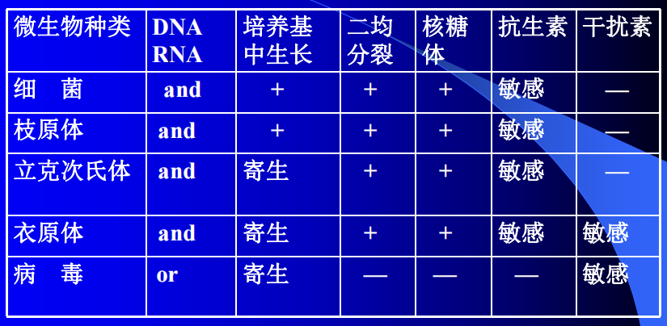
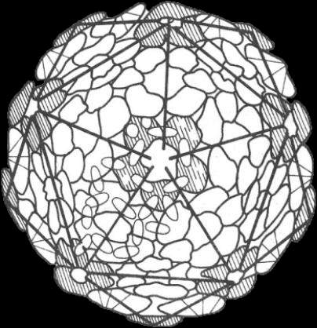
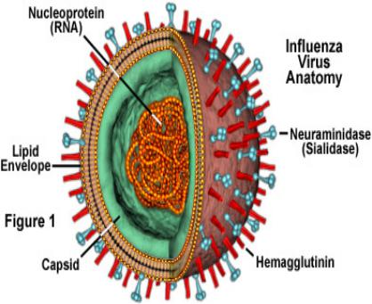
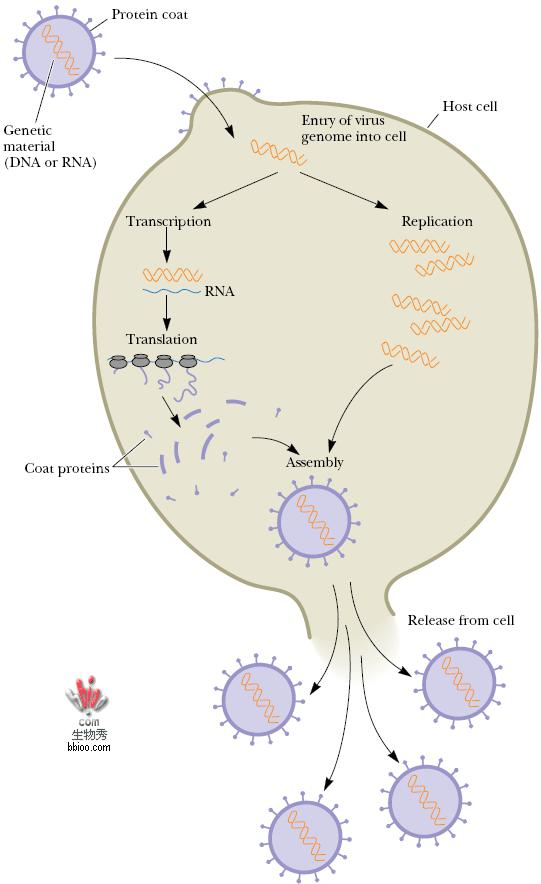
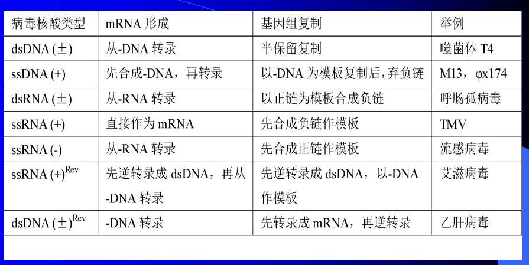
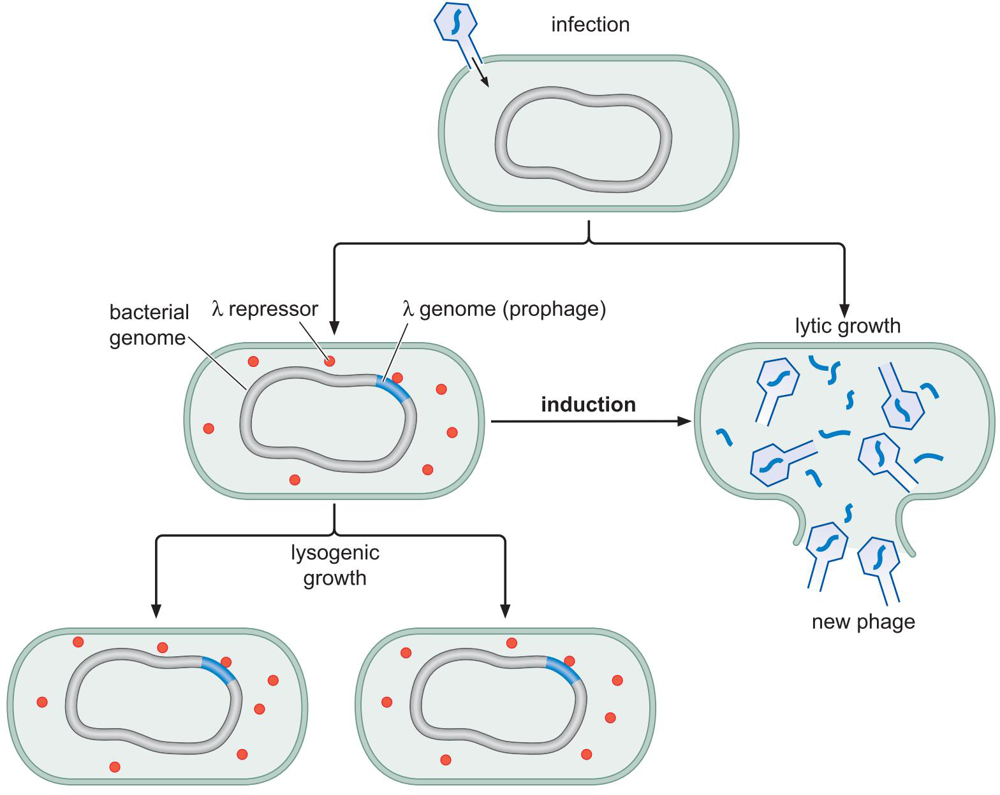
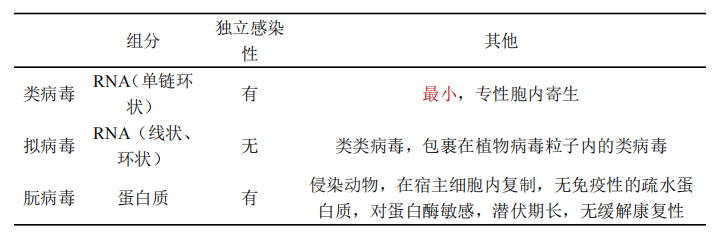

## 一、Discovery
#### 1. 病毒的发现
- 1892 伊凡诺夫斯基： TMV能通过细菌滤器；
- 1898 贝哲林克：TMV是一种传染性的活性流质，命名为病毒。
- 1935 Stanley结晶了TMV，Bawden揭示TMV的化学本质是核蛋白
- 1940：德国Kausche用电镜观察到TMV具杆状外形
- 1952 : Hershey、Chase证实病毒的遗传物质是RNA
#### 2. 非细胞型生物
- 病毒
- 亚病毒[[#^43d29c]]
	- 类病毒
	- 朊病毒
	- 拟病毒

## 二、病毒
#### 1. 特点
- 极其 ==微小== ，电镜，可通过细菌滤器（由于电荷和吸附作用，某些病毒不能通过）
-  ==没有细胞构造== （分子生物）
- 主要成分是核酸和蛋白质（某些有脂类，多糖）
- 一种病毒只含一种核酸，或DNA或RNA
-  ==专性寄生== ：既无产能系统，也无蛋白质合成系统
- 通过复制的方式进行增殖
- 离体条件下以化学大分子状态存在并可形成结晶
- 对抗生素不敏感，对**干扰素**敏感
	- 
- 概念：病毒是超显微的，没有细胞结构的，专性活细胞内寄生的分子生物，它们在活细胞外具有一般化学大分子的特性，一旦进入宿主细胞，又具有生命特征。
- **分布**：
	- 寄生生物，分布在 ==活细胞内== 
	- 漂浮在空气中e.g.COVID-19通过气溶胶传播
	- 一般都致病，但某一些病毒对宿主无害e.g.呼肠孤病毒 杂色郁金香病毒
#### 2. 病毒的形态结构
- 大小
	- 微小，大多在100nm左右
	- 大病毒
- 形态
	- 棒状：螺旋对称，如TMV（烟草花叶病毒）→植物病毒
	- 球状：多为二十面体，由二十个等边三角形构成，立方体对称→动物病毒
	- 蝌蚪状：多数的噬菌体
	- **包涵体（Inclusionbody）**：某些细胞被感染后，常在细胞内形成一种在光学显微镜下可见的小体，称为包涵体（Inclusionbody）
		- 有的在核内，有的在细胞质内，有的兼有
		- 由完整的病毒颗粒/未装配的病毒亚基/宿主细胞感染后的反应产物聚集/化学因子或某些细菌（支原体/衣原体）感染
		- 根据包涵体的形状、大小、组成和在宿主细胞中的部位不同，可以用于疾病的快速检测
			- 天花病毒：顾氏小体
			- 狂犬病毒：内基式小题
- **病毒粒子**（Virion）的结构：指一个结构和功能完整的病毒颗粒
	- **核酸核心**
		- 位于病毒粒子中心，构成了其基因组（Genome）。
		- 一种病毒只有一种类型的核酸，或RNA或DNA。可能单股，也可能双股。
		- 有些RNA病毒自带逆转录酶，以进入真核生物细胞。
		- 核酸储存着遗传信息，控制着病毒的遗传变异和对宿主的感染性。
		- 无壳体的核酸仍具有感染性，且感染范围更广，但感染力较弱
	- **蛋白质壳体（衣壳capsid）**
		- 是指围绕病毒核酸并与之紧密相连的 ==蛋白质外壳== ，由许多壳粒（Capsomere）组成
		- 壳粒是指**在电子显微镜下可以辩认的壳体亚单位**，由一个或多个多肽分子组成；功能是 ==保护病毒核酸，决定病毒感染的特异性，并刺激机体产生相应抗体== 
		- 壳粒的两种对称排列方式：
			- 二十面体
			- 螺旋状体
	- **囊膜/薄膜Envelope**
		- 包在核壳体外，为 ==双层脂膜，含病毒特异蛋白== 和少量糖类
		- 表面具有刺突（Spike），或包膜子粒（Peplomer）
			- Hemagglutinin血凝素，N号码（类型的[神经氨酸酶](https://baike.baidu.com/item/%E7%A5%9E%E7%BB%8F%E6%B0%A8%E9%85%B8%E9%85%B6/2399579?fromModule=lemma_inlink)）如H7N9病毒
		- 吸附于寄主细胞表面，侵入细胞
- 化学组成
	- 大多数由核酸和蛋白质合成，有的还有脂类、多糖
		- 核酸
			- 分布：植物大多RNA，噬菌体多为DNA，动物病毒均有
			- 存在形式：
				- DNA病毒大多双链且线状，有一些闭环
				- RNA病毒大多线状单链
				- 病毒粒子越复杂，核酸含量越多
		- 蛋白质：简单的病毒只含一种蛋白质，较复杂的有几种结构蛋白，高级的有酶（如溶菌酶、RNA聚合酶、逆转录酶→HIV）
			- 功能:→联系壳体
				- 构成病毒粒子的外壳，保护病毒核酸免受破坏
				- 决定病毒感染的特异性
				- 决定病毒的抗原，刺激机体产生相应的抗体
				- 某些酶与病毒的侵染与复制有关
		- 其它
			- 被膜的主要成分与细胞膜同，脂类丰富
#### 3. 病毒的繁殖——复制
- 概念：病毒利用 ==宿主细胞提供== 的原料、酶系统和能量，在 ==自身核酸的控制== 下**复制核酸并合成蛋白质**，然后**装配**成成熟的病毒颗粒，再以各种方式 ==释放至细胞外== ，**感染**其他细胞。这种增殖方式称为复制。
	- 复制核酸→装配→释放→感染
- ”一步生长曲线“
1. 吸附：具特异性，吸附于宿主细胞受体
2. 侵入：方式取决于宿主细胞性质，尤其是它的表面结构。
- 
	- 动物病毒：一般通过**胞饮**（如痘病毒）或**膜融合**（如流感病毒）的方式侵入←动物细胞膜 ==双层磷脂分子== 
	- 植物病毒：通过**伤口或昆虫口器注入**←有坚韧的细胞壁
	- 噬菌体：通过**注射**将核酸注入，外壳留于胞外
3. 脱壳：病毒粒子 ==脱去衣壳和囊膜== 
	- 动物病毒：胞饮→有两层膜包裹→溶酶体溶解掉细胞膜→核酸融合→脱壳酶→核酸
	- 植物病毒：在吸附和侵入时，衣壳开始破损
4. 生物合成：包括核酸的复制和蛋白质的合成
	1.  病毒核酸进入细胞后，接管或部分接管了宿主细胞的合成系统，开始其生物合成。
	2.  合成病毒的mRNA，合成病毒蛋白质
	3.  复制病毒的核酸
5. 装配：由分别合成好的核酸与蛋白质组装成完整新病毒粒子。
	- DNA病毒：大多核内复制（含有DNA polymarse），胞质中合成蛋白质→ ==核内装配== 
	- RNA 病毒：大多胞质中复制，胞质中合成蛋白质→胞质中装配
6. 释放：成熟的病毒粒子从被感染细胞转移到外界的过程。
	- 细胞破裂→释放（溶菌酶/压力作用）
	- 细胞出芽/外排→变成有囊膜的病毒
	- 通过胞间连丝、细胞融合等扩散
	- **隐蔽期**：从病毒核酸进入细胞到子代病毒装配完成这一时期，病毒不显示其原有的形态
#### 4. 分类
- 实用性/寄主型分类
- 理化特征分类：以病毒核酸分类→DNA or RNA|ss or ds|open or closed | + or -
	- 7大类, 62科
		- **正 DNA**：是指 ==碱基序列与 mRNA 一致== （只是 T 和 U 的区别）的核酸单链，也称为有义链、编码链。在基因表达过程中，正链 DNA 不直接作为转录的模板，但它所携带的遗传信息与最终合成的 mRNA 相对应，从而决定了蛋白质的氨基酸序列。
		- **负 DNA**：是指碱基序列与 mRNA 互补的核酸单链，也称为反义链、模板链。在转录过程中，RNA 聚合酶以负链 DNA 为模板，按照碱基互补配对原则合成 mRNA。
## 三、病毒代表
#### 1. 噬菌体Bacteriophage
- 分类
	- 烈性噬菌体Virulent phage：侵入寄主细胞后进行复制繁殖并导致细胞裂解的噬菌体
	- 温和性噬菌体Temperate phage：侵入宿主细胞后，宿主细胞不裂解，随其生长繁殖传代
		- 特性：基因整合到宿主染色体中，能编码合成一种阻遏蛋白，阻止噬菌体所有增殖相关基因的表达
		- 溶源细胞的自发裂解
		- 诱发裂解
		- 免疫性
		- 复愈
		- 转变
		- **细菌的溶源性**：温和性噬菌体侵入宿主细胞后，其 DNA 整合到宿主 DNA上，与宿主 DNA 同步复制，但不合成自己的衣壳，宿主不裂解而能继续生长。
			- 整合在宿主细胞上的温和性噬菌体的基因为原噬菌体
			- 含原噬菌体的宿主细胞为溶源性细胞。
- 一步生长曲线
#### 2. 植物/动物病毒

## 四、亚病毒Subviruses
^43d29c
- 概念：不同时含有核酸和蛋白质，可以同时侵染动植物

- 朊病毒的基因是宿主细胞的DNA(在变成病毒前owo)