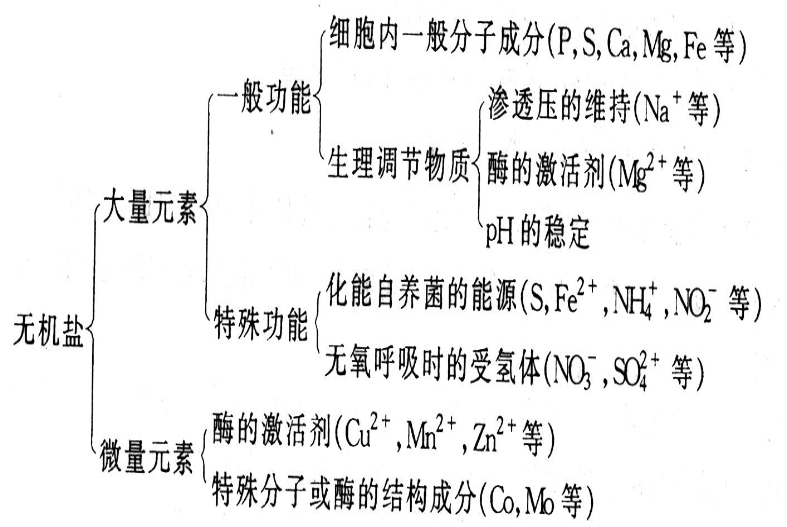
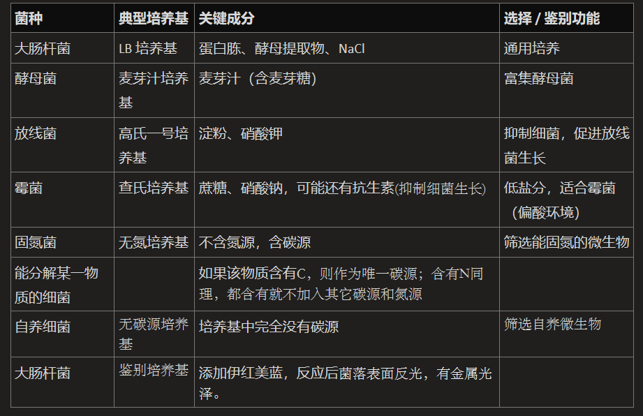
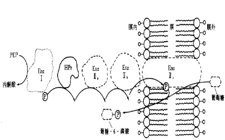

- 营养物质：能够满足机体生长、繁殖和完成各种生理活动所需的物质
	- 参与组分组成
	- 提供能量
	- 构成酶活性成分
- 营养：微生物获得与利用营养物质的过程

## Section1 微生物细胞的化学组成
![[Pasted image 20250402102058.png#pic_center|400]]
## Section2 微生物的营养物质
#### 2.1 碳源物质Carbon source
- 概念：可用来 ==构成细胞组分或代谢产物中== 碳素来源的营养物质→但是要能够被氧化
- 作用
	- 构成细胞组分或代谢产物的框架→碳骨架
	- 提供能量→类比人的碳水化合物
		- 不同的微生物对碳源需求不同
- 类型：糖类(葡萄糖/纤维素/甘露醇...)、有机酸(乳酸、柠檬酸等)、脂类、醇类、烃类(天然气、石油等)
	- 甲壳素→最大的没有被利用的营养物质之一，来自甲壳动物
	- 最能利用纤维素的：牛羊、香菇等:O!
#### 2.2 氮源物质
- 概念：可用来 ==构成细胞组分或代谢产物中== 氮素来源的营养物质
- 作用：合成细胞中含氮物质，一般不能做能源→少数自养细菌除外
- 分类
	- 无机：铵盐、硝酸盐等
	- 有机：蛋白胨、酵母膏、鱼粉😋
	- 气态：大气中的氮气
- 需求不同
	- 固氮微生物需要  ==N2== →根瘤菌
	- 化能自养菌需要铵盐、硝酸盐
	- 异养菌：需要无机氮和有机氮；
- 无机氮利用速度较快→速效氮，利于生长；一些有机氮利用速度较慢→迟效氮， ==利于代谢产物形成== 
#### 2.3 生长因子
- 概念：微生物在生命活动过程中必须从外界环境中摄取的，对其正常代谢必不可少的某些微量有机化合物
	- 狭义：仅指**维生素**→作物酶的组成成分
	- 可分为生长因子自养型微生物、生长因子异养型微生物、生长因子过量合成微生物和营养缺陷型微生物
#### 2.4 矿质元素
- 作用：
	- 构成细胞的结构成分
	- 构成活性物质(酶)的组成成分
	- 参与细胞渗透压、氢离子浓度、氧化还原电位的调节
	- 作为某些微生物的能源
#### 2.5 水
- 作用：
	- 细胞组分，使原生质保持溶胶状态；
	- 协助生理生化反应；
	- 协助营养物质吸收和代谢产物的分泌；
	- 控制胞内温度变化；
	- 物质代谢原料。
## 三、微生物的营养类型

- 按碳源分：
	- 自养：能以简单的无机物生长
	- 异养：需复杂的有机物；
- 按能源分：
	- 光能营养：将光能转化为化学能
	- 化能营养：利用有机物或无机物氧化放能
- 按供氢体分：
	- 无机营养：供氢体为无机物
	- 有机营养：供氢体为有机物👉人类!

| 类别      | 碳源  | 能源    | 供氢体   | 举例      | 其它           |
| ------- | --- | ----- | ----- | ------- | ------------ |
| 化能异养微生物 | 有机物 | 无机物氧化 | 有机物   | 大多数微生物  | 分寄生性和腐生型(蘑菇) |
| 化能自养微生物 | CO2 | 无机物氧化 | 水、硫化氢 | 硫杆菌、轻细菌 |              |
| 光能异养微生物 | 有机物 | 光能    | 有机物   | 红螺菌属    |              |
| 光能自养微生物 | CO2 | 光能    | 水、硫化氢 | 蓝细菌，藻类  | 可以类比植物       |
 
## Section4 培养基
#### 4.1 配置原则
- 根据微生物营养需求配制
	1. 注重各种营养物质的浓度和配比：**C/N**碳原子的 mol 数/氮原子的 mol 数）
		- 谷氨酸发酵生产时碳氮比为4则菌体大量繁殖，谷氨酸积累少
		- 为3则菌体繁殖受抑，谷氨酸大量积累。
	2. 调节合适的理化条件：pH
		- 细菌偏碱，霉菌偏酸
		- 使用磷酸缓冲剂，备用碱 CaCO3等，弱酸盐、
		- 控制氧化还原电位：好氧>+0.1V/ 厌氧 or 兼性厌氧:  ==+0.1V以上好氧呼吸，+0.1V以下进行发酵== 
- 根据培养目的配制
	- e.g.分离土壤中的纤维素分解菌→则碳源应该是纤维素粉
- 设计培养基的四种方法：
	- 生态模拟、查阅文献、精心设计、试验比较
#### 4.2 类型(考试会问) #重点 
- 含量较多的为碳源，酵母提取物为未知成分
1. 根据组成成分划分：
	1) 天然培养基（有未知成分e.g. ==牛肉膏、蛋白胨== 、酵母浸膏、麦芽汁、玉米浆
	2) 合成培养基
	3) 半合成培养基
2. 根据物理状态：
	1) 固体培养基（琼脂 1.5~2%）
	2) 半固体培养基（琼脂 、0.2~0.7%）
	3) 液体培养基。
3. 根据使用用途
	1) 基本培养基
	2) 加富培养基：加入有利于某种微生物生长繁殖所需的营养物质，使这类微生物的 ==增殖速度比其他微生物快== ，从而使这类微生物能够在混有多种微生物的情况下占优势地位。
	3) 鉴别培养基
	4) 选择培养基
- e.g.NaAc 0.5%；硫酸铵 0.5%；磷酸二氢钾 0.2%；氯化钠 0.1%；硫酸镁 0.2%；乙醇 2%；酵母提取物 0.05%；碳酸钙 1%；pH 7.2 #重点 
	- 其中碳酸钙作为缓冲剂使用
	- Tips:常见的无机盐磷酸二氢钾、硫酸镁、氯化钠等
	- 硫酸铵作为氮源；NaAc和乙醇作为碳源
	- 酵母提取物用于提供生长因子
- 若培养基中含有钼，可以说明是固氮细菌

## Section5 微生物的营养运输
- 参考：[[Chapter3 物质的跨膜运输与信号传递]]
1. 简单扩散：依靠浓度差，不耗能，非特异性，不发生化学变化。
2. 促进扩散：特异载体蛋白，顺浓度，不耗能。
3. 主动运输：特异 ==载体蛋白== ，可逆浓度，耗能，是物质运输的主要方式
4. 基团转位：一种主动运输类型，依赖复杂的运输酶系
	- 底物在运输过程中 ==发生化学变化== ，主要存在于厌氧和兼性厌氧细菌中👉区别于主动运输
	- 用于糖、脂肪酸等的运输，如葡萄糖（转变为 6-磷酸葡萄糖