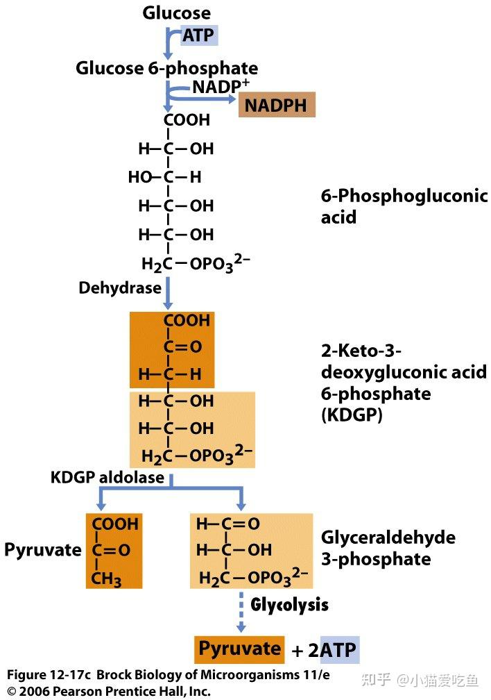
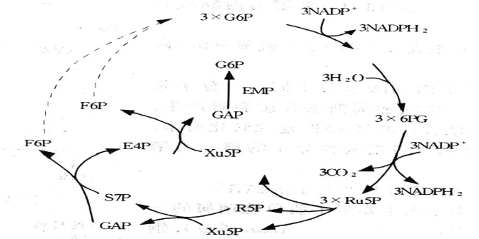
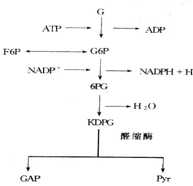
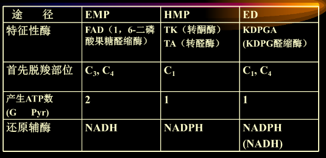
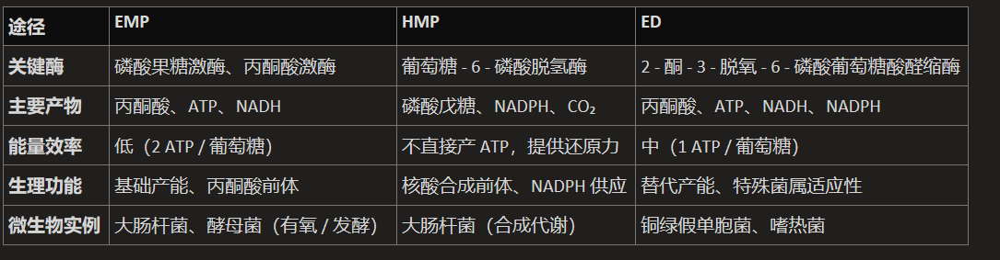
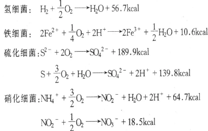
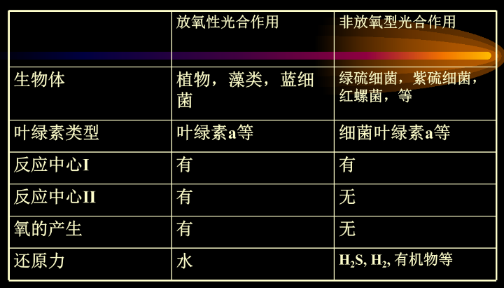
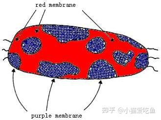
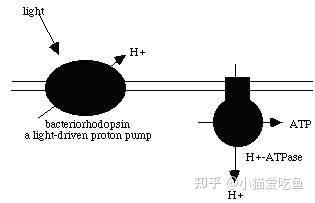

## 一、产能代谢
#### 1. 有氧呼吸Aerobic respiration
- 可以参考[[Chapter4 Respiration]]
- 特点：
	- 好氧微生物和兼性厌氧微生物在有 O2情况下的产能方式；
	- 电子通过呼吸链传递给O2， ==产能多== 
	- 有机物底物 ==氧化彻底== 
- 还原力的产生： 
	1. EMP途径（Embden-meyerhof-parnas pathway)即糖酵解途径
		- 
	2. HMP途径（Hexose monophospate pathway)
		- 
	3. ED途径(Enter-doudoroff pathway
		- 
		- 1mol葡萄糖经途径只产生1molATP
		- 
	4. WD途径 (Warburg-Dickens pathway)/磷酸解酮酶途径
		1. PK途径：具磷酸戊糖解酮酶e.g.肠膜状明串珠菌
			- 1 mol 葡萄糖经PK 途径生成 1mol ATP、1 mol NADH
		2. HK途径：具磷酸己糖解酮酶 e.g.两歧双歧杆菌
			- 每mol葡萄糖经HK途径产生1mol乳酸、1.5mol乙酸,并产生2.5mol ATP
	5. 葡萄糖直接氧化途径：假单胞杆菌属(Pseudomonas)、气杆菌属(Aerobacter)、醋杆菌属(Acetobacter)的某些种不具备己糖激酶，但**具有葡萄糖氧化酶**，能把葡萄糖 ==直接氧化成葡萄糖酸== 再经磷酸化而降解
	6. 三羧酸循环过程中产生

#### 2. 无氧呼吸
- 概念：电子通过呼吸链传递给O2以外的物质。最终 ==受体一般为无机物== ，如NO3-、SO42-或CO2等; 有时可为有机物，如延胡索酸
- **硝酸盐呼吸 (nitrate respiration)** —— 反硝化作用👉可以理解为电子一直传递，从硝酸根变成了氨气，是一个不断还原的过程
- **延胡索酸呼吸(fumarate respiration)**：延胡索酸 + 2H++ 2e——琥珀酸
#### 3. 发酵Fermentation
- 概念：厌氧微生物或兼性厌氧微生物在无氧条件下，底物脱氢后所产生的还原力`[H]` ==不经过呼吸链传递== 而直接交给某一内源氧化性中间代谢产物的一类低效产能反应
	- NHDH+中间代谢物——中间代谢物-H+NAD+
- 种类
	- 乳酸发酵： #易混淆 
		- **异型乳酸发酵**：产物有乳酸和乙醇等
			- e.g.肠膜名串珠菌*Leuconostoc mesenteroides*体内缺乏EMP所需要的醛缩酶和异构酶, 糖的降解依靠HMP,进行异型乳酸发酵
		- **同型乳酸发酵**：产物只有乳酸
	- 酒精发酵→底物都是葡萄糖
		1. 酵母同型酒精发酵：EMP，葡萄糖氧化生成2个乙醇+2CO2+2ATP
			- 酵母在夏天的发酵效果不好→此时适宜细菌生长→工厂使用冷却水
		2. 细菌同型酒精发酵：ED，葡萄糖氧化生成 2 个乙醇+2CO2+ATP；
		3. 细菌异型酒精发酵：HMP，葡萄糖氧化生成乳酸+酒精+CO2+ATP。
	- 氨基酸发酵产能：**Stickland反应**
		- 丙氨酸+2甘氨酸+3ADP+3Pi—3CH3COOH+3NH3+CO2+3ATP
		- e.g.少数的厌氧梭菌，如生孢梭菌能利用氨基酸同时做碳源、氮源和能源。
- 特点
	- 没有外界电子受体→有氧呼吸的受体是O2
	- 产能较少，通过底物水平的磷酸化产生
	- 发酵产物氧化不彻底
#### 4. 无机物氧化
- 以无机物作为氧化基质，并利用氧化过程中释放的能量进行生长
- 这类微生物主要是化能自养型微生物[[Chapter4 微生物营养]]
#### 5. 光能转换
- 光合作用类型：
	- 放氧型（蓝细菌）→氢供体为水 
	- 非放氧型：供氢体不为水，而是硫化氢、氢气或有机物，没有反应中心Ⅱ→ ==没有氧气产生== 
- 光合作用产 ATP（电子传递）的方式：[[Chapter3 Photosynthesis]]
	- 环式光合磷酸化（厌氧光合细菌）
	- 非环式光合磷酸化
- 类型
	- **嗜盐菌**紫膜的光合作用
	- 
		- 红色部分：含细胞色素和黄素蛋白等， ==有氧下进行氧化磷酸化== 
		- 紫色部分：里面的蛋白质在光照下（550-600nm最好）具有质子泵的作用，将H+排出细胞外，从而造成紫膜内外的质子梯度差。这种质子梯度差可 ==转化成ATP== 
	- **紫硫细菌**→地球上最早产生的细菌，位于海洋中层
		- 吸收光的峰值在870nm
		- 以环式电子传递的方式进行 
	- **绿硫细菌**：把H2S中的H变成NADPH，以环式电子传递方式进行
	- **蓝细菌**：感觉与植物很像🤔
		- 电子转移非环式，由外源电子提供
		- PSII具有光水解 ==放氧作用== ，并经电子传递偶联 ==产生ATP== ，PSI把电子还原，Fe-S经Fd和FP使NADP+还原为NADPH
## 二、分解代谢

1. 淀粉的分解
	- 淀粉酶 #学科链接 生物化学
	- 液化型/α-淀粉酶从淀粉内部分解
	- 糖化型/β-淀粉酶从非还原端分解
2. 纤维素的分解
	- 纤维素酶（包括 C1 酶、Cx 酶和纤维二糖酶
	- 短链纤维素→纤维二糖+葡萄糖→葡萄糖
3. 脂类的分解——脂肪酸β氧化，生成乙酰辅酶 A，进入 TCA；
4. 蛋白质的分解——生成氨基酸。
## 三、合成代谢
#### 1. 生物合成的三要素
- 能量：由代谢产生
- 还原力
- 小分子前体物质：糖代谢过程中产生的中间体碳架物质
	- 磷酸己糖→多糖；磷酸戊糖→核苷酸
	- 乙酰CoA→脂肪酸、α酮酸
	- 氨基酸→蛋白质
#### 2. 多糖的生物合成
- 以*Staphylococcus aureus*的肽聚糖合成为例
	1. UDP-N-乙酰葡萄糖胺和UDP-N-乙酰胞壁酸的合成
	2. 由UDP-N-乙酰胞壁酸合成胞壁酸肽
	3. 肽聚糖亚单位——二糖肽的合成→靠着类脂载体转到细胞外面
	4. 肽聚糖亚单位转接到细胞壁的生长点上
	5. 通过转肽反应形成完整的肽聚糖分子
- 生物固氮
	- 固氮微生物：能使氮分子 ==还原成氨== 的生物→都是原核生物(去年发现了第一个真核固氮微生物:O!)
		- **自生固氮菌**：可单独在人工培养下固氮 e.g. 园褐固氮菌
		- **共生固氮菌**：必须和其他生物 ==共生== 才能固氮
			- e.g.大豆根瘤菌→可以产生血红蛋白→活性中心能够与氮气结合并将其还原
		- **联合固氮菌**：必须生活在植物根际、叶面等地方才能固氮
	- 生化机制：N2+6e+6H+12ATP——2NH3+12ADP+12Pi
		- 必要条件：
			- ATP、还原力
			- 底物（N2，氨抑制固氮）
			- **固氮酶**→两种成分:铁钼蛋白 MF(若培养基中含有钼，可以说明是固氮细菌)和铁蛋白 F [[Chapter9  真核生物基因表达调控]]
			- Mg2+ →能够增强固氮酶中蛋白质亚基之间的相互作用/激活酶 
			- 严格厌氧→防止NADPH被氧化
		- 氨的固定
## 四、初级代谢与次级代谢
#### 1. 初级代谢
- 概念：初级代谢普遍存在，与生物生存有关
#### 2. 次级代谢
- 概念：为避免初级代谢中间产物积累或有利于生存的代谢类型 
	- 次级代谢产物常在 ==对数生长末期或稳定期出现== 👈微生物经过对数生长期快速增殖，到末期其生长速度开始减缓
	- 对环境敏感， ==产物易变化==   
	- 有关酶的专一性较差
- 产物：抗生素、生长刺激剂、维生素、色素、毒素
## 五、代谢与实践
#### 1. 应用营养缺陷型菌株以解除正常的反馈调节
- 如赖氨酸发酵，选育 ==高丝氨酸缺陷型菌株== （谷氨酸棒杆菌），补给适量高丝氨酸，在含有较多高糖分的铵盐的培养基上能产生大量的赖氨酸）；
#### 2. 应用抗反馈调节的突变菌株解除反馈调节
- 抗反馈调节突变菌株：对反馈抑制不敏感或对阻遏有抗性的菌株或两者兼而有之的菌株
#### 3. 控制细胞膜的渗透性
- 细胞内产物浓度过高，易产生反馈抑制
- 通过生理学手段控制细胞膜的透性：
	- 谷氨酸发酵中，控制**生物素**浓度(因为生物素是乙酰CoA羧化酶的辅酶)
- 通过细胞膜缺损突变而控制其渗透性（遗传学手段）e.g.用谷氨酸产生菌的油酸缺陷型菌株——不能合成油酸→细胞膜中无油酸成分而缺损

------------
1. 比较有氧呼吸、无氧呼吸、发酵的异同
2. 比较乙醇发酵与乳酸发酵的形式
3. 生物固氮与肽聚糖合成
4. 初级代谢与次级代谢
5. 学习代谢调控的意义
----
- References：
	- [66.第五章新陈代谢/第一节微生物的能量代谢/《微生物学教程》周德庆主编第四版_哔哩哔哩_bilibili](https://www.bilibili.com/video/BV1Gw411f7mb/?vd_source=cbeeb9b4a81ed17f43f1d0be32a9f270)
	- [《微生物学》主要知识点-06 第六章 微生物的代谢 - 知乎](https://zhuanlan.zhihu.com/p/616648049)