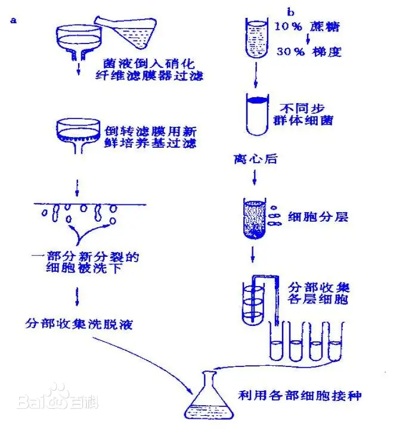
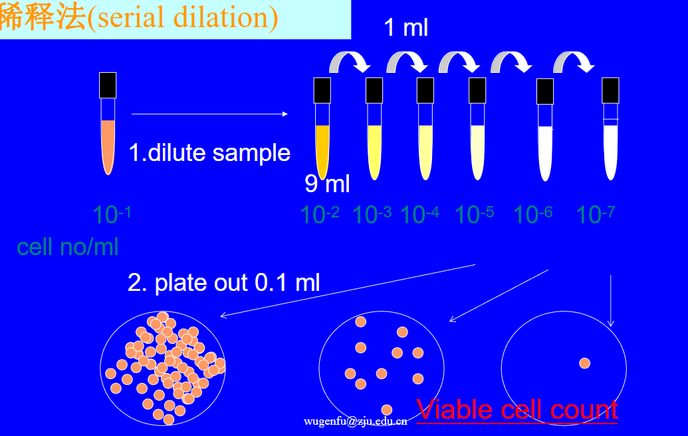
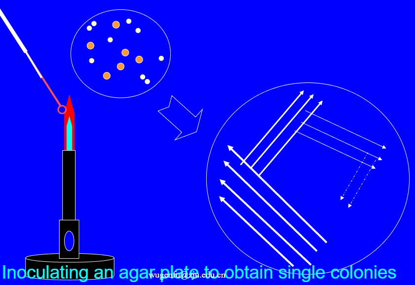
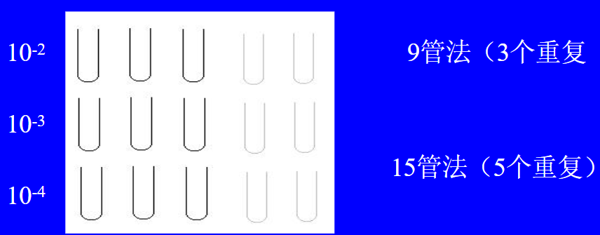
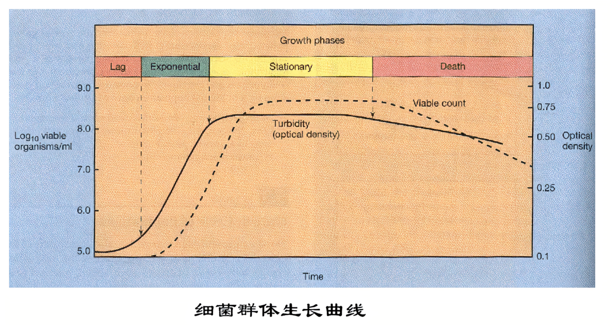
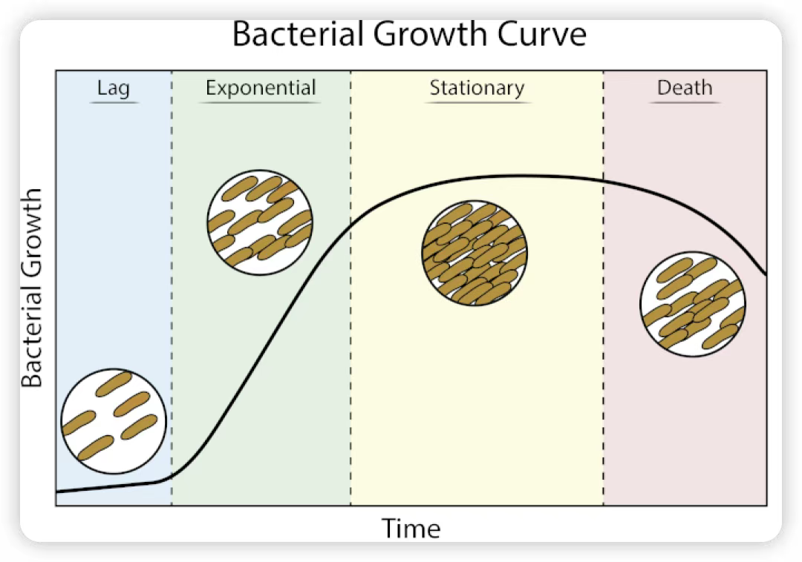
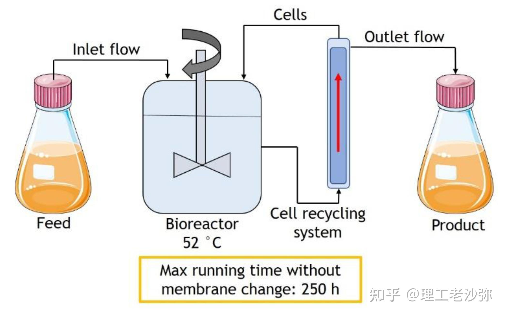
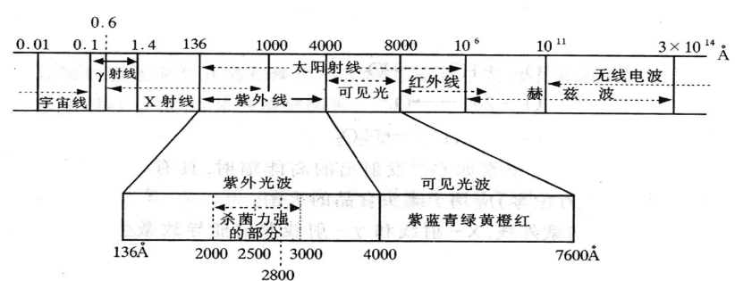
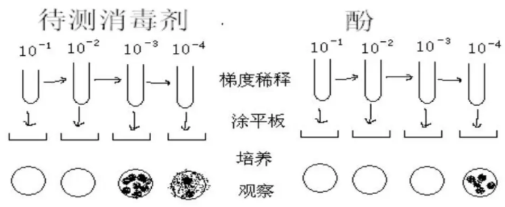

- 生长：微生物同化作用>异化作用，细胞原生质量不断增加，体积增大
- 群体增长：微生物通过分裂使（个体）数目和质量增加的过程称为群体增长 #名词解释 
- 这一章可以联系实验八(理化环境对微生物的影响)
## 一、微生物的个体生长
#### 1. 单细胞微生物个体生长→细菌
- 概念：生长、繁殖（细胞数增加）、发育（生长到繁殖的过程）。
#### 2. 多细胞微生物（霉菌）个体生长：
- 概念： ==细胞延长和细胞数目的增加== →区别于单细胞生物，不属于繁殖，繁殖通过无性孢子使个体数目增加。

#### 3. 同步化方法synchronous method[[Chapter7 细胞增殖和分化]]
- **同步细胞**： ==同步分裂或同步生长== 的细胞群体→只能维持 2-3 个世代 
- 同步培养技术：不得引起形态、结构和生理特性的改变
	- 选择法：同步细胞体积大致相等
		- 过滤法
		- 离心法：对数生长期的单层培养细胞，细胞分裂活跃，处于分裂期的细胞变圆→对培养瓶的附着力减弱→摇一摇给它掉到培养液→对培养液进行离心
		- 硝酸纤维滤膜法→测定水样中的细菌
		- DNA合成阻断法: 将细胞抑制在DNA合成期
		- DNA中期阻断法：秋水仙素等
	- 诱导法：生理学手段强制同步
		- 化学诱导：饥饿→临分裂状态→加入大量营养使其同步生长
		- 物理诱导：物理环境(低温)→临分裂→恢复
- 自然同步化natural synchronization:
	- 多核体
	- 大多数无脊椎动物和个别脊椎动物的早期胚胎
## 二、微生物的群体生长
#### 1. 纯培养的分离方法
- 概念：实验室条件下从一个细胞或一种细胞群繁殖得到后代
1. 稀释法
2. 平皿划线分离→联系实验
3. 单细胞挑取法 ^da0675
	1. 样品悬液稀释，置于湿室内→显微镜下观察到单个细胞-→用显微挑取器的毛细管吸取单细胞→培养
4. 流式细胞仪法→无法分清死活
#### 2.  群体生长的测定方法
1. **数量法**：微生物的数目代表了生长量
	- 显微镜直接计数法
		- 优点：快捷
		- 缺点：无法分清死活细胞(全菌计数法)，仅适用于单细胞、非丝状微生物的计数
	- 平板计数法
		- 可活菌
		- 烦琐，只能测定单细胞，单孢子
	- 比浊法
		- 快捷、简便
		- 误差大，要求无杂菌、浓度较高
	- 液体稀释法MPN
2. **重量法**→适用于丝状微生物
	- 称重法：培养液过滤或离心→洗涤去杂质→称干重或湿重
3. 测定总含氮量
	-  ==凯氏定氮法== ，蛋白质含量=含氮量×6.25→ #一些疑问 用什么试剂？
4. 测定 DNA含量：DNA 与某些试剂发生 ==荧光反应== 且荧光强弱与 DNA 成正比
5. 测定其他生理指标的含量:O2吸收量，CO2 释放量，发酵糖类后的产酸量。
#### 3. 分批培养时细菌纯培养的群体生长规律
- 分批培养：将微生物置于一定容积的培养基中，经过生长繁殖最后一次收获的培养方式
- 生长曲线：以培养时间为横坐标，活菌数的对数为纵坐标
	1. **延滞期Lag Phase**：
		- 出现原因：适应新环境， ==重新合成== 必需酶、辅酶或某些中间代谢产物→可以理解为种子的萌发
		-  特点：
			- 生长速率约为 0，但细胞体积增大； ^9ebe8f
			- 代谢旺盛，易产生各种诱导酶
			- 对外界环境变化敏感，抵抗力差
		- 影响：对工业生产不利，生产周期延长，设备利用率下降。
		- 工业上缩短延滞期的措施：增大接种量；用指数期菌种接种；选用繁殖快、适应性强的菌种；在种子培养基中加入发酵培养基的某些成分。
	2. **对数生长期(log phase)**
		- 出现原因：菌体已适应；培养基养料尚丰富；有害代谢产物尚未积累，培养条件较适宜。
		- 特点：
			- 繁殖最快，数量以几何级数增加；
			- 菌体健壮，代谢活跃， ==生理活性一致== ；
			- 细菌数目增加与菌液浊度成正比→若用OD600值作为纵坐标也是直线 #考过 
				- 原理：细菌细胞由于其大小和结构，会散射光线，同时某些细胞成分可能吸收光。在600 nm波长下， ==散射效应远大于吸收== ，因此OD600主要反映细菌悬浊液的浊度
					- OD600值越高，表明细菌浓度越高👉可用于检测菌落数量[[#^da0675]]
				- 选择OD600的原因 #课后拓展 
					- 光散射主导：细菌细胞的尺寸(约1-2 μm)与600 nm波长相近，符合**米氏散射(Mie scattering)** 的条件，能有效反映细胞密度
					- **培养基干扰最小**：许多培养基成分（如LB培养基中的胰蛋白胨、酵母提取物）在紫外区（200-400 nm）有强吸收，而在600 nm处吸收极弱
					- 排除了其它产物的影响
						- 500 nm：某些细菌代谢产物或培养基成分可能在该波长有吸收
						- 700 nm及以上：光散射效应减弱，OD值对细胞浓度的敏感性降低，且某些色素可能仍有吸收
						- 紫外区(200-400 nm)：核酸（260 nm）和蛋白质（280 nm）在紫外区有强吸收，导致OD值不仅反映细胞密度，还包括细胞内分子的吸收，干扰细菌浓度的准确测量。
		- **世代时间**
		- $$g = \frac{t_2 - t_1}{\log_2\left(\frac{N_2}{N_1}\right)} = \frac{(t_2 - t_1) \times \ln 2}{\ln\left(\frac{N_2}{N_1}\right)}$$
			- 理解：指数生长模型N=N0​×2n
		- **生长速率**即每小时分裂的代数=1/g。
		- 应用(良好)：发酵生产的良好种子；研究基本代谢的良好材料；微生物育种的良好材料。
	3. **稳定期Stationary Phase**
		- 出现原因：营养物质消耗，有害代谢产物积累，环境条件变化。
		- 特点：
			- 新增细胞数约等于死亡细胞数，生长速度约等于 0[[#^9ebe8f]]；
			- 活细胞总数达最高，产量达最高点；
			- 储藏物或代谢产物大量积累。
		- **生长产量常数/生长得率 Y**：最小的培养基得到最多的产量
			- $$Y_{X/C} = \frac{\Delta X}{\Delta C} = \frac{X - X_0}{C_0 - C}$$
			- X 为稳定期细胞干重，X0 为初始细胞干重；
			- C0 为限制性营养物质初浓度，C 为限制性营养物质终浓度。
		- 应用： ==收获菌体的好时机；工业上收获产物的高峰期== 。
	- **衰亡期Death Phase**
		- 出现原因：营养物质进一步消耗，有害产物进一步积累，环境更加不利→若用OD作为纵坐标，则不一定下降
		- 特点：
			- 死亡速率>生长速率，活菌数下降；
			- 细胞形态大小不一，性质可能发生改变，有时产生畸形→G+变成G-
		- 应用：芽孢和孢子在此期形成，用于 ==菌种保藏== 
#### 4. 连续培养Continuous Culture

- 概念：在培养液中 ==不断流加新鲜的== 营养物质，并及时不断地以同样的速度排出培养物，使微生物一直以对数生长速度生长的培养方法
- 培养方法：
	- **恒浊连续培养**：
		- 恒浊器→使培养液浊度保持恒定，所有 ==必需营养物过量== →可以维持最高生长速率
	- **恒化连续培养/恒组成培养**→可以联系培养基
		- 控制恒定流速，培养液中营养物质浓度基本恒定，从而使生长速度恒定的培养方法。
		- 将某种营养物质作为**限制性因子**，其他营养物质均过量→微生物生长速率 ==取决于限制性因子的量== ；
		- 用不同浓度的限制性营养物质培养能够得到不同生长速率的培养物。
	- **微生物的高密度培养**：微生物在液体培养基中细胞群体密度超过常规 10 倍以上
		- 主要用于基因工程菌生产多肽类药物→干扰素等
- **连续发酵**：连续培养法用于工业发酵→生产得率比较低
	- 优点：缩短发酵周期，提高设备利用率；便于自动控制，降低劳动力及动力消耗；产品较均一。
	- 缺点：菌种易退化(罢工了:O!)，易染杂菌→我国绝大部分发酵已经不采用连续培养了
	- 提高生产得率的方法:
		- 可以把几个罐子串联，防止浪费
		- 补料分批培养：不断添加营养，但是产品满了再收集
## 三、理化因子对微生物生长的影响

- 环境对微生物的影响分为三种情况：
	- 适宜促进；
	- 不适宜抑制或改变微生物特性→**防腐**( ==防止微生物生长== 但又没完全死亡)/保藏/诱变育种
	- 恶劣使微生物死亡→**消毒**(杀灭 ==病原微生物== ，防止传染病)/**灭菌**(杀灭 ==所有微生物== )
- 注意：
	- 不同微生物对理化因子敏感性不同；
	- 同一理化因子的不同剂量效应不同；
	- 微生物生理状态影响理化因子作用
- 应用 #重点 
	- LB培养基：高温
	- 绍兴黄酒、牛奶等：巴氏消毒
	- 高氏培养基：γ射线
	- 蛋白质：
#### 1. 温度：
- 温度分类
	- 最低生长温度：低于则停止生长
	- 最适生长温度：生长繁殖最快
	- 最高生长温度：高于则死亡
- 微生物分类：
	- 低温型：膜中不饱和脂肪酸多→低温下仍可以保持半流动性
	- 中温型
	- 高温型：膜中饱和脂肪酸多，酶抗热性强→海底里面→Tag酶:O! [[Chapter9 微生物的生态]]
1. 低温影响：
	- 对低温型微生物的影响很小：细胞内的酶仍然可以发挥作用
	- 抑制中高温型使其休眠；
	- 低于冰点致死，冰晶 ==破坏原生质胶体状态== 造成脱水；冰晶导致细胞尤其是膜的物理损伤
	- 防止方法
		- 快速冷冻→水冻成均匀玻璃状；
		- 加入保护剂（甘油、血清等）；
	- 应用：冷藏食品和保藏菌种。
- 高温影响：
	- 对高温微生物的影响很小：
		- 酶和蛋白质耐热
		- 饱和脂肪酸含量高，有**半流动性**
		- 可以产生**高温精胺**等保护因子
		- 生长速率快合成迅速
		- GC含量高
		- 含有拓扑酶→变成超螺旋状态
	- 杀灭微生物：破坏原生质胶体状态， ==热熔解膜== ，丧失半流动性，酶失活→灭菌；蛋白质和核酸不可逆变性
	- 一定温度和条件下杀死微生物的最短时间为**致死时间**，一定时间和条件下杀死微生物的最低温度为**致死温度**。
- 灭菌方法
	- **干热灭菌**：焚烧灭菌→可以联系实验的时候用接种环~、干热灭菌👉能够保持物品的干燥
	- **湿热灭菌（蒸汽汽化热）**：
		- 蒸汽穿透力大，蛋白质在含水状态下容易凝固，蒸汽有汽化热存在→提高温度
		- 方法：高压蒸汽灭菌、间隙灭菌、煮沸灭菌、巴氏消毒→62~63℃30mins，
	- 适温影响：前期控制温度使其生长，后期控制在形成产物形成的最适温度
#### 2. 辐射：
- 波长越长，所含能量越低，生物学效应越弱
	- 如无线电波等波长很长，对人没什么影响
	- 红外线等穿透性强👉红硫细菌等厌氧微生物需要用于光合作用
	- 紫外线穿透力弱但会引起突变，X射线也
- UV/紫外线：
	- 形成**嘧啶二聚体**干扰核酸复制→ #学科链接 分子生物学[[Chapter6 突变和突变修复]]；
	- 穿透力弱，只适用于表面或空气消毒，紫外线照射后不可暴露于可见光下（存在 ==光复活作用== ）→联系实验
	- 可以使氧气变成臭氧→产生活性氧
- γ射线：辐射引起电离生成自由基；穿透力强，致死所有微生物→原子弹
#### 3. 干燥或水活度aw
- 干燥抑制，严重时死亡；
- 机理：影响酶活，细胞失水；严重时脱水、蛋白质变性；
- 可用于抑制、致死微生物→保存食品、休眠孢子抗干燥能力强→菌种保藏。
#### 4. 渗透压Osmolarity：[[Chapter9 微生物的生态|高盐微生物]]
- 概念：是 ==溶剂透过半透膜== 时的压力，细胞只能在一定的渗透压范围内生活。
- 高渗失水，质壁分离，抑菌甚至致死；
	- 耐高渗菌种可用于高糖发酵
	- 高糖高盐用于保存食品
- 低渗细胞膨胀，甚至破裂死亡→细胞膜、细胞器的制备
#### 5. 氢离子浓度（pH）：
- 影响
	- 影响微生物生长→加入缓冲物质
	- pH不同时会产生不同的代谢产物，较酸时酵母菌乙醇发酵，较碱时产生甘油
	- 强酸强碱可杀菌，但由于腐蚀性较大一般不做消毒剂
		- 某些酸可作防腐剂e.g.苯甲酸、丙酸、乳酸👉抑制腐败性微生物的生长
- 机理：
	- 引起 ==膜电荷变化== 、影响营养吸收
	- 影响酶活，
	- 改变营养物质可给性和有害物质毒性
- 应用：选择适宜微生物生长的条件→控制杂菌生长和有利代谢产物形成、杀菌防腐、保存食品(乳酸菌)
#### 6. 氧气：
- 微生物分类：氧气需求不同→
	- 专性好氧e.g.乳酸杆菌
	- 专性厌氧
	- 兼性厌氧、耐氧性厌氧、
	- 微需氧:在通气和绝对厌氧条件下均不能生长→海底微生物
- 机理：影响酶活和细胞呼吸
- 超氧化物歧化酶 SOD：使好氧菌免受超氧化物阴离子自由基毒害
	- 年轻的时候SOD和过氧化氢酶活性比较高
	- 氧气的作用机理：影响酶活和细胞呼吸→缺氧时用于保藏好氧性微生物的菌种
#### 7. 某些化合物：
1. **重金属及其化合物**
	- 某些为细胞组分，低浓度促生长、高浓度毒，某些重金属无论浓度均有毒e.g.Hg；
	- 机制：结合蛋白使之 ==变性== ，结合酶上的 SH(作为活性中心) 使酶 ==失活== ；
	- 应用：
		- 杀菌和防腐：1%AgNO3滴入新生儿眼内防止传染性眼炎
		- CuSO4 和石灰配成的**波尔多液**杀真菌
		- 砷、锑等可以用作化学药剂治疗梅毒
2. **有机化合物**：使蛋白质变性、破坏膜透性使内含物外溢e.g.75%乙醇
	- 机理：
		- 破坏蛋白质氢键、疏水键等
		- 具**表面活性剂**作用→可破坏膜透性（有机溶剂）；
	- 应用：
		- 消毒剂：石炭酸(酚)、乙醇、甲醛
			- **酚系数**是评价消毒剂杀菌能力的指标
			- 某一消毒剂作不同浓度的稀释，在一定时间（10min）和条件下， ==杀灭供试微生物的最高稀释倍数与达到同样效果的酚的最高稀释倍数的比值== ，越高能力越强。
- **氧化剂**：
	- 作用：使蛋白质变性、酶失活，抑菌杀菌
	- 机理：使蛋白质中的 ==-SH 氧化成-S-S-== ；
	- 应用：
		- 高锰酸钾消毒皮肤
		- 碘酒and双氧水消毒伤口
		- 氯气消毒游泳池和自来水(现在臭氧也可以做)
		- 漂白粉用作餐具消毒
- **染料**：
	- 低浓度抑制，高浓度致死；
	- 机理：与 ==蛋白质离子交换== 使之失活，碱性染料效果好e.g.龙胆紫(紫药水)等[[#^949e7e]]。
## 四、化学疗剂与微生物生长
#### 1. 对微生物生长的影响
- Concepts：能直接 ==干扰== 病原微生物的生长繁殖，并可用于 ==治疗== 感染性疾病 #名词解释 
- 抗代谢物：结构与生物体所必需的代谢物相似，能 ==与特定酶结合== 从而阻碍其功能，即能与正常代谢物竞争→竞争性抑制?
	- 砷凡纳明
	- 磺胺类药物
		- 红色染料“百浪多息”→抗链球菌杀菌活性→但是离体实验杀菌效果很差 ^949e7e
		- 原因：真正起作用的是它的分解产物，与对氨基苯甲酸类似→与二氢钾酸合成酶结合→阻止叶酸的形成 #学科链接 生物化学
			- 但是哺乳动物只利用现有的叶酸，所以不影响
- **抗生素Antibiotics**：生物在生命活动中产生的**次生代谢产物**或与之类似的物质，低浓度下就可以抑制微生物
	- 根据抗菌作用机制分类：
		- 抑制细胞壁合成：青霉素；
			- 青霉素的结构与D-丙氨酸很相似，可以与转肽酶结合
		- 影响细胞膜功能→一般不用于人体
			- 多肽类抗生素
			- 多烯类抗生素： ==与霉菌膜中的麦角甾醇结合== 从而破坏膜结构→用于治疗藓
		- 干扰蛋白质合成→能够作用于原核生物的核糖体
			- 链霉素、卡那霉素作用于 30S亚基，氯霉素和红霉素作用于 50S 亚基
		- 阻碍核酸合成→用于抗癌:O!但同时也会对人体产生不利影响
			- 丝裂霉素、博莱霉素→阻碍DNA的合成
			- 利福霉素→阻碍RNA的合成
#### 2. 微生物的抗药性：
- 产生机理
	- 菌体内产生钝化或分解药物的酶
	- 改变膜透性，可能会形成外排泵→把抗生素给排走wow
	- 细胞内的药物作用部位改变
	- 改变某种药物敏感酶的性质

------------------
- References：
	- https://mp.weixin.qq.com/s/amfx1SCrPlO3z36G7qhONw