## 一、相关概念
- **遗传性**：亲代具有把它的所有遗传信息（如：形态、结构、大小、颜色、营养、生理、代谢、抗药性、抗噬菌体等）传给子代的特性
- **变异性**：子代具有改变亲代遗传性状的特性
- 基因型与表型
- **适应/饰变**：具有一定基因型的个体在不同外界环境中具有不同的表型
	- 与变异的区别：都是子代性状的改变
		- 变异是由 ==遗传性状改变== 而引起的，可遗传给下一代
		- 饰变（适应）只是**环境条件变化**而引起的→当环境恢复原状时，性状也恢复
- 微生物是研究遗传的好材料：
	- 个体简单易分析；
	- 繁殖快，代谢产物多，能无性繁殖；
	- 菌落形态多样，便于观察；
	- 环境作用直接且均匀；
	- 培养方便
## 二、遗传的物质基础
#### 1. 核酸
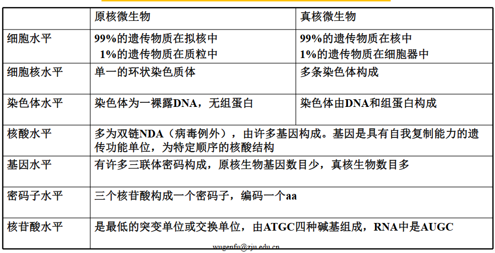
#### 2. 核酸是遗传物质的证据：
- 转化实验:R和S菌
	- 格里菲斯动物实验
	- 细菌培养实验
- 噬菌体侵染实验
	- T2噬菌体侵染大肠杆菌
	- 35S、32P 标记
- 病毒拆解重建实验→TMV烟草花叶病毒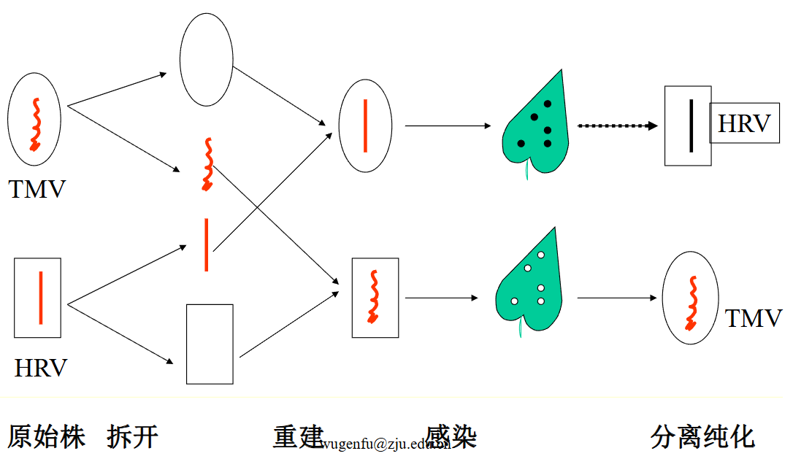
## 三、突变
#### 1. 基因突变
- 类型：
	- 形态突变
	- 生化突变：营养缺陷、抗性突变、抗原突变
	- 致死突变和条件致死突变
	- 其它突变
- 特点：(怎么和我遗传学的不一样。)
	- 不对应性：突变性状和引起突变的原因不直接对应
	- 自发性、诱变性、稀有性
	- 独立性：不影响其他基因
	- 稳定性：可遗传
	- 可逆性：可以发生**回复突变**(原始的野生型基因 ==变异为突变型基因== 的过程称为正向突变，相反的过程为回复突变)
	-  自发性和不对应性的证明： #重点  #考过 
		-  **变量实验fluctuation test**：大肠杆菌抗 phage 不由 phage诱导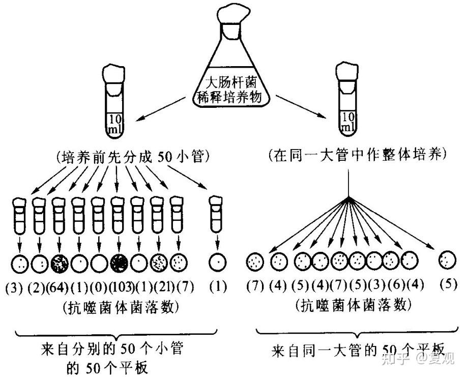
			- 步骤：
				1. 取对噬菌体敏感的大肠杆菌悬液分别装入甲、乙两只试管内，每管10毫升。甲管中的菌液再分装50支小试管中，每管0.2毫升，保温24～36小时，及时把各小管的菌液分别倒在 ==涂有噬菌体== 的平板上，经培养后，对各平板上出现的抗噬菌体的菌落计数；
				2. 乙管中的菌液不分装，先保温24～36小时后才分成50份，加到同样涂有噬菌体的平板上，培养后分别对各平板上出现的抗性菌落计数
				3. 结果发现，来自甲管的50个平板中，各平板间菌落数相差甚大；乙管的菌落数则基本相同→这表明大肠杆菌对噬菌体的抗性来自基因突变，在大肠杆菌接触相应的噬菌体之前，由细胞在分裂过程中自发地、随机地产生
					- 来自甲管的许多平板上不出现抗性菌落，是由于在接触噬菌体前没有发生过突变；在有的平板上可能出现几百个菌落，那是由于突变发生得较早
						- 说明某一性状的突变与环境因素不相对应
						- 打击了拉马克的获得性遗传理论
		- **涂布实验Newcomb experiment**：结果同上				
			- 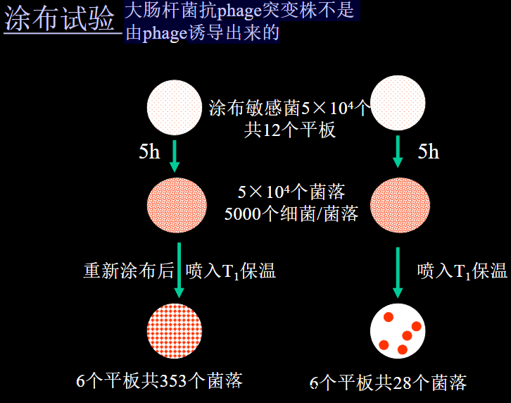
		- **影印培养实验replica plating**：大肠杆菌抗链霉素不由链霉素诱导				
			- 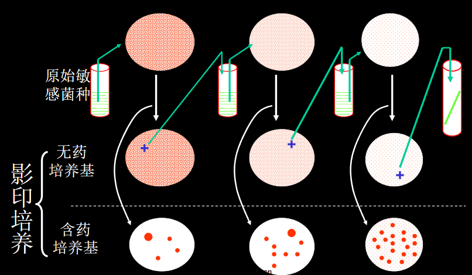
	- 独立性：不影响其他基因
	- 稳定性：可遗传
	- 可逆性：可以发生**回复突变**(原始的野生型基因 ==变异为突变型基因== 的过程称为正向突变，相反的过程为回复突变)
#### 2. 突变机制→具体去复习[[Chapter6 突变和突变修复]]
- 诱变机制
	- 碱基对置换Subsititution
		- 类型
			- 转换——嘌呤变嘌呤 or 嘧啶变嘧啶
			- 颠换——嘌呤嘧啶互换
		- 直接引起置换的诱变剂：直接与碱基反应，体内离体均有作用
			- HNO2使腺嘌呤碱基氧化脱氨成**次黄嘌呤**
		- 间接引起置换的诱变剂：
			- 分子结构与某些碱基类似，掺入 DNA 分子中，复制时导致错配→可以理解为碱基类似物
			- 如 5-BU→烯醇式与酮式互变→与G配对
	- 移码突变
- 突变类型 #重点 比如点突变、移码突变等，对应去分子生物学掌握
- 自发突变机制：
	- 在背景辐射等环境下
	- 自身代谢产物诱变
	- 互变异构效应（如 T 和 G 以酮式和烯醇式两种互变异构状态出现）
	- 环出效应：在DNA的复制过程中，如果某一单链上偶尔产生小环，则在复制时易发生缺失而造成突变
- 突变的修复：
	- 光复活作用（红光下复活）
	- 暗修复作用：切除修复作用，内切酶切开缺口，外切酶切除二聚体，DNA 聚合酶修补连接(我觉得应该是对应NER)
	- 重组修复
	- SOS 修复
#### 3. 染色体畸变(略)
- 因为原核生物没有染色体嘻嘻
## 四、 基因重组
#### 1. 真核微生物基因重组
- 有性繁殖时
- 半知菌类**准性生殖parasexuality**:
	- 概念：两个不同来源的体细胞融合(但是不亲和)→少数核中染色体交换和单倍体化，形成极个别具有新性状的单倍体杂合子
	- 过程：菌丝联合→质配→核配→体细胞交换和单倍体化
		- 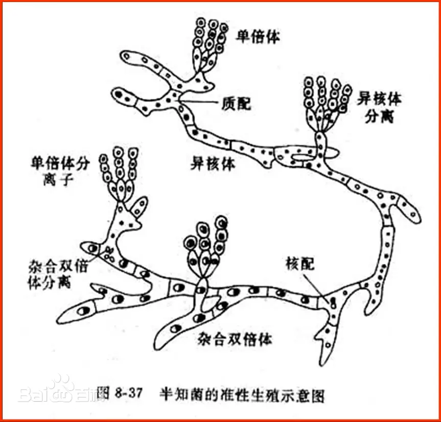
#### 2. 原核微生物基因重组 #重点 
- **转化transformation**：受体菌接受供体菌 DNA 片段，通过交换 ==整合到自己的基因组中== ，从而获得了供体菌部分遗传性状的现象。转化后的受体菌称为转化子。 #名词解释 
	- 转化是游离 DNA 片段的转移和重组(游离质粒的转移也称为转化)
	- 决定因素→可以联系生化的转化实验
		- 受体与供体亲缘关系；
		- 受体菌所处生理状态→感受态、对数生长期
			- **感受态**：受体菌最易接受外源DNA片段并实现转化的生理状态 ^da1df0
		- 环境条件（CaCl2和 cAMP 提高感受态水平）；
		- 足够浓度的双链 DNA作为供体，转化时 ==进入受体细胞的仅一条链== ，另一条链降解
			- G+中双链同时进入但仅单链整合
		- 整合后复制出一条受体原有的 DNA，一条整合了供体 DNA 的 DNA 片段
	- 过程：以革兰氏阴性菌为例
		1. 双链DNA片段与感受态细菌细胞表面的**特定位点** ==结合== 
		2. 在特点位点上的DNA片段发生 ==酶解== ，形成平均分子量4~5×106的DNA片段
		3. DNA双链中的一条链逐步降解，另一条链进入细胞
		4. 转化DNA单链与受体菌染色体上的 ==同源区段配对== ，经取代后形成杂种DNA区段
		5. 受体菌染色体组复制，染色体分离，形成一个转化子（G+菌中双链同时进入但整合时以单链整合）
- **转导transduction**：以缺陷噬菌体为媒介，将供体细胞 DNA 转入受体细胞，从而使受体细胞获得了供体细胞部分遗传性状的现象
	- 发现：1951年鼠伤寒沙门氏菌
		- 组氨酸缺陷型与酪氨酸缺陷型放在同一个U型管中，最后得到的菌株依旧能够生长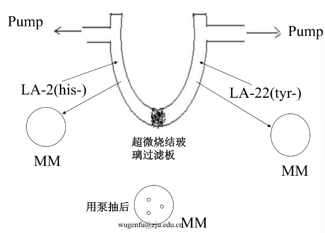
			- 思考原因：是否由回复突变产生？👉但是频率较高，因此排除
			- 是否存在营养互换现象？👉但这样在培养基上长的数量很少
	- **普遍性转导**：烈性噬菌体将供体菌 ==任意基因== 转移到受体菌中
		- 机制：噬菌体在供体细胞中复制时误将供体 DNA 包裹在衣壳内→细菌裂解→缺陷噬菌体侵染受体菌，与其同源染色体配对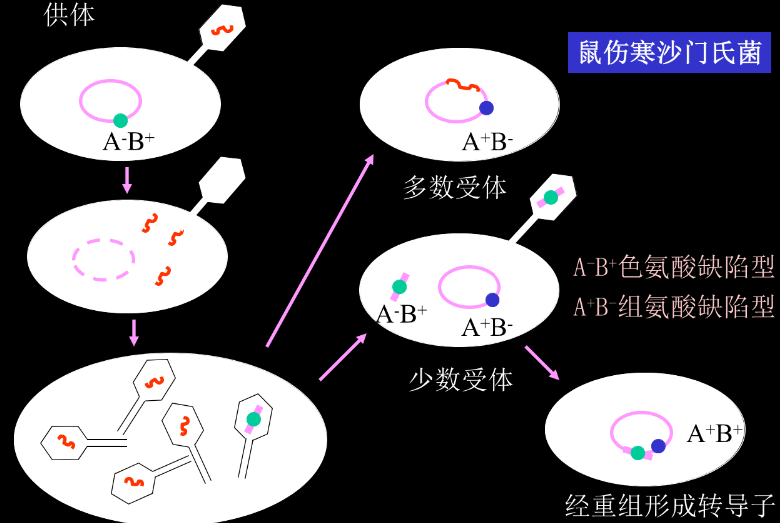
			- 对供体必须是烈性phage，对受体是缺陷型phage
			- 得到的转导子能够在基本培养基上生长
		- 完全转导complete transduction：导入的基因整合到受体菌染色体上
		- 流产转导abortive transduction：导入的基因未整合到受体菌染色体上(了解)→不能传递给后代，但是母细胞细胞质中含有的酶有一半传给子代，还可以有一点点小菌落:O!
	- **局限性转导**：温和噬菌体将供体少数 ==特定基因== 转移到受体菌中。
		- 机制：温和噬菌体 DNA 整合到供体染色体上，切离时误将供体DNA 切割出来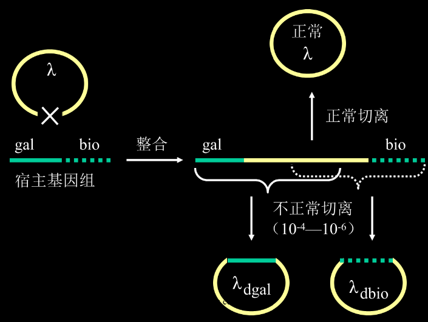
		- **溶原转变Lysogenic conversion**：温和噬菌体感染宿主而使之发生溶原化时，因噬菌体的基因整合到宿主的基因组上，使后者除获得免疫性外，还 ==获得了其它新性状== 的现象
- **接合conjugation**：遗传物质通过细胞间直接接触而转移和重组
	- 联系：真菌的接合孢子
	- 发现：把两种缺陷型涂在一起后才能生长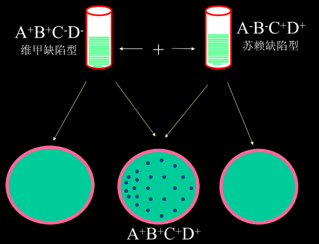
	- 原理：大肠杆菌性别分化，由致育因子 F 因子(性质粒，既可脱离染色体独立，也可整合到染色体上)决定 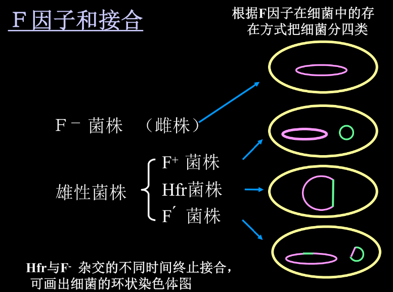
		- 雌株：F-，不含 F 因子。
		- 雄株：
			- F+（含独立 F 因子）
			- Hfr：含整合到染色体上的F因子，重组频率很高的菌株
			- F’：既有独立也有整合到染色体上的 F 因子
	- 雌雄株接合结果：
		- F+×F-→F++F+👉F-会不会消失？
		- F’×F+→F’+ F’
		- Hfr×F-→Hfr+F-（多数情况，Hfr 复制过程中中断)/Hfr+Hfr（少数情况）
			- Hfr 和F-杂交的不同时间终止接合，可画出细菌环状染色体图→ #学科链接 遗传学
## 三、遗传变异知识的应用
#### 1. 突变与育种：
- 从生产中选育：日常生产过程中，筛选好的品种
- 定向培育优良菌种
#### 2. 诱变育种
- Concepts：用物理或化学诱变剂处理均匀分散的细胞群，促 ==使其突变频率大幅度提高== ，然后 采用简便、快速和高效的筛选方法从中挑选少数符合育种目的的突变株，以供生产实践或科学实验之用
- 基本环节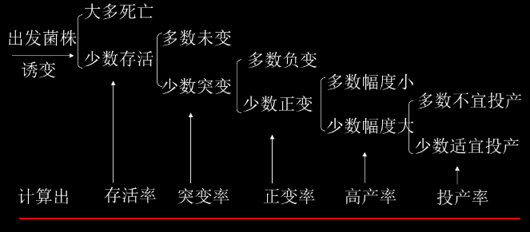
- 遵循原则
	- 简单有效的诱变剂
	- 优良的出发菌株
		- 最好是经生产中选育过的自然变异菌株
		- 用有利性状多的菌株，如：生长速度快，营养要求低等
	- 处理单细胞悬液
		- 分散状态的细胞可以均匀地接触诱变剂
		- 可以 ==避免长不出纯菌落== 。有孢子的霉菌或放线菌应处理孢子，芽孢杆菌应处理芽孢 或对数期初期的营养体 
	- 合适的诱变剂剂量：以致死率为标准
		- 凡在高效变率的基础上既能扩大变异幅度，又能促使变异移向 ==正变范围== 的剂量就是最适剂量
	- 利用复合处理的协同效应(多种诱变剂叠加作用)
	- 用合适状态的细胞→对数生长期细菌
	- 高效筛选方案👉初筛以量为主，复筛以质为主(摇瓶培养)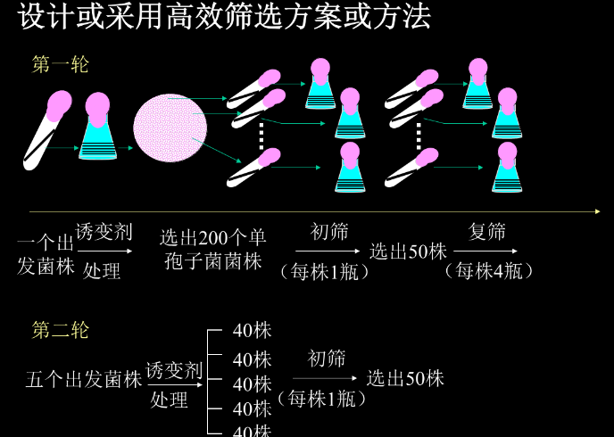
- 营养缺陷型菌株筛选
	- **营养缺陷型**：指一些营养物质的 ==合成能力上出现缺陷== ，因此必须在基本培养基中加入相应的有机营养成分才能正常生长的变异菌株。其变异前的原始菌株称为野生型。
	1. 诱变剂处理
	2. 淘汰野生型：
		1. 抗生素法：用青霉素杀死正在繁殖的细菌
		2. 菌丝过滤法：适用于丝状真菌
		3. 差别杀菌法：野生型的芽孢可以发育成营养体，需要加热杀死→那不会把我们的菌杀死吗🤔此时缺陷型依旧是芽孢
	3. 检出缺陷型
		1. 夹层培养法：上层为完全培养基，小菌落是后面才长起来的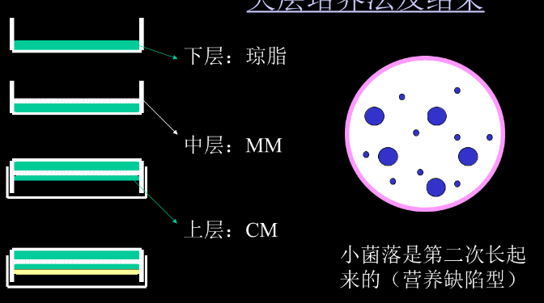
		2. 限量补充培养法
		3. 逐个检出法→笨笨的方法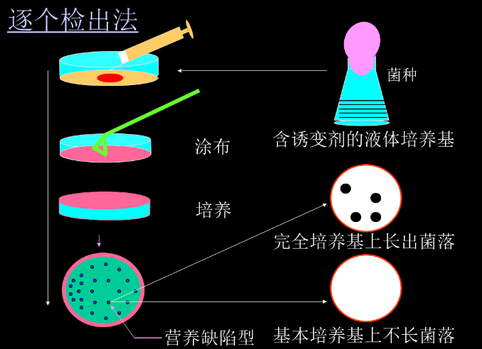
		4. 影印培养法：先在完全培养基上长好，再印到基本培养基上
	4. 鉴定缺陷型：基本培养基上不长，但加了相应成分后能长
#### 2. 杂交育种，定点突变
- 用基因工程的手段实现
#### 3. 基因工程gene engineering
- 定义：人为将所需供体 DNA  ==提取== 出来，在离体条件下切割并与载体 DNA  ==连接== ，载体 ==导入== 受体细胞，在其中 ==整合== 到受体细胞 DNA 中复制表达
- 步骤
	1. 供体系统：动物、植物、微生物
	2. 载体系统：质粒、噬菌体等
	3. 受体系统：大肠杆菌、枯草杆菌、酵母菌→要处于感受态[[#^da1df0]]
	4. 工具酶：限制性内切酶，连接酶等
- 应用：胰岛素、干扰素→导入酵母菌来治疗癌症(因为大肠杆菌不能生产糖蛋白)、固氮基因等
#### 4. 原生质体融合protoplast fusion
- 定义：人为使遗传性状不同的两细胞的 ==原生质体发生融合== 并产生重组子
- 步骤：亲本菌株标记→原生质体制备→原生质体融合→细胞壁再生→遗传稳定性测定→性状测定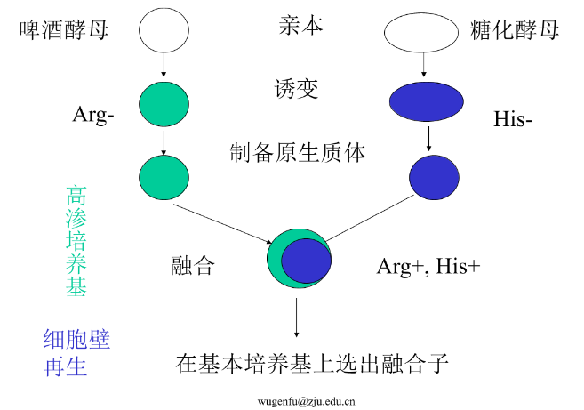
#### 5. 菌种保藏preservation
- 原因：菌种会衰退，大量产生退化性变异
	- 衰退的防止：
		- 控制传代次数；
		- 良好的培养条件；
		- 不同类型的菌种进行接种传代；
		- 有效的菌种保藏方法。
- **复壮rejuvenation**：狭义指已衰退的菌种中筛选少数未衰退的个体以 ==恢复原性状== ；广义指在衰退前就先 ==纯种分离== 使菌种生产性能提高。
	- 方法：纯种分离；通过寄主体进行复制(寄生型微生物)；淘汰已衰退的个体。
	- 菌种：优良菌种(休眠体最佳)，创造条件使其代谢强度降低，处于休眠状态以避免菌种死亡和优良性状丧失
- 方法：
	- 低温保藏
	- 隔绝空气保藏(用石蜡油/橡皮塞封口)
	- 砂土管保藏（孢子、芽孢，隔绝养料），甚至可以达到十年以上
	- 真空冷冻干燥保藏→缺氧、低温干燥
	- 甘油保藏 #课后拓展 
		- 作用机制：
			- 降低冰点，防止冰晶生成；
			- 具有高渗透性，可进入细胞内部，降低细胞内游离水的含量
			- 与细胞膜的磷脂分子和蛋白质相互作用，维持膜结构的完整性和蛋白质的构象稳定性，防止低温引起的变性
		- 对细胞的影响
		- 常用浓度：
			- 15%-20%：适用于大多数细菌，如大肠杆菌、芽孢杆菌等，平衡保护效果与细胞耐受性
			- 20%-30%：适用于乳酸菌、酵母菌等对低温较敏感的菌种，需更高的甘油浓度以增强保护
			- 10%-15%：适用于某些对甘油敏感的菌种，如部分厌氧菌或极端嗜热菌，降低毒性风险
#### 6. 突变与致癌物监测Ames test #重点 
- 环境、食品、药物等的三致（致突变、致畸、致癌）监测
- 原理：
	- 鼠伤寒沙门氏菌的组氨酸缺陷型在基本培养基上无法生长，在诱变剂的诱导下可发生回复突变，转化为野生型
		- 某些物质本身非诱变剂，但进入动物体内后**经生化修饰可能变成诱变剂**，可先用鼠肝匀浆和监测物质混合保温，待其生化修饰后再置于含鼠伤寒沙门氏菌的平板上
	- 步骤： #考过 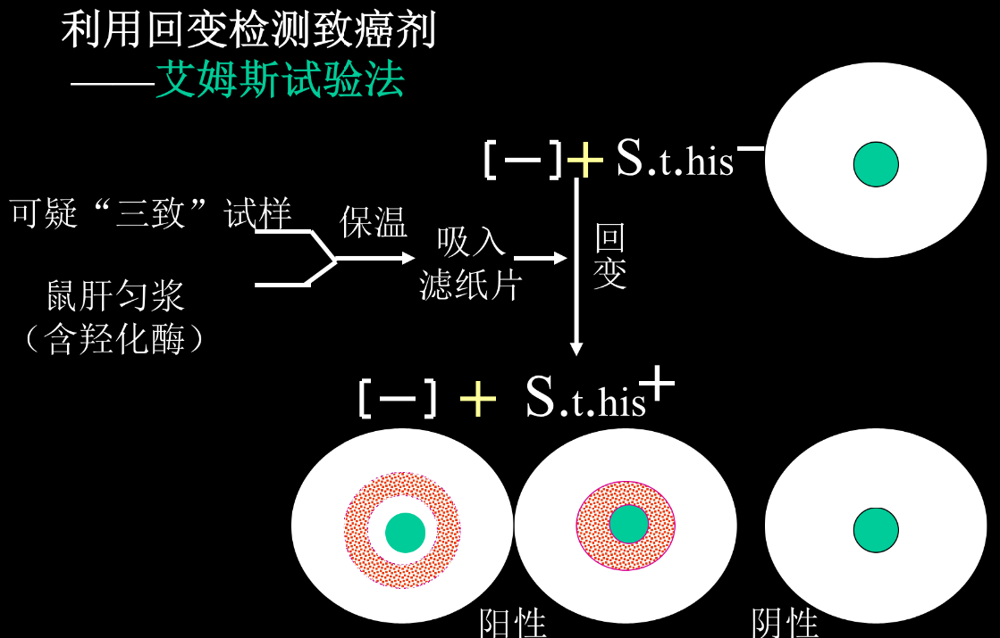 
		1. 将可疑的 “三致”（致癌、致畸、致突变）试样与鼠肝匀浆👉(含羟化酶，可 ==模拟体内代谢过程== ，使一些非诱变剂物质在代谢后转变为诱变剂 )混合，经保温后吸入滤纸片
		2. **与菌株作用**：把含有处理后试样的滤纸片放入接种了 S.t.his⁻ 菌株的培养环境中。如果试样中含有诱变剂，就可能诱导 S.t.his⁻ 发生 ==回复突变== ，转变为 S.t.his⁺ 。

-----------------
1. 遗传性、变异性、基因型、表型、饰变
2. 怎样证明核酸是遗传变异物质基础
3. 基因突变、转换、颠换、碱基置换、移码突变、基因重组、接合、转化、转导、性导、转化子、普遍性转导与局限性转导
4. 基因突变的特点，怎样证明基因突变是自发性和不对应性的(三个经典实验)
5. F+、F-、Hfr、F’之间的相互关系
6. 诱变育种工作中应遵循的原则
7. 营养缺陷型筛选的一般方法
8. 菌种保藏方法
---
- References：
	- [干货 | 化学感受态细胞进行质粒DNA转化的原理 - 知乎](https://zhuanlan.zhihu.com/p/356262160)
	- [转化、转导、接合、细胞转化的区别 - 知乎](https://zhuanlan.zhihu.com/p/184967048)
	- [如何用实验方法区分转化转导接合？ - 知乎](https://www.zhihu.com/question/437589130)
	- [Nature | 揭秘细菌IV型分泌系统及菌毛生成机制|VirB|结构|SS|复合物|传递|-健康界](https://www.cn-healthcare.com/articlewm/20220715/content-1400799.html)
	- https://mp.weixin.qq.com/s/1bSlltAdBs66IXDNSN9_zw