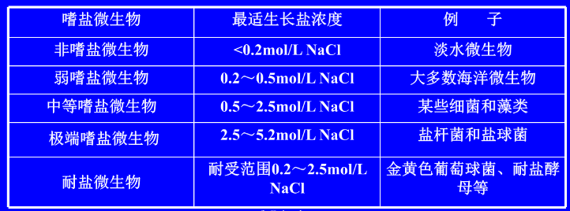
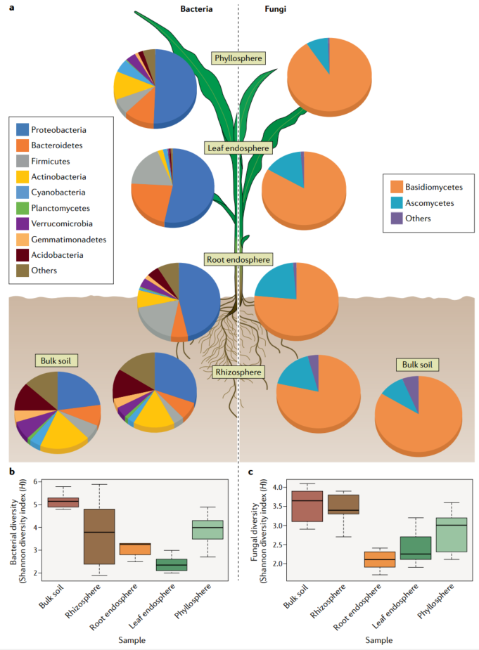
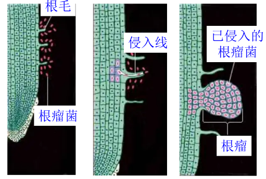
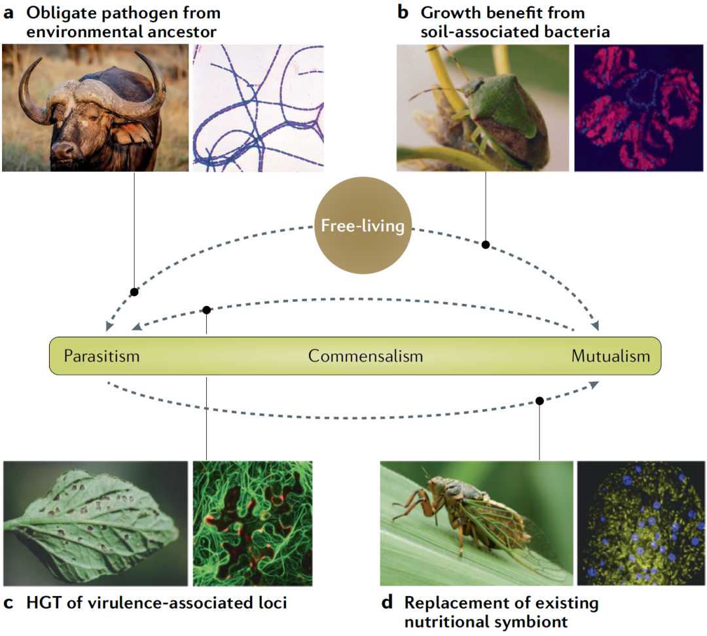
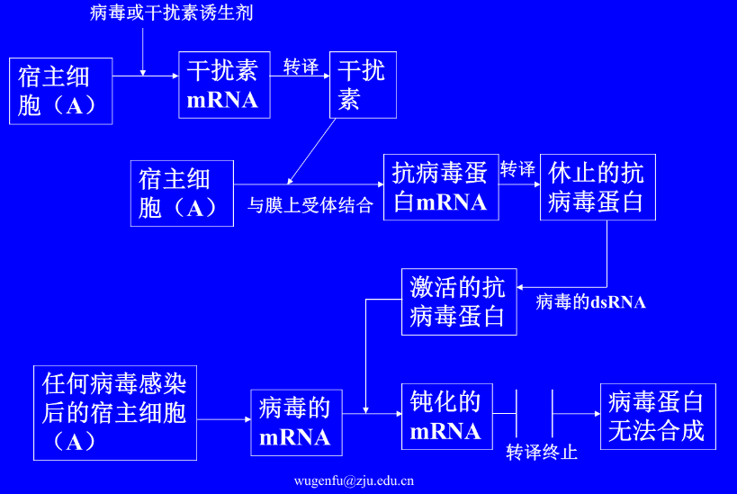
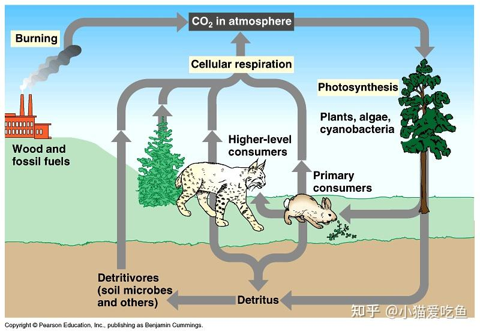
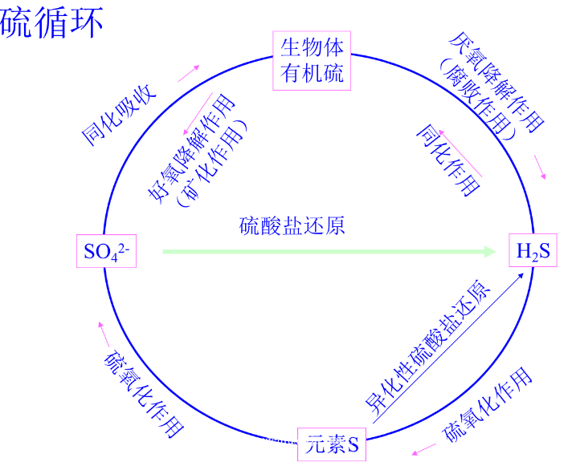
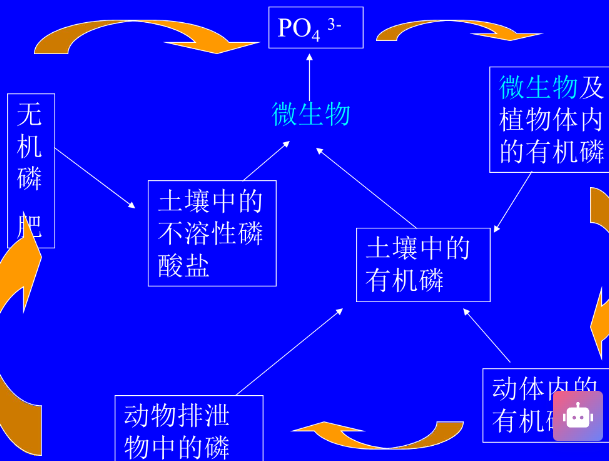

## 一、自然环境中的微生物

#### 1. 土壤中的微生物(陆菌)
- 土壤是微生物的 ==“天然培养基”== 
	- 含有丰富有机物，可 ==提供C、N能源== 👉土壤浸出液加一点琼脂就可以作为培养基了！
	- 含有多种适宜浓度的**无机矿质**成分
	- 土壤结构疏松，可提供充足的**水分，氧气**
	- 土壤**酸碱度**在pH 5.5-8.5，适于微生物生长
	- 土壤中的**温差**小
	- 能保持微生物避免受阳光直射
- 微生物的分布
	- 10-20cm 深土层最多
	- 细菌最多(细胞较小)，放线菌次之，真菌最少，三者生物量相当；藻类和原生动物较少。
		- 细菌70-90%：体小、种类多： ==大多异养型== ，少数自养型，参与有机物的分解、腐殖质的合成以及各种矿质元素的转化
		- 放线菌5-30%：种类多，主要为**链霉菌属**，主要 ==分布于耕作层== ，随土壤深度增加而减少
			- 泥土的清香😍
		- 真菌量少，多好氧，分布于土壤表层
- 土壤微生物作用：参与土壤物质转化，分解有机物，合成腐殖质。
#### 2. 水中的微生物(海菌)
- 水体是微生物栖息的 ==第二场所== 
	- 水中溶解有N、P、S等无机营养物
	- 水中有机物丰富，特别是受污染的水体中
	- 水体温度变化大，淡水：0~36℃，海水：<5℃，温泉：70~100℃
	- 水中溶解O2较少
	- pH接近中性，适于微生物生长
- 微生物的分布
	- 随不同的水体而异，大多来源于土壤
	- 好氧性细菌在水表面，厌氧性细菌多在深水处→ ==光合细菌一般厌氧== ，适于中层水体（20~30m，指海洋中）
		- **清水型微生物**：指能生长在含有机物不丰富的清水中的 ==化能自养型或光能自养型== 的微生物。
			- e.g.硫细菌、铁细菌、衣细菌，蓝细菌、绿硫细菌、紫细菌
			- 仅从水域中吸取无机物或少量有机物作营养
		- **腐生型水生微生物**：指能利用进入水体的废物为营养的微生物
			- e.g.变形杆菌、大肠杆菌、产气杆菌、产碱杆菌以及芽孢杆菌、弧菌和螺菌等
			- 能利用有机残体、动物排泄物，生活污水和工业有机废水(老师：启真湖)
- 我国规定饮用水微生物指标：细菌数≤100 个/mL，大肠杆菌指数≤0 个/L。
	- 饮水消毒用液态氯或次氯酸盐(云顶山泉🤔[[Chapter7 微生物的生长]]
- 水中微生物作用：
	- 光合细菌为食物链第一级；
	- 分解有机质以净化水体；
	- 有些是致病菌
#### 3. 空气中的微生物(空菌:O!)
- 空气非微生物生存理想场所
	- 含O2丰富
	- 营养物质和水分缺乏
- 种类分布：
	-  ==抗逆性强== 的微生物及一些致病菌→一下雨就发霉🤯
	- 分布：与环境有关
		- 多风干燥季节多，雨后低；近地面大气中多；城市上空比乡村多；公共场所多
		- 酒店空气中的细菌总数浓度也是有要求的
- 作用有致病、致腐败、致霉变。
#### 4. 环境微生物研究方法：
- 依赖培养的微生物方法：
	- 采集→富集培养→分离→鉴定→微生物多样性及活性分析；
	- 自然界中的微生物 99%以上是未培养微生物(uncultured microorganisms)
- 不依赖培养的微生物生态学研究法
	- 染色 ==计数== 总菌数：用**DAPI**、**吖啶橙**等染色后在荧光显微镜下计数
	- 用 ==分子生物学== 方法研究微生物的结构与功能
		- 用16S rDNA分析微生物多样性
		- 微阵列法分析微生物多样性及功能多样性
		- 宏基因组（metagenomics）技术
## 二、极端环境中的微生物

#### 1. 高温
- 高温微生物
	- 嗜热菌(最适65～70℃以上，最低在40℃以上)
		- 耐热机制[[Chapter7 微生物的生长]]
	- 兼性嗜热菌(最适为50～60℃，但在常温仍能生长)
	- 耐热细菌(最适温度在常温，50～60℃仍能生长)
#### 2. 高盐
- 高盐环境：盐湖、死海、盐场和腌制品
	- 能在这些高盐环境中生存繁殖的微生物称为嗜盐性微生物
- 分类
- 耐盐机制：
	- 胞内 ==离子强度高== ；
	- 酶能在高盐中有活性；
	- 具**紫膜**(光合作用时具H+泵作用，产生膜电位差，合成 ATP，同时 ==将胞内盐泵出体外== )
#### 3. 其它
- 高酸：耐高酸微生物为嗜酸性微生物，将 S2-氧化为 SO4 2-
	- 可以用来冶金:O!
- 高碱：机理尚不清楚，可能嗜碱性由少数基因控制e.g.环状芽孢杆菌
- 高压：海洋深处、深油井中，嗜压菌生长缓慢。
## 三、微生物与生物环境间的相互关系
#### 1. 微生物间的相互关系
1. **种间共处**：各自独立存在而互不影响
	- e.g.乳杆菌和链球菌
2. 互生(共栖)：两种微生物均能独立生存， ==但共同生活时较独立时更好== ，相辅相成，可以是一种微生物的生命活动为另一种创造有利的生活环境
	- e.g.**纤维素分解菌**与**固氮菌**共存
3. 共生symbiosis：
	- Concepts:两种微生物紧密共居，彼此依赖， ==互创有利条件== ，独立时不能较好地生活，在生理上相互分工、互换生命活动产物，在组织上形成新的结构
	- e.g.如地衣（真菌与藻类）→“先锋植物”
4. **拮抗antogonism**：两种微生物生活在一起时，一种能够 ==抑制甚至杀死另一种== 。
	- 非特异性拮抗：乳酸菌产生乳酸
	- 特异性拮抗：青霉抑制金葡菌
5. **寄生parasitism**：一种微生物生活在另一种生物表面或体内，从后者细胞组织或体液中获取营养，一定条件下会对后者造成 ==损害或致死== 
	- 细菌间：一种细菌可以寄生在另一种细菌体内e.g.**食菌蛭弧菌**能寄生在大肠杆菌等许多Ｇ-菌体内。
	- 真菌间：一种真菌寄生在另一种真菌间较普遍
6. 竞争关系：两种或多种微生物群体共同依赖同一营养物质或环境因素，导致一方或双方或多方的生长和增殖受到限制。
	- 普遍存在，适者生存，环境改变会导致竞争结果改变。
7. 捕食关系predation：一种微生物以另一种为食。
	- e.g.原生动物对细菌、酵母等的捕食（最典型、最大量）
	- 藻类对细菌和其他藻的捕食等
#### 2. 微生物与高等植物间的相互关系
- **互生mutualism**：根际微生物
	- 产生铁载体
	- 改变植物形态，促进根系吸收
	- 分泌**抗生素类**物质，利于抗病原菌侵染
	- 改善土壤特性。植物提供养料和能源
-  共生：根瘤菌和豆科植物
	- 根瘤菌固氮供给植物，植物为菌提供养分和稳定的生长条件
		- 根瘤菌可以固定空气中的氮
		- 大豆可以合成**豆血红蛋白**从而结合氧气→包围在根瘤菌周围，吸收多余氧气从而创造 ==厌氧环境== 
	- 真菌和植物的共生：草坪上的小蘑菇^v^；菌根
		- 菌根分为外生菌根和内生菌根
	- 2024年报道了首个真核固氮生物
- 寄生：引起植物病害，真菌最普遍e.g.霉菌的马铃薯啥病→导致欧洲马铃薯减产
#### 3. 微生物与人体及动物间的相互关系

1. 互生：肠道菌群
	- 肠道菌群的作用 #课后拓展 
		- 肠道菌群的种类很多，每个人都有所差别
		- 把胖人和瘦人的肠内细菌分别移植到老鼠体内：移植了胖人的肠道细菌的老鼠的脂肪逐渐增加，变得肥胖起来→缺乏多形杆状菌
			- **多形杆状菌**能够分泌 ==短链脂肪酸== →在脂肪细胞中阻止细胞吸收脂肪，从而防止肥胖；可以作用于肌肉上燃烧脂肪
			- 增加多形杆状菌的饭饭：摄入食物纤维(洋葱、芦笋、大豆)
		- 肠道细菌的分泌物还可以预防糖尿病和血栓、类似于雌马酚(让皮肤保持弹性，增加胶原蛋白)
		- 有明菌分泌出来的DCA可以引起细胞老化👉导致癌症和肥胖
		- “粪便微生物移植”🤔(不想打了，还是去看原文吧)
	- 排斥外来微生物的作用
		- 90%的5-羟色胺在肠道里合成
2. 共生：瘤胃微生物与反刍动物
	1. **瘤胃微生物**分解纤维素→葡萄糖和有机酸，合成氨基酸和维生素；
		-  牛羊有4个胃:瘤胃、网胃、瓣胃和皱胃 #课后拓展 
			- 瘤胃就像一个大型发酵罐，能容纳大量未经充分咀嚼的食物。食物先快速进入瘤胃储存，之后再进行反刍
			- 原因：牛羊很容易被追ε=ε=ε=(~￣▽￣)~
	2. 反刍动物供给营养物质(纤维素)以及生长、消化的环境
3. 寄生：
	1. 寄生于有益动物内：对人体不利，如病原微生物引起传染病等；
	2. 寄生于有害动物内：对人体有利，如苏云金杆菌和虫霉使昆虫死亡
	3. 微生物在人体和动物体内寄生引起人与动物的传染病常见的畜禽传染：炭疽病，口蹄疫，猪瘟，鸡瘟病等
4. 免疫学：传染与免疫
	- 免疫
		- 非特异性免疫
			- 第一道防线： ==屏障结构== →外部屏障(皮肤、粘膜等)，内部屏障(血脑)
			- 第二道防线： ==吞噬及抗菌作用== 
				- 抗菌物质(溶酶体、干扰素等)
				- 吞噬细胞的吞噬作用、炎症反应
		- 特异性免疫
			- 体液免疫：浆细胞产生**抗体**
				- 抗原抗体反应的特点 ：特异性 、比例性、可逆性，阶段性 #考过 
			- 细胞免疫：致敏T细胞释放各种**淋巴因子**
	- 感染
		1. 隐性感染：在体内检测不到微生物
		2. 病原携带：免疫力与侵染能力相当，无法被感染，但是可以同时检测到病原微生物及其抗体
		3. 显性感染：病原微生物毒性>免疫力
	- 病原菌的致病条件
		- **毒素**:对宿主有毒，能够直接破坏机体的结构和功能
			- 外毒素
			- 内毒素
		- **侵袭力**：本身无毒性，但能 ==突破宿主机体的生理防御屏障== ，并可在机体内生存下来（医学上称为定殖）、繁殖和扩散
		- 如果把毒素当作“元凶”，那侵袭力就是“帮凶”
## 四、微生物与自然界的物质循环
#### 1. 碳素循环
- 概念：微生物在碳素循环中的作用
	- 光合微生物固碳，呼吸生成 CO2
	- 石油勘探与碳素循环
		- 甲烷、乙烷和丙烷混合物可以渗透到地面👉石油富含区中能够**利用烃类**的细菌→可以用于 ==勘探石油:O!== 
####  2.氮素循环：
1. 固氮：固氮作用分自生、共生和联合固氮作用(根际微生物与固氮菌)[[Chapter5 微生物代谢]]
	- 施用固氮菌肥和根瘤菌肥料，适当施肥
2. 氨化作用：由氨化微生物 ==分解有机氮化物生成氨== (还原的过程)
3. 硝化作用：(氧化过程)
	1. NH3→NO2- 由亚硝酸细菌完成
	2. NO2→NO3- 由硝酸盐细菌完成
4. 反硝化作用：包括了硝酸盐还原作用和脱氮作用(硝酸盐→氮气)
- 农业生产上：
	- 施用固氮菌肥料与根瘤菌肥料
	- 适当使用肥料，避免干扰氮素的自然循环，破坏生态平衡
#### 3. 硫素循环：
- 硫素的存在形态：有机硫、硫化氢、元素 S、硫酸根等
- 微生物在硫素循环中的作用：
	- 分解：有氧时→硫酸根(矿化)， ==缺氧时→H2S/硫醇== (即腐败作用) 厌氧牙垢菌?🤔
		- 水体发臭了怎么办→加入氧气!(水池里的喷泉⛲)
	- 同化：微生物利用硫酸根、硫化氢组成细胞成分
	- 无机硫的氧化：硫细菌将 H2S 等氧化为 SO4 2-
	- 无机硫还原：前述反向
- 矿物开采和硫素循环：矿物中金属+硫酸→金属的硫酸盐（溶解金属）。
#### 4. 磷素循环：
- 自然界中的磷素循环
- 微生物将无机P合成有机P，将有机 P 及不溶性磷酸盐变 ==为可溶性磷酸盐== 
- **细菌肥料**：
	- 无机磷细菌肥料：**产酸**能力很强，可以溶解不溶性无机磷酸→有助于植物吸收
	- 有机磷细菌肥料：**矿化**有机磷化物如磷脂等e.g.蜡状芽孢杆菌

## 五、微生物生态系统

- 种群多样性
- 稳定性
- 适应性
- 遗传交流多样性：突变/重组/转导转化等，进行基因交流
	- 微生物遗传基因的水平漂移：某种适应性特征被导入基因库，由于微生物的高速繁殖使得导入的基因在微生物种群中迅速而广泛地分布。
- 物质循环与能量流动
## 六、 微生物与环境保护
#### 1. 相关概念
- 为什么环境保护：污染
	- 微生物降解有毒有机物如农药、石油、洗涤剂等
- 环境保护的内容：保护自然环境；防止污染和其他公害（污染物无害化后排放）
	- 大肠杆菌等的脱卤作用可以降解有毒有机物e.g.农药、石油、洗涤剂
#### 2. 微生物在环境保护中的作用
1. 降解污染物
	1. 代谢类型多样，各种污染物都可以找到对应微生物
	2. 微生物繁殖迅速、适应环境快
2. 污染物的微生物处理：
	1) **水体自净**：自然界的水体中，栖息着各种各样的生物，它们构成了 ==水体中物质的生物地球化学循环的主体== ，使流入水体中的 ==有机物含量随水流逐渐降低== ，恢复到自然状态，这个过程叫水体的自净作用
	2) **污水处理**
		- **水污染**：进入水体的外来污染物数量超过了水体的自净能力，并达到破坏水体原有用途的程度
		-  ==好氧微生物处理为主== ，如氧化塘法、活性污泥法、生物膜法→速度快，代谢速率高
			- 在有氧条件下，有机物一部分同化为菌体物质，另一部分产生无机物质
			- 先把微生物包起来，然后通氧气
		- 厌氧生物处理为辅，e.g.沼气发酵、固废处理（需氧性堆肥法、厌氧发酵法
	3) 与固体废物的处理
		- 需氧型堆肥法：分解有机物制作肥料→但是需要不断地翻来翻去
		- 厌氧发酵法：制作肥料与沼气
3. 污染物的微生物监测：利用微生物对环境的响应
	1) 在水质检测中，常用异养细菌总数和大肠菌群(粪大肠菌群)指数作为污染的标志
	2) **五日生化需氧量BOD5**：20℃，1L 污水中所含有机物在微生物氧化时， ==5天内消耗的氧的毫克数== 
		- 越高说明污染越多
		- 20℃→泰晤士河的常年温度，5天→泰晤士河从源头流到尾部的天数😂
	3) **化学需氧量**：用**强氧化剂**使1L污水中的有机物迅速化学氧化时所消耗的氧的毫克数
		- 使用高锰酸钾/重铬酸钾
	4) 发光细菌检测法：发光细菌在不良条件下发光能力受影响。
	5) Ames 试验：突变与致癌物监测[[Chapter8 微生物的遗传]]
----
1. 互生，共生，寄生，拮抗
2. 生物地球化学循环，自然界中的C、N、S、P素的循环
3. 微生物在自然界物质循环中的作用，怎样利用这种作用为生产实践服务
4. 微生物与环境的相互关系
----
- References
	- [用三分钟的动画告诉你，土壤微生物和作物生长到底有什么关系！-三农视频-搜狐视频](https://tv.sohu.com/v/dXMvMzMxODI0Mzg2LzE4NDE2NDY1OS5zaHRtbA==.html)
	- [Nature综述：微生物沿着寄生-共生连续体进化和转变！-CSDN博客](https://blog.csdn.net/woodcorpse/article/details/116141875)
	- [《微生物学》主要知识点-09 第九章 微生物的生态 - 知乎](https://zhuanlan.zhihu.com/p/616649304)
	- [【重镑】一片看懂肠道菌群在人体中的作用-岛国科普又走在了我们前面](https://mp.weixin.qq.com/s?__biz=MzUzMjA4Njc1MA%3D%3D&idx=1&mid=2247484506&scene=21&sn=89bc9b733e2cdca1075edf1cb063f38d#wechat_redirect)