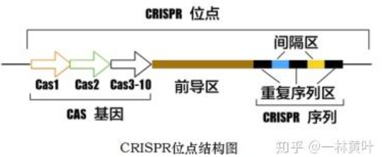
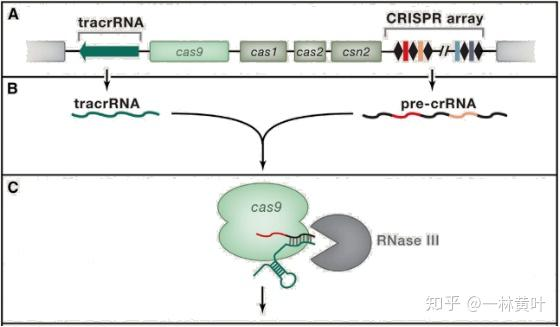
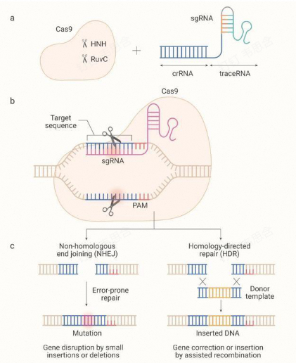
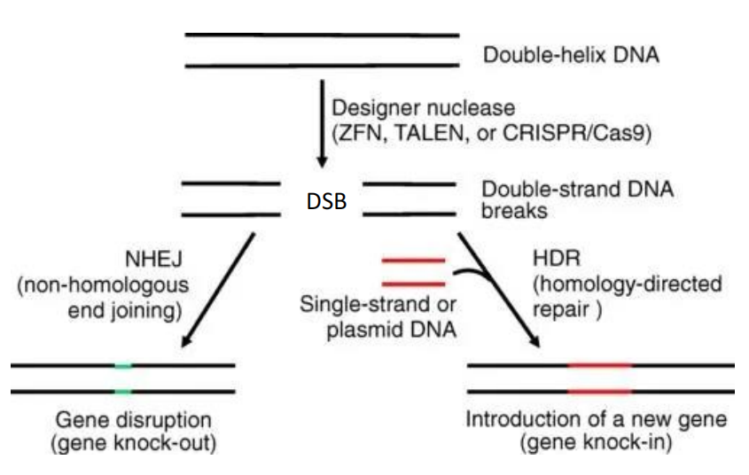

### 一、生物研究历程
- Mendel:开创遗传学之年
- Thomas Hunt Morgan:基因、染色体、连锁遗传
- Barbara McClintock芭芭拉发现玉米转座子
- Frederick Griffith肺炎双球菌转化实验
- Hershey and Chase：DNA是遗传物质
- **1944年**：Avery等人证明DNA是遗传物质。
- **1953年**：沃森和克里克发现DNA双螺旋结构，奠定了分子生物学的基础。
- **1962年**：沃森、克里克和威尔金斯因DNA结构研究获诺贝尔奖

### 二、基因工程
#### 1. 核酸酶
- 核酸酶nuclease:能够将聚核苷酸链的 ==磷酸二酯键== 切断的酶
- **限制性内切酶restriction endonuclease**：当外源DNA侵入细菌后，限制性内切酶可以将其水解为片段，从而限制了外源DNA在细菌细胞内的表达
	- #一些疑问 为什么细菌需要限制性内切酶？
		- 人体中有免疫系统，但是细菌没有。为了防止噬菌体并入其中，就需要用到内切酶把他们切掉(ˉ▽￣～) 切~~
		- 防止转座子跳来跳去
- 对核酸酶的改造
	- 巨型核酸酶、锌指核酸酶、转录激活样效应因子核酸酶TALEN→蛋白识别DNA、成簇规律间隔短回文重复CRISPR/Cas9
- **回文序列palindrome sequence**
	- 分类
		- 短：特别的信号，如限制性内切酶的识别序列
		- 长：形成 ==发夹结构== ，有助于DNA与特异性DNA蛋白结合
	- 特征：有对称中心
	- 功能：
		- 限制性内切酶的 ==识别位点== 
		- 具有调节基因的表达作用
		- 转录终止时的识别结构
		- 基因工程的“手术刀”
## 三、 CRISPR-Cas9 
#### 1. 相关概念
- 原型：细菌和古菌的免疫系统
- Reference：[CRISPR-Cas9基因编辑技术简介 - 知乎](https://zhuanlan.zhihu.com/p/137760447)
- 意思：
	- CRISPR:Clustered, Regularly Interspaced, Short Palindromic Repeats;成簇的规律性间隔的短 ==回文重复序列== 
		- 前导区：富含AT碱基，被认为是CRISPR的启动子
		- 重复序列：长度约20–50 bp碱基且包含5–7 bp回文序列，转录产物可以形成发卡结构，**稳定RNA的整体二级结构**
		- 间隔序列：**是被细菌俘获的外源DNA序列**。这就相当于细菌免疫系统的“黑名单”，当这些外源遗传物质再次入侵时，CRISPR/Cas系统就会予以精确打击
	- Cas：CRISPR-associated protein→属于蛋白质
		- 位于CRISPR基因的附近，编码的蛋白质可以与CRISPR序列区域相互作用
- 组成：
	- CRISPR:细菌基因组的特殊重复序列，能够将入侵过的病毒DNA片段存起来
	- Cas9：关键蛋白质
		- Cas9 核酸酶
	- crRNA和tracrRNA（合并 sgRNA ）
	- #一些疑问 这些物质是如何生成的呢？
#### 2. 作用机制 #重点 
1. 病毒侵染→将自身基因整合到细菌CRISPR序列中
2. CRISPR序列转录出pre-crRNA，同时与pre-crRNA序列互补的[tracrRNA](https://zhida.zhihu.com/search?content_id=118745055&content_type=Article&match_order=1&q=tracrRNA&zhida_source=entity)（**反式激活crRNA**）也被转录出来→两者互补配对→同时与Cas9结合在一起
3. 根据入侵的病毒，找到相应的间隔序列RNA，pre-crRNA在RNase的作用下剪切，最终形成一段小的crRNA→组成最终的复合物
	- PAM：类似于身份证，通常由三个碱基构成
4. 复合物扫描外源双链DNA，crRNA与其中的序列互补后→Cas9蛋白的两个结构域分别将外源DNA的双链给截断
#### 3. CRISPR-Cas9的应用

1. 基因敲除：
	- 当 Cas9 把 DNA 切断后，细胞会自己修复
	- 如果没有修复模板，细胞用 “**非同源末端连接NHEJ**” 的方式修复，可能会让基因序列出现一些随机变化→失去功能进而达到 ==沉默基因== 的效果[[Chapter6 突变和突变修复]]
2. 基因敲入：
	- 有修复模板，细胞就会用 “**同源定向修复HR**”，能更精准地按照我们给的模板来改变基因→加入新的基因
3. Expriment Conduct: #课后拓展 
	1. 
#### 4. 延伸技术
- CRISPRa：基于 ==切割活性丧失的dCas9== →gRNA引导dCas9和转录因子结合在转录起始位点→激活基因表达→不会造成DNA双键断裂，安全性更高
- CRISPRi：dCas9融合基因抑制结构域/双抑制结构域→抑制效果更佳
- 单碱基编辑器：CBE/ABE[[Chapter6 突变和突变修复]]
- prime editing,PE引导编辑：
	- 在基因组的靶向位点实现任意类型的碱基替换、小片段的精准插入与删除[[Chapter2 遗传物质研究]]
	- 由nCas9（H840A）融合逆转录酶（reverse transcriptase，RT）和pegRNA（prime editing guide RNA）组成→在pegRNA的引导下，nCas9切割非靶标链，释放出可与其结合的游离单链→从而起始逆转录酶对RT模板的逆转录过程，然后通过DNA修复将RT模板上对应的碱基改变引入基因组
## 四、前沿技术
- **人类基因组计划HGP**：与曼哈顿原子弹计划和阿波罗计划并称为三大科学计划，是人类科学史上的又一个伟大工程，被誉为生命科学的“登月计划”。
- **DNA元件百科全书计划(encyclopedia of DNA elements,ENCODE)** #考过
	- 目的：寻求新一代DNA研究技术对人类基因调控序列在全基因组的水平上研究的应用。
	- 研究对象：编码蛋白基因、非编码蛋白基因、调控区域、染色体结构维持和调节染色体复制动力的 DNA元件。
- **T2T(Telomere-to-Telomere)基因组**：多种测序技术完成的高准确性、高连续性和高完整性的从端粒到端粒的基因组组装
--------

1. what’s restriction endonuclease? it’s application in genetic engineering?
2. Please describe how CRISPR/Cas works in cells? it’s applications?
3. What’s the aim of ENCODE project?
4. Biologists knew that chromosomes carried the genetic material long before they knew that the genetic material was DNA. Why do you think it took them so long to discover the importance of DNA? #考过 
5. How will advancements in AI technology impact biological research and its transition into industrial applications?