## 一、遗传物质应当具有的特征
- must be able to hold information for how to make proteins
- must be stable
- must have some capacity for change
- must be to be copied
- 基因的结构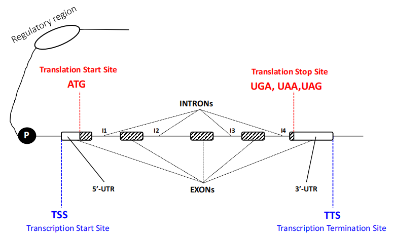
## 二、 DNA的分子结构
#### 1. 核苷酸结构
- 一条链之间由磷酸二酯键phosphodiester Bond进行链接，两个碱基之间以氢键进行链接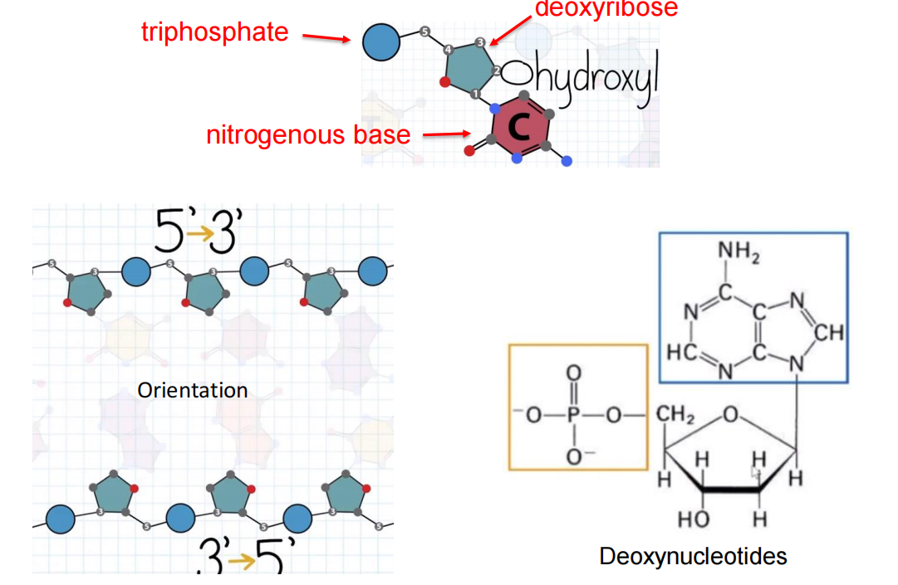
	- 磷酸二酯键：是一种 ==化学基团== ，而不是通常化学意义上所说的共价键或离子键。
		- 磷酸二酯键的高度稳定性被认为是核酸作为遗传物质的重要原因
- 组成
	- 脱氧核糖deoxyribose
	- 碱基nitrogenous base
		- 两个环→嘌呤；一个环→嘧啶
		- #一些疑问 Q：为什么一定是嘧啶和嘌呤相匹配呢？这和它们的化学结构有什么关系呢？
	- 磷酸phosphate
#### 2. DNA的结构→可以与生化相联系 #学科链接
- 碱基互补配对原则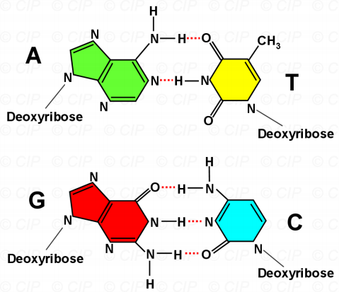
	- 虽然氢键的力量比较弱，但是由于双链中存在的数目很大；并且**碱基堆积力base-stacking**很强，因此双链结构十分稳定
- 大沟和小沟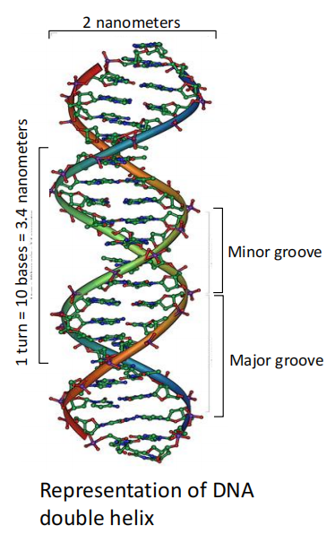
	- #重点 蛋白需要结合的是DNA的大沟Major groove
- DNA的螺旋结构
	- B DNA
	- A DNA
	- Z DNA：与基因表达、调控有关
	- #课后拓展 其它结构的DNA如何形成？我们身体中最常见的是哪个构象？为什么？
- DNA的解链denaturation
	- 条件：s high alkaline concentration, low salt concentration,or high heat,or enzyme
	- 熔解温度Tm：DNA吸光值增加到最大值的一半的温度
		- DNA中C-G含量越高→越稳定→Tm值越大
#### 3. 细胞中的DNA
- 原核生物中
	- 环形，没有头尾
- 真核生物中：拥有更多的DNA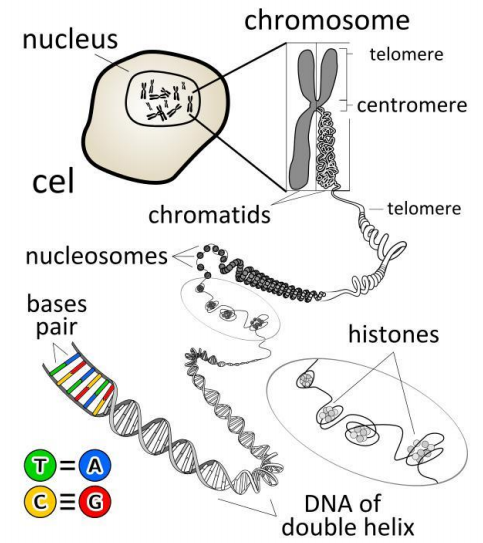
#### 4. 真核生物染色质的构成
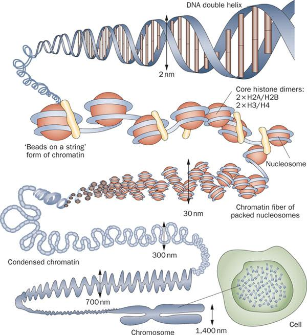
1. 组蛋白：富含[赖氨酸](https://baike.baidu.com/item/%E8%B5%96%E6%B0%A8%E9%85%B8/559809?fromModule=lemma_inlink)和[精氨酸](https://baike.baidu.com/item/%E7%B2%BE%E6%B0%A8%E9%85%B8/559487?fromModule=lemma_inlink)残基的高度碱性蛋白质
	- H2A H2B H3 H4→形成八聚体(cotamer) #考过 
	- 组蛋白大多是 ==碱性氨基酸== ，带有正电荷；DNA带有负电荷→紧密结合
2. **Nuclesome核小体**：DNA环绕octamer形成：大约环绕两圈，150bp
3. Beads-on-a-string model线珠模型
	- 组蛋白H1→能够将线珠模型浓缩condensed→30nm→环状结构
4. **染色质**
	- telomere端粒 centromere着丝粒→大多数是重复序列，基因数量越少，组蛋白紧密结合
	- **常染色质Euchromatin**：染⾊质的⼀种松散聚集的形式，相应的⽚段通常处于活跃的转录当中 #重点 	
	- **异染色质Heterochromatin**：由于DNA和蛋白质高度压缩/DNA甲基化而形成，这样 ==整个区域可以被深染== 
		- DNA甲基化 #课后拓展 
			- Concepts：主要指在DNA分子中胞嘧啶碱基的第5位碳原子上添加一个甲基（-CH₃），形成**5-甲基胞嘧啶(5mC)**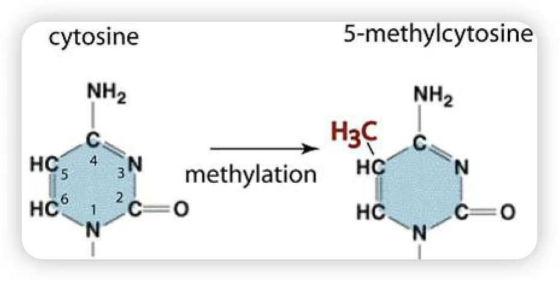
				- 由DNA甲基转移酶（DNMTs）催化，依赖S-腺苷甲硫氨酸（SAM）作为甲基供体
			- 主要发生在CpG二核苷酸（即胞嘧啶后紧跟鸟嘌呤的序列）中，尤其集中在基因组中富含CpG的区域——**CpG岛**
				- CpG岛通常位于基因启动子区域，约占人类基因组的1-2%
				- 在正常细胞中，CpG岛大多保持未甲基化状态，以允许基因表达；但当甲基化发生时，基因表达通常被抑制
			- 植物具有独特的甲基化调控系统
#### 5. DNA作为遗传物质的原因
1. DNA双链能够携带遗传信息并翻译成蛋白质
2. DNA十分稳定
	1. 携带遗传信息的碱基被牢牢锁在双螺旋中，避免了会伤害它们的环境因素；而糖苷则在外侧保护碱基
	2. 链接DNA双链的共价键十分强，且氢键也起到了链接碱基的作用
	3. DNA的结构使得受损和修复都十分容易(因为在双链中能够于互补链配对，可以准确地修复)
3. 双链特性使其易于复制→每一条链都可以作为模板构建新的分子
4. 双螺旋结构也能够相应地受损→在特定作用下暴露碱基使其发生突变→能够发生进化

## 三、RNA(ribonucleic acid)
#### 1. 与DNA的差别
- 结构：DNA的2'碳上丢失了一个氧(脱氧)
- 功能：
	- DNA是遗传材料→比RNA更稳定
	- RNA作为一个中间商，能够拷贝DNA的信息，并根据这些信息合成蛋白质
- RNA的相对不稳定性也能够导致转录本的多样性
- RNA能够折叠成不同的三维结构→类似于多肽
	- 意味着RNA的作用类似于酶(rRNA→组成核糖体)，并且拥有了更多其它的作用(tRNA)
	- 早期生物体内RNA能够代替DNA和蛋白质起作用
#### 2. RNA的不稳定性
- 其2’-羟基（2’-OH）容易与磷酸酯键发生反应，从而导致RNA链断裂。
- RNA还因为尿嘧啶（uracil）容易转化为胞嘧啶（cytosine）而比DNA更不稳定(联系后面，应该是增加氨基)。这种变化会导致细胞难以修复的突变。而DNA通过使用胸腺嘧啶（thymine）代替尿嘧啶，可以避免这种类型的突变。 
#### 3. RNA作为某些病毒遗传物质的原因
- 病毒以来快速的变异来生存和传播，能更快地进化
- RNA允许病毒直接从遗传物质中制造蛋白质，不需要转录等中间步骤

## 四、前沿技术
#### 1. Cytosine Base Editors,CBE**胞嘧啶碱基编辑器**
- 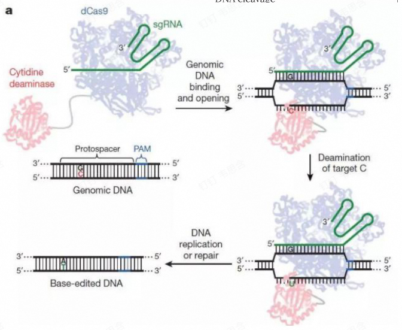
	- 作用机制
		- 胞嘧啶碱基编辑器通常由一个胞嘧啶脱氨酶、一个核酸酶失活的 Cas9 蛋白（dCas9）以及一些连接序列组成。
		-  ==dCas9 在向导 RNA（sgRNA）== 的引导下结合到目标 DNA 位点，将胞嘧啶脱氨酶带到特定的位置，胞嘧啶脱氨酶催化 DNA 上的胞嘧啶（C）脱氨基生成尿嘧啶（U）。[[Chapter1 基因组编辑的发现及应用]]
		- 在 DNA 复制过程中，U 会被识别为胸腺嘧啶（T），从而实现 C 到 T 的碱基转换（在互补链上则是 G 到 A 的转换），达到对 DNA 序列的精确编辑。
#### 2. Adenine Base Editors，ABE**腺嘌呤碱基编辑器**
- 作用机制：
	1. 腺嘌呤碱基编辑器的结构与胞嘧啶碱基编辑器类似，也是基于 dCas9 与特定的酶融合。
	2. 使用一种经过改造的腺嘌呤脱氨酶，该酶可以将 DNA 上的腺嘌呤（A）脱氨基转化为肌苷（I）
	3. 在 DNA 复制或修复过程中，I 会被识别为鸟嘌呤（G），最终实现AT碱基对至GC碱基对的直接替换。
#### 3. DNA存储
- 原理：将数字信息（如二进制数据）通过特定的编码方式转化为 DNA 的核苷酸序列。例如，将 0 和 1 分别对应不同的碱基组合，如 A 和 T 对应 0，C 和 G 对应 1，或者采用更复杂的编码方案，然后按照一定的顺序合成相应的 DNA 片段，从而将数字信息编码到 DNA 分子中。
- 优势：
	- 存储密度高：一个DNA分子可以保留一个物种的全部遗传信息
	- 稳定：120万年前的猛犸象遗传物质依旧可以被读出，说明DNA至少可以保留上百年的数据
	- 维护成本低：与传统的数据中心不同，它只需要保存在低温环境中
- 发展纪要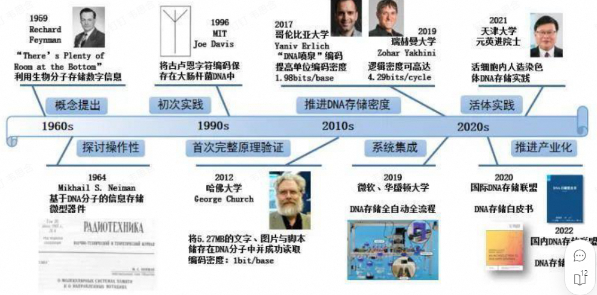
- 挑战：
	- 数据输入和读取效率低，耗时长、成本高
	- 操作过程需要液体试剂，难以从中间某处开始读取
	- 需要多领域研究团队共同攻关
- 战略意义：我国已经将“DNA 存储”写入国家“十四五”规划和 2035 年远景目标纲要中，将其作为与量子技术、神经计算等并列的前沿技术，并布局了“生物与信息融合( BT 与 IT 融合) ”重点专项。

## 五、实验方法
#### 1. 格里菲斯的肺炎双球菌转化
- 将DNA从一种细菌转移到另一种细菌，就可以在两者之间传递一种性状。
- 如果从致死性细菌中提取纯DNA，并将其加入到无害细菌中，那么无害细菌就会对小鼠变得具有致死性→致死性相关的遗传信息是由DNA携带的。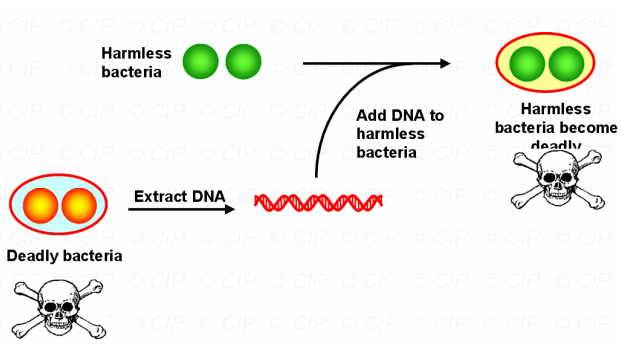
#### 2. 赫尔希和蔡森
- 噬菌体将一些物质注入细菌中，这些物质被用来制造新的病毒。
- 该实验表明，当噬菌体进行复制时，它们只需要将自身的DNA注入到宿主细胞中，而不会传递任何蛋白质。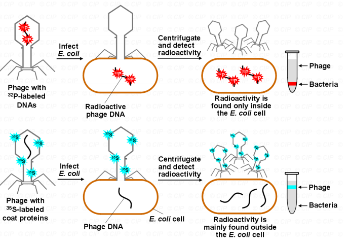
---------
1.  Many biologists theorize that in early life forms, there was very little DNA and protein. What molecule could have been present instead? Why is it good candidate for these functions?
2. Discovery of the structure of DNA by James Watson and Francis Crick is considered one of the most important discoveries in the history of biology. Why do you think this might be the case?
3. The concept of a ‘gene’ is not simple, and we have only just begun to discover what a gene is or can be. What is you current understanding of what a gene is?
4. Please describe briefly the mechanism of cytosine base editors and adenine base editors.
5. Please describe your understanding of DNA-based data storage.

-----

| words         | 意思  |
| ------------- | --- |
| bacteriophage | 噬菌体 |
| lethal        | 致死性 |
- References：
	- https://mp.weixin.qq.com/s/Hso4oJLt4sarNPZG8VpQKg