## 一、原核生物中DNA的复制
#### 1. 常用质粒载体
- 双复制起点*Oric*
	- 双重筛选标记
		- 有些时候会进行双抗筛选
	- 启动子、polyA尾
	- MCS(Multiple Cloning site)位点
		- 作为 DNA 载体且含有 ==多个限制内切酶识别位点== 
		- 可以让一段或多段DNA插入
	- ```3*flag```标签
		- 由一些特定的氨基酸按照特殊顺序排列组成的，即DYKDDDDK-DYKDDDDK-DYKDDDDK
		- 可以用来确定目标蛋白在细胞中的表达情况
		- 能够与Flag亲和树脂特异性结合，从蛋白质混合物中分离和纯化出来
#### 2. 复制方式
- 双向复制bidirectional replication
	- 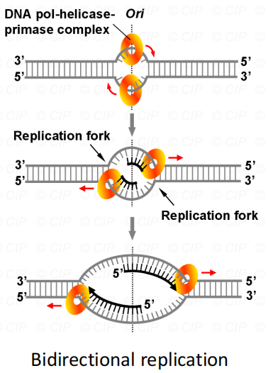
- 半不连续复制
	- 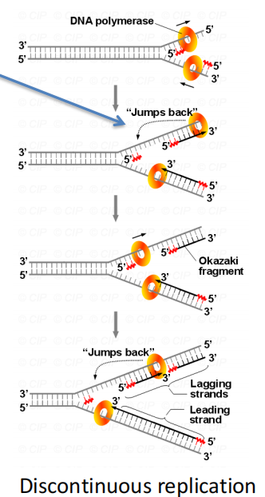
	- 复制叉后方的另一条模板链上，DNA聚合酶只能朝与复制叉移动方向相反的方向移动。随着复制叉不断打开，模板链上新暴露出来的位点将无法被复制。
	- 为了弥补这一点，DNA聚合酶会周期性地向后跳转，返回到复制叉的顶端。然后它继续朝其通常的方向移动，填补模板链上未被复制的部分。
- Semi-conservative replication半保留复制：在DNA复制过程中，新的双链有一条是新合成的链，另一条是旧链
#### 3. 与解链有关的酶和蛋白质：
- DnaA：
	- 在复制过程中，识别起点序列并且在起点特异位置解开双链并能募集其它必需因子的一种**蛋白质**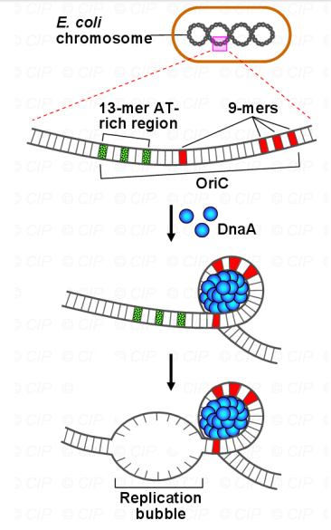
- 单链结合蛋白SSB
	- 为了防止解开的DNA双链重新合起来，需要有一些小蛋白结合在分开的双联是，防止它们相互吸引
	- 还能够防止DNA链被降解/破坏
- **解旋酶Helicase**：解旋酶是一类 ==解开氢键== 的酶，由水解ATP供给能量来解开DNA的酶。它们常常依赖于单链的存在，并能识别复制叉的单链结构。一般在DNA或RNA复制过程中起到催化双链DNA或RNA解旋的作用。
#### 4. 延伸Elongnation
1. DNA polymerase：
	- 功能：
		- 解开 ==氢键== ，由水解ATP提供能量来解开DNA
			- 其它解旋蛋白质：单链结合蛋白、解旋酶、拓扑异构酶Ⅰ、拓扑异构酶Ⅱ
			- 能识别复制叉的单链结构
	- 种类：
		- DNA polymerase Ⅰ
			- 5'-3'聚合酶：催化DNA链的延伸，填补DNA上的孔隙
			- 3'-5'外切酶：识别和切除3'端错误配对的核苷酸，**校对**作用
			- 5'-3'外切酶：切除5'引物或受伤DNA
		- DNA polymeraseⅡ：有5’—3’聚合酶活性中心和3’—5 ’外切酶活性中心，但没有5 ’—3’外切酶活性中心。不是很重要
		- DNA polymeraseⅢ( ==DNA复制的主要聚合酶== )
			- 具有校对功能
			- 核心酶Core Polymerase:α亚基负责核苷酸的聚合
			- 滑行夹Sliding Clamp:β亚基，是一种环状蛋白，包裹在DNA模板上，防止核心酶从模板上脱离
		- DNA polymeraseⅣ and Ⅴ：参与DNA的**修复**
2. 校读功能Proofreading：识别并纠正复制过程中引入的错误氨基酸
	1. - **3’→5’外切酶活性**：当DNA聚合酶检测到错误配对的核苷酸时，会使用其3’→5’外切酶活性切除错误的核苷酸，并重新合成正确的核苷酸。
	2. 校读功能将错误率降低到约1亿分之一，从而确保DNA复制的 ==高度准确性== 。
3. Primase引物酶/转录酶：RNA聚合酶的一种
	- **引物酶的作用**：DNA聚合酶无法从头开始合成DNA链， ==需要RNA引物提供3’-OH末端== 。
	- 引物通常是约10个核苷酸长的RNA片段，与DNA模板互补配对，为DNA聚合酶提供起始点。
	- **引物的移除和替换**：在复制完成后，RNA引物需要被移除并替换为DNA。**DNA聚合酶I**负责这一过程，通过其5’→3’外切酶活性降解RNA引物，并合成相应的DNA片段。
#### 5. DNA的拓扑结构Topology
- 拓扑结构：随着复制的进行，双链DNA不断被解开，特别是在大肠杆菌的环状染色体中，这会在复制叉前方产生高度的张力→形成超螺旋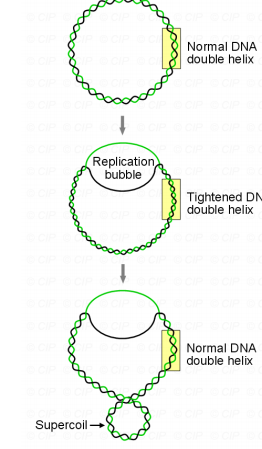
- DNA 拓扑异构酶(Topisomerase)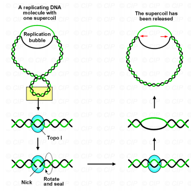
	- 拓扑异构体：具有不同螺旋数的同一DNA分子的两种异构体
	- 分类
		- Ⅰ型：酶与DNA结合 ==使双链解旋== ；使一条链切开，但酶与切口的两端结合阻止了螺旋的旋转；酶使另一条链经过缺口，然后再将两断端连接起来；酶从DNA上脱落，两条链复原，得到的DNA比原来少一个负超螺旋 #一些疑问 还是不太理解...
		- Ⅱ型：也称旋转酶，广泛存在于各种生物中。 ==使正超螺旋转化为负超螺旋== ，每次改变两个连接数
- 复制全过程：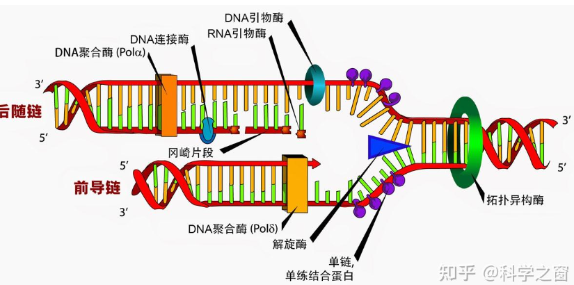
## 二、真核生物中DNA的复制
#### 1. 复制的挑战
- 基因组远大于原核生物，复制更加复杂
- 由于DNA和组蛋白结合，复制叉的移动速度慢了很多→可以在多个起点同时启动复制，并且有许多不同的DNA聚合酶
	- 复制叉：DNA 复制开始时，双链 DNA 在解旋酶（helicase）的作用下被解开，形成一个 Y 字形结构
#### 2. 复制的材料
- DNA聚合酶：含有五种不同的DNA聚合酶，其中最重要的两种是DNA聚合酶α和DNA聚合酶δ。
	- **自主复制序列（ARS）**：在酵母中，复制起点通常包含几个保守的序列，其中自主复制序列（ARS）尤为重要

#### 3. 复制的过程
- Cell cycle(细胞生物学中的重点) #学科链接 
	- 概念：细胞从一次分裂到完成下一次分裂的全过程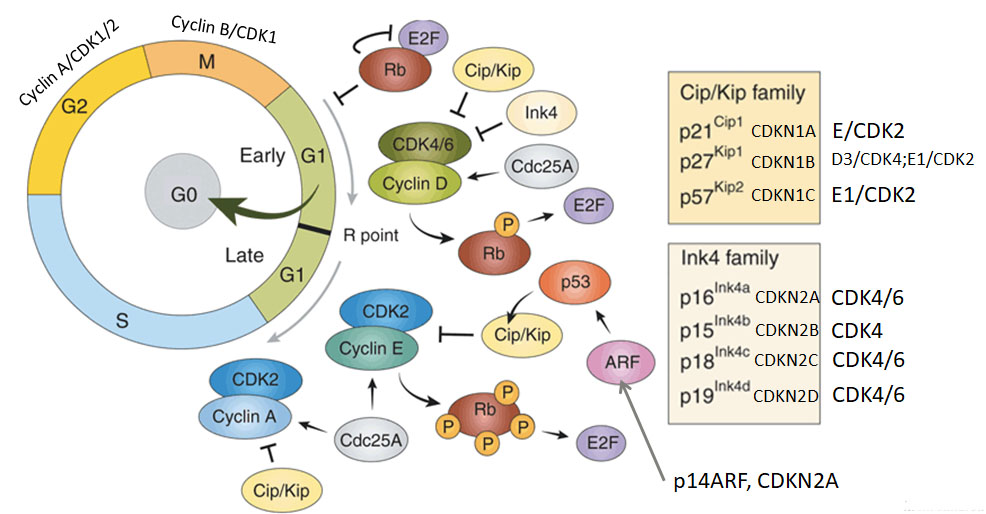
1. G0期：静止期，细胞暂时不进行分裂
2. G1期：为DNA复制作准备，G1早期 ==合成各种RNA、结构蛋白和酶等== ，细胞通过一个限制点(restriction point，R点)后在G1后期 ==合成DNA复制有关的蛋白和酶== 。在开始合成DNA之前有一个关卡(checkpoint)，检查染色体DNA是否有损伤，如有则先要进行修复。**细胞周期的长短主要取决于G1期**
	- 芽殖酵母细胞以出芽方式进行分裂，起始点位于G1后期，...，细胞核一分为二，细胞质不均等分裂
	- **预复制复合体（pre-RC）**：在G1期形成的蛋白质复合体，在S期激活，启动复制。 #一些疑问 真核生物的DNA聚合酶与原核生物有什么区别？ 
		- **起源识别复合体**（ORC）→第一个与DNA结合，识别复制起点
		- **Cdc6和Cdt1**：被ORC招募，进一步参与复合体组装
		- Mcm2-7：解旋酶复合体，被招募后负责解开DNA双链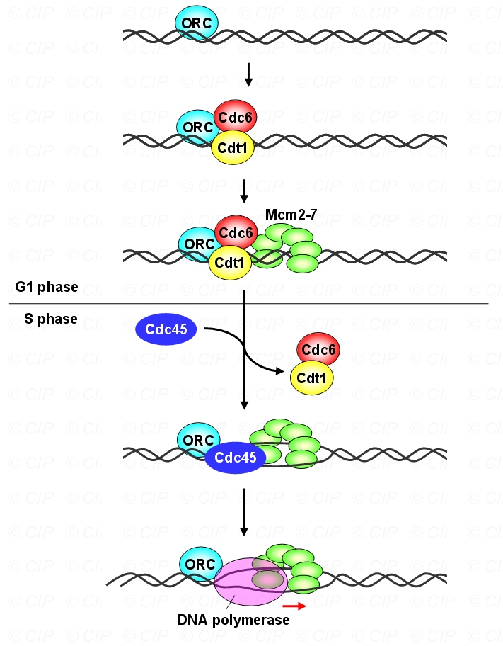 
3. S期：DNA合成时期， ==染色体加倍== 
	- Cdc45结合到pre-RC，激活Mcm2-7的解旋酶活性→形成复制叉
	- 前导链合成、后随链合成→与原核生物相似
4. 端粒的复制：详情在下方
5. G2期：细胞继续生长，并合成RNA、ATP、微管蛋白 #一些疑问 这是什么？
	- M:mitotic phase：分裂期
- 

## 三、端粒
#### 1. 功能
- 稳定染色体末端结构， ==保护染色体== 不被核酸酶降解
- 防止染色体间末端连接🔗
- 补偿滞后链5'端在消除RNA引物后的空缺
	- DNA聚合酶在复制线性DNA时只能沿5'→3'方向延伸，且需要RNA引物启动。当引物被移除后，末端的单链缺口无法填补，导致**每次复制后DNA链缩短**。
- 端粒是染色体末端的非编码重复序列（如人类中的TTAGGG重复），**作为“保护帽”被逐渐缩短**，避免重要基因的丢失
	- 哺乳动物：TTAGGG
	- 高等植物：TTTAGGG
	- 绿藻：TTTTAGGG
- 端粒 ==失调驱动各种细胞衰老== 的标志
	- 基因组不稳定性/表观遗传紊乱/蛋白稳态失衡
	- 
#### 2. 端粒结合蛋白telomere binding protein #课后拓展 
1. 召集端粒酶到结合端粒的位置(Bind dsDNA)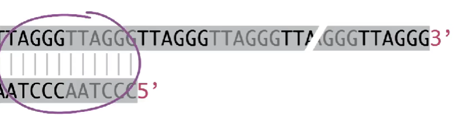
2. 负向调节端粒酶功能：微弱或强烈抑制端粒酶活性，从而控制端粒长度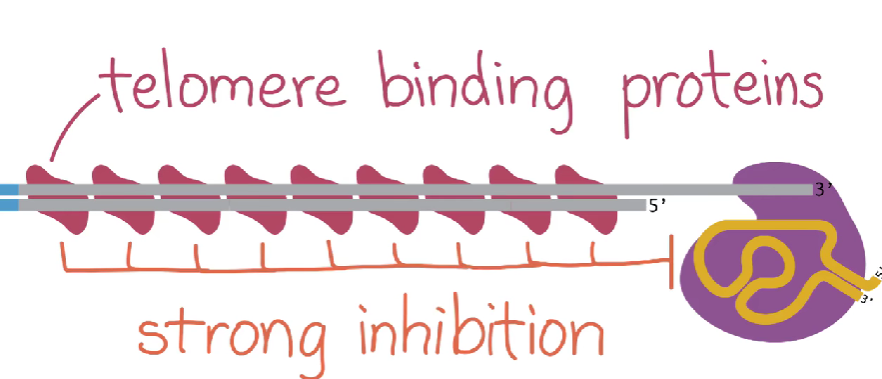
3. 保护DNA/染色体末端，**形成t-loop**，防止被识别成DNA的末端                           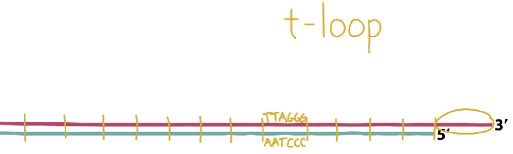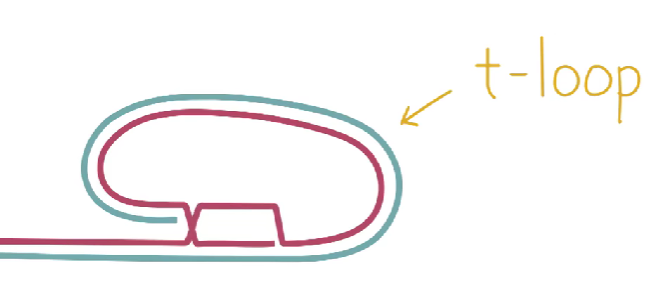
#### 3.端粒酶Telomeres
- 概念：由RNA和蛋白质组成。属于**逆转录酶**，以自身RNA为模板， ==合成端粒DNA，使细胞获得无限增殖== 
	- 在正常细胞中，端粒酶活性通常受到抑制，端粒长度随细胞分裂逐渐缩短，最终细胞不再分裂而死亡
	- 生殖细胞中端粒酶活性高，确保配子端粒长度，支持多细胞生物复杂生命周期的延续
	- 在没有端粒酶活性的细胞中：**大量端粒重复、折叠并且有蛋白保护**
	-  ==端粒酶活性的高表达与癌细胞的永生密切相关== 
		- 将活化的端粒酶导入正常人的人成纤维细胞并使其表达，寿命可以提高
- 研究历史：
	1. 1938-1940芭芭拉发现染色体末端存在独特结构
	2. 1971-1972 推测每次细胞分裂中落后的染色体末端会发生丢失
	3. 2009年Nobel Prize
- 检测方法：端粒酶蛋白催化亚基（**8TERT或TRT**）具有反转录酶的主要特征，其表达在正常细胞中受到抑制，研究表明，TERT或TRT的表达与端粒酶活性的表达一致，与端粒酶的活化程度密切相关
- 复制过程：以RNA为模板延⻓⺟链。⽽后引物酶合成引物，复制新链末端序列。通常末端重复成百上千次(由酶的活性决定，可以看PPT图)，可能发生在S期的末期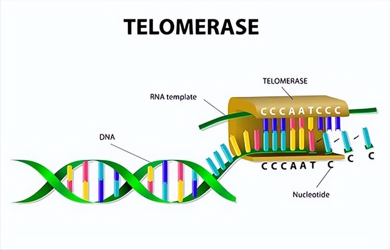
- 与DNApolymerase的不同:以及端粒酶通常没有校对功能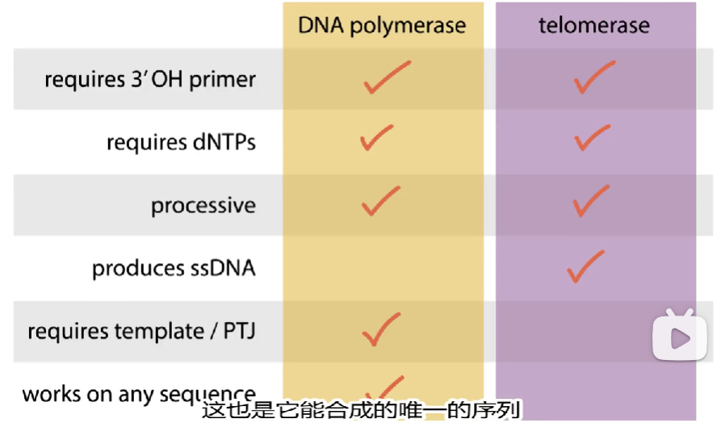

## 四、蛋白质定向进化
- 定向进化：在待改造酶的基因中引入 ==随机突变== →突变基因导入细菌细胞，表达酶蛋白→检测酶功能(看催化效率)→在被选基因中引入新的突变，进行下一轮循环 #名词解释 
- 理性设计
	- 更高效、更快捷
	- 方法：基于实验结果的设计、计算机辅助设计→AlphaFold
----------

1. What are some of constraints that make DNA replication so complicated?
2. What are problems that eukaryotic cells face during DNA replication that prokaryotes do not have to deal with?
3. Are lagging strands really synthesized more slowly than leading strands? Why or why not?
4. How the telomerase works to maintain the integrity of DNA telomere in eukaryotic cells.
5. What are the methods to optimize an enzyme?
6. How is the technology of AlphaFold applied in crop science?
-------------

| words       | 中文意思          |
| ----------- | ------------- |
| mer         | 单体单元，相当于nt或bp |
| prokaryotes | 原核生物          |
| ssDNA       | 单链DNA         |
| dsDNA       | 双链DNA         |

-----
- References:
- [分子生物学 | DNA的复制与修复 笔记整理 - 简书](https://www.jianshu.com/p/79f5f0e324ba)
- [DNA开解马达：拓扑异构酶 - 知乎](https://zhuanlan.zhihu.com/p/391042139)
- [Telomere and Telomerase Biology - ScienceDirect](https://www.sciencedirect.com/science/article/pii/B9780123978981000013?via%3Dihub)
- [端粒和端粒酶（自制小动画~）_哔哩哔哩_bilibili](https://www.bilibili.com/video/BV1rs41157ni/?spm_id_from=333.337.search-card.all.click&vd_source=cbeeb9b4a81ed17f43f1d0be32a9f270)
- [DNA的复制（详细讲解）_哔哩哔哩_bilibili](https://www.bilibili.com/video/BV1tc41157TW/?spm_id_from=333.337.search-card.all.click&vd_source=cbeeb9b4a81ed17f43f1d0be32a9f270)
- [9.5 Telomeres_哔哩哔哩_bilibili](https://www.bilibili.com/video/BV1Kt4y1k7Aw?spm_id_from=333.788.videopod.episodes&vd_source=cbeeb9b4a81ed17f43f1d0be32a9f270&p=62)