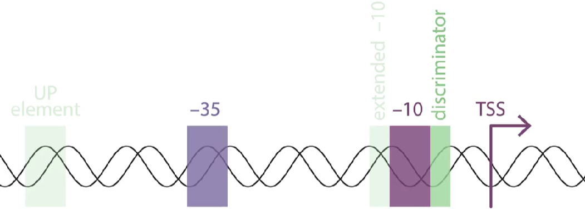
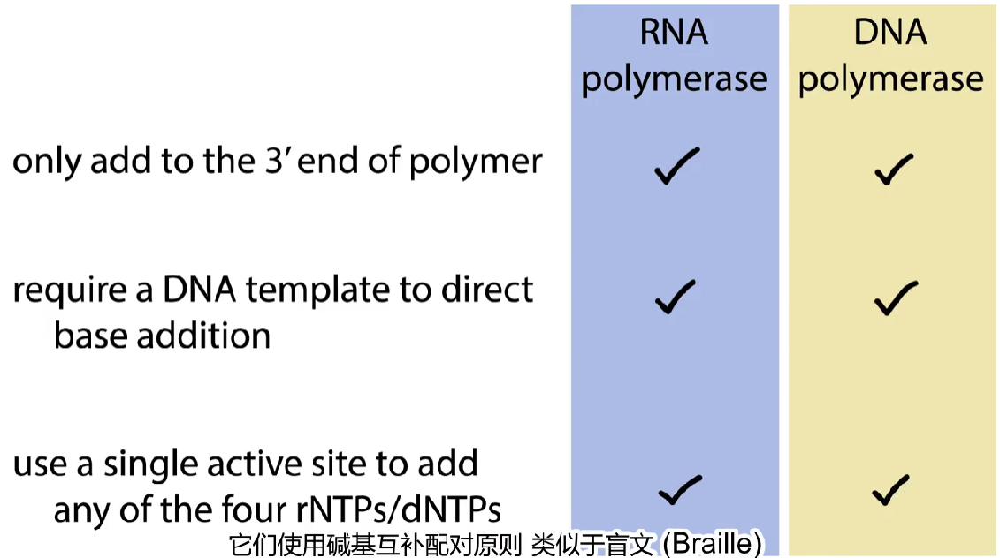
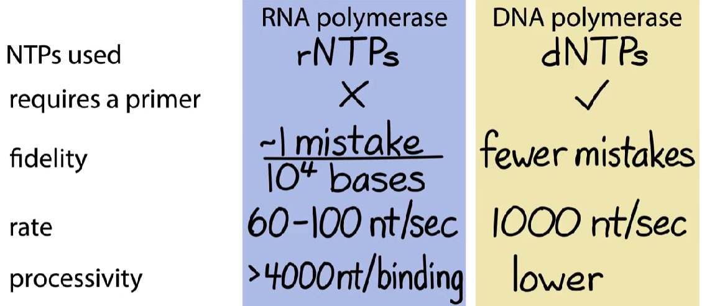
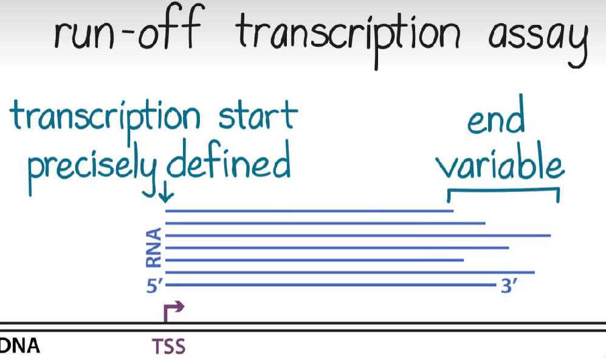
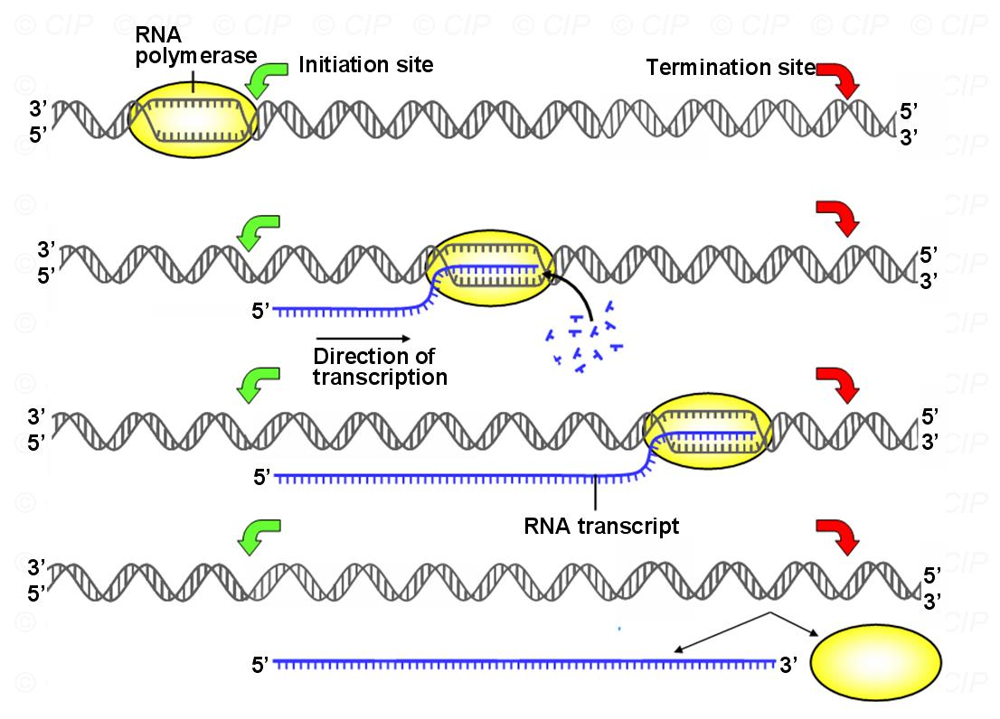
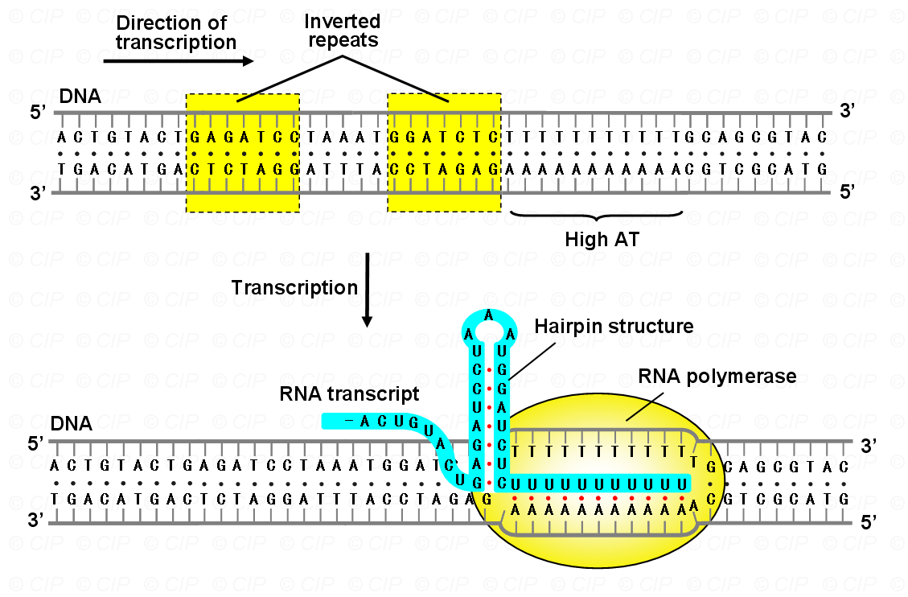
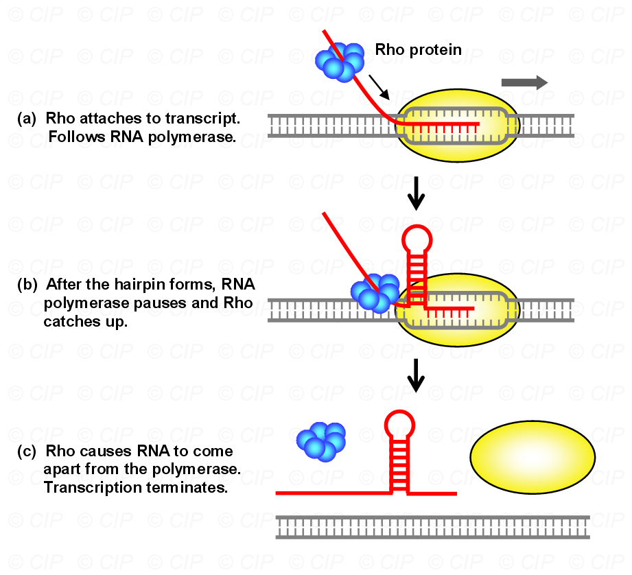
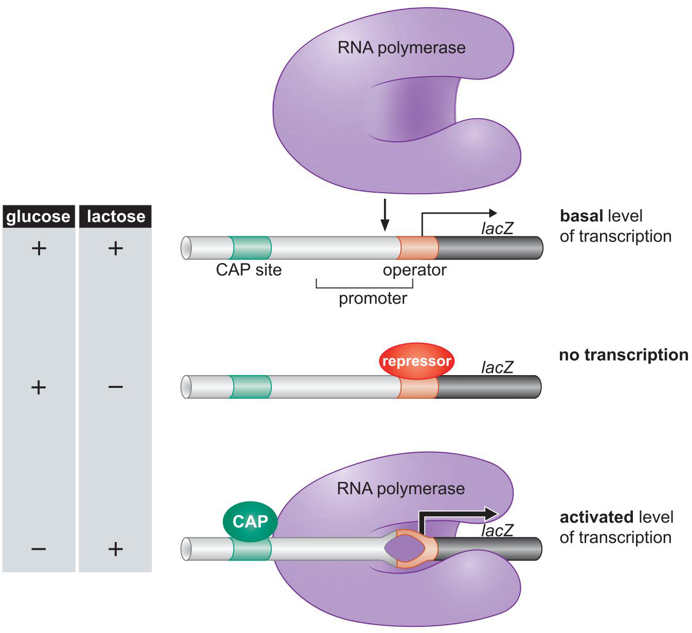
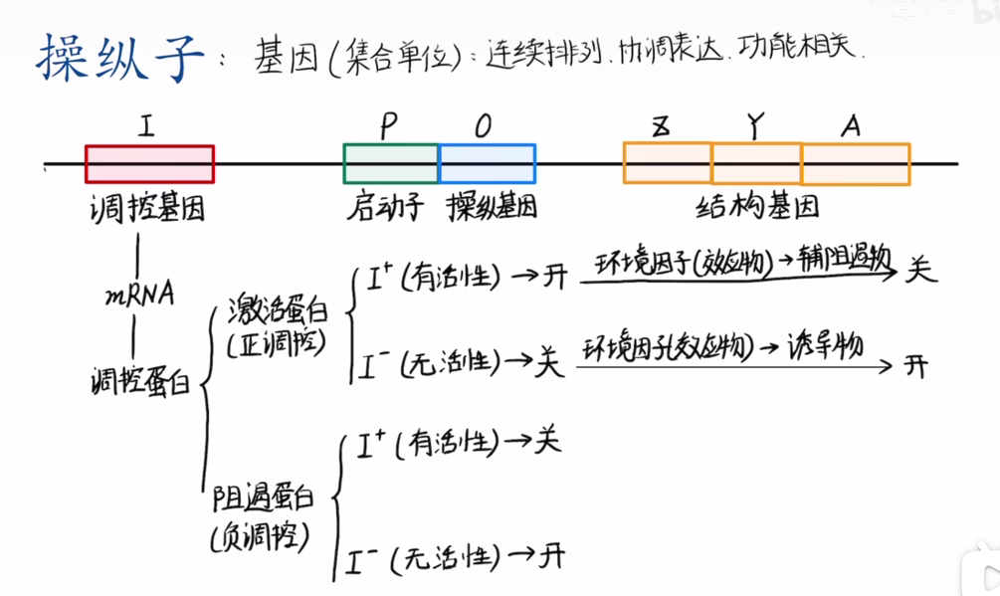
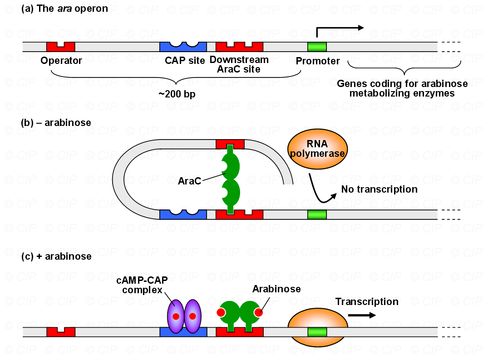

- RNA如何特异性识别基因?
- 一个基因应该以什么频率进行转录
- 与真核生物的区别？
---
## 一、Why use an RNA intermediate?
#### 1. 使用RNA的原因： #重点 
- 染色体结构大且复杂，直接在DNA上读取序列会太困难且在这个过程中会导致损坏(因为不断打开关闭)；
- 核糖体在细胞核中工作很困难；
- 蛋白质进出核糖体困难→需要一个中间体
- RNA的不稳定性使得细胞可以灵活调整转录程序，保证生物多样性，增加复杂性
- 2023年诺贝尔奖：mRNA疫苗[浅谈mRNA疫苗及其作用原理【2/2】 - 知乎](https://zhuanlan.zhihu.com/p/410785056)
#### 2. 转录的原理
- RNA能够从DNA的碱基上合成
- DNA和RNA在化学成分、结构上都十分相似

## 二、转录过程
#### 1. 启动initiation
- Promoter：基因上游的一段 ==DNA序列== ，标记基因的起始位置。E. coli的启动子包含两个主要元件：-10框（如TATAAA）和-35框。
	- Consistence：
		- 所有启动子均有的元件
			- 10 element→所有启动子都有
			- Transcription Start Site(TSS)→所有启动子都有
		- 常见的元件
			- -35 element
			- -35 to -10 →取决于σ因子，长度并不一定是25bp，是因为-35区的位置会有所不同
		- 不太常见的元件 #课后拓展 
			- upstream element
			- extended -10 element
				- 经常存在于没有-35区的启动子中
			- Discrimination element鉴别子→总是位于-10区的下游
			- Downstream element（真核生物中），同样构成蛋白质结合的区域
- RNA Polymerase：有三个核心亚基，其中 ==σ亚基== 负责识别启动子，启动转录后σ亚基通常会脱离。
	- **RNA polymerase holoenzyme**:RNA聚合酶全酶→σ亚基与核心聚合酶结合
	- Requirements:
		- ds DNA template双链DNA模板
		- transcription bubble 转录泡→模板链与非模板链，模板链指导rNTP的结合
	- Diffrences  
- 转录的检测方法Assays #课后拓展 
	- 使用标记的rUTP标记反应
	- 把RNA从rNTP中分离出来
		- 滤纸结合分析法→小核苷酸结合滤纸不如长RNA牢固
		- 核酸电泳：但 ==必须要注意RNA自身的折叠== ，通常要使用变性剂→几百核苷酸用琼脂糖胶；几百到几千用丙烯酰胺
		- 转录的起始点精确，但终止点很不准确→失控转录分析，在起始位点下游剪切，但只能在体外进行
- 第一个被转录的碱基标记为 ==+1==  #易混淆
1. 闭合启动子复合物：RNA聚合酶全酶结合到双链DNA的启动子区域，但此时DNA双链尚未分开。
2. **开放启动子复合物**：RNA聚合酶局部解开DNA双链，形成一个称为**转录泡**（transcription bubble）的区域，允许RNA聚合酶接触到单链DNA模板→每次暴露10-20bp
3. 启动子清除：RNA聚合酶开始合成RNA链，并逐渐脱离启动子区域
#### 2. 延伸Elongation

-  RNA聚合酶和转录泡继续往下走
- 校对机制：
	- RNA聚合酶在延伸过程中可能会发生错配，但RNA的短寿命使得错误影响较小
#### 3. 终止Termination
- 固有终止：依赖DNA序列中的特定结构，无需额外的蛋白质
	- 终止序列：包含一个**发夹结构**（hairpin loop）和一串连续的A碱基。
	- 当RNA聚合酶转录到发夹结构时， ==RNA-DNA杂交体变得不稳定，RNA链从DNA模板上脱离== 
	- 连续的A-U配对进一步削弱了RNA-DNA杂交体，使其更容易分离。
- ρ依赖终止：需要一种称为ρ因子（Rho factor）的蛋白质
	- ρ因子结合到正在生长的RNA链上，并追踪RNA聚合酶。
	- 当发夹结构形成后，ρ因子与RNA聚合酶相遇，促使RNA链从DNA模板上脱离 #一些疑问 这个作用机制是什么？
		- ρ因子能够识别RNA上的特定序列（通常是一个富含GC的区域），并结合到RNA上
		- ρ因子追上RNA聚合酶时，它会改变RNA聚合酶的构象，使其停止转录。
---

## 三、原核生物的基因表达调控 #重点 
#### 1. 相关概念
- 操纵子：一组功能相关的基因（包括启动子、操纵基因等）
- RNA聚合酶一次性转录操纵子中的所有基因，生成一个多顺反子mRNA（polycistronic mRNA）。
	- 顺反子:遗传功能单位， ==一个顺反子决定一条多肽链== ，把基因具体化为DNA分子的一段序列
	- 顺式作用元件(cis-acting element) #考过 ：DNA上的一段顺序，能够调控基因的表达
		- #一些疑问 与内含子有什么区别？→顺式作用元件调控基因表达，而内含子属于基因结构的一部分
	- 反式作用元件:编码调节蛋白的基因称调节基因（regulator genes）。调节蛋白可调节其它基因的表达。由于调节基因的产物可以自由地结合到其相应的靶上，因此被为反式作用因子（trans-acting factor）。
#### 2.乳糖操纵子lac Operon

- 负调控：
	- 当乳糖不存在时，lac阻遏蛋白（repressor）结合到lac操纵子→阻止转录；
		- 如果细胞中即使没有乳糖，仍然转录 β - 半乳糖苷酶，很可能是因为 lac 阻遏蛋白基因发生突变，导致阻遏蛋白失去功能或者无法正常结合到 lac 操纵子上，使得 lac 操纵子一直处于开放状态，允许基因转录。
	- 当乳糖存在时，乳糖作为诱导物（inducer）与阻遏蛋白结合→使其失去结合能力，允许转录→可以类比铁蛋白和运铁蛋白[[Chapter9  真核生物基因表达调控]]
- **正调控**：当葡萄糖水平低时→细胞需要其它碳源(乳糖)来提供能量→胞内 cAMP 水平升高→cAMP 与 CAP 结合后，CAP 发生构象变化，使其能够特异性地结合到 lac 操纵子上游的 CAP 位点上→促进RNA聚合酶的结合，激活转录。

#### 3. 色氨酸操纵子Trp Operon
- [原核生物 | 色氨酸操纵子 - 知乎](https://zhuanlan.zhihu.com/p/650501333)

- **负调控：**
    - 当色氨酸水平高时，色氨酸与阻遏蛋白结合，使其能够结合到操纵基因，阻止转录。
- **衰减机制（Attenuation）：**
    - 当色氨酸水平高时，核糖体快速翻译前导区，形成终止信号(发夹结构)→导致转录提前终止。
    - 细胞内色氨酸水平低时→核糖体在翻译 leader 区域的 mRNA 时会因为缺乏色氨酸而 ==翻译速度减慢== →mRNA 的转录过程可以继续进行， ==不会形成终止发夹环结构== →允许 trp 操纵子中的结构基因被转录，合成色氨酸合成相关的酶，以补充细胞内色氨酸的不足
#### 3.阿拉伯糖操纵子Ara Operon

----
1. Why do you think the cell transcribes DNA into RNA, instead of transcribing DNA into DNA?
2. Do you think that every genes is transcribed in same way? What are some of the things you expect might control how strongly each gene is transcribed?
3. What are the main differences in the function of the repressor protein in the trp operon vs. the lac operon?
4. What are the advantages to organizing genes in operons? What might be some disadvantages?
5. Please describe the biologic mechanisms to maintain the telomere in eukaryotic cell?
6. Please describe the tryptophan operon and its working mechanism？

-----------
- References：
	- [MIT Molecular Biology 笔记6 转录的调控 - iojafekniewg - 博客园](https://www.cnblogs.com/hukimwon/p/9800755.html)

| Words    | 中文释义 |
| -------- | ---- |
| upstream | 基因上游 |
