## 一、相关概念
- 真核生物比原核生物有更多的基因，转录过程也更加复杂
- 真核生物的转录依赖于RNA聚合酶和称为转录因子的蛋白质，这些转录因子可以分为两大类：
	- **通用转录因子**：所有基因转录所必需的转录因子；
	- **特异性转录因子**：能够增加或减少特定基因转录速率的蛋白质。它们为真核细胞提供了对转录的非常精细的控制。
- 真核生物的核小体往往会阻止DNA的作用
	- 解决方法：激活剂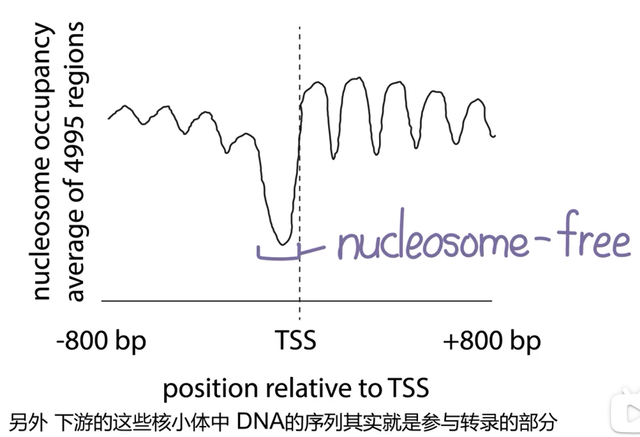
- **hnRNAs(heterogeneous nuclear RNA)不均一核RNA**：存在于真核生物细胞核中的不稳定、大小不均的一组高分子RNA（沉降系数约为30-100S）总称。
	- 大多属于pre-mRNA，在受到加工以后移至细胞质作为mRNA发挥功能
	- mRNA数量最少，寿命最短，但种类最多
- snRNA(small nuclearRNA):真核生物转录后加工过程中RNA剪接体（spliceosome）的主要成分， ==参与mRNA前体的加工过程。==  [[Chapter7 真核生物mRNA的修饰]]
	- 只存在于细胞核中，除U5外都由RNA聚合酶Ⅱ催化转录
	- 3’末端有自身抗体识别的Sm抗原结合的保守序列 #一些疑问 如何理解？
	- snRNA可以结合蛋白→snRNP
- 真核生物是否通过色氨酸操纵子的形式调控？
	- 由于色氨酸操纵子的机理是，原核生物能够边转录边翻译，当合成的Trp过量时，就能够提前终止转录来调节表达效果
----
## 二、相关元件
#### 1. RNA Polymorase
- 在大肠杆菌中，所有的转录过程都由一种RNA聚合酶完成；而真核生物使用三种不同的RNA聚合酶，分别转录不同的基因
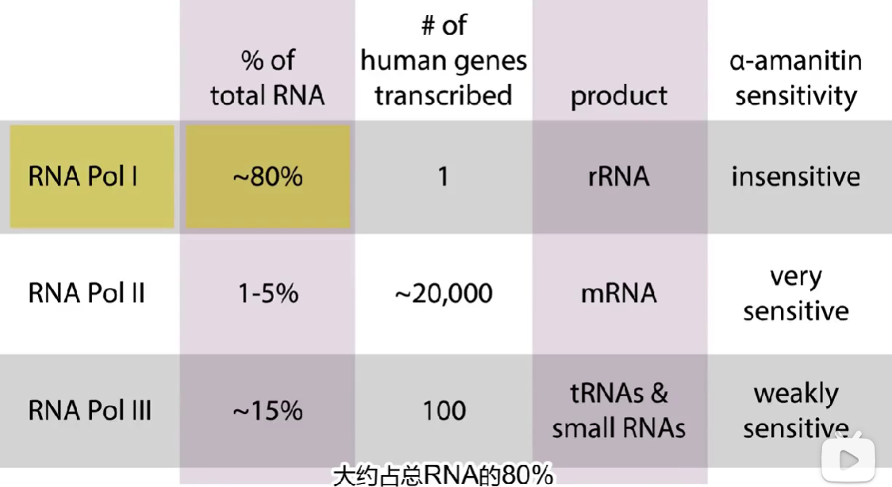
- PolyⅠ
	- 只转录一个基因，但是很关键， ==是rRNA的基因，位于核仁== 
		- 对某种环肽(α- 鹅膏蕈碱)的敏感程度不同
		- 产物是5.8S、18S和28SrRNA的前体
	- 原核生物中由σ因子与promoter结合，但在真核生物中光是PolyⅠ就有许多因子结合
- PolyⅡ
	- 作用原理几乎相同，都有类似龙虾钳的区域来把DNA打开。由12个亚基组成，称为Rpb1-12。
		- 蟹钳状结构内部的空间可以容纳双链 DNA 分子。在转录过程中，“钳子” 会闭合，以此来稳定 DNA 与新聚合形成的 RNA 之间的结合。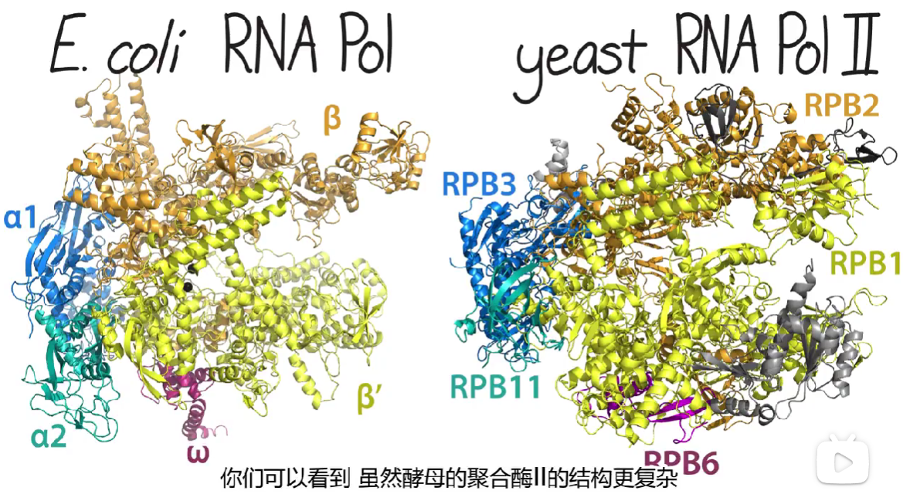
	- 位于核质，产物是不均一核RNA(hnRNAs)和大部分小核RNA(snRNA)
- PolyⅢ
	- 位于核质
	- 产物是5SrRNA和4.5SrRNA的前体 #一些疑问 这些rRNA都拿来干啥？
	-  Q：原核生物靠什么合成rRNA？
		- rRNA基因通常位于操纵子中，这些操纵子包含多个rRNA基因（如16S、23S和5S rRNA）
		-  ==RNA聚合酶全酶识别这些操纵子的启动子区域== →区别于转录的过程，并启动转录过程→转录出的rRNA前体（pre-rRNA）随后经过加工（如剪切、修饰等）形成成熟的rRNA分子。
#### 2. Promoters
- Consistence：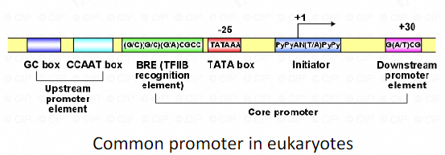
	- TATA box：
		- 位于转录起始位点上游约-25处
		- 序列为TATAAA
		- 真核生物中广泛存在，常常存在于管家基因中→但是并不一定都需要 #易混淆 
	- Upstream promoter element
		- UBF：上游结合因子→与PolyⅠ有关，参与rRNA的转录；如果它缺失则会导致rRNA的缺失
	- Downstream promoter element(DPE):下游启动子原件
	- 起始子initiator region, Inr：
		- 在哺乳动物中，其序列为 PyPyAN (T/A) PyPy 。 （注：Py 代表嘧啶核苷酸 ）
		- 起始子本身可以驱动基础转录，但其功能会因其他启动子元件的存在而大大增强。
		- 与 TATA 盒类似，起始子元件有助于转录因子 II D（TAF）的结合。 ==TATA 盒和起始子通常是相互排斥的== 。
			- 空间位阻：当 TBP 等蛋白结合到 TATA 盒后，可能会在空间上阻碍转录因子与 Inr 的结合
			- 功能不同：Inr更多地出现在一些组织特异性表达基因或受环境因素诱导表达的基因中
			- 转录因子竞争与协同
#### 3. General Transcription factors→联系基因组学 #学科链接 
In eukaryotes, recognizing promoters & initiating transcription  ==requires at least six proteins==  in addition to RNA polymerase II.普遍转录因子：它们与RNA聚合酶Ⅱ共同组成转录起始复合体时，转录才能在正确的位置开始。
- These proteins are **general transcription factors**, TF II A, B, D, E, F, & H
##### ①Class Ⅱ genes
- In eukaryotes, recognizing promoters & initiating transcription  ==requires at least six proteins==  in addition to RNA polymerase II.普遍转录因子：它们与RNA聚合酶Ⅱ共同组成转录起始复合体时，转录才能在正确的位置开始。
- These proteins are **general transcription factors**, TF II A, B, D, E, F, & H
1. **TF Ⅱ D**：由8-10个亚基组成		
	- first TF to bind promoter
	- 其中的一个亚基called **TATA-binding protein (TBP)** that binds to TATA box.
		- 当 TBP 结合到 DNA 的小沟（minor groove）中的 TATA 盒→(T与A之间的结合力比较弱)时，DNA双链分离，从而暴露出单链模板用于转录
		- TBP对于所有Ⅱ类基因转录都是必需的，即便没有TATA盒
	- 其它亚基统称为TBP相关因子(**TAF Ⅱ**)
		- 可以结合除了TATA盒以外的核心启动子元件(DPE/I)以促进转录
		- 可以在大多数真核细胞中发现，氨基酸序列具有 ==高度保守性== 
2. TF Ⅱ B：作为TF Ⅱ D和PolyⅡ之间的桥梁
3.  TF II H participates in opening DNA helix to allow transcription.
##### ②Class Ⅰ genes：General transcription factors for RNA polymerase I & III
Although still more complicated than prokaryotic initiation, transcription initiation for class I genes is much simpler than for class II genes.
- 只需要两种通用转录因子，即SL1（有时也称为TIF-IB）和UBF（有时也称为UAF）。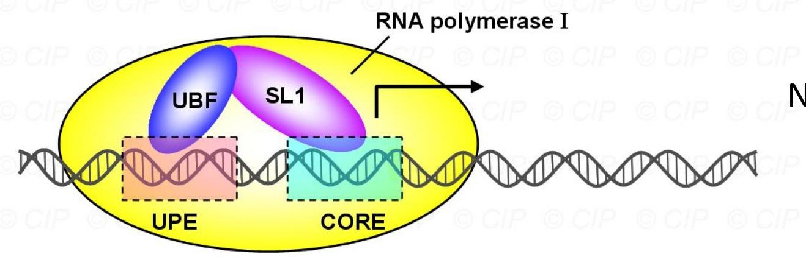
	- SL1 binds to core element & helps  ==recruit RNA polymerase I to promoter.== 
	- UBF binds to upstream promoter element to  ==help SL1 to bind to core element== 
##### ③class III genes
- 合成tRNA的基因的启动子有两个元件boxA和boxB，都处于转录起始位点的下游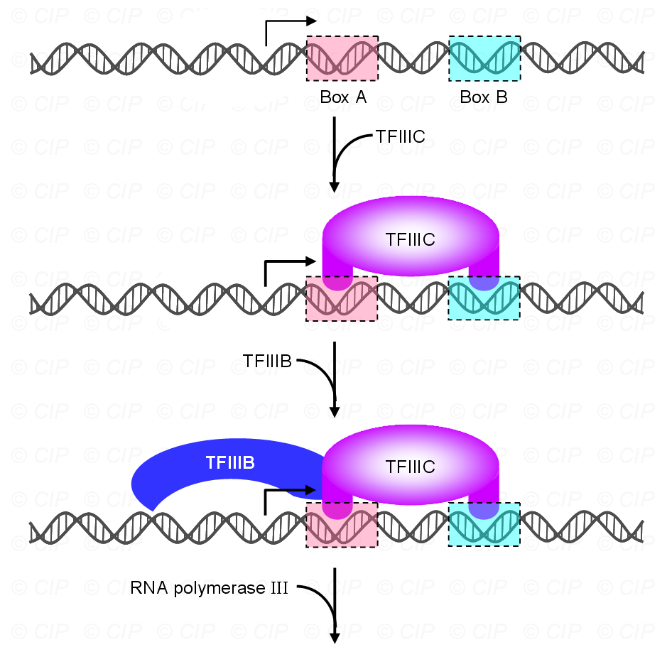
- TF ⅢC 与这些元件结合，并且在TBP的帮助下，帮助其它的转录因子与DNA结合
#### 4.组织细胞特异性转录因子

- 概念在特异的组织细胞或是受到一些类固醇激素\生樟因子或其它刺激后，开始表达某些特异蛋白质分子时，才需要的一类转录因子→用于调节转录速率(可以类比大肠杆菌中利用乳糖等转录不同基因)
1. **激活子Activators**：属于蛋白质
	1. 作用的最基本方式是增强通用转录因子、RNA 聚合酶 II 与启动子之间的结合(可以结合多个蛋白质)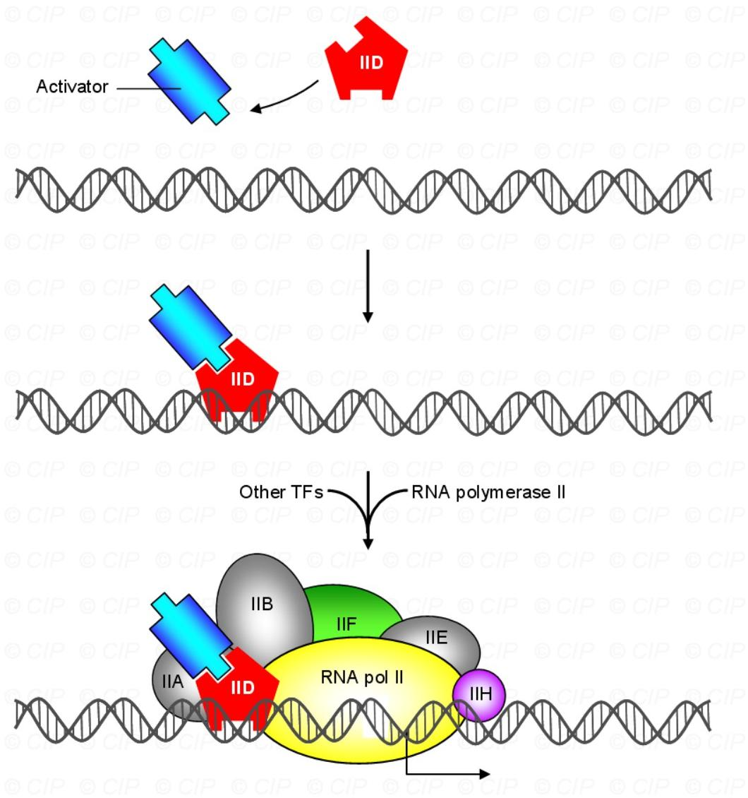
		- 这种机制 ==与大肠杆菌中CAP蛋白的机制有些相似== ，CAP蛋白可吸引RNA聚合酶全酶来激活乳糖操纵子 #待解决 
	2. 招募能使与 DNA 结合的组蛋白脱离的酶，或者改变组蛋白， ==使其与 DNA 的结合不那么紧密== 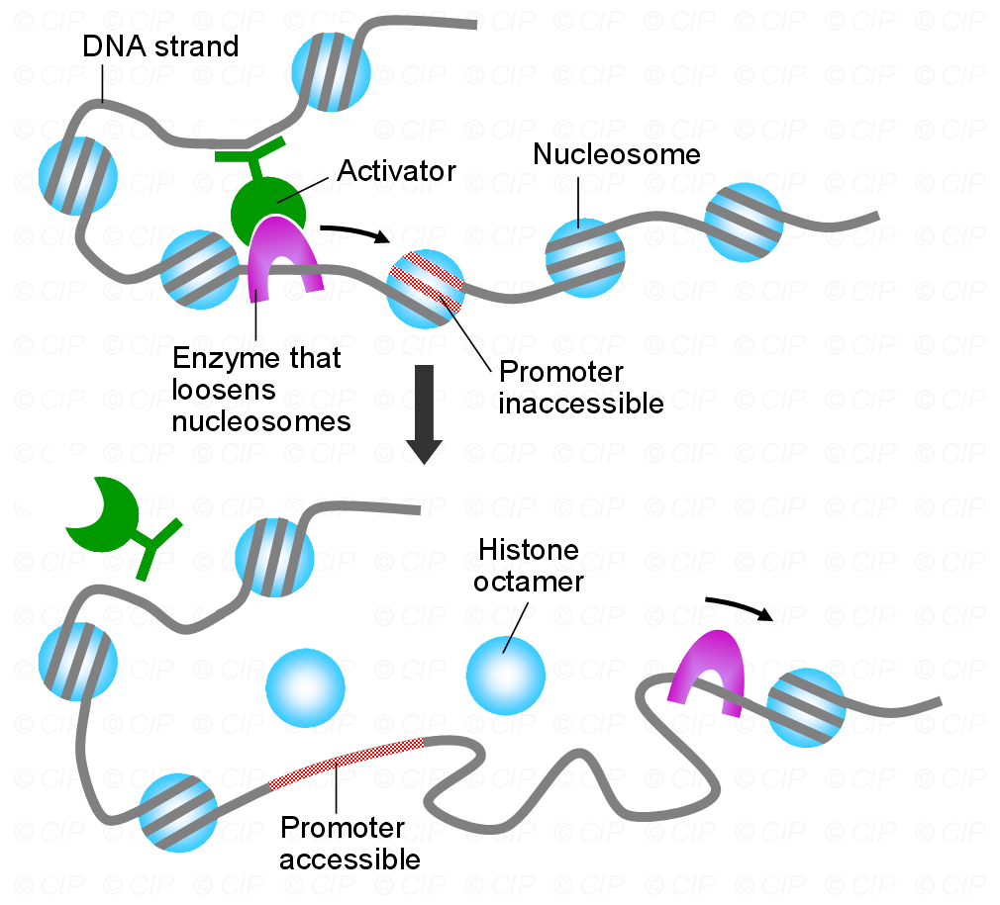
	3. 可以与增强子结合
2. **抑制子Repressors**：属于蛋白质
	1. 把激活子锁上
	2. 直接与DNA结合，阻止通用转录因子与启动子结合
	3. 招募能使蛋白质周围的 DNA 缠绕得更紧密的酶来发挥作用，使得启动子和其他重要区域无法进行转录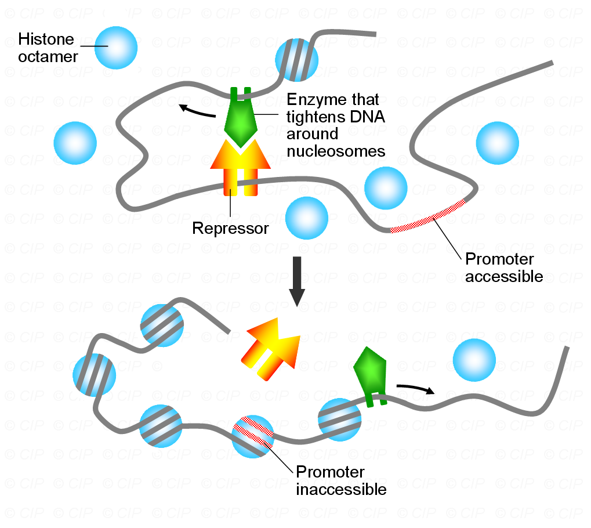
3.  **增强子Enhancers/隐含子Silencers** #考过 
	- 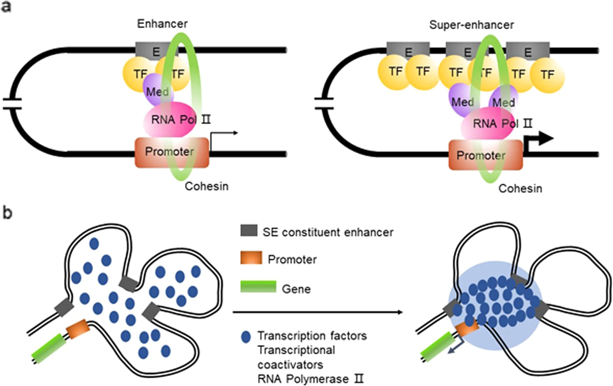
	- DNA上一段可以与蛋白质结合的区域( ==本质是DNA==  #重点 )，处于染色体疏松的区域，**与蛋白质结合以后，基因的转录增强**，可能位于基因上游，也可能位于下游
	- 特点：
		- 远距离效应：不一定接近所要作用的基因，甚至不一定与基因位于同一染色体。
		- 无方向性：无论位于靶基因的上游、下游或者内部都可以发挥增强转录的作
		- 顺式调节：它自身是DNA，调控的对象也是DNA
		- 处于染色体疏松的区域，活性与组蛋白H3K4的甲基化和H3K27ac有关
		- 无物种与基因特异性，有组织特异性
		- 有相位性：作用与DNA构象有关
		- 可以在异源物种上发生作用
	- **超级增强子(SE)**: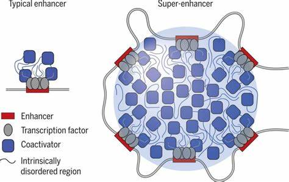
		- 隐含子聚集在一起，密度很高让DNA的转录变得非常强→癌细胞
		- 调控的水平非常高
		- 组成超级增强子的单个增强子也可以激活基因转录
		- 活性对转录因子的阻断更敏感
#### 5. DNA识别基序
- 概念：转录因子识别特定的基序后才能够与DNA序列结合
- DNA-binding motifs in prokaryotes
	- Homeodomain:同源异型结构域由同源框编码的60个氨基酸序列组成，被称为同源异型结构域｡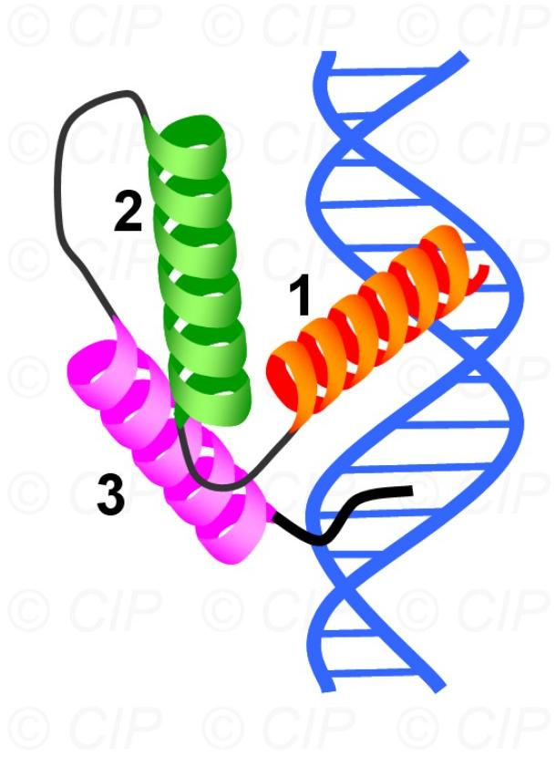
- DNA-binding motifs in eukaryotes
	- **zinc fingers**:
		- 手指状的结构能够很容易地插入到（DNA 的）大沟中，使得 α 螺旋能够与碱基进行特异性的接触。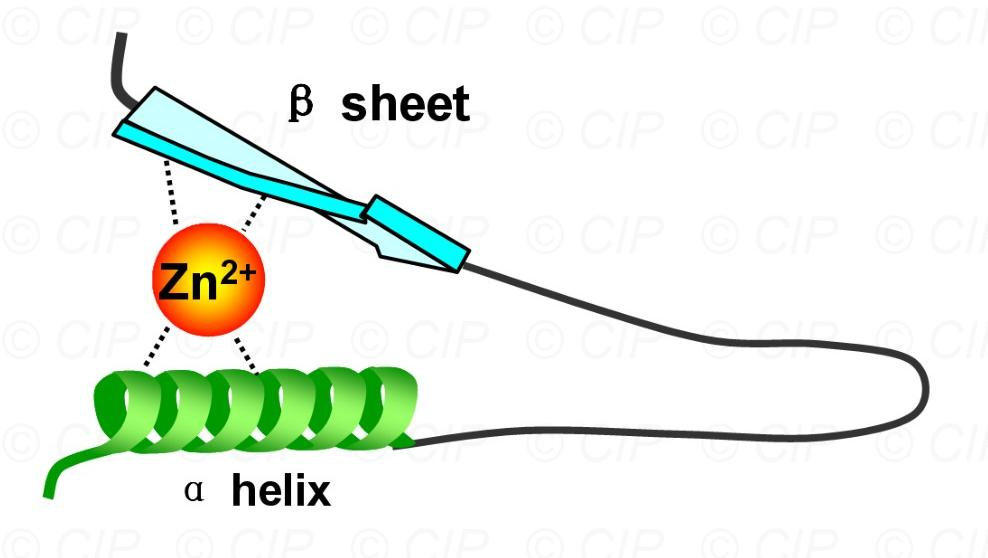
		- DNA 结合结构域通常有几个彼此相邻的锌指基序，每个锌指基序识别一段靶 DNA 序列。需要注意的是，锌指是一类多样的基序，并非所有锌指在结构上都相似。
	- **Leucine zipper亮氨酸拉链**：可以由两种不同的蛋白质组成，这被称为 ==异源二聚化== 。与仅由一种蛋白质形成的亮氨酸拉链相比，异源二聚体能够识别不同的 DNA 序列。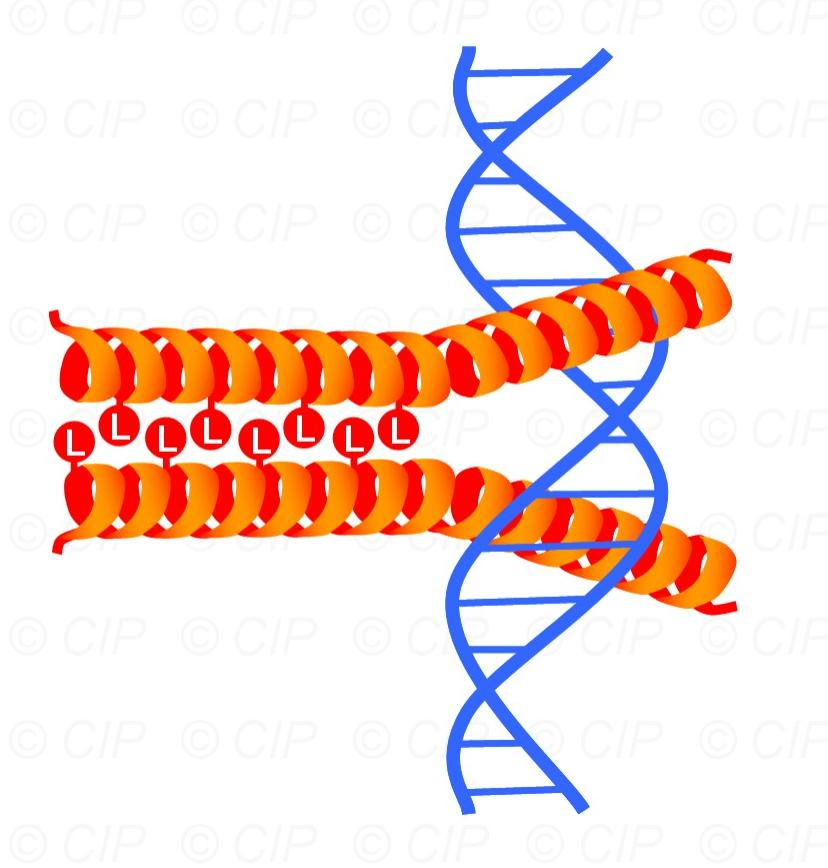
----
## 三、转录过程梳理[[Chapter4 原核生物的转录Txn]] #待解决 
#### 1. Initiation：多个通用转录因子和RNA聚合酶II。
1. **TFIID**：首先结合到启动子的TATA框，由TBP（TATA结合蛋白）和TAFIIs（TBP相关因子）组成。
2. **TFIIA和TFIIB加入**：TFIIA和TFIIB依次结合，稳定复合体并帮助RNA聚合酶II的结合。
3. **RNA聚合酶II结合**：RNA聚合酶II（Pol II）结合到复合体。
4.  **TFIIF**：结合RNA聚合酶II，帮助其稳定在启动子上。
5. **TFIIH**：具有ATP酶活性→利用ATP水解的能量，负责解开DNA双链，形成转录泡。
#### 2. Elongation
 - RNA链的合成：RNA聚合酶II沿着DNA模板链移动，逐个添加核糖核苷酸（ribonucleotide），RNA聚合酶II通过互补配对（A与U，G与C）将核糖核苷酸连接到RNA链上。
- RNA聚合酶II具有一定的校对能力，可以识别并纠正错误配对的核苷酸。

#### 3. 转录的终止（Termination）
1. 终止信号：由特定的DNA序列和RNA结构信号触发
	- RNA聚合酶II识别的终止子序列
	- 也可以是RNA加工信号（如多聚腺苷酸化信号）
2. 终止过程
	- 当RNA聚合酶II到达终止信号时，RNA从DNA模板上脱离。
	- RNA聚合酶II从DNA模板上解离，转录过程结束。

## 四、实验研究
#### 1. RNA聚合酶靶标
- α-鹅膏蕈碱→对三种RNA聚合酶的抑制程度不同
- 敏感排名：Ⅱ＞Ⅲ＞Ⅰ
	- 暴露于非常高浓度α-鹅膏蕈碱中→仅产生rRNA前体，→RNA聚合酶I转录的唯一基因。
	- 暴露于低浓度毒素中的细胞→产生tRNA和其他小RNA，如5S rRNA→由RNA聚合酶III转录的基因。
	- 即使在低浓度的α-鹅膏蕈碱下，也不会产生mRNA，这表明RNA聚合酶II负责mRNA的转录。
#### 2.  Modularity of specific transcription factors 
- 原理：
	- 特定转录因子通常具有模块化结构，包含一个DNA结合模块和一个独特的激活模块 #一些疑问 长啥样呀？
	- 激活因子Gal4→会结合到DNA的UAS(上游激活序列)上→启动激活基因的转录
- 实验过程
	1. 把UAS序列放在一个报告基因GUS前面。报告基因可以发光或变色
	2. 当UAS序列在报告基因前面→Gal4会结合到UAS，激活报告基因的转录。报告基因开始工作，可以看到明显的信号
	3. Gal4蛋白被一种人工改造的蛋白所替代→包含了来自Gal4的激活域，但其DNA结合域来自另一种蛋白LexA
	4. Gal4-LexA不能结合到UAS序列上，因为它用的是LexA的“钥匙”，而UAS的“锁”和LexA不匹配。报告基因不发光
- 结论：
	- 转录因子的两个模块（DNA结合模块和激活模块）可以分开研究。
	- 如果替换其中一个模块，转录因子可能就无法正常工作

## 五、相分离phase separation
#### 1. 物理化学概念
- 二元或多元混合物会在一定的条件下分离为不同的相。
- 生活中可以见到水上漂浮的油滴，就是一种相分离现象：一共两种相，即水和油，由于都是液体，也叫液液相分离(LLPS，liquid-liquid phase separation）
#### 2. 生物概念
- 有膜细胞器：高尔基体、线粒体等
- 无膜细胞器：在没有膜的束缚下，可以形成与外界环境隔离的稳定反应空间，并可以频繁发生物质交换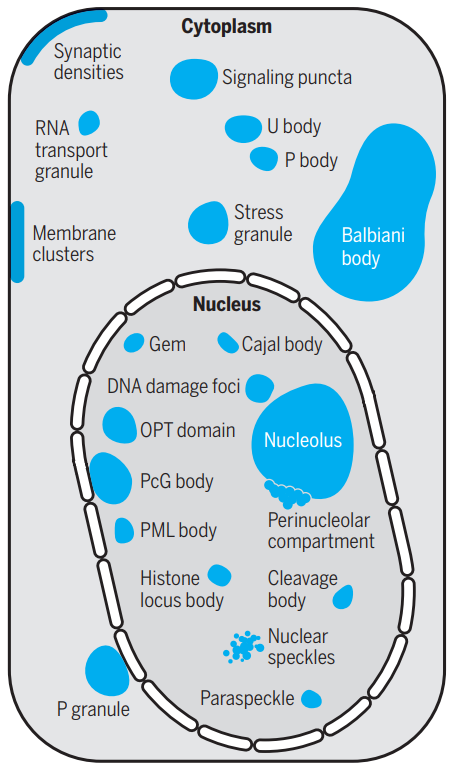
- 功能：
	- 细胞内物质运输
	- 信号传导
	- 能具备自己最适的pH和浓度等→能够 ==高效调控基因的转录== 
- 形成机制：液液相分离

#### 3. 预测相分离
- IDR 是相分离蛋白中一种常见的结构域。在其一级序列中的疏水氨基酸会调控相分离中的浓度，而带电氨基酸又会影响凝聚物的出现。因此，可以通过一级序列推断蛋白质相分离能力，相变临界浓度等。
- 研究工具：
	- PhaSepDB（http://db.phasep.pro/）：相分离相关蛋白数据库
	- RNAPhaSep（http://www.rnaphasep.cn/）：相分离相关RNA数据库
	- Pi-Pipredictor: 利用 pi-pi contacts 预测相分离
	- ZipperDB: 利用 fibril-forming 片段预测相分离

-----------------
1. Why is it important that eukaryotic genes may have so many different elements in their regulatory DNA regions?
	- 这些元件的存在使得基因表达能够根据不同的细胞类型、发育阶段和环境信号等进行灵活调节
	- 只有当多种信号同时满足时，基因才会被激活或抑制。这种复杂性为基因表达提供了精确的时空控制，确保细胞能够正确地分化、发育和应对各种生理和环境变化。
2. It is known that many enhancers can be moved hundreds or thousands of base pairs away from their normal location & still function normally? Why or why not?
	1. 染色质可以通过一系列的动态变化，如环化等，使增强子与启动子在空间上靠近
	2. 增强子本身具有一定的序列特异性，它可以通过与特定的转录因子结合，然后依靠这些转录因子之间的相互作用，跨越很长的 DNA 距离来影响基因表达。
3. How does a protein recognize a specific DNA base sequence?What kinds of amino acids would you expect are most important for recognition & binding?
	1. 特定的结构域→DNA特定的碱基序列e.g.HTH→可以插入DNA的双螺旋大沟中
	2. 带正电的氨基酸：精氨酸、赖氨酸→与负电DNA紧密结合
	3. 极性氨基酸：用氢键与DNA上的特定官能团结合
4. Would you expect protein that bind to RNA to have similar structure as proteins that bind to DNA? Why or why not?
	1. 相似：都需要与核酸进行特异性结合
	2. 不同：RNA是单链结构，并且会形成特殊二级结构；而DNA结合蛋白更多针对双螺旋、碱基序列进行识别
5. Please explain your comprehension of cellular phase separation.
	1. 细胞相分离是一种在细胞内形成无膜细胞器或特定功能区域的机制
	2. 细胞内的生物分子（如蛋白质、核酸等）通过多种非共价相互作用（包括静电相互作用、疏水相互作用、氢键等）聚集在一起
6. What’s super enhancer? Please describe the features and function in cell.
	1. 是一类具有特别强大的转录激活功能的增强子区域
	2. 多个增强子元件紧密聚集，具有更高的转录活性相关组分的富集程度→ChlP-seq时可能会显示出更高水平组蛋白修饰
------------

| Words       | 意思                                        |
| ----------- | ----------------------------------------- |
| helix       | 螺旋(结构单元)                                  |
| Homeodomain | 同源异型结构域                                   |
| TF Ⅱ        | Transcription Factor of RNA polymerase II |
| TBP         | TATA-binding protein                      |
| TAF Ⅱ       | TBP-Associated Factors II                 |
| hetero(前缀)  | 不同的→异染色质、不均一核RNA                          |

| 比较项目   | TATA box                                | -10 区                        |
| ------ | --------------------------------------- | ---------------------------- |
| 所属生物类型 | 真核生物启动子元件                               | 原核生物（如大肠杆菌）启动子元件             |
| 位置     | 通常位于转录起始位点上游约 - 25 处                    | 位于转录起始位点上游约 - 10 处           |
| 序列     | 非模板链上的一致序列为 TATAAA                      | 非模板链上的序列为 TATAAT             |
| 功能细节   | 帮助 RNA 聚合酶 II 和通用转录因子定位，是转录起始复合物组装的关键位点 | 有利于 DNA 双链解旋，与 RNA 聚合酶初始结合相关 |
| 调控复杂性  | 在真核生物复杂的转录调控中，对基因特异性表达调控作用精细            | 原核生物转录调控相对简单，主要保障基本转录起始      |
