## 一、镜像生物学
#### 1. 手性chirality
-  ==天然核酸都为D型核糖(右手)组成，天然蛋白质由L型(左手)氨基酸组成==  #考过 
- 镜像生命：分子手性与现存生物完全相反，现有的抗原/酶没办法抵抗
	- 不会被酶破坏，能够保证信息存储的稳定性
	- 镜像左手DNA用于给信息加密
	- 增强DNA、RNA、蛋白质的稳定性
#### 2. 非天然氨基酸Non-canonical amino acids
- 可以位点特异性地引入目标蛋白，对蛋白结构扰动很小
- 通过更换蛋白质的侧链基团使其功能多样化
- 应用：
	- 提高酶的催化活性→加入催化集团
	- 增强酶的热稳定性→加入氟苯丙胺酸
	- 药物蛋白
#### 3. hachimoji(8个碱基的DNA分子)→与镜像生物学无关哈
- 研究人员通过将 4 种人工合成的碱基，与天然存在的四种核苷酸结合，创造出由 8 种碱基组成的 DNA 分子，命名为“hachimoji”（在日语中 hachi 代表 8，moji 代表符号），并且能够像天然 DNA 一样存储和转录信息。
- 由于人工合成的 hachimoji分子信息存储能力是天然 DNA 的两倍，因此可能会有无数的应用。

----
## 二、突变Mutation
- 概念：a inheritable change in DNA sequence is called a mutation细胞的可遗传损害
##### 1. 点突变Point mutation
 - 概念：单个碱基对的变化
	 - 转换transition：嘧啶→嘧啶，嘌呤→嘌呤
	 - 颠换transversion：嘌呤和嘧啶互换
- **单核苷酸多态性（SNP）**：人类基因的绝大多数点突变并不直接影响基因编码功能
	- 体现人群中个体差异的DNA序列变化中最基本和最常见的形式
	- 其它DNA多态性： #学科链接 植物基因组学
		- 限制性片段长度多态性RFLP
		- 可变数量串联重复序列VNTR
- 类别
	1. **错配碱基mismatched base**：DNA聚合酶不小心把不配对的碱基给互补上去了
		- 这个突变一般能够被3'→5'外切酶修复 [[Chapter2 遗传物质研究]]与哪个DNA聚合酶有关？
		- 如果没有被修复，那么接下来生成的互补链就会不一样
	2. **自发突变Spontaneous mutation**：自然界在复制过程中产生，比例小，指没有人为因素干扰
		- 脱氨基
			- 发生在胞嘧啶上时，会生成尿嘧啶，在每个细胞中这个变化每天都会发生100次:O!→尿嘧啶会与腺嘌呤配对→引入一个点突变
		- 脱嘌呤Depurination：嘌呤碱基从DNA主链上脱离
			- 如果DNA聚合酶遇到一个没有碱基的核苷酸，它可能会在新生链中添加一个错误的碱基，因为模板无法提供任何信息。
		- 互变异构化Tautomerization：DNA中的四种碱基各自的 ==异构体间== 可以自发地相互变化→烯醇式与酮式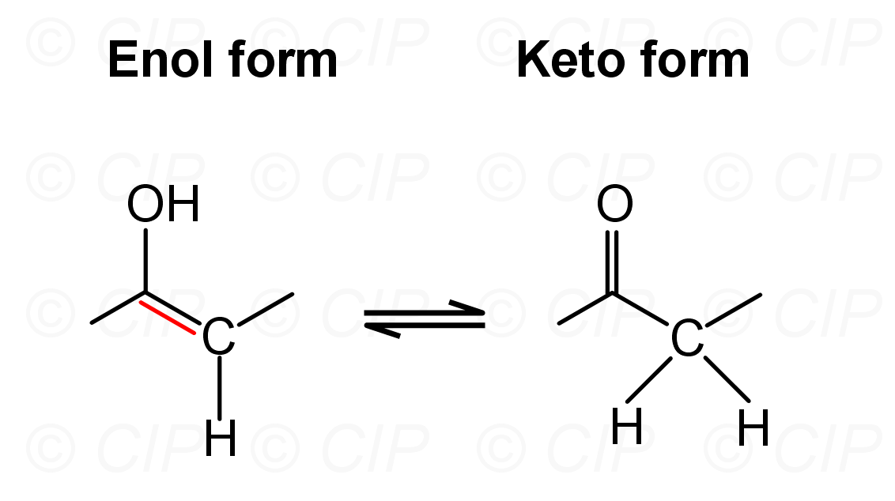
			- 会导致碱基配对间的氢键改变
			- 若发生在DNA复制时，会造成子代DNA序列和亲代不同的损伤→错配
			- 腺嘌呤（A）和胞嘧啶（C）可以互变异构化为它们的亚氨基式（imino form），通常表示为 A* 和 C*。胸腺嘧啶（T）和鸟嘌呤（G）可以互变异构化为它们的烯醇式（enol form），通常表示为 T* 和 G*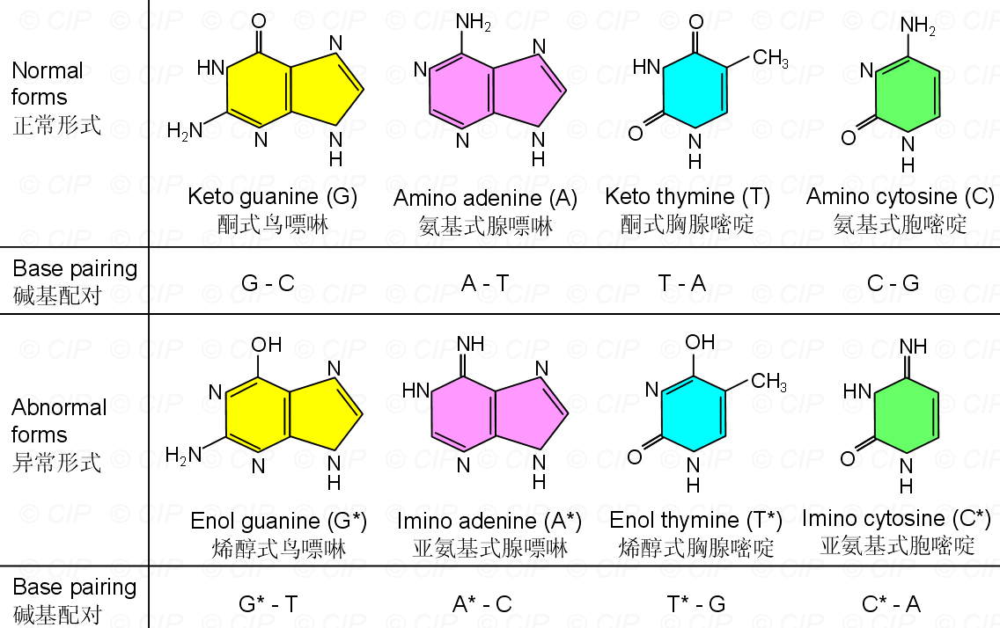
			- 这些替代形式的碱基具有非常不同的氢键结合特性：A* 与 C 结合，C* 与 A 结合，T* 与 G 结合，G* 与 T 结合。
		- 自身代谢产物的诱变
		- 环出效应[[#^eb8cd5]]
	3. **诱发突变Indeced mutation**
		- 碱基类似物Base analogues
			- 5-溴尿嘧啶（BU）：与胸腺嘧啶（thymine）非常相似，因为溴原子的大小大约与胸腺嘧啶的甲基基团相同→可以代替T整合到DNA中→转化为BU* 后与G配对
			- 2-氨基嘌呤
		- 烷化剂Alkylating agent:
			- can be added to another molecules,including DNA bases
			-  ==⼄基甲磺酸EMS== ：将烷基（主要是乙基）引入 DNA 分子的碱基中
		- 亚硝酸→作用于A G C→转化为次黄嘌呤、黄嘌呤、尿嘧啶
		- 紫外辐射Ultraviolet radiation
			- 紫外线光子被两个相邻的嘧啶碱基吸收，这两个碱基之间可能会形成共价键。这种现象称为 ==嘧啶二聚体(pyrimidine dimer)== →可能会阻止DNA复制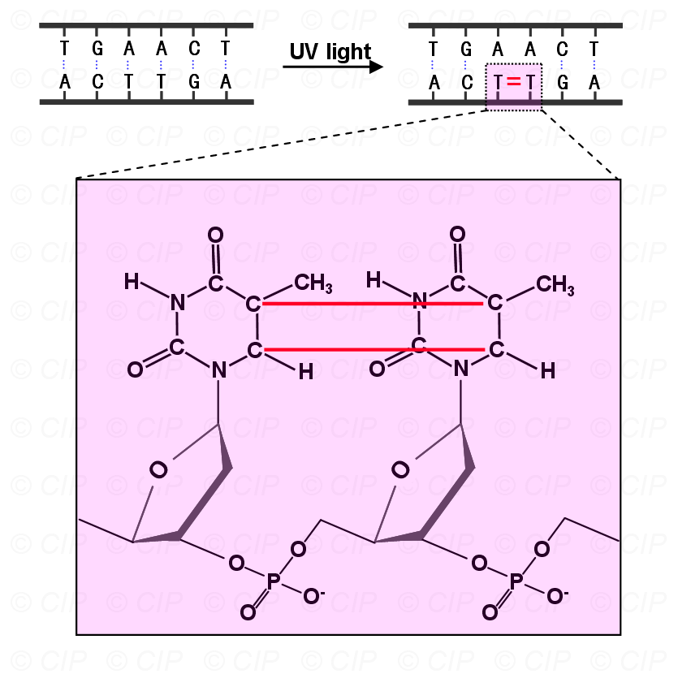
- 渗漏突变Leaky mutation：基因突变后，基因产物仍保留部分功能，而不是完全丧失功能的一种突变类型。
##### 2. 插入和缺失Indel
- 概念：几个碱基的插入或缺失
- 类别
	1. 链滑动： ^eb8cd5
		- 在DNA中存在重复的核苷酸序列时，两条链会相对滑动→在一条链上形成一个小环→插入/缺失环IDL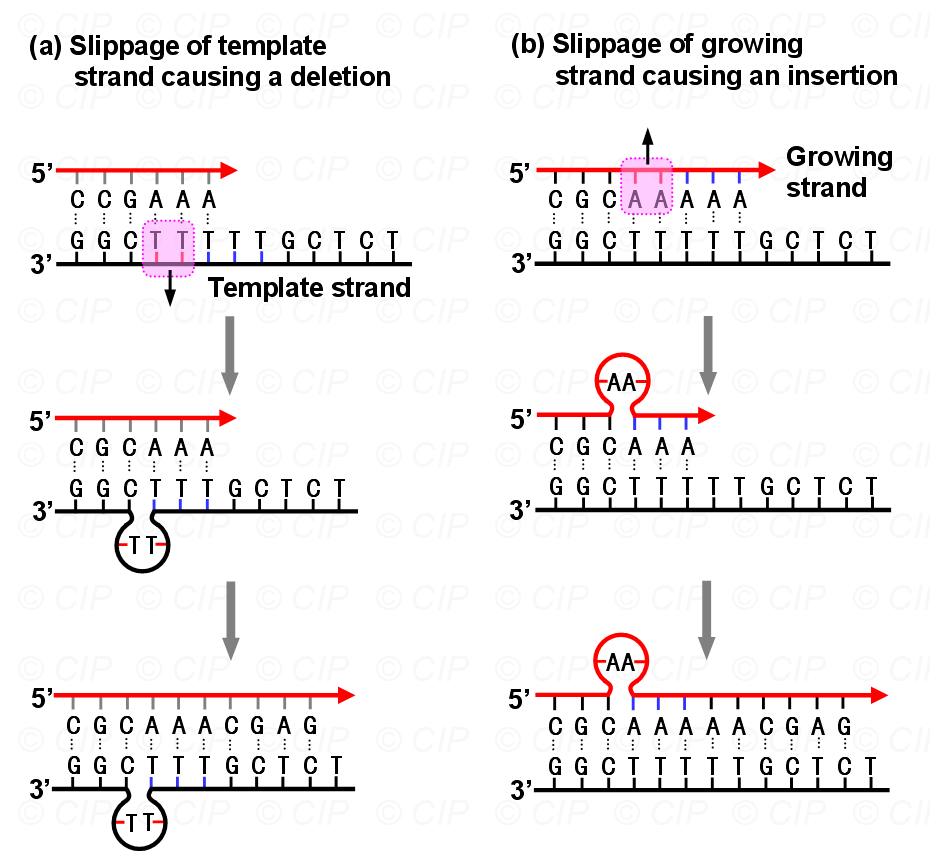
		- 重要性：哺乳动物基因组中突变的重要来源。哺乳动物基因组中包含许多重复的核苷酸序列（如[A]n或[CA]n），称为微卫星（microsatellite）。如果这些区域的滑动未被修复，会导致微卫星不稳定性（MSI），使细胞快速积累突变→许多癌细胞表现出MSI
	2. 转座子transposons：可以从基因中的一个位置移动到另一个位置 [[Chapter10 Recomposition]]
		- 转座子通常不会选择特定的插入位置，因此可能会插入到功能重要的区域（如基因的编码区），从而导致严重的表型变化
		- 当转座子离开原始位置时，可能会在两侧产生双链断裂。如果细胞通过非同源末端连接（NHEJ）修复断裂，可能会导致缺失。
	3. **嵌入剂Intercalating agents**:与碱基对相似、能插⼊到DNA双螺旋中的分⼦→区别于碱基类似物 #易混淆 
		- 导致相邻的碱基被推开
		- 在复制过程中，模板链中的额外空间可能导致DNA聚合酶在新生链中添加额外的核苷酸，从而导致插入。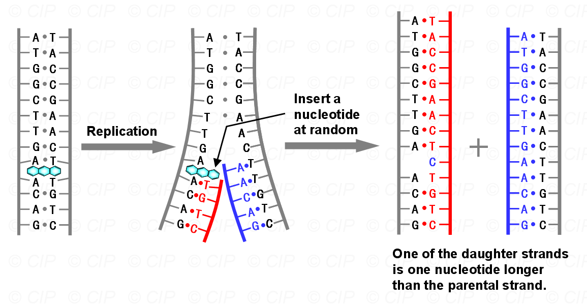
		- 嵌入剂还可以通过促进链滑动来引起插入和缺失。
##### 3. 大规模DNA变化Large-scale DNA changes
- 易位**Translocation**：两个非同源染色体上的区域交换位置→ #学科链接 遗传学
- **倒位（Inversion）**：染色体区域的方向被反转→可能导致基因功能丧失/产生融合蛋白→引起癌症
- **双链断裂（Double-stranded breaks）**：染色体的大规模重排通常是由DNA的双链断裂引起的。
    - X射线和某些代谢过程会释放危险的活性氧（自由基），攻击DNA分子，导致双链断裂。
#### 4. 氨基酸残基磷酸化
- 概念：在 ==蛋白激酶== 的催化作用下，磷酸基团由供体分子转移到蛋白质 ==含有羟基== 的氨基酸侧链上
	- 种类：丝氨酸S、苏氨酸T、酪氨酸Y
	- 其它：入核必须残基→精氨酸Arg,R、赖氨酸Lys,K
- 约有1/3的蛋白质发生磷酸化→联系生化中的激素腺苷酸环化酶途径
- 过程（不重要）：
	1. 准备阶段： ==ATP+蛋白激酶== 
	2. 识别阶段：蛋白激酶识别作用蛋白质及特定的氨基酸残基
	3. 磷酸化阶段：蛋白激酶利用ATP提供的能量把ATP的磷酸基团转移到氨基酸残基上
	4. 完成阶段：会引起蛋白质性质改变→活跃/不活跃，参与细胞的各种生理过程
## 三、产生突变的结果
#### 1. 点突变
- **沉默突变**：碱基替换不会改变由突变基因产生的蛋白质的氨基酸序列
    - 例外情况：如果碱基改变影响了剪接位点或调控区域的关键碱基，即使它没有根本改变密码子的信息，也可能严重损害蛋白质的功能。
- **错义突变**：一个密码子被另一个编码不同氨基酸的密码子取代，称为错义突变。
    - 这种突变会 ==改变基因产生的蛋白质中的一个氨基酸== 。
    - 突变对蛋白质功能的影响取决于氨基酸在蛋白质中的位置以及被替换的氨基酸类型。
    - 通常，如果原始氨基酸被相似的氨基酸取代，错义突变的影响会最小化。
- **无义突变**：有时，点突变会将基因中的一个密码子 ==变为终止密码子== ，这种突变称为无义突变。
    - 由突变基因产生的mRNA只能翻译到新的终止密码子处，从而产生截短的蛋白质。蛋白质的大小取决于突变在编码区的位置。
    - 通常，这种突变非常严重，导致蛋白质完全失去功能。
#### 2. 插入和缺失的后果
- 更有可能导致非功能性蛋白质的产生，因为即使是单个碱基的插入或缺失，也可能严重改变mRNA的翻译方式
- **移码突变**：由于核苷酸的插入/删除 ==导致了ORF的改变== →下游所有核苷酸右移/左移 #重点 
	- 引起这类突变的主要是吖啶类燃料和一系列ICR化合物→平面型三环分子结构，与一个嘌呤和嘧啶对十分相似
		- 沉默/同义突变：DNA 序列中的碱基发生替换，但改变后的密码子编码的是同一种氨基酸，从而 ==不会导致蛋白质序列的改变== 
		- 错义突变：改变后的密码子编码另一种氨基酸，使蛋白质的氨基酸序列发生改变
		- 无义突变Nonsense mutation：使原来编码氨基酸的密码子变成终止密码子，导致蛋白质合成提前终止
#### 3. 易位的后果
- 如果易位的断裂点发生在不重要的DNA序列中，这种重排可能对相关区域内的基因影响较小。
- 在极少数情况下，易位会破坏两个基因的编码区，导致一个基因的一部分与另一个基因的一部分融合→ ==产生融合蛋白== 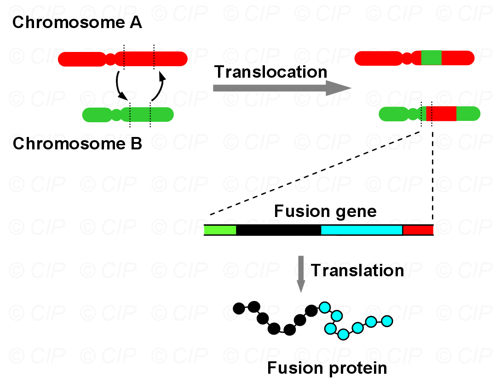
    - 在某些情况下，这些融合蛋白是活跃的，但具有新的功能→慢性髓性白血病
- 在某些情况下，易位不会破坏编码区，而是 ==将编码区置于一个新的启动子下游== →产生的蛋白质量取决于启动子的特性→Burkitt淋巴瘤是由易位将负责细胞增殖的基因（c-myc）置于一个非常活跃的启动子下游引起的。
#### 4. 突变热点hot spots
- 短重复序列更容易积累突变→突变热点
- CG序列→C被甲基化→与T难以区分→发生错配但又难以识别，可能会导致错误修复→频繁碱基替换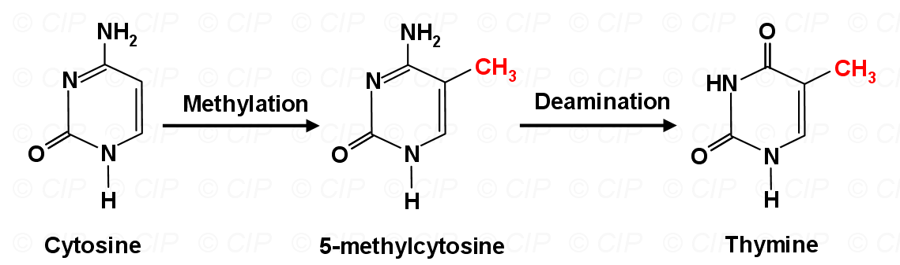

-------
## 三、 突变修复Repair Mutation

- 概念： **细胞对DNA受损伤后的一种反应**，这种反应可能使DNA结构恢复原样，重新能执行它原来的功能；但有时并非能完全消除DNA的损伤，只是使细胞能够耐受这DNA的损伤而能继续生存。
- 多数DNA修复用的蛋白在平时不会大量表达。例如很多修复途径需要核酸内切酶，但内切酶同时也可以降解核酸，造成额外的损伤，所以只有在需要时才会大量合成。其它与修复相关蛋白的表达以及活性也同样需要一个调控机制。
#### 1. 直接修复
- 碱基的损伤可以在不移除碱基的情况下被修复。
- 光复活作用：
	-  ==嘧啶二聚体== 是一种可以直接修复的损伤→用光解酶（photolyase）打破嘧啶之间的共价键，使碱基恢复到原始状态
	- 暴露在可见光下也可以打破共价键，明显降低死亡率
- 修复G的烷基化：甲基转移酶将诱变的甲基转移到它的一个氨基酸上→甲基转移酶只能进行一次修复，之后会被细胞丢弃(好惨...QAQ)
#### 2. 错配修复Mismarch Repair,MMR→识别甲基化碱基
- 可以修复错配碱基和链滑动，原核和真核生物都有
- 原理:大肠杆菌中的Dam甲基化酶会识别 ==GATC序列并且将A甲基化== ，但是新合成的DNA链上的GATC序列并没有甲基化，而母链甲基化→可以认出新合成的链，移除与错配相关的部分
- 过程：在Ecoli中**UvrD解旋酶**从缺口处开始解开双螺旋→直到错配位置稍后的位置→这使得**核酸外切酶**能够破坏包含错误的单链DNA区域→**DNA聚合酶III**修复缺口，通过合成新的DNA（假设没有错误）→ 新合成的DNA随后由**连接酶**（ligase）连接到原始链上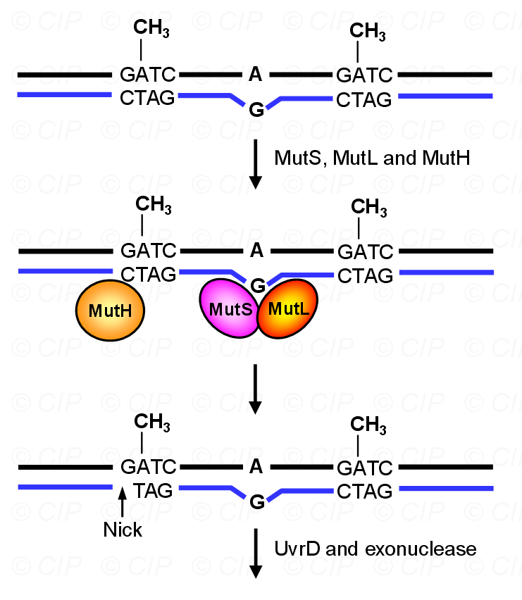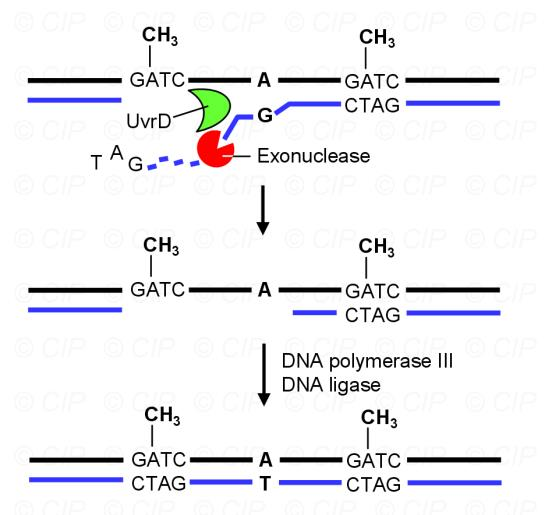
- 尽管错配和IDL通常只影响一个或几个碱基，但细胞的策略是移除错误周围的较大DNA区域，并正确地 ==重新合成== 。
#### 3. 核苷酸切除修复NER:可切除大片段的DNA损伤
- 原理和错配修复差不多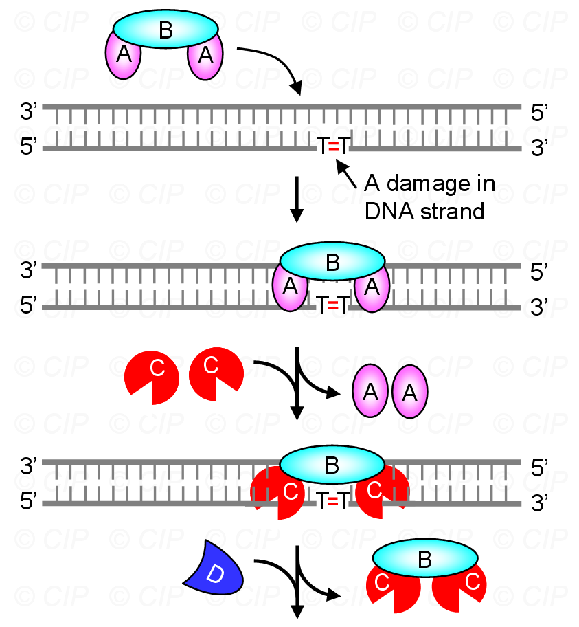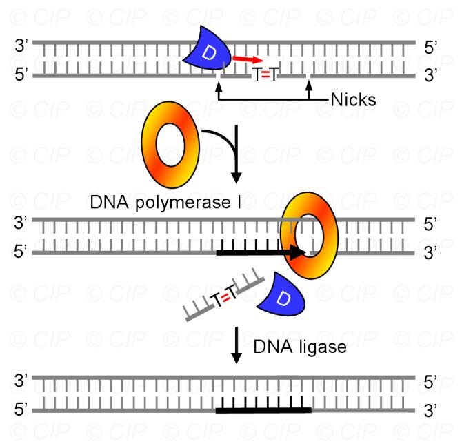
#### 4. 碱基切除修复BER:修复个别碱基的损伤
- 过程：DNA糖基化酶结合到受损碱基→切断碱基与脱氧核糖之间的键，留下一个AP位点（无嘌呤/无嘧啶位点）→糖基和磷酸基团也被移除，留下DNA中的一个小缺口→DNA聚合酶I修复缺口，在之前受损碱基的位置添加一个正常的核苷酸→DNA聚合酶I利用其独特的5’→3’外切酶功能，同时移除并重新合成缺口下游的几个核苷酸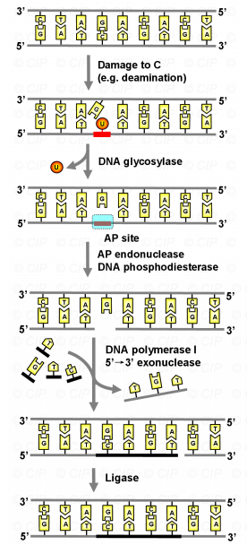
#### 5. 双链断裂修复DSBR[[Chapter10 Recomposition]]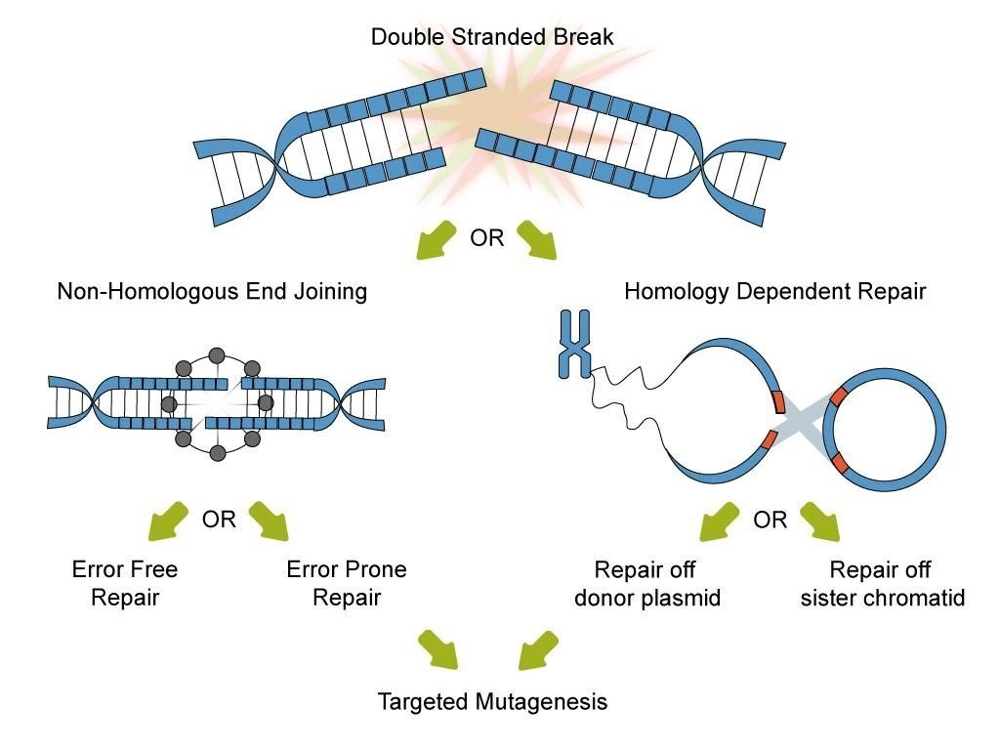
- **同源重组修复HR**：[[Chapter10 Recomposition]]
	- 过程：
		1. 细胞会先让断裂的两端的 DNA 链解开一些
		2. 细胞会去找一段和断裂 DNA 两边序列很相似的 DNA 片段，这个相似的片段一般来自于细胞里另一条没有断裂的 ==同源染色体==  #一些疑问 谁去找啊？
		3. 用一些特殊的蛋白质把断裂的 DNA 末端和这个相似的片段连接起来
		4. 以这个相似片段为模板，合成新的 DNA，把断裂的部分补好。最后，再把连接的地方处理好，让 DNA 恢复成原来的双链结构。
	- 准确性：十分精确
- **非同源末端链接NHEJ**：
	- 过程：当 DNA 双链断裂后，Ku和DNA-PK蛋白结合到DNA的断裂末端→把断裂的两端直接拉到一起，然后用一些酶把它们连接起来→不需要模板，也不管断裂两端的 DNA 序列是什么样子，只要把它们连起来就行
	- 准确性：会在连接的过程中丢失或者增加几个碱基
- References：[DNA损伤反应与DNA的修复（一） - 知乎](https://zhuanlan.zhihu.com/p/108923860
#### 6. SOS修复 #待解决 
- 随便找几个核苷酸把它们再拼回去，比较复杂

-----
1. An important part of repairing DNA damage, is recognizing presence of damage & specifically what kind of damage it is. What are some mechanisms the cell uses to recognize various kinds of damage?
2. Do you think that cells always transcribe DNA damage repair genes? Do you think these genes are expressed more strongly under certain conditions? Whyor why not?
3. What kind of DNA damage are hardest for a cell to detect & fix?
4. What are some differences between mismatch repair & nucleotide excision repair?
5. Please describe the chirality of nature DNA\RNA\Protein in our surrounding life. Why scientist try to synthesis mirror-image DNA?

-----
proton 30
covalent 31
transposons 35 转座子