## 一、加帽capping
#### 1. 概念：
 - pre-mRNA初级转录本：含有内含子
 - 加帽是在pre-mRNA的末端加上一个**鸟嘌呤核苷酸衍生物**的过程 #易混淆 
#### 2. 帽的结构
- m7G-cap：在鸟苷酸的7‘位置上添加了一个甲基，并且还有三磷酸键链接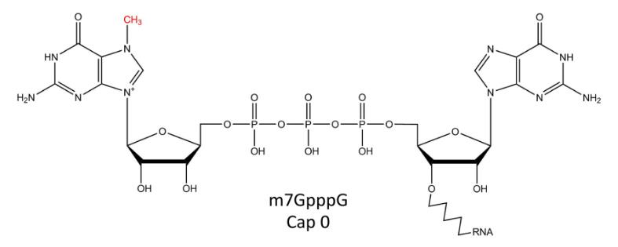
- 有很多不同的帽子！
- NAD+cap：烟酰胺腺嘌呤二核苷酸 (Nicotinamide adenine dinucleotide, NAD构成了原核mRNA的帽子结构NAD+cap
#### 3. 加帽过程 #待解决 
- 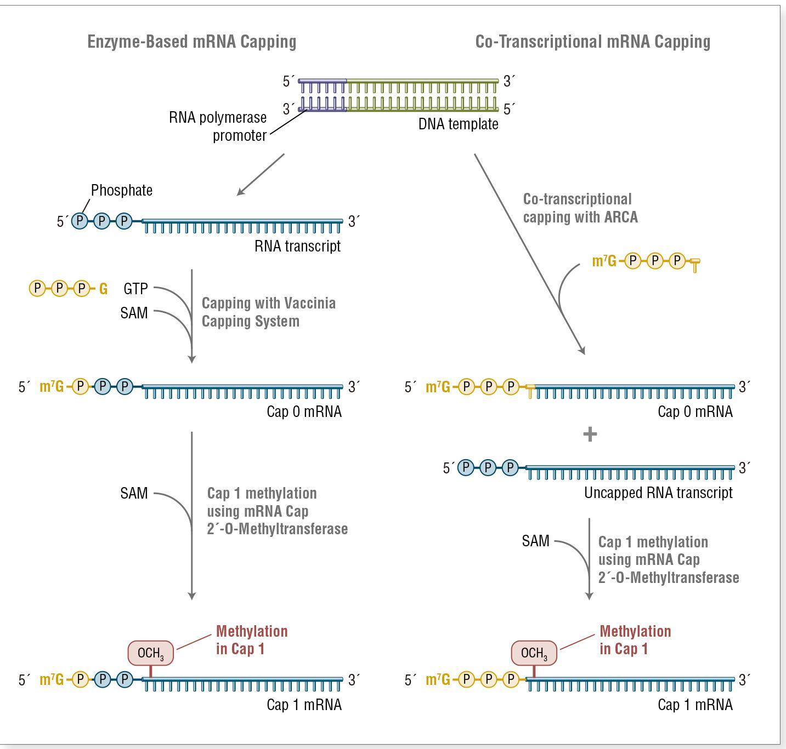
 - 酶法加帽
	 - **CTD(C-terminal domain):** #重点 
		- CTD 是  ==RNA 聚合酶 II 的 Rpb1 亚基的 C 末端结构域== 
		- 构成：甲基转移酶（Methyl transferase）+鸟苷酰转移酶（Guanylyl transferase）+RNA 三磷酸酶（RNA triphosphatase） 
		- 作用： #待解决 
			- 招募转录因子和修饰酶(如上述三种酶)-
			- **协调转录与修饰**：CTD在转录过程中被磷酸化等修饰，这些修饰信号可以协调转录与RNA修饰（如加帽、剪接和聚腺苷酸化）的过程。    
			- **调控转录起始和延伸**：CTD的不同磷酸化状态可以调控RNA聚合酶II的活性，影响转录的起始和延伸阶段。
 - 共转录加帽
	 - 利用帽结构类似物
#### 4. 帽子的作用 #考过 
- 防止mRNA降解：核酸酶没有办法把 ==带有三磷酸键== 的帽子给降解
- 帮助mRNA转运到细胞质中
- 增强翻译：帽子结构能够更好地被帽子结合蛋白识别，吸引核糖体结合
- 帮助去除第一个内含子→现在研究表明第一个内含子有增强稳定性的作用
----------
## 二、 Polyadenylation聚腺苷酸化
#### 1. 概念
- 在3'端加入约250个腺嘌呤A→最后只剩下七八个，应该是用来被消化的
- signal：AAUAA→先剪去一小段mRNA，通常是下游的GU丰富序列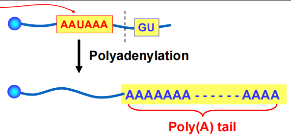
- Cleavage Complex:剪切复合物 
	- RNA 聚合酶 II（RNA polymerase II）在 DNA 模板上转录生成 RNA，当转录到特定序列区域，出现信号序列 AAUAAA（图中红色标识 ）以及下游富含 GU 的区域（G/U） 。此时，RNA 聚合酶 II 的 C 端结构域（CTD）也参与其中→联系加帽
	- 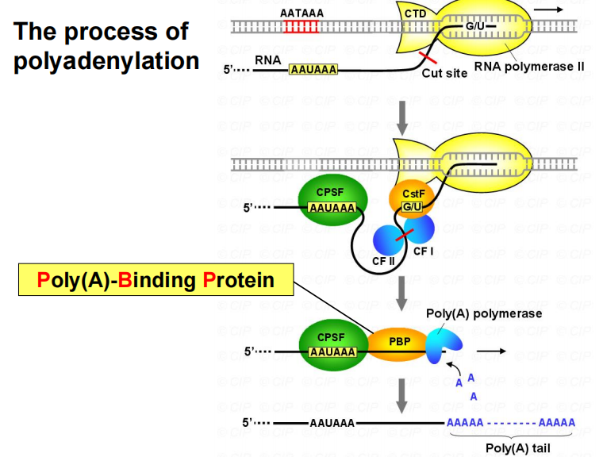
	- CPSF：识别别并结合到 AAUAAA 序列上
	- CstF：结合到富含GU(G/U)
	- CFⅠ和Ⅱ：结合至AAUAA上游→切断RNA→随后PBP(多聚腺苷酸结合蛋白)发挥作用
#### 2. 加尾过程 #待解决 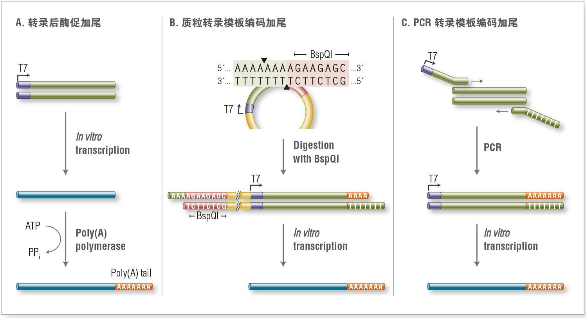
- 参与识别和切割多聚腺苷酸位点识别的核心顺式元件在不同生物中不同

#### 3. 作用
- 保护mRNA不被降解
- 参与剪接，增强翻译
- **APA:Alternative polyadenylation可变聚腺苷酸化**
	- 会形成不正常的蛋白质，与可变剪接不同
-------------
## 三、Splicing剪接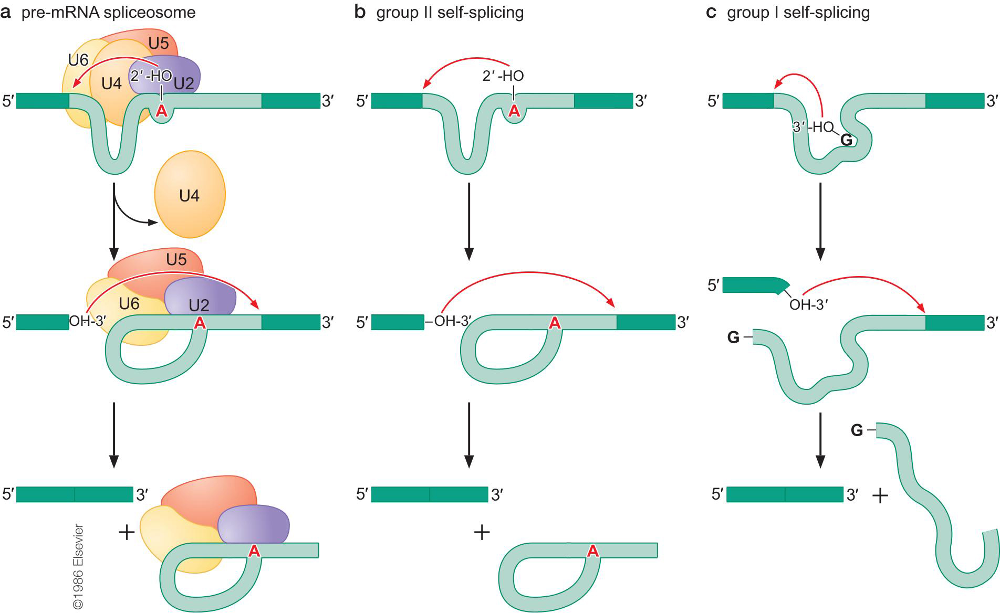
#### 1. 基本的剪接反应
-  绝大部分的introns都是 ==GU开头，AG结尾== 
	- 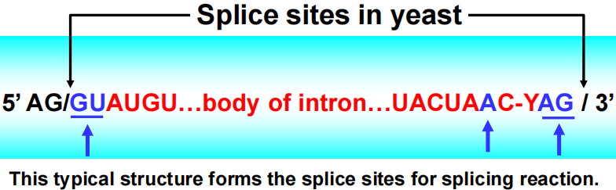
- 过程：因此在AG上游通常还含有一个A，用来给OH攻击(:O!) #待解决  谁在攻击谁..?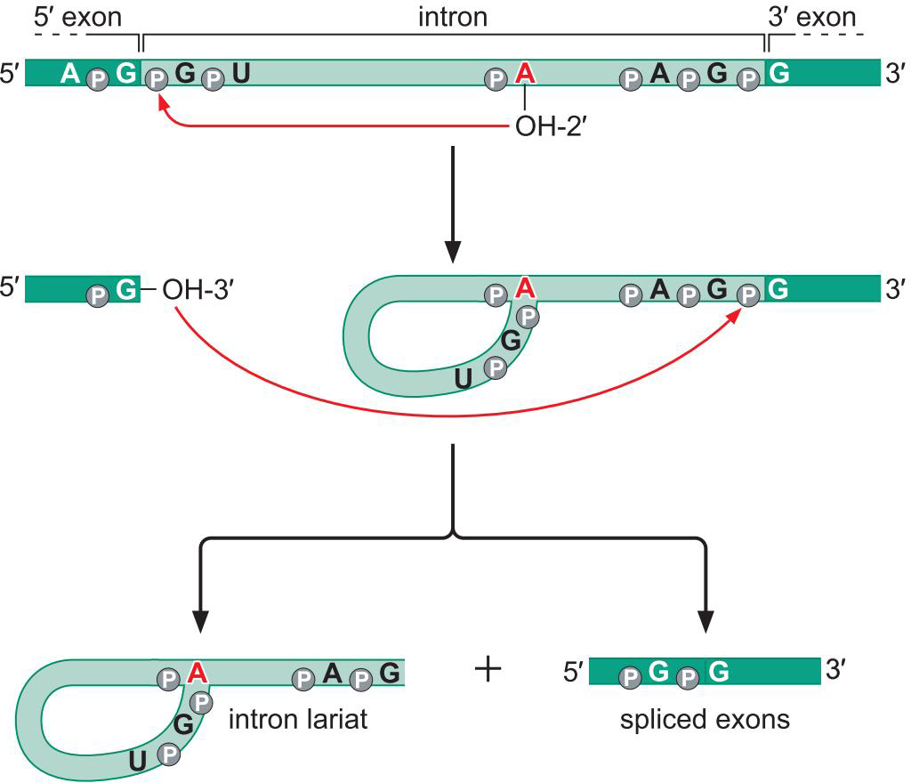
- 发挥作用的蛋白质：**Splicingsome剪接体** #易混淆 
	- snRNPs：在细胞核内，包含 ==蛋白质和RNA== 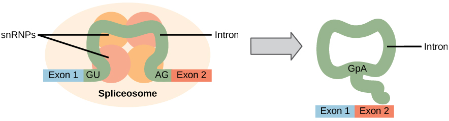
	- 功能：能够把intron切除 #待解决 这个过程好复杂呀...
	- 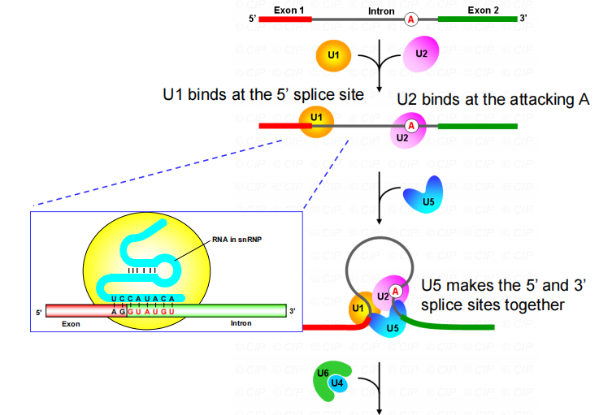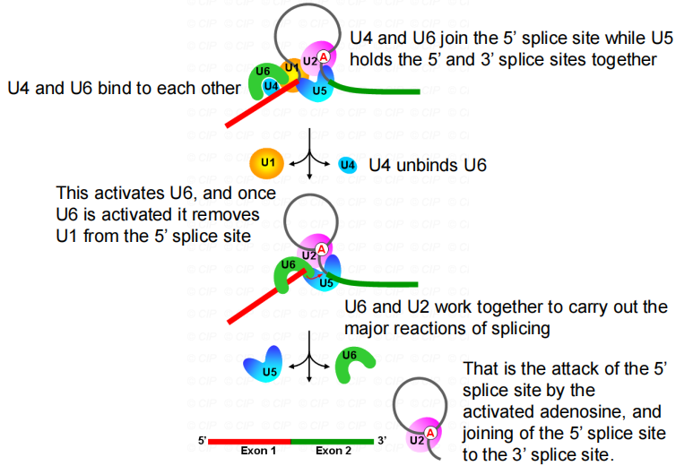
		- 往往比较短的序列只有一个exon，不需要剪切
#### 2. **Self-Splicing自我剪接**：不需要蛋白质或snRNA的帮助
- Ⅰ类内含子的自我剪切：需要 ==外界的一个G来帮忙攻击== →Exon1攻击Exon2→去除内含子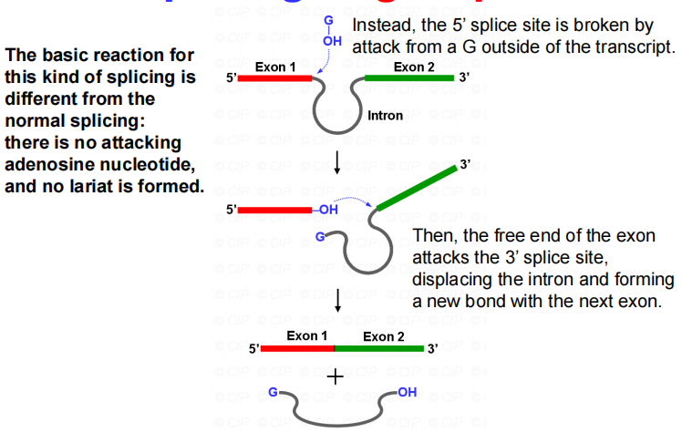
- Ⅱ类内含子的自我剪接→和Normal splicing很像 #一些疑问 那区别是啥？？
#### 3. Trans-Splicing反式剪接
- 概念：拼接后的RNA 来自不同的基因。最终产生带有拼接前导序列的成熟 mRNA 以及一个副产物。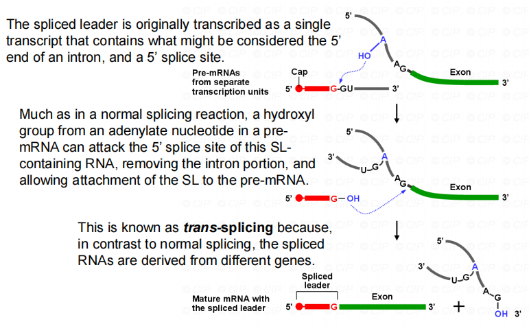
- 同样有剪接体参与，但是snRNP的靶点不同→识别两个不同转录本SL和前体mRNA
	1. **拼接前导序列（spliced leader，SL）** 最初作为一个 ==单独的转录本被转录== ，它包含了类似于内含子 5' 端的序列和一个 5' 剪接位点。前体 mRNA（Pre - mRNAs）来自不同的转录单元。
		- SL可以行使某一些特定的功能
	2. 与正常的剪接反应类似，前体 mRNA 中腺苷酸核苷酸上的羟基（hydroxyl group）可以 ==攻击含有拼接前导序列 RNA 的 5' 剪接位点== ，去除内含子部分，使得拼接前导序列连接到前体 mRNA 上。
	- 基因编辑时，查找最前面的基因最好？ 
#### 4. Alternative Splicing可变剪接
 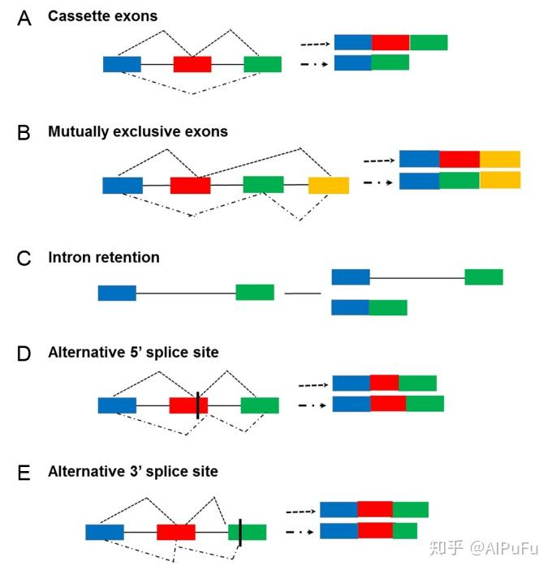
- 类型
	- Exon skipping外显子跳跃
	- Mutually Exclusive Exons互斥外显子
	- Intron Retention内含子保留
	- Alternative 5’ splice site，A5SS 外显子5'端的选择性剪接
	- Alternative 3’ splice site，A3SS 外显子3'端的选择性剪接
	- CDS是ORF的一种
- e.g.果蝇的性别决定Sxl基因
	- 当只有一个X时，不足以阻止splice site→翻译提前终止→形成的蛋白质没有功能→雄果蝇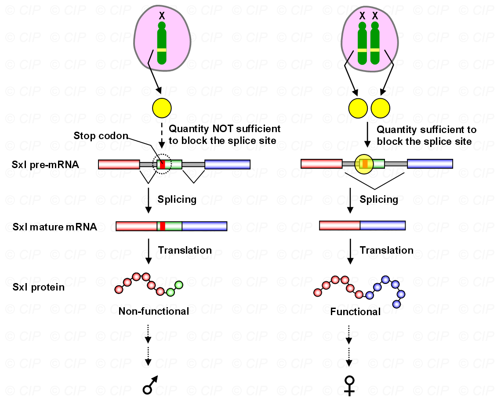
	- 属于NAS途径[[Chapter8  翻译(原核+真核)]]
#### 5. 内含子存在的原因
- **先出现假说Introns-early theory**
	- 内含子在生命起源的早期就已演化出来，是基因原本就有的结构，即祖先基因携带了大量的内含子 。
- **后出现假说Introns-late theory**
	- 生命起源阶段，内含子并未出现，而是在生命进化的较晚时期，通过转座作用等方式插入到连续基因中，随后在真核生物中逐渐积累。

## 四、mRNA编辑
- 需要一个GuideRNA
#### 2. C→U编辑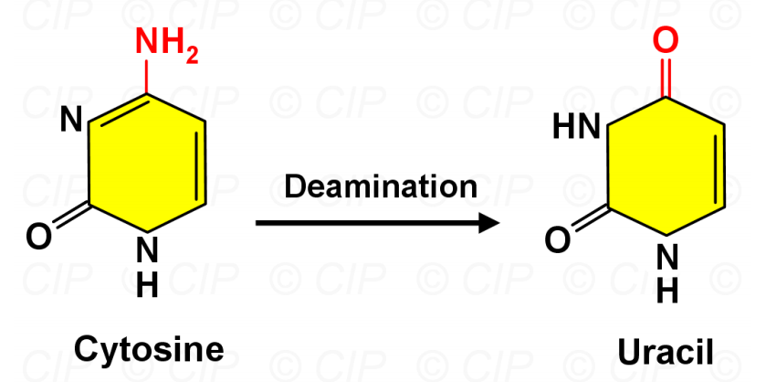
- 产生的后果

#### 3. A→I编辑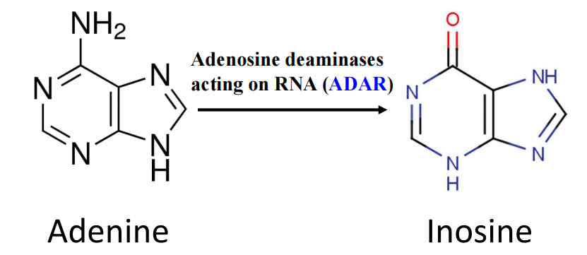
- I偏好于与C配对，因此在功能上相当与G（A-to-G）
- A-to-I编辑大多是位点特异性的，但是在重复序列（如Alu原件）或病毒基因组中由于很多A的富集，也会发生高水平的大量A-to-I，这个被称为超编辑或者是泛编辑

## 五、mRNA修饰
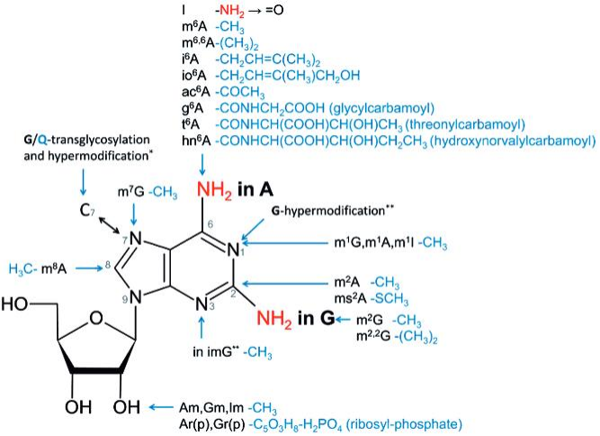
#### 1. 常见的类型
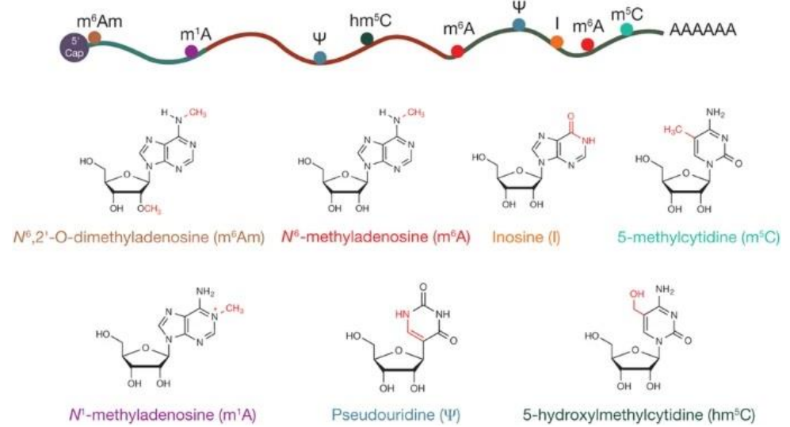
- RNA上6位腺苷甲基化得到**N6-甲基腺苷（m6A）**，真核生物mRNA中 ==最丰富的内部修饰== 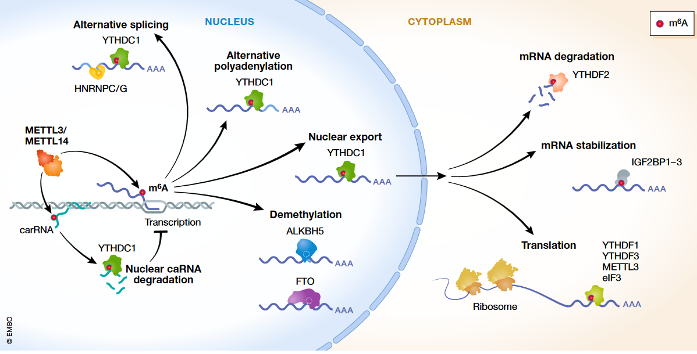
	- 参与RNA的转录、可变剪接、可变多聚腺苷酸化、核的运输、是否依赖帽子的翻译、降解和稳定性
- 与DNA类似，胞苷残基的5位甲基化得到RNA 5甲基胞嘧啶（m5C），发生在DNA和RNA中的修饰，影响RNA稳定性和翻译；
	- RNA甲基化修饰数据库RMBase：rna.sysu.edu.cn/rmbase/
- tRNA的1位腺苷甲基化，得到N1-甲基腺苷（m1A），一种发生在tRNA和rRNA中的修饰，影响tRNA稳定性和翻译；
- 7甲基鸟苷(m7G)；
- RNA假尿苷化得到假尿苷(ψ)；
- RNA腺苷到肌苷编辑(I) ；
- ac4C修饰(N4-acetylcytidine, ac4C)，影响mRNA的稳定性与翻译效率。
#### 2. pre-mRNA修饰对剪接的影响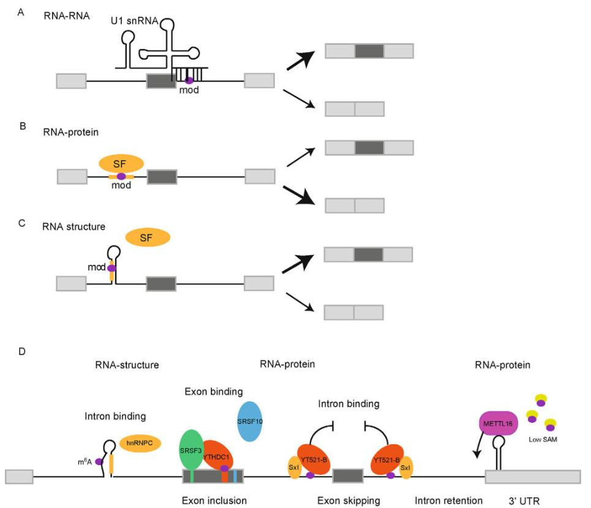
1. RNA与RNA相互作用：mod影响了snRNA与前体mRNA的结合，影响剪接效果，导致外显子的跳过
2. RNA-蛋白质互作：
	- 修饰改变了剪接因子SF与RNA结合的能力
3. RNA结构的影响

## 六、实验研究
#### 1. mRNA-DNA杂交实验
- 通过mRNA与DNA的杂交→得到 ==loop结构== 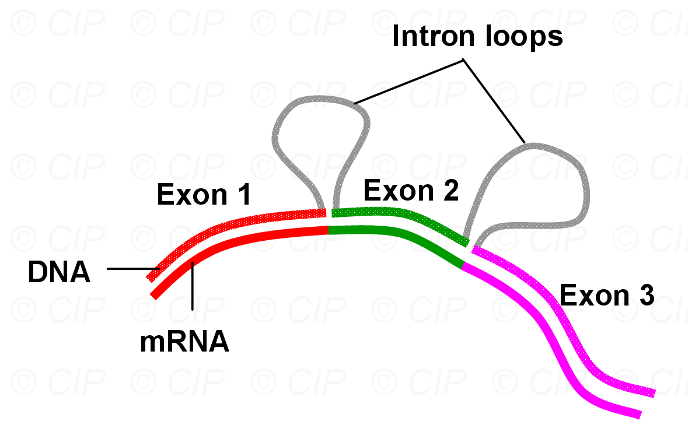
	- 在电镜下观察
	- 用只能切割单链的核酸酶去降解DNA，这时候只有DNA的环被切成了小片段→电泳后得到三条不一样的片段
#### 2. Hybridization between pre-mRNA and DNA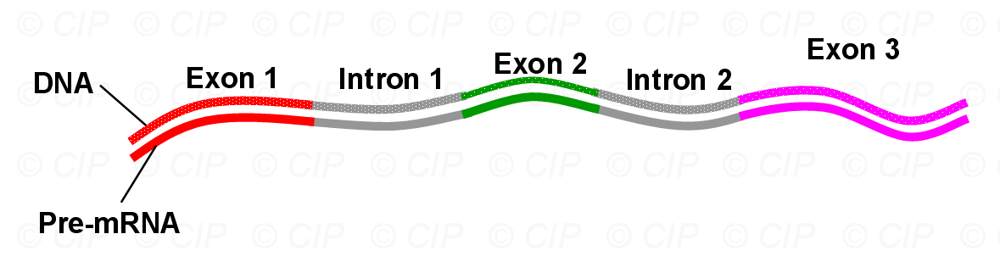
- 目的：探究pre-mRNA是否能够被转录？或是在转录后被切除
- 和上面一样进行杂交，结果发现并没有产生loops→内含子依旧存在于pre-mRNA
----
1. Why do you think that so many modifications to RNA are made in eukaryotes?
	- 联系真核细胞的特点：在细胞核内转录，细胞质内翻译→转录出的mRNA需要定位到细胞质
	- mRNA的稳定性：单链不稳定，容易被核酸酶降解
	- 翻译的效率→能够促进mRNA与核糖体的结合
	- 增加转录本的多样性→真核细胞需要时空特异性表达
2. What is the ‘CTD’ and what does it do during transcription?
3. Why do you think snRNPs contain RNA, instead of being exclusively made of protein, like most enzymes?
	1. 特异性识别：互补配对
	2. RNA的存在使得snRNPs可以动态调整其结构和功能
4. Give some examples of how post-transcriptional modifications allow one gene to make more than one kind of protein.
	1. 可变剪接
	2. RNA编辑
	3. **聚腺苷酸化信号的选择（Alternative Polyadenylation）**：通过选择不同的聚腺苷酸化位点，产生不同长度的mRNA，进而翻译成不同的蛋白质。
	4. **启动子选择（Alternative Promoter Usage）**：通过使用不同的启动子，产生不同的转录本，进而翻译成不同的蛋白质。
---------
References：[MIT molecular Biology 笔记8 RNA剪接 - iojafekniewg - 博客园](https://www.cnblogs.com/hukimwon/p/9843166.html)