- 概念：以mRNA为模板合成一个蛋白质的过程
## 一、遗传密码Genetic Code
#### 1. 为什么是三个碱基对应一个氨基酸？
- 如果是1对1，那么只能配对4个氨基酸
- 如果是一对二，产生4的2次方=16个，还有三个没有配对
-  #课后拓展 为啥不用4个或更多？
#### 2. 遗传密码表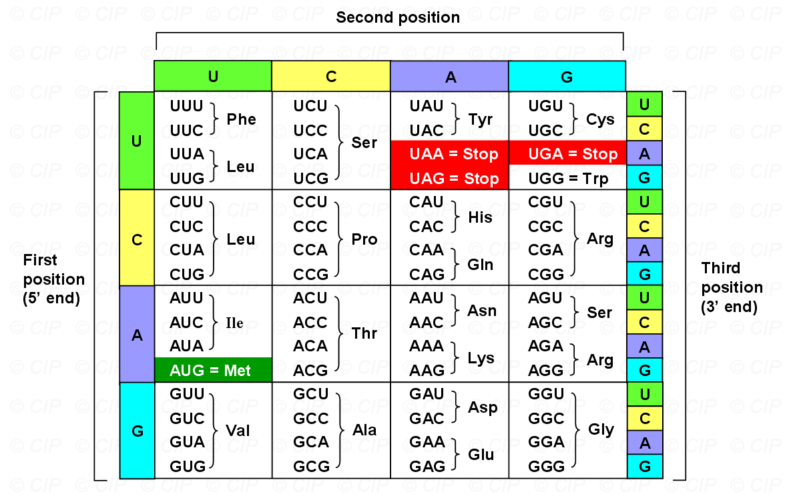

^8b4427

#### 3. 核糖体的组成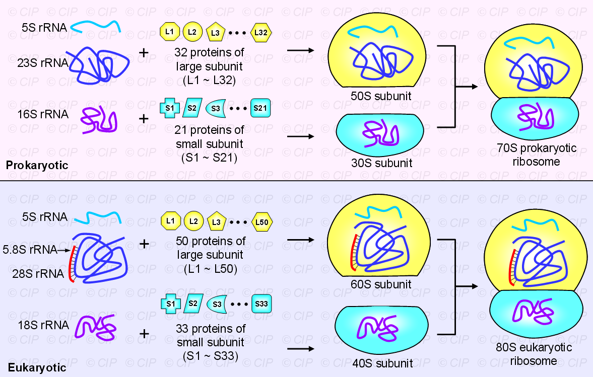
----------
## 二、原核生物的翻译
#### 1. Initiation
1. 30S小亚基和50S大亚基先被**转录起始因子**(initiation factors,IF)IF-1分开,紧接着IF-3结合到小亚基防止它们再次贴贴→联系SSB #学科链接 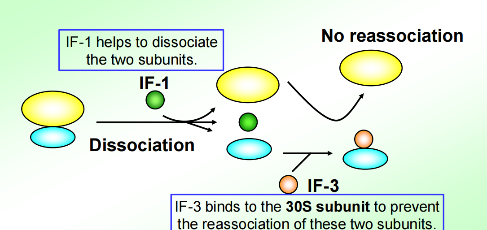 ^2fc7f4
2. Subunit 30S和mRNA结合→如何作用？在起始密码子前面有一段SD序列，由16SrRNA与mRNA的**SD sequence**结合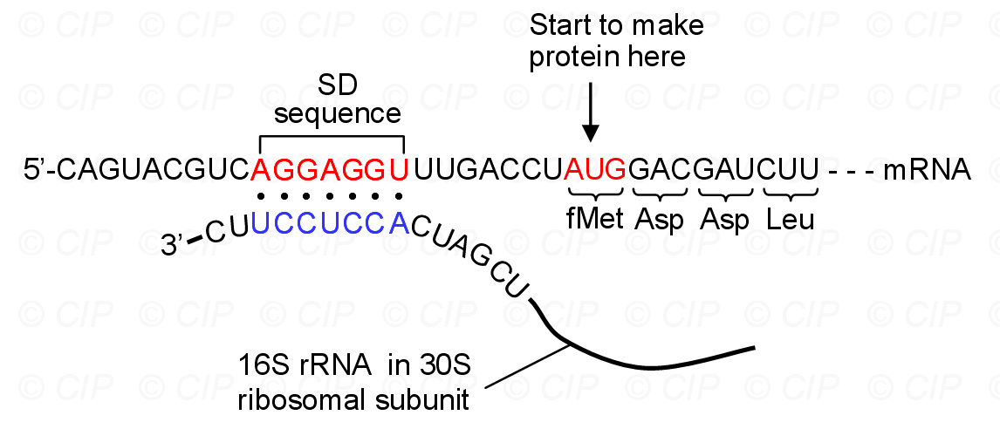
3. 当subunit 30S与起始密码子周围的SD序列结合后，起始tRNA开始结合到起始密码子AUG→携带N-甲酰甲硫氨酸methionine fMet
4. subunit 50S与30S结合，形成70S起始复合体，有三个tRNA的结合位点
	1. the A (aminoacyl, 氨酰基) site;
	2. the P (peptidyl, 肽基) site;
		- 起始tRNA直接进入P site，后续tRNA进入A site #易混淆 
	3. the E (exit, 退出) site.
#### 2.Elongation
1. tRNA entering, tRNA进入；
	- **elongation factors (EF)延伸因子**其中的EF-Tu协助新的tRNA结合到A site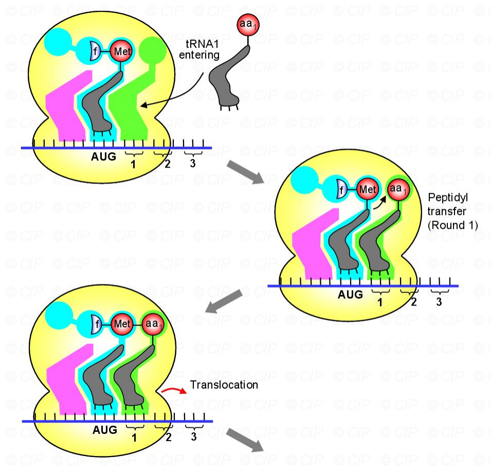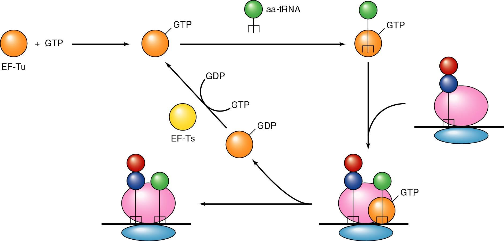
2. Peptidyl transfer, 肽基转移；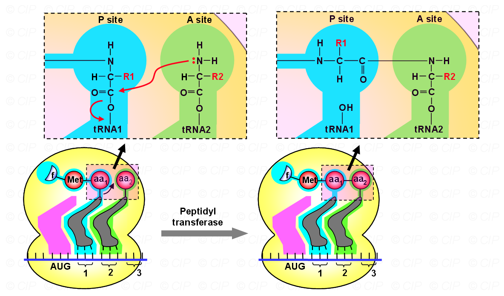
	- 在A site 的aatRNA上的氨基酸进攻多肽链，将多肽链结合到自己身上
3. Translocation,移位；
	- 这个过程需要EF-G来帮助
4. tRNA leaving, tRNA离开。
#### 3.Termination
- 核糖体遇到终止密码子的时候，翻译停止→没有tRNA可以与终止密码子UAG UAA UGA结合了👉[[#^8b4427]]
- Release Factors,RF
	- RF1 recognizes UAA and UAG ^06ab46
	- RF2 recognizes UAA and UGA
	- RF3 is a GTP-binding protein facilitating binding of RF1 and RF2 to the ribosome
- Non-Stop mRNAs→**tmRNA(transfer-messenger RNA)-mediated ribosome rescue)** →可以想象火车变轨
	- tmRNA 是一类兼具 tRNA 和 mRNA 功能的特殊 RNA 分子，3‘位带有丙氨酸，识别滞留的核糖体→进入A位
	- 通过转肽反应将滞留在P位的多肽连接→进入P位使得核糖体从mRNA上脱离下来
	- 核糖体结合在tmRNA的mRNA区域，并开始翻译一段信号肽，连接在刚翻译的多肽C末端，由tmRNA开放阅读框提供终止密码子
-------------
## 三、真核生物的翻译
#### 1. Initiation #重点 
- Different Initiator tRNA / 起始tRNA→携带的是甲硫氨酸Met
	- 起始tRNA如何与P位点结合？→P site has a special shape. This shape matches the alkylated initiator tRNA well. 
- Different mechanisms to initiate translation
	-  ==The scanning model / 扫描模型== 
		- 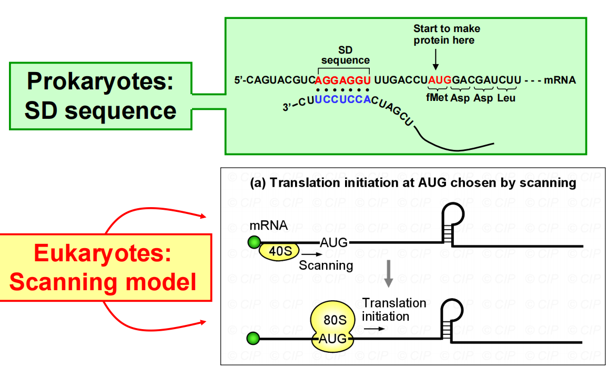
		1. 40S在mRNA的5’帽子附近结合 #易混淆 
		2. 40S开始往3‘端走，寻找起始密码子→大部分都会选择看到的第一个AUG
		3. 组成80S复合物
	- 通过直接进入IRES位点启动翻译
		- 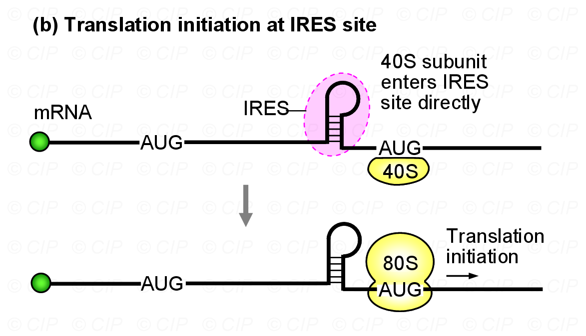
		- IRES: internal ribosome entry sequence：基本上都有几百个bp，并且会形成发夹结构
			- 例子：Picornavirus / 小核糖核酸病毒能够通过IRES直接在RNA内部启动翻译→不依赖宿主的翻译调控机制 #一些疑问 病毒的核糖体是来自于宿主吗？
		- mRNA二级结构的作用
			- 在帽子和起始密码子之间产生的茎环可能会阻碍扫描，终止翻译
			- 在5’端的二级结构可能有正面/负面影响 #一些疑问 比如？
			- AUG后面的发夹结构可能会导致
- Eukaryotic Initiation Factors(eIFs)
	- eIF2 binds Met-tRNA to ribosomes
	- eIF2B activates eIF2 replacing its GDP with GTP
	- eIF1 and eIF1A aid in scanning to initiation codon
	- eIF3 binds to 40S ribosomal subunit, inhibits re-association with 60S subunit
	- eIF4 is a cap-binding protein allowing 40S subunit to bind 5’-end of mRNA
	- eIF5 encourages association between 60S ribosome subunit and 48S complex
	- eIF6 binds to 60S subunit, blocks re-association with 40S subunit
- Process
	1. eIF3 与40S结合，阻止它与60S结合👉联系IF-3[[#^2fc7f4]]；接着由eIF2 促进起始tRNA的结合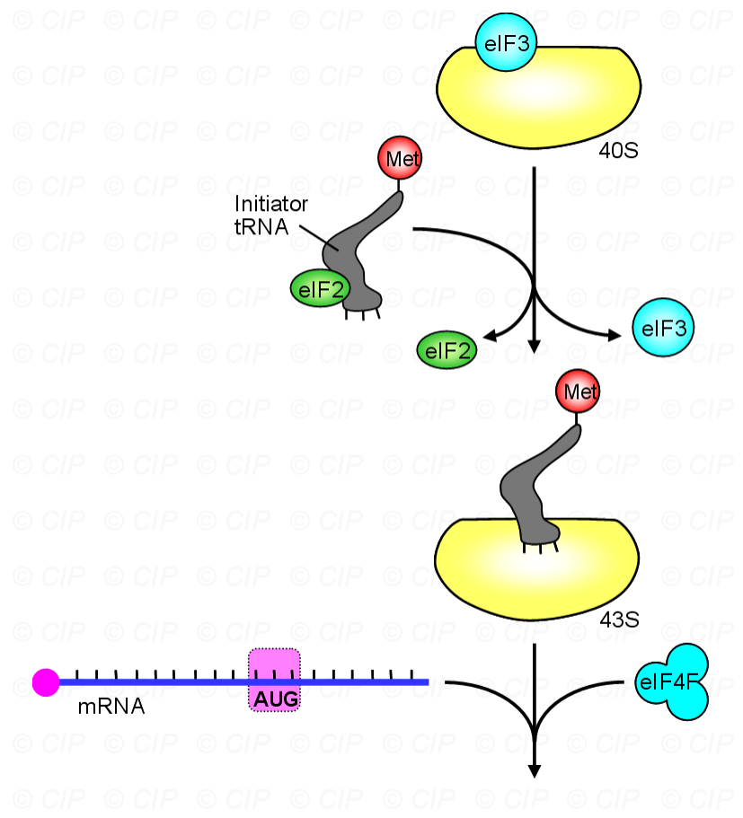
	2.  ==eIF4F与mRNA的帽子结合== ，帮助40S与mRNA结合 #学科链接 植物基因组学；此后eIF1 and eIF1A bind to the initiation complex来稳定这个复合体
		- 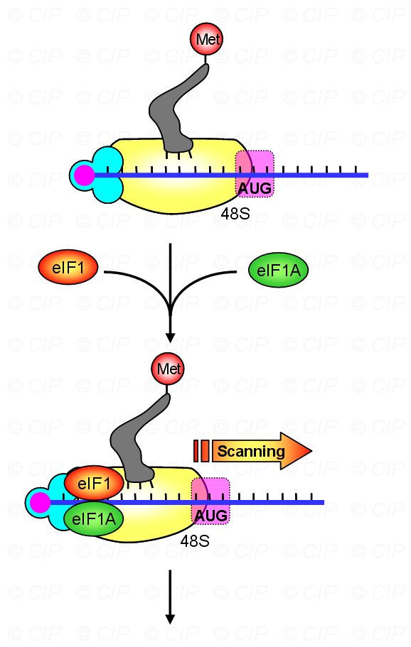
	3. 接触到起始密码子以后，eIF5 and eIF5B help the 60S subunit to bind to the 40S→80S起始复合物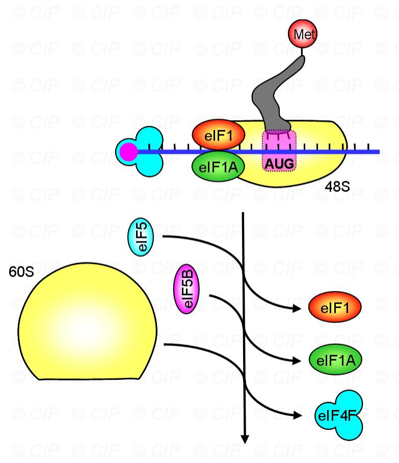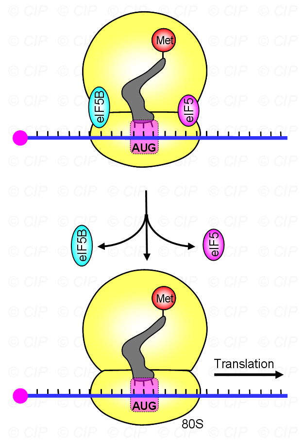
	4. 起始因子都跑掉了，剩下这一坨复合物来准备翻译 👆
#### 2.Elongation
- 和原核生物差不多
#### 3.Termination
- Eukaryotes has 2 release factors: #一些疑问 这些因子都是啥？→蛋白质
	- eRF1 recognizes all 3 termination codonsy👉[[#^06ab46]]区别原核生物，这里只需要两个释放因子去识别
	- eRF3 is a ribosome-dependent GTPase helping eRF1 release the finished polypeptide
- Aberrant Termination异常终止→真核生物没有tmRNA
	- 当核糖体在Poly(A)尾端停滞时，含有0到3个核苷酸的Poly(A)尾会被识别→Ski7p蛋白质的羧基末端结构域识别→非终止mRNA会招募Ski7p-exosome复合体到空的A位点→定位于非终止mRNA的末端，降解该mRNA→破坏异常的多肽链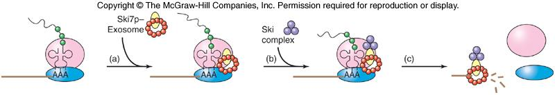
- 提前终止→都需要**Upf1蛋白**，一个直接把mRNA降解了，一个及时修正mRNA的错误
	- NMD (nonsense-mediated mRNA decay,无义介导的mRNA降解)： ==识别并降解开放阅读框中含有提前终止密码子（PTC）的mRNA== ，以避免因截短的蛋白产物积累对细胞造成毒害 #重点 
		- NMD效应子（如UPF1、UPF2和UPF3）被招募到含有PTC的mRNA上，形成“功能复合体”并激活降解过程。
		- 哺乳动物细胞EJC模型：测量终止密码子与exon-exon连接处的距离来识别PTC。如果终止密码子距离exon-exon连接处足够远，则被视为PTC，激活下游不稳定元素以降解mRNA
		- 酵母细胞识别提前终止密码子**Fuax 3’UTR**：通过识别异常的3’-UTR或poly(A)尾来感知PTC。核糖体在PTC处停止后，会移动到上游的AUG起始密码子，这可能导致mRNA被标记为降解。
	- NAS (nonsense-associated altered splicing,无义相关的可变剪接)：通过 ==改变剪接模式== 来处理提前终止密码子的机制。当在阅读框中间检测到终止密码子时，NAS会改变剪接模式，使提前终止密码子被剪接出去，从而避免产生截短的蛋白。
--------------------------
## 四、tRNA结构与摇摆
#### 1. 反密码子Anti-codons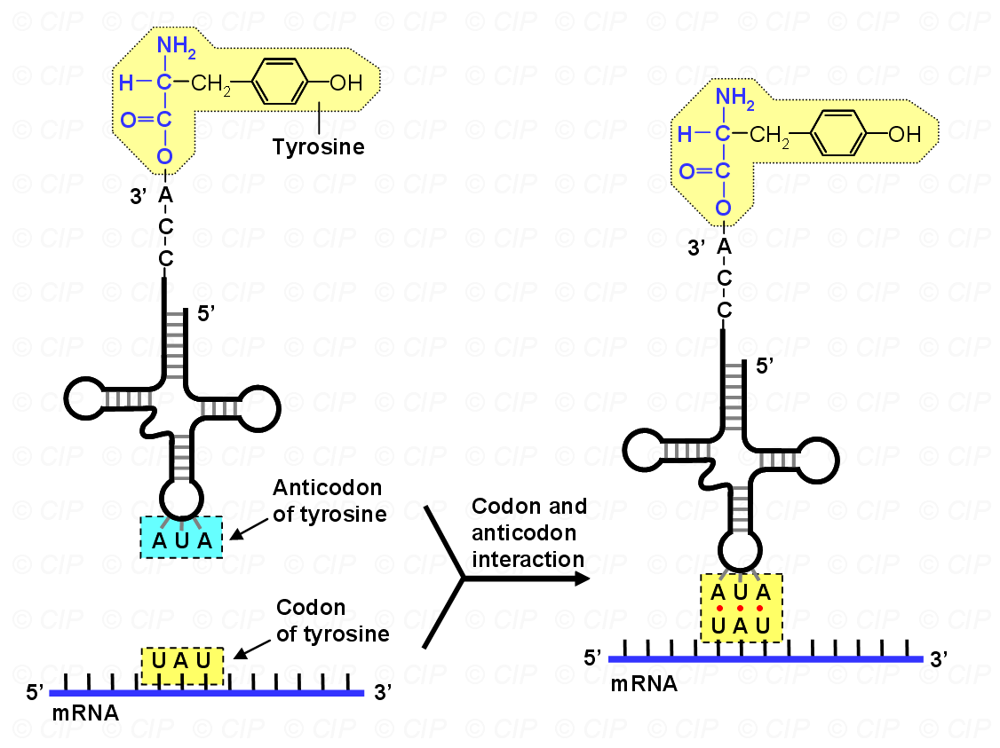
- **氨酰tRNA合成酶AARSs**：能够识别tRNA的反密码子并且将其与正确的氨基酸配对→顾名思义，就是把氨基酸和tRNA给结合了 #考过 
	- 目前总共发现了23种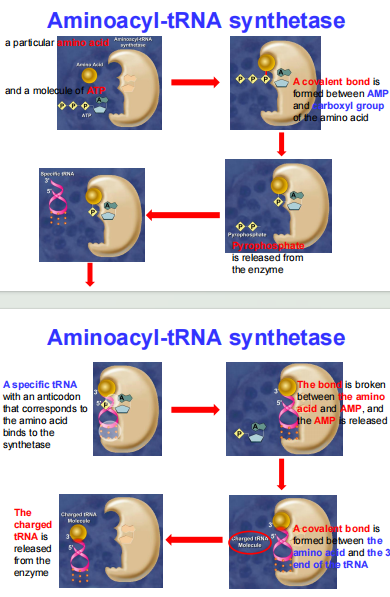
	- 其它功能：参与转录、内含子剪切、mRNA翻译、信号传导
#### 2. Wobble摇摆 
- 摇摆假说：摇摆是指tRNA的反密码子第一位的碱基与mRNA密码子第三位的碱基之间可以形成非严格的碱基配对。
	- **反密码子第一位的碱基**→与密码子第三位的多个碱基配对
        - **次黄嘌呤（I, Inosine）**：可以与A、U或C配对。
        - **尿嘧啶（U）**：可以与A或G配对。
        - **鸟嘌呤（G）**：可以与C或U配对。
- 意义：
	- 减少tRNA种类
	- 提高翻译效率：增加了tRNA与密码子配对的灵活性，从而提高了翻译的效率和准确性
	- 不同生物中密码子的使用频率不同，摇摆现象使得tRNA能够适应这些偏好，确保翻译的顺利进行
------------------
## 五、实验方法
#### 1. 确定遗传密码
- Single base mutations in a DNA sequence, and examining the protein produced→Single base mutations  ==never caused changes in more than one amino acid== 
- This indicated that each base was only involved in coding for one amino acid.
#### 2. 确定翻译方向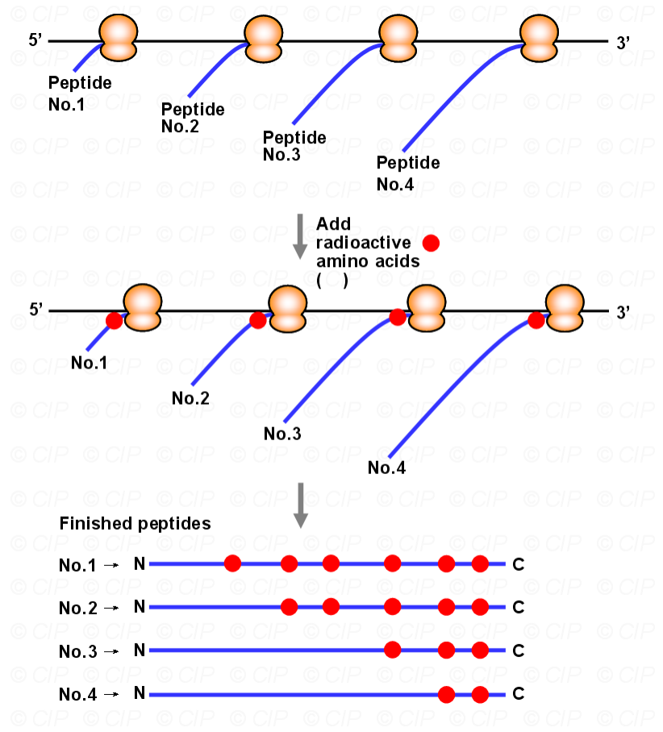
1. 让一定数目的核糖体在一条mRNA上生成蛋白质
2. 采取一定措施确保终止翻译
3. 加入放射性物质
-------------------
1. How many instances can you think of in which RNA has a function aside from coding for protein?
2. What are the various ways in which ribosomes choose the start site of translation?
3. What part of an mRNA are not used to make protein?What function do these parts serve? Answer the question for both prokaryotes and eukaryotes.
4. If you wanted CAU to code for glutamine (Gln, CAA or CAG), what change would you make to which gene in the cell?