## 一、组蛋白与转录

#### 1. 组蛋白的结构[[Chapter2 遗传物质研究]]
#### 2. 组蛋白的共价修饰covalent modification
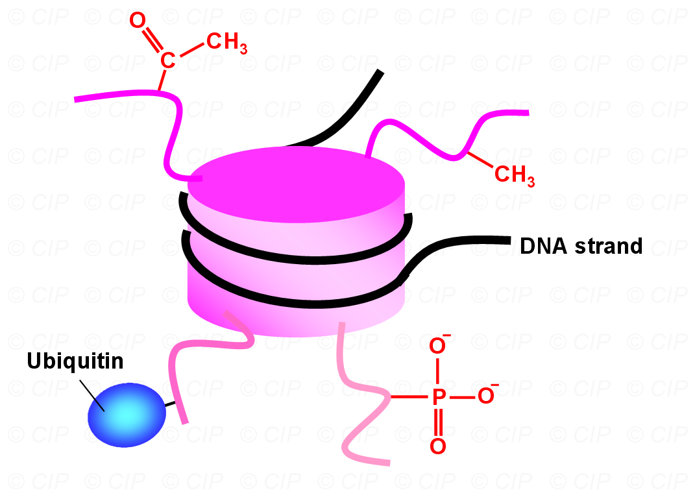
- 泛素化、磷酸化、甲基化methylation
-  ==乙酰化修饰acetylation== →组蛋白的正电荷被抵消，DNA从八聚体中释放
	- 只在特定的氨基酸上发生e.g.赖氨酸、精氨酸
- **组蛋白密码**：对某一个位置的修饰可能使DNA结合更加紧密→Activation，反之则Repression
	- The functional combinations of modifications at a histone are called the histone code
#### 3. 识别和修饰组蛋白的蛋白质
- **Swi/Snf complex**→能够识别乙酰化和甲基化的组蛋白，利用ATP的能量将组蛋白拉扯下来，能够 ==促进DNA的转录== 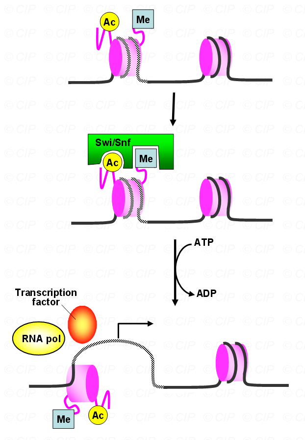
- 修饰组蛋白：**INF-β**
	1. INF-β基因上有许多的 ==增强子== →增强转录，吸引其它Activator
	2. Activator能够吸引其它的酶
		- HAT：acetylates H4-K8,H3-K9,H3-K14
		- Kinase:H3-S10

## 二、 转录后调控Post-Transcriptional Regulation[[Chapter7 真核生物mRNA的修饰]]
## 三、Nuclear Export细胞核输出
#### 1. 核孔复合体NPC的选择性运输
- 核孔复合体（nuclear pore complex, NPC）是细胞核与细胞质之间物质交换的通道。核孔复合体可以选择性地决定哪些分子可以进出细胞核。
	- 正常情况下只有成熟的mRNA才能通过核孔复合体进入细胞质。
	- 某些RNA分子含有特定的信号序列（如核输出信号，NES/NLS #学科链接 植物基因组学），这些信号帮助RNA分子与核孔复合体结合并被转运到细胞质。
#### 2. 热休克蛋白 mRNA 的输出
- 热休克蛋白（heat shock proteins, Hsp）是在细胞受到极端条件（如高温、缺氧等）时被激活的蛋白质。它们的mRNA输出受到特殊调控。
	- **极端条件下的调控**：在细胞受到极端条件时，热休克蛋白的表达会被迅速上调。此时，热休克蛋白的mRNA会被优先输出到细胞质。
	- **核孔复合体的作用**：热休克蛋白的mRNA在核孔复合体处被识别，并通过特定的核输出因子（如exportin）被转运到细胞质。    
#### 3. HIV mRNA 的输出
- **HIV mRNA 的特殊机制**：HIV病毒的mRNA含有特殊的序列（如Rev响应元件，RRE），这些序列能够与病毒编码的Rev蛋白结合。
- **Rev 蛋白的作用**：Rev蛋白与RRE结合后，形成一个复合体，该复合体能够与核孔复合体相互作用，从而将HIV mRNA输出到细胞质。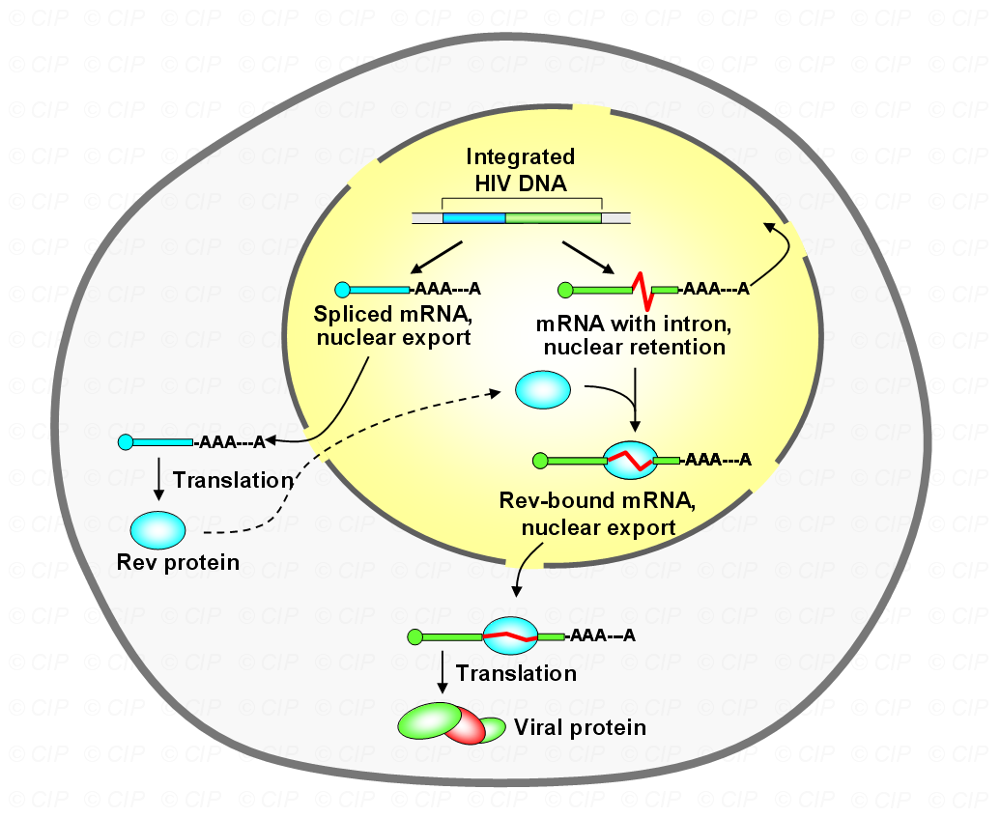
## 四、RNA的稳定性
- 正常的mRNA降解
	- RNase降解polyA部分，然后两头被吃掉
#### 1. 蛋白质对mRNA稳定性的调控
- Function of Protein  ==TTP== →属于锌指蛋白
	- 结合到ARE(AU-rich-region) sequence→位于3‘-UTR部分→可以招募Decay enzyme从中间向两头 ==将RNA降解== 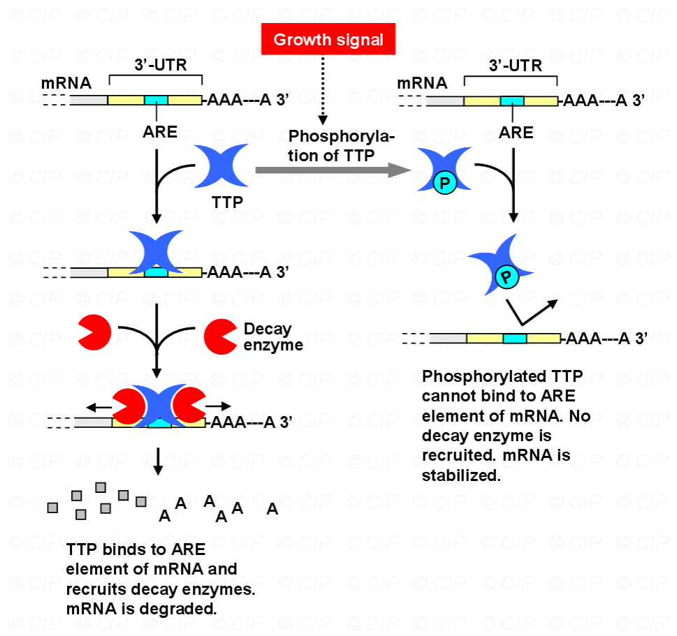
	- 如果将其磷酸化则丧失活性
- **运铁蛋白Transferrin**
	-  能够将两个三价的铁离子运到细胞去，在酸性条件下将铁离子释放，又run到外面去把别的铁离子运进来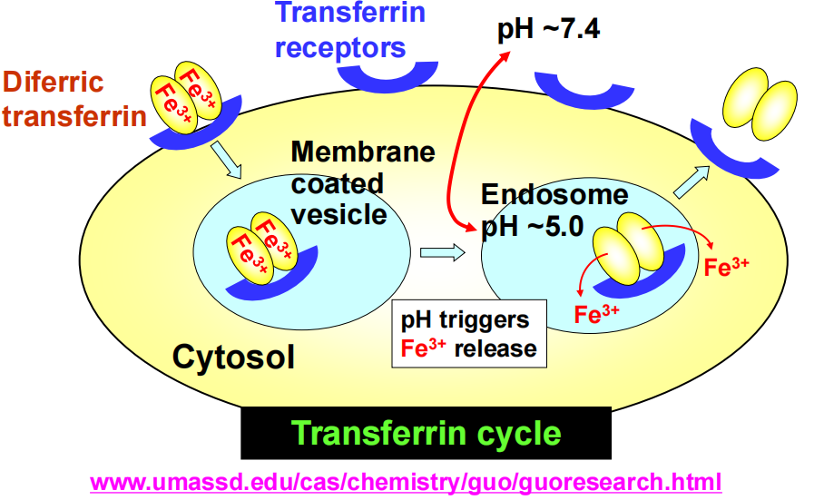
		- 酶：**顺乌头酸酶Aconitase**
		- 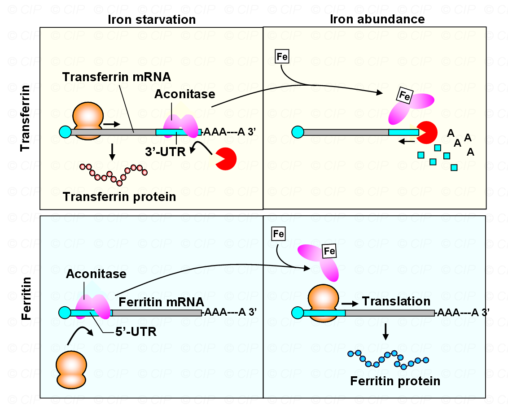
			- 当需要运铁时，结合到Transferrin的3’-UTR部分，促进Transferrin转录
				- 如何促进：防止核酸酶降解mRNA，帮助mRNA进入细胞质
			- 不需要时Fe结合到顺乌头酸酶身上，编码运铁蛋白的mRNA被降解
		- 需要与铁蛋白区别→[[#^c76f24]]
#### 2. 小RNA的调控 #学科链接 植物基因组学
- 类别
	- **dsRNA**：双链，长于30nt→是siRNA的前体
	- **miRNA**：21-25nt； ==内源基因编码== ；发夹前体
		- 可以识别多个靶标→与成熟mRNA的3‘-UTR配对
		- Origin：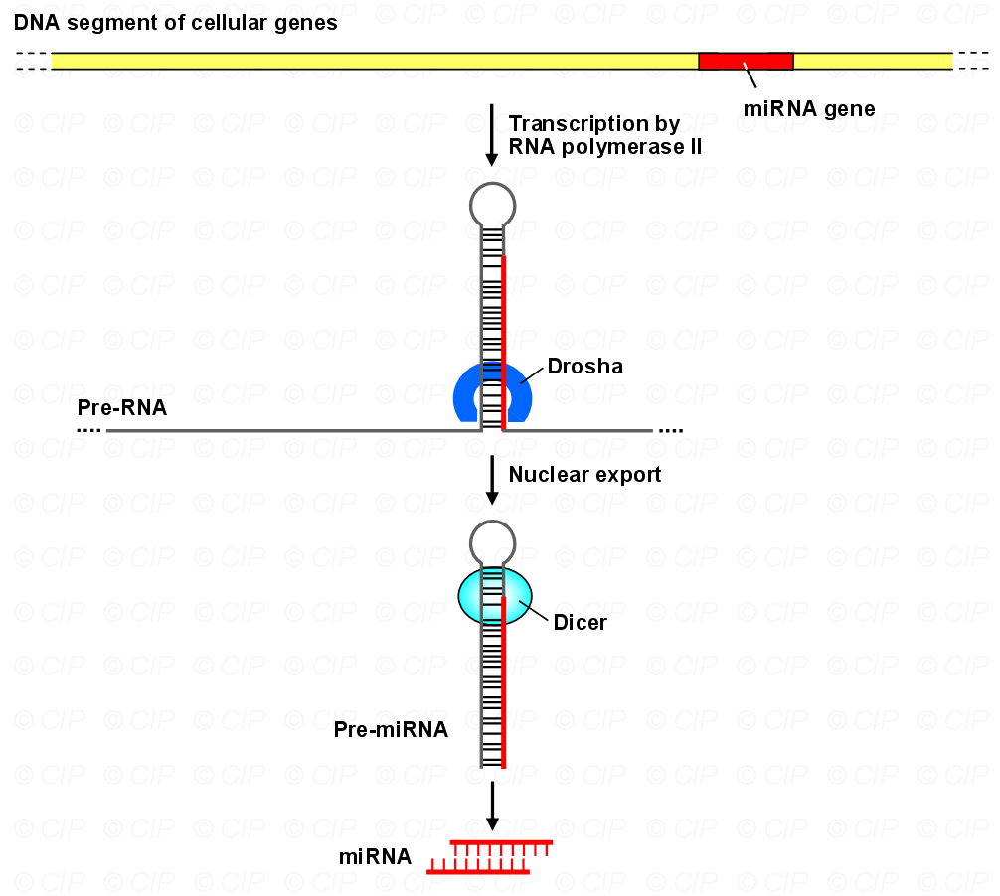
	- **siRNA**：21-25nt； ==不是基因== ，多为外源基因（病毒感染/人工合成）编码
		- 多靶点特异→与靶 mRNA 完全互补配对，直接导致 mRNA 降解（高度特异）
- RNAi干涉：siRNA或miRNA诱导目标mRNA降解的过程 #重点 #考过 
	1. siRNA或miRNA被降解unwind后，与蛋白质结合形成RISC(RNAi silencing complex)
	2. RISC与目标mRNA结合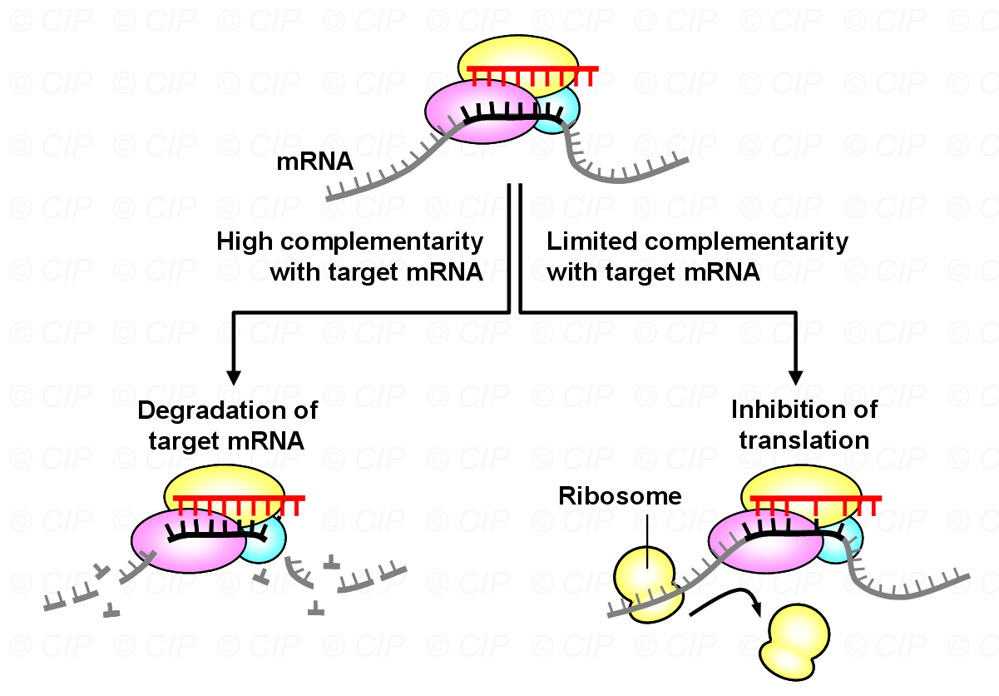
		1. 如果与mRNA的ORF区域高度互补，则形成双链结构降解mRNA→植物体内siRNA
		2. miRNA 与mRNA的3’UTR 区域较为松散的结合（即允许更多错配），抑制mRNA的转录后翻译→动物体内miRNA
	- RISC(RNAi silencing complex)的结构特征
		- 成熟的 miRNA与RISC结合。RISC含Dicer及其他蛋白质。RISC又称 miRNP，和 miRNA结合的RISC称为“ miRISC"
		- Dicer 加工pre-miRNA与RNA双链解旋偶联，解旋的 miRNA只有一条单链保留在RISC中。
		-  ==argonaute(Ago)是RISC的核心成分== ，为 miRNA诱导的基因沉默所必需。Ago含有两个RNA结合域：
			- PAZ→与成熟 MIRNA的3' 端结合
			- PIWI→和引导链5'端 #一些疑问 结合，使其和靶mRNA互补
	- 应用：
		- 研究基因功能→Knockout
		- 抑制不利基因的表达→抑制乙烯基因表达以延长果实保鲜期
## 五、翻译调控
#### 1. 全局控制Global Control #待解决 
- 对细胞中所有mRNA的翻译进行不加区别的调控→通过调节翻译起始因子的活性来实现
	- 磷酸化修饰：
		- eIF2B 帮助 eIF2 将GDP替换为GTP，从而促进起始tRNA与40S核糖体亚基的结合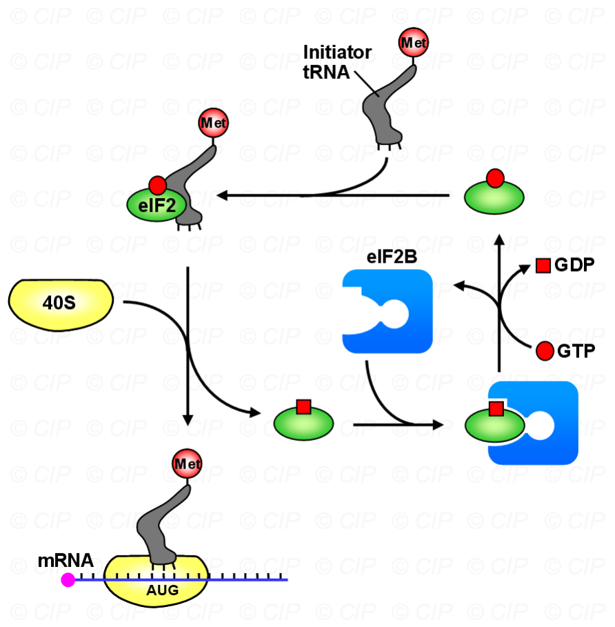
	- through 4E-BP：去磷酸后与el4E结合，使其构象变化无法结合帽子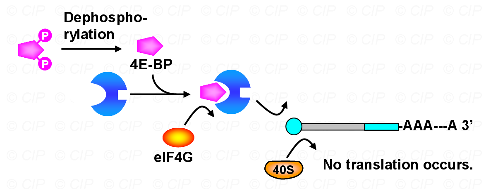
#### 2.mRNA特异性控制
- mRNA with CPE
	- **CPE: Cytoplasmic Polyadenylation Element细胞质聚腺苷酸化元件**→含有CPE序列的mRNA可以通过与CPE结合蛋白（CPEB）相互作用，调节其翻译效率
	- CPEB与Maskin相互作用→Maskin类似于4E-BP，与eIF4E结合并阻止其与eIF4G的相互作用，从而抑制mRNA与核糖体的结合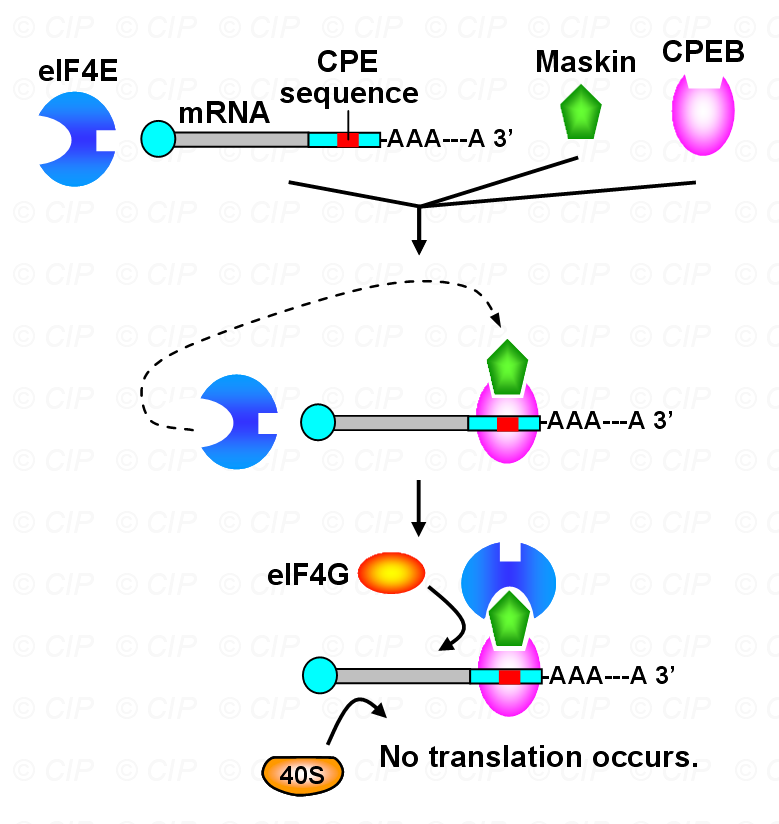
- Ferritin #重点  ^c76f24
	- 当细胞中铁的含量高时→铁离子结合至顺乌头酸酶→阻止其与5‘-UTR结合→启动翻译
	- 含量低时→顺乌头酸酶结合至5’-UTR抑制翻译
		- #一些疑问 5‘-UTR有啥作用？→起始密码子之前的一段序列
			- 核糖体结合与扫描→长度决定了扫描的效率
			- 促进翻译起始复合物的形成
			- 5'-UTR中的二级结构（如发夹结构、茎环结构）可以显著影响翻译效率。稳定的二级结构可能阻碍核糖体的结合和扫描，从而抑制翻译
			- 某些病毒和真核生物的mRNA在5'-UTR中包含IRES序列，允许核糖体直接结合到IRES位点[[Chapter8  翻译(原核+真核)]]
## 六、mRNA定位
- 细胞并不是分子的均匀混合物。某些蛋白质需要在细胞的特定区域合成，而其他蛋白质则必须排除在某些区域之外。这种定位对于形态复杂的细胞（如神经元）尤为重要。
#### 1.mRNA定位的三种机理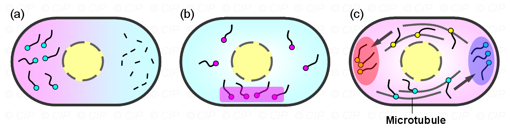
- **区域特异性降解 (Regional Degradation)**：某些mRNA在细胞质的特定区域被快速降解，而在其他区域则被保护并稳定下来
- **区域特异性捕获 (Regional Trapping)**：某些mRNA在细胞核或特定的细胞器附近被捕获，从而确保其翻译产物在这些区域发挥作用
- **主动运输 (Active Transport)**：最常见的机制是通过马达蛋白（motor proteins）将mRNA主动运输到需要其编码蛋白的特定区域
#### 2.β-actin mRNA的定位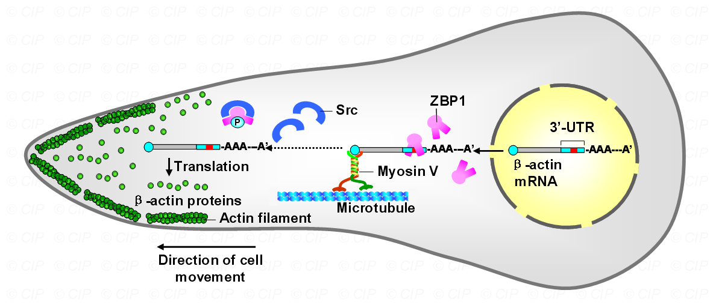 #待解决 

#### 3. 生物学意义
- 提高蛋白质合成速率
- 相应环境变化
- 调控蛋白功能

## 七、蛋白质调控
#### 1. 表观遗传学Epigenetics：基因的DNA序列不发生改变的情况下，基因表达的可遗传的变化
- DNA甲基化DNA Methylation
	- 大多发生在CG岛，影响基因的转录活性。例如，启动子区域的CG岛甲基化通常会抑制基因表达
- 组蛋白修饰（Histone Modification）：影响染色质结构，进而影响基因的转录活性
- 基因组印记（Genomic Imprinting）
- 染色质重塑（Chromatin Remodeling）
- 非编码RNA （Non-coding RNA ）
## 八、实验研究
#### 1. 线珠结构
- 研究核小体的结构和DNA的包装方式
- 用DNase处理核小体以后，得到缠绕在核小体上的DNA，可以拿去跑胶→发现是150bp左右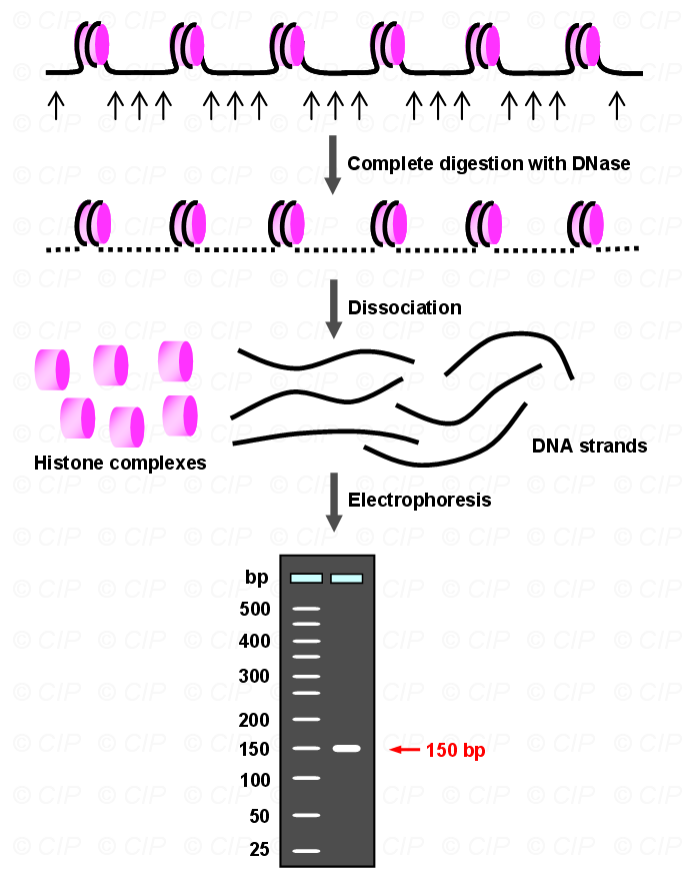
#### 2.异染色质中基因表达的阻遏
- 让相应的基因在常染色质和异染色质上跳跃→异染色质中基因的表达受到抑制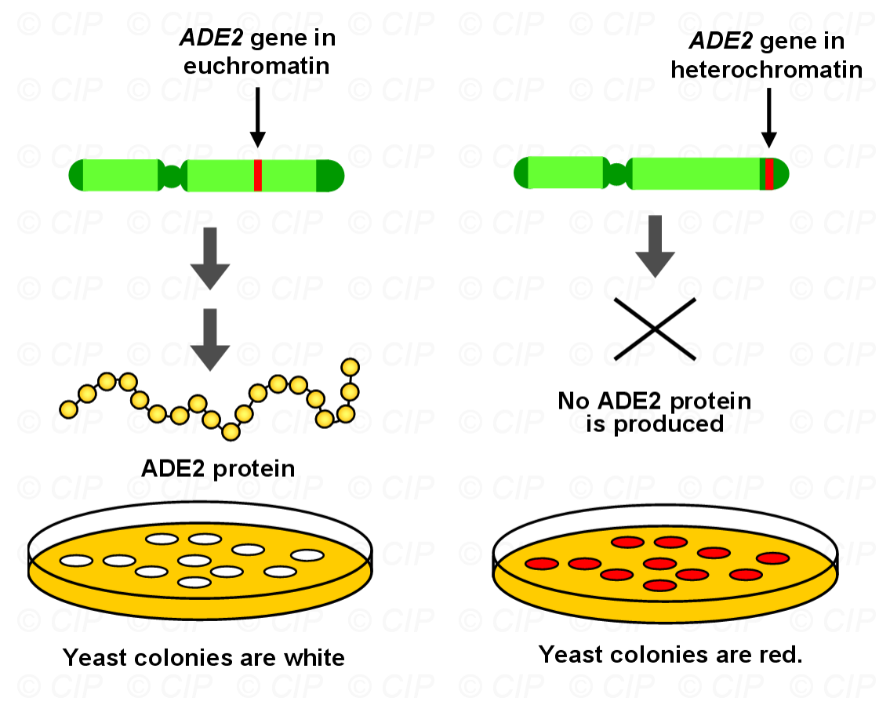
-----------
1. What are the two major functions of histones? How does the structure of histones make them so well suited for these two functions?
2. Histone structure is very conserved between different eukaryotes. Is this surprising? Why or why not?
3. What are some of the differences between siRNA and miRNA?
4. By looking at the DNA sequence of a protein, what aspects of the regulation of its expression might we be able to predict?