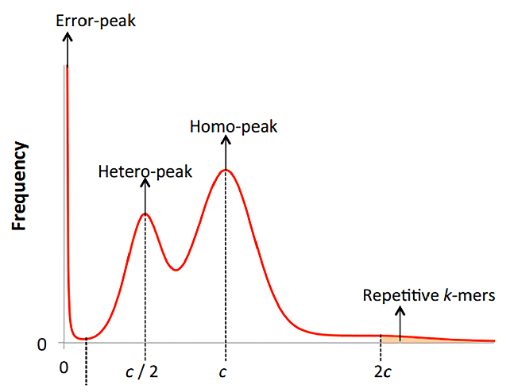
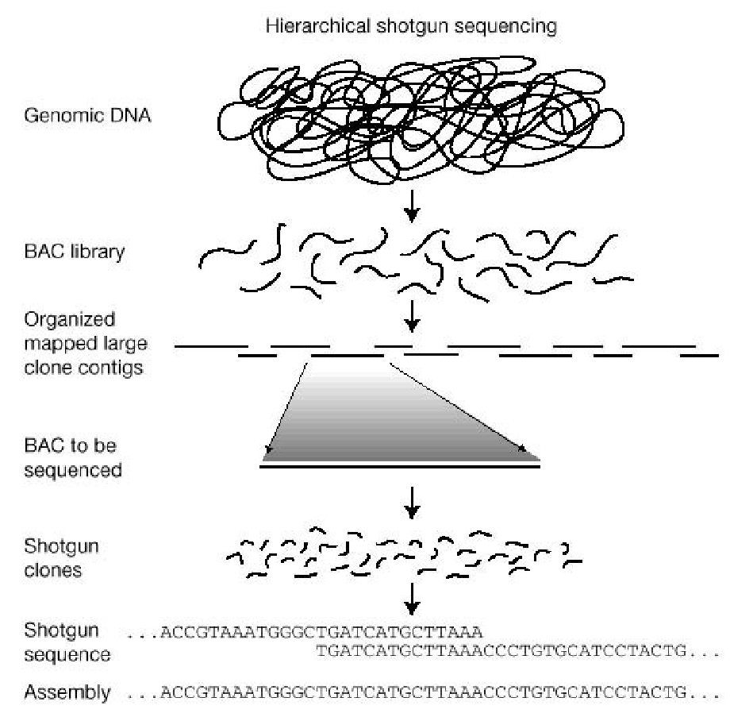
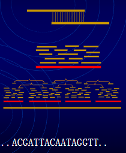
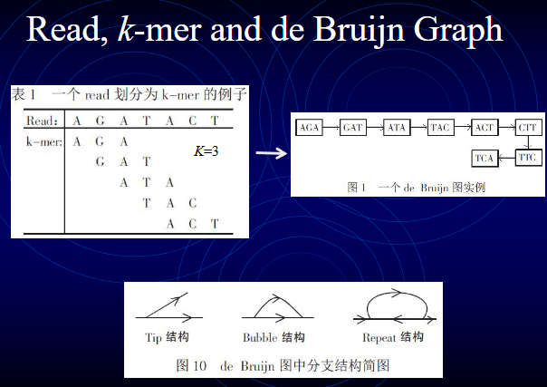
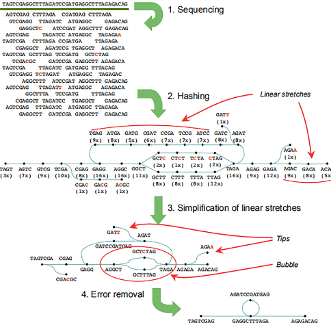
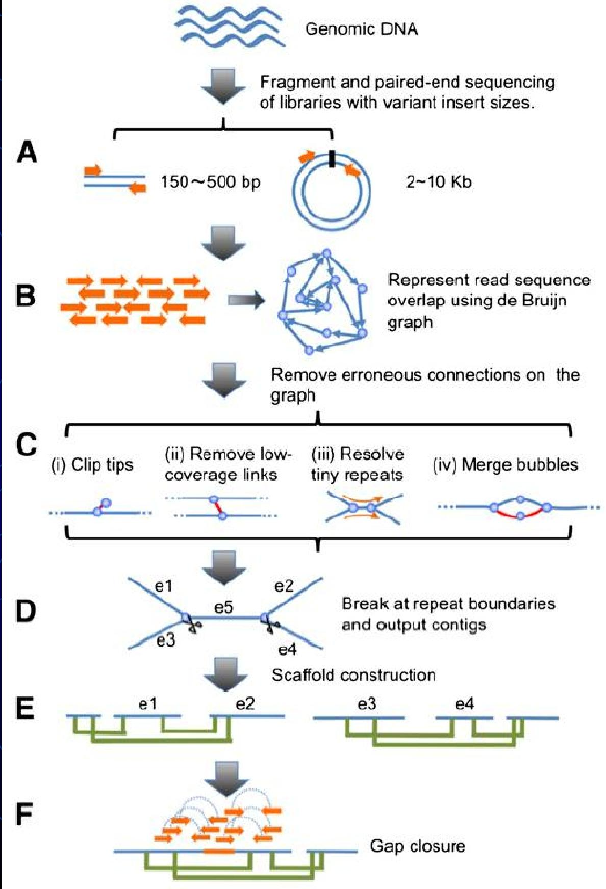
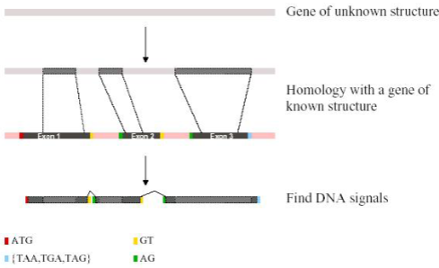
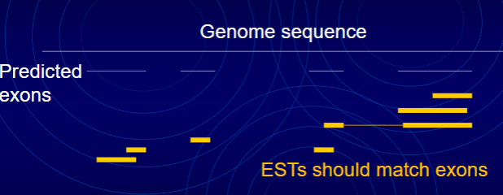
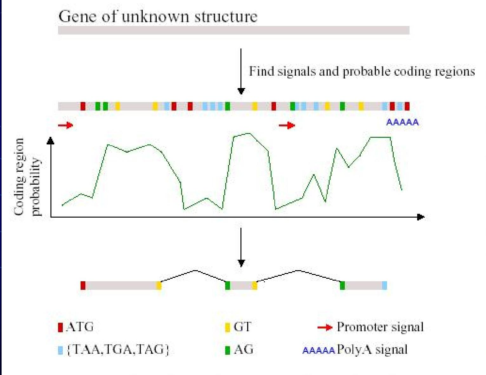

#### 基因组概貌调查
1. 细胞遗传学分析
2. 基因组调查测序与*k-mer*分析
	- Genomewa size estimation based on *k-mer
		- ***k-mer***：完整连续序列中随机选取的长度为k的片段
			- 若read长度为L，*k-mer*长度为K,则可以得到L-K+1个*k-mer*
	- Lander-waterman算法：当达到一定覆盖度时，根据k-mer数量和深度估计G的长度
		- G=Knum/Kdepth
	- *k-mer*深度分布曲线：受到基因组杂合度/倍性和重复序列构成的影响，因此可以用于 ==评价基因组杂合度和重复序列比例== 
#### 植物基因组测序
- Gene Sequencing:
	- Strategy:
		- clone by clone
		- whole genome shotgun,WGS
	- Methods
		- Sanger method:
		- two-generation sequencing/NGS
			- 需要对荧光信号进行识别
			- 存在GC偏好性以及**读长较短**
			- 通量大、成本低
		- Third generation sequencing,TGS/单分子测序SMS
			- 错误随机，平均读长较长，并且可以跨过重复序列区域

#### 植物基因组拼接组装
1. 基因组拼接
	1. 全基因组鸟枪法测序
	2. 原始序列的矫正和质量控制
	3. 基因组*de novo*组装
	4. 基因组组装改善提升
2. 组装算法
	- **OLC(Overlap-Layout-Consensus)**：适用于 ==长测序读序== 
		- Overlap：找到可能存在的重叠测序读段(reads)
		- Layout：将测序读段合并成重叠群（contigs），并进一步将重叠群合并成超级重叠群（supercontigs）。
		- Consensus：推导出 DNA 序列，并纠正测序读段中的错误。
	- **de Bruijn Graph(DBG)** 德布鲁因图算法：用于高通量测序数据拼接的主要算法，适合处理大量具有重叠关系的 ==短序列== →第二代测序
		- 短序列读序拼装难题：我们不知道基因组整条序列如何排列成为一条染色体，也无法实现一次把整条长序列完整测序
		- 
3. 染色体水平组装
	- 遗传图谱
	- 基因组组装新技术
		- Hi-C技术
		- Chicago技术
		- 光学图谱技术
	- 组装质量评估
		- 拼接指标e.g.ContigN50,Scaffold
		- 校正后的测序数据比对到拼接基因组上的比例
		- 利用已发表的数据库/软件
		- BioNano光学图谱/BAC序列
#### Appearance of Genome

#### Gene finding strategies
- Homology method
	-  Coding regions evolve slower than non-coding regions, i.e. local sequence similarity can be used as a gene finder. 
	- Homologous sequences reflect a common evolutionary origin and possibly a common gene structure, i.e. gene structure can be solved by homology (mRNAs, ESTs, proteins, domains). 
	- Standard homology search methods can be used (BLAST, Smith-Waterman, ...).
	- Include ”gene syntax” information (start/stop codons, ...).
		- EST/RNA-Seq reads can be helpful in confirming a gene model
			- 预测外显子在基因组序列中以黄色线段表示
			- EST(表达序列标签)应该与外显子匹配
			- 补充可能需要逆转录PCR填补缺口，并且要获得完整的cDNA序列；同一mRNA在不同组织中可能存在不同的间接方式，从而产生不同的蛋白质
- *Ab initio* method从头预测法
	- 对未知结构基因进行分析，寻找信号和可能的编码区域（Find signals and probable coding regions）。不同颜色标识了特定的 DNA 序列元件*红色的 ATG（起始密码子）、浅蓝色的 {TAA, TGA, TAG}（终止密码子）黄色的 GT 和绿色的 AG（可能与剪切位点相关）*
	- 编码区域概率（Coding region probability）变化。概率曲线的波峰区域暗示着可能的编码区域。

#### 基因组领域急需解决的关键技术
- 大基因组de novo组装算法与软件开发
- 大基因组注释核心技术开发 
- 比较基因组与进化分析核心技术开发 
- 大基因组重测序数据分析核心技术开发