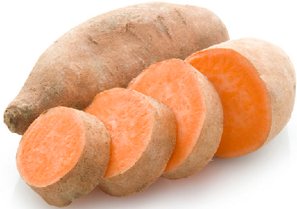
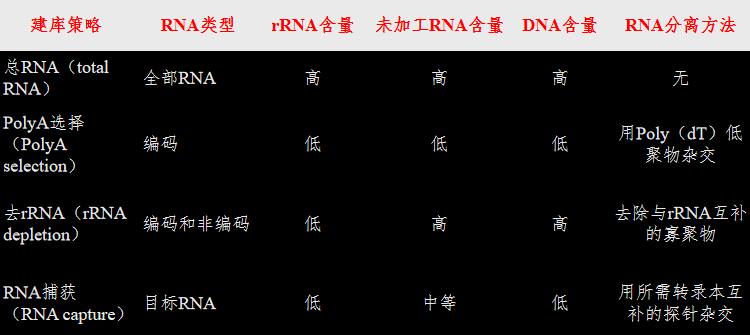
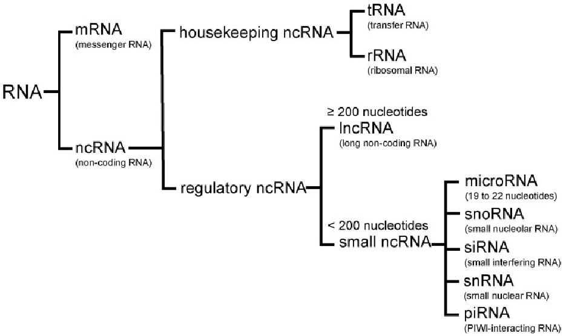
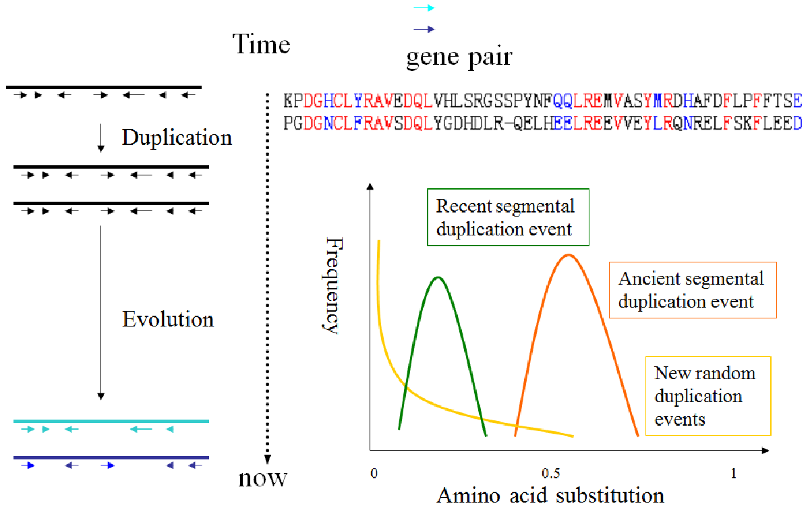
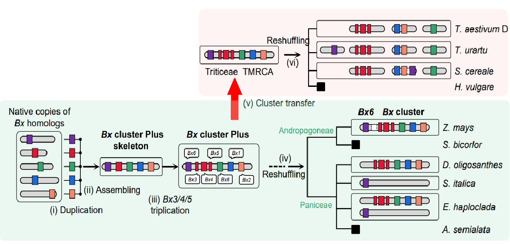
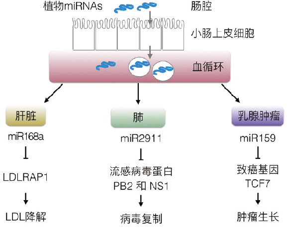
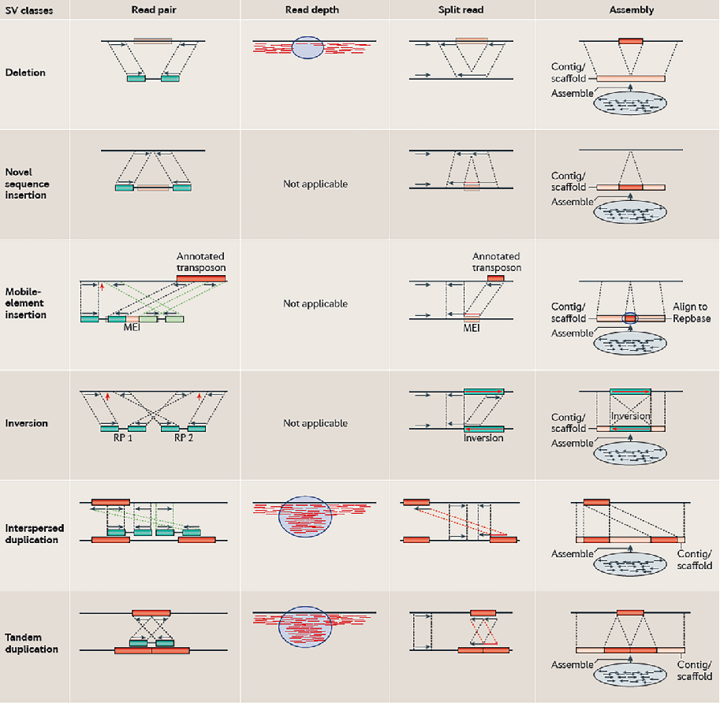
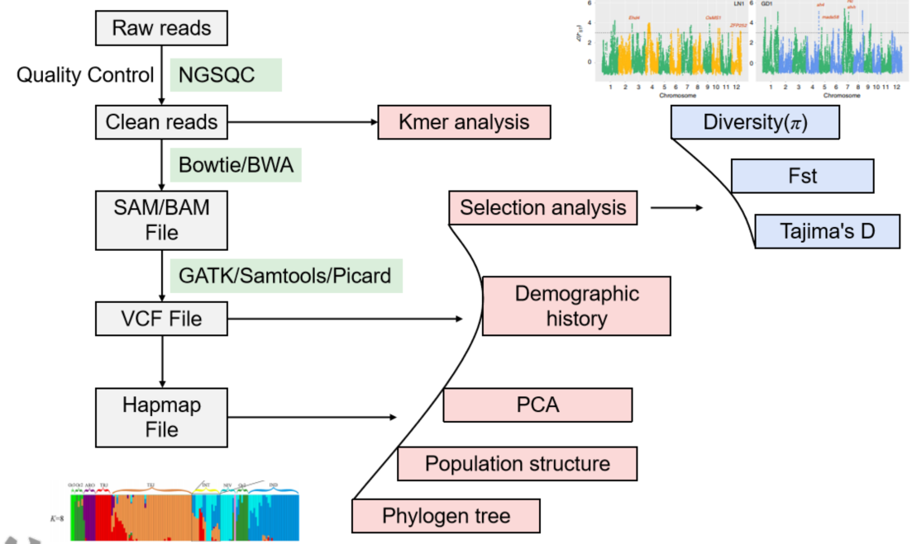
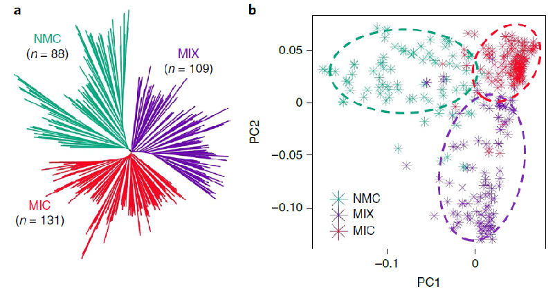
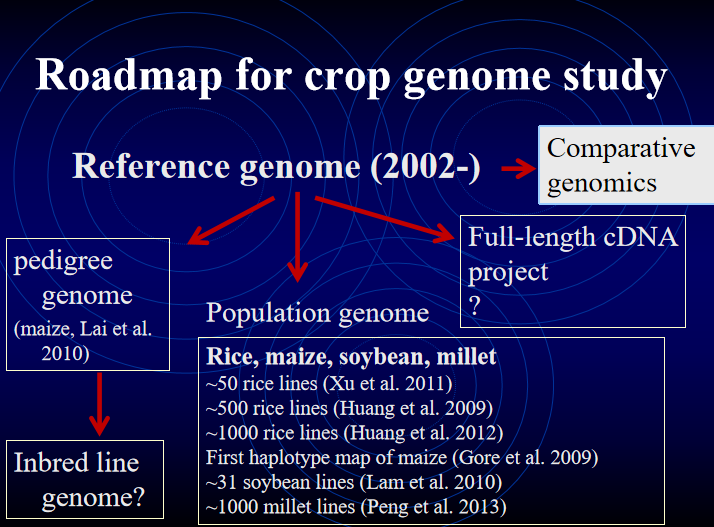

#### Questions before class:
- “组成”具体指的是什么？
- 如何分别这些组分
- 植物基因组组成与其它生物有什么区别

#### 转录组测定
- 建库方法比较
- 转录组组成
----
#### Plant genome evolution
- via du-/triplication
	- Genome duplication
	- Evolution
		- 绿色的曲线是 “Recent segmental duplication event”（近期片段复制事件），说明这个事件在氨基酸替代程度比较小的时候发生得比较频繁；橙色的曲线 “Ancient segmental duplication event”（远古片段复制事件），它的高峰在氨基酸替代程度中等的时候，说明这种远古发生的复制事件，到现在氨基酸变化到一定程度时数量比较多；黄色的曲线 “New random duplication events”（新的随机复制事件），随着氨基酸替代程度增加，发生的频率越来越低 。
		- For rice:
			- Most of the duplicate events were found to occur at a similar time,which strongly suggested that chromosomes duplicated in rice history
			- A duplicate event between chromosome 11 and 12 occured recently 
- via other ways
	- transposable element(转座元件)
		- 全基因组倍增
		- 基因水平转移horizontal gene transfer,HGT
			-  ==详细过程参考豆包== 
			- 寄生植物向宿主植物横向基因转移
				- 菟丝子可以向宿主植物(拟南芥等)横向转移大量mRNA和miRNA基因→why?
			- 微生物可以向植物横向基因转移
				- 农杆菌向植物转移→转基因技术
			- 植物跨界调控
				- 植物微小核糖核酸miRNA运输至不同器官后，在肝脏能够促进低密度脂蛋白LDL降解，从而影响脂类代谢……miR159可以抑制肿瘤生长，具有抗癌功能（Zhang et al., 2012; Zhou et al., 2014; Chin et al., 2016.）
- Genomic variations：
	- SNP(Single Nucleotide Polymorphisms):单核苷酸多态性，指单个核苷酸位置上存在的变异。
		- π（Tajima 1983）：平均两两核苷酸多样性，用于评估群体中核苷酸序列的差异程度。
		- θ（Watterson 1975）：Watterson 估计值，指每个核苷酸位点的分离位点数，也是衡量群体遗传多态性的一个重要指标。
	- Indel:代表插入（insertion）和缺失（deletion），也就是在基因组序列中插入或缺失了一些核苷酸片段 
	- **Structural variation（SV，结构变异）**：指生物体染色体结构的变异，包含一个物种基因组中的多种变异类型，通常有微观和亚微观类型，如 ==缺失、重复、拷贝数变异、插入、倒位和易位等== 。一般结构变异影响的序列长度约在 1 千碱基对（Kb）到 3 兆碱基对（Mb）之间，比 SNP 影响的范围大，但比染色体异常影响的范围小。→可以联系遗传学的内容
		- 可移动元件(转座子)是基因组中一段能够自主移动的DNA序列，新序列是不存在DNA中的序列
----
#### 群体基因组学
- 研究意义
	- 可以解答作物起源进化、育种选择的问题，确定选择位点
	- 目前最为活跃的研究领域之一，作物科学的重要方向
- 分析过程
	- 
	1. 原始数据处理：分析Raw reads，得到Clean reads
	2. 数据比对与格式转换：进行k-mer分析，评估基因组特征(联系1-2)，并且使用软件生成SAM/BAM file，并生成其它格式(VCF)文件
	3. 群体遗传学分析
		- 选择分析
		- 群体历史
		- 主成分分析(PCA)
		- 群体结构
		- 构建系统发生树

#### 作物基因组研究
- Crop and artificial selection
	- Domestication bottleneck驯化瓶颈：大量的遗传变异被丢失，只有一小部分基因能够 “流过” 瓶颈，最终形成了驯化种群相对较低的遗传多样性状态。Domestication bottleneck=domestication selection+demography effect
		- domestication selection驯化选择：在植物或动物驯化过程中，与目标性状相关的基因被保留和富集，而许多其他基因，特别是那些与野生生存适应性相关但对人类需求不重要的基因，会随着时间的推移而丢失。这就导致了遗传多样性在驯化过程中开始减少，就像一个漏斗开始筛选，只允许符合人类需求的基因 “通过”。
		- demography effect种群统计学
	- Roadmap for crop genome study
		- 

#### Evolution of non-coding RNAs:

  
----
### 来自豆包的总结

1. **植物基因组里都有啥**：科学家统计了 63 种植物的基因组，发现植物的基因数量、长度等都不一样。打个比方，基因就像 “小零件”，平均每种植物有 32490 个这样的 “小零件” 。而且这些 “小零件” 还能 “生产” 出不同的 RNA，有像 “信使” 一样传递信息的 mRNA，还有各种 “监管员” 非编码 RNA，它们一起控制着植物的各种生命活动。
2. **植物基因组是怎么变的**：植物的基因组不是一成不变的，它会 “变身”。有时候，整个基因组会像复印一样加倍或三倍化，就好比把 “生命说明书” 多印了几份。水稻就经历过这样的事儿，大部分染色体的复制差不多发生在同一时期，不过 11 号和 12 号染色体在更晚的时候又复制了一次。除了这种 “大变身”，基因组还会通过转座元件跑来跑去，或者从其他植物、微生物那里 “借” 基因，这就是基因水平转移。就好像植物在和周围的小伙伴交换 “生命说明书” 的部分内容。
3. **基因组的那些变化**：基因组在传递过程中还会出现一些 “小差错”，这就是变异。常见的变异有 SNP（某个 “字母” 变了）、Indel（插入或删掉一些 “字母”）和结构变异（比如一段 “文字” 颠倒了或者重复了）。这些变异就像是 “生命说明书” 里的错别字或者排版错误。通过研究这些变异，我们能知道植物是怎么进化的，比如稗属植物的分类一直很混乱，研究基因组变异就能帮我们理清它们的关系。
4. **研究植物基因组有啥用**：研究植物基因组对了解作物很有帮助。我们可以知道作物是从哪儿来的，比如水稻可能是 “一次起源，两次驯化”。还能找到人工选择的 “痕迹”，也就是人们在育种时，哪些基因被选中了，这些基因会影响作物的各种性状，像落粒性、分蘖角等。而且，研究基因组变异还能帮助我们搞清楚作物育种的遗传传递，就像知道家族里的特征是怎么一代一代传下来的，这样就能更好地培育出优质的作物品种啦。