## SECTION1 Water in plant life 
#### 1. Structure and Porperties of water
- properties
	-  Water is a polar molecule with **hydrogen bond** among water molecules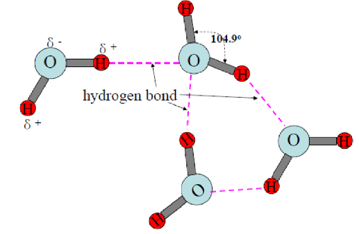
	- High dielectric constant (介电常数) and an excellent solvent (溶剂)
	-  High specific heat and latent heat of vaporization (高比热和高蒸发潜热)
	- Great surface tension and cohesion (表面张力和内聚力）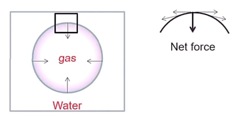
		- 增加气液界面表面积所需的能量成为表面张力
#### 2. Water content and status in plant
- Content
	- Depends on plant types:Herbs>trees
	- Growth environments:shade plants > heliphyte(sun plants)
	- Organs：Stem tenders and root tips> 90%
		- the higher life activity, the higher water content
- Status #名词解释 
	- **Free water**:It does not tightly bind to components of cell and it moves freely in plant. 
	- **Bound water**:It tightly binds to components of cell and can not move freely in plant. 
- Water Status and its relationship with metabolism in plant
	1) Free water participates in  ==metabolism== , takes as solvent and easily freeze.
	2) Bound water does not participate in metabolism, not to take as solvent and not to freeze easily.
	3) Plant metabolic activity, growth and resistance are all dependent on the ratio of free water to bound water.
		1) The higher ratio, the higher metabolism and the faster growth, but lower resistance because protoplasm is of sol (溶胶
		2) The lower ratio, the lower metabolism and the slower growth, but higher resistance because protoplasm is of gel（凝胶）
#### 3. Role of water in plant life
1. Component of protoplasm：Protoplasm in plant contains 70～90% water.
2. Substrate for plant metabolism：Photosynthesis, respiration and biosynthesis or degradation of organic substance.
3. Solvents for absorption and transportation
4. Keeping plant in shape (extension)
5. Balance plant temperature

---
## Section2 Water absorption by plant cell
#### 1. Osmotic absorption of water by plant cell #重点 
##### 2.1.1 Water potential
- Concepts:每偏摩尔体积水的化学势差。水势反应了植物系统中化学反应以及运动的能力。Water potential is defined as the difference in chemical potential per unit volume, between  ==metrically-bound, pressurized, or osmotically-constrained water==  and pure water. Ψw reflects the capacity for chemical reaction and movement in plant system.
	- Suppose:Ψw0 of pure water is zero.
	- 溶液越浓，水势的绝对值越大
- **Diffusion(扩散)**:substance transfers from higher energy (concentrations) to lower energy (concentrations).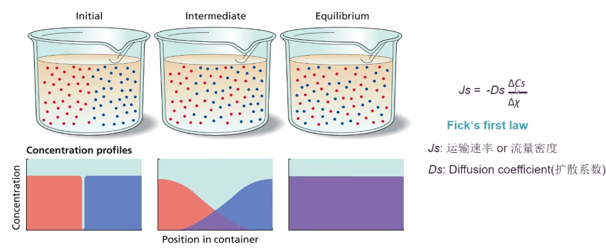
##### 2.1.2 Osmosis
- **Osmosis (渗透作用, Greek word-pushing)** : the net movement of water across a selectively permeable barrier (such as semipermeable membrane, biological membrane) from higher Ψπ to lower Ψπ.
	- 渗透作用指溶剂分子通过半透膜的扩散作用
	- 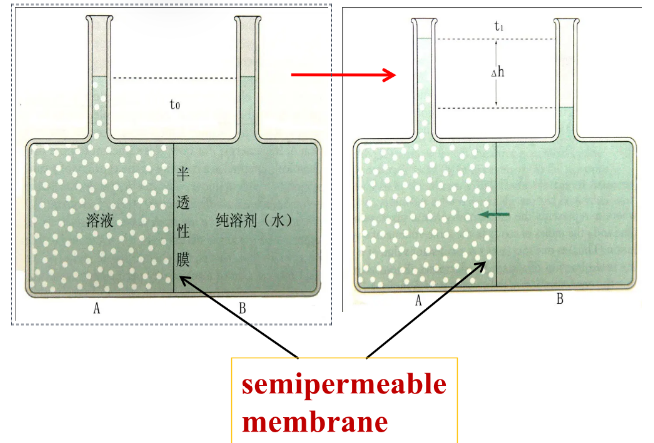
		- Semipermeable membrane：vesica, seed coat, dialysis bag etc.半透性膜：水极易通过，而溶质分子不易通过的一种薄膜 
##### 2.1.3 Plant cell is an osmotic system植物细胞是一个渗透系统
- Cell wall ( consists of cellulose, pectin and hemicellulose): permeable for water andsolute
	- A semipermeable (selective) membrane.
- Protoplastic layer (Plasmic membrane and tonoplast). 原生质层
	- **Plasmolysis (质壁分离)**：植物细胞液泡失水而使得原生质与细胞壁分离的现象 #名词解释 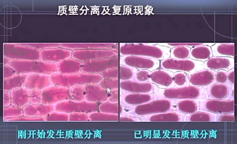
	- Deplasmolysis (质壁分离复原)
	- Significance for plasmolysis and deplasmolysis
		1. Protoplastic layer has selective permeability.原生质层具有选择透性
		2. Judge cell alive or dead from this.判断细胞死活
		3. Determine cell water potential, evaluate the resistance of crop to drought. 测定水势，进行农作物品种抗旱性鉴定
		4. Determine the entrance speed of substance into cell, easily or difficulty. 测定物质进入原生质体的速度和难易程度
##### 2.1.4 Water potential elements of the plant cell
- Formula: ==Ψw=Ψs+Ψp+Ψm….== 
	- 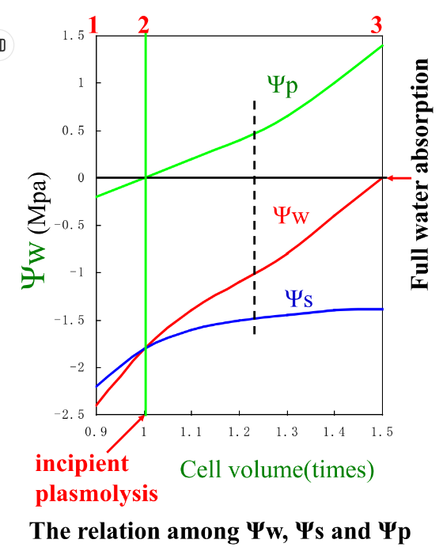
	- **Osmotic potential ( 渗透势 —Ψπ or Solutepotential、溶质势—Ψs ) . /psai/**：The decreased part of water potential caused by existence of the solute in the solution.Depending on sum of solute particles (molecules or ions).渗透势：由于溶质的存在而降低的水势
		- Hypertonic solution (lowerΨw) ;Hypotonic solution (higherΨs).
		- Normal plant leaf: Ψs=-1～-2 MPa;Xerophilous (旱生)plant leaf:Ψs reaches to -10 Mpa. (可以理解为旱生植物拥有的溶质更多，不容易失水)
		- Ψs has diurnal and seasonal changes.
	- Ψp：pressure potential（压力势）:The increased part of water potential caused by turgor pressure.由于细胞膨压的存在而提高的水势  ==通常>0== 
		- 可以理解为是原生质体顶细胞壁的反作用力
	- Ψm——matric potential（衬质势）The decreased part of water potential results fromcell components absorbing water.细胞内胶体物质（如蛋白质、淀粉、细胞壁物质等）对水分吸附而引起水势降低的值， ==为负值== 
		- 未形成液泡的细胞具有明显的衬质势→一般情况下可以忽略
- Calculation: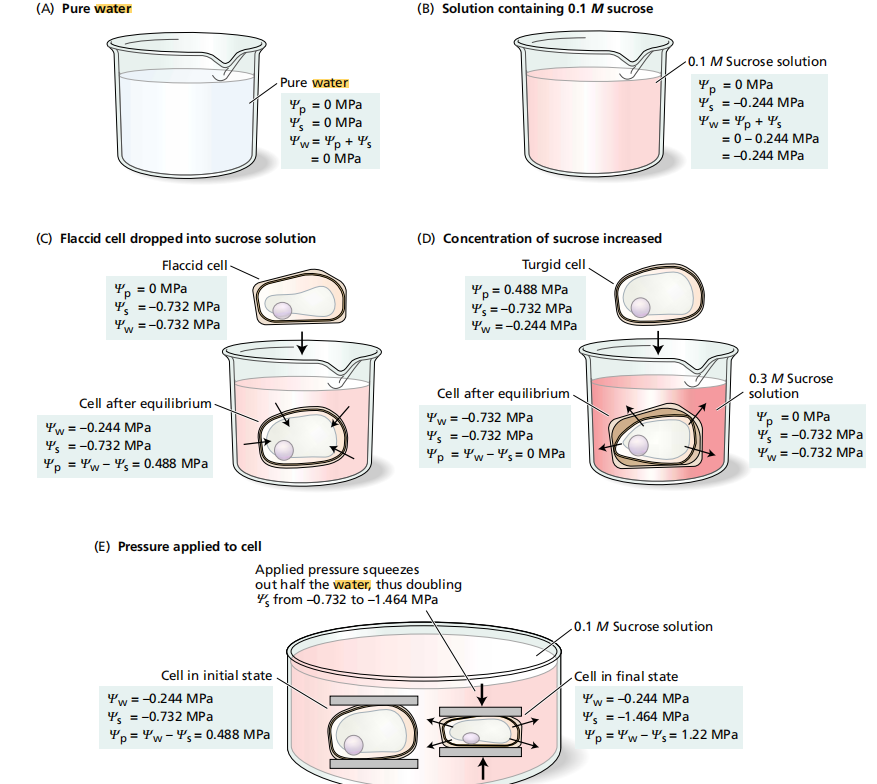
- Exceptions:
	- fully turgid cell充分吸水细胞 👉Ψw=0，Ψp= -Ψs
	- incipient plasmolysis 初始质壁分离 Ψp=0, Ψw= Ψs
	- Intensive transpiratio强烈蒸腾 Ψp<0
- 水势的测定方法:
	1. 液相平衡法:小液流法;质壁分离法
	2. 压力平衡法: 压力室法;压力探针法
	3. 气象平衡法: 露点法;热电偶湿度计法→热电偶从样片获得水分,水分在热电偶上冷凝导致温度略微升高👉将温度的改变转化为电压的变化
- 相邻细胞间的水分移动取决于水势差
	 - 假定土壤的渗透势和衬质势之和为-10Pa，生长在这种土壤中的植物根的ψs为-10Pa、ψp为7x10Pa。在根与土壤达到平衡时，其中ψw、ψs和ψp各为多少?如果向土壤中加入盐溶液，其水势变为-5 x10spa，植物可能会出现什么现象?
#### 2. Imbibing absorption of water of plant cell
- Concepts: Imbibition (吸胀作用) is a phenomena in which  ==hydrophilic colloids==  enlarge with water absorption.亲水胶体吸水膨胀的现象
	- Only depend on components (hydrophilic group):protein>starch>cellulose> >lipid and fat. [[Chapter3 化学成分]]
	- Soybean has extreme imbibition. #待解决 
- Imbibition is droved by Ψm
	- ∵ Ψs=0，Ψp=0∴ Ψw=Ψm
#### 3. Metabolic absorption of water by plant cell
- Concepts:The plant cell uses the energy produced in respirationand drives water absorption across plasmaticmembrane——Metabolic absorption of water.利用细胞呼吸释放出的能量，使水分通过质膜而进入细胞的过程
	- Proofs:Respiratory inhibitors (DNP-dinitrophenol and N3--azide)block water absorption;Respiratory promoters (sugar, areation) enhance water absorption.
#### 4. Water channel proteins or aquaporins 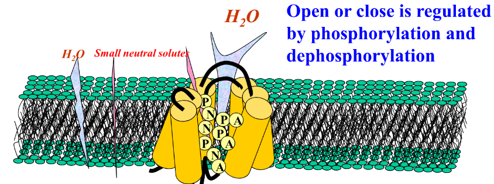
- Concepts:Aquaporins in all living cell are a serious proteins which located in plasmatic membrane or tonoplast, and play an important role in water transmembrane transport because they have less resistance to water and speed up water transport across the membrane. #待解决 
- About 20～80% of water entrance is controlled byaquaporins.

----
## Section 3 Absorption of water by plant root
#### 3.1 Absorption region→Root hair
1. Great numbers  of root hair cells, large absorption area表面积大
2. Thin cell wall, high pectin content and high hydrophlic,easily stick to soil particles；亲水性强
3. Well developed conduct tissues, good water conductivity.导水性能好
#### 3.2 Water absorption by root- active and passive
##### 3.2.1 Active uptake of water 
- **root pressure** (根压) : a power which  ==pushes water to mount along vessel== , depending on physiological activity of root. 0.1～0.2MPa .根压：由根系本身生理活动产生的，使水分沿导管上升的压力。 #名词解释 
	- 根压的大小代表根生理活动强弱
	- 根压存在的两个标志
		- **Bleeding (伤流)**：a phenomenon that the sap flows out from the wounded (cut) part（bleeding sap）
			- 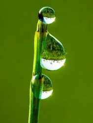
		- **Guttation(吐水）**：when soil has enough water and it is warm and higher atmosphere relative humidity (RH), often in the early morning, unwounded leaf can secret sap from the tip or margin (water pore) of leaf. 
			- an index for healthy seedlings, but the content is simpler than bleeding sap.可以作为选择壮苗的一种生理指标
			- 荷叶/草莓以及禾本科吐水较多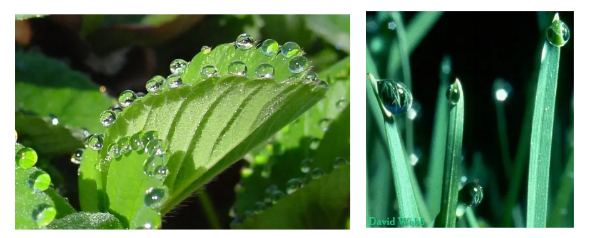
- The sources of root pressure:
	1. **Osmosis**: 木质部周围活细胞中的离子被释放到木质部中，导致木质部中的溶质势（ψs）降低，从而使周围细胞中的水分进入木质部
		- 内皮层细胞吸收离子,导致离子被转移到中柱导管→产生静水压力
	2. **新陈代谢**： ==呼吸作用产生的能量参与水分吸收过程== 。呼吸作用减弱会导致根压降低
- Pathways for water uptake #名词解释 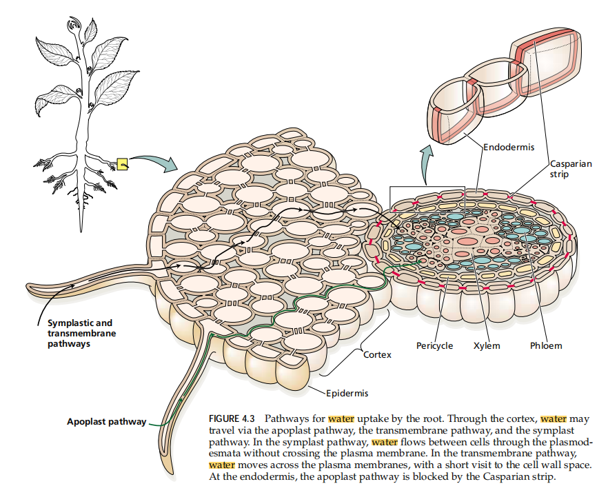
	- **Apoplast**: A continuous system is consist of cell wall, cell space (interplace) and vessel of xylem, except for protoplast, considered as the part with less life activity. 质外体： ==原生质膜以外== 的包括细胞壁、细胞间隙等无生命物质相互连结成的一个连续的整体 #名词解释 ^59f9c4
	- Symplast: A continuous system is consist of protoplast, plasmodesma and plasmic membrane except for apoplast, considered as the part with more life activity.共质体：活细胞内的原生质体通过胞间连丝及质膜本身互相连结成的一个连续的整体
##### 3.2.2 Passive uptake of water→Transpiration pull
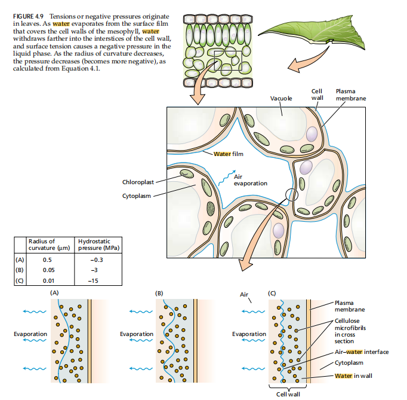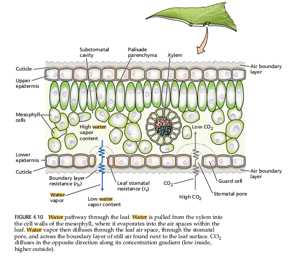
- Phenomena: Stem with leaves still uptake water, cut flower. Opposite to active uptake
- Transpiration pull——a power driving water upward along xylem vessel is decided by a gradient of water potentials due to transpiration.由于蒸腾作用产生的一系列水势梯度使水分沿着导管上升的力。其大小 ==与根系活力无关== 
	- 通常植物既有被动吸水也有主动吸水
#### 3.3 Factors affecting water absorption by root 
- Plant factors： Root development, root activity, root cell Ψw
- Outer factors：
	- Air factors→ transpiration →water absorption(indirectly) .
	- Soil factors directly influence water absorption of root.
##### 3.3.1 Water in soil
- Group by its utility #名词解释 
	- **Soil available water**(土壤有效水:  土壤中可以直接被植物吸收利用的水分，即土壤中高于永久萎焉系数的含水量部分。The water that can directly be taken up and utilized by plants, whose water content is higher than permanent wilting coefficient in the soil.
	- **Wilting coefficient(萎蔫系数)**:生长在湿润土壤上的作物经过长期的干旱后，因吸水不足以补偿蒸腾消耗而叶片萎蔫时的土壤含水量/植物发生永久萎蔫时,土壤的水分含量 [[Chapter5 土壤水、气、热状况]]
		- 萎蔫系数亦称凋萎系数、凋萎点
		- 萎蔫系数依土壤不同而异，粘土的萎蔫系数比砂土的高
	- 萎蔫:植物体内水分不足时,叶片和茎秆幼嫩部分皱缩下垂
		- **Temporary wilting**: The wilting is caused by  ==loss of equilibrium between water absorption and evaporation==  (main transpiration). Transpiration is larger than absorption. It can be recovered by shading or in the evening upon decreasing in transpiration, but not by watering.暂时萎焉：当蒸腾作用强烈，根系吸水及转运水分的速度较慢，不足以弥补蒸腾失水时，发生暂时萎焉，当蒸腾速率降低时，根系吸水的水分足以弥补失水，消除水分亏缺，即使不浇水或者通过荫蔽能恢复，这种靠降低蒸腾就能消除的萎焉。
		- **永久萎焉**：如果土壤中缺少植物可利用的水，那么即使降低蒸腾，植物仍不能消除水分亏缺，也不能恢复原状，需要浇水才能得到缓解Permanent wilting: The wilting is  ==caused by no soil available water== , plant can not absorb water from the soil. It can be recovered by watering or water spraying, but not by decreasing in transpiration.
- 田间持水量Field water holding capacity
##### 3.3.2 Soil O2
- CO2 、N2 treatment, flooding，absorption↓； because O2 ↓ , respiration↓, active absorption↓, anaerobic respiration↑, ethanol accumulation, root activities↓.
##### 3.3.3 Soil temperature
- 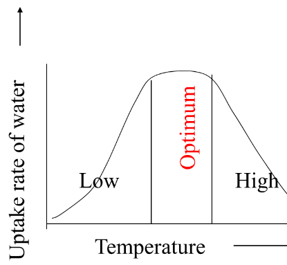
- Low temperature: water and plasma viscosity(粘度)↑, water conductance↓；respiration↓energy not enough；root growth and root hair↓.
- Too high T：root corkification(木栓化→通过凯氏带) easily， water conductance↓ .
##### 3.3.4 Soil solute concentration
- Ψw in root < Ψw in soil, usually Ψsoil >-0.1MPa.
----
## Section 4 Transpiration
#### 4.1 Organs for transpiration
- **Transpiration (蒸腾作用)** is a process of loss water from plant in the form of water vapor.
- Lenticular transpiration (皮孔蒸腾）
- Leaf transpiration
	- Cuticular transpiration (角质层蒸腾)→5～10％ (the thickness of cuticular layer)
	- Stomatal transpiration (气孔蒸腾)[[#^453c43]]→ ==90～95%== 
#### 4.2 Stomatal transpiration
^453c43
##### 4.2.1 Stomata
- 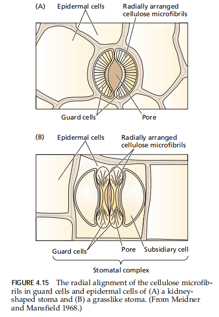
- Concepts:pore for gas exchange (main CO2, O2 , water vapor) .
	- Small size, large number of stomata are distributed in the leaf
- Charateristics:
	1. Upper epidermis type：hydrophytes——lotus水生植物的气孔一般分布在叶片的上面(不然放在水下怎么呼出)
	2. Lower epidermis type ：most trees, apple and peach trees. Dicots plants
	3. Both epidermis type ：most  ==herbs==  including crops. But stomata in the lower epidermis is generally more than in the upper epidermis.In grain plants, those distribution is nearly equal in the lower epidermis to in the upper epidermis.
##### 4.2.2 Stomatal diffusion—Law of micropore diffusion
- 内容:diffusion rate of water vapor throughout poly micropore is not proportional to the area, but is  ==proportional to the perimeter== . **小孔扩散定律**：水蒸气通过多孔表面扩散的速率不与小孔面积成正比，而与小孔周长成正比
	- Diffusion rate is larger in the margin than in the middle 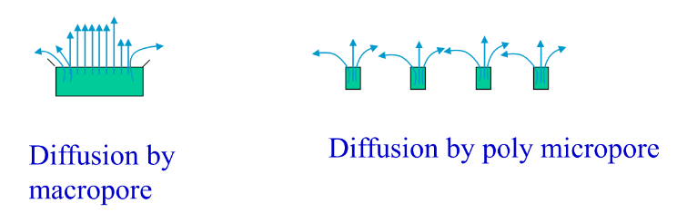
##### 4.2.3 Mechanism of stomatal opening and closing #待解决 
- Opening in daytime and closure at night resulted from the swelling by water absorption or shrinking by water loss in guard cells.
1. Stomatal complex（气孔复合体）——Guard cell +Subsidiary cell + Substomatal space 气孔下腔
	1. 保卫细胞的生理特征
		- 含有叶绿体,可以进行光合作用
		- 含有催化淀粉合成和分解的酶
		- 与周围表皮细胞有发达的胞间连丝→有利于水分运输?
		- 体积比表皮细胞小得多
2. Stomatal opening and closing theory
	1) Starch-sugar conversion theory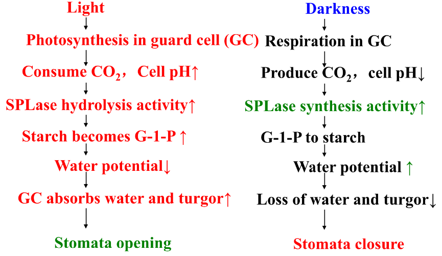
		- Starch phosphorylase (SPLase) plays an important role in stomata opening and closing.
	2) Potassium ion pump or inorganic ion uptake theory无机离子假说
		- The change in K+ and pH of guard cell and subsidiary cell during stomata opening and closing
		- 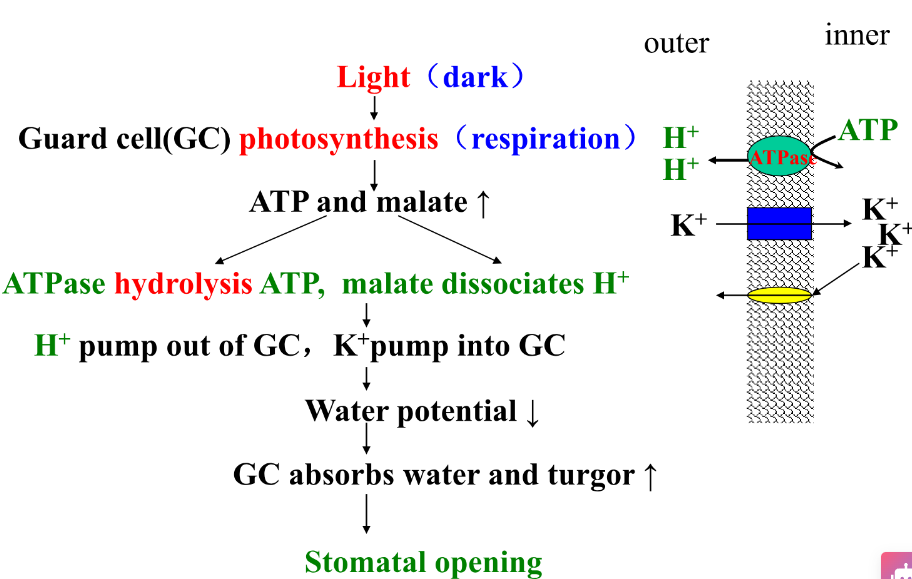
	3) Malate production theory苹果酸生成学说
##### 4.2.4 Factors affecting stomatal openingand closure
^3263c8
1. light: form sugar and malate, acumulate K+ and Cl-👉open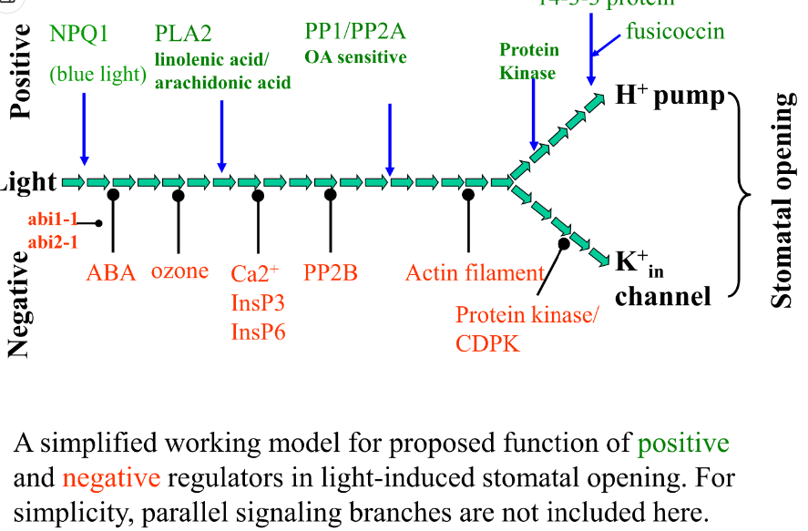
2. CO2:
	1. Low CO2 ,stomatal opening；
	2. high CO2 ,stomatal closure because of acidification and K+ leakage from guard cell.
3. Relative humidity in atmosphere:Higher RH, larger opening. Low RH, loss of water of guard cell.
4. temperature:In a range of T, T rises and opening increases.
	1. Optimum 20~30℃， the opening become smaller at >35℃ .
5. leaf water and potassium contents
	- The higher water and enough potassium,the opening larger.
	- Too much water condition blocks stomatal opening.→why? #待解决 
6. plant hormones[[Chapter6 Plant hormones]]
	-  ==ABA→close== , ABA promotes Ca2+ increase incytosol，indirectly makes K+、Cl- flow outof GC and inhabits entrance of K+into GC.
	- IAA and CTK result in stomatal opening.
#### 4.3 Internal and environmental conditions affecting transpiration
##### 4.3.1 Effect of internal factors on transpiration
Stomatal density (number/leaf cm2);Opening degree;
气孔阻力：气孔开度减少或关闭时对气体交换
形成的阻力
Leaf water，CO2 and ions（K+）contents;
ABA;
Areas of leaves or leaf cells.
The branches and leaves are often cut for the transplanted plants!
##### 4.3.2  Effect of environmental factors on transpiration[[#^3263c8]]
1. light: light↑→transpiration↑.∵ opening↑，resistance↓；Tleaf and Tair↑ →transpiration↑ ；∵ The difference of vapor pressure between in the leaf and air ↑ .
2. Atmosphere relative humidity: 
3. Air temperature
4.  ==Wind== : Breeze微风 → transpiration↑ the thickness of boundary layer ↓ ;
5. Air CO2↑， transpiration ↓.
##### 4.3.3 Diurnal change of transpiration

#### 4.4 Role and index of transpiration
##### 4.4.1 Role 
1. It decreases in leaf temperature;
2. It is a power for water absorption andtransportation.
3. It enhances the transfer and distribution ofmineral nutrition and other solutes in plantbody.
##### 4.4.2 Index #重点 👉一定要好好区分!
1. Transpiration rate (蒸腾速率):Water lossof plant through transpiration per unit leafarea and per unit time (g.m-2⋅s-1) .植物在一定时间内单位叶面积 ==蒸腾的水量== 
	- Measurement：Weight loss and gas exchange(GE).
	- Devices for GE ：Steady pore meter（LI-1600）;Photosynthetic system（LI-6400）实验用的:O!
2. **Transpiration efficiency or transpirationratio(蒸腾效率或蒸腾比率)**. Plant producesquantity (g) of dry mater when it consumes 1kg of water by transpiration.植物每消耗1kg的水所 ==形成的干物质的g数== 
	- Wild types 1～8g.kg-1， crops 2～10g.kg-1.
	- Water utilization efficiency（WUE,水分利用效率）=光合速率/蒸腾速率
3. Transpiration coefficient or water requirement (蒸腾系数/需水量） . Water requirement is a reciprocal of transpirationefficiency, means that plant consumes waterquantity (g) for making 1g of dry matter.植物制造1g干物质所 ==需要水分的克数== 
---
## Section5 Water transport in plant
#### 5.1 Pathway of water transport
- Soil→ root hairs → root cortex parenchyma→root pericycle→ root vessels (tracheids) →stem vessels (tracheids) → potile vessels (tracheids)→leaf vessels and tracheids →mesophyll cells→ mesophyll cell space →substomatal space→stomata→atmosphere #待解决 
	- 与叶片活细胞相比,根部水分运输阻力更大,因此根系吸水的速度总赶不上蒸腾→蒸腾过大引起植物暂时萎蔫[[#^c1b2e2]]
##### 5.1.1 Short distance transport [[#^59f9c4]]
##### 5.1.2 Long distance transport
- Transport in root vessels (or tracheids) to leaf vessels (or tracheids) .从根部导管到叶片的导管
#### 5.2 Power of water transport
- 底部的根压+顶部的蒸腾拉力
- Transpiration-cohesion-tension theory(蒸腾－内聚力－张力学说):水分子由于蒸腾作用和 ==分子间内聚力大于张力== 而在导管内连续不断向上输送
---
## Section6 Effective irrigation based on water physiology 
#### 6.1 Law of plant water requirement
1.  Plant types
2. Growth stages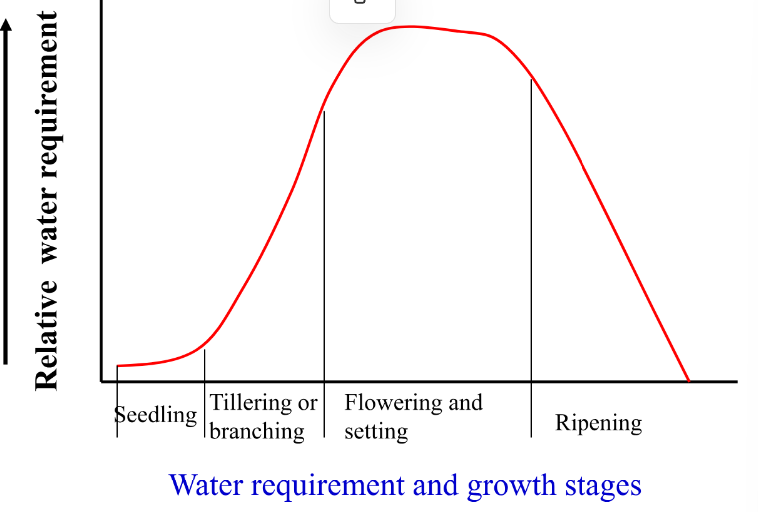
	- Critical period of water (水分临界期): a period during which plant is most sensitive to water deficiency and is most easily injured by water deficiency, but the water requirement is not always largest at that period. 指需水量不一定多，但植物对水分不足最敏感，最易受害的时期。
		- Two critical periods of water for grain crops: 
			- Stem elongation =A period from pollen mother cell meiosis to pollen tetrad (花粉母细胞减数分裂至4分体期)
			- Filling stage for grains （灌浆期）
#### 6.2 Index for effective irrigation 灌溉指标
- Morphological index 形态指标
	1. The wilting occurs in the tender stem and leaves.开始萎蔫
	2. Stem and leaf appear in darkness or reddish.
	3. Plant grows slowly.
- Physiological index生理指标
	1. Leaf relative water contents(叶片相对含水量)A percentage of the actual water content to the water content of the leaf with water-saturated.$$Leaf relative \\ water contents (\%) = \frac{\frac{FW - DW}{FW}}{\frac{SFW - DW}{SFW}} \times 100\%$$
		- FW=fresh weight of leaf, DW= dry weight of leaf , SFW=the water content of leaf with water-saturated 
		- If  ==leaf relative water contents <80%,==  irrigation!
	2. Diurnal change in leaf water potential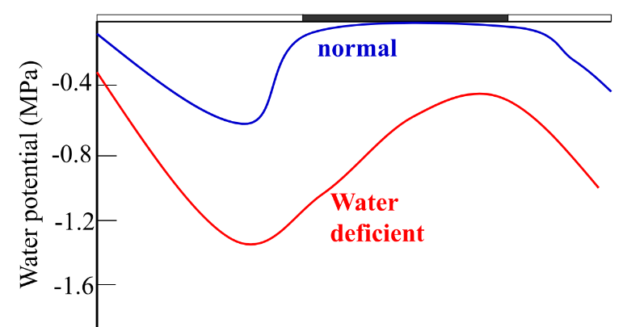
		- Recovered in the evening，not necessary to irrigate
		-  ==Not recovered in the dawn== , necessary to irrigate
- Irrigation methods
	- ground irrigation:waste water. 地面灌溉法
	- sprinkling irrigation. 喷灌法
	- dropping irrigation 滴灌法
	-  Precision irrigation.
----
## Homework:
#### 1. Cloze
1. When the cell is bathed by a [空格] solution, water will enter the cell as it moves down the water potential gradient; when the cell is bathed by a [空格] solution, which has more negative osmotic potential than the cell, the protoplast will shrink away from the cell wall. It is known as [空格]
2. The speed of water entrance of cell depends on [空格] in water potential between inner and outer of cell and cell water [空格].
3. The rate of transpiration will naturally be influenced by factors such as [空格][空格][空格],which influence stomatal [空格]and the difference in water vapor between the [空格] and ambient atmosphere.
#### 2. Questions:
1. Why can guttation be used as an index for healthy seedlings?
2. How to distinguish temporary wilting and permanent wilting? 
3. How does stomatal open in the light? 
4. How to improve water utilization efficiency? 