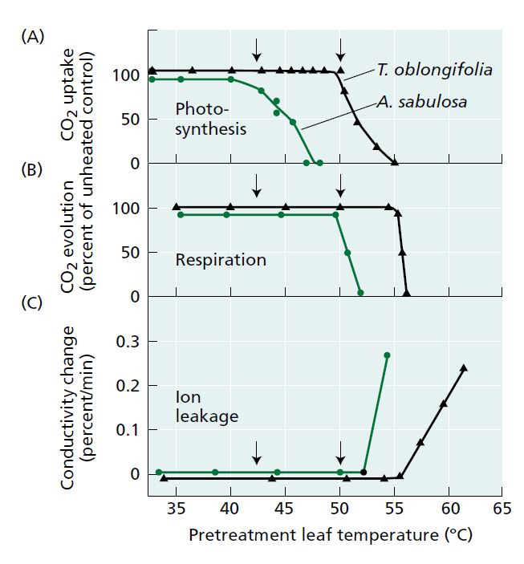
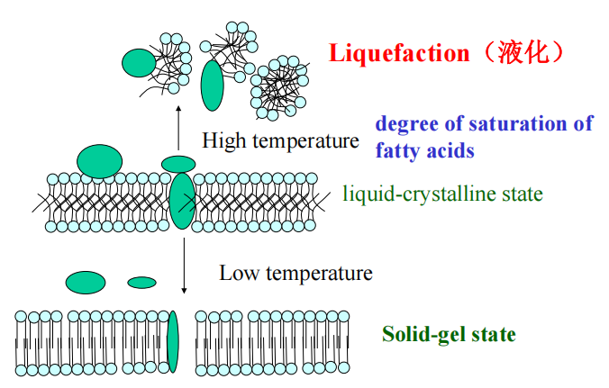
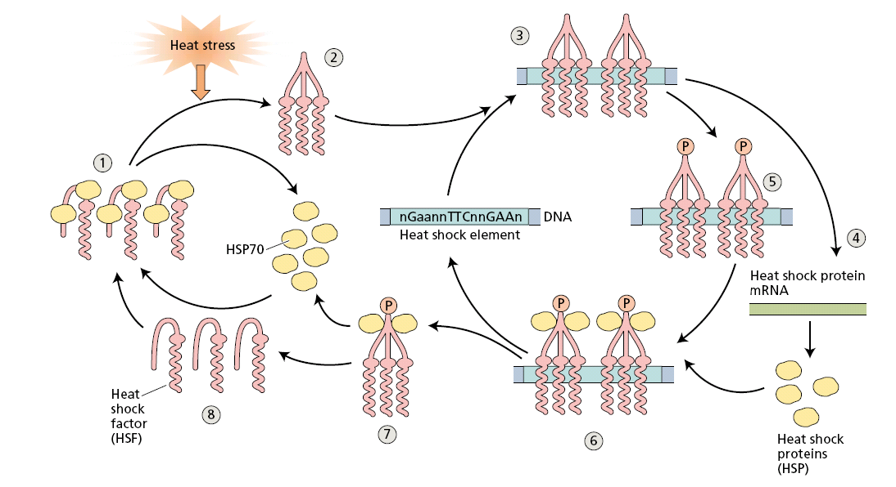
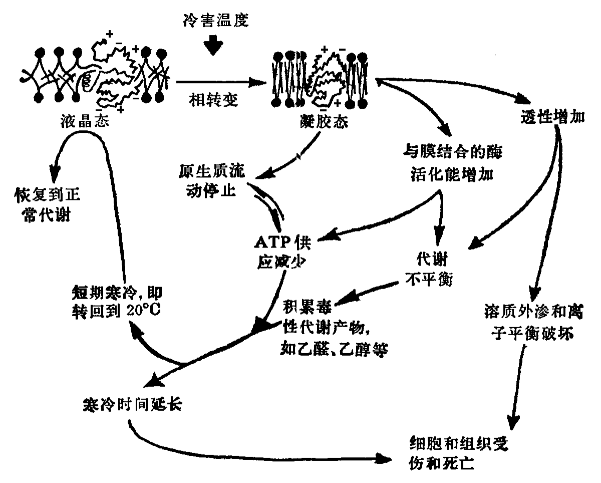
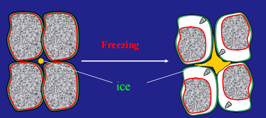
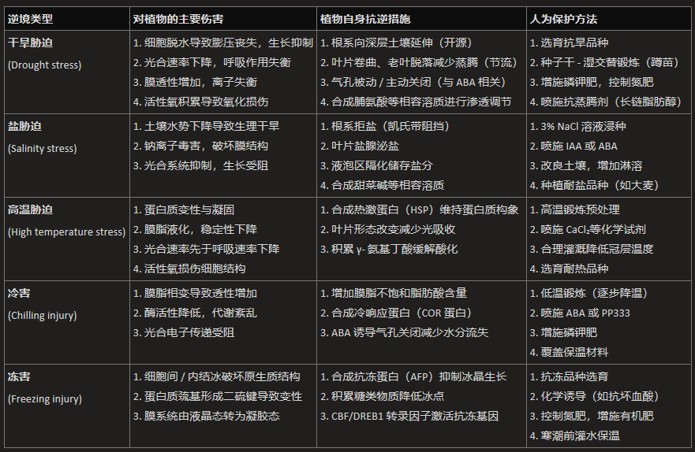

## Section1 植物对逆境的生理适应
#### 1. Concepts
- **Stress**: 逆境是指不利于植物生长和发育的各种环境因素的总称。常见的有冻害，冷害，热害，干旱，淹水，盐害，病虫害，大气污染等等
	- Abiotic stresses：
		- 对农作物产量下降的影响更大
	- biotic stresses生物逆境
- **Resistance** **抗性**：抗性是指适应或者容忍逆境的能力The ability adaptive or tolerant to stress.
	- **Adaptation适应**：在形态和结构、生理、生化、遗传和分子上 ==永久的对长期逆境的抵抗== 
		- 如水生植物通气组织，CAM植物中气孔的运动。Permanent resistance to stress in morphology and structure, physiology and biochemistry, and/or heredity and molecules under long-term stress condition.
		- 在基因层面上的改变
	- **Avoidance** **规避**：A manner to avoid facing with stress using neither metabolic process nor energy.指植物通过对生育周期的调整来避开逆境的干扰，在相对适宜的环境中完成其生活史。
	- **Tolerance** **忍耐**：A resistant reaction to reduce or repair injury with morphology, structure, physiology, biochemistry or molecular biology, when plant counters with stress.
	- **Hardening**：A gradual adaptation to stress when the plant is located in the stress condition
		-  ==基因表达== 层面的变化
		- e.g. 对于四代水稻，每一代都加以冷处理，最后一代没有处理，发现其产量大大高于WT
			- 低温胁迫下甲基转移酶MET1b的表达，引发ACT1启动子的甲基化丢失，激活了ACT1基因表达，赋予水稻耐冷性
## Section2 General physiological responses to stress[[Chapter9 细胞衰老与细胞死亡]]
#### 1. 生物膜的稳定性
- 膜蛋白失活Membrane protein denaturation
- 液相组成改变→磷脂双分子层变化
- 自由氧对膜的破坏
#### 2. Metabolic reactions
- 
	- Stress in physics is any force applied to an object
	- Stress in biology is any change in environmental conditions that might reduce or adversely change a plant’s growth or development.
#### 3. Genes and Proteins
- Functional proteins
	- **Heat shock proteins,HSP**
	- 
- Enzymes or transcription factors
	- Kinase
	- Transcription factors
	- Phospholipase
#### 4. Osmotic adjustments
- 相容质/渗透物的特点
	- 小分子且易溶→脯氨酸Pro
	- 没有毒性
	- 能够快速合成并且累积
## Scection3 Water stress
#### 1. Concepts
- **Drought injury** **旱害**：长期持续无雨，又无灌溉和地下水补充，致使作物需水和土壤供水失去平衡，从而对作物生长发育造成的伤害Long-term continuous no rain, no irrigation and groundwater supplement, resulting in the crop water demand and soil water supply imbalance, thereby causing damage to crop growth and development.
	- 气象干旱：没有足够的水分，比如说下雨很少
	- 生理干旱：虽然有水但是无法利用not usable
		- Saline,Freezing,Wilting in sunny and dry day.
	- 大气干燥：RH<20% in atmosphere(人在60%以下就会难受😫)空气温度高而相对湿度很低所造成的干旱环境，常 ==导致植株发生萎蔫== ，地上部分失水。
- Parameters to describe water deficit [[Chapter1 Water in Plant]]
	- Water potential
	- Relative water content(RWC)
#### 2. Drought injury
- Injury
- Acclimation strategies to water deficit
	- 开源：促进根向更深更湿润的土壤伸长
	- 节流：
		- 失水时叶片卷曲→降低蒸腾作用
		- 老叶率先脱落
		- 增加叶片表面的蜡质含量wax deposition→**角质层**
		- Alters energy dissipation from leaves
		- Stomatal regulation
			- Hydropassive closure
			- Hydroactive closure👉与ABA有关
	- 流畅:Increases Resistance to liquid-Phase Water Flow
		- LEA蛋白的功能：能够保持水分→联系种子生物学pre的文章
		- 景天酸代谢途径
		- **Stress proteins逆境蛋白**：在逆境下，植物关闭一些正常表达的基因，启动一些与逆境相适应的基因，形成新的蛋白，低于逆境胁迫，这些蛋白质统称为胁迫蛋白。例如抗冻蛋白，热激蛋白，病原相关蛋白Adverse conditions induce the formation of new proteins in plants.
#### 3. 植物抗旱机制
- Adaptation:C4/CAM→马铃薯和玉米的抗旱能力更强
- Acclimation
#### 4. Methods to increase drought resistance
- Selection of cultivars with high resistance todrought, high yield and quality.
	- Genotypie difference
	- Transgenic approaches
- Drought hardening:蹲苗;种子干-湿处理(双芽法)
- Suitable fertilizer application
	- Application of more K and P, limiting N use
- Chemical regents applicationSoaking in 0.25% CaCl, or 0.05%ZnS0 solution.Application of plant hormone substance: ABA,COC ete
	- Application of anti-transpiration substances:长链脂肪醇( Fatty Alcohols)等
## Section4 Salinity stress
#### 1. Concepts
- **次生盐碱化**→由灌溉作用引起(南方没有是因为经常下雨，有淋溶作用[[Chapter7 土壤酸碱性和氧化还原性]])
	- 大棚作物和覆膜后也会盐碱化
- **Halophyte** **盐土植物**：Plants that can grow normally and complete their life cycle in soils with a salt content of more than 0.33mpa (70mmol/L).
- Glycophyte甜土植物
	- e.g.玉米，棉花与大麦有较强的耐盐性
- Sodicity钠度：high concentrations of Na+
- salinity（盐度）：high concentrations of total salts
#### 2. Depresses Growth and Photosynthesis in Sensitive Species
- 拒盐机制（exclusion of salts from roots）：Casparian strips，Active extrude，Xylem transportation
- 泌盐机制（exclusion of salts from leaves）：盐腺 salt gland， salt crystallizes
- 稀释机制（osmotic adjustments)：Higher compatible solutes Compartmentation in vacuole
#### 3. Methods to increase salinity tolerance
- Soaking seed with salt: 3% NaCl for 1h对种子进行盐渍化浸泡处理
-  ==Spray IAA== , or seed soaking with IAA：喷洒IAA
-  ==Spray ABA==  to induce stomata close：喷洒ABA使得气孔关闭→why?气孔关闭可减少通过气孔途径（如蒸腾流）进入叶片的盐分（如 Na⁺）并且增强抗逆性
## Section4 Temperature stress
#### 1. High tempreture
-  **Heat injury热害**High temperature is harmful to plant metabolism, growth and yield.
	- 高温的直接伤害是**蛋白质变性与凝固**，但伴随发生的是高温引起**蒸腾加强与细胞脱水**，因此抗热性与抗旱性的机理常常不易划分。实际上抗旱性机理中就包含有抗热性，同样，说明抗热性的机理也可能解释抗旱性
	- 热害与旱害在现象上的差别：
		- 热害后叶片死斑明显，叶绿素破坏严重，器官脱落，亚细胞结构破坏变形
		- 旱害的症状不如热害显著
- 高温对植物的伤害
	- Photosynthesis：首先受到影响，比呼吸作用脆弱
	- High T reduces membrane stability
- 植物抗热性的生理基础
	1. Decrease the absorption of solar radiation(与抗旱性联系)
	2.  ==Produce HSP== 
		- 按照分子的大小分成好几类
		- 动物中也存在HSP
	3.  影响H+-ATPase的活性，导致细胞质酸化→γ-氨基丁酸的积累
#### 2. Chilling and Freezing injury冻害
- Concepts：
	- **Freezing injury**:当温度下降到0℃以下植物体内**发生冰冻**，因而受伤甚至死亡，这种现象称为冻害When the temperature drops below zero, plants freeze inside, causing injuries and even death.
	- **Chilling injury** **冷害**：在零上低温时，虽**无结冰现象**，但能 ==引起喜温植物生理障碍== ，使植物受伤甚至死亡。Caused by temperature above 0℃ (freezing point).
- Symptons:
	- 光合作用、呼吸作用抑制，细胞膜、液泡膜被破坏
- Mechanism of freezing injury
	- Freezing:胞内结冰非常不利
	- damage of protein：发生冻害时形成**二硫键**，而恢复温度后无法解开
	- 对膜的伤害→导致其由液晶状态转为凝胶状态
	- Metabolism disorder
		- 会导致根吸收水分的作用失调：水稻 ==青枯死苗== →当蒸腾作用大于水的吸收时
		- 会导致光合作用速率降低： ==黄枯死苗== →photosynthesis< respiration 
		- 有氧呼吸速率下降，无氧呼吸速率上升👈细胞色素氧化酶Cytaa3的活性下降
		- 有机物质的分解
- resistance mechanisms
	1. Limitation of ice formation阻止其形成冰晶和晶核👉主要诱因：细菌和灰尘:O!
	2. Supercooling and slow dehydration
	3. ABA and protein synthesis
	4. Gene induction:HSPs,TSPs
	5. 诱导转录因子
- **Methods to increase the resistance to low temperature:**
	1. The resistant cultivars.
	2. Low temperature hardening.
	3. Chemical control: ABA,CCC，PP330，Amo-1618.
	4. Others: PK application, keep warm with artificial things.
#### 3. Freezing injury
- freezing
	- Intercellular freezing：当温度是逐渐下降时
	- Intracellular Freezing：温度突然下降→导致对细胞质/细胞膜/蛋白质( ==导致其乱连接二硫键== 而恢复后二硫键也不会断开)直接的伤害→比细胞间的损伤更加严重
- Freezing resistance mechanisms
	1. Limitation of ice formation
	2. Deep supercooling and slow dehydration
		- 深过冷组织的水一旦遇到成核体(ice nucleator)，如来自空气中的尘埃、叶面的细菌以及水的小冰晶，会立即结冰使植物致死
	3. ABA and protein synthesis
	4. Gene induction
	5. A transcription factor regulates coldinduced gene expression转录因子CBF/DREB1使得冷诱导基因表达量升高
- Methods to enhance chilling and freezing resistance
	- 低温锻炼 植物对低温的抵抗往往是一个适应炼过程。很多植物如预先给予适当的低温锻炼，而后即可抗更低温度的影响，不致受害
		-  **Cross acclimation** **交叉适应**：Plant can improve it adaptation to other stresses when it adapts one stress for a time.
	- 化学诱导 植物生长调节剂及其它化学试剂如细胞分裂素、脱落酸、PP333、2,4－D、抗坏血酸、油菜素内酯等可诱导植物抗冷性的提高
	- 合理施肥 调节氮磷钾肥的比例，增加 ==磷钾肥== 比重能明显提高植物的抗冷性
#### 4. Plant diseases
- The resistance of plant to plant diseases(好像这一章不是很重要)
	1. 形成防卫屏障结构
	2. 产生过敏反应。合成植物抗毒素, 合成真菌毒素蛋白(PRs) 
	3. 免疫诱导
## Section5 Environmental pollution
- Atmosphere pollution
- Water and soil pollution
- Roles of plants in environmental protection
	1. O2 and CO2 equilibrium;
	2. Prevent water and soil loss.
	3. Clean soil, water or other environmental conditions or detoxification.
	4. Detect environmental conditions
## Summary

--------
- References
	- [植物生理学 植物的抗逆生理 - 知乎](https://zhuanlan.zhihu.com/p/633151163)
	- [Heat Shock Proteins 热休克蛋白 - 知乎](https://zhuanlan.zhihu.com/p/451543023)
	- [热休克蛋白（HeatProteProteins） - 知乎](https://zhuanlan.zhihu.com/p/638531290)anlan.zhihu.com/p/633151163)