- 整个章节最好的参考→土壤与植物营养
	- [[03 Subjects/2025春夏/Soil and Plant Nutrition/soil/Chapter1 绪论|Chapter1 绪论]]
	- [[Chapter2 氮]][[Chapter3 磷]][[Chapter4 钾]]
## Section1 Concepts
#### 1.1 Significance
1. Maximising Productivity
	- What limits plant productivity?
		- Genetic make-up of plant
		- Water （drought, flooding, salty) 
		- Nutrient deficiency
		- Nutrient toxicity
		- Insufficient light
		- Temperature (too low or too high)
2. Improving quality of product through plant nutrition
#### 1.2 Essential elements for plant
- Identification
	1. Criteria for plant essential elements
		1. 不可缺失性\不可替代性\直接性
	2. Methods for identifying plant essential elements
		- Water (solution) culture or hydroponics(溶液培养法——水培法)
			1. Choosing optimum cultural solution;
			2. Renewing cultural solution and adjusting pH in time ；
			3. Airing；
			4. Keeping root in darkness
			5. Considering the nutrient contained in seeds
		- Sand culture (砂培法)
- Kinds of plant essential elements #重点 
	- Macronutrients: =="碳氢氧氮 磷硫钾钙镁"== 
	- Micronutrients:Fe Mn B Zn Cu Mo Ni Cl
## Section2 Nutrient absorption
#### 2.1 The rhizosphere
- Layer of soil surrounding the growing root that is affected by the root
- Usually a few mm wide, up to say 1 cm (no sharp boundary)
- Extent depends on plant properties; e.g.
	- Root hair length & density
	- Rhizodeposition (exudates etc)
	- Nutrient uptake versus supply
#### 2.2 Movement of nutrients to the root surface
 
- Interception截流
- Mass-Flow质流:Solutes are transported with the convective flow of water from the soil to plant roots. 
- Diffusion扩散:Ion is transported from a higher to a lower concentration by random thermal motion. 
- 表观自由空间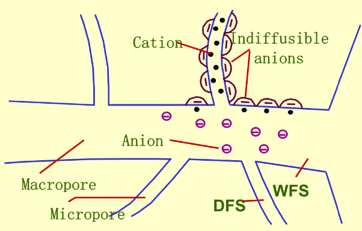
	- 水分自由空间WFS:是指被水分占据并能和外部介质溶液达到物理化学平衡的那部分质外体区域
	- 杜南自由空间DFS:是指质外体中因受电荷影响，养分离子不能自由移动和扩散的那部分区域
#### 2.3 Passing cell membrane 
- Cell membranes are highly selective 
	- Uptake is made faster by **transport proteins** embedded in the membrane.
	- Movement of molecules across membranes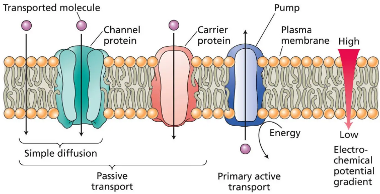
		- Passive transport
			1. Diffusion directly through the lipid bilayer
			2. Transport via carrier proteins
			3. Transport through ion channels
		- Active transport→require energy
			- Pump - ATPase
			- co-transport
- Passive uptake
	- Specific (selective for single nutrient molecule)
	- Passive (requires no input of energy)
	- Saturates (non-linear dependence on concentration)
- membrane voltage = membrane electrical potential = PD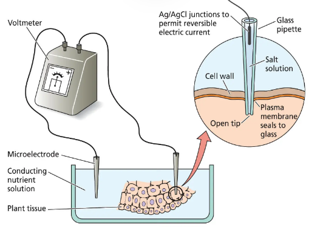
	- The NERNST equation:(z为离子价态,F是法拉第常数)$$
E\ (\text{mV}) = \frac{RT}{zF} \times \ln\frac{C_{o}}{C_{i}}
$$
	- 简化形式:$$E\ (\text{mV}) = \frac{59}{z} \times \lg\frac{C_{o}}{C_{i}}$$
- 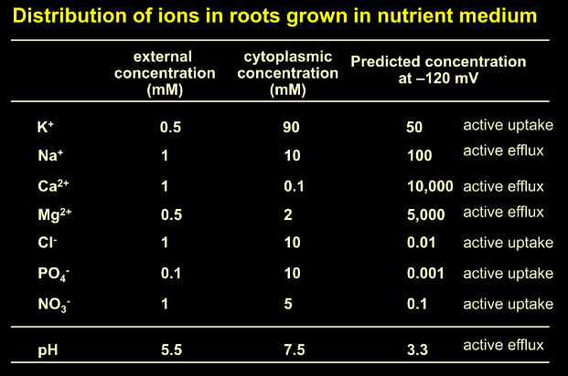
- Primary active transport and secondary active transport 
	- **Secondary active transport**: A type of carrier- mediated cotransport driven indirectly by pumps.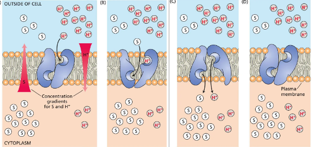
		- 会导致"**二重曲线**"[[Chapter4 钾]]
#### 2.4 Transport pathways in plant 
- Radius transport:Symplast and Apoplast pathways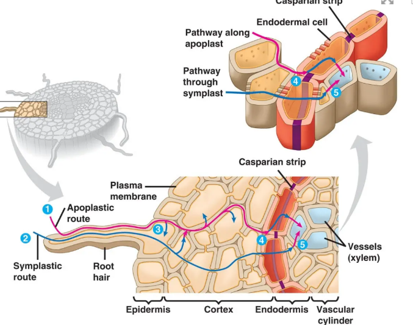
	- Solutes can enter the xylem only by passing through cell membranes.
- Long-distance transport:Xylem transport-unidirectional
	- Driving force: Water potential gradient /Root pressure [[Chapter1 Water in Plant]]
- Remobilization of nutrients
#### 2.5 Absorption of mineral nutrients by leaf
- Advantages:
	- Supply of nutrients is quickly effective;效率更高
	- Nutrients have higher utilization rate, and canusually be applied together with pesticide.
- Attention：
	1) It is usually a supplement way to compensatemacronutrients deficiency, but common andeffective for micronutrients.
	2) Not too high concentration, macroelements ~ 2%,microelements ~ 0.1%.
	3) Mixture of nutrients with surfactant (neutraldetergents, triton, at 0.1-0.2%) .
	4) Non volatile fertilizer.
	5) Spray in the evening or cloud day.
#### 2.6 Factors affecting nutrient uptake
- Intrinsic factors
	- Ion diameter 离子半径:半径越大越难以吸收
	- Valency电荷量:Uncharged molecules > Cat+ ;and An- > Cat2+;and An2- > Cat3+ and An3-
- Environmental factors
	- Light/Temperature/Water/O2/Concentration
	- pH: ==影响离子有效性== 
		- alkaline soil碱性土中Fe2+, PO43-, Ca2+, Mg2+, Cu2+, Zn2+etc. become insoluble forms变成不溶的形式,植物难以利用
		- acid soil
			- K+, PO43-, Ca2+, Mg2+ etc. are easily lost易随水分淋溶等作用离开根际土壤
			- Al, Fe2+, Mn2+make plants poison.酸性状态下会以离子形式出来
	- Interactions between nutrients
		- Synergistic action： one ion enhances theabsorption of another ion because it makethe latter available.
			- NO3-→ K+, NH4+→ H2PO4-;
		- Competition: one ion inhibits theabsorption of another ion
		- 单种离子对植物的毒性→toxicity of single salt
		- **Balanced solution**: The culture solutioncontains a range of all kinds of essentialelements and pH, and makes plant growwell.
- **How to improve fertilizer utilization efficiency?如何提高养分利用效率**👉根据不同的生育期、不同的作物和收获对象，首先满足营养临界期和营养效率最大期的营养需求。
	1) 采用合理的 ==耕作方式== 
	2) 采用合理的 ==灌溉方法== 
	3) 采用适当的作物轮作系统 ==轮作== 
	4) 合理施肥，选择合适的施肥量与施肥种类，选择合适的施肥时间，有机和无机肥料相结合，机械化、精确施肥等
	5) 喷洒叶面肥料
	6) 选择合适的品种
	7) 优化土壤环境，保护根际微生物，保护土壤生态。改善其他换进条件，光照、水分等
	8) 适当修剪枝条，把养分引到目标器官
## Section4 Physiological functions and deficientsymptoms of essential elements
#### 4.1 Nitrogen (N)[[Chapter2 氮]]
- N 、 P 、 K: largest requirement, application,👉“Three key elements”
- Young tissues>matured tissues>senescence tissues
- functions:
	- Components of many essential compounds.
	- Participation in metabolism and energy inplant
- Assimilation
	- Nitrate assimilation👉还原反应
		- Absorption:Active,needs energy
		- Sites of assimilation: Root—10-30%;Shoot—70-90%;Vacuole—storage when it is more than needed
		- Process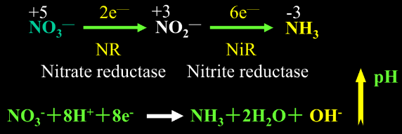
			1.  Reduction of nitrate to nitrite Occur  ==in cytosol== 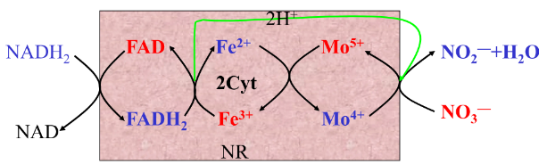
			2. Reduction of nitrite to ammonia Occurs  ==in chloroplast== 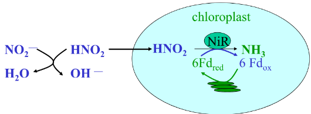
		- Affecting factors
			1) Plant difference:Upland plants>Lowland plants
			2) Light: ==NiR activity depends on light== 
			3) Temperature Need optimal temperature
			4) Nitrogen applied Luxury uptake
			5) Mironutrients Mo, Fe, Cu, Mn and etc.
			6) Other nutrients K promote the transport from root to shoot
		- Nitrate pollution:
			- 可能会导致与氧的结合下降
			- 产生亚硝胺盐,导致癌症
	- Ammonia assimilation
		- 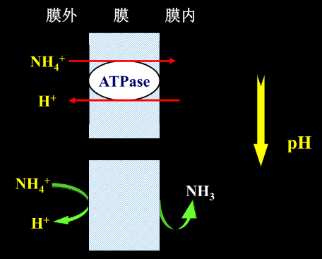
		- 作用酶:谷氨酸合酶\谷氨酰胺合成酶
- Nitrogen deficient symptoms
	1) Growth stun, roots show thinner and longer, less branches and tillerings
	2) Older leaves turn yellow.老叶发黄枯死👉[[Chapter3 Photosynthesis]]
	3) Too much N results in overgrowth and is sensitive to diseases and pests, and “贪青迟熟”

#### 4.2 Phosphorus (P)[[Chapter3 磷]]
- Content: 0.1-0.5%
- Functions: 
	1) Components: nuclear acids, lipids, coenzymesand energy substance,etc.
	2) Energy metabolism：form ATP(ADP+Pi →ATP).
	3) Metabolism and transportation for sugar.
	4) Regulation of enzymes activities(磷酸化和去磷酸化）
	5) Participation in synthesis for protein, fat andstarch
	6) As a buffer (phosphate buffer)
- P deficient symptoms：
	- Extremely stun，young leaves appear dark-green in color and older leaves and base of stem exhibit vinicolor.新叶暗绿色→水稻"锅刷"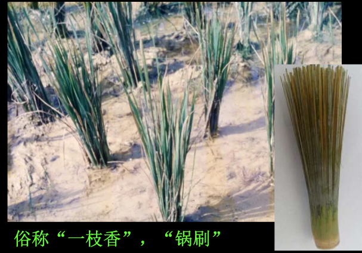
	- 在玉米中,老叶会出现红色
#### 4.3 Potassium (K)[[Chapter4 钾]]
- Absorbed form :K+ 
	- K only exists in plant body in the form of ion (cation) and concentrates in sites with higher metabolicactivity.
	- Content: 1-5% based on dry wt.≥100 mM in cytoplasm.
- Functions:
	1) Regulation to water relationship: regulation of osmosis,stomata, transpiration.
	2) Activator for enzymes: more than 60 enzymes, such as pyruvate kinase、glutathione synthetases and starchsynthase etc. Increase in resistance: resist to lodging, pests and diseases.
	3) For sugar transport: K+ as a counterion of H+ participates in sugar loading
	4) For synthesis of proteins and polysaccharose
	5) For energy metabolism: Oxidative phosphorylation (OSP) and photophosphylation(PSP)
- K deficient symptoms
	- Stem weak, lodging easily, less resistance to stresses.
	- 老叶出现色斑mottling or chlorosis→"焦边"
	- soybean:“Cup leaf (杯状叶)”
#### 4.4 Ca Mg S and others
- [[Chapter5 钙镁硫和微量元素]]

- ---
- How does plant cell take up mineral nutrition?植物细胞如何吸收矿质元素
	1. 被动吸收：扩散（电化学势梯度高-低），杜南平衡，离子交换（①离子的溶液交换：如细胞呼吸产生二氧化碳，生成碳酸，氢离子与碳酸根离子经过土壤溶液与其他离子交换，其他离子进入细胞。②离子的接触交换：根表面的碳酸分子热运动直接交换其他离子，将其他离子吸附进入细胞，不经过溶液。）
	2. 主动吸收：载体（载体利用 ATP ，活化（如磷酸化）后与相应离子结合，形成载体-离子复合物；复合体运转至膜内侧，将离子释放到膜内。（载体通过磷酸化与去磷酸化改变构象，改变活性，引起离子的吸收与释放）），离子通道，离子泵（初级主动转运），次级主动转运（同向、反向），
	3. 胞饮作用，溶质在液泡中积累
- Distinguish the different physiologically salts 分辨不同类型的生理盐
- What are the mineral nutrients with deficient symptoms appearing on older leaves or younger leaves? 缺乏时分别在老叶与新叶显现出症状的植物
	- 可再利用元素缺素症从老叶开始N、P、K、Mg、Zn、(B部分)
	- 不能再利用元素缺乏时幼嫩部位先出现病症。
		- S、Ca、Fe、Mn、B、Cu、Mo等，其中以Ca最难再利用。
- How to explain“麦浇芽”，“菜浇花”?
	- 麦浇芽：营养临界期，概念见名词解释。一般营养临界期发生在幼苗期，麦子在幼苗期充分施肥可以满足营养临界期的养分需要，长得好
	- 菜浇花：营养最大效率期。一般为开花结实时期，蔬菜开花时充分施肥，可以使其大大增产。
- **How to improve fertilizer utilization efficiency?**如何提高养分利用效率**👉根据不同的生育期、不同的作物和收获对象，首先满足营养临界期和营养效率最大期的营养需求。
	1) 采用合理的耕作方式
	2) 2)采用合理的灌溉方法
	3) 采用适当的作物轮作系统轮作
	4) 合理施肥，选择合适的施肥量与施肥种类，选择合适的施肥时间，有机和无机肥料相结合，机械化、精确施肥等
	5) 喷洒叶面肥料
	6) 选择合适的品种
	7) 优化土壤环境，保护根际微生物，保护土壤生态。改善其他换进条件，光照、水分等
	8) 适当修剪枝条，把养分引到目标器官