- C4植物中既有C3也有C4过程（PEP相当于三碳化合物）
	- 糖叶：光合产物是蔗糖，边光合边输出
	- 粉叶：光合产物是淀粉，暂存于叶片
## Section2 Chloroplast and its pigments
#### 1. Structure and function of chloroplast[[Chapter5 细胞的能量转换器]]
#### 2. Pigments
- 光合色素的分类
	- **叶绿素类(chlorophylls)**：Chla,Chlb,Chlc,Chld,Chle和细菌叶绿素a,b等
	- **类胡萝卜素类(carotenoids)** ：胡萝卜素(carotene) 叶黄素(xanthophyll)
	- **藻胆素**：藻蓝素(phycocyanobilin)藻红素 (phycoerythrobilin)
- Chemical characteristics of chloroplast pigments
	1. Chlorophylls
		- 不溶于水，溶于有机溶剂，干叶必须用 ==含水的有机溶剂抽提== 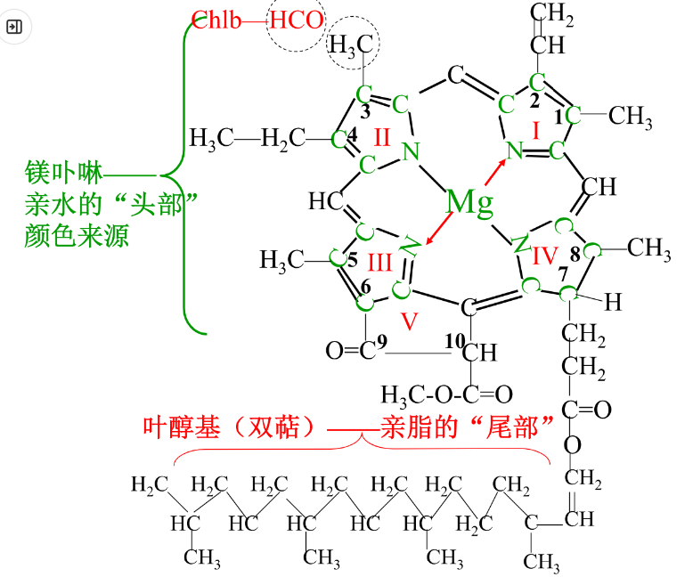
		- 可能的反应
			- 皂化反应：分离叶绿素和类胡萝卜素
				- 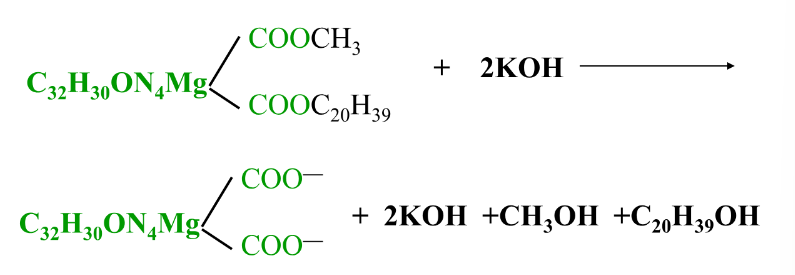
			- 取代反应：H+取代Mg2+, Cu2+ (Zn2+)取代H+ 
				- 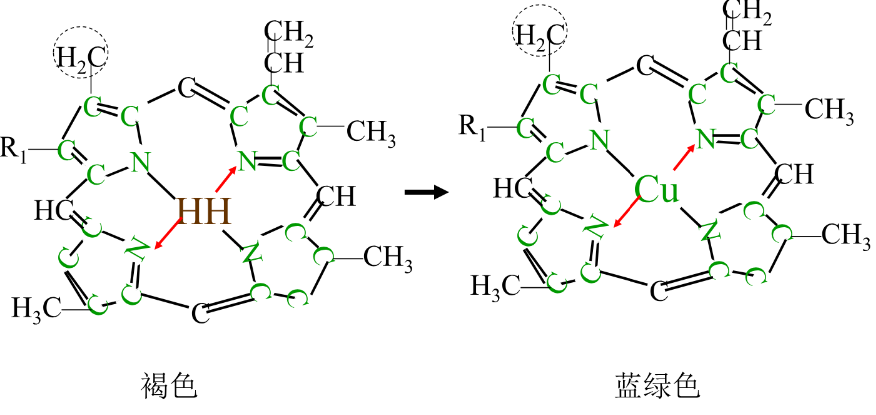
	2. Carotenoids
		- 不溶于水，溶于有机溶剂→与chloroplast相同
		- 胡萝卜素呈橙黄色；叶黄素呈鲜黄色
		- 属于四萜化合物——共轭双键体系——吸收和传递光能
- Optical characteristics of chloroplast pigments
	- Absorption spectrum:
		- Chl吸收光区： ==红光区(640-680 nm), 蓝紫光区(400-470nm)== 
			- 在红光区Chla的吸收峰波长长于Chlb的吸收峰波长,在蓝紫光区Chla的吸收峰波长短于叶绿素b的吸收峰波长
			- 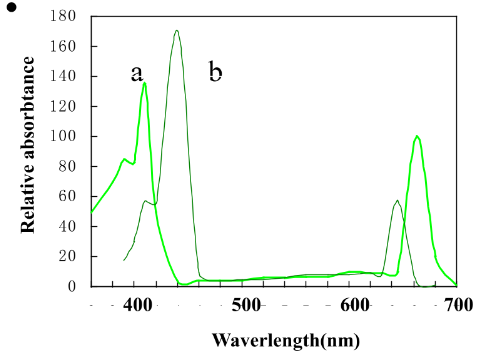
		- Carotenoids：吸收蓝紫光部分👉除吸收和传递光能以外，还可 ==稳定质体中的叶绿素分子== ，防止其自身氧化或被阳光破坏。
	- **Fluorecence and phosphorecence**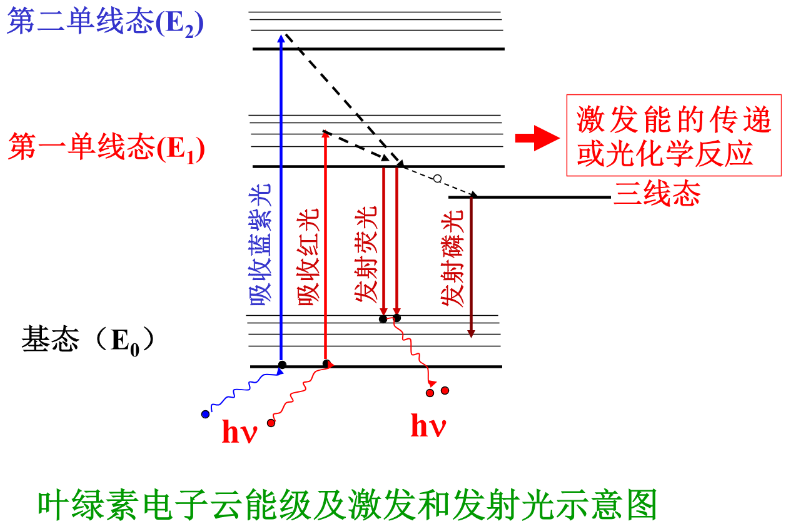
		- 荧光现象：叶绿素溶液在透射光下呈绿色，而在反射光下呈红色(叶绿素a为血红色,叶绿素b为棕红色)的现象称为荧光现象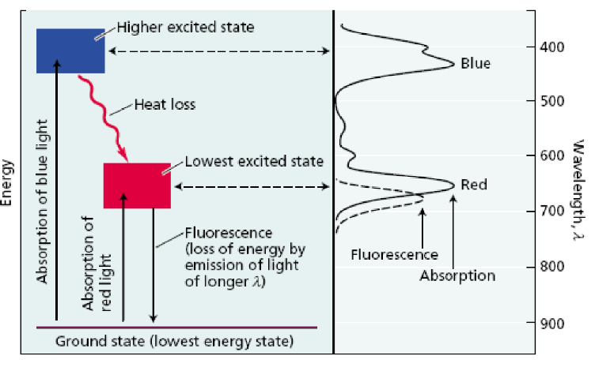
			- 荧光的寿命很短,约为10-9s。光照停止,荧光也随之消失。在进行光合作用的叶片很少发出荧光。
		- 叶绿素还会发出红色磷光,磷光的寿命为10-2～10-3秒,强度仅为荧光的1%
			- 能量最低，波长相对荧光更长，照射后发射所需的时间也相对较长
#### 3. Chl biosynthesis and enviroments
- Chl biosynthesis
	- 谷氨酸或α-酮戊二酸→δ-氨基酮戊酸(ALA) →2ALA →胆色素原（PBG) → 4PBG →尿卟啉原Ⅲ →粪卟啉原Ⅲ →有氧原卟啉Ⅸ → Mg-原卟啉(原卟啉Ⅸ与Fe结合,则可合成亚铁血红素) →原叶绿素酸酯→ ==经光照还原== 为叶绿酸酯→叶绿素a →叶绿素b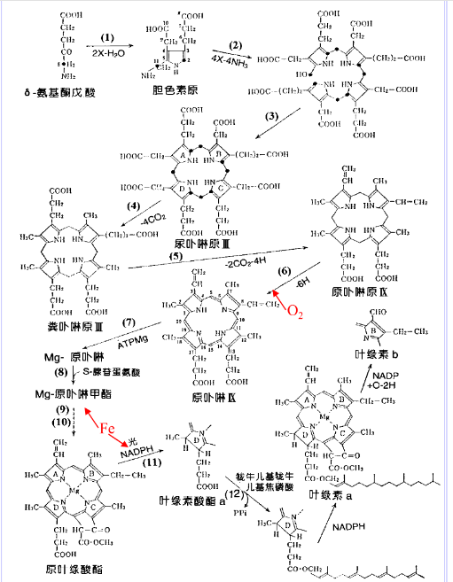
- Environmental conditions influencingChl biosynthesis
	- Light ： ==影响“原叶绿素酸酯→叶绿素酸酯”过程== →叶绿体发育不良→缺光黄化。
		- 例外—柑橘种子和莲子的胚芽
	- Temperature：约2-40℃,最适为30℃。喜温植物>10℃。秋天黄叶,早春嫩芽，早稻秧苗“节节白”
	- Mineral nutritions。缺N、Mg、Fe、Mn、Zn、Cu时出现缺绿病 #学科链接 土壤学与植物营养
	- O2：缺O2时引起Mg2+原卟啉Ⅸ及(或)Mg2+原卟啉甲酯积累,而不能合成叶绿素。
	- H2O：缺水时,Chl形成受阻,易受破坏
- 叶绿素分解：在Chl酶的作用下形成叶绿素酸酯→去Mg叶绿素酸酯→逐步氧化分解。
## Section3 Machanism of Photosynthesis
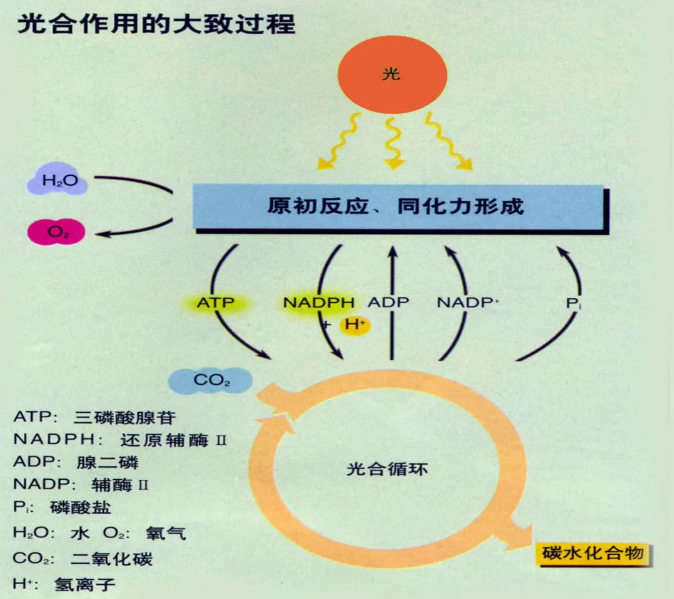
#### 1. Primary Reaction原初反应(类囊体膜，光能→电能)
1. Absorption of light energy
	- 原理：光能传递使叶绿体基态变为激发态👉普朗克定律、
	- 光合单位：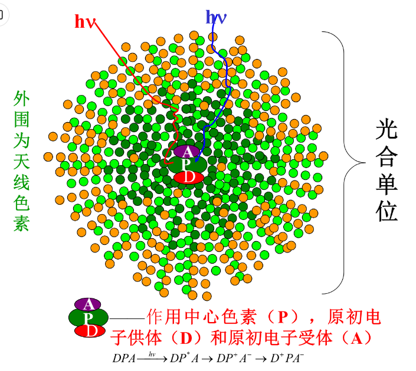
		- light-harvesting pigment集光色素)/antenna pigment(天线色素)
			- 只吸收和传递光能，不进行光化学反应的光合色素
			- Chlb, carotenoids, 大部分Chla
		- reaction centre pigment 作用中心色素/trap(陷井)
			- 吸收光或由集光色素传递而来的激发能后， ==发生光化学反应== 引起电荷分离的光合色素
			- Chla (a few)
2. Excited energy transfer:诱导共振、激子传递和电子迁移,但以诱导共振为主。
	- **诱导共振(inductive resonance)**：当某一特定的分子吸收能量达到激发态,在其重新回到基态时, ==使另一分子变为激发态== 
		- Similar to tuning forks
		- Chla,b几乎100%传给作用中心色素，Carotenoids约20-50%传给作用中心色素
		- 能量在传递过程中有一部分以热量散失，导致传递具有方向性或不可逆性，所以几乎每一个光量子最终都会到达作用中心
3. Photochemical reaction光化学反应
	- Concepts:光化学反应是指反应中心色素分子受光激发引起的 ==氧化还原反应== 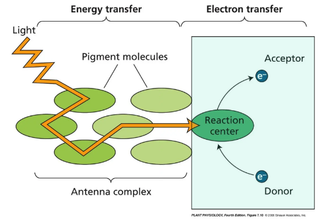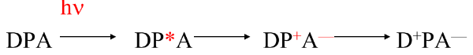
		- 由(P,pigment), (A,accepter),(D,Donor)组成
	- **Photosynthetic unit(光合单位)**：由250-300个叶绿素和其它集光色素分子构成的, ==能完成1个光量子吸收并转化== 的色素蛋白复合体
#### 2. Photosynthetic electron transport and photophosphorylation(电能→ATP/NADPH)
- Concepts：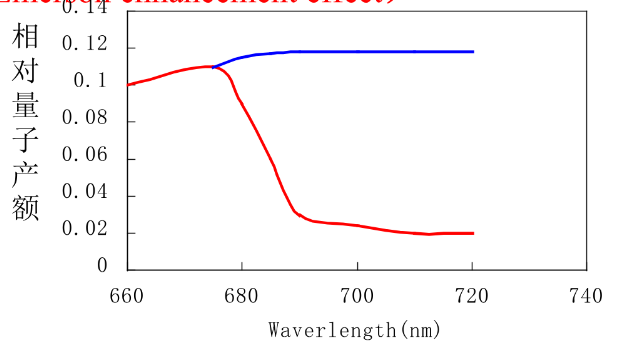
	- **量子产额**：每吸收一个光量子所同化的CO2分子数（或释放的氧分子数）称为量子产额
		-  蓝紫光区和红光区量子产额高；远红光可被大量吸收，但量子产额极大降低
		- 几乎每一个光子都能被传递到作用中心，用于光化学反应，因此光化学量子产量（photochemical quantum yield）接近100% #一些疑问 有啥区别？
		- 需要9~10个光子才能放出一分子氧气，所以相对量子产量为0.1
	- **红降现象**：小球藻能大量吸收波长>690nm的长波红光，但光合作用的效率却很低
	- **双光增益效应（爱默生效应）**：红降出现，如果加入辅助的短波红光（650nm）则光合效率大增，并且比这两种波长单独照射的总和还要高
- **光系统photosystem,PS**
	- 组分:捕光复合物和反应中心复合物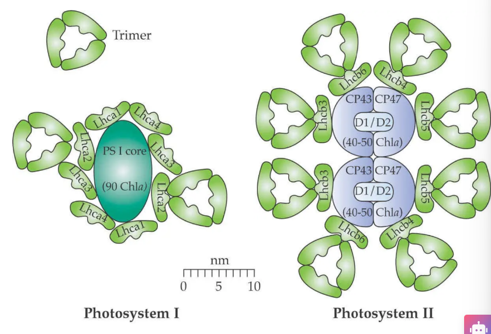
	- PSⅠ
		- 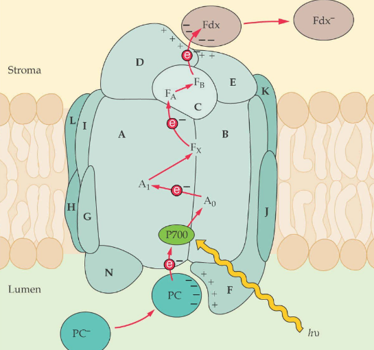
		- PSI的作用中心色素是**P700**;
		- 原初电子供体 PC (质体蓝素);原初电子受体A0;
		- 最终推动 ==NADPH形成== 。
	- PSⅡ:利用光能在类囊体膜腔一面将水水解，
		- PSⅡ的作用中心色素是P680。
		- 原初电子受体Pheo(去镁叶绿素), 原初电子供体YZ (酪氨酸上的电子残基)
		- PSⅡ的功能常与 ==放O2相联系== 。
		- Cytb6f
- Photosynthetic electron transport
	- Photosynthetic chain (光合链):是类囊体膜上由两个光系统(PSⅠ和PSⅡ)和若干电子传递体,按一定的氧化还原电位依次排列而成的体系The photosynthetic chain is composed of two photosystems (PS I and PS II) and several electron carriers arranged in orderon thylakoid membrane according to certain REDOX potential. 👉联系呼吸电子传递链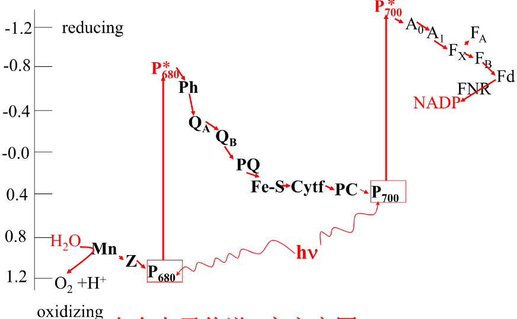 ^bb79aa
		- 在“Z”链的起点,H2O是最初的电子供体
		- 在“Z”链的终点,NADP+是电子的最终受体
		- 在整个链只有两处(P680→P680*, P700→P700*)是逆氧化还原电位梯度, ==需光能推动== 的需能反应
	- Main complexes consisting of photosynthetic chain: #待解决 整合与呼吸传递链的区别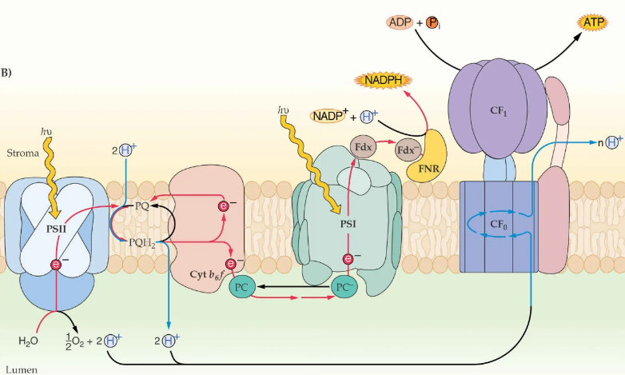
		- Complexes:
			- PSⅡ及其集光色素复合体(LHCⅡ),
			- PSI及其集光色素复合体(LHCI),
			- 细胞色素复合体(含Cytf、Cytb6和Fe-S蛋白),
			- 偶联因子复合体(又名ATP合酶
		- 传递载体：
			- PQ(plastoquinones，质体醌或质醌), 担负着传递氢(H+和e-)的任务
				- PQ穿梭在光合电子传递过程中PQ使间质中H+不断转入类囊体腔,导致间质pH上升,形成跨膜的质子梯度
			- PC(plastocyanin，质蓝素或质体菁),含铜蛋白质,PSI的原初电子供体
			- Fd(Ferredoxin,铁氧还蛋白),把电子传给FNR后还原NADP为NADPH,或把电子传给Cytb6，进行环式光合电子传递。
				- Fd还在亚硝酸还原,酶活化等方面具有多种功能
- Photosynthetic electron transport pathways
	- photophosphorylation:光下叶绿体在光合电子传递的同时，使ADP和Pi ==生成ATP== 的过程
		- 来源：质子动力势(proton motive force) ——ATP形成的动力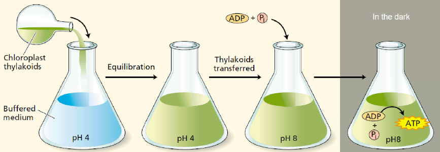
		- Assimilatory power：形成活跃的化学能ATP和NADPH合称为“同化力”
	1. **非环式光合电子传递和非环式光合磷酸化**
		- 产生O2、NADPH和ATP, 占总电子传递的70%以上
	2. **环式光合电子传递和环式光合磷酸化**
		- 只涉及了PSⅠ
			- P700出发依次经A0→A1→Fx→ FA→FB→Fd→ Cytb6→PQ→FeSR→Cytf→PC →P700+又形成P700，构成一个循环[[#^bb79aa]]
			- 这个过程无O2释放和NADP+还原，但在偶联情况下能产生ATP，
		-  ==产生ATP== , ATP的补充形式，占总电子传递的30%左右(用来节约NADP+来多形成一些ATP)
	3. **假环式光合电子传递和假环式光合磷酸化**
		- 涉及两个光系统，形成超氧自由基，对植物体造成危害
		- 在 ==强光== 下， ==CO2不足，NADPH过剩== 下发生
		- 该电子传递的路径与非环式十分相似，只是由H2O分解而来的电子不是被NADP+接收，而是传给分子态氧形成超氧自由基O2─•，后经一系列反应再形成H2O。这种看似电子从H2O到H2O的循环，又称水水循环
- water photolysis and oxygen evolving(水光解与氧释放)
	- **Hill(希尔)反应**(1937)：离体叶绿体(类囊体)加到有适宜氢受体(A)的水溶液中,照光后即有O2放出,并使氢受体(A)还原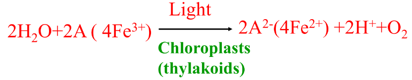
		- 特点：在光下放O2稳定，在暗适应后放O2波动
- 与氧化磷酸化的差别：氧化磷酸化是由高能化合物分子氧化驱动的，而光合磷酸化是由光子驱动的。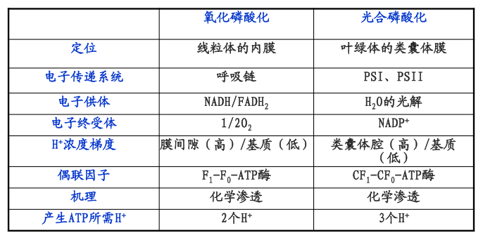
#### 3. CO2 assimilation in photosynthesis(活跃的化学能转化为稳定的化学能)
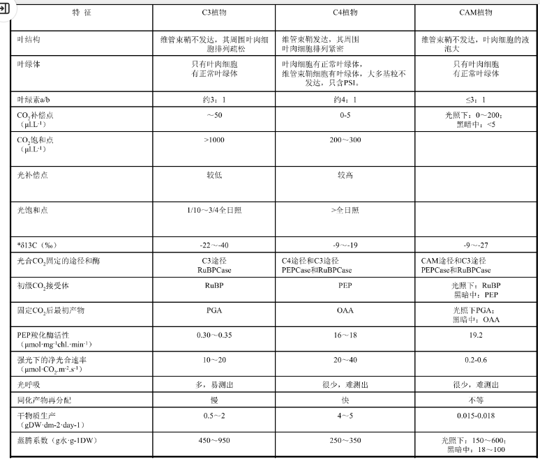
1. C3 photosynthetic pathway (Calvin cycle, RPPP) /还原磷酸戊糖途径（reductive pentose phosphate pathway，RPPP）
	- 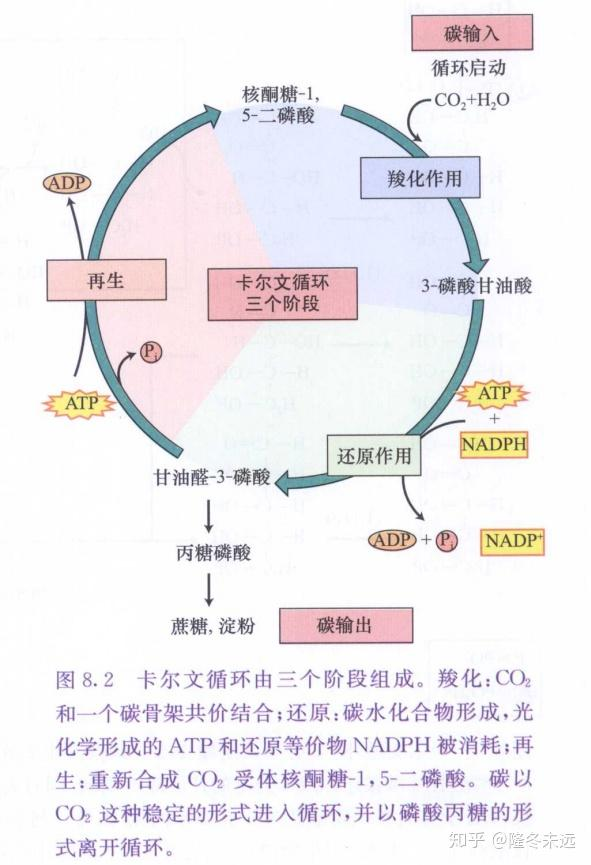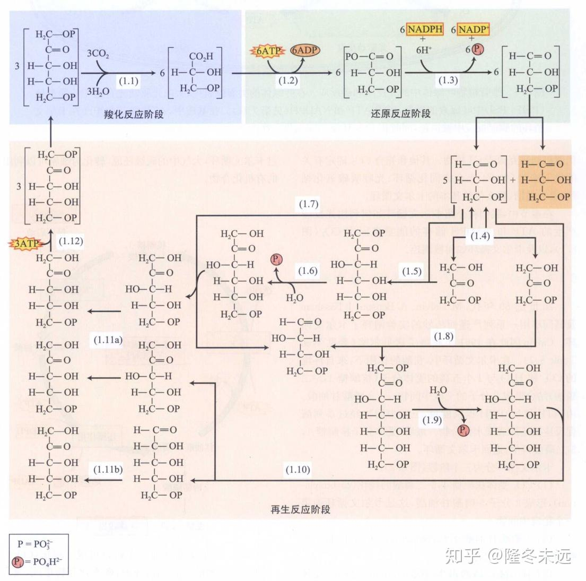
	- 指光合作用中CO2固定后的 ==最初产物是三碳化合物== 的CO2同化途径
	- 只具有C3途径的植物称C3植物 e.g.水稻、棉花、菠菜、青菜,木本植物几乎全为C3植物
		- 用放射性同位素标记的CO2供给小球藻→每隔一定时间取样，并将样品立即加入到煮沸的甲醇中(甲醇用以杀死小球藻并提取标记化合物)
		- 浓缩后再点样进行**双向纸层析**，使标记化合物 ==分离== 。根据标记化合物出现的时间，最先检测到的是三碳化合物。猜测此三碳化合物是CO2与某一个二碳分子结合生成的，但当 ==突然降低CO2浓度== 后，发现**RuBP**的含量快速升高，由此推知固定CO2的物质不是二碳分子
	- 过程：
		1.  Carboxylation (羧化阶段)
			1. **RuBP羧化酶（RuBPCase**，核酮糖1,5-二磷酸羧化酶(ribulose-1,5-bisphosphate carboxylase, )催化  #重点 
		2. Reduction(还原阶段)：这是利用“同化力”把3-PGA还原为GAP
		3. RuBP regeneration(再生)：C3植物固定1分子CO2实际上消耗3分子ATP和2分子NADPH
2. **C4 photosynthetic pathway (C4途径，C4-dicarboxylic acid pathway)** 
	- 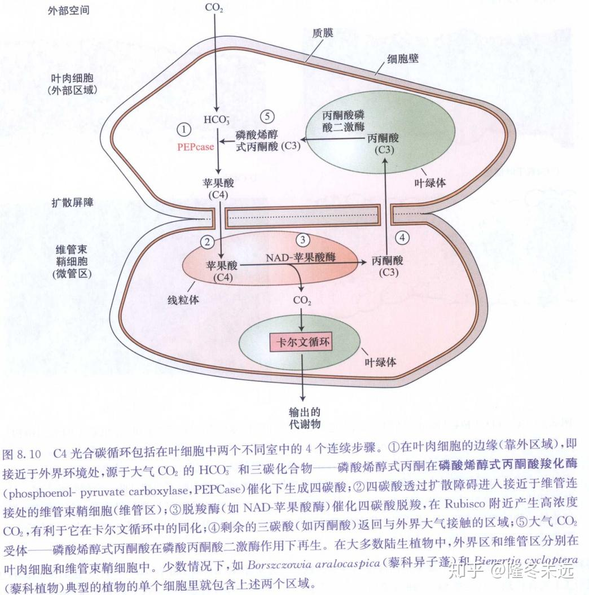
	- 1960sM.D. Hatch和C.R. Slack证实甘蔗固定CO2后的初产物是OAA(四碳二羧酸)故称该途径为C4途径或C4二羧酸途径,又名Hatch-Slack pathway
		- 具有C4固定CO2途径加C3途径的植物叫C4植物。大多为禾本科杂草,农作物中只有e.g.玉米、高粱、甘蔗、黍与粟等数种
			- 特点:维管束鞘“花环状”
			- 优点：**PEP羧化酶**具有很强的 ==CO2亲和能力== ，远高于 C3 植物中的 Rubisco，且不与 O₂结合，避免光呼吸
	1. CO2 Fixation——叶肉细胞
		- PEPCase(phosphoenolpyruvate carboxylase)催化PEP加HCO3-形成OAA(oxaloacetic acid)→ #学科链接 生物化学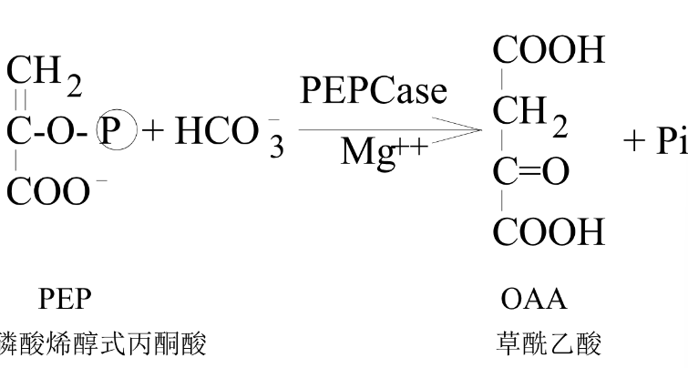
	2. CO2 transferL根据脱羧酶类不同，C4途径植物分为三种类型
		1. NADP-苹果酸酶类型：玉米、高粱、甘蔗属于这一类型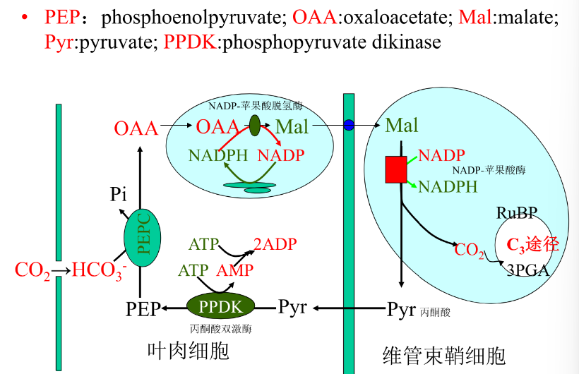
		2. NAD-苹果酸酶类型：马龄苋、黍等属于这一类型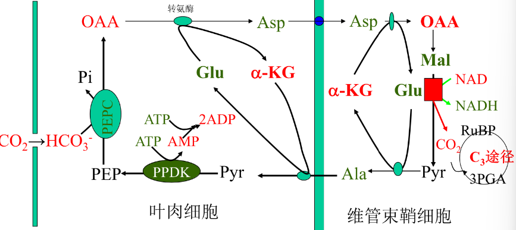
		3.  PEP-羧激酶类型：盖氏狼尾草、大黍等属于这一类型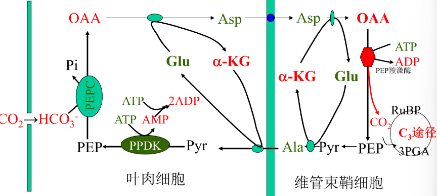
			1. PEPCase对HCO3-的亲和力很强,有 ==把外界低浓度CO2浓缩到维管束鞘细胞== 中的作用——“CO2泵”
		4. PEP regeneration：C4植物固定1分子CO2为磷酸丙糖,实际消耗5分子ATP
3. Crassulacean acid metabolism (CAM)pathway
	- 具有CAM途径和C3途径的植物叫CAM植物
		- 多属 ==肉质或半肉质== 植物,如景天、仙人掌、菠萝、剑麻等，有20000-30000种， 适应干热条件
	- Pathways #待解决 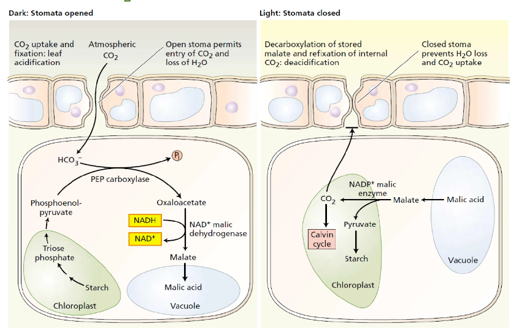
		- 夜间CAM植物气孔开放, C4途径固定CO2，淀粉减少,苹果酸增加,细胞液变酸
		- 白天气孔关闭,利用光能，C3途径同化CO2，苹果酸减少,淀粉增加,细胞液pH上升(pH6.0左右)
4. Synthesis and regulation of sugar and starch in photosynthesis
	- 小麦、水稻、蚕豆等光合产物主要是蔗糖Sucrose，边进行光合边输出S，称**糖叶**；
		- 蔗糖在 ==细胞质中合成== ，F2,6P是抑制剂
			- 光下F-2,6-P含量降低，FBP很快转为F6P
			- 黑暗F-2,6-P含量增加，FBP很难转为F6P
	- 棉花、大豆、烟草、豌豆等光合产物主要是淀粉（Starch），暂存于叶片，夜间降解后再输出，称**粉叶**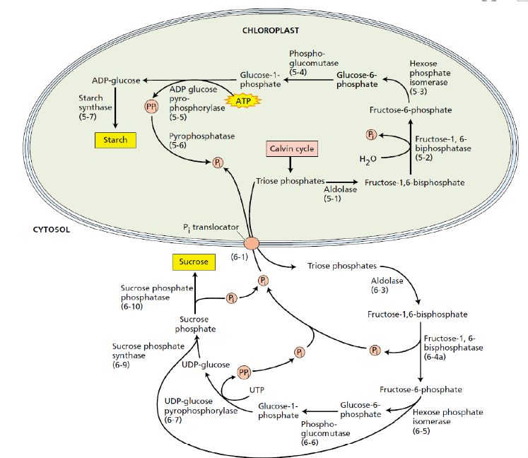
		- 淀粉 ==在叶绿体中合成== ，不受F2,6P抑制
- C3植物与C4植物结构的差异比较： #重点 
	- 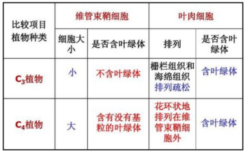
## Section4 Photorespiration(C2 cycle)
#### 1.  Biosynthesis and metabolism of glycolic acid
- Concepts:光呼吸是指高等植物的绿色细胞在光下吸收O2放出CO2的过程
	- Photorespiration (C2 cycle)：实质上是乙醇酸的生物合成及其氧化代谢过程，完成全过程依次涉及到 ==叶绿体、过氧化物体和线粒体== 三种细胞器
	- 底物：乙醇酸Glycolic acid
- Biosynthesis of glycolic acid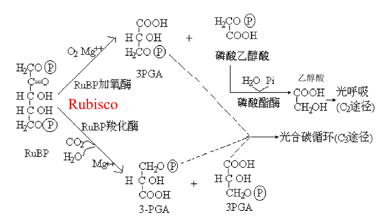
	- 当空气中CO2/O2比值较高时,有利羧化反应 ,比值较低时有利加氧反应.
		- 大气CO2(350μl/L)和O2(21%)的条件下,羧化强于加氧
		- 当O2分压降至2%时,无加氧反应发生,也测不到光呼吸。
- Metabolism of glycolic acid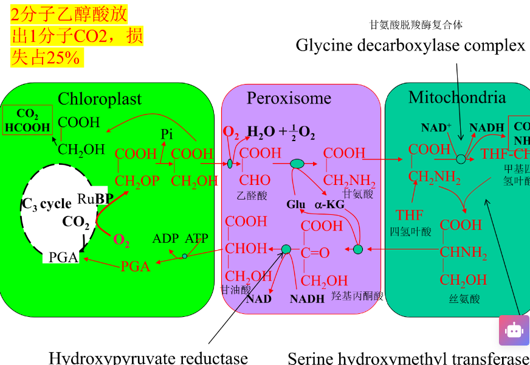
	1. Pathways
		1. RuBP加氧酶（就是RuBP羧化酶）催化RuBP与O2与H2O结合生成1个磷酸乙醇酸与1个3-PGA，前者进入光呼吸，后者进入光合碳循环
			- CO2/O2比值较高时，有利羧化反应，比值较低时有利加氧反应
		2. **叶绿体中**：磷酸乙醇酸在磷酸酯酶作用下生成乙醇酸，由于乙醇酸是二碳化合物，故乙醇酸循环又称C2循环
		3. 过氧化物体：乙醇酸进入**过氧化物体**生成**乙醛酸**，乙醛酸又转变为**甘氨酸**，
		4. **线粒体**：甘氨酸转变为**丝氨酸**，丝氨酸回到过氧化物体最终形成**甘油酸**，甘油酸回到叶绿体称为**3-PGA**，最终再生RuBP
	2. 整个光呼吸碳素损失占25%。O2 的消耗是在叶绿体和过氧化体，而CO2的释放则是在线粒体 ( 少量在叶绿体 )
#### 2.  Physiological function of photorespiration
- 防止高光强对光合器的破坏
	- 同化力的过剩易引发超氧自由基,或第一激发态氧(1O2)，对光合器官有很强的氧化破坏作用
- 防止O2对光合碳同化的抑制作用：维持RuBP羧化酶活化状态（E-CO2-Mg2+）avoiding inhibition of O2 to photosynthetic carbon assimilates
- 消除乙醇酸毒害和补充部分氨基酸（甘氨酸和丝氨酸）
#### 3. Control of photorespiration
1. 提高CO2浓度
	- 温室或大棚——干冰(固体CO2)
	- 大田——行向,增施有机肥，深施——NH4HCO3
2. 应用光呼吸抑制剂：α-羟基磺酸盐/亚硫酸氢钠(NaHSO3)/2,3-环氧丙酸
3. 筛选低光呼吸品种 “同室效应法”
	- C4植物CO2补偿点低于C3植物👉C3，C4植物同时种植于密闭温室，由于CO2消耗， ==C3植物死亡== ，而C4植物仍可正常生长。用同法筛选低光呼吸C3植物
4. 改良Rubisco
## Section5 Factors affecting photosynthetic rate
#### 1. Concepts
- 光合作用指标：光合速率 (Pn,μmolCO2 ( O2 )/m2·s)
	- 测定：改良半叶法,红外线CO2分析法和氧极谱法。
	- **净光合速率(net photosynthetic rate,Pn)** =总(真)光合速率(Pt)－呼吸速率(Pr)
- **光合能力( photosynthetic capacity)**：是指在饱和光强、正常CO2和O2浓度、最适温度和高RH条件下的 ==光合速率== 
	- 种和品种,叶龄和叶位等的差异
	- 光能的吸收、传递和转化能力
		- 光合色素的含量,尤其是叶绿素总量及叶绿素a/b的比值
		- 叶绿体片层结构的发达与否
	- CO2固定途径：C4>C3>CAM植物
	- 电子传递和光合磷酸化活力
	- 固定CO2有关酶的活力：Rubisco；PEPC
	- 光合产物供求关系—— 源库关系
		- 开花结实(块根、块茎、膨大)→叶片光合速率提高
		- 去除穗、花果等→光合速率立即下降。去除部分叶片,剩余叶片的光合速率会由于需求的增加而上升
#### 2. Environmental factors affecting photosynthetic rate
^a90dde

1. **Light 光**：能量来源→叶绿体发育和叶绿素合成；调节光合碳循环中某些酶的活性(强光导致光抑制)  #重点 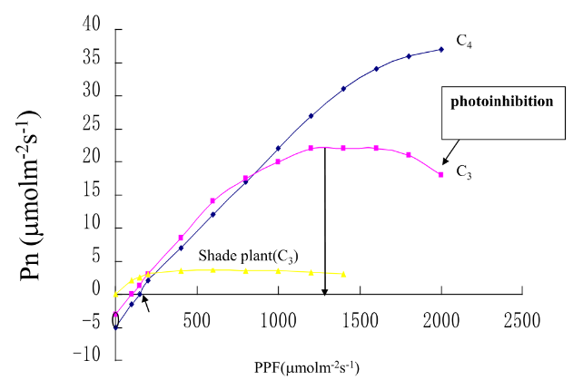
	 - Light intensity PAR (Wm-2 )(photosynthetically active radiation,光合有效辐射)
		 - PPF(D) (μmolm-2s-1)(photosynthetic photon flux (density) 光合光子通量(密度))
		- **light saturation point(LSP)**:净光合速率 ==达到最大== 时的光强,叫光饱和点
		- **light compensation point(LCP)**：净光合速率 ==等于零时== 的光强,叫做光补偿点
		- Photoinhibition：光合作用的光抑制现象，表现为强光下光合速率降低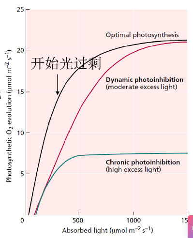
			- Dynamic photoinhibition：仅降低量子效率
			- Chronic photoinhibition：量子效率和最大光合速率均降低
			- Reasons:
				- PSII is inactivated and damaged
				- Excessive ROS production
	- 光质：红光光合效率最高 , 蓝紫光次之 , 绿光最差(因为植物反射绿光所以绿绿)
2. CO2——光合作用的原料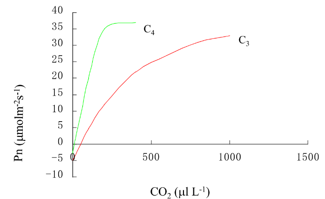
	- CO2 saturation point：再增加CO2浓度,光合速率不再增加,这时的环境CO2浓度称为CO2饱和点
	- CO2 compensation point： ==净光合率等于0时== 的环境CO2浓度称CO2补偿点
		- C3植物高于C4植物👉可以理解为需要更多的CO2才能反应
	- 长期的高CO2对光合的影响？ #待解决 
3. Temperature 光合作用温度三基点
	1. 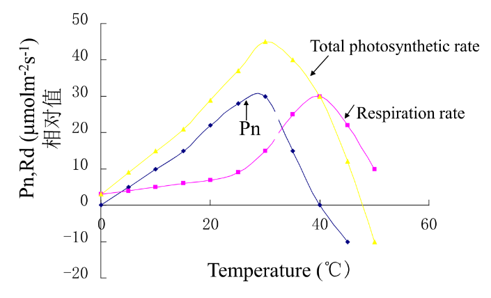
	2. Photosynthesis depends strongly on temperature at saturating CO2 concentrations. Note the significantlyhigher photosynthetic rates at saturatingCO2 concentrations. #待解决 
	3. C4植物的最高温度与最适温度均高于C3植物
4. Water：水分缺少时光合下降，幼叶光合降低受缺水的影响更大
	- 气孔因子：这时光合速率的下降与气孔导度和胞间CO2浓度分别呈线性正相关(适度缺水时发生)
		- 气孔导度stomatal conductance (SC)下降可引起胞间二氧化碳浓度intercellular CO2 (Ci)下降，最终使光合速率下降。
	- 非气孔因子：光合速率下降,气孔导度也在下降,但胞间CO2浓度却升高(严重缺水时发生) #待解决 why?
		- Rubisco羧化限制；光化学活性限制
5. O2
	- 1920年，Warburg发现O2对藻类光合作用产生抑制作用,这种现象称为**瓦布格效应**
	- 原因：
		1. O2 促进 ==Rubisco加氧活性== ，加强光呼吸
		2. O2与NADP+竞争光合链上的电子，减少NADPH形成。
		3. 形成活性氧
6. Mineral nutrition
	1. 
#### 3. 光合速率的日变化
- “午睡”现象：中午强光下光合下降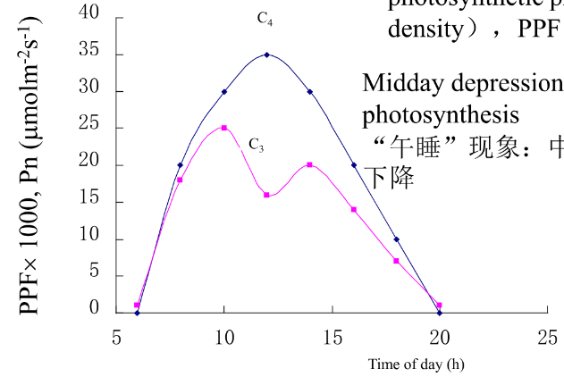
	1. 中午CO2浓度过低引起[[#^a90dde]]
	2. 中午温度过高,引起暗呼吸和光呼吸上升
	3. 中午相对湿度过低,导致叶片失水过多, ==气孔关闭== 影响CO2进入
	4. 光合产物的积累对光合作用的反馈抑制
	5. 光抑制引起作用中心活性降低
	6. 光合碳同化有关酶活性降低
	7. 内生节律的调节(我也要睡午觉!!!🤯)
## Section6 Solar energy utilization efficiency and matter production
#### 1. Efficiency for solar energy utilization
- 光能利用率：植物约为1%,森林只有0.1%,大田作物为1-4%
$$
光能利用率（(\%)）(=\frac{单位面积作物干物质所含热量（J）}{单位面积太阳平均总辐射能（J）}\times100)
$$
- Theoretical efficiency for solar energyutilization in plant
	- Quantum requirement: 量子需要量：光合作用中每同化一分子CO2(放出一分子O2)所需的光量子数 #名词解释 
	- Quantum efficiency:量子效率：每吸收一个光量子所能同化的CO2(释放的O2)的分子数
		- C3途径消耗3ATP和2NADPH→量子需要量是8-10,量子效率则是1/8-1/10
		- 蓝紫光——高达15-20%
- 植物光能利用率低的原因：漏光损失；叶片反射及透射损失；光饱和现象的存在
#### 2. Methods to increase in efficiency for solarenergy utilization
- 经济产量=生物产量×经济系数
	- 生物产量=光合面积×光合强度×光合时间-光合产物消耗
	- 经济产量=(光合面积×光合强度×光合时间-光合产物消耗)×经济系数
- 提高光能利用率的方法 
	- 改良光合作用效率是增加作物产量的有效途径
	- 加速光保护状态的恢复→从强光中回来时恢复的过程很缓慢，浪费时间
	- 提高气孔导度
	- 提高光合电子传递效率
	- Q:如何把C3改成C4呢？
		- 叶片结构：通过基因编辑→将分化维管束鞘的基因进行编辑
			- 单细胞双组学揭示C4植物的光和进化新机制 #课后拓展 
-----
1. Why can we say that Rubisco is a key enzyme for photosynthesis? 
2. Which spectra are absorbed by chlorophyll, why?
3. Why may we say that C3 pathway is fundamental pathway for plant kingdom? 
4. What is photosynthetic mechanism divided into, and how does each step carry out ? 
5. How to improve photosynthetic productivity in physiology and production, respectively ?
-----
- References:
	- [光合作用全过程？ - 知乎](https://www.zhihu.com/question/60748169)
	- [中国科学院遗传与发育生物学研究所张有君团队综述植物中碳同化工程设计 - 知乎](https://zhuanlan.zhihu.com/p/19499256980)
	- [光合作用的碳代谢途径 - 环境百科全书](https://www.encyclopedie-environnement.org/zh/vivant-zh/path-carbon-photosynthesis/)
	- [光合作用 - 知乎](https://zhuanlan.zhihu.com/p/130484374)