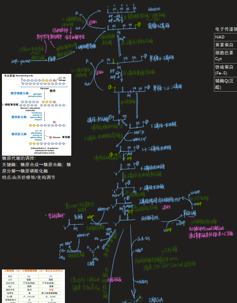
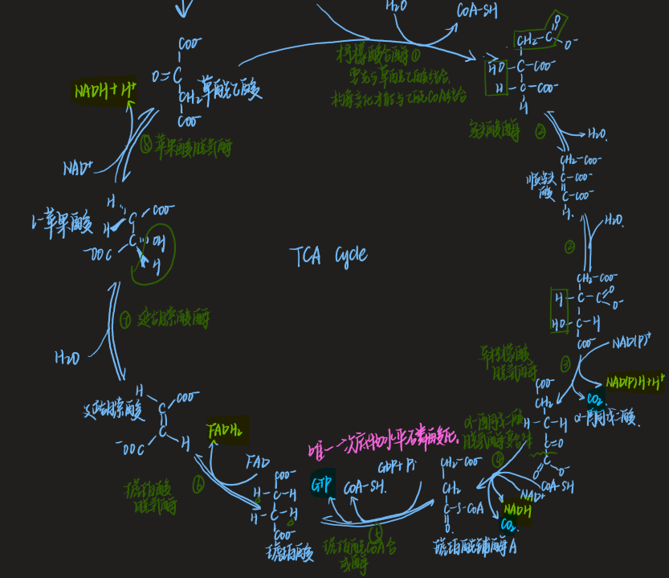
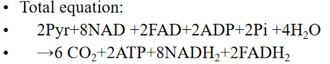
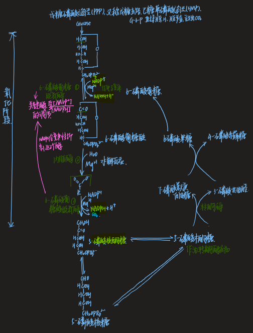
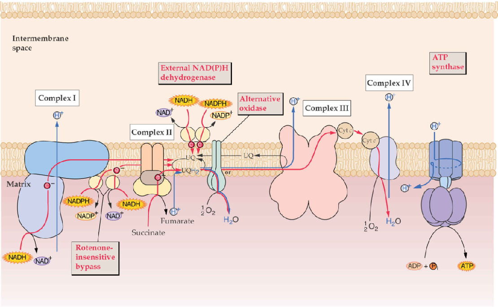
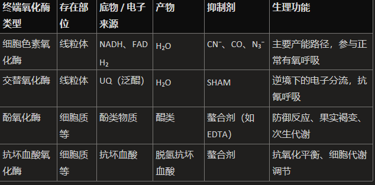
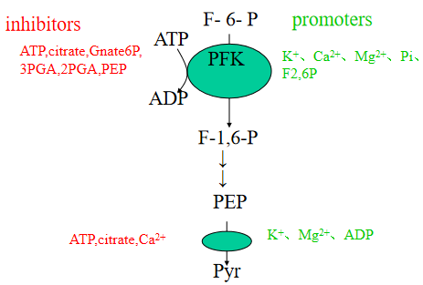
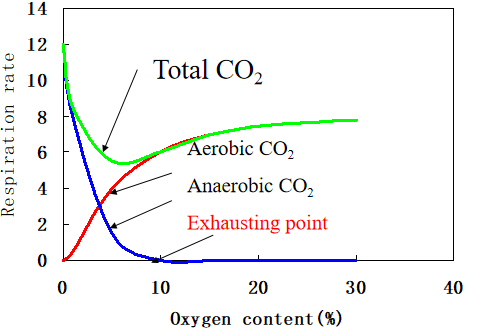
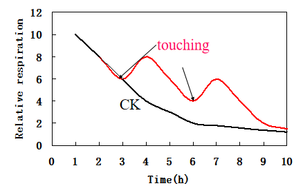
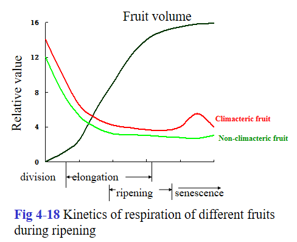

## Section1 Concepts
#### 1.1 Concept of respiration
- Concepts:指生活细胞经过某些代谢途径使有机物质氧化分解，并释放能量的过程
	- Aerobic respiration(有氧呼吸):指生活细胞在O2的参与下，可把某些有机物质彻底氧化分解，放出CO2并形成H2O，同时释放能量的过程
		- 呼吸底物：糖、脂肪和蛋白质。常用的呼吸底物是G
	- Anaerobic respiration:In the absence of O2,  living cell makes respiratory substrates degrade partly, companied with  unlocking of less energy. 
		- Fermentation in microbes.
		- 生成酒精/乳酸
#### 1.2 Physiological role of respiration
- Provide the energy for life activity
- Provide the intermediate products(skeleton for other biosythesis)

## Section2 Respiratory pathway of plant
#### 2.1 Glycolysis:EMP pathway👉参考OneNote笔记

^7e3134

#### 2.2 TCA cycle
- 场所:线粒体基质mitochondrial matrix
- 过程:
	- Total equation:
	- 放出3分子CO2
	- Key mediate products:
		- α-KG→Glu, Chl
		- OAA → Asp,  
		- CH3CO-CoA →Fatty acid，
		- NADH2 for other reduction or synthesis
#### 2.3 Pentose phosphate pathway(PPP,HMP)
- 过程
	1. 6分子G6P→6分子Ru5P(5-磷酸核酮糖)
		- 用14C标记G-6-P上的C1位饲喂植物组织，注意脱去的CO2均为第1位上的C原子
	2. 6分子Ru5P→重新变成5分子G6P
## Section3 Biological Oxidation
#### 3.1 Structure and function of mitochondria[[Chapter5 细胞的能量转换器]]
#### 3.2 Respiratory chain

#### 3.3 Terminal oxidases 
- Concepts:Terminal oxidases are enzymes by which the electron derived from substrate is transferred to molecular O2 , and H2O or H2O2  is formed.终端氧化酶是指 ==将底物电子传递给分子氧== ，使其**形成水或过氧化氢**的酶
- 类型
	- 
	- Terminal oxidases in mitochondrion
		- Cytochrome oxidase**细胞色素氧化酶**
			- 由Cytaa3组成，含有Fe与Cu离子，催化电子从细胞色素传递到氧气,，最终生成水
			- 参与有氧呼吸的电子传递链末端反应
			- 对氰化物CN⁻、叠氮化物N₃⁻和一氧化碳CO敏感，这些抑制剂会阻断电子传递，抑制呼吸作用
		- **交替氧化酶（Alternate oxidase，抗氰氧化酶）**
			- 提供一条 ==不经过细胞色素链== 的电子传递途径，直接将电子从泛醌（UQ）传递给氧气， ==生成水== 
			-   NADH→FMN→Fe-S→UQ(在此处作用)→O2​→H2​O
	- Terminal oxidases  except for mitochondria
		- **酚氧化酶（Phenol oxidase）**
			- 催化酚类物质 ==氧化为醌类== 
			- 参与植物的防御反应（如受伤后的伤口愈合）和果实成熟过程e.g.如苹果、茶叶的褐变
		- **抗坏血酸氧化酶（Ascorbic acid oxidase，AAO）**
			- 催化抗坏血酸(维生素 C)氧化为脱氢抗坏血酸，参与抗氧化代谢和细胞内氧化还原平衡调节
- Significance
	- 参与能量代谢调控，如细胞色素氧化酶是呼吸作用产能的核心，交替氧化酶在逆境下维持基础呼吸
	- 逆境适应→保护线粒体免受氧化损伤
	- 次生代谢与防御
	- 呼吸链多样性：能够调整电子传递的路径
#### 3.4 Oxidative phosphorylation
- **氧化磷酸化**：A process in which ATP is synthesized with ADP and Pi, while the respiratory electron is transferred along respiratory chain to O2底物脱下的氢经过呼吸链传递给氧气的过程中伴随着ADP和Pi合成ATP的过程，这个过程就是氧化磷酸化
	- 机理：化学渗透假说
- **磷氧比P/O**：每消耗一分子氧气形成的ATP数目
	- NADH为3，FADH2为2，细胞色素途径为3（最后那步形成3个ATP）
	- 抗氰呼吸最后那步只形成1个ATP

## Section4 Regulation and indexes
#### 4.1 Regulation of respiration
 1. **Energy charge (EC) regulation**:  ==Adenyl acid(腺苷酸)==  levels regulate the respiratory metabolism. 
	- EC reflects the energy levels in cell, and the following formula is often represented:$$EC = \frac{[\text{ATP}] + \frac{1}{2}[\text{ADP}]}{[\text{ATP}] + [\text{ADP}] + [\text{AMP}]}$$
2. Regulation of EMP pathway[[#^7e3134]]
	- **Pasteur effect (巴斯德效应)**: O2 inhibits anaerobic respiration (glucolysis).氧气能够抑制糖酵解过程
3. Regulation of TCA cycle:通过能量(ATP)和NADH2的浓度来控制
4.  Regulation of PPP
	- Inhibited by NADPH and ATP in competition;
	- Regulated by NADP/NADPH, NAD/NADP in mass; 
		- NADP↑,PPP↑，fatty acid or terpene synthesis, NADPH ↓, NADP↑ , PPP ↑.
#### 4.2 Respiratory indexes [[Chapter3 Photosynthesis]]
- **Respiratory rate(呼吸速率)**:单位植物组织(鲜重、干重、原生质)在单位时间**释放的CO2或吸收O2的量**
	- 因植物种类、年龄、器官和组织而有差异。
- **Respiratory Quotient(R.Q.)呼吸商(系数)**:是植物组织在一定时间内释放的CO2与吸收的O2的mol（或V）数的比值
	- R.Q.=  ==释放== 的CO2摩尔/ ==吸收== 的O2摩尔数
		- Sugar as a substrate: R.Q.=1
		- Fatty acid as a substrate: RQ<1,可以理解为脂肪氧化需要消耗更多的氧气
		- 有机酸作为底物Organic acid as a substrate: RQ>1
- **espiratory efficiency(RE,呼吸效率)**:合成的大分子产物与消耗的糖类的比值
#### 4.3 Factors affecting respiration
1. Internal factors:在不同植物、组织和生长周期中都有所不同
2. Environmental factors
	- Temperature
		- Q10=增加10℃的呼吸速率/原本温度下的呼吸速率
		- Optimum respiration temperature:在该温度下呼吸速率很高并且能够维持很长时间
	- H2O:
		- Loss of water for plant flesh tissue, respiratory rate↑; 
		- With water content ↓ respiratory rate for dry seed ↓;👉种子要干燥保存
		- When water rises a little , respiratory rate of dry seed increases rapidly. 
	- O2
		- O2↑,respiration↑
		- O2 too low， respiration ↑ 
		- **Exhausting point(消失点，熄灭点)**:O2 concentrations at which anaerobic respiratory occurs no longer.氧气达到某一浓度时， ==无氧呼吸不再进行== 
	- CO2：二氧化碳浓度增加，呼吸速率下降→用于果实保鲜
		- 当二氧化碳浓度大于10%的时候，植物死亡
	-  ==Wounding and stimulating== ：这就是为什么水果要套袋😋
	- 
## Section5 Respiration and Agricultural Production
#### 5.1 storage of seed
- 关键原则：降低呼吸速率
- **储藏种子**的方法总结：干燥、低温、低氧[[Chapter6 种子萌发]]
	1) Fully dry the seed (food), and control the seed water content below safety water content, in which seed can be stored one cycle year. 
		1) Graminous 12—13%, soybean 11%，rape seed 8-10%。Seed-ultradried storage 1-4%
	2) Lower seed  (food) temperature,-4 —4 ℃。super-low temperature storage（-193℃）
	3) Regulation of gas components.： ==Filling with N2, CO2 == or autonomously decrease in O2 by respiration.
- **storage of fruit**
	- **Respiratory climacteric呼吸跃变**：果实呼吸速率随着果实的成熟开始下降，但在成熟时突然增加到峰值，然后再次下降
		- e.g.苹果，桃子，梨子，香蕉等(好多蔷薇科😋
		- ACC含量升高，导致Eth增加。乙烯是呼吸跃变的重要原因之一
		- 过了呼吸高峰，果实开始衰老
	- 原则：降低呼吸速率，减缓呼吸跃变
		1) Lower T, but not to cold injury.可以在低温保存，但是别冻伤它们😰
		2) Gas control,  increase in CO2，decrease in O2，a suitable ventilation.同上
		3) Removing Eth：storage or transportation通风!
		4) Gene modification (transgenic plant):anti ACC synthase in tomato
