---

---
## Section1 Photoassimilate transport systems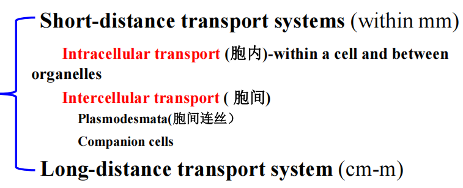
#### 1.1 代谢的区室化Compartmentation
- Structure：PPT上
- Functions
	- 不同的区域行使不同功能
	- 增加酶和底物的浓度
	- 为特殊的反应提供适合环境
#### 1.2 Short distance transport systems
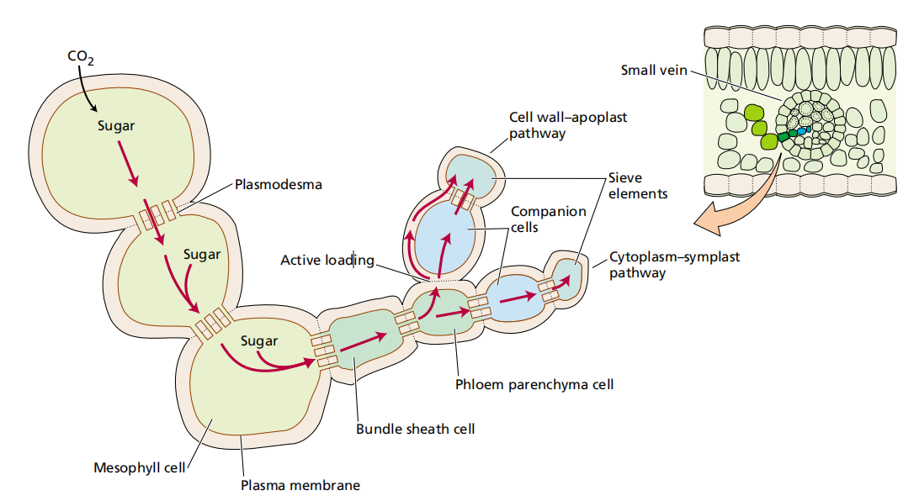
##### 1.2.1 ==Intra== celluar transport胞内运输
1. Protoplasmic streaming胞质环流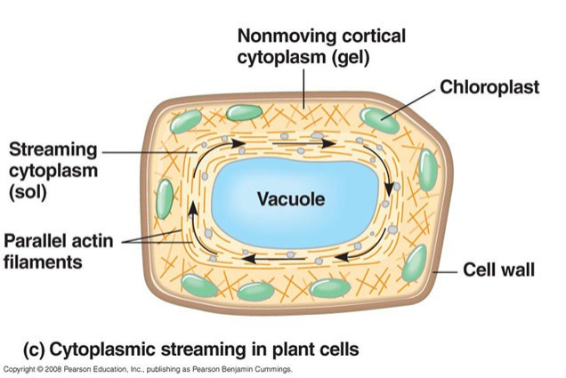
2. Transporters-Pi transporter #一些疑问 这个转运体的本质是什么？通过什么反应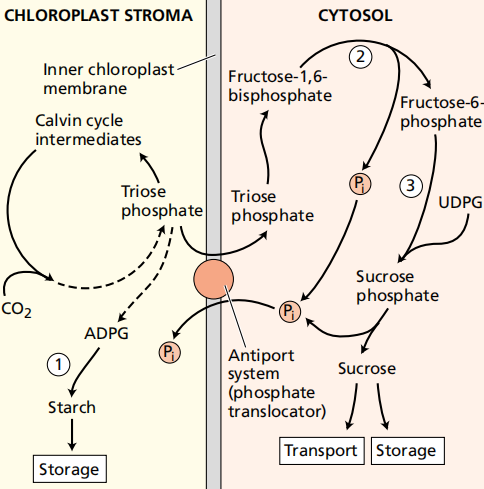
3. Cytosis膜动转运
##### 1.2.2 Intercellular transport
- 共质体途径
	- **plasmodesmata胞间连丝** #重点 →在叶片中都是这么运输的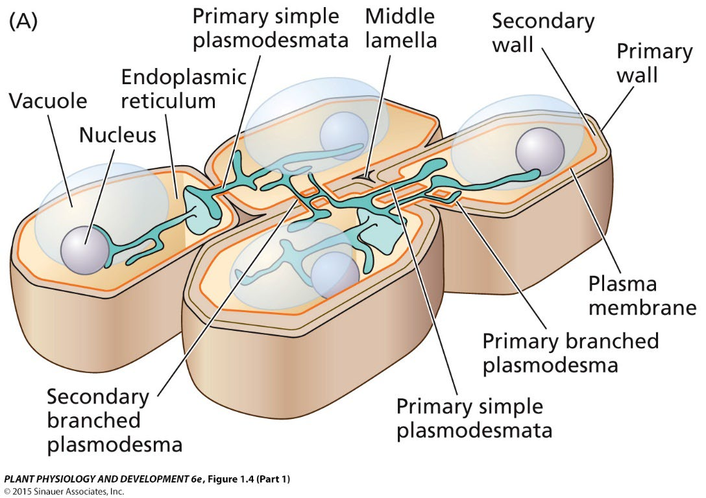
		- #课后拓展 为啥动物细胞没有？动物细胞**没有细胞壁**，细胞直接通过细胞膜与外界或相邻细胞接触，具有更高的流动性和可塑性，无需通过穿透细胞壁的结构来实现细胞间连接
		- 本质：内质网
		- 特例：成熟的保卫细胞和周围的细胞		
		- Functions：物质运输/提高运输效率
		- 运输大小：<1000D
			- 特例→Move Protein,MP：能够装载病毒RNA，将其折叠传到另一个细胞 #课后拓展 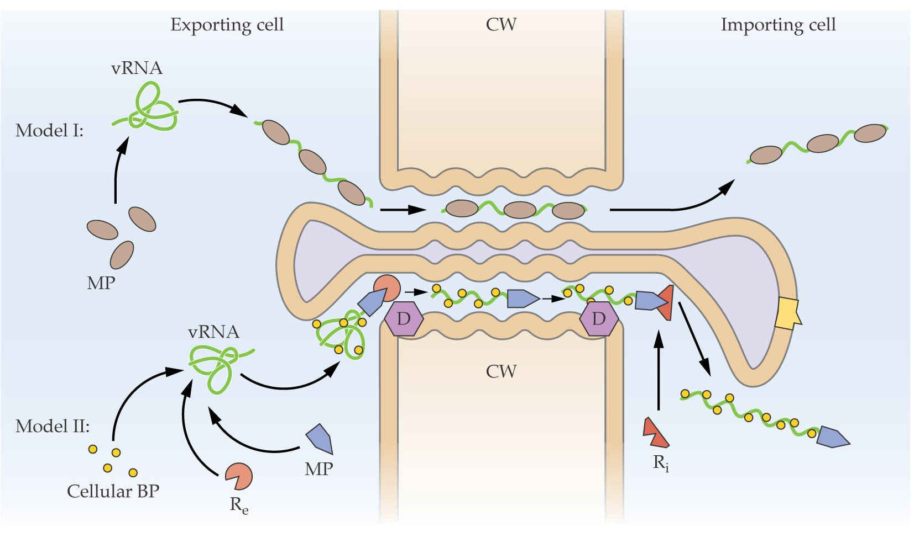
- 质外体途径
	- **compaion cells**→ ==含有大量的线粒体== →为了更好地运输到筛管 ^ba70a5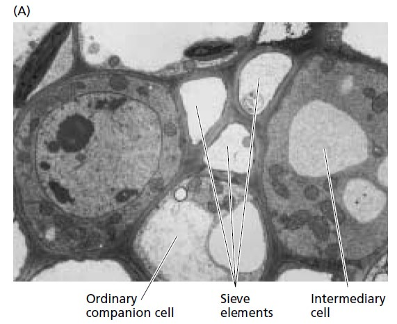
		- **常见伴胞Ordinary companion cell**
		- **运输细胞Transfer cell**
			-  ==表面积很大== ，细胞壁和质膜呈褶皱纹状(内突生长→线粒体的嵴)
			- 胞质溶胶和细胞器丰富， ==代谢活性高== 
			- 能从质外体转运分子
		- 中间体细胞intermediary cell

| 伴胞类型  | 特征                                              | 装载途径         |
| ----- | ----------------------------------------------- | ------------ |
| 常见伴胞  | 具有类囊体发育良好的 ==叶绿体== ；与筛管细胞有许多胞间连丝相连，但是与周围细胞的胞间连丝较少 | 质外体途径运输蔗糖    |
| 运输细胞  | 见上                                              | /            |
| 中间体细胞 |  ==与周围细胞有许多胞间连丝相连==                               | 共质体途径运输寡糖和蔗糖 |

#### 1.3 long-distance transport systems
- 研究方法：
	- 树皮环割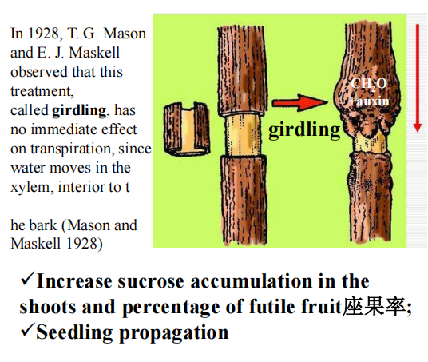
	- 添加染料：在叶脉上切一个小口， ==加入荧光染料== 观察流动方向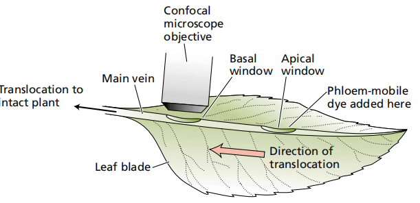
- Conduct Tissues
- 韧皮部的结构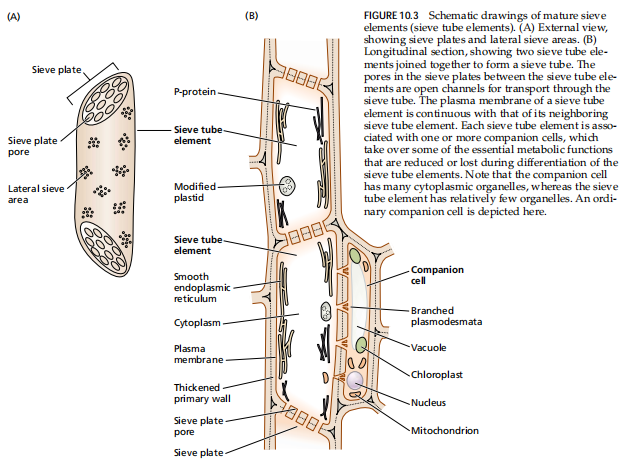
	- 筛分子：韧皮部中同化物运输的主要通道
		- 特点:活细胞、没有细胞核和液泡，寿命一般为一个生长季，有的甚至可达数百年
		- 在不同植物中，筛管分子存在区别
			- 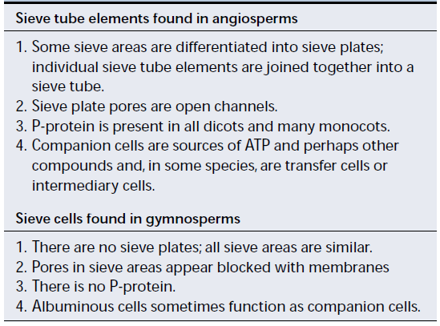
	- P蛋白
		- When sieve tubes are damaged, P-protein can block damaged sieve pores,  ==preventing further loss of phloem sap== , thus serving a short-term protective function. 
		- 在伴胞里面合成
		- 以不同结构存在于细胞质种
	- 胼胝体 
		- 合成需要钙离子→可用EDTA螯合→合成变慢→能够更好地收集韧皮部的汁液
		- 是一种β-1,3-葡聚糖，能相应损伤/其它胁迫，在质膜处合成
		- 可以封闭筛孔，起到长期的保护作用seal sieve pores, providing relatively long-term protection and aiding in plant recovery from damage or breaking dormancy
	- 伴胞 [[#^ba70a5]]
	- 薄壁细胞
## Section2 Phloem translocation of assimilates
#### 2.1 韧皮部运输的物质形式
- 收集筛管汁液
	- EDTA法：胼胝体合成需要钙离子→可用EDTA螯合，合成变慢→能够更好地收集韧皮部的汁液 #一些疑问 为啥
	- 蚜虫吻针法 ^bd1420
		- 不会造成筛管的封闭
- 筛管中的化学物质
	- 碳水化合物→蔗糖→结合半乳糖形成其它化合物进行运输
	- 植物激素
	- 有机酸
	- 无机离子→cations>anions，阳离子中最多的是钾离子
#### 2.2 韧皮部运输的方向Transport direction→双向运输
1. 源和库的概念→相对，不同时期不同 #重点 
	- 代谢源source：生产同化物及向其他器官提供营养的部位
		- 成熟叶片、 ==萌发的种子== 
	- 代谢库sink：消耗/积累同化物的部位
		- 种子、幼嫩叶子、果实
		-  #课后拓展 香樟树为什么春天落叶？→需要新的芽成为库，而老叶的光合效率降低后失去源的功能→不要了
2. 源库单位 source and sink unit：源器官+库器官 ^06e206
	- **就近原理**Supply to sink closest to the source
		- 应用：让果实的旗叶尽量健壮、延长光合时间
		-  旗叶：禾谷类作物（如小麦、水稻等）茎秆上端最后抽出的一片叶，光合效率高
	- **优先供应生长中心**) Supply to the center of growth and development
		- 应用：打顶、摘心、去掉累赘的芽
	- **同侧运输** Ipsi-lateral transport
		- 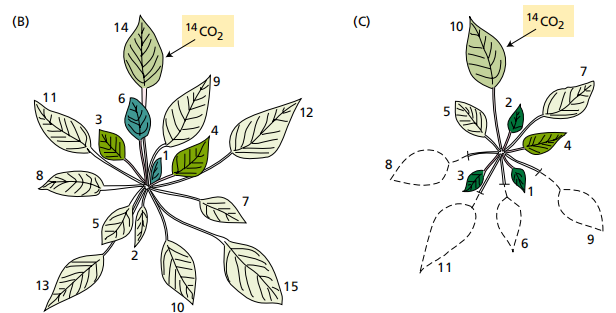
		- 加入C14，发现只有同侧新的叶子有放射性
		- 但是如果把另一侧的源都撤掉(除去叶子)，另一侧的叶子也有放射性→说明可变
	- 不同源的运输不同 
#### 2.3 Machanism of phloem transport
- **压力流动假说 Pressure flow hypothesis**→联系蚜虫吻针[[#^bd1420]] #重点 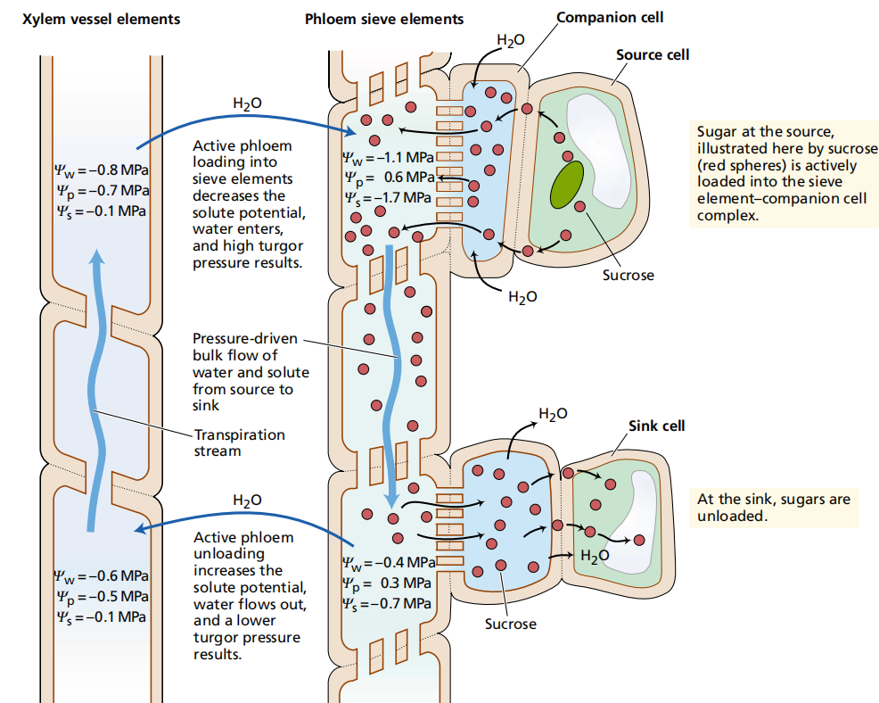
	- 源到库之间有压力差→物质从压力高流向压力低：筛管的液流是考源端和库端渗透式所引起的 ==膨压差== 所建立的压力梯度来推动的
		- 压力差的产生
	- 渗透化学实验
	- 支持假说的证据 #课后拓展 →只能一个方向运输，并且速率相同
- 电渗流动假说
- 原生质流动假说
#### 2.4 loading and unloading in phloem
1. Phloem loading occurs via apoplast or symplast
	- 共质体通道→聚合物陷阱模型
		- 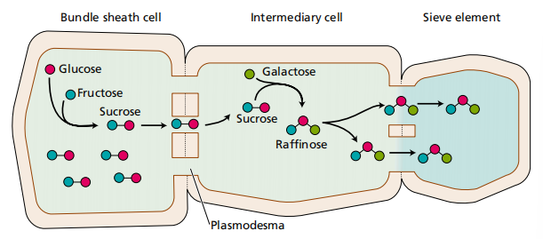
		- 蔗糖合成后，怎么保证它不返回去呢？→ ==聚合物陷阱== →在这个过程中逐渐 ==合成多糖== 
	- 质外体通道apoplastic pathway
		- 质外体中存在供运输的糖→C14标记路径
		- 跨膜运输的抑制作用：加入PCMBS→不能进入共质体，但是却能够抑制糖的运输→说明质外体也能运输
		- 质外体的糖可以进入筛管分子
2. unloading：共质体和质外体都可以完成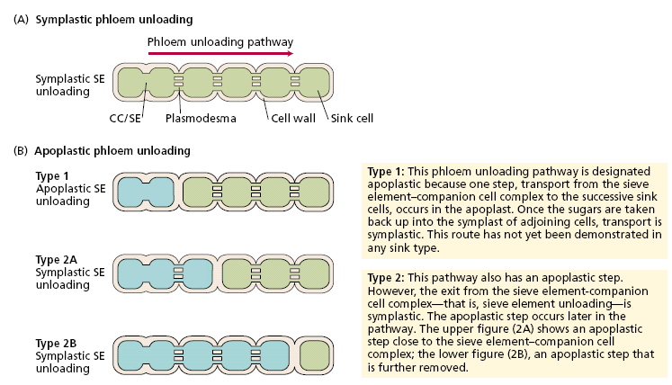
## Section 3. Distribution of photoassimilate (photosynthate) in plant
#### 3.1 Distribution 
- allocation配置→同化物的用途
	- 光合同化物固定的碳在各种代谢途径中的分布，用于代谢消耗、储存或输出
- partitioning→同化物去哪里
	- 光合同化物在不同器官（库）中的分布，如幼叶、根、花或果实
- Some special definitions
	- Starch storer(淀粉贮存植物)/ Starch leaves: Chloroplast, Amyloplast
	- Sucrose storer(蔗糖贮存植物）/Sucrose leaves : Cytoplasm, vacuoles
#### 3.2 Relationship between sink and source-distribution
1. Sink-source is variable源和库之间是可以相互转变的
2. Sink-source are promoted and inhibited by each other.
	- 源太大→忘记供应给种子(?这是在)
	- 库太大→全部供应给种子了→“大小年”
	- 营养离子、植物激素、ATP供应等
3. 由源到库、就近供应、侧向运输[[#^06e206]]
4. 再分配：避免冻害杀死植物 #待解决 
## 四、同化物运输的影响因素
#### 1. 内因 [[#^e23d88]]
1. Source intensity and sink capacity.
2. 蔗糖与ATP的含量
3. 离子的浓度
4. 植物激素
#### 2. 环境因素
- 水
- 光
- 温度
- 矿质营养
---------

1. **The extent to which source-sink relationships determine the direction and rate of translocation in the phloem**：
    - - 源库关系在很大程度上决定了韧皮部运输的方向和速率。源库单位的供应关系影响着光合产物的分配方向，一般光合产物会优先供应给距离源较近的库。例如，小枝轻微环割可以提高果实的座果率，这体现了源库关系对光合产物分配方向的影响。Source-sink relationships largely determine the direction and rate of translocation in the phloem. The supply relationship of source-sink units affects the allocation direction of photoassimilates. For example, slight ring girdling of branches can enhance fruit setting, illustrating the impact of source-sink relationships on the direction of photoassimilate allocation.
    - - 同时，源和库之间相互促进和抑制的关系也会影响运输速率。源的强度和库的容量都会影响光合产物的运转，充足的源、较大的库以及顺畅的运转是决定作物产量的重要因素。例如，当源较小（如叶片遮光）时，会导致库（如谷物数量减少、空壳增加、果实变小）也较小；反之，库较小时会抑制源的活性。The mutual promotion and inhibition between source and sink also influence the rate of translocation. Both the intensity of the source and the capacity of the sink affect the translocation of photoassimilates. Adequate source, large sink, and smooth translocation are crucial for determining crop yield. 
    - For instance, a small source (e.g., shaded leaves) can lead to a smaller sink (such as reduced grain number, increased empty ears, and smaller fruits), and vice versa.
2. **Path of a sucrose molecule from the chloroplast stroma of a mesophyll cell to the sucrose pool in a developing seed**：
    - 在叶肉细胞的叶绿体基质中，通过光合作用的卡尔文循环将二氧化碳固定并合成糖，在细胞质中转移为蔗糖Initially, in the chloroplast stroma of a mesophyll cell, carbon dioxide is fixed and synthesized into sugars through the Calvin cycle during photosynthesis, and then converted into sucrose in the cytoplasm.
    - 接下来，蔗糖通过胞内运输方式，如扩散、胞质环流等方式，在叶肉细胞内运输Subsequently, sucrose is transported within the mesophyll cell through intracellular transport methods such as diffusion and cytoplasmic streaming.
    - 随后，蔗糖通过胞间运输途径，经胞间连丝从叶肉细胞运输到维管束的源端筛管 - 伴胞复合体。Next, sucrose is transported from the mesophyll cell to the source end sieve-tube-companion cell complex via intercellular transport pathways, such as plasmodesmata.
    - At the source end sieve-tube-companion cell complex, sucrose is loaded into the sieve tube through the apoplastic or symplastic pathway.
    - After loading into the sieve tube, sucrose is transported over long distances to seed sinks and other organs via phloem transport.
    - Finally, at the seed end sieve-tube-companion cell complex, sucrose is unloaded from the sieve tube and enters seed cells, becoming part of the sucrose pool in the seed.
3. **Possible functions of P-protein and callose**：
    - **P-protein**：When sieve tubes are damaged, P-protein can block damaged sieve pores, preventing further loss of phloem sap, thus serving a short-term protective function. It is synthesized in companion cells and exists in the cytoplasm in various structures such as spherical, spindle-shaped, or twisted and coiled forms. In some species, P-protein has two forms: PP1 (a phloem protein that forms filaments) and PP2 (a phloem lectin associated with the filaments).
        
    - **Callose**：Callose, a β-1,3-glucan, responds to damage or other stresses (such as mechanical stress or high temperatures). It is synthesized at the plasma membrane by callose synthase (which requires Ca²⁺). Callose can seal sieve pores, providing relatively long-term protection and aiding in plant recovery from damage or breaking dormancy.
        
4. **Why we should protect flag leaf or fruit leaf from damage**：
    - Flag leaves or fruit leaves are important  ==source organs==  in plants. They synthesize photoassimilates through photosynthesis and transport them to other organs such as roots, stems, and fruits. 
    - Protecting flag leaves or fruit leaves ensures the continuous supply of photoassimilates, maintaining normal plant growth and development, especially the growth and abundance of sink organs like seeds. 
    - Damage to flag leaves or fruit leaves can affect the synthesis and transport of photoassimilates, thereby impacting the growth of sink organs and yield. 
5. **Laws of photoassimilate partitioning**：
    - **Priority to growth centers**：Growth centers are parts of the plant that grow rapidly and easily obtain photoassimilates during specific periods. For example, flowers that open on the same day or fruits of different sizes on the same vine are prioritized in photoassimilate allocation.
    - **Ipsi-lateral transport and proximity supply**： For instance, in crops like rice, photoassimilates are preferentially allocated to sinks on the same side, such as panicles. Maintaining the physiological functions of flag leaves and fruit leaves is essential to ensure the continuous supply of photoassimilates.
    - **Dynamic changes and mutual interactions of source-sink relationships**：The size and activity of sources and sinks vary with the plant's growth stage and environmental conditions. They promote and constrain each other. A weak source can lead to a small sink, and a small sink can inhibit source activity. Conversely, an overly strong source may result in a smaller sink (e.g., excessive vegetative growth), while an overly strong sink can decrease source activity and cause premature senescence of the source.