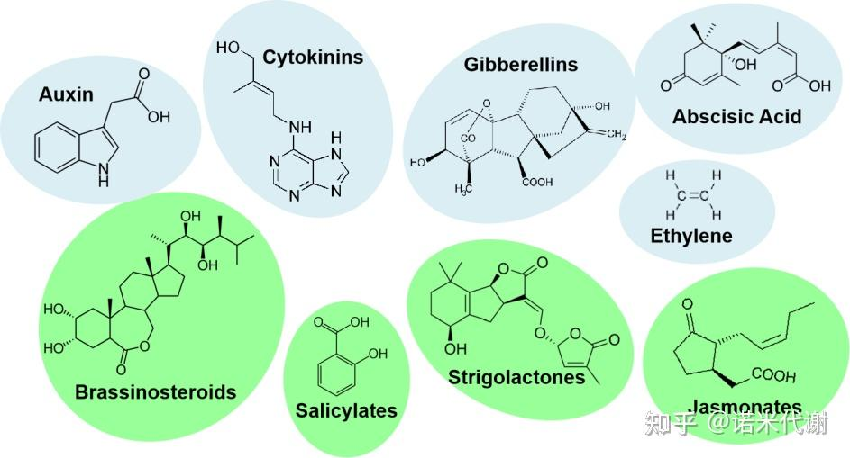
## Section1 *Auxins,IAA*
#### 1. Discovery
- 达尔文的实验
	- 切掉顶端
	- 每个在顶端与下部分之间加入黄油(脂溶性可以通过而水溶性不可以)、云母片、琼脂糖等→说明确实是从顶端运输，且具有水溶性
### 2. Metabolism
- 色氨酸trp依赖途径和非依赖途径IGP
- IAA-Conjugation→与其它物质结合变成结合态，失去活性→又可以变成自由态
	- 与GH3的结合是不可逆的
#### 3. Functions
- Reversible storage forms→应对不适环境
- Easy transport forms
- Anti-oxidation form
- Level control and detoxification

- Polar transport 极性运输→ ==生长素特有== 
	- 顶端合成生长素只能从植物的形态学上（顶）端向下（基）端运输，而不能由形态学下端向上端运输。
	- apical end to basal and
	- 类比韧皮部，但是韧皮部没有极性，基本上都是根据源库关系运输的的
	- 生长素**极性运输的化学渗透极性扩散机制**： #考过 
	- 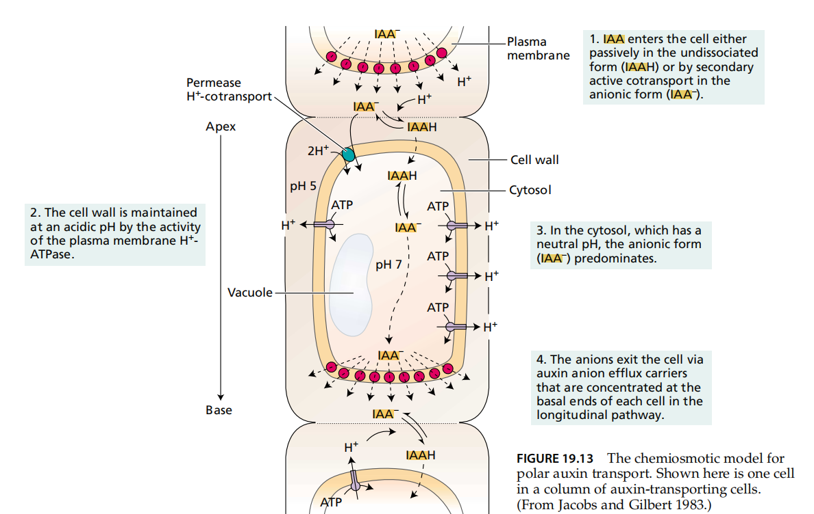
		1. 进入(Tips:运输不依赖重力而是化学渗透势)
			1. **质外体途径**：质膜 ATP 酶水解 ATP→释放出能量将 H+从细胞一端泵出到细胞壁→导致细胞壁质外体环境 pH 为5-5.5→生长素在酸性条件下呈非解离性（IAAH）→被动扩散进入细胞质或由质子泵（ATP 酶）以 IAA-和 H+共运输的方式进入细胞；
			2. **细胞质内部**：胞质 pH 约为 7.0→生长素几乎都解离为阴离子状态(IAA-)→IAA-较难透过质膜，浓度增大后，IAA-具有较强的热力学移动势能，能从细胞上端移动到细胞下端；
		2. 出去：IAA-下移至细胞基部，基部的质膜上有专一的**生长素输出载体（auxin efflux carrier,主要成分是PIN 蛋白**)→IAA-被动地输出到下一细胞壁
- **Signal transduction**:Signal→Receptor→Signal transduction→Responses
	- 在动物体内大部分是激活下游基因表达，而植物恰好相反 #课后拓展 why？植物需要对环境做出相应的
	- Protein phosphorylation or dephosphorylation
	- Protein degradation (ubiquitination pathway泛素化途径)
	- 生长素受体：TIR1→通过目标蛋白（AUX/IAA蛋白质）的降解，从而释放活化的ARFs实现响应IAA的信号转导途径。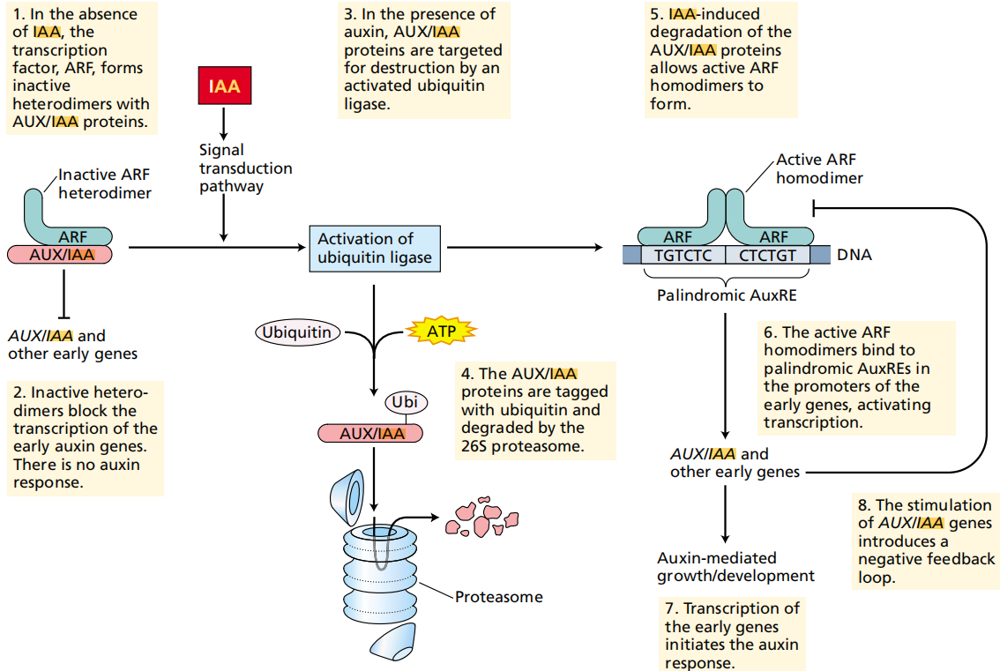
		- ARFs(Auxin response Factors)→能够形成异源二聚体
		- 在无生长素时，Aux/IAA 蛋白与 ARF（AUXIN RESPONSE FACTOR）转录因子结合，阻止 ARF 结合到生长素响应元件上，抑制生长素响应基因的转录。
		- 当生长素浓度升高时，Aux/IAA 蛋白被 SCF^TIR1 泛素连接酶复合体识别，并通过泛素 - 蛋白酶体途径降解，释放 ARF 转录因子，激活生长素响应基因的转录，调节植物生长发育。
#### 4. Functions
- Enhance elongation of cell and organ 促进细胞和器官组织的生长
	- 低浓度可促进生长，高浓度则会抑制生长，浓度过高会使植物受到损伤。
	- 敏感程度：幼嫩细胞>老细胞，根>茎>芽；双子叶>单子叶；
	- 原理： ==Acid growth theory== ——IAA活化质膜ATP酶（质子泵）→H+从细胞质流向细胞壁，细胞壁酸化→**水解酶**被激活，细胞壁水解松弛，细胞壁延伸，细胞长大；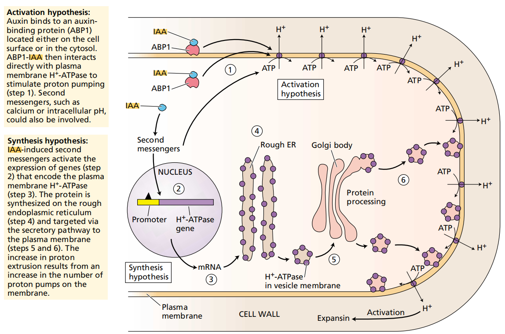
		- 激酶→直接调节ATP酶的活性
		- 通过转录调控→促使更多ATP产生
- Enhance cell division and organogenesis 促进细胞分裂、器官发生e.g.插枝生根→用生长素处理的枝条能长出更多的根
- Enhance fruit setting and parthenocarpy→produce seedless fruit促进座果和单性结实e.g.无籽水果
- Maintain apical dominance 维持顶端优势e.g.施生长素抑制侧枝生长
- Enhance abscission, flower and fruit thinning 促进脱落、疏花疏果
- Inhibit spouting of potato 抑制土豆萌发  ==与GA相反== 
- Enhancing flowering and controlling **sexual differentiation促进开花和控制性别分化**
- 引起植物的向光性和向重力性
- 可以作为除草剂

## Section2 *Gibberellic acid,GA*
#### 1. Discovery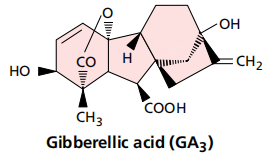
- 水稻恶苗病/徒长病foolish seedling→发现由赤霉菌分泌的
	- 大约有一百多种，有活性的为1、3、5
- 方法：添加外源GA，看表型
	- WT（Wild Type）
	- GA-sensitive dwarf：Biosynthesis mutant，GA合成受阻
	- GA-insensitive dwarf：Response mutant，no GA signaling信号传导通路受阻/DELLA突变，GA结合不了
	- Slender：Response mutant，Constitutive GA signaling，加不加没关系。与信号传导有关，控制信号转导的“锁”一直开着/DELLA无法降解→抑制相关蛋白的激活，影响相关基因的启动，无赤霉素响应现象
#### 2. Metabolism
- 合成部位：长得快的部位→生长中的种子和果实、幼茎顶端和根部
	- 生长中的种子和果实是合成赤霉素最活跃的植物器官，其中开花初期和种子生长期间赤霉素的合成较显著
- 合成途径：MVA → IPP → GGPP(最直接前体)→ GA12(第一个GA) → GA9→ GA4(其他 GA)
	-  CPS、KS、KO 酶都是由单个基因控制的→单个突变都会引起植株矮化
- 外界因子对GA合成的影响：
	- 光：瞬时遮光→暗中茎伸长大于光下；长日照→伸长加快
	- 温度：低温诱导开花（低温促进GA 的合成）
	- 生长素：GA的合成受生长素含量的调控→正相关
	- 转基因手段改变GA的含量
#### 3. Conjugation and degradation of GA
- To keep the level of active GA within a narrow range !
- 负反馈调节生物合成；
- 正向调节 ：activation→inactivation；
- 结合态转变
#### 4. Transportation and signal transduction
- Non-polar 非极性：
	- shoot下运—韧皮部 phloem
	- root上运—木质部 xylem
- Signal transduction →核心理解： ==DELLA 蛋白== 
	- 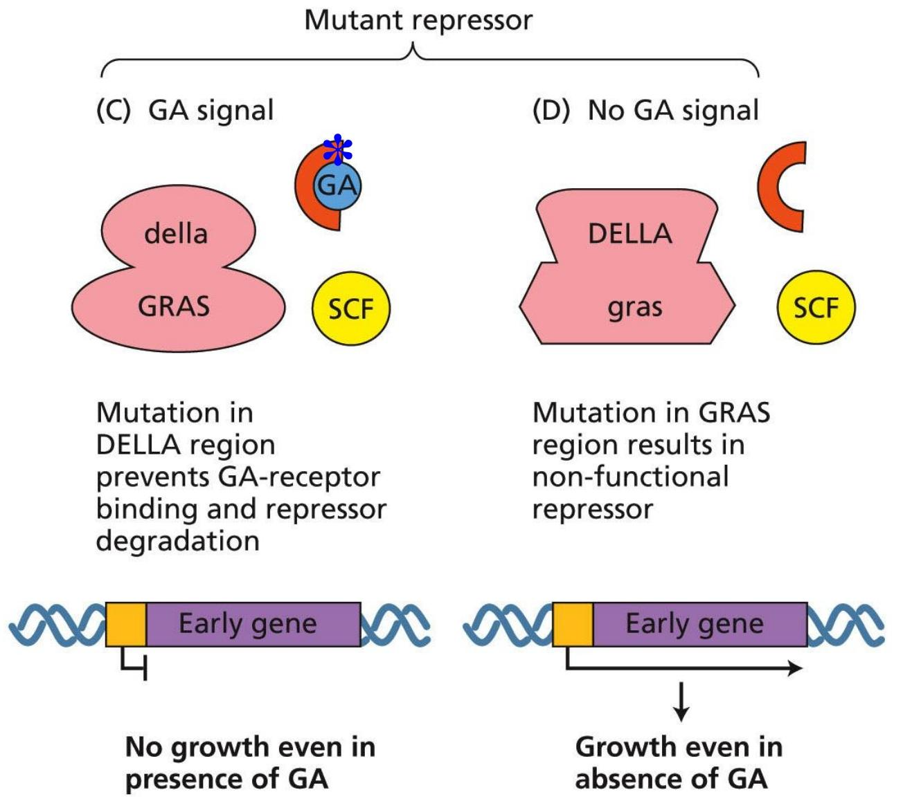
		- 不同位点的突变，导致的表型不相同
			- 若DELLA区域发生突变→GA复合物无法与之结合→DELLA无法被降解，从而一直抑制
			- 若GRAS发生突变→会导致DELLA失活→无法抑制相关基因的表达→表现为没有GA也促进
		- 不同的位点被磷酸化的程度也可以影响相关的稳定性与活性
	- 作用过程：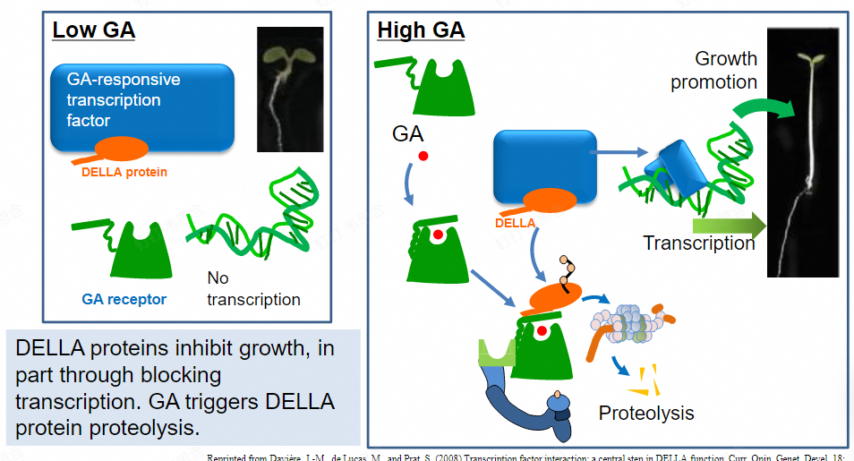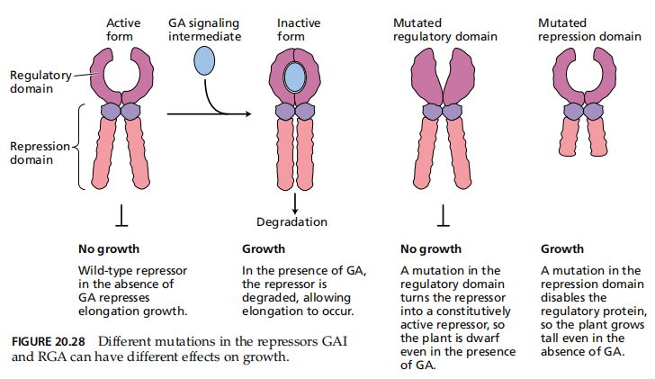
		- DELLA 蛋白与 PIFs（PHYTOCHROME INTERACTING FACTORS）等转录因子相互作用，抑制其活性，从而抑制赤霉素诱导的植物生长发育。
			- 当赤霉素浓度增加时，赤霉素与 GID1 受体结合，形成 GA - GID1 复合体，该复合体识别并结合 DELLA 蛋白，DELLA 蛋白被泛素化并被泛素 - 蛋白酶体途径降解，释放 PIFs 等转录因子，促进植物生长发育
#### 5.Functions and applications of GA
- 促进茎（和根）的伸长和细胞分裂
- Cell division→shorten cell division cycle，especial in which DNA synthesis.
- Cell elongation→increasing in IAA level-Increasing in cell wall plasticity and extensibility.
- 在盐胁迫下，GA合成减少或突变//DELLA发生突变→高盐压力，稳定DELLA蛋白
- 促进**抽薹开花**（代替春化、长日照诱导开花）
- 打破休眠，**促进萌发**；促进坐果和单性结实 如：无籽（防止果皮软化\延长保鲜时间）
- 促进**雌雄分化**： GA 促进黄瓜雄花；IAA 促进黄瓜雌花
## Section3 CTK
#### 1. Discovery
- 农杆菌感染形成冠瘿中获得激动素
- 玉米素（最早被发现的植物天然细胞分裂素）
- 天然的细胞分裂素（玉米素、二氢玉米素）都是腺嘌呤的衍生物
#### 2. Metabolism
- Site of biosynthesis : mainly root apical meristerms
	- 前体：异戊二烯（了解）
- Transport
	- 经过木质部运往地上部产生生理效应，所以在植物的伤流液中含有CTK
	- 少数在叶片合成的CTK也可能从韧皮部运出
	- 茎顶端、萌发的种子和发育着的果实也可能是CTK的合成部位，但外施的CTK往往停留在原使用部位，不能运输
#### 3. Conjugation and degradation of CTK
- 源（入）：逆结合态、合成、运输进入
- 出：结合态、降解、运输出去
#### 4.  Transportation and signal transduction
- Transportation
	- 根尖分生区合成，茎木质部运往地上；from root to shoot through xylem
	- 施加于叶片面上的不转移，停留在施加部位；少数叶片合成的，韧皮部运出
- Signal transduction：
	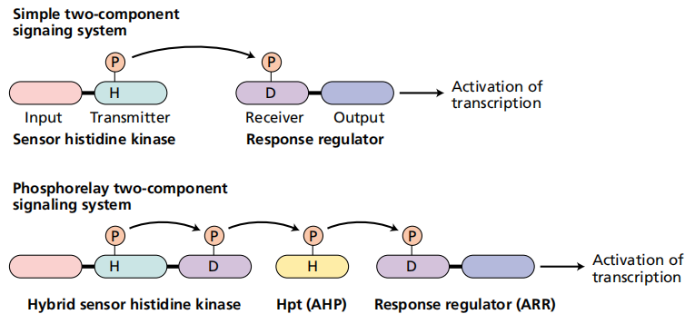
	- receptor：CKI1，CRE1，AHKs 质膜 内质网膜上CHASE域 
	- domain - H - D 磷酸化的传递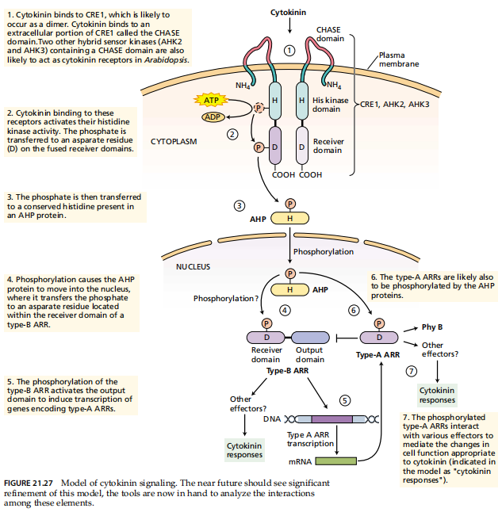
		- CTK与 ==受体CRE1== 结合→激活受体的激酶活性（组氨酸H激酶在保守的H残基上磷酸化），HPK将磷酸基团传递给接受区域的天冬氨酸残基（D）
		- 磷酸基团通过组氨酸磷酸转移（AHP）蛋白传递到细胞核里。在细胞核中存在着类似二元组分系统的反应调节蛋白，它们的作用是接收磷酸基团输出的信号
		- 活化的AHP进入细胞核
		- 可以有两种形式：
			- AHP将磷酸基团传给类型-B ARR蛋白(output domain是转录因子)，后者进一步诱导类型-A ARR蛋白基因的转录与表达→**反馈机制**；
			- AHP直接使类型-A ARR磷酸化，通过其他效应子进一步导致CTK响应，出现相应生理反应
		- 两种ARR与各种效应子互作，导致细胞功能的改变，如细胞周期的改变和细胞增殖等反应
	- 拟南芥中，AHP6 等拟磷酸组氨酸转移蛋白（pseudo HPs）是负调控因子。它们缺乏磷酸化的 His 位点，可通过干扰正常的磷酸传递过程，对细胞分裂素信号通路起负调控作用，从而调节细胞分裂素响应
#### 5.Functions and applications of CTK
- 促进细胞分裂和诱导形态建成Enhancing cell division and enlargement,
- 器官分化Inducing organ differentiation
	- CTK/IAA比值高时，愈伤组织易形成芽 
	- CTK/IAA比值低→根
- 延缓叶片衰老delay senescence→使控制它的基因超表达，用于农产品/花卉保鲜
- 促进营养的调运allocation和吸收uptake Promote the movement of nutrients
	- 可以调节源库关系，让重新分裂的器官变成库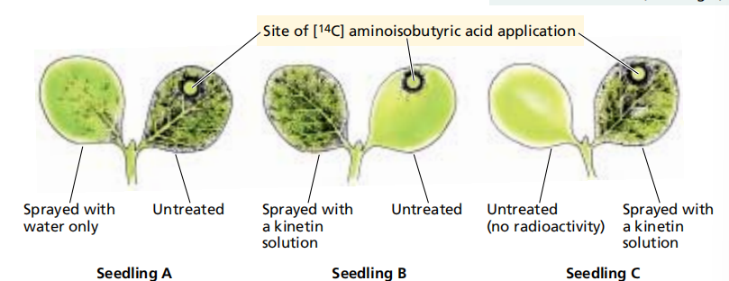
- 促进细胞扩大（促进细胞的横向增粗）
- 解除顶端优势，促进侧芽生长→区别于IAA Inhibiting dominance and inhancing 侧根 #易混淆 
- 打破种子休眠，促进种子萌发（可打破需光种子的光限制）Enhancing germination of light-favored seed
- Tips:与IAA的区别，两者是拮抗作用

|       | **IAA**              | **CTK**              |
| ----- | -------------------- | -------------------- |
| **根** | 促进根的分根               |  ==抑制== 根的分根           |
| **芽** | 维持顶端优势  抑制侧芽生长 | 解除顶端优势  促进侧芽生长 |

## SECTION4 *Eth(P521)→Gaseous Hormone*
#### 1. Discovery
- 煤气灯泄漏的气体促进附近的树落叶(煤气中也含有乙烯)
- 乙烯，能引起黄化豌豆苗的三重反应
- 发现：橘子产生的气体能催熟同船的香蕉
#### 2. Metabolism 
- Site of biosynthesis：all parts #一些疑问 不同激素的合成有没有生化通路联系呢？
	- during leave abscission and flower senescence, ripened fruit, wounding or flooding plants在叶片脱落、花衰老、果实成熟、损伤或浸水期间的所有部位
	- 一般成年组织释放乙烯较少 #易混淆 
	- 分生组织、种子萌发、花刚凋谢和果实成熟时产生乙烯较多
		- 特别是幼苗期枝条顶端/茎端
	- 当植物受机械或逆境胁迫/浸水时，乙烯生成量增加
	- 随叶片长大，衰老和脱落，乙烯合成量缓慢地增高
	- 在花器官同样能合成乙烯，呼吸高峰与Eth直接有关
- 合成过程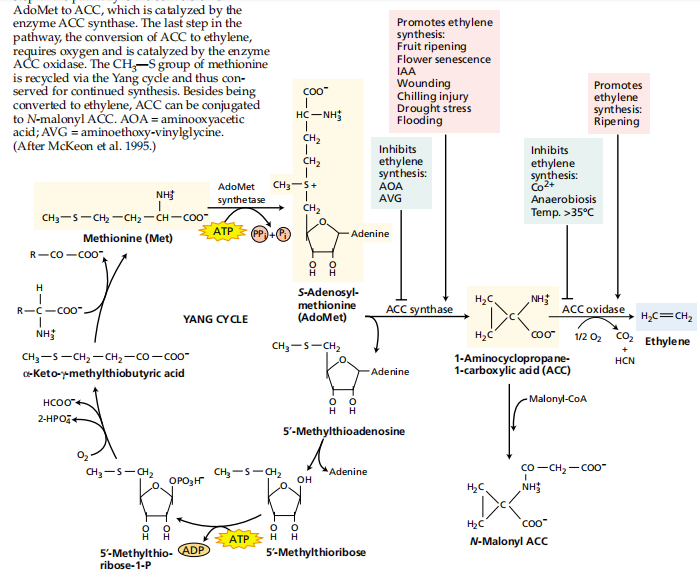
	- 前体：**甲硫氨酸(蛋氨酸)Met**→联系IAA前体丝氨酸
	- 从图中可以看出，CH4的合成是需要氧气的(最后一步)→联系水果储藏[[Chapter4 Respiration]]
		- 设计实验：N2充足(实验组)、通了空气(对照组)，发现实验组的乙烯含量很少。拿去做液相色谱后可以找到峰值→发现ACC
#### 3. Control
- ACC丙二酰基转移酶的作用
	- 促使ACC起丙二酰化反应→形成MACC
		- ACC除形成乙烯外，也可转变为 ==非挥发性的MACC== ，此反应为不可逆反应
		- ACC大量转向 MACC时→乙烯的生成量则减少
	- 该酶活性强时，形成MACC多，ACC→乙烯路径减少，以致乙烯释放量就少；
- 负反馈调节：
	- 乙烯除了抑制ACC合酶外，也会 ==促进ACC丙二酰基转移酶的活性== →抑制乙烯的生成（自我抑制）
	- 乙烯形成以后，还需要与金属蛋白质结合，通过进一步代谢后才能起生理作用，Ag+具抑制乙烯的作用，可能是该离子影响乙烯与受体结合后的变化。EDTA螯合Fe离子后形成的 Fe-EDTA也具有抑制乙烯的作用。
- **Triple responses**：乙烯对植物的典型效应： #名词解释  #重点  ^f7ef8b
	1. 抑制茎伸长生长→变短
	2. 促进茎或根的横向增粗→变粗
	3. 促进茎的横向生长（茎失去负向重力性）
		1. 双子叶**顶端弯钩**：用于克服出土时的机械阻力(石头啥的)
		2. 单子叶：促进胚芽鞘伸长，胚根变得比较短
	- 总结：茎——抑制伸长生长+促进横向增粗和生长 根——促进横向增粗
#### 4. Transportation and signal transduction
- Transportation :
	- 乙烯在植物体内易于移动→气体形式扩散，溶于水中运输
	- 被动的扩散过程。一般情况下，乙烯就在合成部位起作用，乙烯的前体ACC可溶于水溶液，因而推测ACC可能是乙烯在植物体内长距离运输的形式。
- Signal transduction：
	- Eth 受体：ETR1 EIN2 EIN3→但是会产生显性效应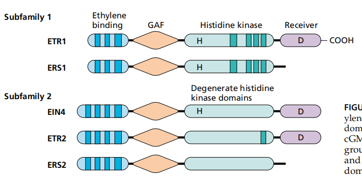
	-  ==CTR1== 是乙烯传递途径上起抑制乙烯信号传递的一个负调节因子。Eth与受体ETR1结合，CTR1编码蛋白失活、磷酸化级联反应被激活，导致EIN2、EIN3基因编码蛋白被激活，导致相关基因的诱导表达，出现乙烯的“三重反应”。 
	- 有乙烯时：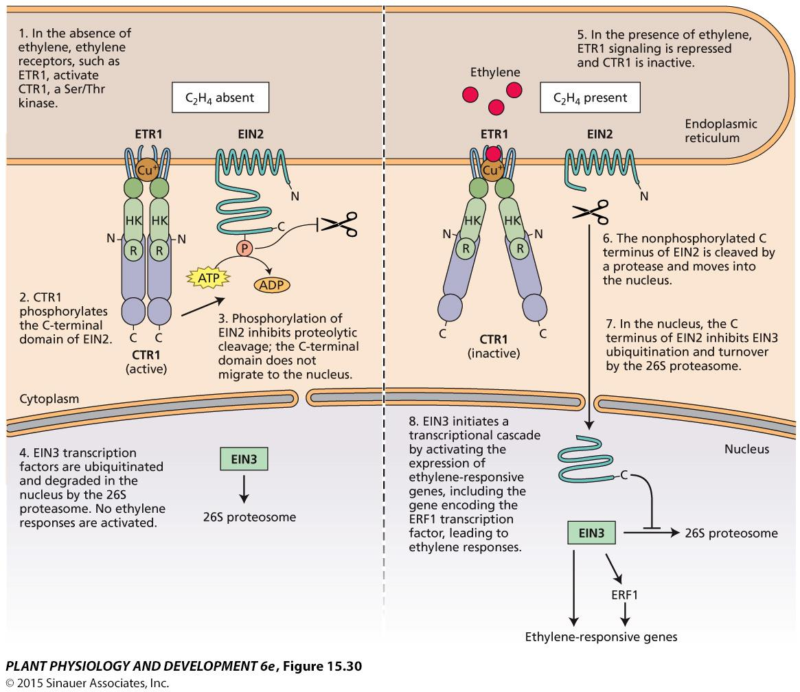
		- Eth与受体ETR1结合之后，激活了下游的MAPK级联途径，乙烯受体的下游为CTR1，它在乙烯信号转导过程中起负反馈调控作用。
		- CTR1失活，通过磷酸化级联反应将信号传递到其下游组分EIN2，它在乙烯信号过程中起正调控作用，继而顺利将信号传递到细胞核中，激活乙烯反应中的关键转录因子EIN3，阻止EIN3被SCF复合体泛化并降解；
		- EIN3与乙烯响应基因ERF1的启动子结合并诱导ERF1的表达，随后再调控其它乙烯反应基因的表达而引起响应。
	- 无乙烯时：ETR1活化CTR1，导致EIN2不能进行跨膜信号转导，核内的EIN3被SCF复合体泛素化，随后被26S蛋白体降解，从而抑制相关基因的表达。
#### 5. Functions
- 促进成熟 Promoting ripening of fruits→呼吸跃变[[Chapter4 Respiration]]
- 促进脱落→促进纤维素酶合成并控制其释放到细胞壁中 Inducing abscission
- 性别分化
	- 与GA相反，与IAA同→IAA增加雌花分化就是由于IAA诱导产生乙烯的结果
- 偏上生长Epinasty→类似于顶端弯钩，常见于植物淹水时
- 三重反应[[#^f7ef8b]]
- 促进次生物质的分泌Enhancing secretion of secondary products
	- 橡胶产胶量
- 诱导插枝不定根/根毛的形成 Inducing root hairs
	- 促进根的生长和分化，打破种子和芽的休眠 

## SECTION5  *Abscisic acid(ABA)*
#### 1. Discovery
- 研究植物体内与种子休眠、脱落和种子萌发等生理过程有关的生长抑制物质时发现的：
	- 棉花幼铃脱落→脱落素Ⅰ
	- 鲜棉铃→具高度活性的促进脱落的物质，脱落素Ⅱ abscisin Ⅱ
	- 桦树叶→抑制生长并诱导休眠的物质，命名为休眠素dormin
	- 休眠素和脱落素Ⅱ为同种物质→ 脱落酸 abscisic acid
#### 2. Metabolism
- 合成部位：mainly leaves→synthesized in chloroplasts and other plastids
- 分布部位：all the plant organs, especially in dormant or abscising parts
	- 休眠/离体/成熟/脱落部位
	- 逆境/脱水条件下，ABA迅速增多→在保卫细胞积累（失水） 根尖在脱水情况/干旱胁迫下，也能合成大量的 ABA(e.g.荷花的底泥)
- 合成途径：OPP异戊二烯焦磷酸→紫黄素→( ==NECD酶== 关键步骤)黄素醛 → ABA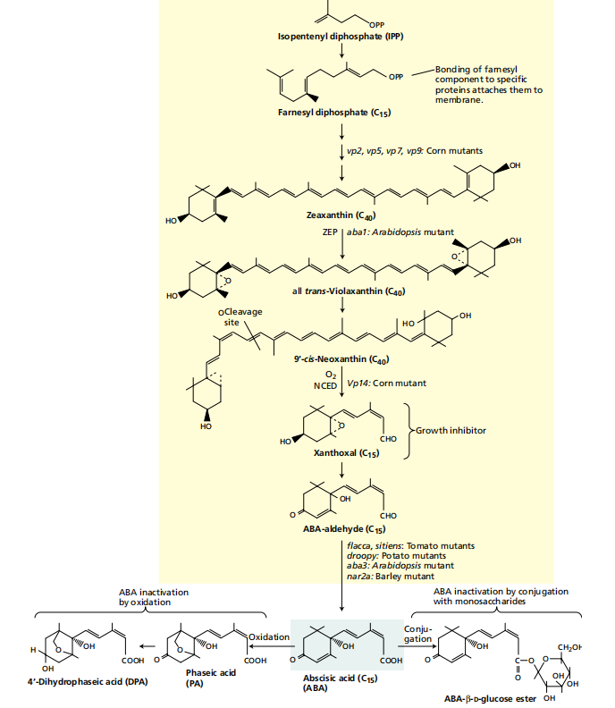
	- 化学本质：倍半萜羧酸
#### 3. Conjugation and degradation of ABA
- 可逆结合态 （贮藏形式） 氧化（菜豆酸 PA）
- 若 ABA 不足
	- 如果突变体缺少ABA，则会引起胎萌(vivipary,种子休眠期变短，提前萌发)→“种子穗上发芽”现象
#### 4. Transportation and signal transduction
- Transportation :
	- in both xylem and phloem, but more abundant in the phloem sap
	- forms：
		- in a **conjugated form结合态** and then hydrolysis in leaves
	- Redistribution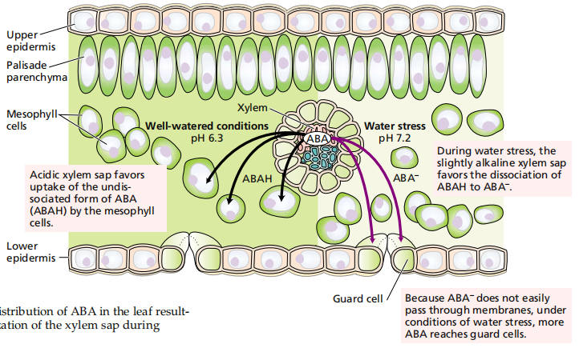
		- 在干旱条件下，植物根系首先感知，形成ABA→运输到叶子里
		- 同时，干旱时从根部运输的水分pH更高→ABAH变成ABA-(质子解离)→能够进入保卫细胞富集→关闭气孔
- Signal transduction：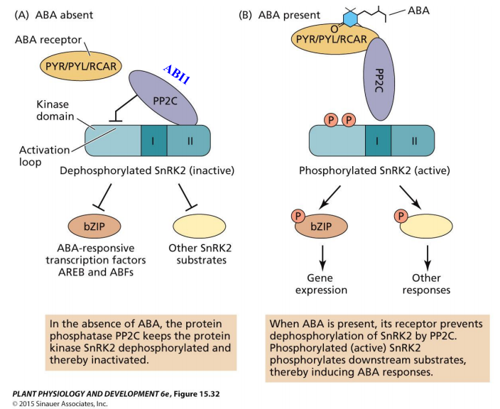
	- 受体：
		- PYR/PYL/RCAR（细胞质中） #一些疑问 这些本质是什么？
		- CHLH，
	- 当没有ABA时，**蛋白磷酸酶PP2C**结合在SnRK2蛋白酶上，使其呈去磷酸化状态（即非活化状态），则脱落酸相关基因的表达与其他响应现象无法开启。反之，磷酸化的bZIP结合下游功能基因启动子区域结合，发挥作用。
#### 5. Functions and applications of ABA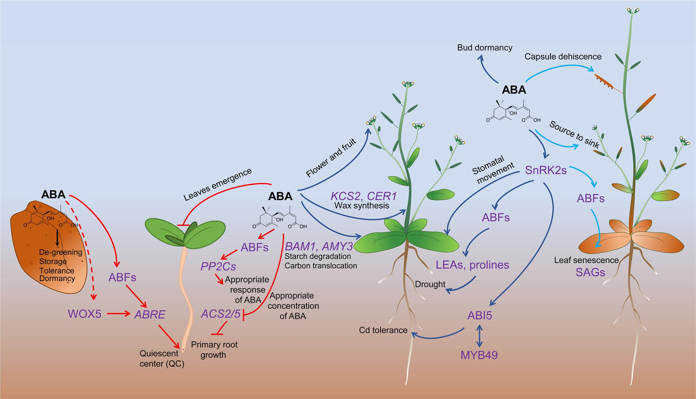
- 促进气孔关闭，降低蒸腾
	- 应用：在地里浇水的时候隔垄，让某一边缺少ABA，控制适量的ABA浓度→气孔部分关闭
	- ABA促进气孔关闭与降低保卫细胞质膜ATP酶活性，减少跨膜质子梯度，导致保卫细胞的 K+流入减少而外流增加→胞质内水势上升，降低膨压，气孔关闭；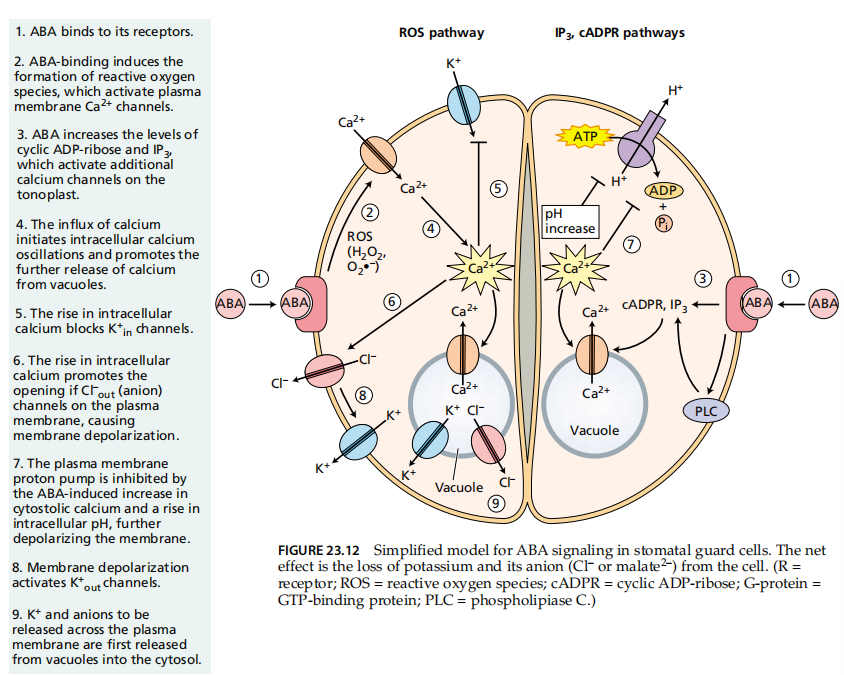
		- 可促进保卫细胞的胞液Ca2+水平上升，却诱导糊粉层细胞的胞液Ca2+水平下降→开启K+/Cl-流出，降低膨压，气孔关闭；
- 促进休眠，抑制萌发→秋天短日照诱导ABA产生，种子就进入休眠状态，与GA相反
- 促进器官脱落
- 抑制生长和加速衰老
- 提高植物抗逆性→联系气孔关闭
	- 在干旱条件下，抑制地上部分生长，诱导主根伸长
## Section6 *Brassinosteroids,BR*
#### 1. Discovery
- 和固醇类动物激素很相似
- 在油菜花粉中发现一种对菜豆幼苗具强烈促进作用的物质：油菜素→油菜素内酯
#### 2. Metabolism
- All parts：通常pollen&seeds＞stem＞leave&fruit
	- 其中油菜花粉是BR的丰富来源，虽然含量不高，但是生理活性极强
- 分布：花粉（促进花粉管的萌发）和种子（种子萌发）>枝条>果实和叶片
#### 3. Conjugation and degradation of BR
- Inactivation: epimerization（异构）/ oxidation / hydroxylation / sulfonation / conjugation to glucose or lipids / Feedback regulation
#### 4. Transportation and signal transduction
- Mainly in xylem
	- 受体：BRI1→位于细胞质膜，需要胞外感知→必须运输至胞外
	- Co-receptor: BAK1
	- Inhibitor: BKI1
	- Activation: Phosphorylation
	- BR-signaling kinase: BSK
	- Repressor: BIN2
	- BR response elements: E-box, or CGTG(T/C)G
- Signal transduction→ ==BIN2== 
	- 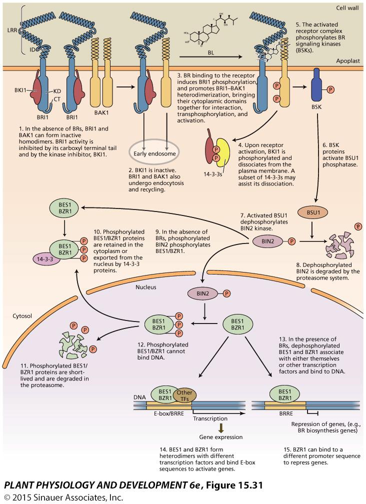
	1. BIN2能磷酸化 BES1/BZR1 蛋白，使这些转录因子滞留在细胞质中并被降解，抑制 BR 响应基因的表达
	2. 当 BR 与受体 BRI1 结合后，激活的受体通过一系列信号传递，抑制 BIN2 的活性，使 BES1/BZR1 蛋白去磷酸化，进入细胞核与靶基因结合，调控基因表达
	3. 若BR不存在的时候，BIN2蛋白不会被降解，从而导致BES1/BZR1的磷酸化，使其无法与DNA结合并且被泛素复合体降解/运出细胞质
#### 5. Functions and applications ofBR
- 促进细胞伸长和分裂（增强ATP酶活性，促进质膜分泌H+到细胞壁，使细胞伸长）→可以让植物变长变粗→区别于Eth
- BRs are the center of multiple interactions of others(PPT)
- 促进光合作用（促进RuBP羧化酶活性） 对叶片中光合产物向穗部运输有促进作用
- 提高抗逆性，“逆境缓和激素”
- 促进核酸和蛋白质合成，影响一些酶的活性
- 促进花粉管生长和种子萌发→促进分蘖
- 能够减小叶的夹角→可以增大种植密度
- 能够独立于IAA和GA，促进或抑制根生长
 
## SECTION7 *Strigolactone(SLs)独角金内酯*
#### 1. Discovery
- 来源：一种寄生植物与寄生后，宿主分泌的激素
	- 原本这激素是要给菌根的:O!
#### 2. Cojungation

#### 3. Functions
- inhibit branch outgrowth
## Section8 Others
#### 1. Polyamines多胺
#### 2. 水杨酸SA和茉莉酸Jasmonic acid,JA
- 在面对生物逆境的时候Hormonal responses to biotic stress
	- 微生物侵染→水杨酸
	- 虫害→茉莉酸让植物的口感改变:O!
## SECTION9 Cross-talks
#### 1. The inter dependent in the biosynthesis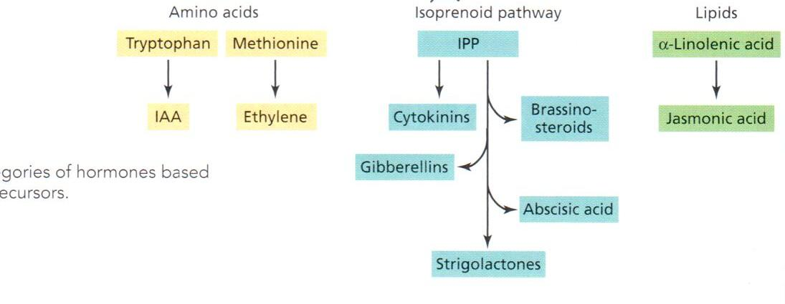
- Trp→IAA,Met→Eth
- IPP作为五种激素共有的前体
#### 2. 激素总论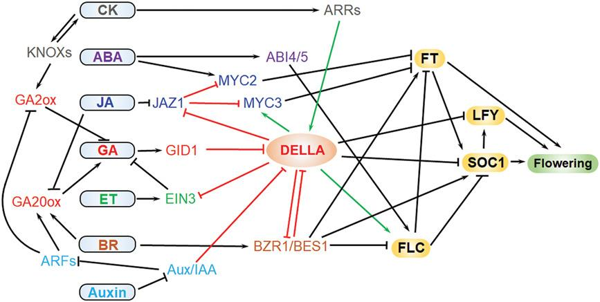
- 花变成果→GA,Auxin；果实成熟→Eth
- 种子生长→GA与ABA相互拮抗
- 抗逆响应
#### 3. Signal Transduction
- Protein phosphorylation or dephosphorylation
- Protein degration:IAA,GA,JA
 

## SECTION10 Application
- Plant growth enhancers
- Plant growth inhibitors
	- TIAA
- Plant growth retardants
	- B9
	- CCC矮壮素
	- Pix 助壮素
- Warnings
	- Easily be used→可以用来喷施
	- Concentration based on purpose
	- Safety and no remnants
	- Economic and other culture methods
	- Time and neighboring plant 要考虑周围作物
---------------
1. Why the repressor in signaling transduction of phytohormone is so important? Name the key repressor in the signaling pathway of each phytohormone and their corresponding function. 
2. Describe the polar transportation mechanism of IAA.
3. Some of the signaling pathways of the different phytohormones have basic features in common. What are the two basic types of shared signaling pathways and which hormones use them during signal transduction?
4. Name some key mutants of ethylene signaling transduction and how their epistatic relationship is determined?
5. Describe the key transcriptional activator in IAA, CTK, Ethylene, ABA and BRs signaling pathway.
6. Describe the function of DELLA protein in GA signaling transduction. Why do the DELLA mutants result in complete different phenotypes in the below barley.
	- DELLA mutants can have different phenotypes because mutations in the DELLA region can prevent GA - receptor binding and repressor degradation, or mutations in the GRAS region can result in a non - functional repressor. In barley, different DELLA mutants (like sln1c and sln1d) may have mutations in different parts of the DELLA protein - coding gene
		- . If the mutation affects the ability of DELLA to bind to GA - GID1 complex, it will not be degraded, leading to a dwarf phenotype as growth - promoting genes remain inhibited. 
		- If the mutation makes the DELLA protein non - functional, growth - promoting genes will be expressed constitutively, resulting in an abnormal growth phenotype. 
		- Also, phosphorylation of DELLA proteins can affect their activity and stability. Phosphorylation on different regions of DELLA can either stabilize or promote its degradation, further influencing the phenotype of the plant.
------------
- References
	- [以一篇Nature子刊综述开启的，对植物信号传导者—植物激素的探索 - 知乎](https://zhuanlan.zhihu.com/p/650303147)
	- http://engine.scichina.com/publisher/scp/journal/SSV/doi/10.1360/SSV-2019-0197?slug=fulltext