## Section1 Growth,Differentiation,Development
#### 1.1 Growth 生长
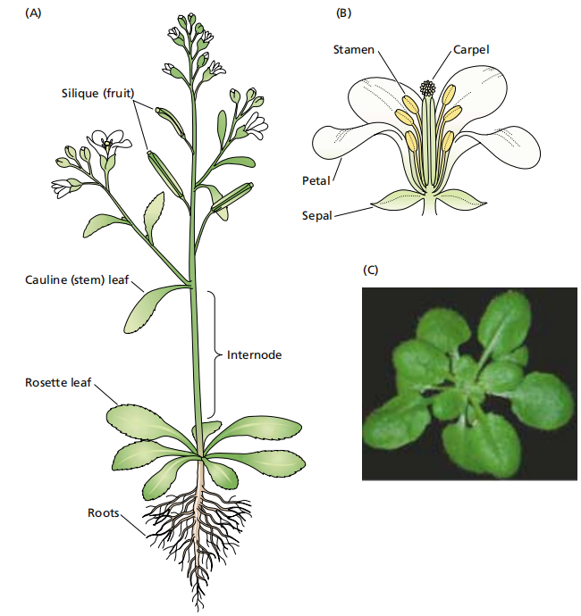
- 与动物的不同：小登都是在出生前就成型的，但是植物是由种子慢慢长出来的:)
- Concepts：（量变）在生命周期中，植物的细胞、生长组织和器官的数目、体积或干重的不可逆增加过程。
	- 由细胞分裂、细胞伸长及原生质体、细胞壁的增长而引起。
#### 1.2 Differentiation 分化
- Concepts:（质变）从一种同质性细胞类型转变成形态结构和功能与原来不相同的异质性细胞类型的过程。
	- 例如，从受精卵转变为胚
#### 1.3 Development 发育
- Concepts:生长和分化的综合，是在植物生命周期中，植物的组织、器官或整体，在形态结构和功能上有序变化，由此推动生命周期不断向前的过程。
## Section2 Plant cell development
#### 2.1 Cell mitotic cycle
- Cell cycle[[Chapter7 细胞增殖和分化]]
	- 准备阶段：G1+S+G2
		- 核内复制：与动物细胞的不同：植物细胞可以在G1或G2阶段停止细胞分裂， ==导致倍性的改变== 
	- 有丝分裂阶段
- features of meristem cells
	- morphological:细胞壁薄
	- Biochemical:DNA含量快速增加、呼吸作用强→用于合成中间产物如五碳等[[Chapter4 Respiration]]
- 细胞骨架 Cytoskeleton[[Chapter6 细胞骨架]]
	- Microtubule维管,
	- microfilament维丝,
	- intermediate filament中间纤维
#### 2.2 Cell elongation stage
- Morphology:细胞体积快速变大
	- 液泡从无到有且快速地增大
- 根的结构：根冠、分生区、伸长区、成熟区→产生根毛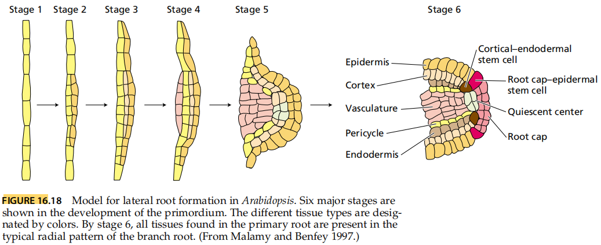
- How to elongation?
	- Turgo
	- Cell wall extension
		- Cell wall loosen
		- New cell wall
#### 2.3 Cell differentiation stage
- Factors
	- Hormone e.g.IAA和CTK[[Chapter6 Plant hormones]]
	- Sucrose:不同的糖浓度可以产生不同的组织
	- Light:缺少光照时分化很差
	- **Polarity 极性**:植物分化和形态建成中的一个基本现象，指植物器官、组织或细胞在不同的轴向上存在某种形态结构和生理生化上的梯度差异 #名词解释 怎么那么拗口???
		- 通常上端长芽，下端长根
		-  ==由基因控制== ，一旦建立难以逆转；但是可以受到环境条件的调控
		- 根毛也是有极性的，只能向前生长
		- Ca2+的流动可能与极性有关→在藻类植物中发现
## Section3 器官的生长和分化
#### 3.1 Apical growth顶端生长
- Apical growth 顶端生长
	- 由于顶端分生组织的活动引起的生长，包括分生组织细胞分裂，生长和分化，节数增加，节间伸长，同时产生新的叶原基和腋芽原基。
	- Apical dominance 顶端优势[[#^5d7d9d]]
- Apical meristem 顶端分生组织：维管植物根和茎顶端的分生组织。包括长期保持分生能力的原始细胞及其刚衍生的细胞。
	- Shoot apical meristem,SAM茎尖分生组织
		- 功能分区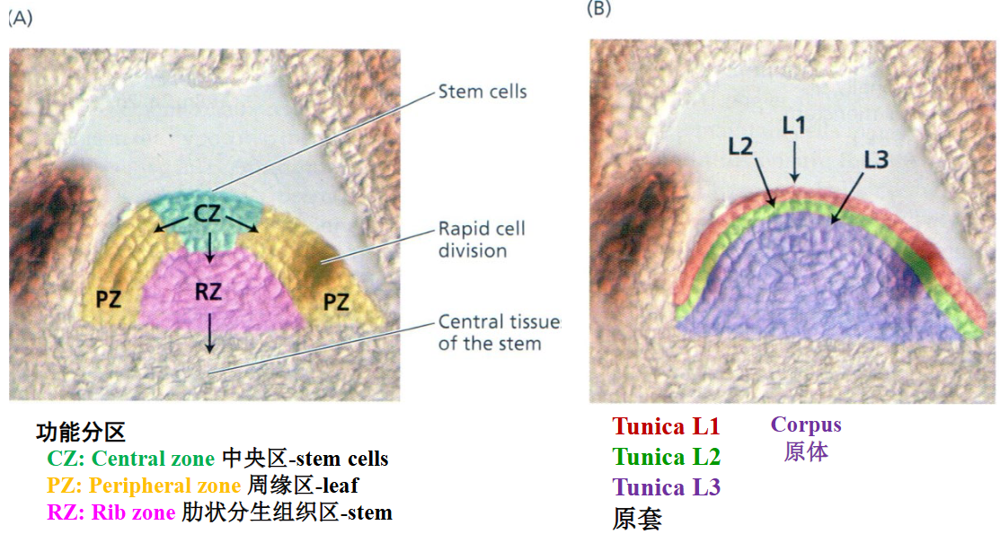
			- 中央区CZ含有干细胞，是维持SAM的关键区域
			- 周缘区PZ负责叶的形成
			- RZ与茎的形成有关
		- 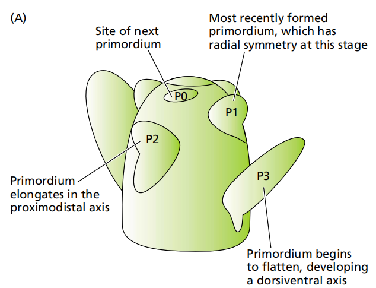
		- 最中间的细胞DNA复制最快，说明主要是负责新细胞的产生
		- 将生长点去掉以后，其它组织又能重新变成生长点
		- 如果把分生的部分分开，每个独立的都可以再发育
		- Phyllotaxy叶序：对生、互生、轮生→由不同的分生组织、产生的叶原基决定的
	- root apical meristem根尖分生组织
		- 生长素的含量高，而茎尖的生长素含量相对低 #易混淆 
		- 根端干细胞微环境stem Cell Niche→相当于一个指挥部，有一个”静止中心“(植物学的记忆开始攻击我)
- 干细胞中特有的*WUS*基因，但是其表达的蛋白质不会乱跑
	- 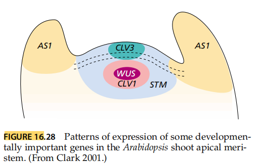
		- WUS 基因在维持干细胞数量方面起关键作用，其表达会诱导 CLV3 基因在相邻外部细胞层表达
			- CLV3 是一种分泌到质外体的小肽→与 CLV1 结合，抑制 WUS 基因的表达→形成负反馈调节环，从而维持干细胞数量的稳定，确保 SAM 局限于茎分生组织中
	- 作用机制：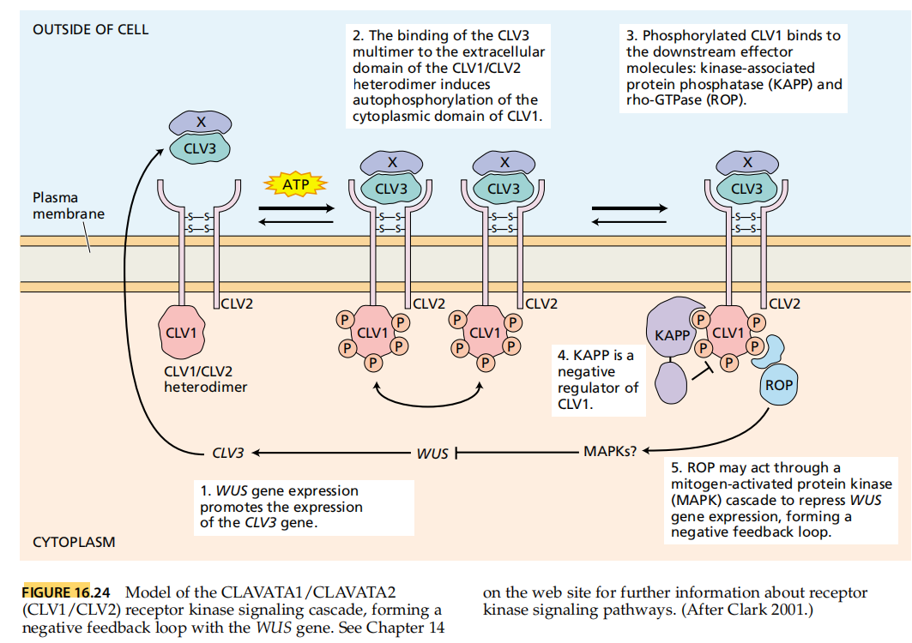
	- 通过受体来抑制WUS基因的表达，当WUS表达后促进CLV3基因表达，表达产物抑制WUS表达→ ==负反馈回路== 
		1. **起始**：WUS 基因表达促进 CLV3 基因表达，CLV3 蛋白被分泌到细胞外
		2. **结合与磷酸化**：CLV3 多聚体与细胞膜上 CLV1/CLV2 异二聚体的胞外结构域结合，诱导 CLV1 胞内结构域的自磷酸化 ，此过程需要 ATP 供能
		3. **下游信号传导**：磷酸化的 CLV1 结合下游效应分子，如激酶相关蛋白磷酸酶（KAPP）和 rho - GTP 酶（ROP）
		4. **负调控**：KAPP 是 CLV1 的负调控因子
		5. **反馈调节**：ROP 可能通过促分裂原活化蛋白激酶（MAPK）级联反应抑制 WUS 基因表达，从而形成负反馈回路，调控茎尖分生组织干细胞数量
#### 3.2 Secondary growth 次级生长
- Concepts：由于侧生分生组织、居间分生组织、其他薄壁细胞引起的生长
- **侧生分生组织**：由形成层cambium产生，使茎膨大，产生侧芽 lateral bud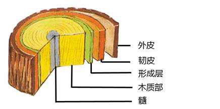
- **居间分生组织**：原本是没有分裂活力的，但是特定情况下能够重新赋予细胞分裂的活性
	- 竹子、韭菜→所以割了以后又会长:o!(我的葱也是)
- 其它薄壁细胞：比如马铃薯块根膨大
#### 3.3 Regeneration and differentiation
- 植物组织培养[[4.17 植物组织培养]]
	- Totipotency 全能性：植物体的每个活细胞携带着一套完整的基因组，并且具有发育成完整植株的潜在能力
	- Redifferentiation 再分化:由脱分化状态的细胞再度分化形成另一种或几种类型细胞的过程[[Chapter8 细胞分化与干细胞]]
	- Dedifferentiation 脱分化：原已分化的细胞在一定条件下，失去原有的形态和机能，重新恢复细胞分裂能力的过程
#### 3.4 Seed germination
- Some feactures
	- 吸水量：活的种子吸水很快
	- 呼吸速率：
	- 新的DNA与蛋白合成
	- 豆子的蛋白高，但是豆芽中的氨基酸多多
	- 植物激素会发生变化，自由态的IAA增加，ABA下降
## Section4 植物生长
#### 4.1 Seed Germination[[Chapter6 种子萌发]]
- Factors:
	- Water： #重点 
		- it softens the seed coat, facilitating the elongation of the radicle. 水可软化种皮，使胚根更容易伸长突破种皮
		- it increases the permeability of oxygen, which is essential for enhancing the metabolic rate of the embryo. 能增加氧气的渗透性，提高胚胎的新陈代谢速率
		- Thirdly, water transforms substances from a gel - like state to a sol - state, activating enzymes and promoting biochemical reactions. 促使凝胶状物质转变为溶胶状态，激活各种酶，加速种子内部的生化反应
		- Fourthly, it triggers the  ==hydrolysis of stored macromolecular substances,==  providing nutrients and energy for seed germination and seedling growth. 引发储存的大分子物质水解，为种子萌发和幼苗生长提供营养和能量。
		- Additionally, water converts plant hormones  ==from a conjugated form to a free form,==  regulating the germination process. 使植物激素从结合态转变为游离态，调节种子萌发进程。
			- 不同类型的种子对水分含量要求不同，淀粉类种子萌发需要 30 - 70% 的含水量，而蛋白质类种子（如大豆）则需要超过 110% 的含水量45。
	- O2
		- 氧气不足时，一直进行无氧呼吸，导致产物的累积造成毒害
		- 油性种子需要更多的氧气，一般RQ<1
	- Temp ^f8e19a
		- **Three cardinal points 植物生长温度三基点**
			- 生长最低温度:可以决定播种时间
				- 低温可以打破休眠
			- Optimum (suboptimum) temperature for growth 最适（协调最适）生长温度
				- **最适生长温度**：植物生长最快时的温度，而不是生长最健壮的温度。
				- 协调最适温度：使植株最健壮生长的温度， ==通常要比最适温度低== 
			- 最高温度：植物能维持生长的最高临界温度
				- 超过此温度时，植物的生理功能会因高温受到抑制（如酶活性下降、蛋白质变性），生长停止，甚至导致细胞结构破坏或死亡
		- Stratification (低温层积): Chilling seeds to break dormancy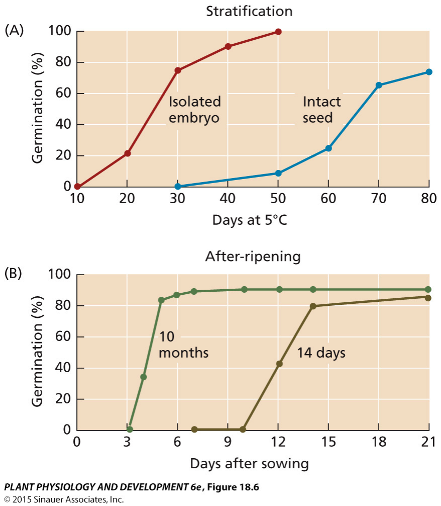
		- Differences:在一定范围内，温差越大长得越快(哈密瓜😍)
	- Light
		- Dark favored seed (嫌光种子):The seeds germinate well under darkness but poorly under light. 
			- Such as pumpkin,onion
- Changes
	- 吸水：先快后慢，最后急速升高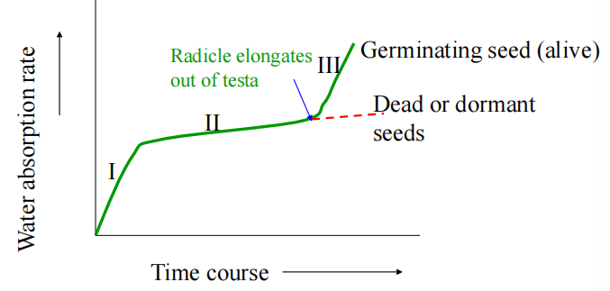
	- 呼吸作用的变化
	- 核酸与蛋白质的变化
		- 原有的mRNA合成新的蛋白质→从头合成DNA和蛋白质
	- 有机物转变：从储藏物质变成小分子，以便新一轮的合成
	- 激素的变化
		- 生长素的运输机制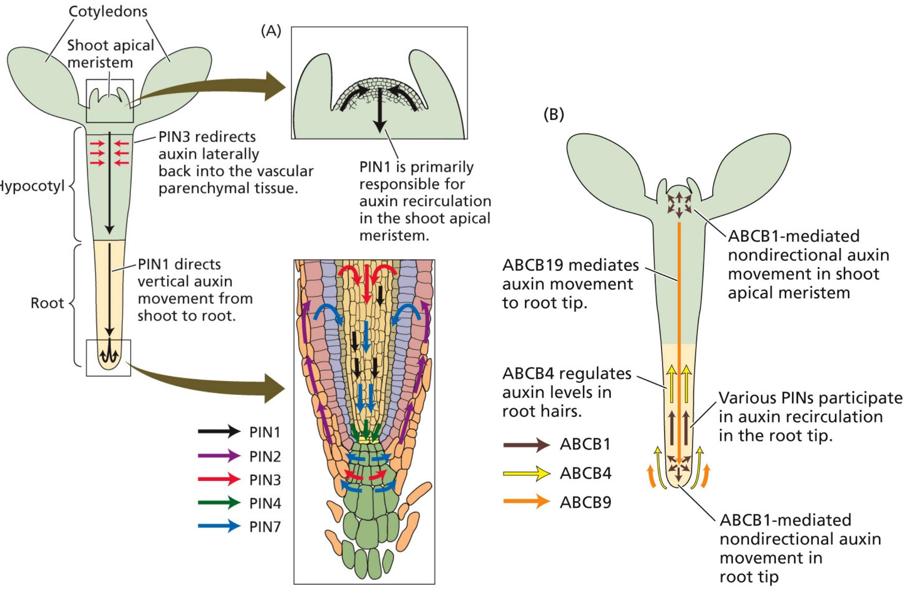
			- 在胚轴hypocotyl中，PIN3 将生长素横向重新定向回维管薄壁组织；PIN1 则引导生长素从茎到根的垂直运输 。
			- PIN1 主要负责茎尖分生组织中生长素的再循环
			- 介绍了不同 ABC 转运蛋白在生长素运输中的角色。ABCB19 介导生长素向根尖的运输；ABCB4 调节根毛中的生长素水平；ABCB1 在茎尖分生组织和根尖介导非定向的生长素运输 。同时，多种 PIN 蛋白参与 ==根尖生长素的再循环== 。
		- 影响激素结合态和自由态的转化
#### 4.2 Grand period of growth 生长大周期
- Concepts:无论是细胞、组织、器官乃至整个植株在其整个生长过程中，生长速率均表现出相同的规律性：初期缓慢，以后加快达到最高，之后又缓慢，以致停止。呈现出“快-慢-快”的变化，通常把生长的 3 个阶段总结起来叫做植物生长大周期
	- The total growth appears S-shape growth curve-logistic curve and the growth rate is a parabola(抛物线）[[Chapter7 微生物的生长]]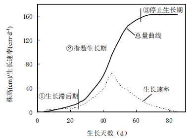
- Growth analysis$$ W = W_0 e^{rt} $$
	- W:weight after growth, W0：initial weight
	- t：growth time，r：growth rate
- 分类
	- **昼夜周期性（Diurnal periodicity）**：植物生长受昼夜交替影响，在一天内呈现周期性变化
	- 季节周期性(Seasonal periodicity):植物生长在一年中随季节更替而呈现周期性变化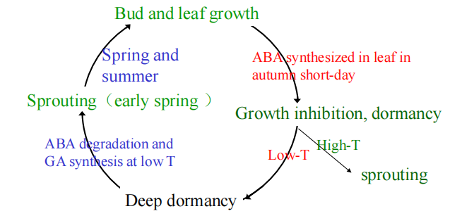
		1. 地上部分：春季根系先于地上部分生长，落叶之后根系仍会生长
		2. 地下部分
#### 4.3 Affective factors
1. Light
	- 间接作用：光合作用/蒸腾作用→影响积累与水分
	- 直接作用：光对植物形态建成的作用→ ==合理密植== 
	- 喜光种子，同样也存在嫌光种子
		- 耕地的时候，在拖拉机后面拉一个黑布，能够降低杂草种子的萌发率；同时树底下的杂草长得很少:O！
		- 对莴笋的实验：黑暗情况下萌发率很低，红光照射后萌发率升高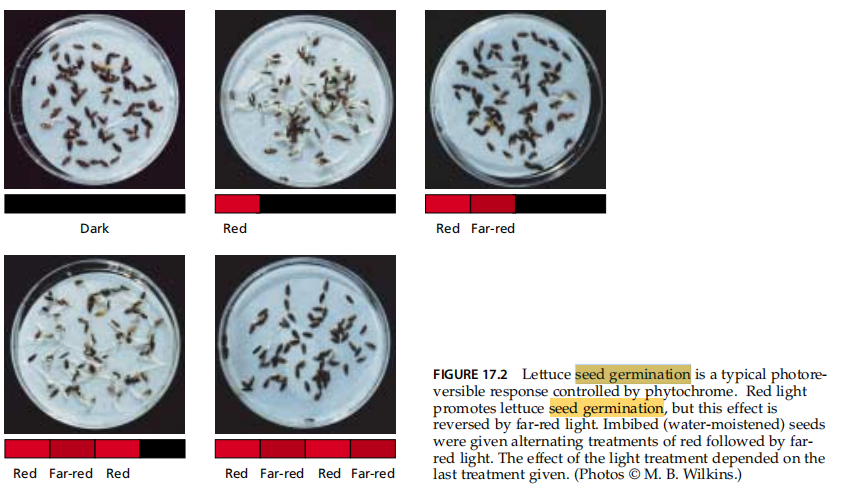
	- **Etiolation 黄化** #名词解释 
		- 由于光照不足引起的植物非正常生长。茎干细长，叶淡黄不展开，顶芽钩状，机械组织不发达，含水量高，干物质少
	- Ultraviolet inhibition：Smaller and draft plants at high altitude mountain.
	- 植物会在温室里徒长，因为红光的含量过高
2. Temp:[[#^f8e19a]]
3.  Water：“Dry for root, wet for bud”
4. O2：中耕松土
5. Mineral nutrition
#### 4.4 Correlation
- 植物生长相关性：植物各部分之间的相互协调与相互制约的现象
1. **地上与地下部分的相关性**
	1. 关系Exchange of substance and signal betweenshoot and root
		- 地上部分为地下部分提供photoassimilate、IAA and VB1
		- 地下部分为地上部分提供水分、矿质、植物激素、AA
	- **Root-shoot ratio 根冠比**：地下部分（根系）与地上部分 ==干重的比值== 。反映作物的生长状态，以及环境对作物根冠的不同影响 #名词解释 
		- 土壤水分状况：干旱→根系的水分条件更好👉R/T↑
			- **拷田**：不浇那么多水，让根系多涨一点
		- 土壤通气状况
		- 土壤营养情况：
			- 供氮充足→蛋白质合成旺盛，利于枝叶生长，同时减少光合产物向根系输入👉R/T下降
			- P和K↑→R/T↑
		- 光照：Sufficient light→the ratio↑
		- 温度：温度下降，比例升高
		- 修建整枝
2. **主茎与侧枝的相关性Main stem and branch**
	- **顶端优势apical dominance**：通常主茎生长很快，而侧枝或侧芽则生长较慢或潜伏不长。这种植物的顶芽生长占优势而抑制侧芽生长的现象 #重点  ^5d7d9d
	- 原因：与营养物质的供应和内源激素的调控有关
		- Nutrition hypothesis：茎能够优先获取营养物质，使得侧芽由于营养不足而生长缓慢
		- IAA hypothesis:IAA的极性运输与信号转导相关的基因控制顶端优势。 ==侧芽对IAA的积累更敏感== ，高浓度的IAA会抑制侧芽生长
			- 如用混有生长素的羊毛脂涂在去顶的切口上，顶端优势仍然存在，使侧芽不能萌发生长
		- IAA/CTK/SL假说：三者的平衡调控顶端优势，高IAA/CTK比值促进顶端优势
		- ABA hypothesis:侧枝中ABA含量更高一些，抑制其生长，有助于维持顶端优势
	- 应用
		- 生产上保护顶端优势:麻类、烟草、向日葵、玉米、高粱→使主茎强壮
		- 生产上去除顶端优势:果树、行道树、花卉
		- 雪松类有半顶端优势；灌木、柳树类没有顶端优势
		- 在不同时间是可变的，当产生分蘖时，顶端优势被打破
		- 移栽植株时，由于切断了主根而常使侧根生长更好。
3. **营养生长与生殖生长的相关性**
	- Concepts:营养生长和生殖生长是植物生长周期中的两个不同阶段，通常以 ==花芽分化== 作为生殖生长开始的标志
	- 营养生长过旺，消耗养分过多，便影响到生殖器官的生长，如禾谷类作物“贪青迟熟“[[Chapter5 同化物的运输和分配]]
## Section 5 Movement in plant
#### 5.1 Tropic movement
1. **Phototropism 向光性**:植物生长器官受单方向的光照射而引起生长弯曲的现象。有正向光性、负向光性、横向光性 ^7cf154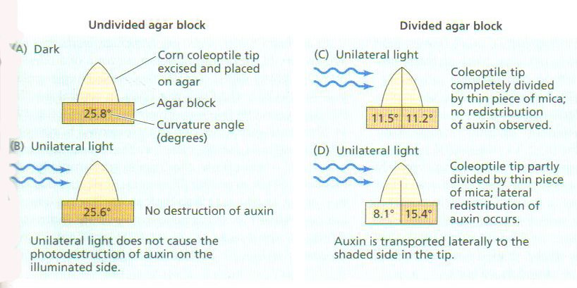
2. **Gravitropism**:
	- related to IAA distributed uneven in root tip👉联系高中生物，较多的IAA集中在下半部分，抑制其伸长
	- relative to statolith和淀粉体：把根横过来以后它会改变位置→LAZY蛋白
	- 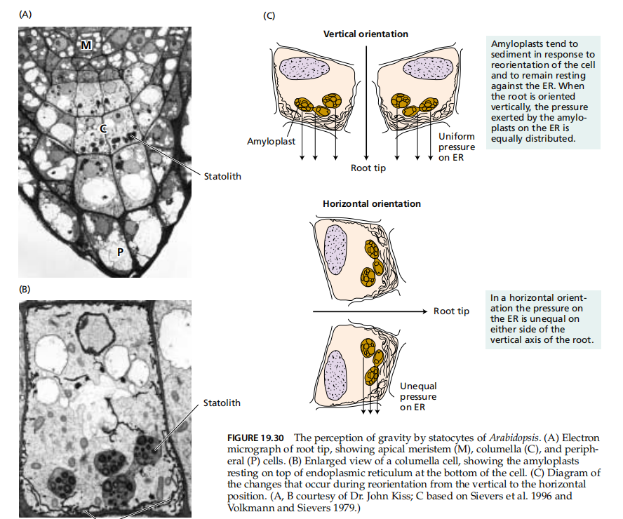
		- 当根处于垂直方向时，淀粉体在平衡细胞中均匀分布，生长素在根中均匀运输，根垂直生长
		- 当根水平放置时，淀粉体因重力作用沉降到细胞下侧→触发生长素向根的下侧 ==极性运输== ，导致根下侧生长素浓度升高
			- 根对生长素较为敏感，下侧高浓度的生长素抑制细胞生长，而上侧较低浓度的生长素促进细胞生长→从而使根向下弯曲生长 ，体现出向重力性
		- 去除根冠（包含平衡细胞）会消除根的向重力性，进一步证明了淀粉体在根向重力性中的重要作用
3. **Nastic movement感性运动…**：运动方向与刺激的任何矢量成分无关。
	1. Thigmotropism （向触性）e.g.含羞草
4. **Circadian rhythm昼夜节律**
	- 合欢树的叶子晚上会关起来→与离子运动有关(联系保卫细胞)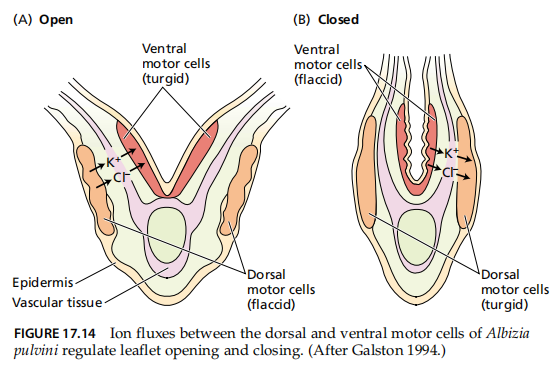

## Section5 光敏色素与其他光受体
#### 5.1 Phytochrome光敏色素
- Concepts:存在于植物中并 ==与光周期相联系== 的一种发色团-蛋白质复合物
	- 可吸收红光，启动植物许多生理过程，如发芽、生长、开花等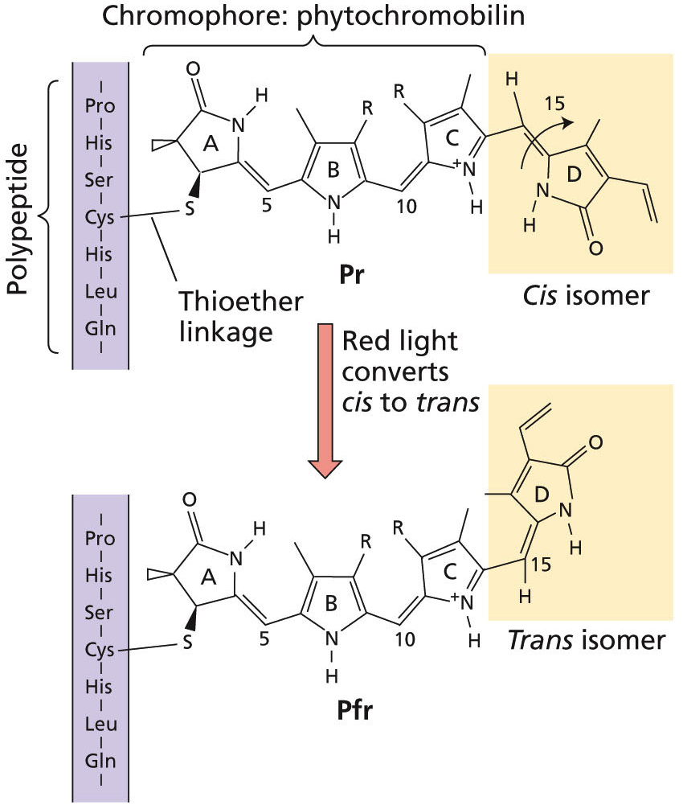
- 发现：红光（波长 650~680nm）促进种子发芽，而远红光（波长 710~740nm）逆转这个过程→当红光和远红光反复交替照射后，种子的萌发率高低则取决于最后一次照射的是红光还是远红光?
	- 光敏色素对光波吸收表现出两种存在形式： ==红光吸收型（Pr）和远红光吸收型（Pfr）→激发态== 
		- Pr吸收红光能转变成Pfr，Pfr吸收远红光转变成Pr
		- 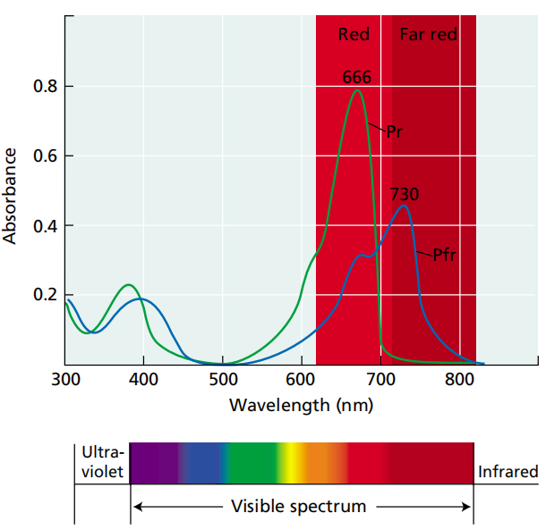
	- Pfr是光敏色素的活化形式，可引起各种生理反应。
		- 控制许多生理作用：种子萌发，叶脱落，花诱导，花色素形成等
		- 诱导许多光调节酶，影响叶绿体形成与光和作用，呼吸与能量代谢等
#### 2. 性质
- 化学性质：易溶于水的色素蛋白，相对分子量为250kDa,由 2 个亚基组成的二聚体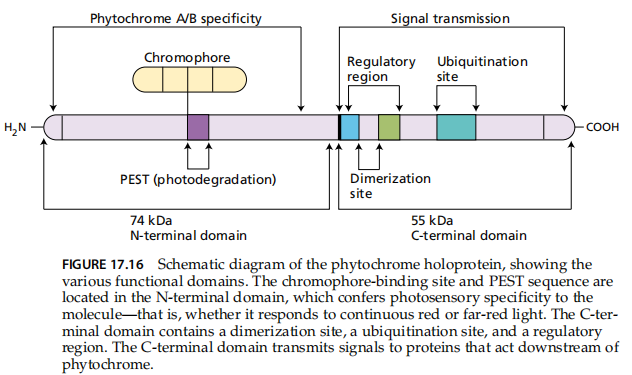
	- 生色基团chromophore：具有吸光特性
	- 脱辅基蛋白apoprotein
- Optical characteristics光学性质：在黄化幼苗中只有Pr型，当照射白光或红光后就转变为具有生理活性的Pfr形式
	- 光稳态平衡
	- 光化学转换与暗代谢
	- 光敏色素基因和分子的多型性
- 光敏色素的反应类型
	- 极低辐照度反应(very low fluence response,VLFR)
	- 低辐照度反应(low fluence response,LFR)
#### 5.3 Physiological function and mechanism of phytochrome
1. Physiological effects
	1. Flower induction[[Chapter8 Floral and reproductive physiology in plant]]
	2. Seed germination
	3. 调节酶的活性
	4. 植物的**光形态建成** #名词解释 
		- Concepts: 光以环境信号的形式作用于植物， ==调节植物的生长、分化和发育的过程== 。如种子萌发、茎叶生长、开花结实等
		- Skotomorphogenetics暗形态建成
			- 但是一经过光照就能立刻变成光形态的样子，也叫做脱黄化
			- 光强越强，越不容易逆转
2. Mechanism of photochrome function
	1) Activation of enzymes
	2) Control of gene expression levels调节基因的表达水平
		- 白天与光形态建成有关的基因表达上调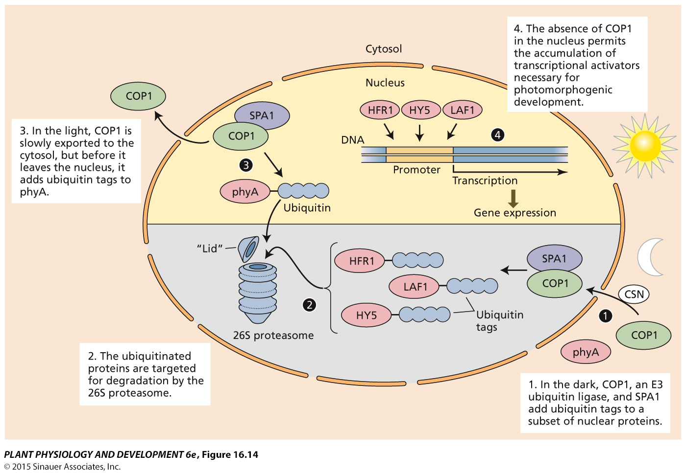
#### 5.4 Other photoreceptors
- **Cryptochrome隐花色素**
	- Blue/UV-A receptor 蓝光/近紫外光受体
		- 隐花色素，吸收蓝光和近紫外光，参与光控的茎的伸长、叶片展开、光周期开花等
- **Phototropin向光素**→LOV2功能域更重要，突变后失去向光性[[#^7cf154]]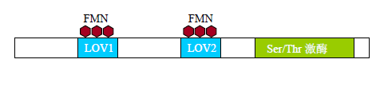
	- 会导致气孔的打开
- UV-8色素，以二聚体形式发挥功能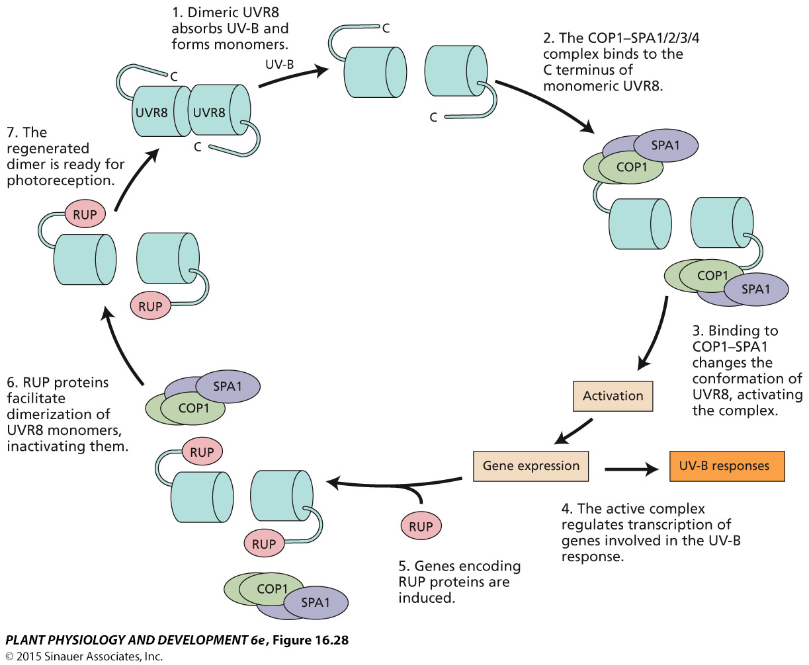
-------------------------------------
1. How to distinguish growth and differentiation?
2. Why does the plant often overgrow in the greenhouse?
3. How do heavy N and water decrease the ratio of root to shoot?
4. Explain an autofeedback loop for maintenance of stem cells in the meristems.
5. How the root generates the gravitropism?
6. Name the main photoreceptors in plants and describe the mechanism ofphytochrome functioning
----
- references
	- [植物生理学 植物的生长生理 - 知乎](https://zhuanlan.zhihu.com/p/632216052)