## Section1 Plant development phases
![[Pasted image 20250608112539.png|]]
#### 1.1 Characteristics of juvenility and adult phase
- Juvenile phase
	- Concepts：植物花 ==分化前期== ，即使在始于开花的时期也不能开花→对应成年期
		- An age or a physiological state of plant before flower differentiation, in which it is unable to flower, even if plant grows under an environment for flowering
	- Characteristics
		- 叶子形状发生改变e.g合欢的羽状叶变得像玉米叶子一样
		- 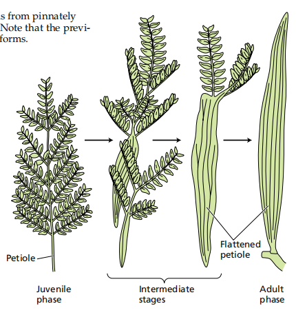
		- 代谢活动更加旺盛
		- miRNA156丰度更高
#### 1.2 The methods to shorten juvenility
- 长日处理long-day treatment
- 嫁接：采用外部和顶部的枝条grafting
- 外施GA/碳水化合物海藻糖→可以促进开花[[Chapter6 Plant hormones]]
- 基因工程
#### 1.3 Some Conceptes
- 植物开花的三个阶段
	1. 成花诱导Floral evocation：the process by which the  ==shoot apical meristem becomes committed to forming flower== . Period taken from weeks to years
		- 接收信号的三种形式
			- **自主调控Autonomous regulation**：单一地对内源信号产生反应，即由内部发育因素决定的开花(比如说不能给一两岁小朋友去tla:O!)
			- **Obligate or qualitative response (环境专性或质比反应)**：单一地对环境信号产生反应
			- 环境兼性：对两者都能产生反应
		- 感受状态：当给予适宜的信号后能够开花的状态
		- **成花决定态Determined state**:当芽进入这一状态后，即便将其从正常生长环境中移除 ，它仍会继续发育并且开花。
			- 这意味着植物的茎尖分生组织在接受成花诱导信号后，已具备了分化形成花或花序的能力，且这种能力相对稳定，不受后续环境条件改变的影响 
			- 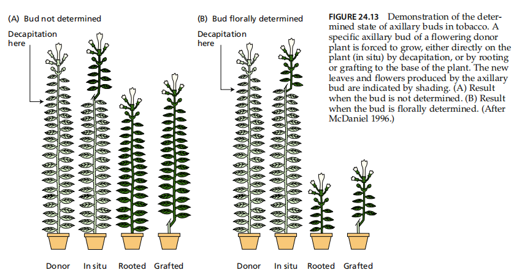
			- 对于已经进入成花决定态的植株， ==稍加长日照就能够开花== 
	2. 花分化floral bud differentiation/花发端floral evocation：指在花分生组织上形成花原基和花器官原基
	3. 花发育floral development:指各部分花器官的形成和生长，首先看到花蕾，然后就是平常所见的开花。
#### 1.4 Florigen成花素

^873ca0

- 检测到 ==FT蛋白== ，通过胞间连丝运输到筛管分子中→移动到顶端的花生长点
- 关键基因*FLC*→抑制*FOC*基因表达，只有当FT上来以后，FOC的表达迅速增加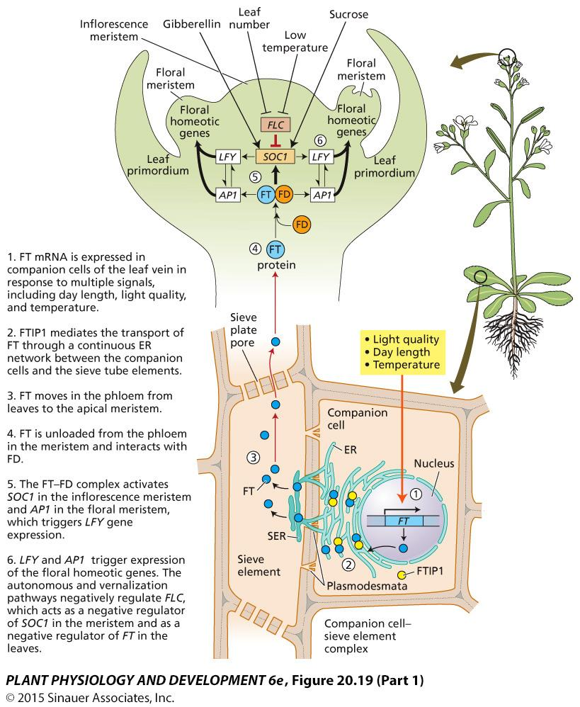
## Section2 Vernalization春化
#### 2.1 Concepts
- 春化：指植物生命周期中对低温的反应，尤其是低温诱导植物开花的作用。对种子或幼苗的冷处理可减轻开花抑制。Every response of plant life cycle to low temperature, especially for promotion of the flowering.
	- 一类植物对低温的要求是绝对的：二年生和多年生草本植物→第一年秋季长成莲座状的营养植株过冬，第二年诱导后夏季抽薹bolting开花
		- 若没有低温诱导则一直 ==保持营养状态== 
	- 对低温的要求是相对的：冬小麦等冬性作物
- **Devernalization去春化作用**:在春化完成之前，春化作用会被高温去除。Before finishing vernalization, the effect will lose under high temperature.
	- 温度：25~40℃
	- 应用：
#### 2.2 Characteristics of vernalization
1. Temperature and time lasting for vernalization→可以联系农艺实践我们看的春性麦类和冬性麦类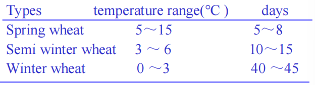
2. The part sensitive to low temperature
	1. 冬性一年生植物在萌发前可进行春化处理
	2. 对低温敏感的部位主要是茎尖👉当茎尖处于低温环境，植株其他部位处于正常（较高）温度时，植物能够开花
3. The stage sensitive to low temperature
	- 种子春化：The winter cereals（冬季谷物） may be vernalized as soon as the embryo has imbibed water and the germination process has been initiated胚胎吸水 ==种子萌发时== 对春化作用敏感性高
		- 原理：萌动种子的胚细胞具有分裂活性，能感知低温信号，引发内部生理生化变化，如相关基因表达改变、激素水平调整等，为开花做准备 #课后拓展 
		- e.g.白菜、芥菜、萝卜、菠菜、莴苣等蔬菜，以及冬小麦等作物
	- 绿体春化：Other plants, cabbage and henbane, in particular the biennial（两年生植物）, must reach a certain minimum size before they can be vernalized植株生长任何时期都可对春化敏感，但这一敏感期因植物种类不同而不同
		- 植物需长到一定大小的植株体后，才能感受低温并产生春化反应。种子萌动阶段即便遇到低温，也无法完成春化，必须植株生长到特定阶段才行
		- 春化后，植物还要经过 ==较长的日照以及较长时间的高温度== 才能开花，所以需要防止初春突然升温几天后又降温这种情况
#### 2.3 Mechanism of vernalization春化作用的机理
1. Metabolism induction hypothesis：春化产生的影响不会移动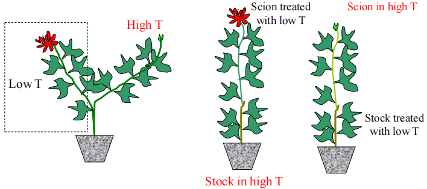
	- 将两边分别放在高温和低温下
	- 中间：砧木处于高温，接穗经低温处理 ，接穗能开花，说明接穗自身经低温处理后可完成春化开花
	- 右边：砧木经低温处理，接穗处于高温 ，接穗不能开花，直观呈现出春化作用的低温效应无法从砧木（一个器官 ）传递到接穗（另一个器官 ），佐证了低温效应不能跨器官传递的理论
2. Vernalin hypothesis(depending on species)春化素假说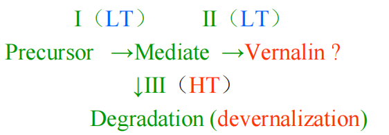
	- 前体物质Precursor经低温(LT)条件下的阶段 Ⅰ、Ⅱ，形成中间产物并最终可能形成春化素Vernalin；
	- 而 ==中间产物在高温(HT)条件下（阶段 Ⅲ ）会发生降解== ，即去春化作用（devernalization ），无法形成春化素，也就不能促进开花 。
3. Some genes related to vernalization
	- 拟南芥:*FLC*对于春化作用很敏感
	- 冬小麦:VRN1~5(感觉这张图很有意思，有空看看🤔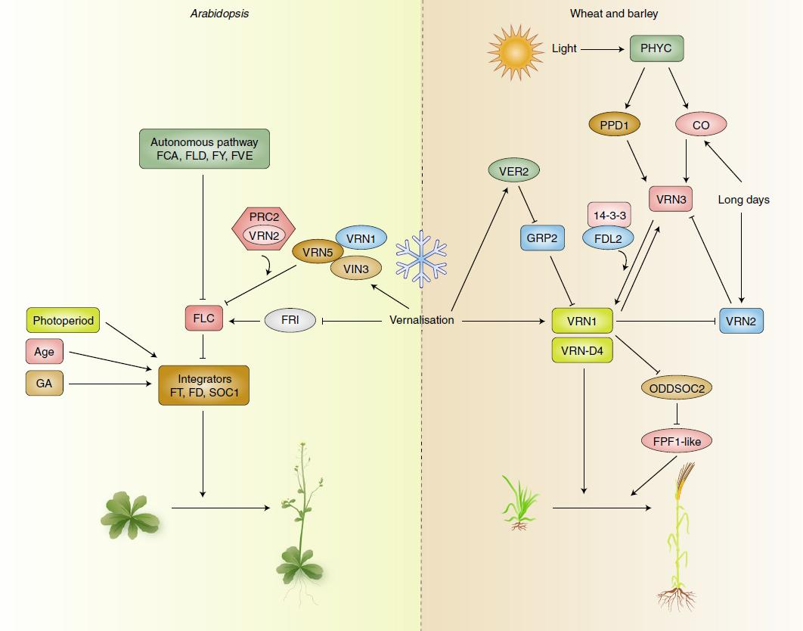
		- 拟南芥：春化处理通过抑制FRI基因，降低FLC表达。同时，春化还激活 VRN1、VRN2、VRN5、VIN3 等基因，这些基因与 PRC2 共同作用，进一步抑制 FLC，最终促进开花
#### 2.4 Application
- 不让中草药进入生殖阶段，让块根长大
- Select sowing time选择合适的播种时间
- Introduced crops引种时要满足作物对于低温的要求
## Section3 Photoperiodism光周期
#### 3.1 Plant types responsive to photoperiodism
^5e8506
- Plant types responsive to photoperiodism
	- SDP（LNP）短日植物Long night plant：
		- 只有 ==日照短于临界日长== 下处理一段时间后才能开花的植物The plant can only flower under daylength shorter than its critical day length of 24h cycle.
		- 如苍耳、菊花、烟草、大豆→秋天开花
	- LDP（SNP）长日植物Short night plant：
		- 只有 ==日照在长于临界日长== 下处理一段时间后才能开花的植物The plant can only flower under daylength longer than its critical day length of 24h cycle.
		- 如小麦、黑麦、天仙子
	- **DNP** **日中植物**：在任何日长下都能开花的植物，如番茄、黄瓜、茄子、四季豆等Without critical daylength, they can flower in any day length of 24h cycle, if other conditions are satisfied.
	- Other types:
		- 长短日植物
		- 短长日植物
		- 中日照植物(我请问呢)
- **Critical day length临界日长**:长日植物开花的最短日长，短日植物开花的最长日长 CD is referred as the day length of 24h cycle is the shortest day length for LDP flower and the longest day length for SDP flower. #重点 
#### 3.2 Characteristics of photoperiodism
1. Function of dark and light period
	- 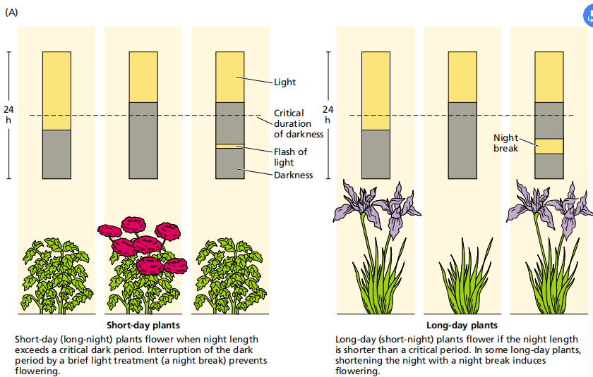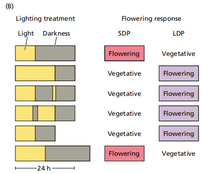
	-  **Critical night length** **临界夜长**：24h 昼夜周期中，诱导短日植物开花的最短暗期长度或诱导长日长植物开花的最长暗期长度。
		- 需要连续的黑暗时间才能够使得作物开花
	- 远红光的影响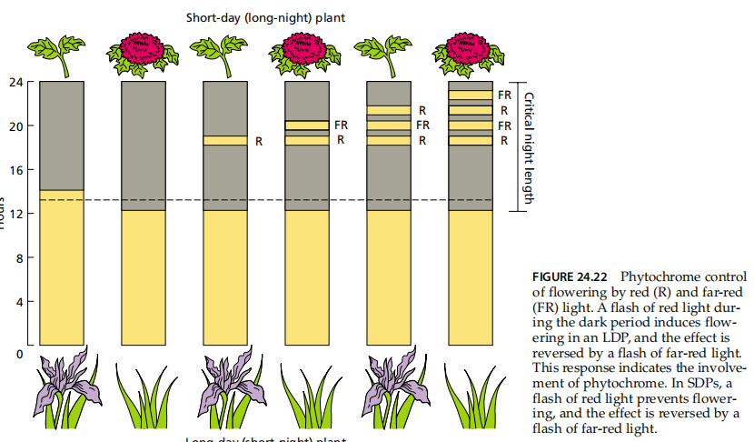
2. Effects of temperature on floral
3. **Photoperiod induction** **光周期诱导**：
	- Concepts:只要植物的叶片具有感受和产生光周期信号的能力，经一定次数的光周期诱导以后，即使在非诱导光周期条件下就可以开花。Plants can flower in both suitable or unsuitable photoperiod conditions if it has got enough days of suitable photoperiod.
#### 3.3 Mechanism of photoperiod induction
1. Organ responsible to photoperiod stimuli
	- 植物感受光周期的部位是 ==叶片== Organ responsible to photoperiod stimuli👉区别于茎尖感受春化作用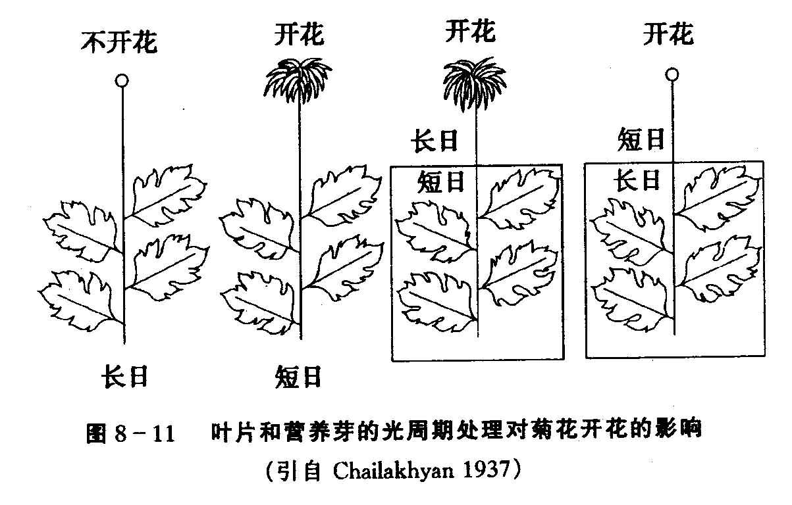
2. Stimulus of floral:**Florigen**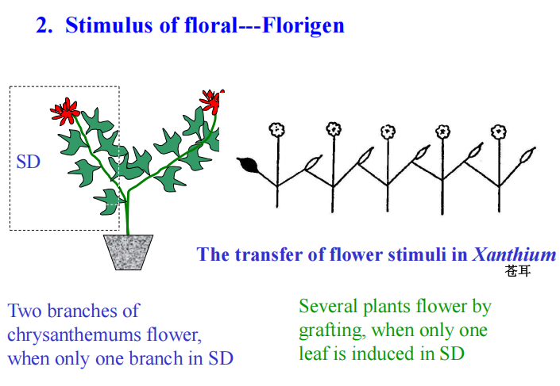
	1. 光敏色素参与光周期诱导的开花反应e.g.Florigen
		1. 经过诱导的植物可以产生成花素，在植株中传递并且诱导开花
	- 临界夜长比临界日长对开花更重要
	- 光周期诱导后植物体内产生开花刺激物向茎顶端分生组织传递
	- 光周期诱导开花需要温度、营养等其它条件相配合
3. Relationship between vernalization and photoperiodism:大多数需要春化作用的植物属于长日植物
#### 3.4 Application of photoperiodism on production
- 种子春化处理：经过春化处理的植物，花诱导加速，提早开花、成熟，这在育种快繁中是一项有用的技术
	- 在特殊情况如春季遇到自然灾害或其它原因使作物受毁，作为 ==生产补救== 的方法，对于萌动种子能通过春化的作物，可将其种子进行春化处理后播种，即使是春季播种也能抽穗结实
- Introduced crop(引种)：把我国南方的品种种到北方，开花日数缩短
- Regulation flower time:
	- Hybrids杂交:Two parents flower at the same time使父母本花期相遇便于杂交授粉
	- 在花卉园艺上，通过延长或缩短光照控制花期， 如菊花为短日植物，原在秋季开花，现经人工处理（遮光成短日照）在六七月间就可开出鲜艳花；如果延长光照或晚上闪光使暗期中断，则可使花期延后
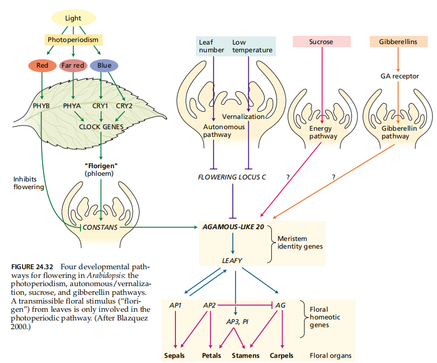
## Section4 Morphology and physiology of floral formation
#### 4.1 Changes in morphology and physiology of floral differentiation
- Morphology:Remarkable events: elongation and enlargement 
	- Initial elongation of apical cone in monocots 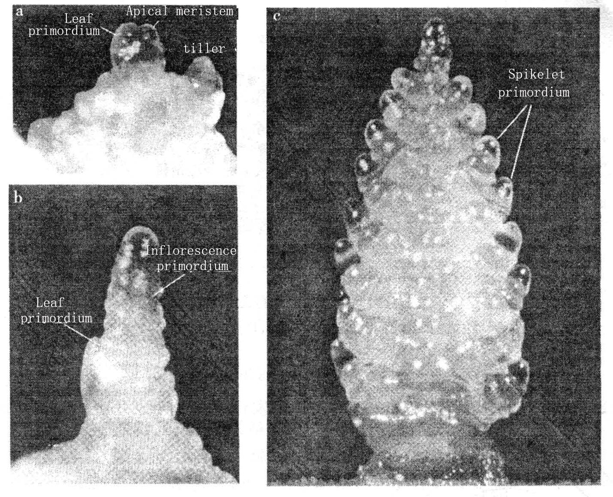
	- Enlargement of apical cone in dicots
- Physiology:DNA的复制
#### 4.2 Sexual differentiation
1. Dioecism (雌雄异株)→ #学科链接 植物学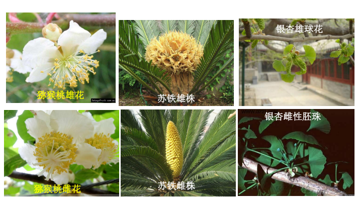
2. Monoecism(雌雄同株)
	1. Monocling, hermaphrodit (雌雄同花)：cotton/rice, wheat, arabidopsis.>85%flowering plants
	2. Dicling (雌雄异花)：maize, cucumber, pumpkin and castor etc
#### 4.3 Molecular models of flower development
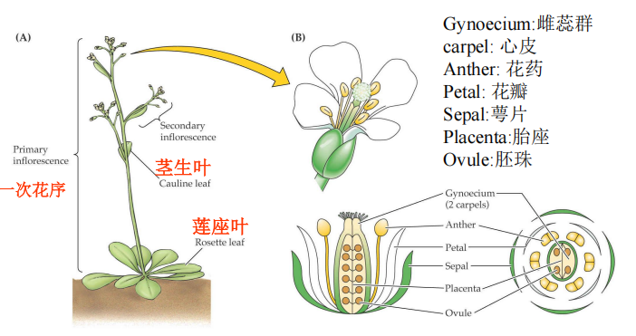

1.  **ABC模式**：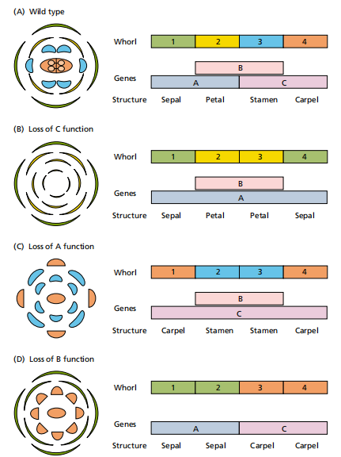
	- 正常花的四轮结构（萼片、花瓣、雄蕊和心皮）的形成是分别 ==由A、B、C 三类基因的共同作用== 而完成的，每一轮花器官特征的决定分别依赖A、B、C 三类基因中的一类或两类基因的正常表达
		- A类基因单独控制萼片的形成sepals
		- A与B类基因共同控制花瓣的形成petals
		- B与C类基因共同控制雄蕊的形成stamens
		- C类基因单独控制心皮的形成carpels
			- Tips:A与C之间是 ==互斥== 的→当A缺失时，全部萼片变成心皮
2. ABCE模式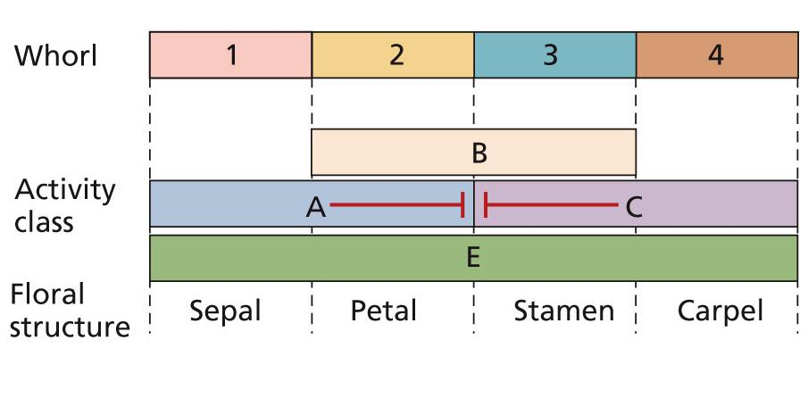
3. 光周期途径photoperiodic pathway
4. 自主/春化双重途径autonomous/vernalization pathway
5. 碳水化合物/蔗糖途径carbohydrate or sucrose pathway
6. 赤霉素途径gibberellin pathway👉具有取代长日照、低温的效果
#### 4.4 floral bud differentiation
- Concepts:指茎端分生组织 ==由叶原基转变成花原基== 的过程。在这个转变过程中，茎生长点在形态和生理上发生显著的变化
1. 形态变化：不管是单子叶植物还是双子叶植物，在经过光周期
2. 生理生化变化：花芽分化开始后，生长锥细胞代谢水平提高，有机物发生剧烈转化
	1. 葡萄糖、果糖和蔗糖等可溶性糖含量增加；
	2. 氨基酸和蛋白质含量增加； ==核酸合成速率加快== 

#### 4.5 Examples of some genes for flowering
- *CO(CONSTANS)*
	- 过表达的时候(?没听清)
- *LFY*→过表达突变后基部开花
- 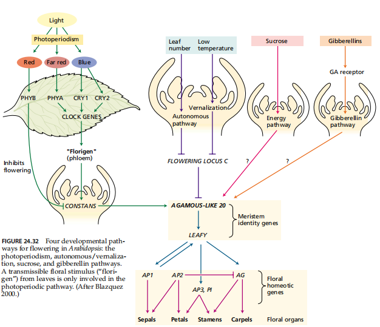
## Section5 Physiology of fertilization
#### 5.1 Pollen
- Strucuture: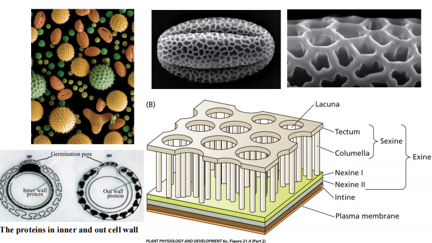
	- Double wall
	- 含油层tryphine:更好地进入花粉管
	- 营养物质：sugar,starch and protein(老师:带了些嫁妆🤔)
	- 虫媒花粉:五颜六色且有很多毛毛给虫子带走；风媒花粉：较高的淀粉含量，滑溜溜的
- 三核花粉是二核花粉分裂后得到
- **Group effect群体效应**：在人工培养花粉时，密集的花粉的萌发和花粉管生长比稀疏的好的现象In artificial culture, pollen germination and tube growth of dense pollen are better than that of sparse pollen. #名词解释 
- Gametophyte development in the Ovule
#### 5.2 Gametophyte development in the Ovule[[Chapter4 种子的形成]]
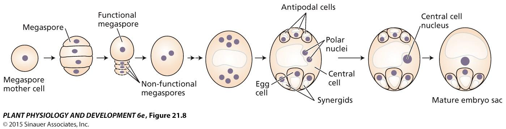

#### 5.3 Pollination and fertilization
- Pollination授粉：
	- hermaphroditic雌雄同体：自交/杂交
	- monoecious雌雄同株：杂交Cross-pollination
	- 第一次授粉发生在未开放的花中，雌雄蕊首次接触实现了柱头侧边缘的授粉；而开花6-7小时之后 ==花瓣会再次闭合== ，使得花药与柱头再次接触，并实现对柱头中央区域的授粉。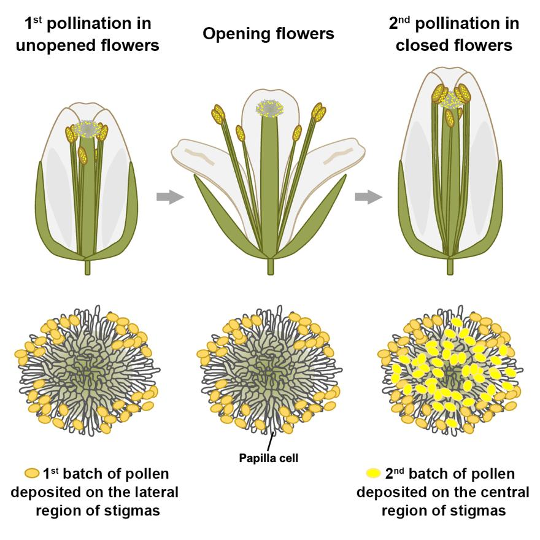
- prevent selfing and promote outcrossing:维持遗传多样性，有利于后代适应不同变化的机制
	1. pollen cell-incompatibility(SI)
		1.  **Self-incompatibility自交不亲和**：雌雄蕊均可育的两性花植物在自花授粉后不能产生合子的现象，花粉与柱头不亲和
			- 由S位点控制：孢子体不亲和/配子体不亲和(PPT图)→控制花粉管是否能够伸长
		2. 远缘杂交不亲和
	2. CMS雄性不育
	3. 花器官形态随发育阶段不同[[Chapter4 种子的形成]]
		- 雌雄蕊异熟/花柱异长👉同种花粉优先现象
- Pollen tube growth
	- 在单位时间内，花粉管是长得最快的器官，能够导向胚珠
	- 花粉管如何导向珠孔? #课后拓展 
- **Recognition**：细胞在融合前所进行的一种特殊反应，是两者可彼此获得是否融合的信息的过程。The process by which cells obtain information about whether or not to fuse with each other. #名词解释 
- Double Fertilization
#### 5.4 Effecting factors
- Vigor of pollen
	- Pollen stroage：低温/低氧/干燥
- Mineral nutrients
	- 硼是花粉萌发和花粉管伸长所必需的元素
	- 糖作为营养物质和渗透调节剂是必需的
	- 许多花粉粒能耐受干燥和高温
## Section6 Development of seed and fruit
#### 6.1 Seed development
- References:[[Chapter4 种子的形成]]|[[Chapter3 化学成分]]
1. Embryogenesis:A process in which zygote initiates cell division and forms embryo.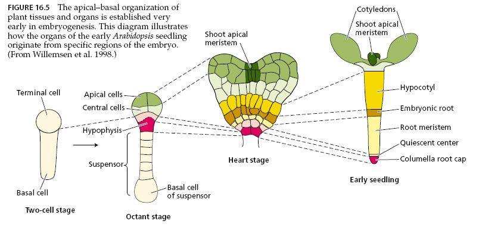
2. Endosperm development
	1. Nuclear type (核型胚乳，most common)
	2. Cellular type (with cytokinesis, 茄科）
	3. Helobial type (沼生目型，泽泻、慈 姑）
3. Seed coat development
4. Physiological changes during fertilization
	1) IAA rise in stigma.
	2) Respiration rise.
	3) stigma (ovule) as a strong sink.
5.  Physiological and biochemical events during seed development
	1) Change in respiration substance.
	2) Synthesis and accumulation of storage
	3) Plant hormones: Contents and type change from CTK—GA—IAA—ABA
	4) Desiccation
#### 6.2 Fruit Development
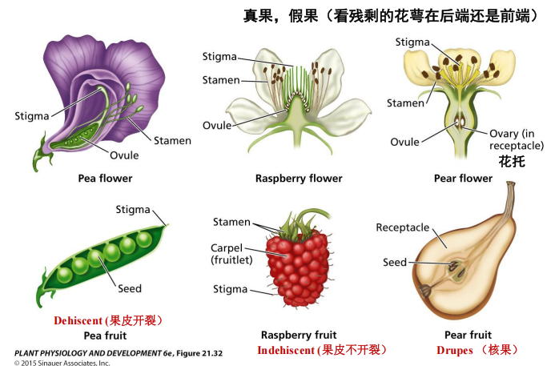
1. Growth:S型曲线和双S型曲线
	1. 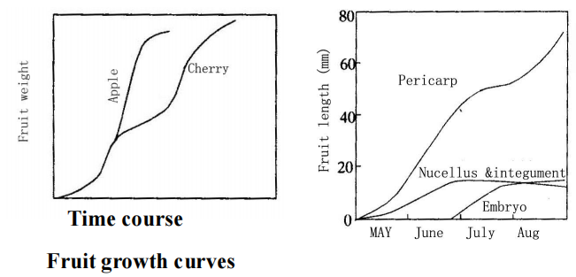
2. Changes
	- 呼吸跃变
	- Coloring
	- Sweet,good smell and less acid😋
	- 单宁酸含量下降→果实软化
- **parthenocarpy单性结实**：植物不经过受精作用而使子房膨大形成无籽果实的现象。

#### 6.3种子休眠dormancy
- Reasons
	- coat (pericarp) barrier[[Chapter5 种子休眠]]
	- After-ripening limitation：胚未发育完全/生理上未发育完全
	- inhibitors in seeds
- 休眠的破除
	- 机械破损→损坏种皮Coat (pericarp) barrier
	- 温度处理：加热法，用温水/热水浸泡
	- 化学处理：用酒精/浓硫酸/GA处理提高种皮的透性
----
1. Are the growth phases in a fruit tree the same for the whole plant? How to use them if it is used as a donor from grafting? 
2. Define the terms “floral evocation”, describe the factors affecting floral evocation?
3. What is the ecological function of photoperiodism? Discuss variations in the photoperiodic response. How phytochrome is involved in photoperiodism?
4. Discuss the mechanism of action of florigen in stimulating flowering in Arabidopsis. What other factors influence flowering?
5. Describe the ABC model for floral organ specification
6. Compare and contrast gametophytic versus sporophytic self-incompatibility. How do they differ at the biochemical level?
7. Describe six steps required for the delivery of sperm cells by the pollen tube to the female gametophyte.
8. Describe the biochemical and cellular changes that occur during fruit ripening. What is the role of ethylene?
