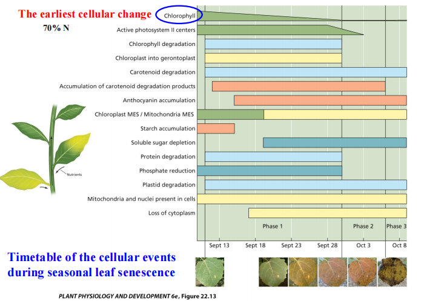
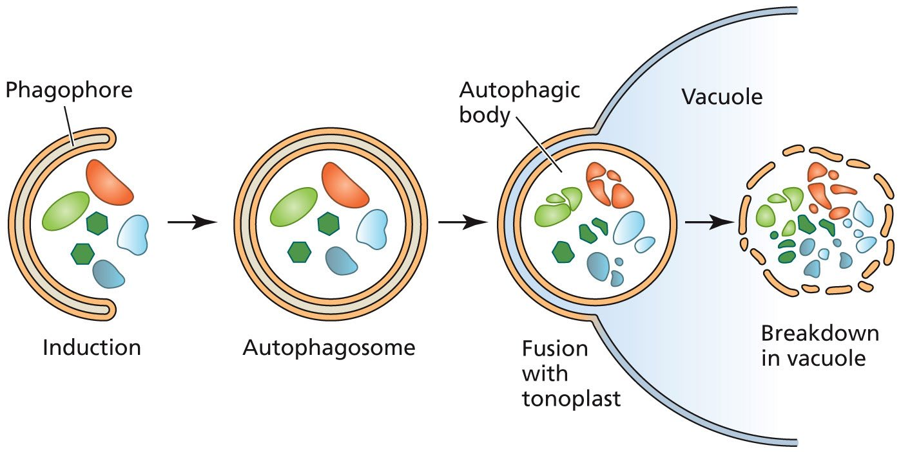
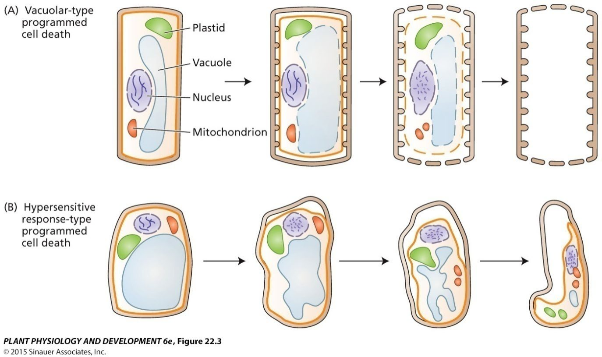
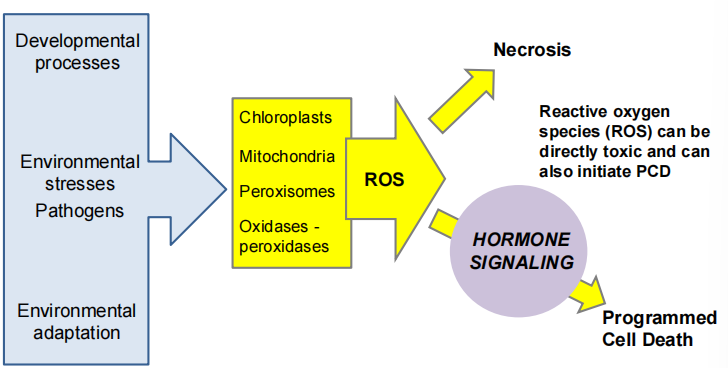
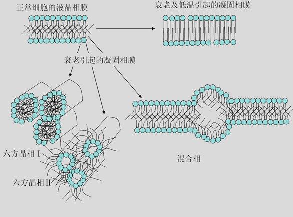

## Section1 衰老的类型与意义
#### 1. Concepts
- Concepts:衰老是指器官或整个植株的生命力功能衰退，最终导致自然死亡的一系列恶化过程。A program in which the function of organ or whole plant naturally declines to death
	- 对于哺乳动物来说，各个器官的衰老几乎同时进行
	- 而植物会产生新的种子，并且衰老过程有时候是可逆的
		- 只要植物进入生殖阶段，就意味着衰老的开始e.g.龙舌兰
- Significances："啃老w(ﾟДﾟ)w"
	- 植物成熟衰老时，其营养器官中物质降解，转移至种子， ==供新生代萌发和幼苗生长需要== 
	- 果实成熟衰老后容易脱落，有利于助其他媒介 ==传播种子== ，便于物种的生存
- 类型
	- 整体衰老：从地上到根系全部die:)
	- 地上部分衰老：冬天的草地The part aboveground dies with the end of growth season, but the part underground is alive for several years.
	- 脱落衰老：多年生落叶
	- 渐进衰老：即老的器官和组织逐渐衰老和退化，被新的器官和组织逐渐取代，如多年生常绿木本植物Senescence only occurs in older organ or tissue. New organ or tissue develops while old those are senescing.
#### 2. Programmed cell death编程性细胞死亡PCD[[Chapter9 细胞衰老与细胞死亡]]
^388681
- Concepts: ==有机体控制== 细胞的死亡的开始和结束The organism controls the initiation and execution of the cell death process.
	- Tips:与自噬相对，自噬还保留有细胞形状，但是细胞凋亡已经全部没了[[Chapter4 细胞基质与内膜系统]]
	- 可以导致通气组织的形成
- Characteristics:
	- 细胞核 DNA 断裂成一定长度的片段、染色质固缩、胞泡形成，最后形成一个个由膜包被的**凋亡小体**
	- 动物和植物 PCD 后的产物去向不同
		- 动物中都是被其他细胞利用， 而植物中则用于本身细胞的次生壁构建
		- 植物细胞的 PCD 是由核基因和线粒体基因共同控制的，伴随着一些水解酶，如核酸酶、蛋白酶和脂酶基因的表达
	- 诱导 PCD 的外界因子有激素(IAA、乙烯、ABA )/低氧/高温/干燥/ROS/病虫害
	- 包括了ROS的产生以及激素的信号
- Process
	1. 启动阶段initiationstage：涉及启动细胞死亡信号的产生和传递过程，其中包括 DNA 损伤应激信号的产生、死亡信号受体的活化等
	2. **效应阶段effector stage**：涉及 PCD的中心环节 caspase的活化和线粒体通透性改变
		- Caspase 是半胱氨酸蛋白酶家族，直接导致程序性死亡细胞原生质体解体的蛋白酶系统
	3. **降解清除阶段degradation stage**：涉及 caspase 对死亡底物的酶解，染色体 DNA 片段化，最后被吸收转变为细胞的组成部分
#### 3. 衰老的进程
1. 细胞衰老→机制[[#^388681]][[Chapter9 细胞衰老与细胞死亡]]
	1. 细胞膜衰老
		- Lipid phase change:液晶相，柔软且流动性大，膜脂不饱和脂肪酸含量高→凝固相，形成多种不完整的膜结构，变得刚硬， ==粘滞性增加，导致原生质粘度上升== 👉膜流动性降低，膜泄漏→电导率的测定
			- 磷脂生物合成减少，磷脂酶的活性减少
		- Phospholipase
	2. 细胞器衰老Oranelle senescence
		- 内质网活性降低(因为衰老了合成蛋白少了)
		- 液泡破坏→自噬[[Chapter4 细胞基质与内膜系统]]
2. 器官衰老
	1. 叶片衰老:光合速率下降→Rubisco活性下降，气孔导度下降；呼吸速率下降
		- 在衰老过程中，叶绿素也会降解，并且叶黄素、花青素等开始积累
		- 活性氧开始累积
	2. 种子衰老：种子生活力下降[[Chapter8 种子寿命]]
3. 植株衰老
## Section2 Machanism of senescence and Regulation
#### 1. Caused by nutrition exhaustion
- Nutrition exhaustion theory
	- e.g.龙舌兰几十年开一次花，花期结束后立刻死亡；对于玉米、竹子等把它的花去掉后也会加速衰老
#### 2. Physiology and biochemistry
- **Senescense-associated genes(SAGs)** expression
	- Senescence-downward genes：most of genes code enzymes relevant to photosynthesis, energy metabolism and other synthesis.
	- Senescence-upward genes：most of genes code enzymes for hydrolase, such as DNase, RNase, Protease, phospholipase蛋白酶、磷脂酶.
- Biochemistry
	- DNA/RNA
		- 在衰老组织中，DNA和RNA含量降低，并且RNA含量比DNA降低得更多
			- RNase活性增加
			- DNA-RNA聚合酶活性减少→与转录因子有关
			-  ==rRNA== 对衰老反应最敏感
	- 蛋白质：会被泛素化降解[[Chapter4 细胞基质与内膜系统]]
	- 脂肪降解：最后变成蔗糖“升糖过程“
- DIsorder of plant growth substance[[Chapter6 Plant hormones]]
	- CTK content decrease
		- 加入CTK可能会”返老还童“👉Blocking SAGs expression ^21e69b
	- Eth:Induce”**Cyanide-resistant pathway**"→ ==产生ROS== 
	- ABA
	- JA:叶绿素的降解
- 胞内外钙离子浓度的改变→影响信号传递
- 有关的反应→产生自由氧，对生命物质有巨大的伤害[[Chapter9 细胞衰老与细胞死亡]]
## Section3 Mechanism for abscission
#### 1. Abscission
- Concepts：a process during which the cells, tissues or organs, such as flowers, fruits and small braches, are detached from the plant body.
- Types of senescence and abscission.
	1. Normal abscission caused by senescence or ripening.
	2. Abnormal abscission caused by stresses: higher or lower temperature, drought or flood, insects or diseases.
	3. Physiological abscission caused by disorders in physiology itself: such as nutritional competition between vegetation and regeneration, sink and source.
#### 2. Enzyme relative to abscission
- Cellulase纤维素酶
- Pectinase果胶酶：把大分子果胶降解成五碳小分子→ ==降解细胞壁== 
- Catalase
#### 3. Abscission and plant hormones
- IAA:在近轴端加入IAA，导致脱落加快
- Eth:促进果胶酶的合成
- ABA
#### 4. Enviromental factors
1. Temperature 一直都是过高或者过低都不好，无脑回答
2. Water
3. light
4. O2：过高浓度的氧气也会导致脱落
5. Mineral nutrition：任何矿质元素缺少都会引起衰老与脱落
	1) N/Zn与IAA有关，Ca与细胞壁有关,B与花粉管萌发/伸长有关
#### 5.Regulation of senescence and abscission
1. Utilization of germplasm 种质resistant to senescence. 选择抗衰老的种质We can select varieties and cultivars resist to senescence.
2. Transgenic plant转基因植物 for resistant to senescence. We can use genetic technology to change the associated gene so that the transgenic plants are expected to resist senescence.
3. Application of plant substances for resistance to senescence, such as substances including CTKs, BRs, polyamines, IAAs etc.应用植物激素
	- 将SAG的promoter与合成细胞分裂素的IPT相结合👉产生拮抗，阻止SAG基因的表达[[#^21e69b]]
	- 采用生长调节物质
4. Application of good conditions.提供良好外界条件 For example, we should provide the plants with the optimum temperature, suitable strength of light, best oxygen concentration and good condition of mineral nutrition, avoid drought, flooding and disease.
5. 抗氧化物质

----
1. Describe the concept and types of plant senescence.
2. How to understand programmed cell death?
3. What happens during leaf or plant senescence?
4. What shill we do to delay senescence?
5. Describe the possible reasons and their underlying physiological mechanisms if the leaves of a plant in the field were turned yellow?

-------------
- References：
	- [南科大生科院郭红卫课题组在生物胁迫调控植物衰老机制取得重要进展 - 南方科技大学生命科学学院](https://bio.sustech.edu.cn/news/detail/1436.html)
	- [什么是细胞程序性死亡? - 知乎](https://www.zhihu.com/question/382884451)
	- [超氧化物歧化酶（Sod）是什么？ - 知乎](https://www.zhihu.com/question/652653320)