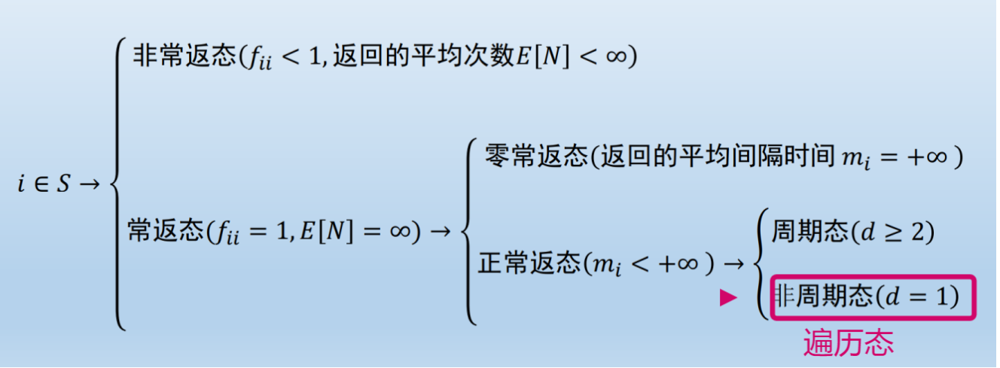

[【随机过程】15 - 离散时间马尔科夫链状态的常返性_怎么判断常返状态-CSDN博客](https://blog.csdn.net/qq_41741344/article/details/122508195)
## 一、定义
#### 1. Markov chain
- 无记忆性
- 一步转移概率这个也不难，注意到

> P(Xn=j)=∑iP(Xn−1=i)p(i,j)

这个是拿概率公式直接就能推出来的结果。但是更加重要的观察是，如果我们设q
## 三、常返与暂留

#### 1. 首中时
#### 2. 吸收
- 迷宫中的老鼠
	- 老鼠从2号房间出发在迷宫中做随机游动：n时呆在i(i≠3,7)号房间，则下一时刻老鼠等可能地移到相邻的房间，一旦老鼠到达7号房间就被猫吃掉；一旦到达3号房间，老鼠就吃掉奶酪。计算老鼠在吃掉奶酪前被猫吃掉的概率
	- 令
#### 易混淆：
- 条件概率与联合概率的差别
	- 相同点
		- **依赖转移概率**：两者均需要利用一步转移概率 P(i→j)P(i→j)。对于时齐链，转移概率不随时间变化，简化了计算
		- **马尔科夫性质**：均通过“未来仅依赖当前状态”的特性分解概率，避免考虑历史路径的复杂性。
	- 不同点：
		1. **条件概率**：
		     - **目标**：计算在 ==已知某状态下== 的未来状态概率，例如 P(Xn+k=j∣Xn=i)P(Xn+k​=j∣Xn​=i)。
		     - **方法**：通过多步转移概率 Pk(i→j)Pk(i→j)，即转移矩阵的 kk 次幂中的对应元素。
		     - ** ==无需初始分布== **：条件概率仅依赖当前状态和转移矩阵，与初始分布无关。
		2. 联合概率：
        
2. **联合概率**：
    
    - **目标**：计算状态序列的联合概率，例如 P(X0=i0,X1=i1,…,Xn=in)P(X0​=i0​,X1​=i1​,…,Xn​=in​)。
        
    - **方法**：分解为初始分布与各步转移概率的乘积：
        
        P(X0=i0,X1=i1,…,Xn=in)=π0(i0)⋅∏t=1nP(it−1→it),P(X0​=i0​,X1​=i1​,…,Xn​=in​)=π0​(i0​)⋅t=1∏n​P(it−1​→it​),
        
        其中 π0π0​ 是初始分布。
        
    - **需要初始分布**：联合概率的完整路径依赖初始状态的分布。
        

### 结论：

**思路的相似性**在于均利用马尔科夫链的转移规则和无记忆性；**差异性**在于条件概率专注于状态间的转移路径，而联合概率需额外考虑初始分布和完整路径的累积。因此，**两者的核心逻辑一致，但具体计算步骤因目标不同而有所区别**。

\boxed{核心思路一致，但条件概率聚焦转移路径，联合概率需结合初始分布与路径累积。}

--------------
- References:
	- [如何理解马尔科夫链中的常返态，非常返态，零常返，正常反，周期和非周期，有什么直观意义？ - 知乎](https://www.zhihu.com/question/46539491)
	- [马尔科夫链及其平稳分布 | Weiping's notes](https://weirping.github.io/blog/Stationary-Distribution-Markov-chain.html)
	- 