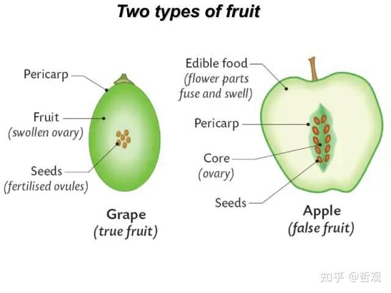
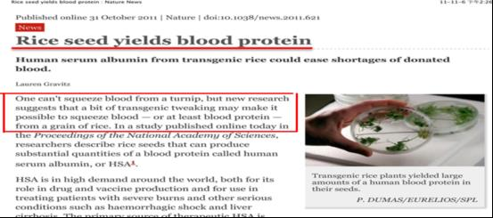
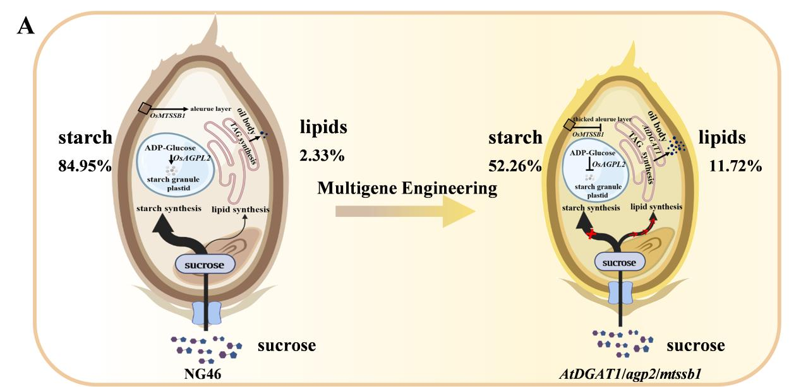
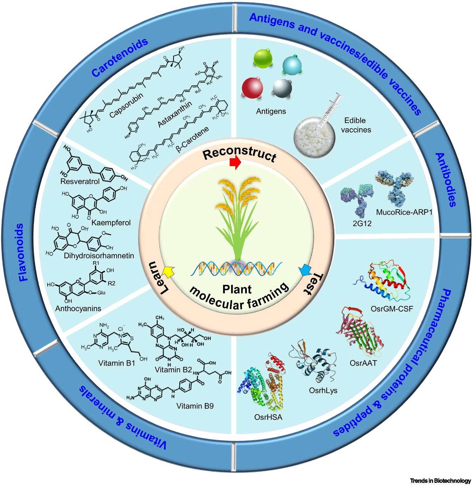

## 一、种子的定义
#### 1. 相关概念
- 种子：高等植物的繁殖器官 #名词解释 
	- 狭义：由胚珠发育而成的繁殖器官
	- 广义：生产上可作为播种材料的植物器官
	- 世界上产生种子的植物主要是被子植物
		- 种子植物：被子植物和裸子植物
- 真种子：播种部分刚好 ==由胚珠发育而来==  #考过 
	- 豆类、棉花、油菜、瓜类、十字花科的各种蔬菜、番茄、银杏(双子叶？) 
	- 小麦、水稻、玉米
- 果实：类似种子的干果
	- 真果
		- 果皮 #课后拓展 
			- **外果皮exocarp**：由子房壁的 ==外表皮== (相当于叶片的下表皮发育而来)，可由一至数层细胞构成
				- 一般外表皮上分布有气孔、角质、蜡被，还有毛、钩、翅等附属物，具有保护果实和有助于果实的传播作用。
			- **中果皮mesocarp**：由子房壁的中层(相当于叶片的叶肉和叶脉)发育而来，由多层细胞构成
			- **内表皮endocarp**：大多由薄壁细胞组成
				- 在杏、桃的果实中内皮层厚壁化、石细胞化，形成硬核，橘会形成大而多汁的汁囊
		- **胎座placenta**：心皮愈合而成的结构，是胚珠孕育的场所，是种子发育成熟过程中的养分供应基地。
			- 多数逐步干燥萎缩，也有的胎座参与形成果肉的一部分，有的进一步发育为厚实、肉质化的假种皮如荔枝和龙眼。
	- 假果
	- 颖果：小麦、玉米；而水稻和皮大麦果实外部有壳
	- 瘦果：向日葵、荞麦→与颖果的不同是种皮可以分开
		- 子实：类似种子的果实
		- 谷实：禾谷类作物的子实
		- 子粒：包括子实及真种子
- **人工种子**：将植物离体培养中 ==产生的胚状体== ，包裹在含有养分和具有保护功能的物质中形成
	- 优点：繁殖速度快；固定杂种优势；可以使自然状态下不结种的种子保存
- 营养器官：包括根茎类作物的自然无性繁殖器官
	- 块根：甘薯和山药
	- 块茎：马铃薯
	- 地上茎：甘蔗→C4植物[[Chapter3 Photosynthesis]]
	- 球茎：芋头、荸荠
	- 地下茎：藕、竹鞭
#### 2. 种子学研究的内容
- 种子形态特征、化学成分、生理生化，种子寿命和种子活力等，从基础理论方面加深对种子的认识
- 包括种子检验、种子处理加工(清选，干燥、处理和包衣)、种子贮藏等内容
#### 3. 种子科学的发展
- 对种子科学做出贡献的(我好懒....)
	- 植物双受精：Nawashin
	- 种子寿命的长期研究
- 种质资源的长期保存
## 二、杂交水稻
#### 1. 两系法
不育系(母本)、恢复系(父本)
- 袁隆平：授开创性地培育出第一个**水稻雄性不育系**，使杂交水稻成为可能
	- 实现籼型杂交水稻 ==三系配套== 
	- 世界上第一个实用高产杂交水稻品种“**南优二号**”
- 张启发：构建了水稻“永久F2群体“，阐释了杂种优势的遗传学基础
- 李家洋：研究水稻株型对其产量的影响，发现**水稻分蘖数和穗型**是产量的决定性因素
#### 2. 一系法
- 利用**无融合生殖技术**固定杂种优势的育种方法
	1. 选取纯合的优良水稻品种作母体，将其整穗去雄后与父本杂交
	2. 受精结实后施以适量氮肥，促使母体倒二叶位置的腋芽萌发生长，利用水稻腋芽的二次开花结实特性，使其 ==自交结实== ，采收倒二叶腋芽的自交种子作为繁殖材料
	3. 这些自交种子具有杂种优势，且后代不容易分离，从而固定了水稻的杂种优势
## 三、其它
#### 1. 农业相关知识
- 黄金大米 #考过  ^e838fd
	- 一种通过 ==基因工程== 改良的水稻品种，其米粒因富含**β- 胡萝卜素**（维生素 A 前体）而呈金黄色，旨在解决发展中国家儿童**维生素 A 缺乏症**（VAD）
- 主要作物种子休眠的破除方法
- 水稻的“绿色革命”：
	- 由美国农业科学家诺曼·布劳格推动→1970年诺贝尔和平奖
	-  ==导入矮杆基因== →GA突变→抗倒伏，太高了会“贪青迟熟”
- **穗萌发**(**Pre-harvest Sprouting, PHS**) #考过 
	- 概念：是指作物（如小麦、水稻、玉米等）在收获前，种子 ==在母株穗上提前发芽== 的现象。
	- 原因：湿度温度过高(连续降水等(杭州🙄))；光照不足会削弱种皮的抑制作用，间接促进萌发；穗部通风不良而引起局部氧气浓度升高[[Chapter6 种子萌发]]
	- 危害
		1. 种子在穗上发芽🌱后则不能利用，因此会造成作物减产
		2. 种子在发芽过程中，会消耗大量的营养物质，因此会造成作物的品质下降
- **藻蓝蛋白**
	- 一种水溶性蛋白，可以作为食品和饮料中的天然蓝色色素😋
	- 安全、健康、环保
	- 可以作为化妆品的天然色素成分:O!
- **青储饲料改良**
	- 概念：将含水率 65 - 75% 的青绿植物性饲料切碎后，在 ==密闭缺氧环境== 下，经厌氧乳酸菌发酵制成的粗饲料，主要用于 ==喂养反刍动物== 
		- 分泌的乳酸使得饲料呈弱酸性，抑制其它微生物生长
		- 当乳酸积累到一定程度，乳酸菌也受抑制，发酵停止，饲料得以稳定储藏 ，此时原料中的糖分等营养成分损失较小
		- 原料:
	- 2023年中央一号文件，明确大力发展青贮饲料
	- 青贮饲料具有营养价值高、易于消化吸收、制作成本低、保存期长等优点
	- 我国青饲青贮玉米则处于刚起步阶段
#### 2. 基因编辑及转基因 #重点 
- **基因编辑**：通过生物技术精准修改生物基因组 DNA 的技术
	- 原理： ==利用核酸酶== (如 CRISPR/Cas9、TALEN、ZFN 等)在特定基因位点切割 DNA，触发细胞自身的修复机制， ==实现基因的插入、删除或替换== ，从而改变生物性状
	- 具有**精准性高、效率高、成本低**的特点
	- 应用：
		- 作物育种改良：编辑抗病抗逆基因
		- 品质优化：黄金大米[[#^e838fd]]
		- 产量提升：使得光合作用增强、分蘖数增加
		- 农业微生物改造：编辑根瘤菌的*niFH*基因，增强其固氮能力
		- 单倍体育种加速：编辑水稻*MTL*基因，诱导单倍体形成
		- 激活某些基因以实现无融合生殖
	- 挑战：技术脱靶风险、伦理与监管争议、生物安全风险
- **转基因**：将外源基因（来自其他生物或人工合成的基因）导入目标生物体的基因组中，使其获得**原本不具备的性状**的技术
	- 原理：跨物种的 ==基因重组== 
	- 应用：
		- **Bt 抗虫作物**：将苏云金芽孢杆菌*Bt*的杀虫蛋白基因导入棉花、玉米等
		- 抗病性能：转基因木瓜
		- 耐除草剂作物
		- 品质与营养强化
		- 雄性不育系创制
		- 生物反应器应用
	- 优势：突破了传统形状改良的方式
	- 挑战：生态风险(基因漂移)、食用安全争议、伦理问题
#### 3. 种子合成生物学
- 种子生物反应器：通过 ==基因工程== 途径，以常见的农作物作为“化学工厂”，通过大规模种植生产具有高经济附加值的医用蛋白、工农业用酶、特殊碳水化合物、生物可降解塑料、脂类及其它一些次生代谢产物等生物制剂的方法 #考过 
	- 人造肉：
		- 传统畜牧业带来温室气体的大量排放，影响人类健康，能量转化效率低下
		- 单细胞微生物制造出来的蛋白质可以制作人造肉等
	- 2023年禾元生物：水稻上种出人血清蛋白
	- 用水稻种子合成脂肪
		- 稻米中的脂肪经萃取等工艺提取分离所得的油脂即为稻米油
		- 
	- **植酸酶**→可以把饲料原料中存在的大量植酸磷分解成无机磷
	- 用水稻开发出超级疫苗wow
		- 原理：疫苗的本质是蛋白质，用egg也可以
	- 2022年rice endosperm