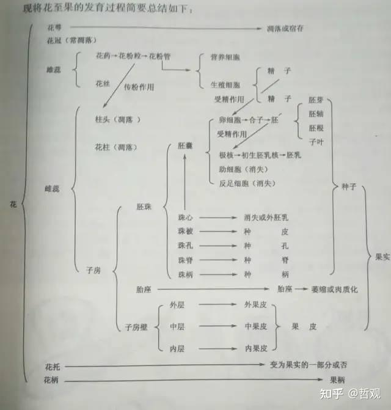
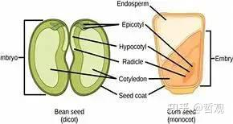
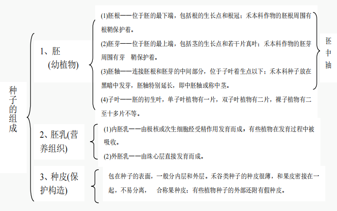
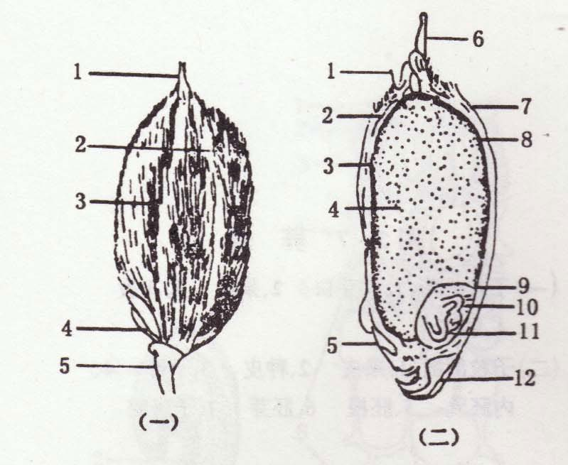
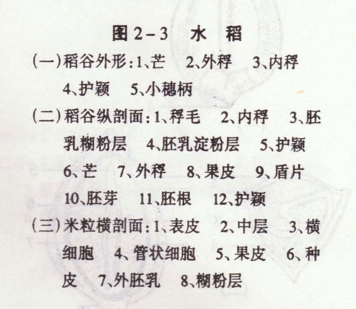
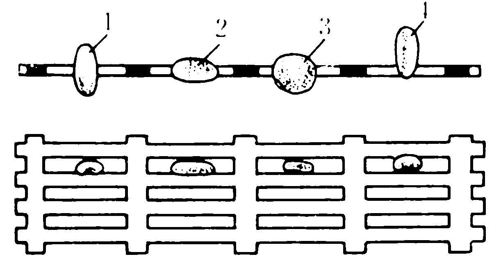
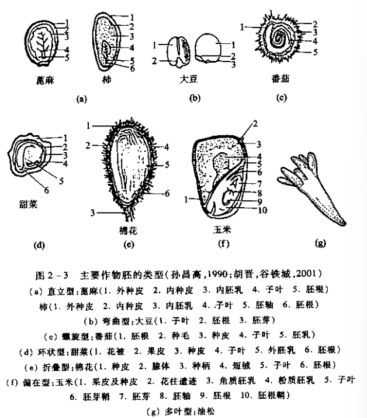

## 一、一般形态
#### 1. 外部形状
 1. 外形
 2. 色泽：种子因含有各种不同的色素，往往呈现不同的颜色及斑纹
 3. 大小→常用平均长、宽、厚以及干粒重来表示
#### 2. 基本构造 #学科链接 植物学

- 种被：起保护作用，成熟后细胞死亡，内含物消失，只留下细胞壁。由果皮和种皮组成 #易混淆 
	- 果皮：由子房壁发育而成→外果皮，中果皮及内果皮
	- 种皮：外珠被发育成外种皮(厚且坚韧)，内珠被发育成内种皮
		- 种皮细胞不含有原生质，细胞都是死亡的
		- 发芽口：由  ==珠孔==  发育而来
			- 胚根细胞吸水膨胀，从这个孔里伸出来
		- 脐：种子成熟后从珠柄上脱落时的疤痕
			- 瘦果只能看到果脐
		- 脐褥或脐冠 有些植物的种子，从珠柄脱落时，珠柄的残片附着在脐上，这种附着物称为脐褥或脐冠，如蚕豆、扁豆等
		- **脐条**：又称种脊或种脉，它是倒生或半倒生胚珠从珠柄通到合点的维管束遗迹(怎么那么难记...😵)
- **胚Embryo**：种子最重要的部分，由 ==受精卵== 发育而成 #重点 
- 
	- **胚芽Plumule**：长成地上部分，叶、茎的原始体，位于胚轴上端，它的顶部就是茎的生长点
	- **胚轴Hypocotyl**：连接胚芽和胚根的过渡部分
	- **胚根Radicle**：地下部分
		- 萌发时  ==首先突破种皮==  ，形成主根，固定植株并吸收水分和矿物质
		- 部分植物(单子叶)的胚根发育为初生根，随后产生侧根构建根系[[Chapter1 植物养分吸收]]
	- **子叶Cotyledon**→贮藏器官👉植物分类的重要依据
		- 双子叶植物：
			- 胚芽在两片子叶之间，子叶起  ==保护作用==  ，子叶肥厚用于储存营养物质
		- 禾本科植物→只有一片子叶称为**盾片**：
			- 在发芽时能够分泌酶，使胚乳中的养料迅速分解→起到 ==养分传递== 的桥梁→能够给胚利用
- **胚乳Endosperm**：贮藏营养
	- 外胚乳：珠心层细胞直接发育
	- 内胚乳：**受精极核细胞发育**→两者  ==DNA不同==  
	- 一般认为胚乳细胞是死的，糊粉层是活的
- **多胚现象**：一个种子里包含着两个及以上的胚 
	- 由于受精卵裂生形成
	- 一个胚珠中有两个胚囊
	- 助细胞和反足细胞也发育成了胚
- **复粒**：在同一个花内，由两个及以上的子房发育而成
- 无胚现象：外部正常内部却缺少胚

#### 3. 种子的植物学分类
 1. 有无胚乳→可以理解为单双子叶？不可以🤬
	- **有胚乳种子（Endospermic Seeds）**：种子内含有胚乳（储存营养物质）
	    - 内胚乳发达：禾本科、大戟科、蓼科、伞形科、茄科
	    - 胚乳、子叶均发达： ==蓖麻==  #考过 、黄麻
	- **无胚乳种子**：胚发育过程中胚乳被吸收， ==营养转移至子叶储存== ，种子成熟后胚乳退化
		- 大多双子叶植物都这样e.g.豆科、油菜、瓜类(葫芦科)、棉花
			- 例外：胡萝卜、莲、柿子
		- 胚乳的营养转移到了子叶中
2. 植物形态学
	- 包括种子及果实的一部分(内果皮)：如蔷薇科的桃、李、梅等
	- 包括种子的全部：十字花科的油菜，蔷薇科的苹果(?)、大豆
## 二、主要作物种子的形态结构
#### 1. 农作物种子
- 水稻
	-  
	- **长孔筛**的原理 #考过 
		- 长孔筛的筛面由许多平行的长孔组成，孔的宽度和长度可以根据需要进行调整
		- 筛选原理：
			1. 按种子宽度筛选：种子在筛面上振动或流动时，宽度小于孔宽的种子会通过长孔落下，而宽度大于孔宽的种子则被截留在筛面上
			2. 按种子长度筛选：对于一些长形种子，长孔筛还可以根据种子的长度进行筛选。长度小于孔长的种子可以通过长孔落下，而长度大于孔长的种子则被截留
		- 应用场景：常用于种子清选、分级和纯度分析
			- 通过使用不同孔径的长孔筛，可以将种子按大小和形状进行分类，去除杂质和异种种子，提高种子的纯度和质量
## 三、实验部分
#### 1. 绘图

----
#### Reference
- [学会植物生理学“种子”，看这一篇就够了！ - 知乎](https://zhuanlan.zhihu.com/p/596078106)
- [【植物学笔记】种子与果实 - 知乎](https://zhuanlan.zhihu.com/p/571281429)