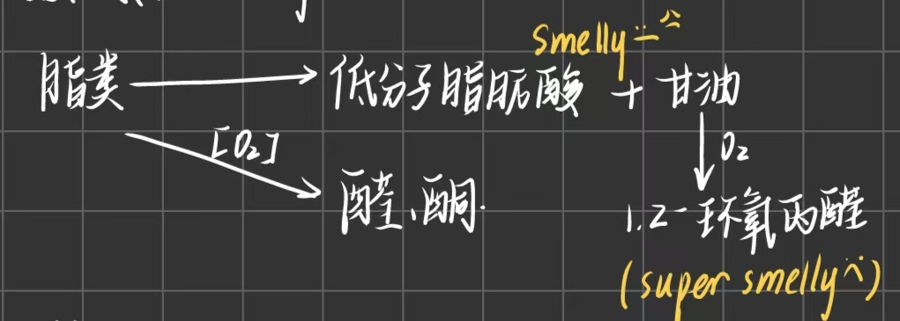

## 一、化学成分及其分布
#### 1. 主要化学成分的生理作用
- 生命活动的基质→蛋白质  
- 生命活动的能源→淀粉、脂肪，蛋白质有时也可以作为能源  
- 生理活性物质→酶、维生素、激素  
- 生命活动的介质和生化变化的参与者→水
#### 2. 主要作物种子的化学成分^700131
- 分类：
	- 粉质种子：大部分 ==化学成分在胚乳内== ，主要成分是淀粉e.g.水稻、小麦、玉米、豌豆
	- 蛋白质/油质种子：大部分化学成分 ==在子叶中== ，脂肪含量高，蛋白质含量也较高
		- e.g.芝麻、向日葵、油菜籽、花生、大豆
1. 禾谷类
	1. 贮藏物质：淀粉70%，蛋白质10%，脂肪1-3%
	2. 比较水稻、小麦、玉米
		- 淀粉差异较小(但是水稻最大→怪不得GI值那么高呢🤔)
		- 蛋白质： ==小麦== >玉米>水稻
		- 脂肪：玉米(胚较大，含油高)>小麦>水稻
2. 豆类：
	1. 类型：
		- 蛋白质高，糖类也高：豌豆、菜豆、蚕豆、绿豆
		- 蛋白质高，脂肪也高：大豆、花生(大豆蛋白质高，花生脂肪高)
#### 3. 分布
1. 禾谷类
	- 水稻
		- 米粒75~80%中的胚乳有**糊粉层和淀粉层**
		- **稻米油**：来源于稻谷加工过程中产生的**米糠**(稻谷脱壳后依附在糙米上的表面层)和**米胚**，含油量高但保质期较短
- 各部分化学成分[[Chapter2 种子的形态构造和分类]]
	- 胚：没有淀粉；大多蛋白质、脂肪、可溶性糖( ==生命活性物质丰富== )→但是难以保存
	- 胚乳：包括 ==全部淀粉== ，蛋白质相对含量低，脂肪少
		- 糊粉层：类似胚
		- 淀粉层
	- 果种皮：只有纤维素含量高
## 二、种子水分
#### 1. 水的存在状态[[Chapter1 Water in Plant]] #重点 
- **自由水**：细胞内可以自由流动的水，能够溶解物质、参与化学反应等
	- 可以作为溶剂
	- 0℃可以结冰
	- 容易蒸发、结冰等
	- 会直接影响细胞的代谢活动，引起强烈的生命活动
- **束缚水**：与细胞内的其他物质相结合或吸附在细胞结构上的水，流动性较差
	- 多以结合态存在
	- 较高的冰点，难以结冰
	- 对代谢的影响相对比较间接，主要维持细胞结构与环境稳定性
	- 不能引起强烈的生命活动
#### 2. 种子临界水分 #名词解释 
- **临界水分**：当种子中游离水刚去尽， ==留下全部结合水== 时的水分，其含量因作物种类而不同。
	- 种子水分减少到无游离水时，种子内的酶类首先是水解酶类就成钝化状态，新陈代谢降至很微弱的程度。
	- 大于临界水分：种子中出现游离水，种子不耐贮藏，种子活力和生活力很快降低和丧失
	- 小于临界水分：一般认为可以安全贮藏
- **安全水分**：种子安全贮藏的水分。安全水分受温度的影响而不同，各地区有差异。
	- 禾谷类种子的安全水分一般为12-14%以下，油料作物种子为8-10%，甚至更低，取决于其含油量。
		- 原因： ==淀粉容易吸水== 而油脂是疏水的
- **种子亲水性**
	- 种子分子组成中有大量的亲水基
		- 羟基(-OH)，醛基(-CHO)，基(-SH)氨基( -NH,),羧基(-COOH)
		- 蛋白质含有 -NH,，-COOH， ==亲水性最强== ；脂肪不含亲水基，所以表现疏水性。
	- 一粒种子中有许多孔隙，相连成很多孔道，称**毛细管**，它纵横交错，布满种子，扩大了吸附面积可以吸附许多水。
		- 吸附在面上的是**吸附水**，多了就可以流动，成**自由水**

#### 3. 种子平衡水分及其影响因素
- **平衡水分**： 如果将种子放在固定不变的温度和湿度条件下，经过相当时间，则种子水分保持在一定水平，基本上稳定不变，此时 ==种子对水汽的吸附和解吸作用以同等的速度进行着== ，亦即达到动态平衡状态。这时种子所含的水分为种子在该特定条件下的平衡水分，此时的相对湿度称平衡相对湿度。 #名词解释  #重点 
	- 种子水分随着吸附与解吸过程而变化。当吸附过程占优势→则种子水分增高；当解吸过程占优势→则种子水分减低
	- 由于种子具有吸湿性，所以能将种子水分调节到与任一相对湿度达到平衡时的含水量。
- 影响因素
	1. 湿度：种子水分随大气相对湿度改变而变化，当温度不变时，种子的平衡水分随相对湿度的增加而增大，与湿度呈 ==正相关== 。
		- 当外界湿度高时，显然产生的水汽压高， ==水汽浓度大，水分子容易进入种子== ，所以种子的平衡水分高。
		- 在相对湿度较低时，平衡水分随湿度提高而缓慢地增长，而在相对湿度较高时，平衡水分随湿度提高而急剧增长，因此在相对湿度较高的情况下，要特别注意种子的吸湿返潮问题
	2. 温度：当湿度不变时，种子的平衡水分随温度升高而减小，成 ==反相关== 
		- 因为当温度升高时**空气的保湿能力增加**，在一定范围内，温度每上升10℃每公斤空气中达到饱和的水汽量约可以增加一倍，使得相对湿度变小，从而使种子的平衡水分减小(表1-6)。但总的来说，温度对种子平衡水分的影响远较湿度为小。
	3. 种子化学物质的亲水性
		- 蛋白质和淀粉含量高的种子比油分含量高的种子 ==容易吸湿== →在相同的温湿度条件下具有较高的平衡水分
			- e.g.禾谷类和蚕豆种子比大豆、向日葵等种子具有较高的水分[[#^700131]]
	4. 种子的部位与结构特性
		- 种子胚中水分较高，因为与胚乳比较， ==胚含有较多的亲水基(protein)== 更容易吸收水分和保持水分→胚部较其它部位容易变质的一个重要原因[[Chapter8 种子寿命]]
		- 种子的胚所占整个籽粒的比例较大者平衡水分也高
			- e.g.水稻种子胚比较小而玉米胚比较大
		- 凡种子表面粗糙、破损，种子内部结构致密、**毛细管多而细**，种子平衡水分高。因为种子增加了与水汽分子接触的表面积。
## 三、种子的营养成分
#### 1. 糖类
- 可溶性糖→可以反映种子的生理状况
	- 发芽时比较多，充分成熟的种子，可溶性糖含量少
		- 主要 ==以蔗糖形式存在== ，主要在胚和糊粉层。
	- 如果可溶性糖多，说明生理状态不正常
	- 自制麦芽糖wow
- 不溶性糖
	- **淀粉**：以淀粉粒形式存在于胚乳
		-  ==直链淀粉呈蓝色，支链淀粉呈红棕色== →遇碘产生红棕色(糯性种子中大多数都是)
			- 马铃薯一般是单粒淀粉
		- 淀粉粒加热时会逐渐膨胀开裂，形成均匀糊状→”糊化“→胶体状态
			- 可以将淀粉作为崩解剂在制作药剂时加入，其会在胃肠液中溶胀，可以碎裂更容易吸收
			- 糊化后若胶体溶液降温→淀粉分子会重新排列成更紧密的晶体结构而发生沉淀→”**老化**“
				- 直链淀粉更容易老化👉抗性淀粉
		- **抗性淀粉**：又称抗酶解淀粉、难消化淀粉， ==在小肠中不能被酶解== ，但在人的肠胃道结肠中可以与挥发性脂肪酸起发酵反应 #考过 
			- 可以利用难以消化的性质来 ==增强饱腹感== hhh
			- 可以被肠道菌群发酵→SCFA→抑制有害菌的生长， ==促进肠道健康== ；
			- 在体内消化缓慢，具有一定的瘦身效果
			- 存在于马铃薯、香蕉🍌🏃‍
	- 纤维素和半纤维素
		- 成分：六碳糖，存在于细胞壁中→保护作用
		- 不同点:纤维素不易消化吸收，半纤维素在发芽时可以被水解利用
	- 果胶
- **低碳水饮食** #考过 
	- 概念：是一种以 ==高蛋白，高脂肪和大部分蔬菜== 为主的饮食结构，并且 ==严格限制碳水化合物的摄入== e.g.高糖水果，大米，白面，糙米，红薯，马铃薯
		- 生酮饮食是不太健康滴
		- 不利：可能造成低血糖导致昏迷，摄入碳水过少导致肾脏排水，造成尿频便秘；由于酮体只能通过呼吸系统排出，会口臭
#### 2. 脂类 #学科链接 生物化学
- 脂肪
	- 成分：脂肪酸(决定性质)+甘油
		- 重要脂肪酸：饱和脂肪酸/不饱和脂肪酸→亚油酸、亚麻酸
		- 油菜脂肪中的芥酸会使冠状动脉硬化:O!
	- 性质指标 #重点 
		- **酸价**：中和1g脂肪中全部游离脂肪酸所必需的KOH毫克数
		- **碘价**：100g脂肪吸收碘的克数
			-  ==酸钾低、碘价高说明品质好== 
	- **酸败**：种子在贮藏过程中，由于脂肪变质产生醛酮、酸等物质，产生不良的气味和滋味，使种子品质降低，称为酸败 #名词解释  #考过 
		- 对种子品质造成严重影响→由于脂肪的分解，脂溶性维生素无法存在，并导致细胞膜结构的破坏，而且脂肪的很多分解产物都对种子有毒害作用
		- 包括水解和酸化两个过程
		- 影响因素
			- 内因：种皮状况、脂肪成分
			- 外因：水分高、温度高、光照强、氧气充足(因此保存食用油的时候需要密封、小口容器且避光)
		- 过程：
			1. 氧化酸败： 油脂中的不饱和脂肪酸在氧气的作用下发生 ==氧化反应== ，生成过氧化物（peroxides）。这些过氧化物进一步分解为**醛类（如丙烯醛）、酮类和低级脂肪酸**（如乙酸、丁酸）等挥发性物质。这些物质具有特殊的气味和味道，使油脂产生酸败味
				- 聚合阶段：油脂中的不饱和脂肪酸在氧化过程中还会发生 ==聚合反应== ，生成**高分子聚合物**
				- 这些聚合物会使油脂的黏度增加，颜色变深，进一步影响油脂的品质。
			2. 水解酸败：油脂在微生物或酶的作用下发生 ==水解反应== ，生成**甘油和脂肪酸**。脂肪酸进一步氧化生成挥发性酸，使 ==油脂的酸值== 升高
	-  ==种子中磷脂含量比营养器官高== 
	- 卵磷脂/脑磷脂：优良的**乳化剂**，使血管中的胆固醇和中性脂肪乳化而排出，防止其沉淀于动脉血管上
		1. 健康：改善和预防动脉硬化，高血压，心脏病和脑中风； 防治胆结石
		2. 智慧：增强脑部活力神经系统的健康，增强记忆，延缓脑细胞老化硬化； 
		3. 美容：具有保护皮肤，克制老人斑，控制体重的作用
		4. 强壮：增强体内分泌系统对过滤性病毒的抵抗力，促进脂溶性维生素吸收的作用
#### 3. 蛋白质
- 种类：种子中大部分蛋白质是**贮藏蛋白质**→以糊粉粒和蛋白体状态存在(复合态如核蛋白、脂蛋白)
- 贮藏蛋白质分类
	- 清蛋白、球蛋白、醇溶蛋白、谷蛋白→面筋的重要成分(想吃烤面筋。)
- 氨基酸组成→8种人体必需氨基酸
	- 禾谷类的赖氨酸含量很低→所以经常吃素需要补充， ==稻米中赖氨酸含量较高== 
	- 玉米种子缺乏**赖氨酸、色氨酸**→现在转基因玉米很需要
	- 豆类种子：**缺乏蛋氨酸**，但是赖氨酸含量丰富
- 补充措施：选育优良品质、缺啥补啥
## 四、种子生理活性物质
#### 1. 酶
- 特征：种子内的生化反应可以由种子本身所含的酶控制
- 类别
	- 氧化还原酶、转移酶、水解酶、裂解酶等
- 种子发育过程中有些酶会与蛋白质结合→**酶原**→贮存在种子中
#### 2. 维生素 #学科链接 生物化学
- 水溶性：维生素A/E(生育酚)
- 脂溶性：维生素B/C
- 缺乏维生素会引起酶的合成受到影响
#### 3. 激素[[Chapter6 Plant hormones]]
- IAA促进萌发种子的生长
- GA：种子中含量很高，合成部位为胚
	- 促进生长、细胞伸长，促进种子萌发；加速非休眠种子萌发
- CK：促进细胞分裂，抵消ABA的作用
- ABA： ==抑制== 种子发芽[[Chapter6 种子萌发]]
	- 光信号通过调控ABA和GA生物合成调控种子的休眠与萌发
- Eth：促进果实成熟，调控种子休眠和发芽，在胚中合成
#### 4. 矿物质
#### 5.其它
- 花青素
- 虾青素：具有很强的抗氧化能力→ ==抵抗癌症== 
- 儿茶素：在茶树中广泛存在→通过合成生物的技术改良→Tea rice
#### 6. 毒素和特殊化学成分
- **硫葡萄糖甙**：在各种类型的油菜种子中普遍存在
	- 它在完整的细胞中不会变化，但在细胞破碎的情况下，种子中的芥子酶能将它分解而 ==产生芥子油== (异硫氰酸酯)、恶唑烷硫酮等有毒产物
	- 食用后，使 ==甲状腺肿大== 。未经处理的菜籽饼作为饲料，容易造成家畜中毒死亡→油菜育种的一个重要目标是降低其含量，以便充分利用油菜蛋白质。
- **单宁**:多酚类，在高梁、棉、油菜等种子中含量较高
	- 影响种子的透性，并具有杀菌作用；单宁含量高的种子抗穗发芽，还能减少种子发霉，但具涩味→ ==抗鸟害== 
	- 可以与蛋白质、酶中的氨基结合，成为不溶复合物使蛋白质变性
	- 容易氧化→耗氧促使种子萌发时缺乏氧气而陷入休眠状态
- **棉酚**：棉花种子中的黑色腺体中→有毒
- 植物碱、凝血素、蛋白酶抑制剂等
-----
- References
	- [Plant-made vaccines and therapeutics | Science](https://www.science.org/doi/10.1126/science.abf5375)