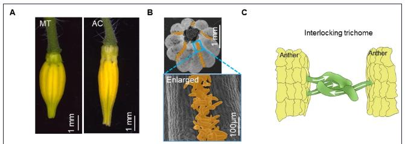
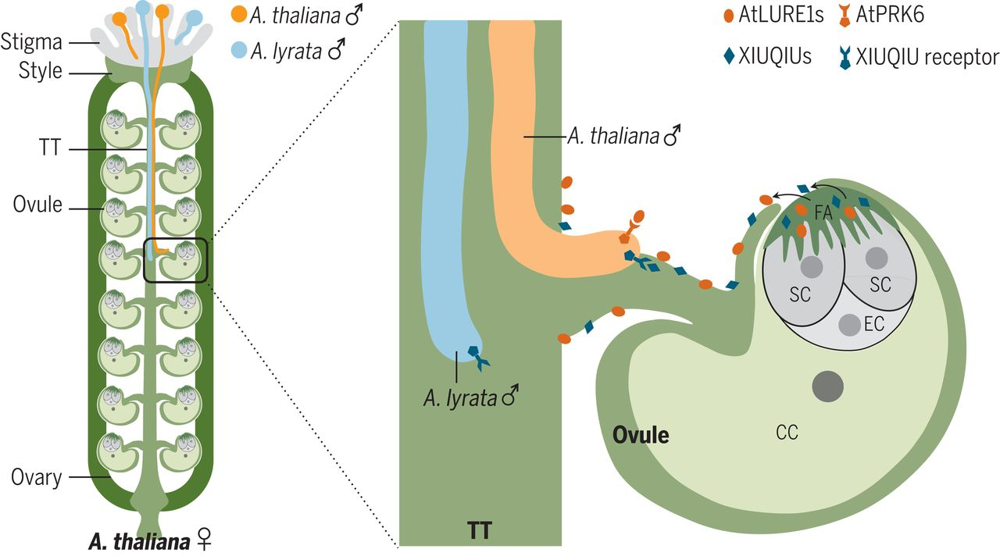
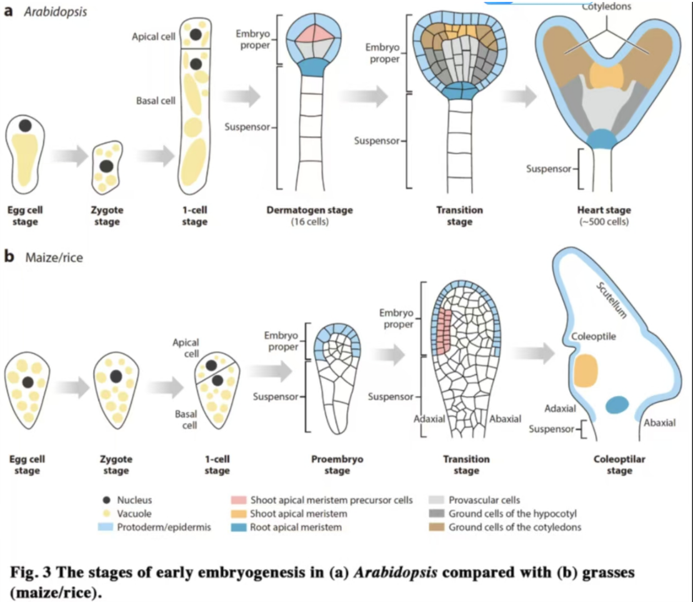
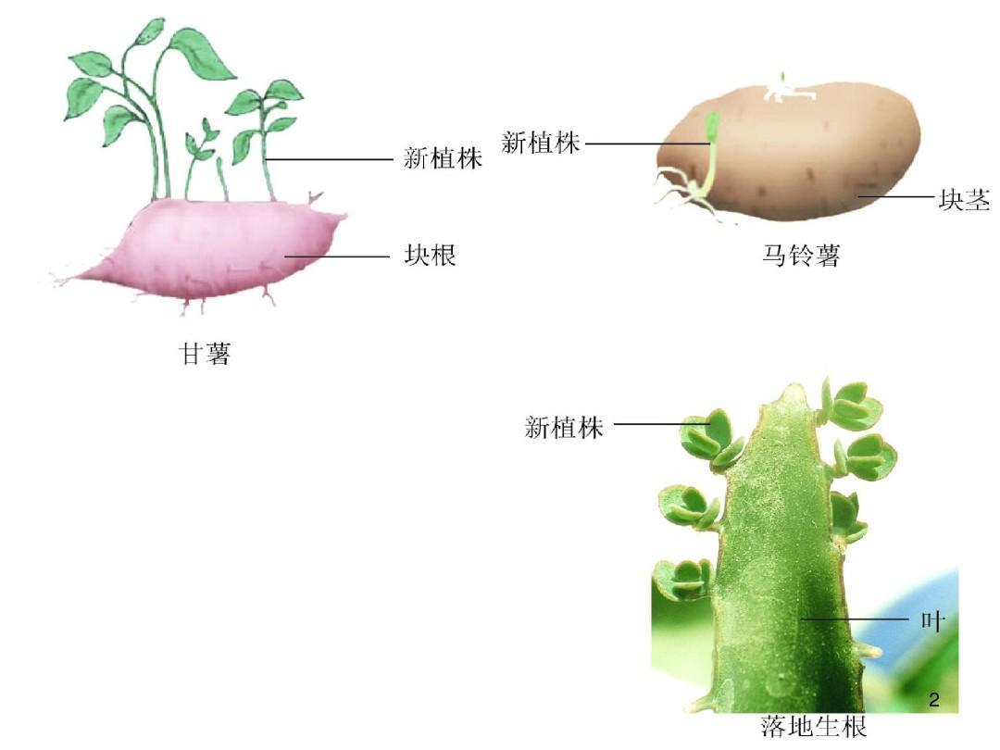
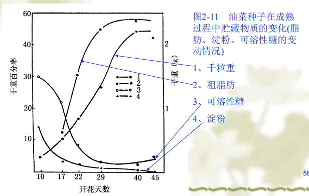

- 种质资源：又称为遗传资源，指生物体亲代传给子代的 ==遗传物质==  #重点 
	- e.g.种子、扦插的花束、果实等
## 一、种子形成发育的一般过程
#### 1. 受精作用
- 被子植物受精过程：当花粉粒传到雌蕊的柱头上后，开始萌发，长成花粉管从柱头钻进花柱，由珠孔穿过珠心层而进入胚囊。这时花粉管的先端破裂，两个精核(雄配子)就先后滑到胚囊中“**双受精现象**” #重点  #考过 
	- 一个与珠孔附近的 ==卵细胞(雌配子)== 融合在一起→合子→胚
	- 另一个精核与胚囊中部的 ==两个极核(或次生细胞)== 融合在一起→原始胚乳细胞→胚乳
		- 胚乳的染色体倍性一般为三倍体
		- **核型胚乳(nuclearendosperm)**： #课后拓展 
			- 主要特征是初生胚乳核的第一次分裂和以后的多次分裂，都不伴随着细胞壁的形成，故胚乳细胞星流离状态;胚乳发育到一定阶段，胚乳细胞核才被新形成的细胞壁所分割而形成胚乳细胞
			- 被子植物中最普遍的胚乳发育形式
	- **花粉管**：装载精细胞(没有鞭毛)，负责控制运动方向与信息交流
- 自花授粉：同一朵花中，雄蕊的花粉落到雌蕊的柱头上
	- e.g.豌豆、大豆、花生(偶然由蓟马传粉导致异花授粉)
	- 闭花受精(Cleistogamy)：是一种自花授粉，依赖于柱头封闭花结构的形成
	- 番茄花发育出一种形态特征，称为“花药锥”，其中五个花药连接在一起，在花柱周围形成一个中空的管状锥体
	- 优势：不依赖传粉媒介、后代较为一致
- 异花授粉：异株、异花及不同无性系之间的授粉[[#^4da946]]
	- e.g.蚕豆
	- 优势：保持隐形突变( #一些疑问 )、重组概率高
#### 2. 植物生殖调控
1. 花粉管的生长→在雌蕊中[Tip-localized receptors control pollen tube growth and LURE sensing in Arabidopsis | Nature](https://www.nature.com/articles/nature17413)
	-  ==引导肽LURE== 由胚珠产生，引导花粉管到达卵细胞
		- LURE在不同植物间有差异→产生生殖隔离
		- 存在受体用于感受LURE，引导花粉管生长到雌蕊中的某个位置
		- 通过抑制每个激酶受体的功能，发现pollen-specific receptor-like kinase 6  ==(PRK6)受体== 最重要
			- 若引入PRK6受体，能够对不同物种的花粉管产生吸引力→突破生殖隔离
2. 从结构生物学角度理解PRK6与LURE的结合→参考文献Nature Communication
3. 植物的纯系遗传[Cysteine-rich peptides promote interspecific genetic isolation in Arabidopsis | Science](https://www.science.org/doi/10.1126/science.aau9564)
	1. “同种花粉优先”：一种植物的花粉在与其他物种花粉的竞争中“胜出”的现象
	2. “同种精子优先”：存在于动物中
4. 确保只有一个精子结合→与动物类似，但是机制不同
	- 采用单细胞测序→两个只在卵细胞特异表达的天冬氨酸蛋白酶ECS1和ECS2阻止多精入卵
		1. 在受精前，ECS1和ECS2主要分布在卵细胞内
		2. 而当精细胞与卵细胞融合后，ECS1和ECS2则迅速分泌在卵细胞周围，降解其附属细胞(助细胞)分泌的花粉管吸引信号LURE，从而 ==阻止输送更多精子的花粉管进入胚囊== ，避免受精卵再度与精子融合
		3. 只有在受精成功时卵细胞才会释放ECS，阻止多余花粉管进入而受精成功后又可迅速阻止多余精细胞进入胚囊
	- 意义：保持后代的遗传稳定性，充分利用雄性资源
5. 第一次受精失败后，如何让第二根花粉管“补偿”？ #待解决 
6. 开花6-7小时后花瓣会再次闭合，使得花药与柱头再次接触，并实现对柱头中央区域的授粉
#### 3. 传粉过程
- **风力传粉** ^4da946
	- 风媒花：花小而不鲜艳，没有香味/蜜腺，花粉数量多而轻
	- 大部分禾本科+杨树、桦木→引起过敏T T
- **昆虫传粉**：昆虫寻找一般是靠嗅觉
	- 有些植物如大豆、花生、豌豆等通常自花授粉，但是通过虫媒能够异花传粉
	- 意义：大多数开花植物依靠昆虫进行繁衍→可以 ==加速进化== 
#### 4. 种子的发育

- 有图，但是不需要记忆[[03 Subjects/2025春夏/Seed Biology🌱/Chapter1 绪论|Chapter1 绪论]]

## 二、异常现象
#### 1. 多胚现象polyembryony
- Concepts：是指在同一个胚珠中产生了两个或者两个以上的胚的现象
1.  可能是由于受精卵裂生形成→**裂生多胚现象 (cleavage polyembryony)**：由受精卵产生2个或多个独立的胚，2N(可以理解为同卵双胞胎吗🤔)
2. 一个胚珠中有两个胚囊而出现了多胚→**假多胚现象**(比较少见)
3. **无融合生殖(agamospermy)**：胚珠组织直接进行胚发育而形成种子 #考过 
	- 单倍体配子体无融合生殖
		- 孤雌生殖：卵细胞不经受精直接发育成个体，但 ==极核细胞仍然需要受精== 才能发育为胚乳
		- 孤雄生殖：卵核在精子入卵后发生退化和解体
	- **二倍体无融合生殖**：由二倍体配子发育而成
	- **不定胚**：不经过配子阶段直接由珠心/珠被的二倍体细胞发育成胚
		- 完全继承了 ==母体的全部基因型== 
		- 柑橘(芸香科)中很常见😋
		- 在水稻中建立无融合生殖→ ==保留杂种优势== [Clonal seeds from hybrid rice by simultaneous genome engineering of meiosis and fertilization genes | Nature Biotechnology](https://www.nature.com/articles/s41587-018-0003-0)
			- 将参与水稻减数分裂的三个基因同时突变→减数分裂转变为类似有丝分裂的过程→得到无融合生殖
	- 意义 #考过 
		- 理论：
			- 使得子代基因型与母本高度一致，为研究物种遗传稳定性提供了独特的模型👉可以培育 ==无病毒苗木== 
			- 解析相关基因及调控网络可以解释生殖发育的分子基础
		- 生产应用：
			- 能够固定杂种优势，简化育种流程
			- 加速优良品种的推广
		- 进化意义：
			- 可以迅速扩大种群，保持优势性状稳定传递e.g.蒲公英
			- 维持濒危物种的遗传稳定性
#### 2. 无胚乳种子[[Chapter2 种子的形态构造和分类]]
#### 3. 无性种子

- 可以理解为营养繁殖
- e.g.落地生根、红薯块根、莲藕的变态茎
## 三、种子的成熟
#### 1. 阶段与特征
- **种子年**：种子成熟期间气候条件特别良好，种子品质大大好于平常的年份 #重点 #名词解释 
- 特点 #重点 
	- 养分输送已经停止→干重不再增加
	- 种子含水量减少→硬度增高
	- 种皮坚固
	- 种子具有较高发芽率
- 不同作物的成熟
	- 禾本科
		-  ==青杆黄熟== ：水稻果实黄了，但是茎秆还是绿色的时候最利于收割
		- 青贮饲料👉回去看[[03 Subjects/2025春夏/Seed Biology🌱/Chapter1 绪论|Chapter1 绪论]]
	- 豆科：
		- 绿熟期:种子体积基本上已长足，含水量很高，内含物带甜味，至绿熟后期，种子体积达最大限度
		- 黄熟期
		- 完熟期
		- 枯熟期
#### 2. 成熟过程中的变化 #重点 
- 贮藏物质的累积
	1. 糖类
		- 来源：开花前累积，成熟时制造( ==禾谷类种子主要以成熟时制造为主== )→可溶性糖含量下降
		- 积累程序：
			- 积累在果皮中→临时
			- 积累在胚乳中→永久
				- 水稻在胚乳中从背部到腹部：首先累积得较充分，后来累积得就不充分，常为粉质
	2. 脂肪
		- 累积趋势：一开始先合成糖类，后续oil才逐渐上升
			- 
			- 大豆种子的积累速率相对均匀
			- 芝麻种子的脂肪在 ==受精后三周达到最高值== 
		- 性质变化：碘价酸钾[[Chapter3 化学成分]]
		- 脂肪的含量是随着可溶性糖分的减少而相应增加，表明脂肪是由糖分转化而来的
	3. 蛋白质
		- 来源：开花前吸收(贮藏在植株中)
		- 合成方式
			- **直接合成**：茎叶流入种子中的氨基酸直接合成
			- **间接合成**：氨基酸进入种子后，分解为出氨和酮酸，氨再与其它酮酸结合，形成新的氨基酸，再合成蛋白质
		- 变化：
			- 胚和胚乳的 ==游离氨基酸含量逐渐减少== ，但在充分成熟的种子内仍留存一定数量的游离氨基酸，特别在胚部仍留有多种高浓度的游离氨基酸。以供萌发时的最初阶段利用。
				- (未熟种子鲜，就是氨基酸多)
			- 分子量从小到大
			- 禾谷类种子**醇溶及谷蛋白质**增高，面筋品质改善。因此成熟不充分的种子，工艺品质(指面包烤制品质)较差[[Chapter3 化学成分]]
- 激素的变化[[Chapter6 Plant hormones]]
	- 一般在胚珠受精以后的一定时期开始出现，随着种子发育，其浓度不断增高，此后又逐渐下降，最后在充分成熟和干燥的种子中就不会发现这类物质
	- IAA含量增加
- 物理性变化
	- 大小：先增加长度→增加宽度→增加厚度
		- 水稻：黄熟期 ==体积达到最大== 
	- 重量与比重的变化
		- 重量：谷类作物种子的 ==鲜重== ，在乳熟后期达最高限度，到黄熟期鲜重逐渐降低，而到完熟期鲜重则更低。
			- 种子干重到完熟期最高
		- 比重：随着成熟度的提高而增大
	- 硬度和透明度：随成熟而提高→联系水稻种子
	- 热容量和导热率：随水分减少而降低→利于储存
	- 生活力变化/发芽力变化→不休眠的种子与生活力的变化是一致的
		- **蒸腾作用**：种子成熟的初期，随着养料和水分的大量流入，在种子表面进行的蒸腾作用，比叶面更为强烈，使种子中不溶解物质的浓缩度增加， ==促进了合成作用==  #考过  ^7545a0
		- **气体代谢**：种子还进行着旺盛的气体交换， ==吸收二氧化碳，依靠存在种子中的叶绿素制造部分有机物质== 。另一方面， ==吸收氧气== 以完成种子贮藏物质的转化
#### 3. 环境因素影响
- 对成熟期的影响
	- 湿度：
		- 天气晴朗，空气湿度较低→ ==蒸腾作用强烈== [[#^7545a0]]→对种子成熟有利
		- 雨水/气候干旱/盐碱→有机物积累和转化受阻→种子的成熟期会显著提早
			- 干旱时从植株内流往种子的养料溶液减少或中断，促使种子提早干缩而不能达到正常饱满度
	- 温度：
		- 适宜的温度促进光合作用与营养物质的运转
		-  ==低温延迟成熟期== →导致种子不饱满，但是适当的低温可以使品质提高(比如果果)
			- **晚稻**成熟期 ==气温较低== ，自抽穗至成熟所需时间长达36-44天，而早稻仅需25-30天
	- 营养条件
		- 施用磷肥→促进有机物质的运转及提早成熟
		- 施用氮肥→促进营养生长→ ==延迟成熟== 
- 对化学成分的影响
	- 湿度：影响蛋白质和淀粉的比率
		- 蛋白质含量:北方>南方，干>潮湿地区
		- 低湿下，淀粉的合成活动受到破坏，而蛋白质合成过程所受到的影响较淀粉为小
			- 北方小麦蛋白质含量明显高于南方
	- 温度：
		- 低温适宜油脂积累
		- 高温适宜蛋白质积累
			- 粉质种子(e.g.小麦)北方蛋白质高，油质种子北方蛋白质低 #易混淆 

## 三、学术前沿
#### 1. 多年生水稻
#### 2. 可以固氮的真核生物[Nitrogen-fixing organelle in a marine alga | Science](https://www.science.org/doi/10.1126/science.adk1075)
- 发现一个新型细胞器Nitroplast可以固定氮气
- 能够促进对植物的基因工程改造
#### 3. 相分离[[Chapter5 真核生物的转录]]
- 水合作用→种子休眠状态时相分离的小体全部消失，通常由水分调控
--------------
- References：
	- [【植物学笔记】种子与果实 - 知乎](https://zhuanlan.zhihu.com/p/571281429)
	- 