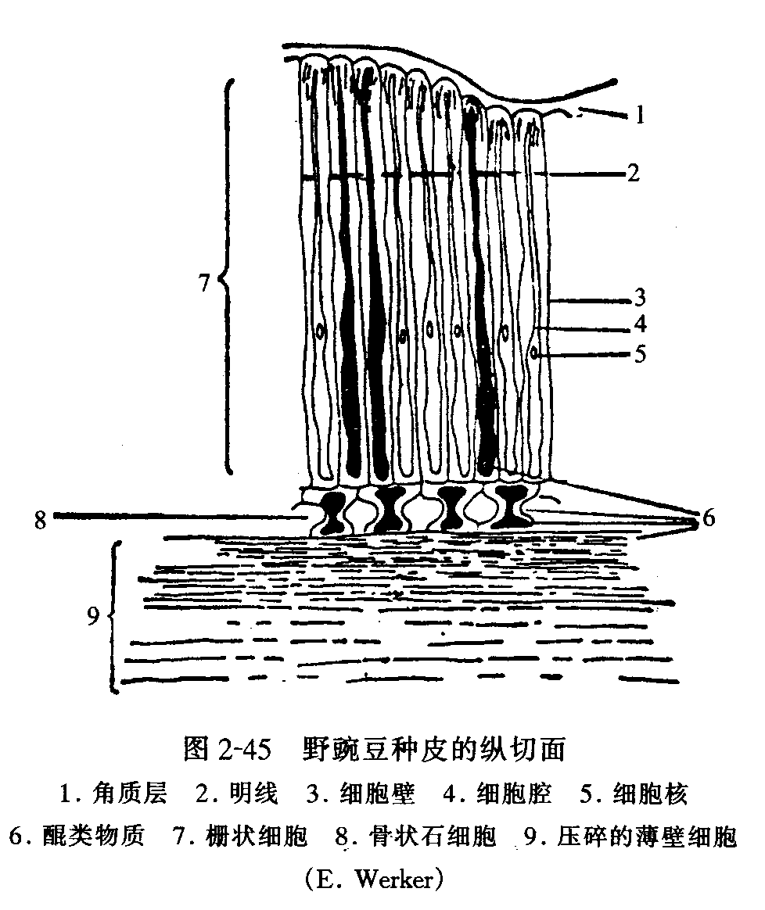
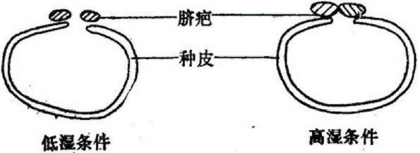
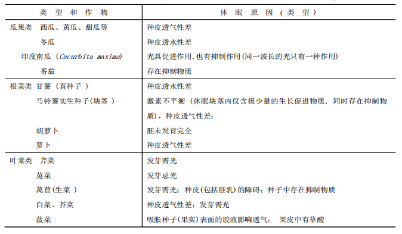

## 一、种子休眠的原因和机理
#### 1. Concepts
- **种子休眠**：种子本身是活的，给予 ==适当的发芽条件== 仍不发芽
	- 被动：种子具发芽能力，因缺乏发芽必需条件处于静止状态→强迫休眠
	- 自发：种子是活的，给以适宜条件也不发芽→自发休眠或生理休眠（本章内容）
- 研究种子休眠的意义 #考过 
	- 有利于延长种子寿命：利于延长保质期，方便贮藏和利用
	- 不利于播种：抵御不良环境，保障种群的延续
	- 不利于杂草去除
	- 不会发生穗发芽
	- 降低种内竞争：防止同种种子资源的抢夺
#### 2. 种子休眠的类型
1. **胚休眠(embryo dormancy)**
	- 种子从外表看，各部分组织均已充分成熟并已脱离母株， ==但内部的种胚在形态上尚未成熟== 
		- 不成熟的胚还需要从胚乳或者其它组织中吸收养料
		- 在主要农作物中不存在
2. 种子的种胚已充分发育，种子各器官在形态上已达完备，但因子叶或胚轴中 ==存在发芽抑制物质== ，而使胚的生理状态不适于发芽，即使发芽条件具备也不萌发
	- 只有去除子叶/除去抑制物质才可以发芽 ^5b8ea6
	- e.g.果树种子(桃子、苹果和梨子)、杂草种子
	- 完成**后熟**过程：在生产实践上可用**湿砂层积**(一层湿砂一层种子相间堆积)，将种子埋于地表或地下，保持10℃以下的有效温度👉[[Chapter8 Floral and reproductive physiology in plant]]
		- 不同植物的种子通过后熟所需的最适温度和层积时间并不一致
#### 3. 种子休眠的原因
1. 种皮的障碍
	- 种皮不透水→蜡质角质层
	- 种皮不透气
		- e.g.禾谷类作物、棉花
	- 种皮阻止抑制物质溢出👉将离体胚放入水中能促进抑制剂的流失，因而促进萌发
		- e.g.向日葵种子
	- 种皮减少光线到达胚部
		- 胚内光敏素(P)的活化型(Pfr)与钝化型(Pr)达到一定比例时，需光的完整种子便能萌发(即休眠被打破)[[Chapter7 Plant Growth Physiology]]
	- 种皮的机械约束作用→使胚不能向外伸展
2. 抑制物质的存在
	- 抑制物质：可以存在于种子的不同部位
		- 种类：ABA/酚类物质/香豆酸/儿茶酸
		- 种子发芽是否受到抑制决定于所含抑制物质的 ==浓度== 、种胚对抑制物质的 ==敏感性== 以及种子中可能存在的 ==拮抗性物质== 
		- 作用： ==没有专一性== →对其它物种种子也能产生抑制作用
		- 会发生转化：会转化、分解、挥发或淋失，逐渐消除其抑制作用而使种子解除休眠状态
3. 光
	-  ==红光(波长660nm附近)促进发芽== ；远红光(730nm)和蓝光(440和480nm附近)则起抑制作用
	- 种子根据光敏感型的分类：
		- 白光可以结束种子休眠
			- e.g.苋属、芥菜、莴苣(品种Grand Rapids)、烟草、芹菜等
		- 白光抑制发芽(可 ==使种子进入二次休眠== )
			- e.g.苋属的反枝苋(长时间照光)、鸡冠花、门氏喜林草、黍、落芒草等多种非休眠种子均可受抑制而不发芽
			- 作物中比较少见
		- **一般对白光不敏感**，但存在光敏素系统，对光有否反应 ==取决于温度→“喜光种子”== 
			- e.g.黄瓜、莴苣(品种Great lakes等)、番茄的某些品种和萝卜
		- 大部分农作物种子对光不敏感
4. 不良条件👉使种子产生二次休眠
	- **二次休眠**：原来不休眠的种子或已通过休眠的种子产生休眠，即使再将种子 ==移置正常条件== ，种子仍然不能萌发 #名词解释 
		- 诱导因素：光、温度、水分、氧气
		- 莴苣种子在高温下吸胀发芽，会进入二次休眠(热休眠)
		- 二次休眠解除的时间与休眠深度有关，休眠解除的条件在大部分情况下与一次休眠(primary dormancy)(原生休眠，即种子在植株上已产生的休眠)是一致的

#### 4. 休眠机理
1. 内源激素调控：**三因子学说** #考过 
	- 赤霉素(GA)、细胞分裂素(CTK)和萌发抑制物质脱落酸(ABA)相互作用于种子的休眠与萌发 #易混淆 注意与顶端优势的三种激素区分
		- 发芽的种子中均存在生理活性浓度的GA
		- 如果种子中同时存在GA和ABA→GA诱导萌发的作用就受到 ==阻抑== 
			- ABA的相关知识点[[Chapter6 Plant hormones]]
		- 而若GA、ABA和CTK三者同时存在→CK能起解抑作用而使 ==萌发== 成为可能
2. 呼吸途径论(磷酸戊糖途径)
3. 光敏素的调控
4. 膜相变化论
## 二、某些种子休眠的原因
#### 1. 豆类种子休眠的原因：硬实
- Concepts： ==种皮不透水而不能吸胀== 发芽并保持原来大小状态的种子称为**硬实**
- 意义：对植物界种的延续和传播极为有利
- 发生原因：
	- 缺乏透性的原因：
		- 种皮中某一层次的细胞壁含有较多的疏水性物质→**角质层**
			- 栅状细胞(在角质层以下)特别坚固致密，在显微镜下观察，可见其外端有一条特别明亮的部分，称为**明线**→具有特殊的物化成分
			- 
			- 栅状细胞内的**果胶质或纤维素果胶**形成的胶质特性
	- 特定部位或特殊的水分控制机制
		- **“种脐疤”** ：控制水分进出，起到阀门作用。
			- 当种子处于 ==干燥条件== 下，种脐收缩， ==通道打开== ，种子内部的水分可以逸出
			- 当种子处于潮湿条件，则种脐疤吸胀，将通道关闭，外界水分子于是难以进入
			- 实验方法：将碘蒸气混入干燥空气中，可以很容易使种子内部组织染色，而若将碘蒸气混入潮湿空气中，则种子内部组织很难染色，这就证明了“种脐疤”具有启闭的阀门作用
	- 影响因素：
		- 遗传
		- 成熟：种子愈老熟，则硬实发生的百分率愈高
		- 干燥条件
		- 环境条件：低温多湿条件下成熟的种子，含硬实很少或较少
#### 2. 油菜种子休眠
- 休眠深度分类：
	- 芥菜型：休眠期可达数月
	- 白菜型：休眠深度和种皮颜色有关
		- 黑籽品种较黄籽品种休眠期长,种皮中存在的色素影响种皮的透性
		- 休眠种子的透气性较差, 挑破种皮可以使之萌发
	- 甘蓝型
#### 3. 其它
- 禾谷类：种皮不透气
- 棉花：种皮不透气、硬实
- 向日葵：果皮中存在抑制物[[#^5b8ea6]]
- 蔬菜：休眠特性各异

## 三、种子休眠的调控
#### 1. 延长种子休眠期
- 品种选育
- 药剂调控
#### 2. 缩短和解除种子休眠期
- 种子处理
	- 化学物质，物理、机械方法处理，干燥处理等
- 改变种子发芽条件
	- 许多作物的休眠种子并非绝对不能发芽，而是其萌发温度不同于非休眠种子，而且发芽的温度范围偏狭
	- 大小麦和油菜种子经过 ==低温预措== 后再发芽(即将种子置湿润的发芽床上，保持8-10℃3昼夜，再移置20℃条件下发芽)；
	- 油菜用15-25℃变温发芽(每昼夜中15℃保持16h，25℃保持8h)；
	- 玉米、水稻用35℃高温发芽等都是有效的方法。
------
