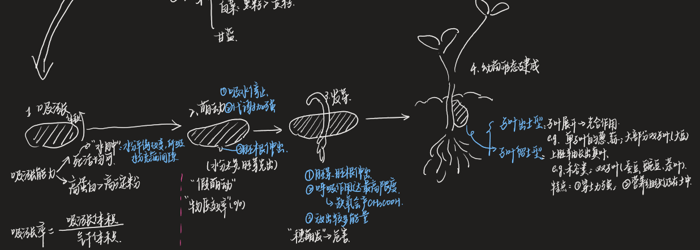
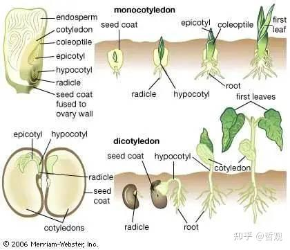
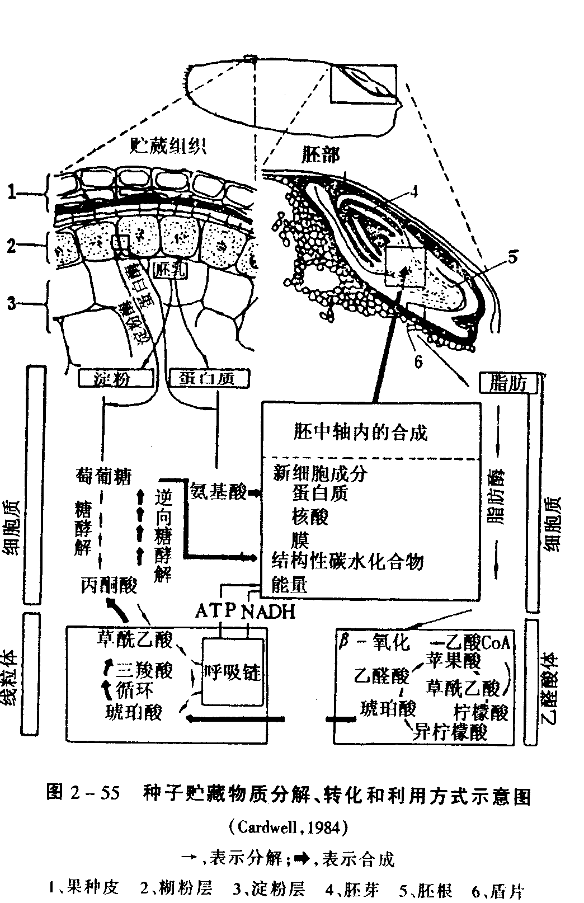
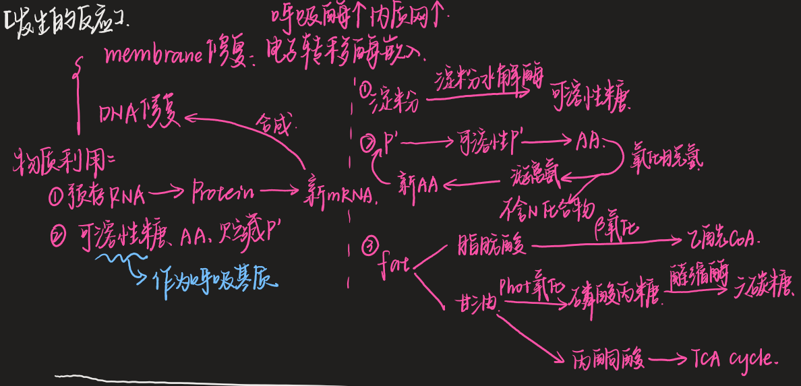
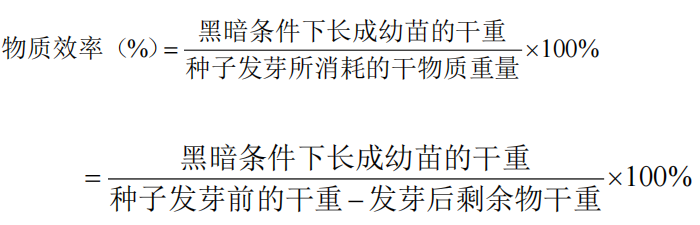

## 一、种子萌发的过程

#### 1. 吸胀阶段(imbibition)
- Concepts：种子萌发的起始阶段
	- 并非活细胞的一种生理现象，而是 ==胶体吸水体积膨大== 的物理作用→不论是活种子或是死种子均能吸胀
- 种子吸胀能力的强弱，主要决定于种子的**化学成分**
	-  ==高蛋白种子的吸胀能力== 远比高淀粉含量的种子为强
- **吸涨率**：种子吸水达到一定量时吸胀的体积与气干状态的体积之比
	- 伴随吸胀过程，种胚活细胞内部的蛋白质、酶等大分子和细胞器等陆续发生水合活化
	- **水肿状态**：死种子的水分平衡大大改变，所吸收的水分充满死种子的细胞间隙以及胚与胚乳的空间
#### 2. 萌动阶段(protrusion)
- Concepts:吸水虽然暂时 ==停滞== ，但种子内部的 ==代谢开始加强== ，转入一个新的生理状态；这一时期，在生物大分子、细胞器活化和修复基础上，种胚细胞恢复生长；当种胚细胞体积扩大伸展到一定程度，胚根尖端就突破种皮外伸
	- 俗称”**露白**“
- 绝大多数植物的种子萌动时，首先冲破种皮的部分是胚根
	- 当水分较少时，则胚根先出；而当水分过多时，则胚芽先出👉胚芽对缺氧的反应比胚根敏感性差(可以联系萌发实验的现象:O!)
- ”**假萌动**“：有些无生命力的种子在充分吸胀后，胚根也会因体积膨大而伸出种皮以外
#### 3. 发芽阶段(germination)
- Concepts:种子萌动以后，种胚细胞开始或加速分裂和分化，生长速度显著加快，胚根、胚芽伸出种皮并发育到一定程度
	- 我国和国际种子检验规程对发芽定义是当种子发育长成具备正常主要构造的幼苗才称为发芽
- 种子处于这一时期，种胚的新陈代谢作用极为旺盛， ==呼吸强度达最高限度== ，会产生大量的能量和代谢产物
	- 如果氧气供应不足，易引起 ==缺氧呼吸== ，放出乙醇等有害物质，使种胚窒息麻痹以致中毒死亡
- 能量的利用：种子发芽过程中所放出较多的能量
	- 其中一部分热量散失到周围土壤中；另一部分成为幼苗顶土和幼根入土的动力
#### 4. 幼苗的形态建成 (seedling establishment)

1. **子叶出土型(epigeal germination)**
	- 种子发芽时，其下胚轴显著伸长
	- 子叶迅速展开，见光后逐渐转绿， ==开始营光合作用== ，以后从两子叶间的胚芽长出真叶和主茎
	- e.g.单子叶植物中只有少数属子叶出土型，如葱蒜类等；90%的双子叶植物幼苗属子叶出土型，常见的作物有棉花、油菜、大豆、黄麻、烟草、蓖麻、向日葵和瓜类等
2. **子叶留土型(hypogeal germination)**
	- 上胚轴伸长而出土，随即长出真叶而成幼苗，子叶仍留在土中与种皮不脱离，直至内部贮藏养料消耗殆尽，才萎缩或解体
	- e.g.大部分单子叶植物种子属子叶留土型，如 ==禾谷类== ；小部分双子叶植物种子属子叶留土型，如**蚕豆、豌豆、茶叶**属于这一类型，后者的子叶一般较肥厚
	- 特点：
		- 留土型的种子发芽时，穿土力较强👉可以播得稍微深一点
		- 禾谷类种子如果没有完整胚芽鞘的保护作用，幼苗出土将受到阻碍
		- 留土幼苗的营养贮藏组织和部分侧芽仍保留在土中，因此一旦土壤上面的幼苗部分受到昆虫、低温等的损害，仍有可能重新从土中长出幼苗
## 二、种子萌发的生理生化变化
#### 1. 细胞的活化与修复
- 活化和修复在吸水的第一、二两个阶段进行
- **细胞膜修复**：正常的细胞膜中，磷脂和膜蛋白排列整齐，结构完整。
	- 当种子成熟和干燥过程中，由于种子脱水，磷脂的排列发生转向，膜的连续界面不再能保持， ==膜成为不完整状态== 
	- 吸胀一定时间以后，种子内修补细胞膜的过程完成，膜就恢复了正常的功能
	- 线粒体内膜的某些缺损部分重新合成，恢复完整， ==电子转移酶类被合成或活化并嵌入膜中== ，使氧化磷酸化的效率逐渐恢复正常
- **DNA修复**：DNA分子损伤的修复由DNA内切酶、DNA多聚酶和DNA连接酶来完成[[Chapter6 突变和突变修复]]
	- 干种子中缺损的RNA分子一般被分解，而由新合成的完整RNA分子所取代
	- 低活力的种子活化迟缓，修复困难
#### 2. 种胚的生长和合成代谢
- 种子萌发最初的生长在种胚细胞内主要表现：活化和修复基础上细胞器和膜系统的合成增殖
	- 修复时原有线粒体的部分膜被合成→呼吸酶数量增加，呼吸效率大大提高；
	- 接着细胞中新线粒体形成，数量进一步增加
	- 同时，细胞的内膜系统——内质网和高尔基体也大量增殖
- 种胚细胞具有很强的生长和合成能力
	- 小麦种子为例：吸胀30min即利用种子预存的RNA ==合成蛋白质== ；新RNA分子的合成在吸胀后3h开始，首先合成的种类是mRNA。在一定量的 ==新RNA积累== 的基础上，小麦种子中 ==DNA的合成== 于吸胀的第15h开始，在DNA复制后数小时，种胚细胞进行有丝分裂
#### 3. 贮藏物质的分解和利用👉与成熟区别[[Chapter4 种子的形成]]

1. 吸胀萌动阶段：生长先动用胚部或胚中轴(embryo axis)的可溶性糖、氨基酸以及仅有少量的贮藏蛋白
	1. 萌发代谢中一般首先利用的是种子中的淀粉和贮藏蛋白
2. 种子萌动后：贮藏组织(胚乳或子叶)中贮藏物质的分解
	- 淀粉：**淀粉水解酶**催化其水解为葡萄糖
	- 蛋白质
		1. 贮藏蛋白 ==可溶化== (非水溶性的蛋白不易直接水解成氨基酸)
		2. 可溶性蛋白完全 ==氨基酸化== 
		3. 氨基酸经过 ==氧化脱氨== 作用，进一步分解为游离氨及不含氮化合物→积累过多会使植物细胞中毒
		4. 游离氨直接进入 ==氨基化反应== ，和糖类所衍生的酮酸形成新氨基酸，再重新合成蛋白质
	- 脂肪
		- 脂肪酸在乙醛酸体中进行β-氧化→乙酰CoA #学科链接 生物化学
			- 在萌发过程水解产生的脂肪酸中优先被分解利用的一般是**不饱和脂肪酸**
				- 随脂肪水解，酸价逐渐上升而碘价逐渐下降
		- 甘油能在细胞质中迅速磷酸化→随后氧化为磷酸丙糖，在醛缩酶的作用下缩合成六碳糖，甘油也可能转化为丙酮酸，再进入三羧酸循环
#### 4. 呼吸作用和能量代谢
- 种子的呼吸基质在萌发初期一般主要是干种子中原来预存的 ==可溶性物蔗糖以及一些棉子糖类的低聚糖== 
- 物质效率：
	- 同一种类的作物品种，高活力种子、适宜条件下发芽种子，其物质效率较高

## 三、种子萌发的生态条件
#### 1. 水分[[Chapter3 化学成分]]
- **最低需水量**：发芽最低需水量是指种子萌动时所含最低限度的 ==水分占种子原重的百分率== 
	- 高蛋白种子需水量较高
- 影响种子水分吸收的因素
	- 种皮的透水性
	- 外界水分状态
	- 温度
- 种子的吸涨损伤和吸涨冷害
	- **吸胀损伤(soaking injury)**：种子吸胀速率快，细胞膜就无法修复而且出现更多的损伤， ==物质外渗加剧== ，种子发芽成苗能力下降
	- **吸胀冷害(imbibition chilling injury)**：有些作物干燥种子(水分12-14%以内，因作物而不同)短时间在零度以上低温吸水，种胚就会受到伤害，再转移到正常条件下也无法正常发芽成苗
		- 种子原始水分愈低，愈容易受到冷害
		- 导致吸胀冷害的温度界限是在15℃或10℃以下
#### 2. 温度
- 种子发芽温度三基点[[Chapter7 Plant Growth Physiology]]
	- 同一作物的不同亚种、类型甚至品种发芽的温度也会有所差异e.g.籼稻和粳稻
- 变温促进种子发芽
	- 种子发芽要求变温的作物往往是 ==喜温、休眠和野生性状较强== 的一些种类
	- 发芽试验常用条件：20-30℃或15-25℃，在低温下的时间是16h，高温下的时间是8h，一天为一个变温周期
	- 有利的原因：
		- 有利于氧气供应，促进酶的活动：变温使种皮胀缩受伤，有利于气体的交换；变温下，造成种子内外温差，促进气体的交换
		- 降低物质效率
			- 高温下，生化过程和呼吸作用都很旺盛，贮藏物质转化为可溶性物质
			- 低温下，物质消耗少，用于胚生长较多
		- 消除有毒的中间产物作用
#### 3. 氧气
- 氧气供应的影响因素
	- 限制氧气供应的主要因素是水分和种皮
- 不同作物种子萌发对氧气需要的差异
	- e.g.长期生长在水田的水稻比长期生长在旱地的麦类需氧少得多[[Chapter7 土壤酸碱性和氧化还原性]]
- 种子萌发过程需氧量的变化
	- 随着吸水量的增加，其需氧量也随之快速增加
	- 当种子胚根突破种皮时，其需氧量又急剧增加。如这一时期氧气供应不足，且又处于高温条件下，即种子会陷入 ==缺氧呼吸== ，产生酒精而杀死种子
#### 4. 其它
- 光[[Chapter5 种子休眠]]
- 二氧化碳：只有当发芽环境的二氧化碳增至相当高的浓度，才会严重抑制发芽
	- 对发芽的抑制作用与温度及氧的浓度有关
----
- References
	- [第三节 种子休眠与萌发：种子萌发(第一篇 第一章 种子生理 ) - 哔哩哔哩](https://www.bilibili.com/opus/383637448232872974)
	- [3分钟让你明白一颗种子生长的所有细节~_哔哩哔哩_bilibili](https://www.bilibili.com/video/BV1y7411N7s8/?spm_id_from=333.337.search-card.all.click&vd_source=cbeeb9b4a81ed17f43f1d0be32a9f270)