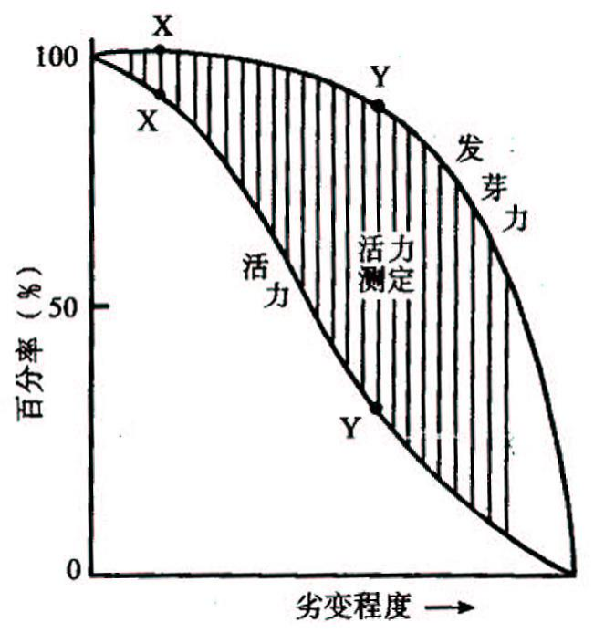
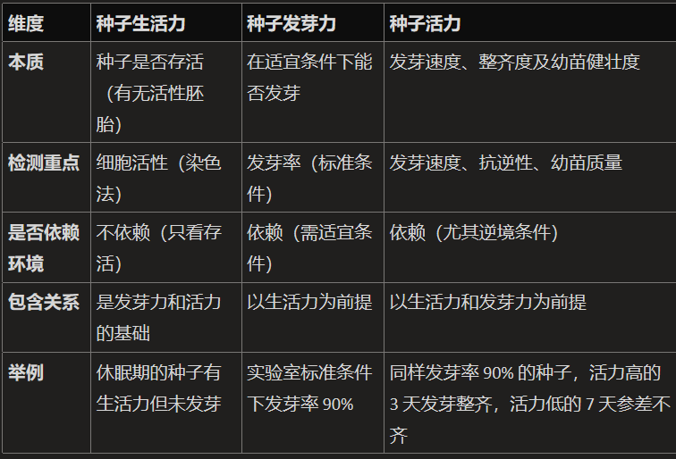
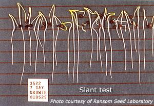
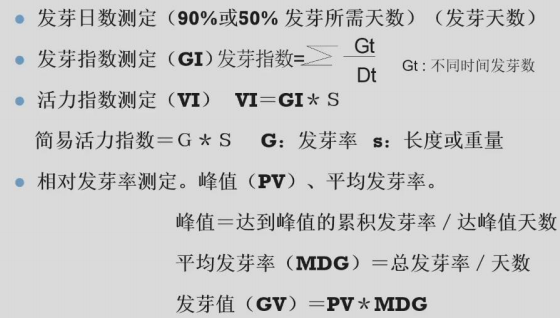
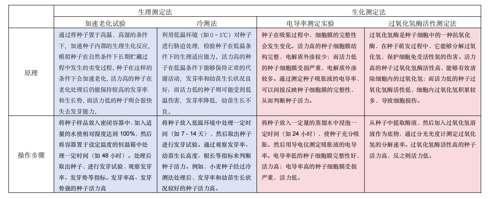

## 一、有关概念 #重点 
- **种子生活力**：种子发芽的 ==潜在能力== 和种胚所具有的生命力→类比土壤潜在肥力👉种子活不活
	- 一批种子中具有生命力的种子数占总数的百分率
- **种子发芽力**：种子在适宜条件下发芽并长成正常植株的能力→ ==发芽率发芽势== (联系实验)👉种子能不能长
- **种子活力seed vigor**：在田间条件下，决定种子迅速整齐出苗和长成正常幼苗潜在能力的总称/指田间条件下的出苗能力以及与此有关的生产性能与指标👉种子长得好不好
	- 意义  #考过 
		- 提高田间出苗率，保证苗齐苗壮
        - 抵御不良环境，增强对低温、干旱等的抵抗能力
        - 增加作物产量，为增产奠定基础
        - 提高种子的耐储藏性
        - 可以增强对于病虫杂草的竞争能力
        - 抗寒能力强，利于早播
        - 节约播种费用
    - 与种子发芽力的关系：活力的变化下降更快
		- 

## 二、种子活力测定方法
#### 1. 直接法
- 直接法： ==模拟田间不良条件== ，观察出苗能力/幼苗生长速度→盐胁迫等
1. 幼苗生长测定：普遍适用
	- 发芽纸法→要求纸张吸水良好且有一定硬度、干净无毒
		- 
		- 垂直板法
	2. 幼苗评定试验：适用于大粒的豆类、花生、棉花
		- 结果以正常苗的百分率表示
	3. 标准发芽试验(发芽速率的测定)
		- 
#### 2. 间接法

- 生理测定法
	- 发芽速率、幼苗生长势、抗逆试验、呼吸水平
	- 渗透物质测定→电导率：种子浸出液测定👉联系植物生理学实验
		- 应用于豌豆、大豆、玉米、番茄等
		- 原理：吸涨初期，细胞膜重建和损伤的修复能力影响电解质和可溶物外渗的程度→ ==电导率与田间出苗率为负相关== 
		- 影响因素：种子大小、原始种子水分
- 生化测定法：酶活性(谷氨酸脱氢酶/细胞色素氧化酶/过氧化物酶)、合成能力(葡萄糖利用率)、能量代谢、碘价酸价 [[Chapter3 化学成分]]
	-  TTC(Topogaphical Tetrazolium Test)：应用于玉米、小麦
		- 原理：无色三苯基四氮唑被胚**活细胞脱氢酶**还原成红色的三苯基甲瓒(这个字我不会打)👉 ==胚全部染色为高活力种子== 
		- 方法：小麦胚放到1%TTC中，黑暗30℃保持5h
		- 适用于：收获后马上需要播种的种子、具有深度休眠特性的种子
	- 种子ATP含量的测定
		- 范围：蔬菜、油料和蛋白质种子
		- 原理：ATP+荧光素→发出荧光→ATP含量与吸涨种子活力呈显著相关
			- e.g.ATP荧光试剂盒
- 物理测定法：电导率、射线法、荧光法→十字花科、游离子法
- 染色法：红墨水法/酚染色法/二硝基苯染色法
- 形态特征观测法：气味、色泽、胚率
	- 节约成本、简单易行、快速、准确(尊嘟假嘟🤔)
#### 3. 《活力测定方法手册》
1. **冷冻测定**：常温发芽与早春田间存在差异→模拟早春玉米生长环境，测定种子活力
	- 适用于 ==春播喜温== 作物e.g.玉米、棉花、大豆、豌豆
	- 方法：土壤卷法、土壤盒法
2. 低温发芽试验
	- 适用于棉花、黄瓜、水稻
	- 方法：沙床、纸巾卷
	- **幼苗评价标准**：
		- 健壮苗：各器官完好无损
		- 正常苗：根健壮，下胚轴良好，至少有一个完善子叶
		- 畸形苗
3. **加速老化试验**：适用于多种作物
	- 采用 ==高温高湿(不同作物不同)== 处理种子→加速种子老化→再按标准萌发处理，与正常种子做对照👉我们做过的MDA含量测定实验
	- 与控制劣变联系
	- 注意事项
		- 老化种子的含水量、老化时间控制
4. 希尔特纳实验Hiltner test：用于检测带病种子		
	- 原理：模拟土壤机械压力，带伤病的芽鞘顶土能力很弱→统计正常的幼苗
5. 冷浸试验
6. 复合逆境
7. **控制劣变测定**：适合小粒蔬菜种子
	- 先使种子吸湿达到规定的水分含量
	- 置于密闭容器内，10℃过夜；密封在铝箔后，高温使其萌发
#### 4. 测定要点
- 明确种子具体存在什么问题e.g.出苗、耐贮、抗逆
- 确定相应的测定方法

## 三、种子活力的生物学基础
#### 1. 影响种子活力的因素
- 遗传因素
	- 作物品种：大粒种子具有的营养物质丰富，萌发期间具有较高的能量，幼苗顶出土面的能力较强。
	- 杂种优势：线粒体具有互补作用
	- 种皮颜色→莽草酸途径：合成木质素、花青素
		- 种皮自然破裂的种子如大豆等，降低种皮的保护作用，容易导致种子老化变质
	- 出土类型[[Chapter6 种子萌发]]
		- 子叶出土型种子不适宜深播
		-  ==子叶不出土型的出苗率相对较高== 
	- 种子硬实
	- 化学成分→高赖氨酸玉米会皱缩，甜玉米糖分高，胚乳皱缩不耐储存
	- 种子成熟度：成熟度越高活力一般越高
- 环境因素
	- 土壤肥力：缺硼缺铝
		- 花生种子对矿物质的缺乏较为敏感
		- 土壤缺锰会使豌豆胚芽损伤、子叶空心
		- 土壤缺钙/镁会导致产生的种子幼根容易发生破裂
	- 栽培措施：不要密植
	- 气候条件
#### 2. 活力下降和劣变 #重点 
- **种子劣变(deterioration)**：种子活力在达真正成熟时最高，然后便 ==进入活力下降的不可逆变化== ，这些不可逆变化的综合效应 #名词解释 
	- 劣变程度浅的种子仍然可以出苗
- 特点：渐进性、积累性、不可逆性[[Chapter9 细胞衰老与细胞死亡]]
	- 大分子物质变性
	- 膜系统的损伤
	- 有毒物质的积累
	- 生理活性物质破坏与失衡
- 形态特征：气味、色泽、胚率
-----
- 种子活力的概念
- 影响因素有哪些
- 什么是种子劣变
- 种子活力有什么测定方法