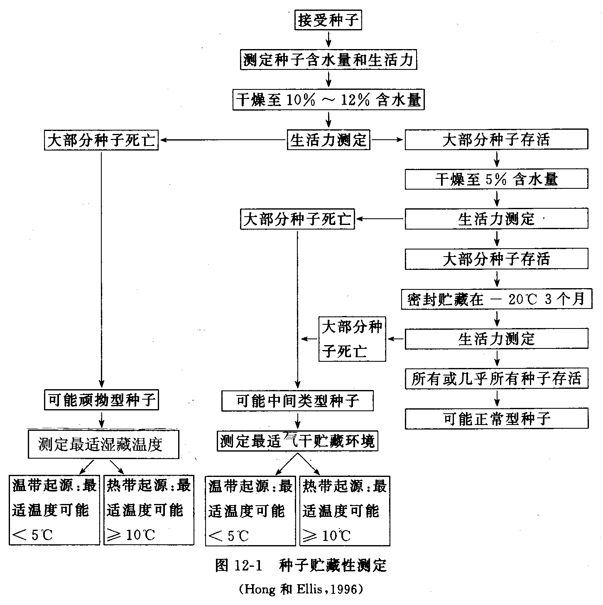
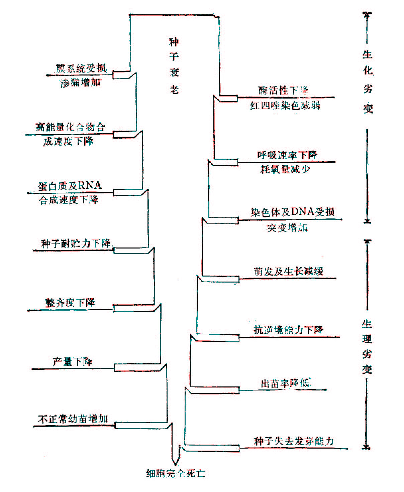
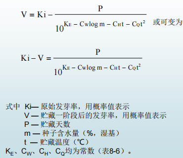
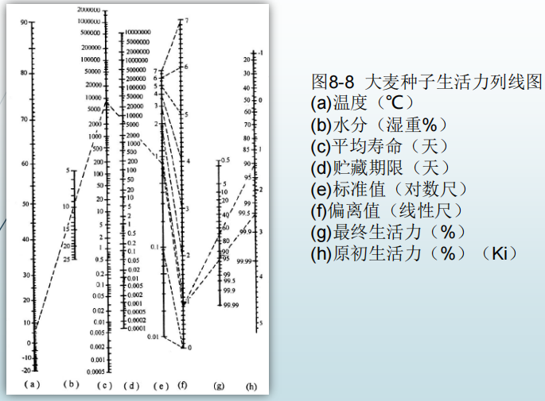

## 一、概念
#### 1.1 Concepts
- **种子寿命**:种子 ==群体== 在 ==一定环境条件下== 保持 ==生活力== 的期限
	- 长命种子:蚕豆/绿豆/丝瓜/南瓜/甜瓜/莲花(非常古老)
	- 常命种子:水稻/小麦/大豆
	- 短命种子:甘蔗/花生/辣椒/果树种子
- 其它定义
	- 平均寿命:用种子发芽率从种子收获到降低到50%的期限
## 二、 影响因素
#### 2.1 种子特征
- 种皮结构
	- 种皮密实、致密，具有蜡质、角质(特别是硬实👉大豆)[[Chapter6 种子萌发]]
		- 有皮的大麦比小麦/裸大麦的寿命更长
		- 同是豆类作物，花生种子的种皮脆而薄，且和其他豆科植物的种子不同，缺乏栅状细胞层，因而较难贮藏
- 化学成分：糖类/蛋白/脂肪
	-  ==脂肪更容易水解和氧化== →含油量高的种子更难贮藏
		- 含油酸、亚油酸等不饱和脂肪酸较多的种子更难贮藏(因为更容易氧化)
		- 绿豆、蚕豆👉淀粉含量高，比大豆寿命长，而花生寿命就很短了
- 生理状态：尽量将种子生理活动维持在低水平，是延长种子寿命的必要条件之一
	- 生理状态活跃的明显指标：种子呼吸强度增强
- 物理性质：
- 胚的性状： ==大胚种子== 或者整个胚占籽粒比例比较大的种子，寿命更短[[Chapter3 化学成分]]
- 正常型种子和顽拗型种子
	- 正常型种子：具有适于干燥低温贮藏的特性
		-  ==种子水分和贮藏温度越低== ，越有利于延长种子寿命
		- 大多数农作物、蔬菜和牧草种子属于这一类型
	- 顽拗型种子：不耐低温贮藏和不耐脱水干燥
		- 脱水干燥会造成种子损伤，零度以下低温会引起冻害，而造成种子死亡
		- 茶籽、板栗、咖啡、可可😋和橡胶等林木种子
	- 测定方法
#### 2.2 环境因素→联系呼吸作用[[Chapter4 Respiration]]
1. 湿度( ==最关键因素== )
	- 当种子中出现自由水的时候→酶被活化，呼吸强度会递增
	- 水分>安全贮藏水分时，种子寿命大幅下降
2. 温度
	- 贮藏温度越低，正常型种子的寿命就越强
	- 在0~55℃范围内，种子寿命随着
3. 气体：氧气会促进种子的劣变和死亡
4. 光[[Chapter7 Plant Growth Physiology]]
## 三、衰老的原因和机理
#### 3.1 细胞膜的损害
- 当种子发生劣变时，干燥种子膜的渗漏程度较严重
	- 由于膜内部脂肪水解和氧化，又使膜内部疏水基团解体
	- 使得大多数酶无法存在
	- 产生大量自由基[[Chapter9 细胞衰老与细胞死亡]]
#### 3.2 大分子的变化
- 核酸：原有的核酸解体
	- 新的核酸合成受阻←膜的破坏，ATP有关酶被破坏
- 酶：蛋白质变性
- 有毒物质积累： ==胚比胚乳更多== →胚大的种子寿命更短
	- IAA与ABA也能成为抑制的物质
	- 若微生物感染，也会产生有毒物质
- 变化顺序图
#### 3.3 陈种子的利用
- 种子发芽力没有明显降低的种子，即使已经久藏，仍可供生产上利用，并能收到缩短生育期，提早成熟的效果
	- 要根据 ==种子生活力的高低== 来确定
	- 当种子发芽率显著下降就表明该批种子已经衰老，其存活部分可能含有一定频率的自然突变👉丢了
#### 3.4 种子寿命的预测
- 对数直线回归方程
- 预测列线图

-----
1. 种子寿命的概念
2. 不同种类种子间寿命有何差异
3. 简要阐明影响种子寿命的因素
4. 种子衰老的机制是什么
5. 生产上如何合理应用陈种子