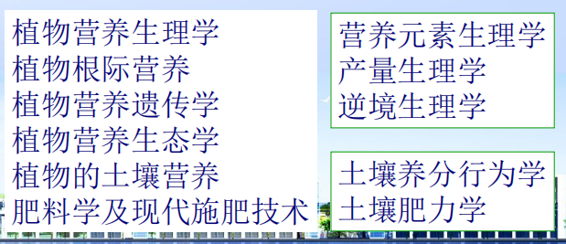
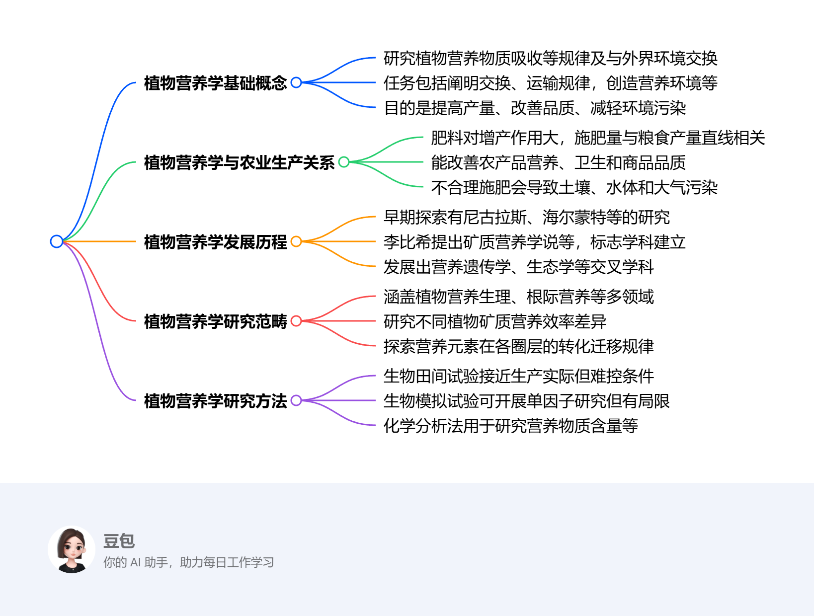

## 一、课程主要任务
- 植物营养学课程构成
- 植物养分吸收、运输、转化、利用特征
- 植物营养特性（大量、中微量元素）
- 植物养分缺乏及初步诊断
- 肥料的特性、施用方法

## 二、 植物营养学的目的和概念
#### 1. 概念
- 研究植物对营养物质 ==吸收、运输、转化、利用== 的规律及植物与外界环境之间营养物质和能量交换的科学
- 主要任务：提高产量，改善品质, 减轻环境污染
	- 阐明植物与外界环境间营养物质和能量的交换过程；
	- 阐明植物体内营养物质的运输、分配和转化规律；
	- 通过施肥手段，为植物创造良好的营养环境；
	- 通过改良植物营养性状，提高植物的营养效率和对营养胁迫的适应性；
	- 通过合理施肥，改善生态环境；
	- 提高作物产量和改善农产品品质。

#### 2. 与农业生产的关系
- 肥料在农业生产中的作用→增产、改善品质
	- N：果实大小、色泽，蛋白质和氨基酸含量。
	- P：促进果实和种子的成熟和含磷物质含量。
	- K：品质元素, 提高蔗糖、淀粉、脂肪、维生素和矿物质含量、改善果蔬色泽、风味，贮藏和加工性能。
#### 3. 与生态环境安全
- 增加土壤养分、补充土壤有机质
- 改善土壤理化性状、调节土壤酸碱度
- 提高土壤生物和生化活性、减少污染，改善生态环境
## 二、发展概况
#### 1. 早期探索
- 尼古拉斯（Nicholas,1401-1446) ：认为植物吸收养分与吸收水分的某些过程有关。
- 海尔蒙特（van Helmont,1577-1644)于1640做了著名的 ==柳条试验== 
	- 认为柳条重量的增加来自水
	- 虽然其结论是错误的，但他把肥料学的试验方法引入植物营养领域。
- 泰伊尔（von Thaer, 1752-1828)提出腐殖质学说：土壤肥力取决于腐殖质的含量，腐殖质是土壤中唯一的植物营养物质，而矿物质只是起间接作用，即加速腐殖质的转化和分解，使其成为被植物吸收的物质。
- 布森高（Boussingautt,1802-1887)采用田间试验方法
	- 确定了豆科作物可利用空气中的氮，提高土壤的含氮量，并指出豆科作物在轮作中的作用。（氮素营养学说）
#### 2. 矿质营养学说确立时期（1840-1920）
1. 李比希 （ Justus von Liebig, 1803-1873)提出了 ==矿质营养学说==  #重点  #名词解释 
	1. **矿质营养学说( Mineral element theory)**：腐殖质是地球上有了植物之后才形成的。 ==植物最初的营养物质必然是矿质元素== ，腐殖质只有通过改良土壤、分解产生矿质元素和CO2来实现其营养作用。因此，矿质元素才是植物必需的基本营养物质
		1. 局限：过于强调矿质养分的作用
	2. **养分归还学说(Theory of Nutrient Returns)**：由于作物的收获必然要从土壤中带走某些养分物质，土壤养分将越来越少，如果不把这些矿质养分归还土壤，土壤将变得十分贫瘠。因此 ==必须把作物带走的养分全部归还给土壤== 
		1. 意义：通过增施肥料扩大了物质的循环→为提高产量提供了物质基础；而且对于恢复和维持土壤肥力，促进农业生产都起了积极的作用，并奠定了近代施肥的理论。
		2. 局限：
			1. 应该考虑土壤本身的养分、作物本身的营养特性、作物根茎的作用
			2. 没有看到豆科植物的固氮作用
	3. **最小养分律(Law of the minimum nutrient)**： ==作物产量受土壤中相对含量最少的养分因子所控制== ，产量高低随最小养分补充量的多少而变化，如果这个因子得不到满足，即使增加其他的养分因子，作物产量也不可能提高
		- 类比：木桶模型
	- 功绩：
		- 矿质营养学说的创立，标志着植物营养学作为一门学科的真正建立 #重点 
		- 提出养分归还学说和最小养分律对合理施肥至今仍有深远的指导意义
#### 3. 矿质营养学说的发展时期（1920—1960）
- 化肥产量和施用量急剧增加，作物产量提高。
- 肥料施用过程出现了许多的问题，如病虫害加剧、产量品质下降、环境污染严重。
#### 4. 生长因子综合理论阶段（1960 —）
- 生长因子综合理论：作物产量是水分、养分、光照、温度、品种、耕作条件和栽培措施等因子综合作用的结果
	- 其中必然有一个起主导作用的限制因子，产量也在一定程度上受该因子的制约。
		- 各种肥料要 ==配合施用== 
		-  ==施肥措施== 要与其它的农业技术措施密切配合，才能充分发挥肥料的增产作用和提高肥料的利用率及经济效益
## 三、植物营养学的发展
#### 1. 新交叉学科的形成
- 植物营养遗传学：植物营养遗传性状 ^c08c89
	- 研究不同植物种类及品种的矿质营养效率 ==基因型差异== 的生理生化特征，生态变异和遗传控制机理，以便筛选和培育出高效营养基因型植物新品种
- 植物营养生态学：研究植物－土壤及其环境的相互关系→环境保护
	- 主要研究不同生态类型中各种营养元素在土壤圈、水圈、大气圈、生物圈中的转化和迁移规律；各种养分和环境生态系统的关系，其中包括重金属和污染物在食物链中的富集、迁移规律和调控措施。
#### 2. 植物营养与肥料学科的展望
- 加强营养物质的循环和再利用
- 提高营养物质的利用效率
- 提高植物吸收利用养分的能力
- 发展保肥增效的新型肥料

## 四、植物营养学的范畴及其主要研究方法
#### 1. 范畴[[#^c08c89]]

#### 2. 研究方法
- 生物田间试验法：在田间自然条件下进行，是植物营养学科中最基本的研究方法；试验条件最接近农业生产要求
- 化学分析法：研究植物、土壤和肥料体系内营养物质含量、形态、分布与动态变化的必要手段，是进行植物营养诊断所不可少的方法
- 生物模拟实验法：运用特殊装置，给予特殊条件便于调控水、肥、气、热和光照等因素
- 数理统计
-----

