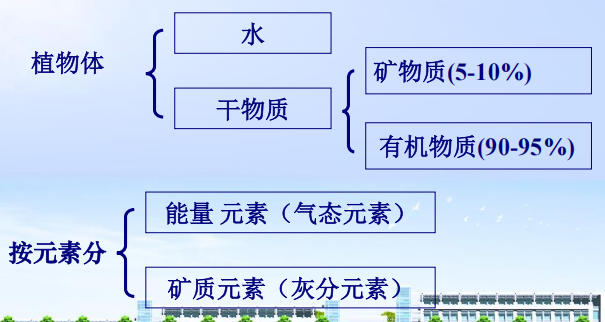
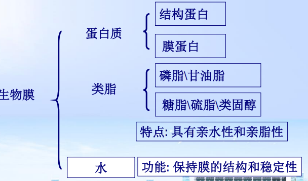
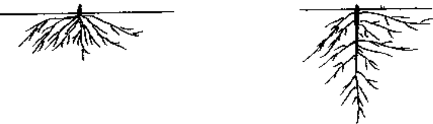
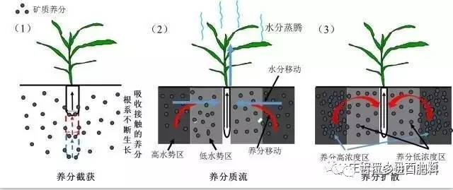
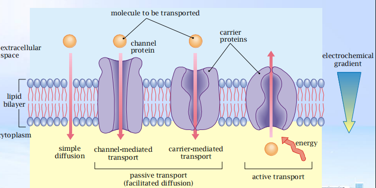
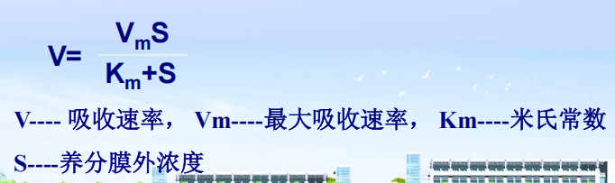
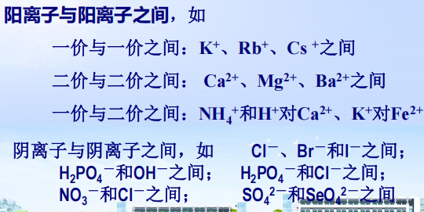
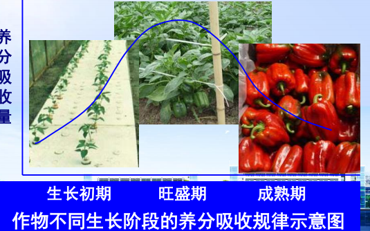
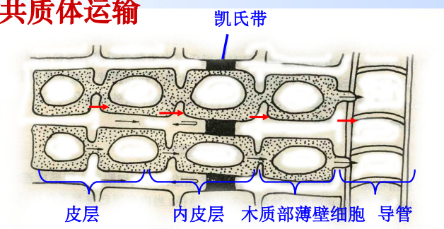

## 一、 植物营养成分
#### 1. 植物的营养组成
- 组成成分：
	- 花生与玉米间作提高产量：禾本科植物在缺铁条件下分泌的麦根酸活化根际的难溶性铁，提高了双子叶植物的铁吸收量 #重点 
#### 2. 必需元素
- 三条判断标准：
	- 直接性
	- 不可替代性
	- 不可缺失性
- 分类→十七种元素同样重要
	- 大量元素：C H O  ==N P K→植物营养三要素/肥料三要素== 
	- 中量元素：Ca Mg S
	- 微量元素：Cl Fe Cu Mn Zn B Mo Ni
		- 在碱性条件下有效性更高：Mo
- 主要功能
	- C、H、O、N、S→组成有机体的结构物质和生活物质；组成酶促反应的原子基团
	- P、B、(Si)→形成连接大分子的酯键；储存及转换能量
	- K、Mg、Ca、Mn、Cl
		1. 维护细胞内的有序性，如渗透调节、电性平衡等
		2. 活化酶类
		3. 稳定细胞壁和生物膜构型
	- Fe、Cu、Zn、Mo、Ni：组成酶辅基；组成电子转移系统
- 植物营养失调症
	- 营养元素缺乏症：缺乏某一元素
	- 元素毒害症：过量吸收某一元素
## 二、生物膜的结构和性质
#### 1. 细胞膜结构
#### 2. 细胞膜特点
- 单位膜模型
- 流动镶嵌模型：
	- 生物膜上的蛋白质分为“外在蛋白”和“内在蛋白” 
	- 膜上蛋白质分布是不均匀的，所以膜的结构是不对称的
	- 脂质的双分子层大部分为液晶状，可自由流动
	- 膜上有一些蛋白质酶的作用，对离子的运输或分子的穿透有透过酶的功能。
- 结构特性：流动性；功能特性：选择透过性
#### 3. 功能 #待解决 
- 转运蛋白：
	- 载体蛋白/离子载体（carrier protein）
		- 能够与特定溶质结合，通过自身构象的变化，将与它结合的溶质转移到膜的另一侧
- 通道蛋白（channel protein）
	- 与所转运物质的结合较弱，它能形成亲水的通道，当通道打开时能允许特定的溶质通过，所有通道蛋白均以自由扩散的方式运输溶质
	- 具有 ==离子选择性== →通道只允许具有特定离子半径、电荷的离子通过
#### 4. 质子泵、膜电位
- 质子泵：可逆性ATP酶，能在外能驱动下逆浓差转运H+
	- 呼吸链中的三个酶复合体 #学科链接 生物化学
		- 细胞色素c氧化酶
		- 辅酶QH+-细胞色素c氧化酶
		- NADH-辅酶Q还原酶
- 膜电位：由于位于细胞膜上的ATP酶的泵H＋作用，使膜两边H＋的自由能发生变化(⊿ m H＋) 
	- H＋浓度变化所引起的化学势变化 #学科链接 化学渗透作用
	- 电势的变化（故称为电化学势变化）
## 三、植物根系
#### 1. 根的类型
- 整体上
	- 直根系：根比较深→主根、侧根→利用深层土壤的养分 ^b3abe6
	- 须根系：水平生长→不定根→利用浅层
#### 2. 根的数量
- 表示：
	- 单位体积或面积土壤中 ==根的总长度== 表示，如：LV（cm/cm3）或 LA（cm/cm2）
		- 须根系的LV> 直根系的LV #易混淆 
		- 根系数量越大，总表面积越大,根系与养分接触的机率越高
		- 反映根系的营养特性
- 评价根系生长的常用参数：根长、根体积、 根表面积、根直径、根系数量、根毛数量、侧根数量、根尖数量等
#### 3. 根的构型
- 同一根系中不同类型的根（直根系）或不定根（须根系）在生长介质中的空间造型和分布。
    - 与养分吸收：[[#^b3abe6]]
- 根的结构：根冠、分生区、伸长区、成熟区、老熟区
	- 分生区和伸长区：养分吸收能力最强的区域
	- 根毛区：吸收养分的数量比其它区段更多
		- 使根系的外表面积增加
#### 4. 生理特性
- 阳离子交换量[[Chapter6 土壤胶体]]
	- 单位数量根系吸附的阳离子的厘摩尔数
		- 双子叶>单子叶
		- 二价阳离子的CEC越大，被吸收的数量也越多
- 氧化还原能力[[Chapter7 土壤酸碱性和氧化还原性]]
	- 氧化力↑根活力↑吸收力↑
		- e.g.水稻具有 ==氧气输导组织== ，向根分泌O2；同时乙醇酸氧化途径，根部的过氧化氢可以生成O2
		- 根的颜色能够反映根的代谢活动
	- 还原力：还原力强的作物在石灰性土壤上不易缺铁 #待解决 为啥？
		- 推论：若此还原力是属基因差异，就可以通过遗传学方法改善这种特性，从而提高植物对铁素的吸收效率。
## 四、养分向根表的迁移 #学科链接 植物生理学
#### 1. 截获
- 根系在土壤的伸展过程中吸取 ==直接接触== 到的养分的过程，是一种接触交换。
- 发生条件：根与粘粒表面距离小于5 nm
- 影响因素：带电量、CEC、接触面积、迁移离子价数
#### 2. 质流
- 养分离子 ==随蒸腾流迁移到根表面== 的过程
	- 一般溶解性和移动性大的离子以质流迁移为主
	- NO3 -、SO4 2-、Na+ 、Cl-
- 影响因素：蒸腾量、土壤养分浓度
#### 3. 扩散
- 养分依靠分子或离子的 ==化学势== 自发地 ==从高浓度向低浓度== 方向迁移的过程。
	- 表示：F=D . Dc/dx （Fick定律）
		-  F——扩散速率
		- D——扩散系数
		- Dc/dx——养分浓度梯度
- 影响因素：土壤养分浓度梯度 、含水量 、土壤质地、温度 、离子种类等
## 五、植物对养分的吸收 #学科链接 植物生理学
#### 1. 被动吸收
- 离子顺着电化学势梯度进行的扩散运动，这一过程 ==不需要能量，没有选择性== ，也叫非代谢性吸收。
- 主要形式
	- 简单扩散：高浓度向低浓度扩散
	- 离子通道
#### 2. 主动吸收
- 植物体内养分离子浓度比外界土壤溶液浓度高：
- 特点 ：
	- 养分逆浓度梯度、需要能量
	- 溶质间有竞争
	- 吸收有选择性
	- 高的温度系数
- 假说
	1. 载体假说：生物膜上存在某些分子，能与特定的离子结合并把离子运送到膜内→米氏方程
	2. 离子泵假说：质膜上的ATP酶（插入蛋白）活化水解产生能量，将细胞质中的H+泵到膜外，形成跨膜H+梯度，产生了跨膜离子自由能差，为其它离子越膜进入细胞提供动力
#### 3. 叶部对养分的吸收
- 概念：植物叶片吸收养料来营养自身的现象
	- 途径：气孔扩散、角质层的渗透
- 优点：
	- 弥补根系吸收养分的不足
	- 提高养分有效性
	- 用量少、见效快，经济效益高
- 影响因素
	- 作物种类→气孔多少(双子叶植物的气孔数量相对较多)
	- 肥料类型→氮肥 #一些疑问 有什么影响？
	- pH、天气、表面活性剂
#### 4. 养分离子的相互关系
1. **拮抗作用**：一种离子的存在抑制另一种离子的吸收 #重点 
	1. 竞争性拮抗：一种离子通过竞争载体上的结合部位抑制另一种离子的吸收→可以类比生化中酶的竞争性抑制
		1. 条件：相似的性质和水合半径Ca2+与Mg2+ #一些疑问 水合半径是什么？
	2. 非竞争性拮抗：取决于载体和拮抗离子的浓度和拮抗离子与载体的亲合力大小。
	3. 表现:
		1. 阳离子与阳离子之间：低价阳离子会 ==抑制== 高价阳离子的吸收
		2. 阴离子与阴离子之间
2. **协同作用**：一种离子的存在抑制另一种离子的吸收
	4.  ==高价阳离子== 会促进低价阳离子的吸收→“**维茨效应**”
		- 氮促进磷的吸收
		- 硝酸根、硫酸根等对阳离子吸收有利
#### 5. 各生育期营养特性关键时期
- **植物营养临界期**：营养元素过多/过少/元素间不平衡对植物生长发育起着明显不良影响的那段时间→基肥
	- 磷素：多在幼苗期
	- 氮素：水稻在三叶期，小麦在分蘖期；
	- 钾素：水稻在分蘖初期和幼穗分化期
-  **植物营养最大效率期**：营养元素在植物体内产生最大效能的那段时期→追肥
	- 作物生长迅速，吸收养分能力特别强→及时满足作物对养分的需要→显著增产
- 3. 注意：既要重视植物需肥的关键时期，又要正视植物吸肥的连续性，采用基肥、追肥、种肥相结合的方法。

## 六、 影响植物养分吸收的因素
#### 1. 内在因素
1. 植物形态学差异：茎、根等
2. 植物生理学差异
	- 生长速率、生长阶段、植物对养分吸收的自身调节、根系阳离子交换量、酶活性、生长激素和毒素、根系分泌物
#### 2. 环境因素→”水肥气热“
1. 光照
	- 影响能量产生、影响酶的活性和代谢、影响蒸腾作用
2. 温度：
	1. 低于2℃时，植物的 ==主动吸收基本停止== 
		- 设计一个实验说明元素A是主动吸收还是被动吸收，或是兼有？ #重点  
			- 对照组：正常温度；实验组：低于2℃
			- 一段时间后测量外界溶液浓度，若实验组远远大于对照组，说明是只有主动；若没那么明显，应该是兼有。若相等说明只有被动运输
	2. 一定范围内，温度升高，呼吸作增强，吸收养分的能力也增强
3. 水分→还会影响土壤通透性与氧化还原电位
		1. 养分迁移的介质决定了离子迁移的方式
		2. 加速养分的溶解
		3. 过多引起养分流失
4. 通气
5. pH
	1.  ==酸性条件下有利于阴离子的吸收== ，碱性反之
6. 养分浓度
7. 根际微生物

## 七、 作物根际营养特性
#### 1. 根际(Rhizosphere) #重点 
- 概念：由于植物根系影响使其理化生物性质 ==与原土体有显著不同== 的那部分 ==根区土壤== 
	- 根际效应：在根际中，植物根系不仅影响介质土壤中的无机养分的溶解，也影响土壤生物的活性，从而构成一个 “根际效应”。 #名词解释 
- 根际养分
	1. 亏缺与富集
		1. 扩散迁移元素：钾、磷、锌 容易亏缺
		2. 质流迁移元素：钙、镁、硫 容易富集
	2. 影响
- 根际pH：
	- 影响因素
		- 阴阳离子吸收不平衡
		- 根际分泌H+
		- 呼吸产生CO2
		- 根系分泌有机酸
		- 根际微生物活动产生酸
	- 作用 #待解决 
		1. 影响养分的有效性：
			1. 石灰性土壤使用铵态氮肥、钾肥，pH下降，会使营养因素生物有效性增加
			2. 酸性土壤施用硝态氮肥，pH上升，磷的有效性提高 #一些疑问 为啥呀？
			3. 豆科作物在固氮过程中酸化了根际，提高了难溶性磷的利用率
			4. 豆科植物在缺磷条件下，根系不正常生长形成簇状根或排根， ==分泌H＋能量较强== ，有效的降低根际pH，并 ==溶解土壤中的难溶性磷== 
- 根际氧化还原电位[[Chapter7 土壤酸碱性和氧化还原性]]
	- 旱作 根际Eh<周围土体
	- 水稻 根际Eh>周围土体
- 根际生物学环境
	- **根系分泌物**：根系向根际土壤分泌大量容易分解的有机物质
		- 种类（了解）
		- 意义：微生物的能源与营养材料、促进养分有效化、间作或混作中互利作用
	- **根际微生物**
		- 影响：矿化有机物→释放二氧化碳与无机酸；产生和分泌有机酸；固定和转化大气中的养分；产生和释放生理活性物质
	- 菌根Mycorrhiza：**土壤真菌与植物根系**建立 ==共生关系== 所形成的共生体
		- 类型：外生菌根和内生菌根
		- 影响：促进养分吸收
			-  ==原因== ：增大接触面积、降低菌丝际pH

## 七、 植物体内物质运输
#### 1. 短距离运输
- 概念：从根部细胞到细胞的转移为短距离运输
	- 质外体运输
		- 质外体：由细胞壁及细胞间隙等空间（包含导管与管胞）组成的体系
	- 共质体运输：根毛区质外体堵死
- 养分横向运输：是途经质外体还是共质体，主要取决于
	- 养分种类：
		- 主动跨膜运输为主的养分→共质体；
		- 被动跨膜运输为主的养分→质外体
	- 养分浓度
	- 根毛密度
	- 胞间连丝的数量
	- 表皮细胞木栓化程度等
#### 2. 长距离运输
- 概念：从根系输送到地上部的运输为长距离运输；高等植物通过木质部和韧皮部维管系统
- 木质部运输
	- 结构：导管、管胞、木纤维、木薄壁组织细胞
	- 溶质在木质部运输
		- 运输方式：以质流为主、部分以离子交换
		- 动力：蒸腾流
		- 影响因素：蒸腾、管壁吸附作用
- 韧皮部运输
	- 结构：筛管、伴胞、薄壁细胞、韧皮部纤维
#### 3. 其它概念
- 根压：当离子进入木质部导管→增加了导管汁液的浓度→使水势下降，引起导管周围的水分在水势差的作用下扩散进入导管→产生使导管汁液向上移动的压力
- 吐水现象：由于根压的作用使水分和离子在导管中向地上部移动，可在叶尖或叶缘泌出水珠
- 伤流液：把幼苗茎基部切断，可以收集到的木质部汁液
## 八、源与库的关系[[Chapter5 同化物的运输和分配]]
----
