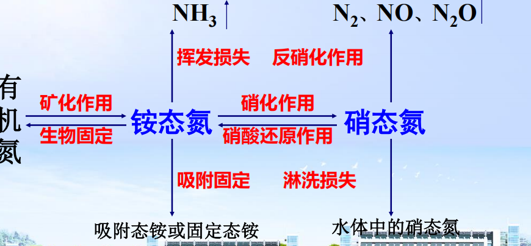
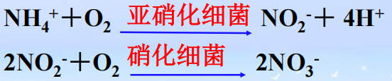
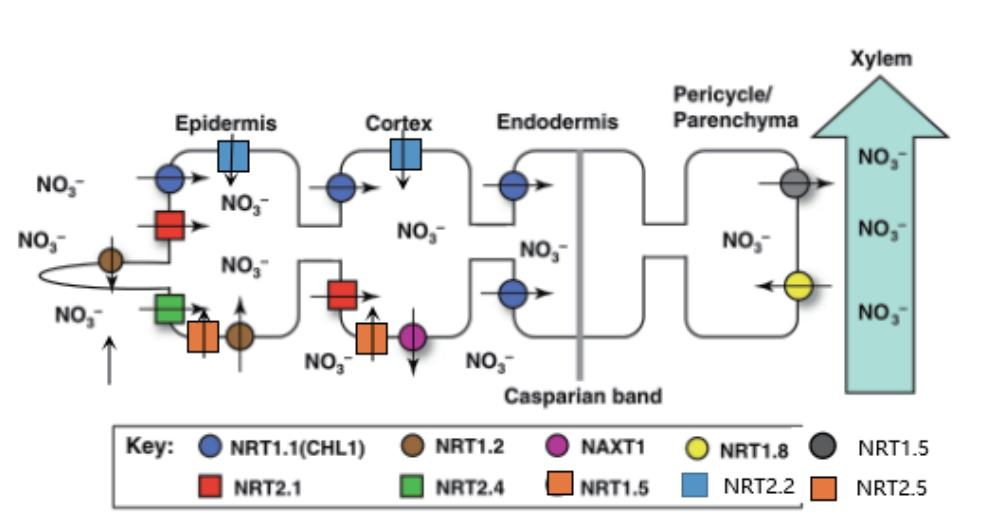
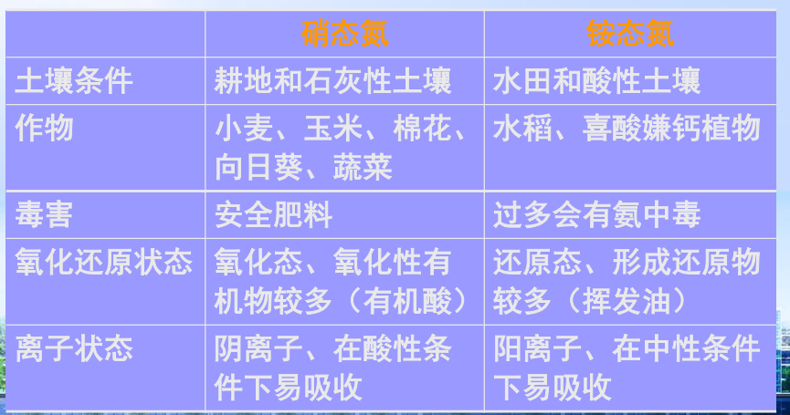
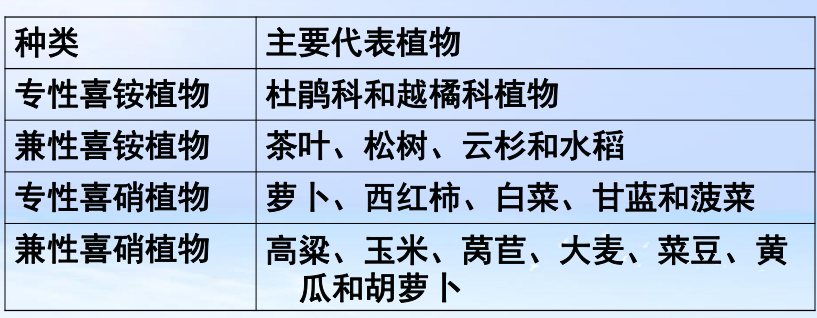

- **生理酸性肥料**：化学肥料进入土壤后，如植物吸收肥料中的阳离子比阴离子快时，土壤溶液中就有阴离子过剩，生成相应酸性物质，久而久之就会引起土壤酸化。 #名词解释 
- 基肥：在作物播种或移栽前施用的肥料。
	- 为作物在整个生长发育期间提供基础的养分供应。
	- 一般基肥的用量相对较大，而且肥效比较持久。
- 种肥:种肥是直接与种子接触或与种子近距离施用的肥料，目的是为种子萌发和幼苗生长提供养分
- 追肥：补充基肥的不足或满足作物不同生育时期对养分的特殊需求而进行的施肥
	- 追肥通常使用速效肥料，如尿素、氯化钾等

## 一、土壤中的氮素及其转化
### 1. 氮素的来源及其含量
- 土壤氮的来源
	- 大气氮沉降、有机肥和化肥、生物固氮、动植物残体
	- 我国耕作土壤大多为0.04~0.35%
- 土壤氮的形态：有机氮、无机氮（铵态氮、硝态氮）
- 土壤氮的转化 #重点 
	- 有机氮矿化：在微生物作用下，土壤中的含氮有机物分解形成氨或铵的过程。 #名词解释 异养微生物、氨化微生物 ^c2e7c2
		- 发生条件：各种条件，但有最适条件
		- 结果：生成NH4+
	- 黏土矿物对NH4+的固定
		- 吸附固定：由于土壤粘土矿物表面所带 ==负电荷== 而引起的对NH4 ＋的吸附作用
		- 晶格固定：NH4 ＋ ==进入2:1型膨胀性粘土矿物== 的晶层间而被固定的作用👉联系钾[[Chapter4 钾]]
	- 氨的挥发损失：在**中性或碱性条件**下，土壤中的NH4 ＋转化为NH3而挥发的过程
		- pH、土壤碳酸钙含量→正相关、温度
		- 施肥深度
	- 硝化作用：通气良好条件下，土壤中的NH4 ＋ 在微生物的作用下 ==氧化成硝酸盐== 的现象。
		- 最适条件：铵充足、通气性好，pH6.5~7.5
		- 利：为为喜硝植物提供氮素
	- 反硝化作用
		- 生物反硝化作用： ==嫌气条件下== ，土壤中的硝态氮在反硝化细菌作用下还原为气态氮从土壤中逸失的现象
			- 最适条件：土壤通气不良，新鲜有机质丰富
		- 化学反硝化：可以在好气条件下进行→造成氮素的气态挥发损失
	- 无机氮的生物固定：土壤中的铵态氮和硝态氮被微生物同化为其躯体的组成成分而被暂时固定的现象
		- 减少氮的供应、减少氮素损失
#### 2. 土壤的供氮能力及氮的有效性
- 土壤有效氮增加和减少的途径
	- 增加：施肥(有机肥、化肥)、氨化作用、硝化作用(喜硝作物)、生物固氮、雷电降雨
	- 减少：植物吸收带走、氨的挥发损失、硝化作用(喜铵作物)、反硝化作用、硝酸盐淋失、生物和吸附固定(暂时)
## 二、 植物的氮素营养
#### 1. 体内氮的含量与分布
- 含量：占植物干重的0.3～5％ #重点 
- 营养功能：氨基酸、蛋白质、核酸、叶绿素、酶、维生素、植物激素
- 影响因素：
	- 植物种类：豆科植物＞非豆科
- 分布：氮在植物体内的移动性强
	- 幼嫩组织>成熟组织>衰老组织
	- 生长点>非生长点
- 营养功能：生命元素
	- 组成：氨基酸、蛋白质、核酸、叶绿素、维生素、植物激素
#### 2. 植物对氮的吸收与同化
- 吸收
	- 硝态氮：
		- 主动吸收
		- 大部分在根还原
		- 小部分贮存在液胞内(硝酸根在液泡中积累对离子平衡和渗透调节作用具有重要意义)
	- 铵态氮
		- 机理：接触脱质子、铵转运蛋白
	- 有机氮
		- 尿素(氨酰态氮)
		- 氨基态氮
- 同化
	- NO3-→N的还原：硝酸还原酶、亚硝酸还原酶
		- 影响因素 #重点 ：植物种类、光照(不足时NR活力低)、温度
		- 影响蔬菜硝酸盐含量的因素：植物、肥料、气候、收获→选用优良品种，控施氮肥
	- 铵的同化
		- 部位：根部→氨基酸
		- 过程：谷氨酸脱氢酶(GDH)途径，氨基转移作用
	- 尿素的同化
		- 脲酶途径：尿素经过脲酶水解→NH3→氨基酸
		- 非脲酶：直接同化
		- 毒害：浓度过高对植物不好
	- 影响肥力的因素：
		- 作物种类：“喜铵作物”→马铃薯、水稻；“喜硝作物"→大部分蔬菜
		- 环境条件：
			- 酸性→利于硝酸根吸收；中性至微碱性→利于铵根吸收→ ==pH会迅速下降== ，可能危害植物 ^23cd06
				- 酸性条件下，pH↓，[H+]↑，由于[H+]的增加而抑制了根表蛋白质羧基的解离，相反却增加了氨基的解离，使蛋白质以带正电荷为主，有利于阴离子的吸收。
		- 伴随离子：Ca2+、Mg2+有利于NH4+吸收，相反铵根离子对此有拮抗作用[[Chapter1 植物养分吸收]]
#### 3. 氮素营养失调症状
- 缺氮：
	- 植株矮小、叶片黄化( ==色泽均一== )
- 氮过量：徒长、贪青迟熟、抗性下降
## 三、氮肥的种类、性质与施用
#### 1. 铵态氮肥→深施覆土 #重点 
- 共同特性：易溶于水、易被土壤胶体固定、可发生硝化作用，高浓度易发生毒害[[#^23cd06]]
- 理化性质
	- 碳酸氢铵稳定性差，呈碱性，易分解
- 在土壤中的转化 #重点 
	- 液氨：深施
	- 碳酸氢铵：深施，但是不宜做种肥→呈碱性，施用于土壤后会使局部土壤 pH 值升高，碱性对种子有害；种子发芽温度升高会使其分解
	- 硫酸铵:会使土壤酸化、板结
		- 板结：会与土壤中的Ca2+生成硫酸钙沉淀
		- 适宜做种肥，但是不宜在稻田施用→稻田Eh小，容易还原产生硫化氢危害作物
	- 氯化氨：会使土壤酸化、脱钙板结→ #一些疑问 why
		- 不适宜忌氯作物：葱、蒜、油菜、薯类、烟草
#### 2. 硝态氮肥→旱地追肥，少量多次
- 共同特性：易溶于水、不易被土壤胶体吸附、易发生反硝化作用、 ==促进钙镁钾的吸收== 
- 种类
	- 硝酸铵：生理酸性盐→旱地追肥 #一些疑问 why？
	- 硝酸钠：生理碱性盐
	- 硝酸钙
	- 硝酸钾
#### 3. 酰胺态氮肥（尿素）→水田、旱地，深施 #重点 
- 理化性质
	- 分子式：CO(NH2 )2，有机物
	- 大部分在脲酶作用下水解，少部分以分子态被土壤胶体吸附
		- 水解作用：会导致土壤暂时变碱→深施，加脲酶抑制剂
		- 硝化作用：会导致氮素的损失→加入硝化抑制剂
- 施用：可作基肥、追肥，深施覆土，宜作根外追肥→叶面施肥
	- 体积小，容易透过细胞膜
	- 尿素溶液呈中性，不易引起质壁分离
	- 具有一定的吸湿性，可以使得叶面保持湿润状态
#### 4. 长效氮肥(了解)
- **缓释肥料Slow Release Fertilizers,SRF**：
	- 施用后在环境因素（如微生物、水）作用下 ==缓慢分解== ，释放养分供植物吸收的肥料。
- **控释肥料Controlled Release Fertilizers,CRF**:
	- 通过包被材料控制速效氮肥的溶解度和氮素释放速率，从而使其按照植物的需要供应氮素的一类肥料。
## 四、氮肥的合理分配和施用
#### 1.合理分配：
- 不同作物对氮的需求差异
- 土壤条件：土壤肥力→着重中低产田、质地、酸碱度、水分状况
- 根据肥料特性
- 干旱与湿润地区的氮肥分配
	- 北方干旱缺雨，可分配硝态氮
	- 南方湿润多雨，可分配铵态氮→增加对铵根离子的吸附
#### 2. 提高氮肥利用率的途径 #重点 
1. 根据土壤供氮能力，确定适宜的施氮量
	- 养分平衡法
	- 肥料效应函数法:多次实验确定最佳数量
2. 选择适宜的**施氮时间**
	- 临界期：少量及时；最大效率期：充足
3. **深施覆土**（ ==最有效== ）
	- 能增强土壤对NH4+的吸附作用，减少氮肥损失
	- 有利于根系发育和深扎，扩大营养范围
4. 平衡施肥：要与有机肥、磷肥、钾肥混合使用
	- 无机氮能够 ==提高有机氮的矿化== [[#^c2e7c2]]率，有机氮可以加强无机氮的 ==生物固定== →有机氮也可以提供能量；
	- 并且能够使得土壤结构、性质得到改善
	- 使作物营养平衡
5. 水肥综合管理
	-  在有排灌条件的稻田推广 ==“以水带氮”== 的氮肥深施技术，对水稻节肥增产效果显著。
	- 在旱作上，在有灌溉条件地区，推广“表施后随即灌水”
		- 减少氮肥挥发，促进肥料溶解，
		- 灌水改善土壤的通气性和水分条件
	- 而在无灌溉雨养农业地区，要推广“水肥管理耦合模型”。
6. 施用长效肥料
	- 施用长效氮肥，有利于植物的缓慢吸收，同时能减少养分与土壤接触，提高肥料利用率。
	- 氮肥增效剂包括硝化抑制剂和脲酶抑制剂。