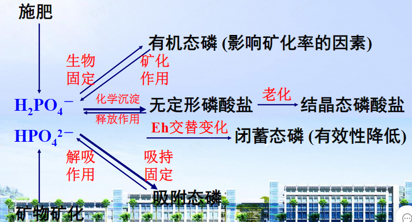
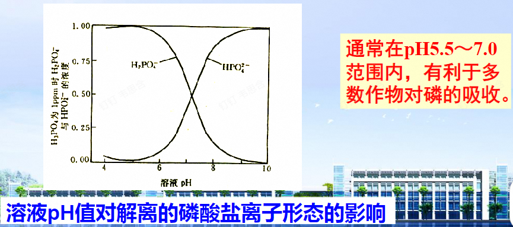
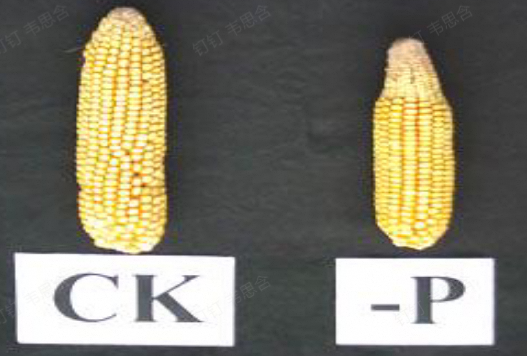
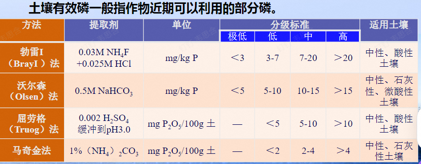
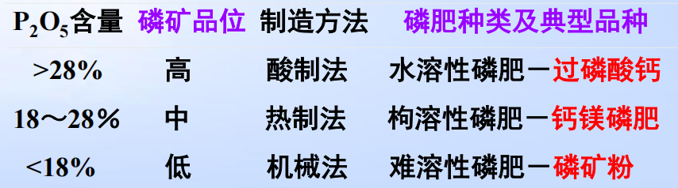
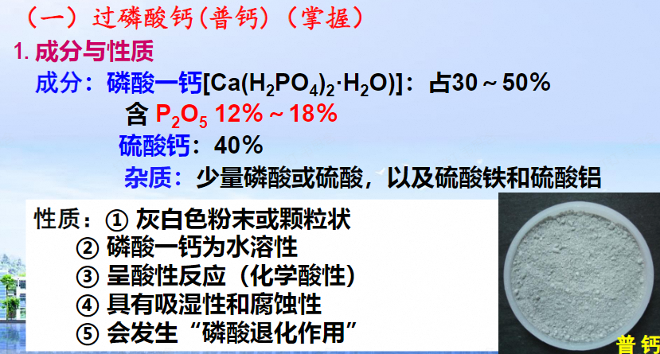
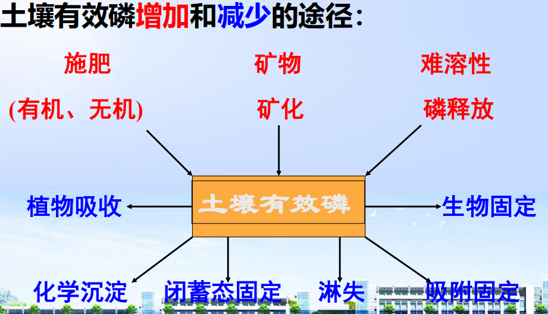
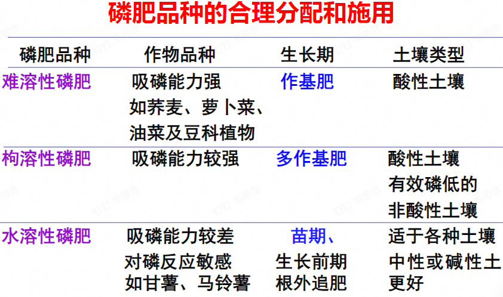

## 一、植物的磷素营养与磷肥
### 1. 土壤中的磷素及其转化
1. 土壤中磷的含量
	- 全磷量：0.2~1.1g/kg
	- 分布规律：从南到北、从东到西逐渐增加
	- 有效磷不足的标准：
		- 中性或石灰性土壤 <10mg/kg
		- 酸性土壤 <15mg/kg
2. 土壤中 ==磷的形态==  #重点 
	- 有机态磷（10%~50%）→区别于氮：
		- 来源：动物/植物→核酸、植素、磷脂等
	- 无机态磷（50%~90%）：Ca-P、Fe-P、Al-P、O-P(由氢氧化铁包裹的P，有效性很低)
3. 土壤中磷的转化 #重点 

#### 2. 磷的释放：
- 难溶性磷酸盐释放
- 无机磷解吸：吸附态磷重新进入土壤溶液的过程
- **有机磷矿化**:植素、核酸、核蛋白、磷脂等在磷酸酶的作用下，逐渐降解，释放出磷酸。
	- 影响因素:磷酸酶活性：
		-  温度/通气性/pH
		- 土壤有机质碳磷比→ ==C/P比== <200净矿化；>300，净生物固持(因为此时土壤中有的P比较少，全部拿去合成细胞膜了)
#### 3. 磷的固定
- 概念：土壤液相中的无机磷酸盐等有效态磷转变为无效态磷过程
	- **沉淀反应**
		- Ca含量越多→形成化合物→有效性降低
		- Fe/Al过多→生成无定形磷酸铁铝盐
	- **吸附反应**：存在于液相中的磷酸或磷酸根离子被土壤铁铝氧化物、水铝英石、粘土矿物、石灰性物质等土壤固相所吸附和吸收的过程。
- 影响因素：
	- 粘土矿物组成：1:1型粘土矿物固定能力大于2:1型 #一些疑问 why?
	- pH： ==pH在6.0-6.5== ，磷有效性最高； pH低（< 5.3），铁铝水化氧化物使磷的固定增强； pH高（> 7.0）→钙离子沉淀。
	- 有机质含量
		- 有机质含量高，有机肥用量多有助于磷的有效性提高→有机酸螯合
		- 有机物螯合/难溶性磷溶解/组个铁铝氧化物对磷的吸附
	- 土壤含水量：影响土壤pH、Eh，改变铁铝氧化物存在形态，从而影响磷的固定与释放。
		- 如： 旱地土壤磷的扩散系数小，有效性低，淹水后Eh下降，高价磷酸铁盐还原为亚铁→与三价铁结合的磷释放，有效性提高
		- 在施用磷肥的时候，应该在旱季的时候多施(这时候P利用率低)

## 二、 植物的磷素营养 #重点 
#### 1. 植物体内磷的含量、分布和形态
- 含量：干物重的0.2%~1.1%
- 分布：幼嫩器官 > 衰老器官，生殖生长期转移到种子或果实，缺磷症状从老叶开始
- 形态：有机磷（85%）、无机磷（15%）
#### 2. 植物对磷的吸收和利用
- 吸收形态： ==正磷酸盐H2PO4⁻(main)== 、HPO4²⁻>PO4³⁻
- 吸收机理：主动吸收，主要在根毛区，H+与H2PO4⁻共运输
	- 通过根系的磷酸盐转运蛋白 (主要是 PHT1 家族蛋白) 从土壤中吸收磷酸盐，并通过 PHO1等蛋白将磷酸盐转运到地上部。
-  ==影响因素== ：
	- 作物种类
		- 喜磷作物(豆科绿肥、油菜、荞麦)>一般豆类、越冬禾本科>水稻
		- 根系发达或根毛多或有菌根的作物吸磷多
		- 幼苗期对磷的要求比较迫切
	- 介质pH
	- 伴随离子[[Chapter1 植物养分吸收]]
		- 具有促进作用的：NH.4+、K+、Mg2+等
		- 具有抑制作用的：NO3-、OH-、Cl-等
		- 降低磷有效性的：Ca2+、Fe3+、Al3+等 
	- 环境因素
#### 3.  磷的同化和运输（了解）
- 同化：磷酸盐转化为有机磷化合物
- 运输： ==木质部== 运输无机磷，占全磷60%以上
#### 4.磷的营养功能
- 体内重要化合物的组分：核酸与核蛋白，磷脂，高能磷酸化合物
- 能够加强光合作用和碳水化合物的合成与运转
- 促进氮素代谢→蛋白质合成，促进脂肪代谢
- 提高作物对外界环境的适应性 #重点 
	- 抗旱：磷能提高原生质胶体的水合度和细胞结构的充水度，使其 ==维持胶体状态== ，并能增加原生质的粘度和弹性，因而增强了原生质抵抗脱水的能力。
	- 抗寒: 磷能提高体内可溶性糖和磷脂的含量。 ==可溶性糖能使细胞原生质的冰点降低== ，磷脂则能增强细胞对温度变化的适应性，从而增强作物的抗寒能力。越冬作物增施磷肥，可减轻冻害，安全越冬。
	- 缓冲系统
## 三、失调症状与诊断→从老叶开始 #重点 
#### 1. 营养缺乏症
- 失调症状 
	- 植株发育迟缓、矮小
	- 禾谷类作物分蘖减少，叶色暗绿，迟熟
	- 玉米叶片紫红色、果实 ==秃尖==  ^1a7237
#### 2. 过剩
- 繁殖器官过早发育，茎叶生长受到抑制
#### 3.丰缺指标
- 作物体内丰缺指标
- 土壤丰缺指标（我国一般使用沃尔森法）
## 四、 磷肥的种类、性质和施用
#### 1. 磷矿的分级及磷肥制造 #重点 
- 磷矿分级：高中低品位，制造方法包括
	- 酸制法、热制法、机械法
		- 我国使用多用磷铵
#### 2. 常用磷肥的性质
- 水溶性磷肥：
	- **过磷酸钙**
		- 在土壤中的反应
			- 溶解：异成分溶解
			- 沉淀：过磷酸钙异成分溶解过程产生的磷酸具有很强的酸性，在向周围扩散时，能溶解土壤中的铁、铝、锰或钙、镁等👉当这些阳离子达到一定浓度后，就会产生相应的磷酸盐沉淀。
			- 吸持作用
		-  ==施用方法== ：
			- 沟施、与有机肥混用、制成颗粒肥、根外追肥
				- 尤其适合微酸性、中性土壤，喜钙作物、喜硫作物 #待解决 why？
			- 原则：减少与土壤的接触面积，增加与作物根系的吸收面积 ^de10e3
	- 重过磷酸钙（重钙）
		- P2O5 40%～50％
- 枸溶性磷肥：能溶于2％的柠檬酸或中性柠檬酸铵溶液的磷肥，肥效较水溶性磷肥慢→例子、用于什么土壤
	- 钙镁磷肥
		- 无定形磷酸钙Ca3 (PO4 )2 ，含P2O514%～18％
		- 在土壤中的转化
			- 使用在 ==酸性土壤最好== →能够在酸性作用下逐步溶解并且中和部分酸 ^7a95cd
			- 在中性/石灰性土壤可以在微生物和作物根分泌的酸作用下溶解
		- 施用方法
			- 土壤性质：酸性土[[#^7a95cd]]/有效磷较低的土
			- 作物种类：油菜、豆科作物和豆科绿肥
			- 基肥、种肥、追肥 #一些疑问 这三个都是？
	- 偏磷酸钙、脱氟磷肥
- 难溶性磷肥：所含磷酸盐不溶于水，只溶于强酸，肥效迟缓而稳长→ ==迟效性磷肥==  
	- 磷矿粉：适宜做基肥
	- 骨粉
## 五、 磷肥的合理分配与施用原则 #重点 
#### 1. 合理分配
1.  首先考虑施用必要性：
	- 土壤有效氮与有效磷的比值：>4，磷肥效果明显
	- 土壤有机质含量：与有效磷含量呈正相关，每增加0.5％的有机质，可相应提高5mg/kg的有效磷
	- 土壤pH：在pH5.5~7.0范围，磷的有效性最大
	- 土壤熟化程度：高，有效磷含量也高→磷肥的效果就差。
	- 水田淹水后， ==Eh降低== ，磷酸高铁被还原为磷酸亚铁，溶解度提高；酸性土壤pH提高，促进磷酸铁、铝水解，可使磷的有效性增加 ^f62701
- 作物需磷特性：
	- 豆科、糖料、油料作物需磷较多，而小麦水稻等需要的较少。
	-  ==多数作物的苗期是磷素的营养临界期== 
- 磷肥品种选择：
	- 水溶性磷肥适合大多数土壤，枸溶性磷肥适合酸性土壤
	- 在石灰性土壤，选用磷酸一铵→能够中和酸性，避免被钙固定。同时注意条施或穴施
- 某种土壤为什么施用某种肥？ #重点 
- 考虑磷肥实用技术
	- 撒施：将磷肥均匀的撒施在田块里。对枸溶性和微溶性磷肥，在酸性土壤上可采用撒施→能利用磷肥的碱性去更好地中和酸
	- 集中施用：降低磷肥和土壤的接触面积
#### 2. 提高磷肥利用率的途径
- 以轮作周期为单位施肥
	- 在水旱轮作中，磷肥的分配应掌握 ==“旱重水轻== ”的原则，将磷肥重点分配在旱作上[[#^f62701]]
	- 当绿肥与水稻轮作时，更应该将磷肥施在绿肥上，特别是豆科绿肥，更能充分发挥 ==“以磷增氮”== 的效果。
		- 豆科绿肥：紫云英、紫花苜蓿等
- 旱作轮作中的磷肥施用
	- 有绿肥或豆类的轮作中，优先施在绿肥或豆科作物上，其间接作用很明显。
	- 在麦－棉轮作地区，重点施在棉花上
	- 需磷特性相似的作物轮作时，磷肥 ==用于秋播的越冬作物比用于春播的效果明显== 
		- 秋播后，温度逐步降低，土壤微生物活动能力差，土壤供磷能力差→增施磷肥有利于壮苗，增强抗寒能力，促进早发
- 水溶性与有机肥配合使用：降低酸性土壤对磷的吸附
- 氮肥磷肥混合集中施用[[#^de10e3]]

